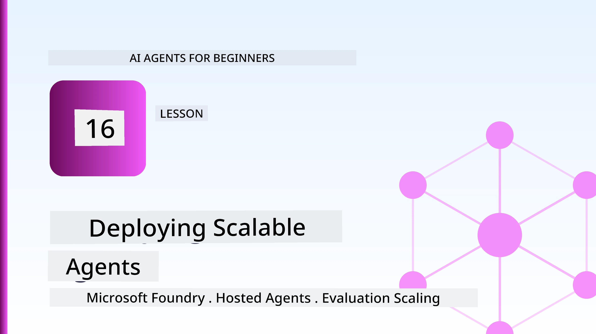
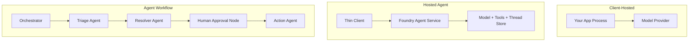
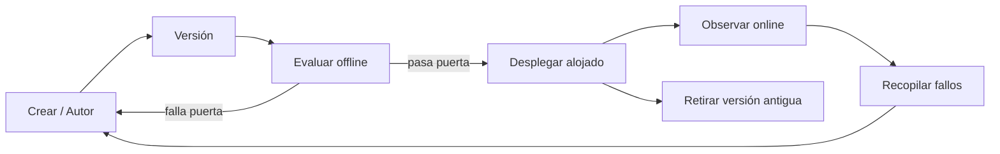
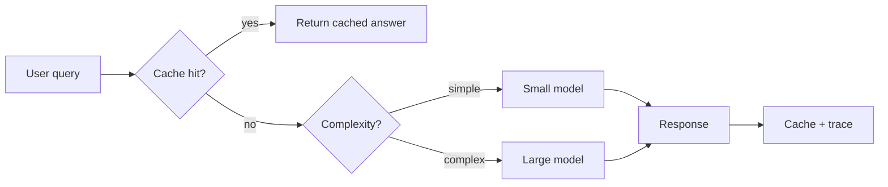
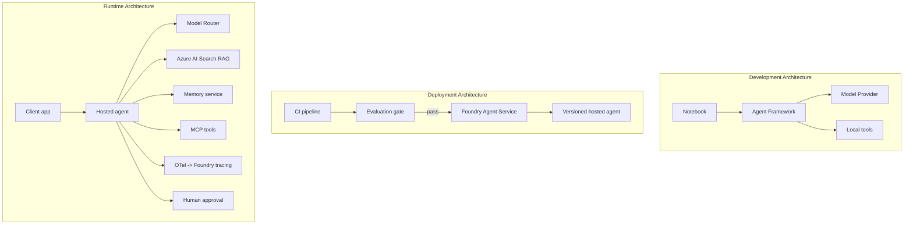

# Deploying Scalable Agents with Microsoft Foundry



Up to this point in the course you have built agents that run on your laptop, inside a notebook, driven by `az login` and a handful of environment variables. That is exactly the right way to learn. It is not the right way to run an agent that thousands of customers depend on at 3 a.m.

This lesson is about the gap between "it works on my machine" and "it works, reliably and affordably, in production." We close that gap using **Microsoft Foundry** and the **Microsoft Foundry Agent Service**, and we do it by building a real customer support agent that has tools, retrieval, memory, evaluation, and monitoring.

## Introduction

This lesson will cover:

- The difference between a **prototype agent** and a **deployed agent**, and why the transition is mostly about everything *around* the model.
- **Deployment patterns** for agents: client-hosted, service-hosted (Hosted Agents), and workflow-orchestrated.
- The **agent lifecycle** on Microsoft Foundry — create, version, deploy, evaluate, observe, retire.
- **Scaling strategies**: model routing, caching, concurrency, and stateless design.
- **Observability** with OpenTelemetry and Foundry tracing.
- **Cost optimisation** through model selection, routing, and evaluation gates.
- **Enterprise considerations**: governance, human approval, and running MCP servers safely in production.

## Learning Goals

After completing this lesson, you will know how to:

- Choose the right deployment pattern for a given agent workload.
- Deploy an agent to the Microsoft Foundry Agent Service so it is versioned, governed, and observable.
- Instrument an agent for tracing and wire up an evaluation pipeline that runs before every release.
- Apply model routing and caching to keep latency and cost under control at scale.
- Add a human approval gate for high-risk actions and integrate an MCP server in a production-safe way.

## Prerequisites

This lesson assumes you have completed the earlier lessons and are comfortable with:

- Building agents with the [Microsoft Agent Framework](../14-microsoft-agent-framework/README.md) (Lesson 14).
- [Tool Use](../04-tool-use/README.md) (Lesson 4) and [Agentic RAG](../05-agentic-rag/README.md) (Lesson 5).
- [Agent Memory](../13-agent-memory/README.md) (Lesson 13) and [Agentic Protocols / MCP](../11-agentic-protocols/README.md) (Lesson 11).
- [Observability and Evaluation](../10-ai-agents-production/README.md) (Lesson 10) — this lesson builds directly on it.

You will also need:

- An **Azure subscription** and a **Microsoft Foundry project** with at least one deployed chat model.
- The **Azure CLI** authenticated (`az login`).
- Python 3.12+ and the packages in the repository [`requirements.txt`](../../../requirements.txt).

## From Prototype to Production: What Actually Changes

A prototype agent and a production agent share the same core loop — reason, call tools, respond. What changes is everything wrapped around that loop. The model is maybe 20% of a production agent; the other 80% is the operational skeleton.

| Concern | Prototype | Production |
| --- | --- | --- |
| **Hosting** | Runs in your notebook | Runs as a hosted service, versioned and rolled out |
| **Identity** | Your `az login` token | Managed identity with scoped RBAC |
| **State** | In-memory, lost on restart | Externalised (thread store, memory service) |
| **Failure** | You see the traceback | Retries, fallbacks, dead-letter, alerts |
| **Cost** | "It's a few cents" | Tracked per request, routed, cached, budgeted |
| **Quality** | You eyeball the output | Evaluated automatically before every release |
| **Trust** | You approve every action | Policy + human-in-the-loop for risky actions |

Keep this table in mind. Every section below maps to one of these rows.

## Agent Deployment Patterns

There are three patterns you will use, often in combination.

### 1. Client-Hosted Agents

The agent object lives inside *your* application process. Your code calls the model provider directly; the reasoning loop runs in your service. This is what every previous lesson has done.

- **Use it when** you need full control over the loop, custom middleware, or you are embedding the agent inside an existing backend.
- **Trade-off**: you own scaling, state, and resilience yourself.

### 2. Hosted Agents (Foundry Agent Service)

The agent is *registered as a resource* in Microsoft Foundry. Foundry hosts the reasoning loop, stores threads, enforces content safety and RBAC, and makes the agent visible in the Foundry portal. Your app becomes a thin client that creates threads and reads responses.

- **Use it when** you want durability, built-in observability, governance, and less operational surface area.
- **Trade-off**: less low-level control in exchange for a managed runtime.

### 3. Agent Workflows

Multiple agents (and tools) are composed into a graph with explicit control flow — sequential steps, branching, human approval nodes, and durable checkpoints that can pause and resume. This is the Microsoft Agent Framework **Workflows** capability applied at deployment scale.

- **Use it when** a single task spans several specialised agents or requires an approval step in the middle.
- **Trade-off**: more moving parts; needs orchestration-level observability.



## The Agent Lifecycle on Microsoft Foundry

Deploying an agent is not a one-time `push`. It is a loop, and it looks a lot like a software release cycle because that is exactly what it is.



The key idea, carried over from [Lesson 10](../10-ai-agents-production/README.md): **offline evaluation is a gate, not an afterthought.** A new agent version does not ship unless it clears your evaluation thresholds. Online observability then feeds real-world failures back into your offline test set. That is the whole loop.

## Scaling Strategies

Scaling an agent is different from scaling a stateless web API, because each request can trigger multiple expensive model and tool calls. Four techniques carry most of the load.

**Stateless request handling.** Keep no per-user state in your process memory. Persist conversation threads in the Foundry thread store or a memory service so any instance can handle any request. This is what lets you scale horizontally — add instances, no sticky sessions.

**Model routing.** Not every request needs your most capable (and most expensive) model. Route simple requests — intent classification, short factual answers — to a small, fast model, and reserve the large model for genuine reasoning. Foundry's **Model Router** can do this for you, or you can implement a lightweight classifier yourself. You will build the DIY version in the lab.

**Response caching.** Many support queries are near-duplicates ("how do I reset my password?"). Cache answers to common questions and serve them without hitting the model at all. Even a modest cache hit rate meaningfully cuts cost and latency.

**Concurrency and backpressure.** Model providers have rate limits. Bound your concurrency, use retries with exponential backoff, and fail gracefully (a queued "we're on it" response beats a 500).



## Observability in Production

You cannot operate what you cannot see. As covered in Lesson 10, the Microsoft Agent Framework emits **OpenTelemetry** traces natively — every model call, tool invocation, and orchestration step becomes a span. In production you export those spans to Microsoft Foundry (or any OTel-compatible backend) so you can:

- Trace a single customer complaint end-to-end across every model and tool call.
- Watch p50/p95 latency and cost per request over time.
- Alert on error-rate spikes and cost anomalies before your users (or your finance team) notice.

```python
from agent_framework.observability import get_tracer

tracer = get_tracer()

with tracer.start_as_current_span("support_request") as span:
    span.set_attribute("customer.tier", "enterprise")
    span.set_attribute("routed.model", "gpt-4.1-mini")
    # agent execution is traced automatically inside this span
```

Attributes like `customer.tier` and `routed.model` are what turn a wall of traces into answerable questions ("are enterprise customers getting routed to the small model too often?").

## Cost Optimisation

Cost in production agents is dominated by tokens. Three levers, in order of impact:

1. **Right-size the model.** A small model that passes your evaluation gate is almost always cheaper than a large one that also passes. Use evaluation to *prove* the small model is good enough rather than defaulting to the biggest model out of caution.
2. **Route by complexity.** As above — pay large-model prices only for requests that need large-model reasoning.
3. **Cache aggressively.** The cheapest model call is the one you never make.

Evaluation gates and cost control are the same discipline viewed from two angles: evaluation tells you the *quality floor*, routing and caching keep you as close to that floor's *cost* as possible.

## Enterprise Deployment Considerations

**Governance.** Hosted Agents inherit Foundry's RBAC, content safety, and audit logging. Give each agent a managed identity with the least privilege it needs — read-only access to the knowledge base, scoped access to the ticketing API, nothing more.

**Human-in-the-loop.** Some actions are too consequential to automate outright — issuing a refund, deleting an account, escalating to a legal team. The Microsoft Agent Framework supports **approval-required** tools: the agent proposes the action, execution pauses, a human approves or rejects, and the workflow resumes. You saw the primitive in [Lesson 6](../06-building-trustworthy-agents/README.md); here you deploy it.

**MCP in production.** [MCP](../11-agentic-protocols/README.md) lets your agent consume external tools through a standard interface. In production, treat every MCP server as an untrusted boundary: pin the server version, run it with a scoped identity, validate its outputs, and never expose secrets to it. An MCP server is a dependency, and dependencies get patched, audited, and rate-limited.



Those three diagrams — development, deployment, runtime — are the same agent at three stages of its life. The lab that follows walks you through building it.

## Hands-On Lab: A Production-Ready Customer Support Agent

Open [`code_samples/16-python-agent-framework.ipynb`](./code_samples/16-python-agent-framework.ipynb) and work through it end to end. You will assemble a **Contoso customer support agent** with every production concern wired in:

1. **Tool calling** — look up order status and open support tickets.
2. **RAG** — answer policy questions from a knowledge base (Azure AI Search, with an in-memory fallback so the notebook runs without a Search resource).
3. **Memory** — remember the customer across turns of the conversation.
4. **Model routing** — a complexity classifier routes each request to a small or large model.
5. **Response caching** — repeated questions are served from cache.
6. **Human approval** — refunds above a threshold pause for human sign-off.
7. **Evaluation pipeline** — a small offline test set scores the agent and acts as a release gate.
8. **Observability** — OpenTelemetry tracing around every request.

### Walkthrough

The notebook is organised so each production concern is a self-contained, runnable section. The heart of it is the routing-plus-caching request handler:

```python
async def handle_support_request(query: str, customer_id: str) -> str:
    # 1. Serve from cache when we can.
    cached = response_cache.get(normalize(query))
    if cached:
        return cached

    # 2. Route by complexity to control cost.
    model = "gpt-4.1-mini" if is_simple(query) else "gpt-4.1"

    # 3. Run the agent inside a trace span for observability.
    with tracer.start_as_current_span("support_request") as span:
        span.set_attribute("routed.model", model)
        span.set_attribute("customer.id", customer_id)
        response = await support_agent.run(query, model=model)

    # 4. Cache and return.
    response_cache.set(normalize(query), response.text)
    return response.text
```

The evaluation gate that guards a release looks like this:

```python
async def evaluation_gate(agent, test_cases, threshold: float = 0.8) -> bool:
    passed = 0
    for case in test_cases:
        result = await agent.run(case["input"])
        if score_response(result.text, case["expected"]) >= 0.8:
            passed += 1
    pass_rate = passed / len(test_cases)
    print(f"Evaluation pass rate: {pass_rate:.0%} (gate: {threshold:.0%})")
    return pass_rate >= threshold  # only deploy if the gate passes
```

Read every line — the notebook keeps the primitives deliberately small so nothing is hidden behind a framework call.

## Validating a Deployed Agent with Smoke Tests

The evaluation gate above runs *offline* against your agent object. Once the agent is deployed as a Hosted Agent, you need one more, even cheaper check: **is the deployed endpoint actually answering?**

Deploying "successfully" only proves the control plane accepted the definition — it does not prove the agent responds. A missing dependency, a bad model routing, or an expired connection can leave a green deployment that returns nothing. A **smoke test** catches that in seconds, on every deploy, without the cost of a full evaluation.

This repository ships a ready-to-use smoke-test pipeline built on the [AI Smoke Test](https://github.com/marketplace/actions/ai-smoke-test) GitHub Action:

- **Catalog** — [`tests/lesson-16-smoke-tests.json`](../../../tests/lesson-16-smoke-tests.json) contains prompts and assertions for the Contoso support agent (grounded policy answers, an order lookup, staying on-topic, and multi-turn thread continuity). Catalogs for other lessons' agents live alongside it — see [`tests/README.md`](../tests/README.md).
- **Workflow** — [`.github/workflows/smoke-test.yml`](../../../.github/workflows/smoke-test.yml) logs in with Azure OIDC and POSTs each prompt to the agent's Responses endpoint, failing the job on any assertion miss.

```yaml
- name: Smoke-test hosted agent
  uses: JFolberth/ai-smoketest@v1
  with:
    project_endpoint: ${{ inputs.project_endpoint }}
    agent_name: ContosoSupportAgent
    tests_file: tests/lesson-16-smoke-tests.json
```


Run it from the **Actions** tab once your agent is deployed, supplying your Foundry project endpoint and agent name. The federated identity needs the **Azure AI User** role at Foundry project scope. Think of the layers as a pyramid: smoke tests (reachable and responding?) run on every deploy, offline evaluation (good enough to ship?) runs before promotion, and online evaluation (how is it doing in the wild?) runs continuously.

## Knowledge Check

Test your understanding before moving to the assignment.

**1. Roughly how much of a production agent is "the model," and what is the rest?**

<details>
<summary>Answer</summary>

The model is a minority of the system — often cited as around 20%. The rest is the operational skeleton: hosting and versioning, identity and RBAC, externalised state, failure handling, cost tracking, evaluation, and human-in-the-loop controls. Moving to production is mostly about building everything *around* the reasoning loop.
</details>

**2. When would you choose a Hosted Agent over a client-hosted agent?**

<details>
<summary>Answer</summary>

When you want a managed runtime with built-in durability (threads that persist and can resume), observability, content safety, and RBAC, and you are willing to trade some low-level control of the reasoning loop for less operational surface area. Client-hosted is preferable when you need full control over the loop or are embedding the agent in an existing backend.
</details>

**3. Why must a scalable agent be stateless in its own process memory?**

<details>
<summary>Answer</summary>

So any instance can handle any request, which is what allows horizontal scaling without sticky sessions. Per-user conversation state is externalised to a thread store or memory service. If state lived in process memory, you would lose it on restart and could not distribute load freely.
</details>

**4. What problem does model routing solve, and how does it relate to evaluation?**

<details>
<summary>Answer</summary>

Routing sends simple requests to a small, cheap, fast model and reserves the large model for genuine reasoning, controlling both latency and cost. It relates to evaluation because evaluation is what *proves* the small model is good enough for a class of requests — routing without evaluation is guessing.
</details>

**5. What is an "evaluation gate" and where does it sit in the lifecycle?**

<details>
<summary>Answer</summary>

An evaluation gate runs an offline test set against a new agent version and blocks deployment unless the pass rate clears a threshold. It sits between "version" and "deploy" in the lifecycle, making quality a precondition for release rather than something you check after shipping.
</details>

**6. Why should an MCP server be treated as an untrusted boundary in production?**

<details>
<summary>Answer</summary>

Because it is an external dependency your agent calls into. You should pin its version, run it with a scoped identity, validate its outputs, rate-limit it, and never expose secrets to it — the same discipline you apply to any third-party dependency. Its outputs flow into your agent's reasoning, so unvalidated trust is a security risk.
</details>

**7. Which single change usually has the biggest impact on production agent cost, and why?**

<details>
<summary>Answer</summary>

Right-sizing the model — using the smallest model that still passes your evaluation gate. Cost is dominated by tokens, and a smaller model that meets the quality bar is almost always cheaper than a larger one. Caching and routing then reduce cost further, but choosing the right base model has the largest first-order effect.
</details>

**8. What role do span attributes like `customer.tier` and `routed.model` play in observability?**

<details>
<summary>Answer</summary>

They turn raw traces into answerable business questions. Without attributes you have a wall of spans; with them you can ask "are enterprise customers being routed to the small model too often?" or "which model handles our slowest requests?" Attributes are how you slice telemetry by the dimensions that matter to your operation.
</details>

## Assignment

Take the customer support agent from the lab and harden it for a specific scenario: **a subscription billing support agent for a SaaS company.**

Your submission should:

1. **Replace the tools** with billing-relevant ones: `get_subscription_status`, `get_invoice`, and `issue_credit` (credits above $50 require human approval).
2. **Add three RAG documents** covering the company's refund policy, billing cycle, and cancellation policy.
3. **Extend the evaluation set** to at least eight cases, including at least two that *should* trigger the human-approval path, and confirm your evaluation gate correctly passes or fails.
4. **Add one cost report**: after running ten mixed queries through the agent, print how many went to the small model, how many to the large model, and how many were served from cache.

Write a short paragraph (in a markdown cell) explaining which model-routing rule you chose and how you would validate it with real traffic. There is no single correct answer — you are being assessed on whether the production concerns are wired together coherently.

## Summary

In this lesson you moved an agent from prototype to production with Microsoft Foundry:

- The jump to production is mostly about the **operational skeleton** around the model — hosting, identity, state, failure handling, cost, quality, and trust.
- You learned the three **deployment patterns** — client-hosted, Hosted Agents, and Agent Workflows — and when each fits.
- You walked the **agent lifecycle**, where offline **evaluation acts as a release gate** and online observability feeds failures back into the test set.
- You applied **scaling strategies** — stateless design, model routing, caching, and bounded concurrency — and connected them to **cost optimisation**.
- You wired in **enterprise controls**: RBAC, human-in-the-loop approval, and production-safe MCP integration.
- You built a **production-ready customer support agent** that ties every one of these concerns together in runnable code.

The next lesson takes the opposite journey: instead of scaling agents up into the cloud, you will bring them *down* onto a single developer machine and run them entirely locally.

## Additional Resources

- <a href="https://learn.microsoft.com/azure/ai-foundry/what-is-azure-ai-foundry" target="_blank">Microsoft Foundry documentation</a>
- <a href="https://learn.microsoft.com/azure/ai-foundry/agents/overview" target="_blank">Microsoft Foundry Agent Service overview</a>
- <a href="https://aka.ms/ai-agents-beginners/agent-framework" target="_blank">Microsoft Agent Framework</a>
- <a href="https://learn.microsoft.com/azure/ai-foundry/concepts/model-router" target="_blank">Model Router in Microsoft Foundry</a>
- <a href="https://learn.microsoft.com/azure/search/search-what-is-azure-search" target="_blank">Azure AI Search</a>
- <a href="https://opentelemetry.io/" target="_blank">OpenTelemetry</a>
- <a href="https://github.com/marketplace/actions/ai-smoke-test" target="_blank">AI Smoke Test GitHub Action</a>
- <a href="https://modelcontextprotocol.io/" target="_blank">Model Context Protocol (MCP)</a>

## Previous Lesson

[Building Computer Use Agents (CUA)](../15-browser-use/README.md)

## Next Lesson

[Creating Local AI Agents](../17-creating-local-ai-agents/README.md)

---

<!-- CO-OP TRANSLATOR DISCLAIMER START -->
**Disclaimer**:
This document has been translated using AI translation service [Co-op Translator](https://github.com/Azure/co-op-translator). While we strive for accuracy, please be aware that automated translations may contain errors or inaccuracies. The original document in its native language should be considered the authoritative source. For critical information, professional human translation is recommended. We are not liable for any misunderstandings or misinterpretations arising from the use of this translation.
<!-- CO-OP TRANSLATOR DISCLAIMER END -->