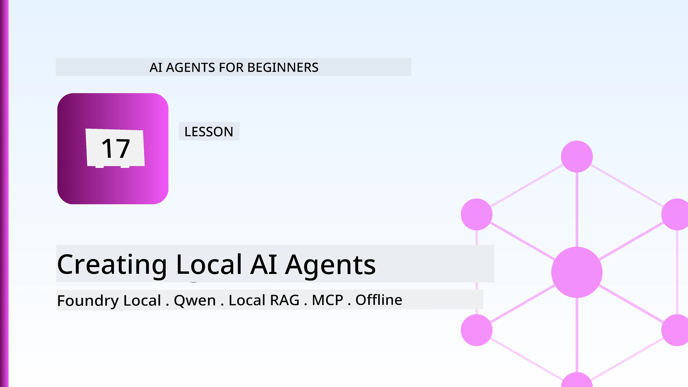
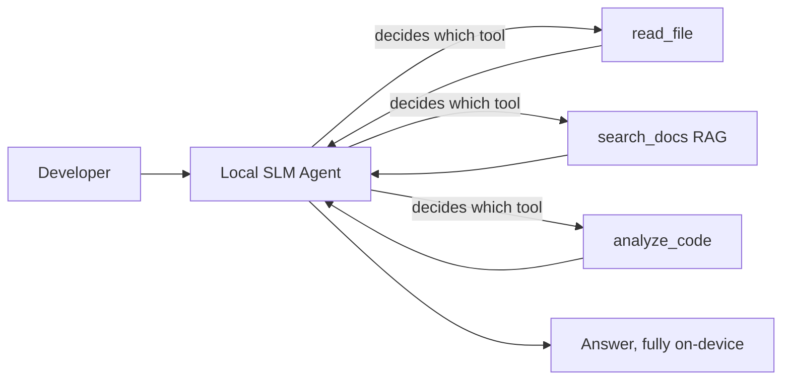
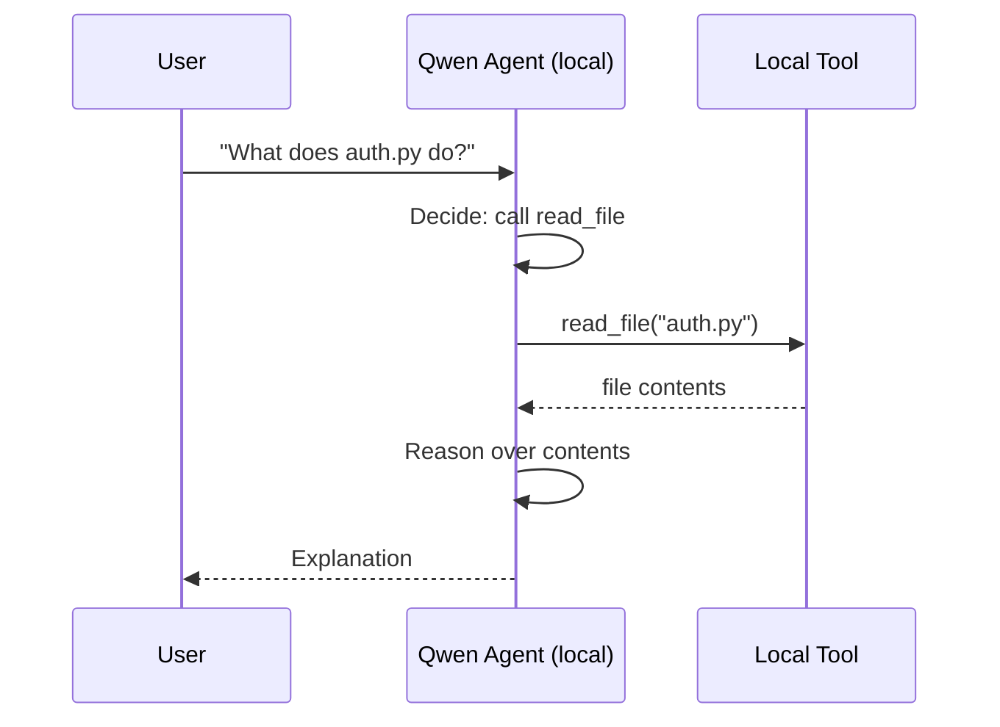
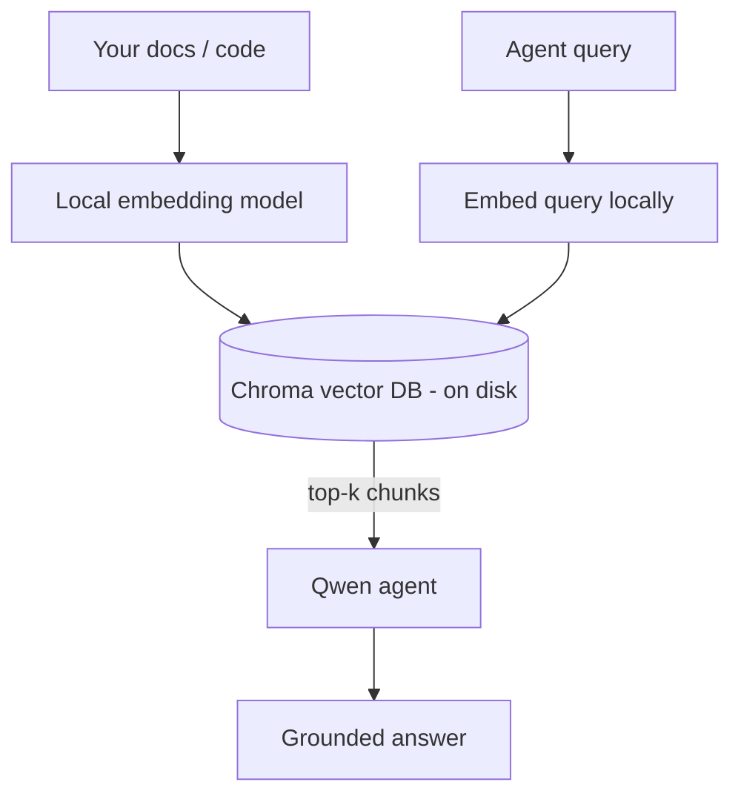
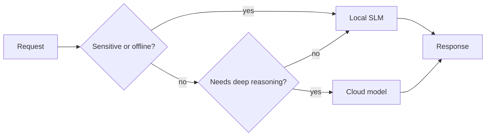

# Creating Local AI Agents Using Microsoft Foundry Local and Qwen



The previous lesson scaled agents *up* into the cloud. This one brings them *down* onto a single machine. By the end you will have a working engineering assistant that reasons, calls tools, reads your files, and searches your documentation — **without a single cloud inference call.**

Why would you want that? Three reasons that come up constantly in real engineering work:

- **Privacy.** The code and documents never leave the machine. No prompt, no snippet, no customer data crosses the network boundary.
- **Cost.** Local inference has no per-token bill. You can iterate all day for the price of electricity.
- **Offline.** On a plane, in a secure facility, or during an outage, the agent still works.

The catch is that you are trading a frontier cloud model for a **Small Language Model (SLM)** running on your CPU, GPU, or NPU. This lesson is about building agents that are *good* within that constraint rather than pretending the constraint isn't there.

## Introduction

This lesson will cover:

- **Small Language Models (SLMs)** — what they are, where they shine, and where they don't.
- **Microsoft Foundry Local** — a runtime that downloads and serves models on-device through an **OpenAI-compatible API**.
- **Qwen function-calling models** — SLMs that reliably produce tool calls, which is what makes local *agents* (not just local chat) possible.
- **Local tools, local RAG, and local MCP** — giving the agent capability without the cloud.
- **Hybrid patterns** — when to keep things local and when to reach for the cloud.

## Learning Goals

After completing this lesson, you will know how to:

- Explain the trade-offs of SLMs and pick appropriate local-agent use cases.
- Serve a Qwen model locally with Foundry Local and connect to it through the OpenAI-compatible endpoint.
- Build a tool-calling agent that runs entirely on your workstation.
- Add local RAG over your own documents using a local vector database (Chroma).
- Connect the agent to a local MCP server and reason about hybrid local/cloud designs.

## Prerequisites

This lesson assumes you have completed the earlier lessons and are comfortable with:

- [Tool Use](../04-tool-use/README.md) (Lesson 4) and [Agentic RAG](../05-agentic-rag/README.md) (Lesson 5).
- [Agentic Protocols / MCP](../11-agentic-protocols/README.md) (Lesson 11).
- The [Microsoft Agent Framework](../14-microsoft-agent-framework/README.md) (Lesson 14).

You will also need:

- A developer workstation. **8 GB RAM is a realistic minimum**; 16 GB+ is comfortable. A GPU or NPU helps but is not required.
- **Microsoft Foundry Local** installed (see the setup section below).
- Python 3.12+ and the packages in the repository [`requirements.txt`](../../../requirements.txt), plus `foundry-local-sdk`, `openai`, and `chromadb` for this lesson.

## Small Language Models: The Right Tool for Local Work

A frontier cloud model has hundreds of billions of parameters and a data centre behind it. An SLM has a few billion parameters and has to fit in your laptop's RAM. That difference sets clear expectations.

**SLMs are good at:**

- Structured, bounded tasks — classification, extraction, summarisation of a known document.
- **Tool calling** — deciding which function to call and with what arguments.
- Fast, cheap, private iteration on your own data.

**SLMs are weaker at:**

- Open-ended, multi-hop reasoning across large context.
- Broad world knowledge (they have seen less, and forget more).

The winning strategy for local agents is therefore: **let the SLM orchestrate, and let tools do the heavy lifting.** The model doesn't need to *know* your codebase — it needs to know when to call `read_file` and `search_docs`. That plays directly to an SLM's strengths.



## Microsoft Foundry Local

**Microsoft Foundry Local** is a lightweight runtime that downloads, manages, and serves models entirely on your machine. Its most important feature for us is that it exposes an **OpenAI-compatible HTTP endpoint** — which means the OpenAI SDK and the Microsoft Agent Framework's OpenAI client work against it with only a change of `base_url`. Everything you learned about building agents transfers directly; only the endpoint moves from the cloud to `localhost`.

Foundry Local also picks the best build of a model for your hardware automatically — a CPU build, a CUDA/GPU build, or an NPU build — so you don't hand-optimise per machine.

### Setup

Install Foundry Local (see the [documentation](https://learn.microsoft.com/azure/ai-foundry/foundry-local/) for your OS), then confirm it works:

```bash
# Install (example; follow the docs for your platform)
winget install Microsoft.FoundryLocal      # Windows
# brew install microsoft/foundrylocal/foundrylocal   # macOS

# Download and run a Qwen model, then start the local service
foundry model run qwen2.5-7b-instruct
foundry service status
```

Once the service is running you have a local, OpenAI-compatible endpoint (typically `http://localhost:PORT/v1`). The notebook uses the `foundry-local-sdk` to discover the endpoint automatically, so you don't have to hard-code the port.

## Qwen Function Calling: Why It Matters

An agent is only an agent if it can call tools. Many SLMs can chat but produce unreliable, malformed tool calls. **Qwen** models are trained for function calling and emit well-formed tool-call structures consistently — which is exactly what turns a local chat model into a local *agent*.

The flow is the standard tool-calling loop you already know, just running on-device:



## Local RAG

Documentation search is where local agents earn their keep. Instead of hoping the SLM memorised your framework's docs, you embed those docs into a **local vector database** and let the agent retrieve the relevant chunks on demand.

We use **Chroma**, an embedded vector store that runs in-process with no server to manage. The pipeline is entirely local: local embedding model → local vectors → local retrieval → local SLM.



This is the same Agentic RAG pattern from Lesson 5 — the only change is that every component runs on your machine.

## Local MCP Servers

[MCP](../11-agentic-protocols/README.md) is a transport, not a cloud service. An MCP server can run as a local process on `stdio`, exposing tools to your agent over the standard protocol. This lets you reuse the growing ecosystem of MCP servers — filesystem access, git operations, database queries — entirely offline.

The security posture is different from the cloud, but not absent: a local MCP server still runs with your user's permissions, so scope what it can touch (a project directory, not your whole home folder) and treat its outputs as inputs to validate.

## Hybrid Cloud-and-Local Patterns

Local-first does not mean local-only. Mature systems route by sensitivity and difficulty:

| Situation | Where it runs |
| --- | --- |
| Sensitive code / data, or offline | **Local SLM** |
| Simple, bounded task | **Local SLM** (cheap, fast) |
| Hard multi-hop reasoning on non-sensitive data | **Cloud model** |
| Everything, during an outage | **Local SLM** (graceful degradation) |

This mirrors the **model routing** idea from Lesson 16 — except one of the "models" is now your own machine. A robust design falls back to local when the cloud is unavailable, so the agent degrades in quality rather than failing outright.



## Hands-On Lab: A Local Engineering Assistant

Open [`code_samples/17-local-agent-foundry-local.ipynb`](./code_samples/17-local-agent-foundry-local.ipynb) and work through it. You will build a **local engineering assistant** that runs entirely on your workstation and can:

1. **Call tools** — via Qwen function calling through Foundry Local.
2. **Perform local file operations** — list and read files in a project directory.
3. **Analyse code** — report basic metrics on a source file.
4. **Search documentation** — local RAG over a docs folder with Chroma.
5. **Use MCP** — connect to a local MCP server (with a graceful skip if none is configured).

No cloud inference is used at any point.

### Walkthrough

The assistant connects to Foundry Local through the OpenAI-compatible endpoint, so the agent code looks almost identical to the cloud lessons — only the client changes:

```python
from foundry_local import FoundryLocalManager
from openai import OpenAI

# Foundry Local discovers/downloads the model and gives us a local endpoint.
manager = FoundryLocalManager(\"qwen2.5-7b-instruct\")
client = OpenAI(base_url=manager.endpoint, api_key=manager.api_key)  # api_key is a local placeholder
```

The tools are ordinary Python functions scoped to a project directory:

```python
def read_file(path: str) -> str:
    \"\"\"Read a file, but only inside the sandboxed project directory.\"\"\"
    full = (PROJECT_ROOT / path).resolve()
    if PROJECT_ROOT not in full.parents and full != PROJECT_ROOT:
        return \"Access denied: path is outside the project directory.\"
    return full.read_text(encoding=\"utf-8\")
```

Note the sandbox check — even locally, a tool that reads arbitrary paths is a liability. The notebook keeps every tool scoped to a single project root.

## Knowledge Check

Test your understanding before moving to the assignment.

**1. Give two concrete reasons to run an agent locally instead of in the cloud.**

<details>
<summary>Answer</summary>

Any two of: **privacy** (code and data never leave the machine), **cost** (no per-token inference bill), and **offline capability** (works with no network — on a plane, in a secure facility, or during an outage). Regulatory/compliance constraints that forbid sending data off-device are a common driver of the privacy reason.
</details>

**2. What is the recommended division of labour between an SLM and its tools in a local agent, and why?**

<details>
<summary>Answer</summary>

Let the SLM **orchestrate** (decide which tool to call and with what arguments) and let **tools do the heavy lifting** (reading files, retrieving docs, computing results). SLMs are strong at bounded decisions like tool selection but weaker at broad knowledge and long multi-hop reasoning, so leaning on tools plays to their strengths.
</details>

**3. What makes it possible to reuse cloud agent code with Foundry Local?**

<details>
<summary>Answer</summary>

Foundry Local exposes an **OpenAI-compatible HTTP endpoint**. The OpenAI SDK and the Agent Framework's OpenAI client work against it by changing only the `base_url` (and using a local placeholder API key). Everything else about the agent code stays the same.
</details>

**4. Why do we specifically use a Qwen function-calling model rather than any SLM?**

<details>
<summary>Answer</summary>

Because an agent must produce reliable, well-formed **tool calls**. Many SLMs can chat but emit malformed or inconsistent tool-call structures. Qwen models are trained for function calling and produce consistent tool calls, which is what turns a local chat model into a working local agent.
</details>

**5. In the local RAG pipeline, which components run on the machine?**

<details>
<summary>Answer</summary>

All of them: the embedding model, the vector database (Chroma, on disk), the retrieval step, and the SLM. Documents are embedded locally, stored locally, retrieved locally, and reasoned over by a local model — no component touches the cloud.
</details>

**6. A local MCP server runs on your machine. Does that make it automatically safe? What precaution should you still take?**

<details>
<summary>Answer</summary>

No. A local MCP server runs with your user's permissions, so it can touch anything you can. Scope it to what it needs (for example, a single project directory rather than your whole home folder) and treat its outputs as inputs to validate before acting on them.
</details>

**7. Describe a sensible hybrid routing rule that includes a local model.**

<details>
<summary>Answer</summary>

Route sensitive or offline requests to the local SLM; route simple bounded tasks to the local SLM for speed and cost; route hard multi-hop reasoning on non-sensitive data to a cloud model; and fall back to the local SLM if the cloud is unavailable so the agent degrades gracefully instead of failing. This is model routing (Lesson 16) with the local machine as one of the models.
</details>

**8. What is a realistic minimum RAM figure for running the local agent in this lesson, and what does more RAM buy you?**

<details>
<summary>Answer</summary>

Around **8 GB** is a realistic minimum; 16 GB+ is comfortable. More RAM lets you run larger, more capable models and keep more context in memory. A GPU or NPU speeds up inference but is not required — Foundry Local selects a CPU build when no accelerator is available.
</details>

## Assignment

Extend the local engineering assistant into a **local documentation reviewer** for a small project of your choice (use one of this repo's lesson folders if you like).

Your submission should:

1. **Index a real docs/code folder** into Chroma (at least five files).
2. **Add a `find_todos` tool** that scans the project for `TODO`/`FIXME` comments and returns them with file and line number — keeping the same sandbox check as `read_file`.

3. **Ask the agent three questions** that force it to combine tools: one pure RAG question, one that requires reading a specific file, and one that requires finding TODOs.
4. **Measure it**: time each of the three responses and note them in a markdown cell. Comment on whether the latency is acceptable for your intended workflow.

Then write a short paragraph on **what you would move to the cloud and what you would keep local** for this reviewer, and why. You are assessed on whether the local components are wired together correctly and whether your hybrid reasoning is sound — not on model quality.

## Summary

In this lesson you built an agent that runs entirely on your own machine:

- **SLMs** trade breadth for privacy, cost, and offline operation — and shine when they **orchestrate tools** rather than carry all the knowledge themselves.
- **Foundry Local** serves models on-device behind an **OpenAI-compatible endpoint**, so your cloud agent code transfers with a one-line change.
- **Qwen function-calling models** make reliable local tool calling — and therefore local *agents* — possible.
- **Local RAG** (Chroma) and **local MCP** give the agent capability without leaving the machine.
- **Hybrid patterns** let you route by sensitivity and difficulty, with local as a graceful fallback.

This completes the deployment arc: Lesson 16 scaled agents up into Microsoft Foundry, and this lesson scaled them down onto a single workstation. The next lesson turns to keeping deployed agents secure.

## Additional Resources

- <a href="https://learn.microsoft.com/azure/ai-foundry/foundry-local/" target="_blank">Microsoft Foundry Local documentation</a>
- <a href="https://learn.microsoft.com/azure/ai-foundry/what-is-azure-ai-foundry" target="_blank">Microsoft Foundry documentation</a>
- <a href="https://aka.ms/ai-agents-beginners/agent-framework" target="_blank">Microsoft Agent Framework</a>
- <a href="https://qwen.readthedocs.io/en/latest/framework/function_call.html" target="_blank">Qwen function calling documentation</a>
- <a href="https://modelcontextprotocol.io/" target="_blank">Model Context Protocol (MCP)</a>
- <a href="https://docs.trychroma.com/" target="_blank">Chroma vector database</a>

## Previous Lesson

[Deploying Scalable Agents](../16-deploying-scalable-agents/README.md)

## Next Lesson

[Securing AI Agents](../18-securing-ai-agents/README.md)

---

<!-- CO-OP TRANSLATOR DISCLAIMER START -->
**Disclaimer**:
This document has been translated using AI translation service [Co-op Translator](https://github.com/Azure/co-op-translator). While we strive for accuracy, please be aware that automated translations may contain errors or inaccuracies. The original document in its native language should be considered the authoritative source. For critical information, professional human translation is recommended. We are not liable for any misunderstandings or misinterpretations arising from the use of this translation.
<!-- CO-OP TRANSLATOR DISCLAIMER END -->