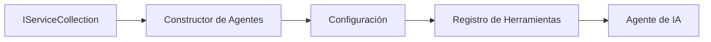

# 🎨 Patrones de Diseño Agéntico con Azure OpenAI (API de Respuestas) (.NET)

## 📋 Objetivos de Aprendizaje

Este ejemplo demuestra patrones de diseño de nivel empresarial para construir agentes inteligentes utilizando el Marco de Agentes de Microsoft en .NET con integración de Azure OpenAI (API de Respuestas). Aprenderás patrones profesionales y enfoques arquitectónicos que hacen que los agentes estén listos para producción, sean mantenibles y escalables.

### Patrones de Diseño Empresarial

- 🏭 **Patrón Factory**: Creación de agentes estandarizada con inyección de dependencias
- 🔧 **Patrón Builder**: Configuración y preparación fluida del agente
- 🧵 **Patrones Thread-Safe**: Gestión concurrente de conversaciones
- 📋 **Patrón Repository**: Gestión organizada de herramientas y capacidades

## 🎯 Beneficios Arquitectónicos Específicos de .NET

### Características Empresariales

- **Tipado Fuerte**: Validación en tiempo de compilación y soporte de IntelliSense
- **Inyección de Dependencias**: Integración con contenedor DI incorporado
- **Gestión de Configuración**: Patrones IConfiguration y Options
- **Async/Await**: Soporte de programación asíncrona de primera clase

### Patrones Listos para Producción

- **Integración de Registro**: ILogger y soporte para registros estructurados
- **Health Checks**: Monitoreo y diagnósticos incorporados
- **Validación de Configuración**: Tipado fuerte con anotaciones de datos
- **Manejo de Errores**: Gestión estructurada de excepciones

## 🔧 Arquitectura Técnica

### Componentes Centrales de .NET

- **Microsoft.Extensions.AI**: Abstracciones unificadas de servicios de IA
- **Microsoft.Agents.AI**: Marco de orquestación empresarial para agentes
- **Azure OpenAI (API de Respuestas)**: Patrones de cliente API de alto rendimiento
- **Sistema de Configuración**: appsettings.json e integración con el entorno

### Implementación de Patrones de Diseño



## 🏗️ Patrones Empresariales Demostrados

### 1. **Patrones Creacionales**

- **Fábrica de Agentes**: Creación centralizada de agentes con configuración consistente
- **Patrón Builder**: API fluida para configuración compleja del agente
- **Patrón Singleton**: Gestión compartida de recursos y configuración
- **Inyección de Dependencias**: Acoplamiento débil y testabilidad

### 2. **Patrones de Comportamiento**

- **Patrón Strategy**: Estrategias intercambiables para ejecución de herramientas
- **Patrón Command**: Operaciones encapsuladas del agente con deshacer/rehacer
- **Patrón Observer**: Gestión del ciclo de vida del agente basada en eventos
- **Método Plantilla**: Flujos de trabajo estandarizados para ejecución del agente

### 3. **Patrones Estructurales**

- **Patrón Adapter**: Capa de integración de Azure OpenAI (API de Respuestas)
- **Patrón Decorator**: Mejora de capacidades del agente
- **Patrón Fachada**: Interfaces simplificadas de interacción con el agente
- **Patrón Proxy**: Carga diferida y caching para rendimiento

## 📚 Principios de Diseño .NET

### Principios SOLID

- **Responsabilidad Única**: Cada componente tiene un propósito claro
- **Abierto/Cerrado**: Extensible sin modificaciones
- **Sustitución de Liskov**: Implementaciones basadas en interfaces
- **Segregación de Interfaces**: Interfaces enfocadas y cohesionadas
- **Inversión de Dependencias**: Depender de abstracciones, no de concreciones

### Arquitectura Limpia

- **Capa de Dominio**: Abstracciones principales de agente y herramientas
- **Capa de Aplicación**: Orquestación de agentes y flujos de trabajo
- **Capa de Infraestructura**: Integración de Azure OpenAI (API de Respuestas) y servicios externos
- **Capa de Presentación**: Interacción con usuario y formato de respuestas

## 🔒 Consideraciones Empresariales

### Seguridad

- **Gestión de Credenciales**: Manejo seguro de claves API con IConfiguration
- **Validación de Entradas**: Tipado fuerte y validación con anotaciones de datos
- **Saneamiento de Salidas**: Procesamiento y filtrado seguro de respuestas
- **Registro de Auditoría**: Seguimiento completo de operaciones

### Rendimiento

- **Patrones Asíncronos**: Operaciones de I/O no bloqueantes
- **Pooling de Conexiones**: Gestión eficiente del cliente HTTP
- **Caching**: Caching de respuestas para mejorar rendimiento
- **Gestión de Recursos**: Patrones adecuados de disposición y limpieza

### Escalabilidad

- **Seguridad en Concurrencia**: Soporte para ejecución concurrente de agentes
- **Pooling de Recursos**: Utilización eficiente de recursos
- **Gestión de Carga**: Limitación de tasa y manejo de presión
- **Monitoreo**: Métricas de rendimiento y verificaciones de salud

## 🚀 Despliegue en Producción

- **Gestión de Configuración**: Configuraciones específicas por entorno
- **Estrategia de Registro**: Registro estructurado con IDs de correlación
- **Manejo de Errores**: Manejo global de excepciones con recuperación adecuada
- **Monitoreo**: Application Insights y contadores de rendimiento
- **Pruebas**: Patrones de pruebas unitarias, de integración y de carga

¿Listo para construir agentes inteligentes de nivel empresarial con .NET? ¡Architectemos algo robusto! 🏢✨

## 🚀 Comenzando

### Requisitos Previos

- [SDK de .NET 10](https://dotnet.microsoft.com/download/dotnet/10.0) o superior
- Una [suscripción de Azure](https://azure.microsoft.com/free/) con un recurso Azure OpenAI y un despliegue de modelo
- La [CLI de Azure](https://learn.microsoft.com/cli/azure/install-azure-cli) — iniciar sesión con `az login`

### Variables de Entorno Requeridas

```bash
# zsh/bash
export AZURE_OPENAI_ENDPOINT=https://<your-resource>.openai.azure.com
export AZURE_OPENAI_DEPLOYMENT=gpt-5-mini
# Luego inicie sesión para que AzureCliCredential pueda obtener un token
az login
```

```powershell
# PowerShell
$env:AZURE_OPENAI_ENDPOINT = "https://<your-resource>.openai.azure.com"
$env:AZURE_OPENAI_DEPLOYMENT = "gpt-5-mini"
# Luego inicie sesión para que AzureCliCredential pueda obtener un token
az login
```

### Código de Ejemplo

Para ejecutar el código de ejemplo,

```bash
# zsh/bash
chmod +x ./03-dotnet-agent-framework.cs
./03-dotnet-agent-framework.cs
```

O usando la CLI de dotnet:

```bash
dotnet run ./03-dotnet-agent-framework.cs
```

Consulta [`03-dotnet-agent-framework.cs`](../../../../03-agentic-design-patterns/code_samples/03-dotnet-agent-framework.cs) para el código completo.

```csharp
#!/usr/bin/dotnet run

#:package Microsoft.Extensions.AI@10.*
#:package Microsoft.Agents.AI.OpenAI@1.*-*
#:package Azure.AI.OpenAI@2.1.0
#:package Azure.Identity@1.13.1

using System.ComponentModel;

using Microsoft.Agents.AI;
using Microsoft.Extensions.AI;

using Azure.AI.OpenAI;
using Azure.Identity;

// Tool Function: Random Destination Generator
// This static method will be available to the agent as a callable tool
// The [Description] attribute helps the AI understand when to use this function
// This demonstrates how to create custom tools for AI agents
[Description("Provides a random vacation destination.")]
static string GetRandomDestination()
{
    // List of popular vacation destinations around the world
    // The agent will randomly select from these options
    var destinations = new List<string>
    {
        "Paris, France",
        "Tokyo, Japan",
        "New York City, USA",
        "Sydney, Australia",
        "Rome, Italy",
        "Barcelona, Spain",
        "Cape Town, South Africa",
        "Rio de Janeiro, Brazil",
        "Bangkok, Thailand",
        "Vancouver, Canada"
    };

    // Generate random index and return selected destination
    // Uses System.Random for simple random selection
    var random = new Random();
    int index = random.Next(destinations.Count);
    return destinations[index];
}

// Azure OpenAI with the Responses API (stable v1 endpoint). Sign in with `az login`.
var azureEndpoint = Environment.GetEnvironmentVariable("AZURE_OPENAI_ENDPOINT")
    ?? throw new InvalidOperationException("AZURE_OPENAI_ENDPOINT is not set.");
var deployment = Environment.GetEnvironmentVariable("AZURE_OPENAI_DEPLOYMENT") ?? "gpt-5-mini";

var azureClient = new AzureOpenAIClient(new Uri(azureEndpoint), new AzureCliCredential());

// Define Agent Identity and Comprehensive Instructions
// Agent name for identification and logging purposes
var AGENT_NAME = "TravelAgent";

// Detailed instructions that define the agent's personality, capabilities, and behavior
// This system prompt shapes how the agent responds and interacts with users
var AGENT_INSTRUCTIONS = """
You are a helpful AI Agent that can help plan vacations for customers.

Important: When users specify a destination, always plan for that location. Only suggest random destinations when the user hasn't specified a preference.

When the conversation begins, introduce yourself with this message:
"Hello! I'm your TravelAgent assistant. I can help plan vacations and suggest interesting destinations for you. Here are some things you can ask me:
1. Plan a day trip to a specific location
2. Suggest a random vacation destination
3. Find destinations with specific features (beaches, mountains, historical sites, etc.)
4. Plan an alternative trip if you don't like my first suggestion

What kind of trip would you like me to help you plan today?"

Always prioritize user preferences. If they mention a specific destination like "Bali" or "Paris," focus your planning on that location rather than suggesting alternatives.
""";

// Create AI Agent with Advanced Travel Planning Capabilities
// Get the Responses client for the deployment and create the AI agent
// Configure agent with name, detailed instructions, and available tools
// This demonstrates the .NET agent creation pattern with full configuration
AIAgent agent = azureClient
    .GetChatClient(deployment)
    .AsAIAgent(
        name: AGENT_NAME,
        instructions: AGENT_INSTRUCTIONS,
        tools: [AIFunctionFactory.Create(GetRandomDestination)]
    );

// Create New Conversation Session for Context Management
// Initialize a new conversation session to maintain context across multiple interactions
// Sessions enable the agent to remember previous exchanges and maintain conversational state
// This is essential for multi-turn conversations and contextual understanding
var session = await agent.CreateSessionAsync();

// Execute Agent: First Travel Planning Request
// Run the agent with an initial request that will likely trigger the random destination tool
// The agent will analyze the request, use the GetRandomDestination tool, and create an itinerary
// Using the session parameter maintains conversation context for subsequent interactions
await foreach (var update in agent.RunStreamingAsync("Plan me a day trip", session))
{
    await Task.Delay(10);
    Console.Write(update);
}

Console.WriteLine();

// Execute Agent: Follow-up Request with Context Awareness
// Demonstrate contextual conversation by referencing the previous response
// The agent remembers the previous destination suggestion and will provide an alternative
// This showcases the power of conversation sessions and contextual understanding in .NET agents
await foreach (var update in agent.RunStreamingAsync("I don't like that destination. Plan me another vacation.", session))
{
    await Task.Delay(10);
    Console.Write(update);
}
```

---

<!-- CO-OP TRANSLATOR DISCLAIMER START -->
**Descargo de responsabilidad**:
Este documento ha sido traducido utilizando el servicio de traducción automática [Co-op Translator](https://github.com/Azure/co-op-translator). Aunque nos esforzamos por la precisión, tenga en cuenta que las traducciones automatizadas pueden contener errores o inexactitudes. El documento original en su idioma nativo debe considerarse la fuente autorizada. Para información crítica, se recomienda una traducción profesional humana. No somos responsables de cualquier malentendido o interpretación errónea que surja del uso de esta traducción.
<!-- CO-OP TRANSLATOR DISCLAIMER END -->