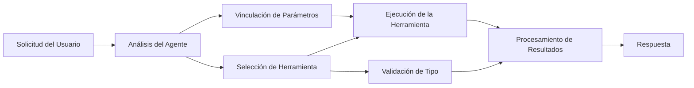

# 🛠️ Uso avanzado de herramientas con Azure OpenAI (Responses API) (.NET)

## 📋 Objetivos de aprendizaje

Este cuaderno demuestra patrones de integración de herramientas a nivel empresarial usando el Microsoft Agent Framework en .NET con Azure OpenAI (Responses API). Aprenderás a construir agentes sofisticados con múltiples herramientas especializadas, aprovechando la tipificación fuerte de C# y las características empresariales de .NET.

### Capacidades avanzadas de herramientas que dominarás

- 🔧 **Arquitectura multi-herramienta**: Construcción de agentes con múltiples capacidades especializadas
- 🎯 **Ejecución de herramientas con seguridad de tipo**: Aprovechando la validación en tiempo de compilación de C#
- 📊 **Patrones empresariales de herramientas**: Diseño de herramientas listas para producción y manejo de errores
- 🔗 **Composición de herramientas**: Combinando herramientas para flujos de trabajo empresariales complejos

## 🎯 Beneficios de la arquitectura de herramientas en .NET

### Características empresariales de herramientas

- **Validación en tiempo de compilación**: La tipificación fuerte asegura la corrección de los parámetros de las herramientas
- **Inyección de dependencias**: Integración de contenedores IoC para la gestión de herramientas
- **Patrones Async/Await**: Ejecución no bloqueante de herramientas con una correcta gestión de recursos
- **Registro estructurado**: Integración incorporada de logging para monitoreo de la ejecución de herramientas

### Patrones listos para producción

- **Manejo de excepciones**: Gestión exhaustiva de errores con excepciones tipadas
- **Gestión de recursos**: Patrones adecuados de disposición y manejo de memoria
- **Monitoreo de rendimiento**: Métricas y contadores de rendimiento integrados
- **Gestión de configuración**: Configuración segura con validación

## 🔧 Arquitectura técnica

### Componentes principales de herramientas en .NET

- **Microsoft.Extensions.AI**: Capa unificada de abstracción de herramientas
- **Microsoft.Agents.AI**: Orquestación de herramientas a nivel empresarial
- **Azure OpenAI (Responses API)**: Cliente API de alto rendimiento con agrupación de conexiones

### Pipeline de ejecución de herramientas



## 🛠️ Categorías y patrones de herramientas

### 1. **Herramientas de procesamiento de datos**

- **Validación de entrada**: Tipificación fuerte con anotaciones de datos
- **Operaciones de transformación**: Conversión y formateo de datos con seguridad de tipo
- **Lógica de negocio**: Herramientas de cálculo y análisis específicos del dominio
- **Formateo de salida**: Generación estructurada de respuestas

### 2. **Herramientas de integración**

- **Conectores API**: Integración de servicios RESTful con HttpClient
- **Herramientas de bases de datos**: Integración con Entity Framework para acceso a datos
- **Operaciones de archivos**: Operaciones seguras en el sistema de archivos con validación
- **Servicios externos**: Patrones de integración con servicios de terceros

### 3. **Herramientas utilitarias**

- **Procesamiento de texto**: Utilidades para manipulación y formateo de cadenas
- **Operaciones de fecha/hora**: Cálculos de fecha/hora con consciencia cultural
- **Herramientas matemáticas**: Cálculos de precisión y operaciones estadísticas
- **Herramientas de validación**: Validación de reglas de negocio y verificación de datos

¿Listo para construir agentes a nivel empresarial con potentes capacidades de herramientas con seguridad de tipo en .NET? ¡Vamos a diseñar soluciones de nivel profesional! 🏢⚡

## 🚀 Comenzando

### Requisitos previos

- [.NET 10 SDK](https://dotnet.microsoft.com/download/dotnet/10.0) o superior
- Una [suscripción de Azure](https://azure.microsoft.com/free/) con un recurso Azure OpenAI y un despliegue de modelo
- La [CLI de Azure](https://learn.microsoft.com/cli/azure/install-azure-cli) — inicia sesión con `az login`

### Variables de entorno requeridas

```bash
# zsh/bash
export AZURE_OPENAI_ENDPOINT=https://<your-resource>.openai.azure.com
export AZURE_OPENAI_DEPLOYMENT=gpt-5-mini
# Luego inicia sesión para que AzureCliCredential pueda obtener un token
az login
```

```powershell
# PowerShell
$env:AZURE_OPENAI_ENDPOINT = "https://<your-resource>.openai.azure.com"
$env:AZURE_OPENAI_DEPLOYMENT = "gpt-5-mini"
# Luego inicia sesión para que AzureCliCredential pueda obtener un token
az login
```

### Código de ejemplo

Para ejecutar el ejemplo de código,

```bash
# zsh/bash
chmod +x ./04-dotnet-agent-framework.cs
./04-dotnet-agent-framework.cs
```

O usando la CLI de dotnet:

```bash
dotnet run ./04-dotnet-agent-framework.cs
```

Consulta [`04-dotnet-agent-framework.cs`](../../../../04-tool-use/code_samples/04-dotnet-agent-framework.cs) para el código completo.

```csharp
#!/usr/bin/dotnet run

#:package Microsoft.Extensions.AI@10.*
#:package Microsoft.Agents.AI.OpenAI@1.*-*
#:package Azure.AI.OpenAI@2.1.0
#:package Azure.Identity@1.13.1

using System.ComponentModel;

using Microsoft.Agents.AI;
using Microsoft.Extensions.AI;

using Azure.AI.OpenAI;
using Azure.Identity;

// Tool Function: Random Destination Generator
// This static method will be available to the agent as a callable tool
// The [Description] attribute helps the AI understand when to use this function
// This demonstrates how to create custom tools for AI agents
[Description("Provides a random vacation destination.")]
static string GetRandomDestination()
{
    // List of popular vacation destinations around the world
    // The agent will randomly select from these options
    var destinations = new List<string>
    {
        "Paris, France",
        "Tokyo, Japan",
        "New York City, USA",
        "Sydney, Australia",
        "Rome, Italy",
        "Barcelona, Spain",
        "Cape Town, South Africa",
        "Rio de Janeiro, Brazil",
        "Bangkok, Thailand",
        "Vancouver, Canada"
    };

    // Generate random index and return selected destination
    // Uses System.Random for simple random selection
    var random = new Random();
    int index = random.Next(destinations.Count);
    return destinations[index];
}

// Azure OpenAI with the Responses API (stable v1 endpoint). Sign in with `az login`.
var azureEndpoint = Environment.GetEnvironmentVariable("AZURE_OPENAI_ENDPOINT")
    ?? throw new InvalidOperationException("AZURE_OPENAI_ENDPOINT is not set.");
var deployment = Environment.GetEnvironmentVariable("AZURE_OPENAI_DEPLOYMENT") ?? "gpt-5-mini";

var azureClient = new AzureOpenAIClient(new Uri(azureEndpoint), new AzureCliCredential());

// Define Agent Identity and Comprehensive Instructions
// Agent name for identification and logging purposes
var AGENT_NAME = "TravelAgent";

// Detailed instructions that define the agent's personality, capabilities, and behavior
// This system prompt shapes how the agent responds and interacts with users
var AGENT_INSTRUCTIONS = """
You are a helpful AI Agent that can help plan vacations for customers.

Important: When users specify a destination, always plan for that location. Only suggest random destinations when the user hasn't specified a preference.

When the conversation begins, introduce yourself with this message:
"Hello! I'm your TravelAgent assistant. I can help plan vacations and suggest interesting destinations for you. Here are some things you can ask me:
1. Plan a day trip to a specific location
2. Suggest a random vacation destination
3. Find destinations with specific features (beaches, mountains, historical sites, etc.)
4. Plan an alternative trip if you don't like my first suggestion

What kind of trip would you like me to help you plan today?"

Always prioritize user preferences. If they mention a specific destination like "Bali" or "Paris," focus your planning on that location rather than suggesting alternatives.
""";

// Create AI Agent with Advanced Travel Planning Capabilities
// Get the Responses client for the deployment and create the AI agent
// Configure agent with name, detailed instructions, and available tools
// This demonstrates the .NET agent creation pattern with full configuration
AIAgent agent = azureClient
    .GetChatClient(deployment)
    .AsAIAgent(
        name: AGENT_NAME,
        instructions: AGENT_INSTRUCTIONS,
        tools: [AIFunctionFactory.Create(GetRandomDestination)]
    );

// Create New Conversation Session for Context Management
// Initialize a new conversation session to maintain context across multiple interactions
// Sessions enable the agent to remember previous exchanges and maintain conversational state
// This is essential for multi-turn conversations and contextual understanding
await using var session = await agent.CreateSessionAsync();

// Execute Agent: First Travel Planning Request
// Run the agent with an initial request that will likely trigger the random destination tool
// The agent will analyze the request, use the GetRandomDestination tool, and create an itinerary
// Using the session parameter maintains conversation context for subsequent interactions
await foreach (var update in agent.RunStreamingAsync("Plan me a day trip", session))
{
    await Task.Delay(10);
    Console.Write(update);
}

Console.WriteLine();

// Execute Agent: Follow-up Request with Context Awareness
// Demonstrate contextual conversation by referencing the previous response
// The agent remembers the previous destination suggestion and will provide an alternative
// This showcases the power of conversation sessions and contextual understanding in .NET agents
await foreach (var update in agent.RunStreamingAsync("I don't like that destination. Plan me another vacation.", session))
{
    await Task.Delay(10);
    Console.Write(update);
}
```

---

<!-- CO-OP TRANSLATOR DISCLAIMER START -->
**Descargo de responsabilidad**:
Este documento ha sido traducido utilizando el servicio de traducción automática [Co-op Translator](https://github.com/Azure/co-op-translator). Aunque nos esforzamos por la precisión, tenga en cuenta que las traducciones automatizadas pueden contener errores o inexactitudes. El documento original en su idioma nativo debe considerarse la fuente autorizada. Para información crítica, se recomienda una traducción profesional humana. No somos responsables de cualquier malentendido o interpretación errónea que surja del uso de esta traducción.
<!-- CO-OP TRANSLATOR DISCLAIMER END -->