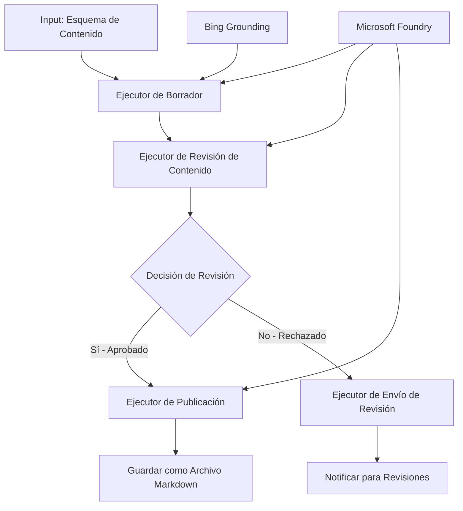

# 🔀 Flujos de trabajo condicionales de agentes con Microsoft Foundry (.NET)

## 📋 Tutorial de flujo de trabajo inteligente basado en decisiones

Este cuaderno demuestra **patrones de flujo de trabajo condicional** usando Microsoft Foundry y el Microsoft Agent Framework para .NET. Aprenderás a construir flujos de trabajo sofisticados, impulsados por decisiones, que enrutan inteligentemente el procesamiento basado en análisis de IA, reglas de negocio y condiciones dinámicas para automatización de nivel empresarial.

## 🎯 Objetivos de aprendizaje

### 🧠 **Arquitectura de decisiones inteligentes**
- **Implementación de lógica condicional**: Construir árboles de decisiones complejos con múltiples puntos de ramificación
- **Enrutamiento potenciado por IA**: Usar modelos de Microsoft Foundry para tomar decisiones de enrutamiento inteligentes
- **Adaptación dinámica del flujo de trabajo**: Modificar el comportamiento del flujo de trabajo basado en análisis y condiciones en tiempo de ejecución
- **Integración de reglas empresariales**: Incorporar lógica de negocio y requisitos de cumplimiento en los flujos de trabajo

### 🔀 **Patrones condicionales avanzados**
- **Toma de decisiones multicitérica**: Evaluar múltiples factores para decisiones de enrutamiento
- **Procesamiento contextual**: Tomar decisiones basadas en el contexto y el historial acumulado del flujo de trabajo
- **Modificación adaptativa del flujo de trabajo**: Ajustar dinámicamente las rutas de procesamiento según condiciones en tiempo real
- **Integración de motor de reglas**: Implementar motores avanzados de reglas empresariales dentro de los flujos de trabajo

### 🏢 **Aplicaciones condicionales empresariales**
- **Clasificación y enrutamiento de documentos**: Clasificar y enrutar automáticamente documentos hacia flujos de trabajo apropiados
- **Triaje de servicio al cliente**: Enrutamiento inteligente de consultas de clientes a equipos especializados
- **Procesamiento de cumplimiento y riesgos**: Aplicar diferentes procesos de validación y revisión en función de la evaluación de riesgos
- **Flujos de trabajo de aseguramiento de calidad**: Rutar contenido a través de procesos de revisión según métricas de calidad

## ⚙️ Prerrequisitos y configuración

### 📦 **Paquetes NuGet requeridos**

Paquetes avanzados para procesamiento condicional de flujos de trabajo:

```xml
<!-- Core AI Framework -->
<PackageReference Include="Microsoft.Extensions.AI" Version="9.9.0" />

<!-- Azure AI Agents with Persistent State -->
<PackageReference Include="Azure.AI.Agents.Persistent" Version="1.2.0-beta.5" />

<!-- Azure Identity and Utilities -->
<PackageReference Include="Azure.Identity" Version="1.15.0" />
<PackageReference Include="System.Linq.Async" Version="6.0.3" />
<PackageReference Include="DotNetEnv" Version="3.1.1" />

<!-- Local Workflow Framework References -->
<!-- Microsoft.Agents.Workflows.dll - Advanced workflow orchestration -->
<!-- Microsoft.Agents.AI.AzureAI.dll - Microsoft Foundry integration -->
<!-- Microsoft.Agents.AI.dll - Core agent abstractions -->
```

### 🔑 **Configuración de Microsoft Foundry**

**Recursos de Azure requeridos:**
- Espacio de trabajo Microsoft Foundry con modelos de procesamiento condicional
- Suscripción de Azure con cuotas y permisos de cómputo adecuados
- Modelos de IA desplegados para toma de decisiones y análisis de contenido
- (Opcional) Conexión API Bing Search para capacidades de fundamentación

**Configuración del entorno (archivo .env):**
```env
# Microsoft Foundry Configuration
AZURE_AI_PROJECT_ENDPOINT=https://your-project.cognitiveservices.azure.com/
BING_CONNECTION_ID=your-bing-connection-id
```

**Configuración de autenticación:**
```csharp
// Azure CLI or Managed Identity authentication
using Azure.Identity;
var credential = new AzureCliCredential();

// Load environment configuration
DotNetEnv.Env.Load("../../../.env");
```

### 🏗️ **Arquitectura de flujo de trabajo condicional**



**Componentes clave:**
- **Executor de borradores**: agente IA que crea borradores iniciales a partir de esquemas
- **Executor de revisión de contenido**: agente IA que evalúa calidad y cumplimiento de borradores
- **Enrutamiento condicional**: lógica de decisión que enruta basado en resultados de revisión
- **Rutas de publicación/revisión**: rutas de procesamiento separadas para contenido aprobado vs. rechazado
- **Gestión de estado**: mantiene contexto de contenido y revisión durante el flujo de trabajo

## 🎨 **Patrones de diseño de flujos de trabajo condicionales**

### 📋 **Producción de contenido con puertas de calidad**
```
Outline → Draft Creation → Quality Review → {Approve: Publish | Reject: Revise}
```

### 🎯 **Procesamiento de documentos basado en riesgo**
```
Document → Risk Assessment → {Low: Standard | High: Enhanced Review}
```

### 🔍 **Enrutamiento inteligente de servicio al cliente**
```
Customer Query → Analysis → {Simple: FAQ Bot | Complex: Human Agent}
```

### 💼 **Flujos de trabajo orientados a cumplimiento**
```
Content → Compliance Check → {Pass: Publish | Fail: Legal Review}
```

## 🏢 **Beneficios condicionales empresariales**

### 🎯 **Automatización inteligente**
- **Toma de decisiones inteligente**: decisiones de enrutamiento potenciado por IA basadas en análisis de contenido y contexto
- **Procesamiento adaptativo**: flujos que ajustan automáticamente basado en condiciones cambiantes
- **Aplicación de reglas empresariales**: aplicación automática de lógica empresarial compleja y políticas
- **Enrutamiento consciente del contexto**: decisiones basadas en historial completo del flujo y contexto acumulado

### 📈 **Excelencia operativa**
- **Asignación optimizada de recursos**: dirigir trabajo a especialistas y procesos más apropiados
- **Reducción de intervención manual**: la toma de decisiones automatizada minimiza la necesidad de enrutamiento humano
- **Tiempos de resolución más rápidos**: enrutamiento directo a la experiencia y capacidades de procesamiento adecuadas
- **Aplicación consistente**: aplicación uniforme de reglas de negocio y criterios de decisión

### 🛡️ **Gestión de riesgos y cumplimiento**
- **Evaluación automatizada de riesgos**: evaluación potenciada por IA de niveles de riesgo de contenido y situación
- **Cumplimiento regulatorio**: enrutamiento automático a través de procesos regulatorios requeridos
- **Aplicación de protocolos de seguridad**: medidas de seguridad mejoradas aplicadas según evaluación de riesgos
- **Mantenimiento de trazabilidad**: documentación completa de decisiones y fundamentos de enrutamiento

### 📊 **Análisis y mejora continua**
- **Análisis de decisiones**: seguimiento de efectividad y precisión de decisiones de enrutamiento
- **Reconocimiento de patrones**: identificación de tendencias y patrones en decisiones de enrutamiento a lo largo del tiempo
- **Optimización de rendimiento**: mejora continua de criterios de decisión y eficiencia del enrutamiento
- **Inteligencia de negocios**: conocimientos sobre características del contenido y requerimientos de procesamiento

### 🔧 **Excelencia técnica**
- **Gestión persistente de estado**: mantener estados complejos durante la ejecución del flujo de trabajo
- **Arquitectura escalable**: manejar requisitos de procesamiento condicional de alto volumen
- **Capacidades de integración**: integración fluida con sistemas y procesos empresariales existentes
- **Monitoreo y observabilidad**: seguimiento completo del rendimiento y decisiones del flujo de trabajo

¡Construyamos flujos de trabajo empresariales inteligentes y basados en decisiones con .NET! 🚀

## 💻 Ejecución del código

La implementación completa está disponible en `04.dotnet-agent-framework-workflow-aifoundry-condition.cs`. Esto demuestra un **flujo de trabajo de producción de contenido con puertas de calidad**:

### 🏗️ **Arquitectura del flujo de trabajo**

```
Content Outline → Draft Creation → Quality Review → Conditional Routing:
                                                      ├─ Approved (>200 words) → Publish
                                                      └─ Rejected (<200 words) → Review Notification
```

**Agentes en el flujo de trabajo:**
1. **Agente evangelista**: crea borradores de tutoriales a partir de esquemas con fundamentación Bing
2. **Agente revisor de contenido**: evalúa la calidad del borrador (cantidad de palabras, completitud)
3. **Agente publicador**: guarda contenido aprobado como archivos Markdown con marca de tiempo

**Ejecutores personalizados:**
1. **DraftExecutor**: orquesta la creación de borradores
2. **ContentReviewExecutor**: realiza evaluación de calidad
3. **PublishExecutor**: maneja publicación de contenido aprobado
4. **SendReviewExecutor**: gestiona notificaciones de contenido rechazado

### 🚀 Ejecutando el ejemplo

**Prerrequisitos:**
- Espacio de trabajo Microsoft Foundry configurado
- Autenticación Azure CLI (`az login`)
- (Opcional) conexión Bing Search para fundamentación

```bash
# Hacer el script ejecutable (Unix/Linux/macOS)
chmod +x 04.dotnet-agent-framework-workflow-aifoundry-condition.cs

# Ejecutar el flujo de trabajo condicional
./04.dotnet-agent-framework-workflow-aifoundry-condition.cs
```

O en Windows:
```powershell
dotnet run 04.dotnet-agent-framework-workflow-aifoundry-condition.cs
```

### 📝 Salida esperada

El flujo de trabajo realizará:
1. **Crear agentes**: inicializar tres agentes especializados Microsoft Foundry
2. **Generar borrador**: agente evangelista crea borrador del tutorial desde esquema
3. **Revisar contenido**: agente revisor evalúa calidad del borrador
4. **Enrutamiento condicional**:
   - **Si aprobado (>200 palabras)**: executor de publicación guarda como archivo Markdown
   - **Si rechazado (<200 palabras)**: enviar notificación de revisión
5. **Mostrar resultados**: mostrar resultado final del flujo

### 🔧 Opciones de personalización

**Modificar criterios de revisión:**
```csharp
const string ContentReviewerInstructions = @"
You are a content reviewer...
1. Check if content is more than 500 words (instead of 200)
2. Verify technical accuracy
3. Ensure proper formatting
...";
```

**Agregar más rutas condicionales:**
```csharp
var workflow = new WorkflowBuilder(draftExecutor)
    .AddEdge(draftExecutor, contentReviewerExecutor)
    .AddEdge(contentReviewerExecutor, publishExecutor, condition: GetCondition("Excellent"))
    .AddEdge(contentReviewerExecutor, editExecutor, condition: GetCondition("Good"))
    .AddEdge(contentReviewerExecutor, sendReviewerExecutor, condition: GetCondition("Poor"))
    .Build();
```

**Cambiar requisitos de contenido:**
```csharp
string OUTLINE_Content = @"
# Your Custom Topic
## Section 1
https://your-reference-url
## Section 2
...
";
```

### 🎯 Aplicaciones del mundo real

Este patrón de flujo condicional es ideal para:
- **Sistemas de gestión de contenido**: flujos editoriales automáticos con puertas de calidad
- **Procesamiento de documentos**: enrutar documentos basado en clasificación y cumplimiento
- **Soporte al cliente**: enrutamiento inteligente de tickets según complejidad y urgencia
- **Revisión legal**: enrutar contratos según evaluación de riesgos y valor
- **Procesos de RRHH**: enrutar solicitudes a través de flujos de selección apropiados

### 🔍 Entendiendo la lógica condicional

**Función de condición:**
```csharp
public Func<object?, bool> GetCondition(string expectedResult) =>
    reviewResult => reviewResult is ReviewResult review && review.Result == expectedResult;
```

Esta función crea un predicado que:
1. Comprueba si el resultado es del tipo `ReviewResult`
2. Compara la propiedad `Result` con el valor esperado
3. Retorna true/false para determinar el enrutamiento

**Bordes del flujo con condiciones:**
```csharp
.AddEdge(contentReviewerExecutor, publishExecutor, condition: GetCondition("Yes"))
.AddEdge(contentReviewerExecutor, sendReviewerExecutor, condition: GetCondition("No"))
```

### 📊 Características avanzadas

**Validación de esquema JSON:**
El flujo usa esquemas JSON para asegurar respuestas estructuradas:

```csharp
// Define response structure
public class ReviewResult
{
    [JsonPropertyName("review_result")]
    public string Result { get; set; } = string.Empty;
    
    [JsonPropertyName("reason")]
    public string Reason { get; set; } = string.Empty;
    
    [JsonPropertyName("draft_content")]
    public string DraftContent { get; set; } = string.Empty;
}

// Apply to agent
ResponseFormat = ChatResponseFormat.ForJsonSchema(
    AIJsonUtilities.CreateJsonSchema(typeof(ReviewResult)), 
    "ReviewResult", 
    "Review Result From DraftContent"
)
```

**Integración de fundamentación Bing:**
El agente evangelista usa fundamentación Bing para acceder a información en tiempo real:

```csharp
var bingGroundingConfig = new BingGroundingSearchConfiguration(bing_conn_id);
BingGroundingToolDefinition bingGroundingTool = new(
    new BingGroundingSearchToolParameters([bingGroundingConfig])
);
```

Esto permite que el agente siga URL en el esquema y extraiga información actual.

### 🛡️ Manejo de errores

El flujo incluye manejo robusto de errores para contenido rechazado:
- Fallos en la revisión activan la ruta alternativa
- Las notificaciones proporcionan razones claras para el rechazo
- El contenido se preserva para su revisión

### 🔄 Extensión del flujo

**Añadir un ciclo de revisión:**
Crear un ciclo de retroalimentación que rediseñe contenido automáticamente:

```csharp
.AddEdge(contentReviewerExecutor, publishExecutor, condition: GetCondition("Yes"))
.AddEdge(contentReviewerExecutor, draftExecutor, condition: GetCondition("No")) // Loop back
```

**Implementar revisión multinivel:**
Agregar múltiples etapas de revisión con diferentes criterios:

```csharp
.AddEdge(draftExecutor, technicalReviewer)
.AddEdge(technicalReviewer, editorialReviewer, condition: GetCondition("TechPass"))
.AddEdge(editorialReviewer, publishExecutor, condition: GetCondition("EditPass"))
```

Este patrón de flujo condicional proporciona la base para construir sistemas de automatización empresarial sofisticados e inteligentes! 🚀

---

<!-- CO-OP TRANSLATOR DISCLAIMER START -->
**Descargo de responsabilidad**:
Este documento ha sido traducido utilizando el servicio de traducción automática [Co-op Translator](https://github.com/Azure/co-op-translator). Aunque nos esforzamos por la precisión, tenga en cuenta que las traducciones automatizadas pueden contener errores o inexactitudes. El documento original en su idioma nativo debe considerarse la fuente autorizada. Para información crítica, se recomienda una traducción profesional humana. No somos responsables de cualquier malentendido o interpretación errónea que surja del uso de esta traducción.
<!-- CO-OP TRANSLATOR DISCLAIMER END -->