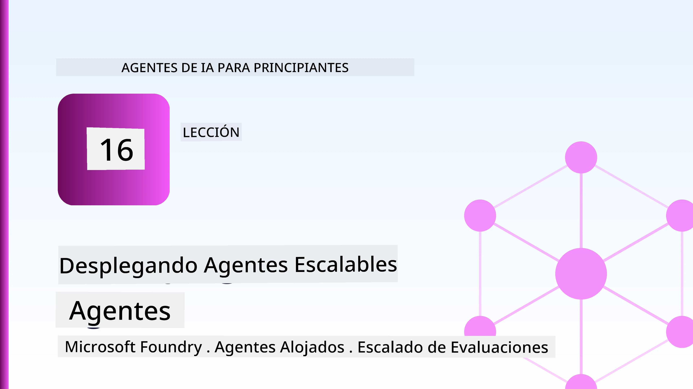
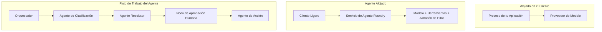
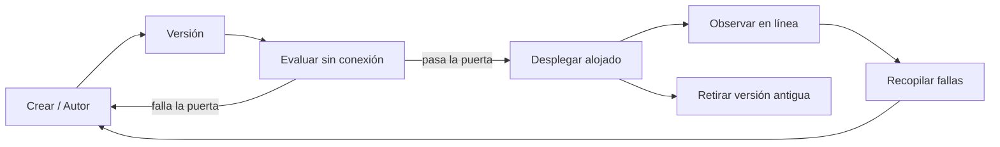
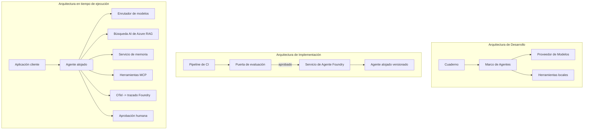

# Desplegando Agentes Escalables con Microsoft Foundry



Hasta este punto en el curso has construido agentes que se ejecutan en tu portátil, dentro de un cuaderno, impulsados por `az login` y un puñado de variables de entorno. Esa es exactamente la manera correcta de aprender. No es la manera correcta de ejecutar un agente del que dependen miles de clientes a las 3 a.m.

Esta lección trata sobre la brecha entre "funciona en mi máquina" y "funciona, de forma confiable y asequible, en producción." Cerramos esa brecha usando **Microsoft Foundry** y el **Microsoft Foundry Agent Service**, y lo hacemos construyendo un agente real de soporte al cliente que tiene herramientas, recuperación, memoria, evaluación y monitoreo.

## Introducción

Esta lección cubrirá:

- La diferencia entre un **agente prototipo** y un **agente desplegado**, y por qué la transición es principalmente sobre todo lo *alrededor* del modelo.
- **Patrones de despliegue** para agentes: alojados en cliente, alojados en servicio (Agentes Hospedados), y orquestados mediante flujo de trabajo.
- El **ciclo de vida del agente** en Microsoft Foundry — crear, versionar, desplegar, evaluar, observar, retirar.
- **Estrategias de escalado**: enrutamiento de modelo, caché, concurrencia, y diseño sin estado.
- **Observabilidad** con OpenTelemetry y trazas en Foundry.
- **Optimización de costes** mediante selección de modelo, enrutamiento y puertas de evaluación.
- **Consideraciones empresariales**: gobernanza, aprobación humana, y ejecución segura de servidores MCP en producción.

## Objetivos de Aprendizaje

Al completar esta lección, sabrás cómo:

- Elegir el patrón de despliegue adecuado para una carga de trabajo dada del agente.
- Desplegar un agente en el Microsoft Foundry Agent Service para que esté versionado, gobernado y observable.
- Instrumentar un agente para trazabilidad y conectar una canalización de evaluación que se ejecute antes de cada lanzamiento.
- Aplicar enrutamiento de modelo y caché para mantener la latencia y el costo bajo control a escala.
- Añadir una puerta de aprobación humana para acciones de alto riesgo e integrar un servidor MCP de manera segura en producción.

## Requisitos Previos

Esta lección asume que has completado las lecciones anteriores y estás cómodo con:

- Construir agentes con el [Microsoft Agent Framework](../14-microsoft-agent-framework/README.md) (Lección 14).
- [Uso de Herramientas](../04-tool-use/README.md) (Lección 4) y [RAG Agéntico](../05-agentic-rag/README.md) (Lección 5).
- [Memoria del Agente](../13-agent-memory/README.md) (Lección 13) y [Protocolos Agénticos / MCP](../11-agentic-protocols/README.md) (Lección 11).
- [Observabilidad y Evaluación](../10-ai-agents-production/README.md) (Lección 10) — esta lección construye directamente sobre ella.

También necesitarás:

- Una **suscripción de Azure** y un **proyecto Microsoft Foundry** con al menos un modelo de chat desplegado.
- La **CLI de Azure** autenticada (`az login`).
- Python 3.12+ y los paquetes en el repositorio [`requirements.txt`](../../../requirements.txt).

## De Prototipo a Producción: Lo que Realmente Cambia

Un agente prototipo y un agente de producción comparten el mismo bucle central — razonar, llamar herramientas, responder. Lo que cambia es todo lo que está envuelto alrededor de ese bucle. El modelo es quizá el 20% de un agente en producción; el 80% restante es el esqueleto operativo.

| Preocupación | Prototipo | Producción |
| --- | --- | --- |
| **Alojamiento** | Se ejecuta en tu cuaderno | Se ejecuta como un servicio alojado, versionado y desplegado |
| **Identidad** | Tu token `az login` | Identidad gestionada con RBAC con ámbito |
| **Estado** | En memoria, perdido al reiniciar | Externalizado (almacén de hilos, servicio de memoria) |
| **Fallas** | Ves el rastreo de excepción | Reintentos, alternativas, buzón para mensajes muertos, alertas |
| **Costo** | "Son unos centavos" | Rastreado por petición, enrutado, almacenado en caché, presupuestado |
| **Calidad** | Evalúas la salida visualmente | Evaluado automáticamente antes de cada lanzamiento |
| **Confianza** | Apruebas cada acción | Política + humano en el bucle para acciones riesgosas |

Ten esta tabla en mente. Cada sección a continuación corresponde a una de estas filas.

## Patrones de Despliegue de Agentes

Hay tres patrones que usarás, a menudo en combinación.

### 1. Agentes alojados en cliente

El objeto agente vive dentro del proceso *de tu* aplicación. Tu código llama directamente al proveedor del modelo; el bucle de razonamiento se ejecuta en tu servicio. Esto es lo que se ha hecho en cada lección previa.

- **Úsalo cuando** necesites control total sobre el bucle, middleware personalizado, o estés embebiendo el agente dentro de un backend existente.
- **Compensación**: tú manejas el escalado, estado y resiliencia tú mismo.

### 2. Agentes Hospedados (Foundry Agent Service)

El agente está *registrado como un recurso* en Microsoft Foundry. Foundry aloja el bucle de razonamiento, almacena los hilos, aplica seguridad de contenido y RBAC, y hace visible el agente en el portal de Foundry. Tu aplicación se vuelve un cliente ligero que crea hilos y lee respuestas.

- **Úsalo cuando** quieras durabilidad, observabilidad incorporada, gobernanza y menor área de superficie operativa.
- **Compensación**: menos control de bajo nivel a cambio de un entorno de ejecución gestionado.

### 3. Flujos de Trabajo de Agentes

Múltiples agentes (y herramientas) se componen en un grafo con flujo de control explícito — pasos secuenciales, ramificaciones, nodos de aprobación humana y puntos de control duraderos que pueden pausar y reanudar. Esta es la capacidad de **Flujos de Trabajo** del Microsoft Agent Framework aplicada a escala de despliegue.

- **Úsalo cuando** una sola tarea abarca varios agentes especializados o requiere un paso de aprobación en medio.
- **Compensación**: más partes en movimiento; necesita observabilidad a nivel de orquestación.



## El Ciclo de Vida del Agente en Microsoft Foundry

Desplegar un agente no es un `push` de una sola vez. Es un ciclo, y se parece mucho a un ciclo de lanzamiento de software porque eso es exactamente lo que es.



La idea clave, tomada de la [Lección 10](../10-ai-agents-production/README.md): **la evaluación offline es una puerta, no un pensamiento posterior.** Una nueva versión del agente no se lanza a menos que supere tus umbrales de evaluación. La observabilidad en línea luego alimenta las fallas reales de producción de vuelta a tu conjunto de pruebas offline. Ese es todo el ciclo.

## Estrategias de Escalado

Escalar un agente es diferente de escalar una API web sin estado, porque cada petición puede desencadenar múltiples llamadas costosas a modelos y herramientas. Cuatro técnicas llevan la mayor carga.

**Manejo de solicitudes sin estado.** No mantengas estado por usuario en la memoria de tu proceso. Persiste los hilos de conversación en el almacén de hilos de Foundry o en un servicio de memoria para que cualquier instancia pueda manejar cualquier solicitud. Esto es lo que permite escalar horizontalmente — agrega instancias, sin sesiones pegajosas.

**Enrutamiento de modelo.** No todas las solicitudes necesitan tu modelo más capaz (y más caro). Enruta solicitudes simples — clasificación de intención, respuestas factuales cortas — a un modelo pequeño y rápido, y reserva el modelo grande para razonamiento genuino. El **Model Router** de Foundry puede hacer esto por ti, o puedes implementar un clasificador ligero tú mismo. Construirás la versión DIY en el laboratorio.

**Caché de respuestas.** Muchas consultas de soporte son casi duplicados ("¿cómo restablezco mi contraseña?"). Cachea respuestas a preguntas comunes y sírvelas sin consultar el modelo. Incluso una tasa modesta de aciertos en caché reduce significativamente el costo y la latencia.

**Concurrencia y presión inversa.** Los proveedores de modelos tienen límites de tasa. Limita tu concurrencia, usa reintentos con retroceso exponencial y falla con gracia (una respuesta en cola de "estamos en ello" es mejor que un 500).


## Observabilidad en Producción

No puedes operar lo que no puedes ver. Como se cubrió en la Lección 10, el Microsoft Agent Framework emite **trazas OpenTelemetry** de forma nativa — cada llamada a modelo, invocación de herramienta y paso de orquestación se convierte en un span. En producción exportas esos spans a Microsoft Foundry (o a cualquier backend compatible con OTel) para que puedas:

- Rastrear una queja de cliente de principio a fin a través de cada llamada a modelo y herramienta.
- Vigilar la latencia y coste p50/p95 por solicitud a lo largo del tiempo.
- Alertar sobre picos en la tasa de errores y anomalías de costo antes que tus usuarios (o tu equipo financiero) las noten.

```python
from agent_framework.observability import get_tracer

tracer = get_tracer()

with tracer.start_as_current_span("support_request") as span:
    span.set_attribute("customer.tier", "enterprise")
    span.set_attribute("routed.model", "gpt-5-nano")
    # la ejecución del agente se rastrea automáticamente dentro de este intervalo
```

Atributos como `customer.tier` y `routed.model` son lo que convierte un muro de trazas en preguntas respondibles ("¿los clientes empresariales están siendo enrutados demasiado a menudo al modelo pequeño?").

## Optimización de Costes

El costo en agentes de producción está dominado por tokens. Tres palancas, en orden de impacto:

1. **Tamaño adecuado del modelo.** Un modelo pequeño que pase tu puerta de evaluación casi siempre es más barato que uno grande que también pase. Usa la evaluación para *probar* que el modelo pequeño es lo suficientemente bueno en lugar de optar por el modelo más grande por precaución.
2. **Ruta según complejidad.** Como arriba — paga precios de modelo grande solo para solicitudes que necesitan razonamiento de modelo grande.
3. **Cachea agresivamente.** La llamada a modelo más barata es la que nunca haces.

Las puertas de evaluación y el control de costos son la misma disciplina vista desde dos ángulos: la evaluación te dice el *piso de calidad*, el enrutamiento y la caché te mantienen lo más cerca posible del *costo* de ese piso.

## Consideraciones de Despliegue Empresarial

**Gobernanza.** Los Agentes Hospedados heredan RBAC, seguridad de contenido y registro de auditoría de Foundry. Dale a cada agente una identidad gestionada con los privilegios mínimos que necesita — acceso solo lectura a la base de conocimiento, acceso con ámbito a la API de tickets, nada más.

**Humano en el bucle.** Algunas acciones son demasiado importantes para automatizar por completo — emitir un reembolso, eliminar una cuenta, escalar a un equipo legal. El Microsoft Agent Framework soporta herramientas de **aprobación requerida**: el agente propone la acción, la ejecución se pausa, un humano aprueba o rechaza, y el flujo de trabajo continúa. Viste este primitivo en la [Lección 6](../06-building-trustworthy-agents/README.md); aquí lo desplegarás.

**MCP en producción.** [MCP](../11-agentic-protocols/README.md) permite que tu agente consuma herramientas externas a través de una interfaz estándar. En producción, trata cada servidor MCP como un límite no confiable: fija la versión del servidor, ejecútalo con una identidad con ámbito, valida sus salidas, y nunca le expongas secretos. Un servidor MCP es una dependencia, y las dependencias se parchanean, auditan y limitan cuota.



Esos tres diagramas — desarrollo, despliegue, tiempo de ejecución — son el mismo agente en tres etapas de su vida. El laboratorio que sigue te guía a construirlo.

## Laboratorio Práctico: Un Agente de Soporte al Cliente Listo para Producción

Abre [`code_samples/16-python-agent-framework.ipynb`](./code_samples/16-python-agent-framework.ipynb) y trabájalo de principio a fin. Armarás un **agente de soporte al cliente Contoso** con todas las preocupaciones de producción cableadas:

1. **Llamada a herramientas** — consulta estado de pedidos y abre tickets de soporte.
2. **RAG** — responde preguntas de política desde una base de conocimiento (Azure AI Search, con una solución de respaldo en memoria para que el cuaderno funcione sin un recurso Search).
3. **Memoria** — recuerda al cliente a través de las vueltas de la conversación.
4. **Enrutamiento de modelo** — un clasificador de complejidad enruta cada solicitud a un modelo pequeño o grande.
5. **Caché de respuestas** — preguntas repetidas se atienden desde caché.
6. **Aprobación humana** — reembolsos sobre un umbral se pausan para aprobación humana.
7. **Canalización de evaluación** — un pequeño conjunto de pruebas offline califica al agente y actúa como puerta de lanzamiento.
8. **Observabilidad** — trazas OpenTelemetry alrededor de cada solicitud.

### Recorrido

El cuaderno está organizado para que cada preocupación de producción sea una sección auto-contenida y ejecutable. El corazón es el manejador de solicitudes con enrutamiento y caché:

```python
async def handle_support_request(query: str, customer_id: str) -> str:
    # 1. Servir desde la caché cuando podamos.
    cached = response_cache.get(normalize(query))
    if cached:
        return cached

    # 2. Enrutar por complejidad para controlar el costo.
    model = "gpt-5-nano" if is_simple(query) else "gpt-5-mini"

    # 3. Ejecutar el agente dentro de un span de traza para la observabilidad.
    with tracer.start_as_current_span("support_request") as span:
        span.set_attribute("routed.model", model)
        span.set_attribute("customer.id", customer_id)
        response = await support_agent.run(query, model=model)

    # 4. Cachear y devolver.
    response_cache.set(normalize(query), response.text)
    return response.text
```

La puerta de evaluación que protege un lanzamiento es así:

```python
async def evaluation_gate(agent, test_cases, threshold: float = 0.8) -> bool:
    passed = 0
    for case in test_cases:
        result = await agent.run(case["input"])
        if score_response(result.text, case["expected"]) >= 0.8:
            passed += 1
    pass_rate = passed / len(test_cases)
    print(f"Evaluation pass rate: {pass_rate:.0%} (gate: {threshold:.0%})")
    return pass_rate >= threshold  # desplegar solo si la puerta pasa
```

Lee cada línea — el cuaderno mantiene los primitivas deliberadamente pequeños para que nada esté oculto detrás de una llamada a framework.

## Validando un Agente Desplegado con Pruebas de Humo

La puerta de evaluación arriba se ejecuta *offline* contra tu objeto agente. Una vez que el agente se despliega como un Agente Hospedado, necesitas una más, aún más barata: **¿el endpoint desplegado realmente responde?**

Desplegar "con éxito" solo prueba que el plano de control aceptó la definición — no prueba que el agente responda. Una dependencia faltante, un enrutamiento de modelo erróneo o una conexión expirada pueden dejar un despliegue verde que no devuelve nada. Una **prueba de humo** detecta eso en segundos, en cada despliegue, sin el costo de una evaluación completa.

Este repositorio incluye una canalización de prueba de humo lista para usar construida sobre la Acción de GitHub [AI Smoke Test](https://github.com/marketplace/actions/ai-smoke-test):

- **Catálogo** — [`tests/lesson-16-smoke-tests.json`](../../../tests/lesson-16-smoke-tests.json) contiene prompts y afirmaciones para el agente de soporte Contoso (respuestas de política fundamentadas, consulta de pedido, mantenerse en tema, y continuidad de hilo multi-turno). Los catálogos para agentes de otras lecciones viven junto a él — mira [`tests/README.md`](../tests/README.md).
- **Flujo de trabajo** — [`.github/workflows/smoke-test.yml`](../../../.github/workflows/smoke-test.yml) inicia sesión con Azure OIDC y envía cada prompt al endpoint Responses del agente, fallando el trabajo en cualquier fallo de afirmación.

```yaml
- name: Smoke-test hosted agent
  uses: JFolberth/ai-smoketest@v1
  with:
    project_endpoint: ${{ inputs.project_endpoint }}
    agent_name: ContosoSupportAgent
    tests_file: tests/lesson-16-smoke-tests.json
```


Ejecútalo desde la pestaña **Actions** una vez que tu agente esté desplegado, proporcionando el endpoint de tu proyecto Foundry y el nombre del agente. La identidad federada necesita el rol **Azure AI User** con alcance de proyecto Foundry. Piensa en las capas como una pirámide: las pruebas de humo (¿alcanzable y responde?) se ejecutan en cada despliegue, la evaluación offline (¿lo suficientemente bueno para lanzar?) se ejecuta antes de la promoción, y la evaluación online (¿cómo está funcionando en el entorno real?) se realiza continuamente.

## Verificación de Conocimiento

Prueba tu comprensión antes de pasar a la tarea.

**1. Aproximadamente, ¿qué parte de un agente en producción es "el modelo" y qué es el resto?**

<details>
<summary>Respuesta</summary>

El modelo es una minoría del sistema — a menudo citado como alrededor del 20%. El resto es el esqueleto operativo: alojamiento y versionado, identidad y RBAC, estado externalizado, gestión de fallos, seguimiento de costos, evaluación y controles humanos en el bucle. Pasar a producción es principalmente construir todo *alrededor* del ciclo de razonamiento.
</details>

**2. ¿Cuándo elegirías un Agente Hospedado en lugar de un agente hospedado en cliente?**

<details>
<summary>Respuesta</summary>

Cuando quieres un entorno de ejecución gestionado con durabilidad incorporada (hilos que persisten y pueden reanudarse), observabilidad, seguridad de contenido y RBAC, y estás dispuesto a sacrificar algo de control a bajo nivel del ciclo de razonamiento para tener una menor superficie operativa. El hospedaje en cliente es preferible cuando necesitas control total sobre el ciclo o estás integrando el agente en un backend existente.
</details>

**3. ¿Por qué un agente escalable debe ser sin estado en la memoria de su propio proceso?**

<details>
<summary>Respuesta</summary>

Para que cualquier instancia pueda manejar cualquier solicitud, lo que permite la escalabilidad horizontal sin sesiones pegajosas. El estado de la conversación por usuario se externaliza a una tienda de hilos o servicio de memoria. Si el estado residiera en la memoria del proceso, lo perderías al reiniciar y no podrías distribuir la carga libremente.
</details>

**4. ¿Qué problema resuelve el enrutamiento de modelos y cómo se relaciona con la evaluación?**

<details>
<summary>Respuesta</summary>

El enrutamiento envía solicitudes simples a un modelo pequeño, barato y rápido, y reserva el modelo grande para razonamientos genuinos, controlando tanto la latencia como el costo. Se relaciona con la evaluación porque esta es lo que *demuestra* que el modelo pequeño es suficientemente bueno para una clase de solicitudes — el enrutamiento sin evaluación es una suposición.
</details>

**5. ¿Qué es una "puerta de evaluación" y dónde se sitúa en el ciclo de vida?**

<details>
<summary>Respuesta</summary>

Una puerta de evaluación ejecuta un conjunto de pruebas offline contra una nueva versión del agente y bloquea el despliegue a menos que la tasa de aprobación supere un umbral. Se sitúa entre "versión" y "despliegue" en el ciclo de vida, haciendo de la calidad una condición previa para la liberación en lugar de algo que verificas después de lanzar.
</details>

**6. ¿Por qué un servidor MCP debe tratarse como un límite no confiable en producción?**

<details>
<summary>Respuesta</summary>

Porque es una dependencia externa a la que tu agente llama. Debes fijar su versión, ejecutarlo con una identidad restringida, validar sus salidas, limitar su tasa y nunca exponerle secretos — la misma disciplina que aplicas a cualquier dependencia de terceros. Sus salidas fluyen hacia el razonamiento de tu agente, así que confiar sin validar es un riesgo de seguridad.
</details>

**7. ¿Qué cambio único suele tener el mayor impacto en el costo de un agente en producción, y por qué?**

<details>
<summary>Respuesta</summary>

Ajustar el tamaño del modelo — usar el modelo más pequeño que aún pase la puerta de evaluación. El costo está dominado por los tokens, y un modelo más pequeño que cumple el nivel de calidad casi siempre es más barato que uno más grande. El almacenamiento en caché y el enrutamiento reducen aún más el costo, pero elegir el modelo base adecuado tiene el mayor efecto en primer orden.
</details>

**8. ¿Qué papel juegan los atributos de span como `customer.tier` y `routed.model` en la observabilidad?**

<details>
<summary>Respuesta</summary>

Transforman rastreos crudos en preguntas de negocio respondibles. Sin atributos tienes una pared de spans; con ellos puedes preguntar "¿los clientes empresariales están siendo enrutados al modelo pequeño con demasiada frecuencia?" o "¿qué modelo maneja nuestras solicitudes más lentas?" Los atributos son cómo segmentas la telemetría por las dimensiones que importan para tu operación.
</details>

## Tarea

Toma el agente de soporte al cliente del laboratorio y fortalécelo para un escenario específico: **un agente de soporte de facturación por suscripción para una empresa SaaS.**

Tu entrega debe:

1. **Reemplazar las herramientas** por otras relevantes para facturación: `get_subscription_status`, `get_invoice` y `issue_credit` (los créditos superiores a $50 requieren aprobación humana).
2. **Agregar tres documentos RAG** cubriendo la política de reembolso de la empresa, el ciclo de facturación y la política de cancelación.
3. **Extender el conjunto de evaluación** a al menos ocho casos, incluyendo al menos dos que *deberían* activar la vía de aprobación humana, y confirmar que tu puerta de evaluación pasa o falla correctamente.
4. **Agregar un reporte de costos**: tras ejecutar diez consultas mixtas a través del agente, imprime cuántas fueron al modelo pequeño, cuántas al modelo grande y cuántas se sirvieron desde caché.

Escribe un párrafo corto (en una celda markdown) explicando qué regla de enrutamiento de modelos elegiste y cómo la validarías con tráfico real. No hay una única respuesta correcta — se te evalúa en función de si las preocupaciones de producción están bien integradas de forma coherente.

## Resumen

En esta lección moviste un agente de prototipo a producción con Microsoft Foundry:

- El salto a producción es principalmente sobre el **esqueleto operativo** alrededor del modelo — alojamiento, identidad, estado, gestión de fallos, costo, calidad y confianza.
- Aprendiste los tres **patrones de despliegue** — hospedaje en cliente, Agentes Hospedados y Flujos de Trabajo de Agentes — y cuándo usar cada uno.
- Recorriste el **ciclo de vida del agente**, donde la evaluación offline **actúa como puerta de lanzamiento** y la observabilidad online retroalimenta fallos al conjunto de prueba.
- Aplicaste **estrategias de escalado** — diseño sin estado, enrutamiento de modelos, caché y concurrencia limitada — y las conectaste con la **optimización de costos**.
- Integraste **controles empresariales**: RBAC, aprobación humana en el bucle e integración segura MCP para producción.
- Construiste un **agente de soporte al cliente listo para producción** que enlaza todas estas preocupaciones juntas en código ejecutable.

La próxima lección toma el camino opuesto: en lugar de escalar agentes en la nube, los llevarás *hacia abajo* a una única máquina de desarrollo y los ejecutarás completamente de forma local.

## Recursos Adicionales

- <a href="https://learn.microsoft.com/azure/ai-foundry/what-is-azure-ai-foundry" target="_blank">Documentación de Microsoft Foundry</a>
- <a href="https://learn.microsoft.com/azure/ai-foundry/agents/overview" target="_blank">Resumen del Servicio de Agentes de Microsoft Foundry</a>
- <a href="https://aka.ms/ai-agents-beginners/agent-framework" target="_blank">Microsoft Agent Framework</a>
- <a href="https://learn.microsoft.com/azure/ai-foundry/concepts/model-router" target="_blank">Enrutador de Modelos en Microsoft Foundry</a>
- <a href="https://learn.microsoft.com/azure/search/search-what-is-azure-search" target="_blank">Azure AI Search</a>
- <a href="https://opentelemetry.io/" target="_blank">OpenTelemetry</a>
- <a href="https://github.com/marketplace/actions/ai-smoke-test" target="_blank">Acción de GitHub AI Smoke Test</a>
- <a href="https://modelcontextprotocol.io/" target="_blank">Protocolo de Contexto de Modelo (MCP)</a>

## Lección Anterior

[Construyendo Agentes para Uso de Computadora (CUA)](../15-browser-use/README.md)

## Próxima Lección

[Creando Agentes AI Locales](../17-creating-local-ai-agents/README.md)

---

<!-- CO-OP TRANSLATOR DISCLAIMER START -->
**Descargo de responsabilidad**:
Este documento ha sido traducido utilizando el servicio de traducción automática [Co-op Translator](https://github.com/Azure/co-op-translator). Aunque nos esforzamos por la precisión, tenga en cuenta que las traducciones automatizadas pueden contener errores o inexactitudes. El documento original en su idioma nativo debe considerarse la fuente autorizada. Para información crítica, se recomienda una traducción profesional humana. No somos responsables de cualquier malentendido o interpretación errónea que surja del uso de esta traducción.
<!-- CO-OP TRANSLATOR DISCLAIMER END -->