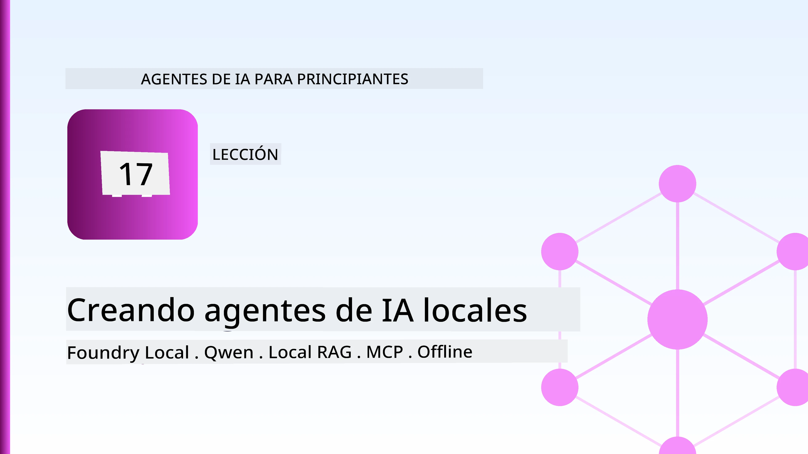
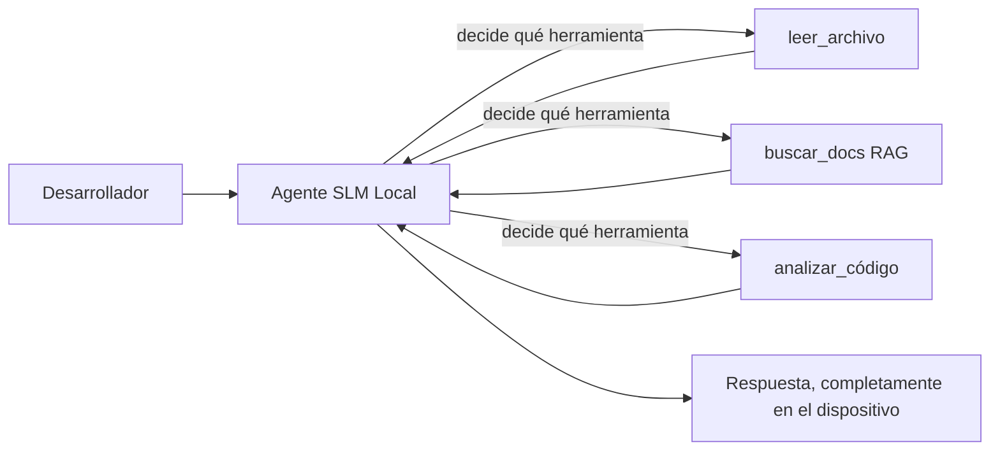
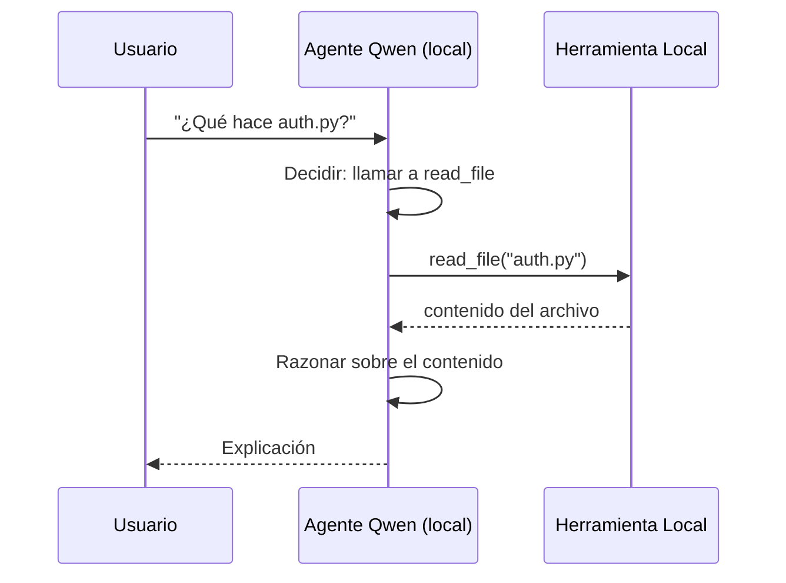
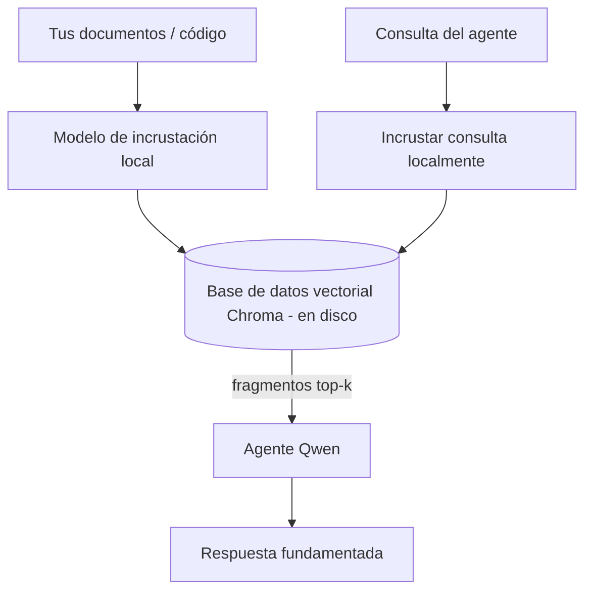
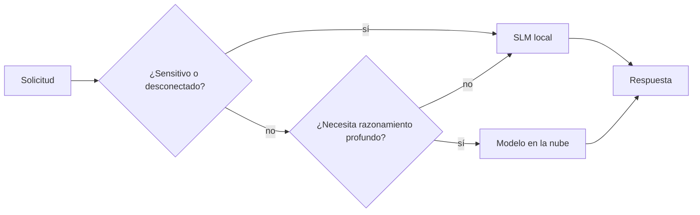

# Creación de agentes de IA locales utilizando Microsoft Foundry Local y Qwen



La lección anterior escaló agentes *hacia arriba* en la nube. Esta los baja *hacia abajo* a una sola máquina. Al final, tendrás un asistente de ingeniería funcional que razona, llama a herramientas, lee tus archivos y busca en tu documentación — **sin una sola llamada de inferencia en la nube.**

¿Por qué querrías eso? Tres razones que surgen constantemente en el trabajo de ingeniería real:

- **Privacidad.** El código y los documentos nunca salen de la máquina. Ningún prompt, fragmento ni dato del cliente cruza el límite de la red.
- **Costo.** La inferencia local no tiene un costo por token. Puedes iterar todo el día por el precio de la electricidad.
- **Sin conexión.** En un avión, en una instalación segura o durante un apagón, el agente sigue funcionando.

La trampa es que cambias un modelo de frontera en la nube por un **Modelo de Lenguaje Pequeño (SLM)** que se ejecuta en tu CPU, GPU o NPU. Esta lección trata sobre construir agentes que sean *buenos* dentro de esa limitación en lugar de fingir que no existe.

## Introducción

Esta lección cubrirá:

- **Modelos de Lenguaje Pequeños (SLMs)** — qué son, dónde brillan y dónde no.
- **Microsoft Foundry Local** — un entorno de ejecución que descarga y sirve modelos en el dispositivo mediante una **API compatible con OpenAI**.
- **Modelos Qwen con llamadas a funciones** — SLMs que producen llamadas a herramientas de forma confiable, lo que hace posible agentes locales (*no solo chat local*).
- **Herramientas locales, RAG local y MCP local** — dando capacidad al agente sin la nube.
- **Patrones híbridos** — cuándo mantener las cosas locales y cuándo recurrir a la nube.

## Objetivos de aprendizaje

Al completar esta lección, sabrás cómo:

- Explicar las compensaciones de los SLMs y elegir casos de uso apropiados para agentes locales.
- Servir un modelo Qwen localmente con Foundry Local y conectarte a él a través del endpoint compatible con OpenAI.
- Construir un agente con llamadas a herramientas que funcione completamente en tu estación de trabajo.
- Agregar RAG local sobre tus propios documentos usando una base de datos de vectores local (Chroma).
- Conectar el agente a un servidor MCP local y razonar sobre diseños híbridos local/nube.

## Prerrequisitos

Esta lección asume que has completado las lecciones anteriores y que estás cómodo con:

- [Uso de herramientas](../04-tool-use/README.md) (Lección 4) y [RAG agente](../05-agentic-rag/README.md) (Lección 5).
- [Protocolos agente / MCP](../11-agentic-protocols/README.md) (Lección 11).
- El [Microsoft Agent Framework](../14-microsoft-agent-framework/README.md) (Lección 14).

También necesitarás:

- Una estación de trabajo para desarrolladores. **8 GB de RAM es un mínimo realista**; 16 GB o más es cómodo. Una GPU o NPU ayuda pero no es obligatoria.
- Tener instalado **Microsoft Foundry Local** (ver la sección de configuración a continuación).
- Python 3.12+ y los paquetes en el repositorio [`requirements.txt`](../../../requirements.txt), además de `foundry-local-sdk`, `openai` y `chromadb` para esta lección.

## Modelos de Lenguaje Pequeños: La herramienta adecuada para el trabajo local

Un modelo de frontera en la nube tiene cientos de miles de millones de parámetros y un centro de datos detrás. Un SLM tiene unos pocos miles de millones de parámetros y debe caber en la RAM de tu laptop. Esa diferencia establece expectativas claras.

**Los SLMs son buenos en:**

- Tareas estructuradas y acotadas — clasificación, extracción, resumen de un documento conocido.
- **Llamadas a herramientas** — decidir qué función llamar y con qué argumentos.
- Iteración rápida, económica y privada sobre tus propios datos.

**Los SLMs son más débiles en:**

- Razonamiento abierto, multi-salto a través de un gran contexto.
- Conocimiento amplio del mundo (han visto menos y olvidan más).

La estrategia ganadora para agentes locales es entonces: **deja que el SLM organice, y que las herramientas hagan el trabajo pesado.** El modelo no necesita *conocer* tu base de código: necesita saber cuándo llamar a `read_file` y `search_docs`. Eso juega directamente con las fortalezas del SLM.



## Microsoft Foundry Local

**Microsoft Foundry Local** es un entorno de ejecución ligero que descarga, administra y sirve modelos completamente en tu máquina. Su característica más importante para nosotros es que expone un **endpoint HTTP compatible con OpenAI** — lo que significa que el SDK de OpenAI y el cliente OpenAI del Microsoft Agent Framework funcionan con él solo cambiando el `base_url`. Todo lo que aprendiste sobre construir agentes se transfiere directamente; solo cambia el endpoint de la nube a `localhost`.

Foundry Local también selecciona automáticamente la mejor versión de un modelo para tu hardware — una versión para CPU, una para CUDA/GPU o una para NPU — así no tienes que optimizar manualmente para cada máquina.

### Configuración

Instala Foundry Local (consulta la [documentación](https://learn.microsoft.com/azure/ai-foundry/foundry-local/) para tu SO), luego confirma que funciona:

```bash
# Instalar (ejemplo; siga la documentación para su plataforma)
winget install Microsoft.FoundryLocal      # Windows
# brew install microsoft/foundrylocal/foundrylocal   # macOS

# Descargue y ejecute un modelo Qwen, luego inicie el servicio local
foundry model run qwen2.5-7b-instruct
foundry service status
```

Una vez que el servicio está activo tienes un endpoint local compatible con OpenAI (típicamente `http://localhost:PORT/v1`). El notebook usa `foundry-local-sdk` para descubrir el endpoint automáticamente, así que no tienes que codificar el puerto.

## Llamadas a funciones Qwen: Por qué importa

Un agente solo es un agente si puede llamar a herramientas. Muchos SLMs pueden chatear pero producen llamadas a herramientas poco fiables o malformadas. Los modelos **Qwen** están entrenados para las llamadas a funciones y generan estructuras de llamadas bien formadas consistentemente — que es justo lo que convierte un modelo de chat local en un *agente* local.

El flujo es el ciclo estándar de llamadas a herramientas que ya conoces, solo que ejecutándose en el dispositivo:



## RAG Local

La búsqueda en documentación es donde los agentes locales ganan su valor. En lugar de esperar que el SLM haya memorizado la documentación de tu framework, incrustas esos documentos en una **base de datos de vectores local** y permites que el agente recupere los fragmentos relevantes bajo demanda.

Usamos **Chroma**, una tienda de vectores incrustada que se ejecuta en proceso sin necesidad de un servidor para gestionar. El pipeline es completamente local: modelo de incrustación local → vectores locales → recuperación local → SLM local.



Este es el mismo patrón Agentic RAG de la Lección 5 — el único cambio es que todos los componentes se ejecutan en tu máquina.

## Servidores MCP locales

[MCP](../11-agentic-protocols/README.md) es un transporte, no un servicio en la nube. Un servidor MCP puede ejecutarse como un proceso local sobre `stdio`, exponiendo herramientas a tu agente mediante el protocolo estándar. Esto te permite reutilizar el ecosistema creciente de servidores MCP — acceso al sistema de archivos, operaciones git, consultas a bases de datos — completamente offline.

La postura de seguridad es diferente a la de la nube, pero no inexistente: un servidor MCP local sigue ejecutándose con los permisos de tu usuario, así que limita lo que puede tocar (un directorio de proyecto, no toda tu carpeta de usuario) y trata sus salidas como entradas para validar.

## Patrones híbridos local y nube

Local primero no significa solo local. Los sistemas maduros enrutran según sensibilidad y dificultad:

| Situación | Dónde se ejecuta |
| --- | --- |
| Código/datos sensibles o sin conexión | **SLM local** |
| Tarea sencilla y acotada | **SLM local** (barato, rápido) |
| Razonamiento multi-salto complejo en datos no sensibles | **Modelo en la nube** |
| Todo, durante un corte de red | **SLM local** (degradación gradual) |

Esto refleja la idea de **enrutamiento de modelos** de la Lección 16 — excepto que uno de los "modelos" ahora es tu propia máquina. Un diseño robusto recurre a lo local cuando la nube no está disponible, para que el agente degrade su calidad en lugar de fallar abruptamente.



## Laboratorio práctico: Un asistente de ingeniería local

Abre [`code_samples/17-local-agent-foundry-local.ipynb`](./code_samples/17-local-agent-foundry-local.ipynb) y trabaja con él. Construirás un **asistente de ingeniería local** que se ejecuta completamente en tu estación de trabajo y puede:

1. **Llamar herramientas** — mediante llamadas a funciones Qwen a través de Foundry Local.
2. **Realizar operaciones locales de archivos** — listar y leer archivos en un directorio de proyecto.
3. **Analizar código** — reportar métricas básicas sobre un archivo fuente.
4. **Buscar documentación** — RAG local sobre una carpeta de docs con Chroma.
5. **Usar MCP** — conectarse a un servidor MCP local (con omisión elegante si no hay ninguno configurado).

No se usa inferencia en la nube en ningún momento.

### Guía paso a paso

El asistente se conecta a Foundry Local mediante el endpoint compatible con OpenAI, por lo que el código del agente luce casi idéntico a las lecciones en la nube — solo cambia el cliente:

```python
from foundry_local import FoundryLocalManager
from openai import OpenAI

# Foundry Local descubre/descarga el modelo y nos proporciona un punto de enlace local.
manager = FoundryLocalManager(\"qwen2.5-7b-instruct\")
client = OpenAI(base_url=manager.endpoint, api_key=manager.api_key)  # api_key es un marcador de posición local
```

Las herramientas son funciones Python normales limitadas a un directorio de proyecto:

```python
def read_file(path: str) -> str:
    \"\"\"Read a file, but only inside the sandboxed project directory.\"\"\"
    full = (PROJECT_ROOT / path).resolve()
    if PROJECT_ROOT not in full.parents and full != PROJECT_ROOT:
        return \"Access denied: path is outside the project directory.\"
    return full.read_text(encoding=\"utf-8\")
```

Nota la comprobación de sandbox — incluso localmente, una herramienta que lee rutas arbitrarias es un riesgo. El notebook mantiene cada herramienta limitada a la raíz de un solo proyecto.

## Comprobación de conocimiento

Pon a prueba tu comprensión antes de pasar a la tarea.

**1. Da dos razones concretas para ejecutar un agente localmente en lugar de en la nube.**

<details>
<summary>Respuesta</summary>

Cualquiera de dos: **privacidad** (el código y los datos nunca salen de la máquina), **costo** (sin factura de inferencia por token), y **capacidad offline** (funciona sin red — en un avión, en una instalación segura o durante un apagón). Restricciones regulatorias o de cumplimiento que prohíben enviar datos fuera del dispositivo suelen impulsar la razón de privacidad.
</details>

**2. ¿Cuál es la división recomendada del trabajo entre un SLM y sus herramientas en un agente local, y por qué?**

<details>
<summary>Respuesta</summary>

Deja que el SLM **orqueste** (decida qué herramienta llamar y con qué argumentos) y que las **herramientas hagan el trabajo pesado** (leer archivos, recuperar documentos, calcular resultados). Los SLMs son fuertes en decisiones acotadas como la selección de herramientas, pero más débiles en conocimiento amplio y razonamiento multi-salto largo, así que apoyarse en las herramientas aprovecha sus fortalezas.
</details>

**3. ¿Qué hace posible reutilizar el código de agentes en la nube con Foundry Local?**

<details>
<summary>Respuesta</summary>

Foundry Local expone un **endpoint HTTP compatible con OpenAI**. El SDK de OpenAI y el cliente OpenAI del Agent Framework funcionan cambiando solo el `base_url` (y usando una clave API local provisional). Todo lo demás del código del agente permanece igual.
</details>

**4. ¿Por qué usamos específicamente un modelo Qwen con llamadas a funciones en lugar de cualquier SLM?**

<details>
<summary>Respuesta</summary>

Porque un agente debe producir llamadas a herramientas confiables y bien formadas. Muchos SLMs pueden chatear pero emiten estructuras malformadas o inconsistentes para llamadas a herramientas. Los modelos Qwen están entrenados para llamadas a funciones y producen llamadas consistentes, que es lo que convierte un modelo de chat local en un agente local funcional.
</details>

**5. En la canalización RAG local, ¿qué componentes se ejecutan en la máquina?**

<details>
<summary>Respuesta</summary>

Todos: el modelo de incrustación, la base de datos de vectores (Chroma, en disco), el paso de recuperación y el SLM. Los documentos se incrustan localmente, se almacenan localmente, se recuperan localmente y se razona sobre ellos con un modelo local — ningún componente toca la nube.
</details>

**6. Un servidor MCP local se ejecuta en tu máquina. ¿Eso lo hace automáticamente seguro? ¿Qué precaución debes tomar aún?**

<details>
<summary>Respuesta</summary>

No. Un servidor MCP local se ejecuta con los permisos de tu usuario, por lo que puede tocar todo lo que tú puedes. Limítalo a lo que necesita (por ejemplo, un solo directorio de proyecto en lugar de toda tu carpeta de usuario) y trata sus salidas como entradas para validar antes de actuar sobre ellas.
</details>

**7. Describe una regla de enrutamiento híbrida sensata que incluya un modelo local.**

<details>
<summary>Respuesta</summary>

Dirige solicitudes sensibles o sin conexión al SLM local; tareas simples y acotadas al SLM local por velocidad y coste; razonamiento multi-salto difícil en datos no sensibles a un modelo en la nube; y vuelve al SLM local si la nube no está disponible para que el agente degrade su rendimiento de forma gradual en lugar de fallar. Esto es enrutamiento de modelos (Lección 16) con la máquina local como uno de los modelos.
</details>

**8. ¿Cuál es una cifra mínima realista de RAM para ejecutar el agente local de esta lección, y qué ventajas ofrece más RAM?**

<details>
<summary>Respuesta</summary>

Alrededor de **8 GB** es un mínimo realista; 16 GB o más es cómodo. Más RAM te permite ejecutar modelos más grandes y capaces y mantener más contexto en memoria. Una GPU o NPU acelera la inferencia pero no es obligatoria — Foundry Local selecciona una versión para CPU si no hay acelerador disponible.
</details>

## Tarea

Extiende el asistente de ingeniería local para convertirlo en un **revisor de documentación local** para un pequeño proyecto de tu elección (usa una de las carpetas de lección de este repositorio si quieres).

Tu entrega debe:

1. **Indexar una carpeta real de docs/código** en Chroma (al menos cinco archivos).
2. **Agregar una herramienta `find_todos`** que escanee el proyecto en busca de comentarios `TODO`/`FIXME` y los devuelva con archivo y número de línea — manteniendo la misma comprobación sandbox que `read_file`.

3. **Hazle tres preguntas al agente** que lo obliguen a combinar herramientas: una pregunta pura de RAG, una que requiera leer un archivo específico y otra que requiera encontrar TODOs.
4. **Mídelo**: cronometra cada una de las tres respuestas y anótalas en una celda de markdown. Comenta si la latencia es aceptable para tu flujo de trabajo previsto.

Luego escribe un párrafo corto sobre **qué moverías a la nube y qué mantendrías local para este revisor, y por qué**. Se te evaluará si los componentes locales están conectados correctamente y si tu razonamiento híbrido es sólido — no la calidad del modelo.

## Resumen

En esta lección construiste un agente que se ejecuta completamente en tu propia máquina:

- Los **SLMs** intercambian amplitud por privacidad, costo y operación sin conexión — y destacan cuando **orquestan herramientas** en lugar de llevar todo el conocimiento ellos mismos.
- **Foundry Local** sirve modelos en el dispositivo detrás de un **endpoint compatible con OpenAI**, para que el código de tu agente en la nube se transfiera con un cambio de una línea.
- Los **modelos Qwen con llamadas a funciones** hacen posible la llamada confiable de herramientas locales — y por tanto agentes *locales*.
- **RAG local** (Chroma) y **MCP local** dan capacidad al agente sin salir de la máquina.
- Los **patrones híbridos** te permiten enrutar según sensibilidad y dificultad, con lo local como un retroceso elegante.

Esto completa el arco de despliegue: la Lección 16 elevó agentes a Microsoft Foundry, y esta lección los redujo a una sola estación de trabajo. La próxima lección se enfoca en mantener seguros a los agentes desplegados.

## Recursos adicionales

- <a href="https://learn.microsoft.com/azure/ai-foundry/foundry-local/" target="_blank">Documentación de Microsoft Foundry Local</a>
- <a href="https://learn.microsoft.com/azure/ai-foundry/what-is-azure-ai-foundry" target="_blank">Documentación de Microsoft Foundry</a>
- <a href="https://aka.ms/ai-agents-beginners/agent-framework" target="_blank">Microsoft Agent Framework</a>
- <a href="https://qwen.readthedocs.io/en/latest/framework/function_call.html" target="_blank">Documentación de llamadas a funciones de Qwen</a>
- <a href="https://modelcontextprotocol.io/" target="_blank">Model Context Protocol (MCP)</a>
- <a href="https://docs.trychroma.com/" target="_blank">Base de datos vectorial Chroma</a>

## Lección anterior

[Desplegando agentes escalables](../16-deploying-scalable-agents/README.md)

## Próxima lección

[Asegurando agentes de IA](../18-securing-ai-agents/README.md)

---

<!-- CO-OP TRANSLATOR DISCLAIMER START -->
**Descargo de responsabilidad**:
Este documento ha sido traducido utilizando el servicio de traducción automática [Co-op Translator](https://github.com/Azure/co-op-translator). Aunque nos esforzamos por la precisión, tenga en cuenta que las traducciones automatizadas pueden contener errores o inexactitudes. El documento original en su idioma nativo debe considerarse la fuente autorizada. Para información crítica, se recomienda una traducción profesional humana. No somos responsables de cualquier malentendido o interpretación errónea que surja del uso de esta traducción.
<!-- CO-OP TRANSLATOR DISCLAIMER END -->