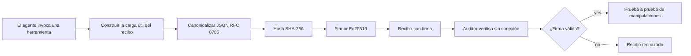
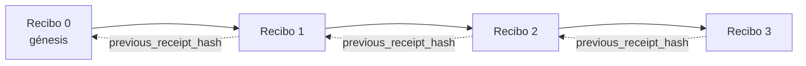

[Mira el video de la lección: Asegurando Agentes de IA con Recibos Criptográficos](https://youtu.be/PLACEHOLDER_VIDEO_ID)

> _(El video de la lección y la miniatura serán añadidos por el equipo de contenido de Microsoft después de la fusión, siguiendo el patrón de la lección 14 / 15.)_

# Asegurando Agentes de IA con Recibos Criptográficos

## Introducción

Esta lección cubrirá:

- Por qué las pistas de auditoría para agentes de IA son importantes para el cumplimiento, la depuración y la confianza.
- Qué es un recibo criptográfico y cómo difiere de una línea de registro sin firmar.
- Cómo producir un recibo firmado para la llamada a una herramienta de un agente en Python sencillo.
- Cómo verificar un recibo sin conexión y detectar manipulaciones.
- Cómo encadenar recibos para que eliminar o reordenar uno rompa la cadena.
- Qué prueban los recibos y qué no prueban explícitamente.

## Objetivos de Aprendizaje

Después de completar esta lección, sabrás cómo:

- Identificar los modos de falla que motivan la procedencia criptográfica para las acciones del agente.
- Producir un recibo firmado con Ed25519 sobre una carga útil JSON canónica.
- Verificar un recibo de manera independiente usando solo la clave pública del firmante.
- Detectar manipulaciones al volver a ejecutar la verificación sobre un recibo modificado.
- Construir una secuencia encadenada con hash de recibos y explicar por qué la cadena es importante.
- Reconocer el límite entre lo que prueban los recibos (atribución, integridad, orden) y lo que no (corrección de la acción, solidez de la política).

## El Problema: La Pista de Auditoría de tu Agente

Imagina que has desplegado un agente de IA para Contoso Travel. El agente lee solicitudes de clientes, llama a una API de vuelos para buscar opciones y reserva asientos en nombre del cliente. El último trimestre, el agente procesó 50,000 reservas.

Hoy llega un auditor. Hace una pregunta simple: "Muéstrame lo que hizo tu agente."

Entregas tus archivos de registro. El auditor los revisa y hace una pregunta más difícil: "¿Cómo sé que estos registros no fueron editados?"

Este es el problema de la pista de auditoría. La mayoría de los despliegues de agentes hoy dependen de:

- **Registros de aplicaciones**: escritos por el agente mismo, editables por cualquiera con acceso al sistema de archivos.
- **Servicios de registro en la nube**: a prueba de manipulaciones a nivel de plataforma pero solo si el auditor confía en el operador de la plataforma.
- **Registros de transacciones de bases de datos**: adecuados para cambios en bases de datos pero no para llamadas arbitrarias a herramientas.

Ninguno de estos puede responder a la pregunta del auditor sin requerir que confíe en alguien (tú, tu proveedor de nube, el proveedor de tu base de datos). Para uso interno, esa confianza suele ser aceptable. Para cargas reguladas (finanzas, salud, cualquier cosa sujeta al Acta de IA de la UE), no lo es.

Los recibos criptográficos resuelven esto haciendo que cada acción del agente sea verificable de manera independiente. El auditor no necesita confiar en ti. Solo necesita tu clave pública y el recibo mismo.

## ¿Qué es un Recibo Criptográfico?

Un recibo es un objeto JSON que registra lo que hizo un agente, firmado con una firma digital.



Un recibo mínimo se ve así:

```json
{
  "type": "agent.tool_call.v1",
  "agent_id": "contoso-travel-bot",
  "tool_name": "lookup_flights",
  "tool_args_hash": "sha256:a3f9c1...",
  "result_hash": "sha256:7b2e1d...",
  "policy_id": "contoso-travel-policy-v3",
  "timestamp": "2026-04-25T14:30:00Z",
  "sequence": 47,
  "previous_receipt_hash": "sha256:9d4e6a...",
  "signature": {
    "alg": "EdDSA",
    "sig": "c5af83...",
    "public_key": "8f3b2c..."
  }
}
```

Tres propiedades hacen el trabajo:

1. **La firma**. El recibo está firmado por el gateway del agente usando una clave privada Ed25519. Cualquiera con la clave pública correspondiente puede verificar la firma sin conexión. Manipular cualquier campo invalida la firma.

2. **Codificación canónica**. Antes de firmar, el recibo se serializa usando el Esquema de Canonicalización JSON (JCS, RFC 8785). Esto asegura que dos implementaciones que producen el mismo recibo lógico produzcan una salida idéntica byte a byte. Sin canonicalización, diferentes serializadores JSON producirían firmas diferentes para el mismo contenido.

3. **Encadenamiento con hash**. El campo `previous_receipt_hash` enlaza cada recibo con el anterior. Eliminar o reordenar un recibo rompe todos los recibos que vinieron después. La manipulación se vuelve visible a nivel de la cadena incluso si se evaden firmas individuales.

Juntas, estas propiedades proveen tres garantías:

- **Atribución**: esta clave firmó este contenido.
- **Integridad**: el contenido no ha cambiado desde la firma.
- **Orden**: este recibo vino después de ese recibo en la cadena.

## Producción de un Recibo en Python

No necesitas una biblioteca especial para producir un recibo. Las primitivas criptográficas están ampliamente disponibles y la lógica consta de unas pocas docenas de líneas en Python.

Los ejercicios prácticos en `code_samples/18-signed-receipts.ipynb` recorren el flujo completo. La versión resumida:

```python
import json
import hashlib
import base64
from nacl import signing
from jcs import canonicalize  # JSON canónico RFC 8785

def b64url_nopad(data: bytes) -> str:
    return base64.urlsafe_b64encode(data).decode("ascii").rstrip("=")

def sha256_canonical(obj) -> str:
    """SHA-256 of a Python object's JCS-canonical JSON form."""
    return f"sha256:{hashlib.sha256(canonicalize(obj)).hexdigest()}"

# Generar o cargar una clave de firma (en producción, almacenar en un almacén de claves)
signing_key = signing.SigningKey.generate()
verify_key = signing_key.verify_key

# Construir la carga útil del recibo (aún sin firma)
tool_args = {"origin": "SYD", "destination": "LAX"}
tool_result = [{"flight": "QF11", "price": 1850, "stops": 0}]

payload = {
    "type": "agent.tool_call.v1",
    "agent_id": "contoso-travel-bot",
    "tool_name": "lookup_flights",
    "tool_args_hash": sha256_canonical(tool_args),
    "result_hash": sha256_canonical(tool_result),
    "policy_id": "contoso-travel-policy-v3",
    "timestamp": "2026-04-25T14:30:00Z",
    "sequence": 0,
    "previous_receipt_hash": None,
}

# Canonicalizar, hashear, firmar.
canonical_bytes = canonicalize(payload)
message_hash = hashlib.sha256(canonical_bytes).digest()
signature_bytes = signing_key.sign(message_hash).signature

# Adjuntar un objeto de firma estructurado.
receipt = {
    **payload,
    "signature": {
        "alg": "EdDSA",
        "sig": b64url_nopad(signature_bytes),
        "public_key": b64url_nopad(bytes(verify_key)),
    },
}
```

Esa es toda la cadena de firmado. Los ejercicios en el notebook recorren cada paso.

## Verificación de un Recibo y Detección de Manipulación

La verificación es la operación inversa:

```python
import base64
import hashlib
from nacl import signing
from nacl.exceptions import BadSignatureError
from jcs import canonicalize

def b64url_decode(s: str) -> bytes:
    padding = "=" * ((4 - len(s) % 4) % 4)
    return base64.urlsafe_b64decode(s + padding)

def verify_receipt(receipt: dict) -> bool:
    # La firma es un objeto estructurado: {"alg", "sig", "public_key"}.
    sig_obj = receipt.get("signature")
    if not sig_obj or sig_obj.get("alg") != "EdDSA":
        return False

    # Reconstruir la carga útil que fue realmente firmada (todo excepto la firma).
    payload = {k: v for k, v in receipt.items() if k != "signature"}

    canonical_bytes = canonicalize(payload)
    message_hash = hashlib.sha256(canonical_bytes).digest()

    try:
        verify_key = signing.VerifyKey(b64url_decode(sig_obj["public_key"]))
        verify_key.verify(message_hash, b64url_decode(sig_obj["sig"]))
        return True
    except BadSignatureError:
        return False
```

Esta función toma un recibo y devuelve `True` si la firma es válida, `False` en caso contrario. Sin llamadas de red, sin dependencia en servicios, sin necesidad de confianza en terceros.

Para ver la detección de manipulaciones en acción, el notebook recorre:

1. Producción de un recibo válido y confirmación de que verifica.
2. Modificación de un byte en el campo `tool_args_hash`.
3. Ejecución de la verificación nuevamente y observando que falla.

Esta es la demostración práctica de que los recibos son evidentes a manipulaciones: cualquier modificación, por pequeña que sea, rompe la firma.

## Encadenando Recibos para Agentes de Múltiples Pasos

Un solo recibo firmado protege una acción. Una cadena de recibos protege una secuencia.



Cada recibo registra el hash del recibo anterior. Para eliminar el recibo 2 silenciosamente, un atacante necesitaría:

- Modificar el campo `previous_receipt_hash` del recibo 3 (rompe la firma del recibo 3), O
- Forjar una nueva firma sobre un recibo 3 modificado (requiere la clave privada del agente).

Si la clave privada está en un almacén de claves hardware y publicas la clave pública con cada recibo, ninguno de estos ataques es factible sin detección.

El notebook recorre:

1. Construcción de una cadena de tres recibos.
2. Verificación de que el `previous_receipt_hash` de cada recibo coincida con el hash real del recibo anterior.
3. Manipulación de un recibo en el medio y observación de que la cadena se rompe en ese punto exacto.

Así es como produces una pista de auditoría que un auditor externo puede verificar sin confiar en ti.

## Qué Prueban los Recibos (y Qué No)

Esta es la sección más importante de esta lección. Los recibos son poderosos pero su poder es limitado.

**Los recibos prueban tres cosas:**

1. **Atribución**: una clave específica firmó una carga útil específica.
2. **Integridad**: la carga útil no ha cambiado desde la firma.
3. **Orden**: este recibo vino después de ese recibo en la cadena de hash.

**Los recibos NO prueban:**

1. **Corrección**: que la acción del agente fue la acción correcta. Un recibo puede firmarse por una respuesta incorrecta tan limpiamente como por una correcta.
2. **Cumplimiento de políticas**: que la política referenciada en `policy_id` fue efectivamente evaluada, o que habría permitido esta acción si se hubiera verificado. El recibo registra lo que se afirmó, no lo que se hizo cumplir.
3. **Identidad más allá de la clave**: el recibo dice "esta clave firmó este contenido." No dice "un humano autorizó esto." Conectar una clave a una persona u organización requiere infraestructura de identidad separada (un directorio, un registro de claves públicas, etc.).
4. **Veracidad de las entradas**: si el agente recibe un aviso manipulado y actúa en consecuencia, el recibo registra fielmente la acción. Los recibos dependen de la validación de entrada, no la sustituyen.

Este límite importa por dos razones:

- Te dice para qué son útiles los recibos: hacer el comportamiento del agente auditable y evidente a manipulaciones, incluso a través de fronteras organizacionales.
- Te dice qué capas adicionales aún necesitas: validación de entradas (Lección 6), aplicación de políticas (cubierto brevemente abajo) e infraestructura de identidad (fuera del alcance de esta lección).

Un error común es asumir que "tenemos recibos" significa "estamos gobernados." No es así. Los recibos son una base. La gobernanza es el sistema que construyes encima.

## Probar que un Humano Aprobó la Acción Exacta

El punto 3 arriba vale su propia sección: un recibo de acción dice "esta clave firmó este contenido," nunca "un humano autorizó esto." Para acciones de alto riesgo (reembolsos, eliminaciones, transferencias bancarias), los marcos de gobernanza requieren cada vez más esa declaración que falta, y es producible con las mismas primitivas que ya construiste en esta lección.

El notebook complementario `code_samples/human-authorization-receipts.ipynb` agrega un segundo tipo de recibo, `human.approval.v1`, con la misma forma de sobre que los recibos de la lección (una carga útil tipada firmada con Ed25519 sobre su SHA-256 canónico, con el objeto `signature` fuera de los bytes firmados). Un aprobador nombrado firma la **acción canónica completa y su resumen** antes de la ejecución; el recibo de acción del agente lleva el **mismo resumen de acción** y un `parent_approval_ref`, el `receipt_hash` de la aprobación, la misma convención que `previous_receipt_hash` en la cadena que construiste arriba. Una llamada `verify_chain` recorre ambos artefactos bajo **registros de claves fijados separados** (claves de aprobadores vs claves de agentes), de modo que la ruta de código se comparte, pero las autoridades nunca.

La propiedad que esto garantiza, expresada cuidadosamente: *el humano aprobó esta acción exacta, y el agente ejecutó exactamente esa acción aprobada.* Las pruebas de rechazo en el notebook son lo que hace que la propiedad sea real y no solo una afirmación:

- el conjunto clásico: manipulación, delegado confundido, repetición, claves falsificadas en cualquiera de los lados, entrada malformada;
- **autoridad obsoleta**: una firma que aún verifica, rechazada de todos modos porque la versión de la política cambió, la clave del aprobador fue rotada fuera del registro fijado, o la aprobación expiró antes de la ejecución;
- **sustitución de resumen**: un recibo de acción firmado válidamente apuntando a una aprobación *real* que enlaza una acción canónica *diferente*.

Cada falla rechaza con una razón distinta, así un auditor que lee un rechazo puede saber si la autoridad caducó o si la acción ejecutada cambió. La regla que enseña el notebook: una aprobación firmada no es autoridad por sí misma. La autoridad existe solo si ambos recibos aún están vinculados a la misma acción canónica al momento de la ejecución. El camino de co-firma en el mismo Borrador de Internet en que esta lección se basa (`draft-farley-acta-signed-receipts`) es la forma de estándar para este patrón.

## Referencias para Producción

El código Python en esta lección es intencionalmente mínimo para que puedas leer cada línea y entender exactamente qué está pasando. En producción, tienes dos opciones:

1. **Construir directamente sobre las primitivas criptográficas.** Las 50 líneas que viste arriba son suficientes para muchos casos de uso. PyNaCl (Ed25519) y el paquete `jcs` (JSON canónico) son bibliotecas bien mantenidas y auditadas.

2. **Usar una biblioteca de recibos para producción.** Varios proyectos de código abierto implementan el mismo patrón con características adicionales (rotación de claves, verificación por lotes, distribución del conjunto JWK, integración con motores de políticas):
   - El formato de recibo usado en esta lección sigue un Borrador de Internet de IETF ([`draft-farley-acta-signed-receipts`](https://datatracker.ietf.org/doc/draft-farley-acta-signed-receipts/), revisión 02) actualmente en proceso estándar, con una suite de conformidad compartida ([agent-governance-testvectors](https://github.com/ScopeBlind/agent-governance-testvectors)) con la que implementaciones independientes se verifican entre sí para producción canónica idéntica a nivel de bytes.
   - El Microsoft Agent Governance Toolkit combina recibos con decisiones de políticas basadas en Cedar; ve el Tutorial 33 en ese repositorio para un ejemplo completo.
   - Los paquetes `protect-mcp` (npm) y `@veritasacta/verify` (npm) proporcionan una implementación en Node de firmado de recibos y verificación offline, pensada para envolver cualquier servidor MCP con una pista de auditoría evidente a manipulaciones, incluyendo un flujo de co-firma retenida en la que una acción pausada emite un recibo de aprobación enlazado al resumen de la acción (con soporte WebAuthn en el flujo de escritorio), el mismo patrón de recibo de aprobación que el notebook de autorización humana arriba.
   - El SDK Python **[nobulex](https://github.com/arian-gogani/nobulex)** (`pip install nobulex`) provee el mismo patrón de firmado Ed25519 + JCS en Python con integraciones LangChain y CrewAI, incluyendo vectores de prueba de validación cruzada publicados y un mapeo de cumplimiento aportado vía [OWASP PR #2210](https://github.com/OWASP/CheatSheetSeries/pull/2210).

La decisión entre implementar tú mismo o usar una biblioteca es similar a elegir entre escribir tu propia biblioteca JWT o usar una probada: ambas son razonables; la biblioteca ahorra tiempo y reduce la superficie de auditoría; el enfoque propio te obliga a entender cada primitiva. Esta lección enseña el camino propio para que tengas la base para cualquiera de las dos opciones.

## Chequeo de Conocimientos

Pon a prueba tu comprensión antes de pasar al ejercicio práctico.

**1. Un recibo está firmado con la clave privada Ed25519 del agente. El auditor solo tiene la clave pública. ¿Puede el auditor verificar el recibo sin conexión?**

<details>
<summary>Respuesta</summary>

Sí. La verificación Ed25519 requiere solo la clave pública y los bytes firmados. Sin llamadas de red, sin dependencia de servicios. Esta es la propiedad que hace que los recibos sean útiles en entornos aislados, multi-organizacionales o de baja confianza.
</details>

**2. Un atacante modifica el campo `policy_id` de un recibo para afirmar que estuvo gobernado por una política más permisiva. La firma fue sobre la carga útil original. ¿Qué sucede durante la verificación?**

<details>
<summary>Respuesta</summary>


La verificación falla. La firma se calculó sobre los bytes canónicos de la carga útil original; modificar cualquier campo cambia los bytes canónicos, lo que cambia el hash SHA-256, lo que hace que la firma sea inválida. El atacante necesitaría la clave privada para producir una firma válida nueva, la cual no tiene.
</details>

**3. ¿Por qué el recibo incluye un `tool_args_hash` y `result_hash` en lugar de los argumentos y resultados en bruto?**

<details>
<summary>Respuesta</summary>

Por dos razones. Primero, el recibo puede necesitar ser archivado o transmitido en entornos donde filtrar el contenido en bruto (información personal identificable, datos empresariales) es un problema. El hash mantiene el recibo pequeño y el contenido privado; el auditor verifica que el hash coincide con una copia almacenada por separado del contenido real. Segundo, los hashes tienen un tamaño fijo; un recibo con hashes tiene un tamaño limitado sin importar lo grandes que fueran las entradas y salidas.
</details>

**4. El campo `previous_receipt_hash` enlaza cada recibo con su predecesor. Si un atacante elimina silenciosamente un recibo del medio de una cadena, ¿qué se vuelve inválido?**

<details>
<summary>Respuesta</summary>

Cada recibo que vino después del eliminado. Sus campos `previous_receipt_hash` ya no coinciden con la cadena real (porque el recibo al que hacían referencia ya no existe, o la cadena ahora apunta a un predecesor diferente). Para ocultar la eliminación, el atacante tendría que volver a firmar cada recibo posterior, lo que requiere la clave privada.
</details>

**5. Un recibo se verifica correctamente. ¿Eso prueba que la acción del agente fue correcta, sólida o cumplió con la política?**

<details>
<summary>Respuesta</summary>

No. Un recibo válido demuestra tres cosas: atribución (esta clave firmó este contenido), integridad (el contenido no ha cambiado) y orden (este recibo vino después de ese recibo). NO prueba que la acción fue correcta, que la política nombrada en `policy_id` fue realmente evaluada, o que el agente siguió todas las reglas. Los recibos hacen que el comportamiento del agente sea auditable, no necesariamente correcto. Esta es la frontera más importante de la lección.
</details>

## Ejercicio Práctico

Abre `code_samples/18-signed-receipts.ipynb` y completa las cuatro secciones:

1. **Sección 1**: Firma tu primer recibo y verifica que sea válido.
2. **Sección 2**: Manipula el recibo y observa que la verificación falla.
3. **Sección 3**: Construye una cadena de tres recibos y verifica la integridad de la cadena.
4. **Sección 4**: Aplica el patrón a un agente construido con Microsoft Agent Framework: envuelve la llamada a la herramienta en la firma del recibo, luego verifica el recibo de forma independiente.

**Desafío adicional 1:** extiende el esquema del recibo con un campo adicional de tu elección (por ejemplo, un ID de solicitud para rastreo), actualiza la lógica de firma canónica para incluirlo, y confirma que el recibo aún se puede verificar con éxito. Luego modifica el campo después de la firma y confirma que la verificación falla. Esto te obliga a entender cómo cada byte de la codificación canónica contribuye a la firma.

**Desafío adicional 2:** Calcula el hash SHA-256 de dos de tus recibos juntos (concatenando sus bytes canónicos en un orden determinista) y embebe el resumen resultante como un nuevo campo en un tercer recibo antes de firmarlo. Verifica que los tres recibos aún se pueden verificar. Acabas de construir una prueba de inclusión de un paso: cualquiera que tenga el tercer recibo puede probar que los dos primeros existían al momento de firmarlo, sin necesidad de revelar su contenido. Este es el patrón que los recibos de divulgación selectiva usan a gran escala (compromisos Merkle, RFC 6962).

## Conclusión

Los recibos criptográficos ofrecen a los agentes de IA una pista de auditoría que es:

- **Independientemente verificable**: cualquier parte con la clave pública puede verificar, sin dependencia de servicio.
- **Evidente de manipulaciones**: cualquier modificación invalida la firma.
- **Portátil**: un recibo es un archivo JSON pequeño; puede archivarse, transmitirse y verificarse en cualquier lugar.
- **Alineado con estándares**: construido sobre Ed25519 (RFC 8032), JCS (RFC 8785) y SHA-256, todos primitivos ampliamente desplegados.

No son un sustituto para la validación de entradas, la aplicación de políticas o la infraestructura de identidad. Son una base para esas capas. Cuando despliegas agentes en cargas de trabajo reguladas, flujos de trabajo multi-organización, o cualquier entorno donde un auditor futuro no pueda asumir que confía en ti, los recibos son cómo haces que la pista de auditoría sea honesta.

La lección más importante: los recibos prueban quién dijo qué y cuándo. No prueban que lo dicho sea verdad o correcto. Mantén esa distinción con claridad. Es la diferencia entre un sistema de procedencia honesto y uno engañoso.

## Lista de Verificación para Producción

Cuando estés listo para avanzar desde esta lección a desplegar agentes con recibos firmados en un entorno real:

- [ ] **Mueve la clave de firma fuera del portátil del desarrollador.** Usa Azure Key Vault, AWS KMS o un módulo de seguridad de hardware. La clave privada que firma tus recibos nunca debe estar en control de versiones ni en texto plano en máquinas de aplicación.
- [ ] **Publica la clave pública de verificación.** Los auditores la necesitan para verificar offline. El patrón estándar es un conjunto JWK en una URL conocida (RFC 7517), p.ej. `https://your-org.example.com/.well-known/agent-keys.json`.
- [ ] **Ancla la cadena externamente.** Periódicamente escribe el hash de la cabeza más reciente de la cadena en un log de transparencia (Sigstore Rekor, autoridad de tiempo RFC 3161 u otro sistema interno) para que una parte externa pueda confirmar "esta cadena existía en este momento".
- [ ] **Almacena los recibos de forma inmutable.** El almacenamiento de blobs solo agregado (Azure Storage con políticas de inmutabilidad, AWS S3 Object Lock) evita que un interno reescriba la historia en la capa de almacenamiento.
- [ ] **Decide la retención.** Muchos regímenes de cumplimiento exigen retención de varios años. Planea el crecimiento de recibos (cada recibo ocupa ~500 bytes; un agente que hace 10K llamadas por día produce ~1.8 GB por año).
- [ ] **Documenta qué no cubren los recibos.** Los recibos prueban atribución, integridad y orden. Tu runbook debe listar explícitamente qué controles adicionales (validación de entradas, aplicación de políticas, limitación de tasa, infraestructura de identidad) acompañan a los recibos en tu postura de gobernanza.

### ¿Tienes más preguntas sobre cómo asegurar agentes de IA?

Únete al [Microsoft Foundry Discord](https://aka.ms/ai-agents/discord) para encontrarte con otros estudiantes, asistir a horas de oficina y obtener respuestas a tus preguntas sobre Agentes de IA.

## Más allá de esta lección

Esta lección cubre la firma de un solo recibo y secuencias encadenadas por hash. Las mismas primitivas componen varios patrones más avanzados que puedes encontrar a medida que madura tu postura de gobernanza:

- **Divulgación selectiva.** Cuando los campos de un recibo se comprometen de forma independiente (árbol Merkle estilo RFC 6962), puedes revelar campos específicos a auditores específicos y probar que el resto no ha cambiado sin exponerlos. Útil cuando el mismo recibo debe satisfacer tanto una auditoría completa (que quiere integridad) como regulaciones de minimización de datos como GDPR (que quieren que el auditor vea lo mínimo necesario).
- **Revocación de recibos.** Si una clave de firma es comprometida, necesitas una forma de marcar todos los recibos firmados por esa clave como no confiables desde un punto en el tiempo adelante. Patrones estándar: claves de firma de corta duración más una lista de revocación publicada, o un log de transparencia con entradas de revocación.
- **Recibos bifurcados / con firma compartida.** Algunas implementaciones dividen la carga firmada en mitades pre-ejecución (`authorization_*`) y post-ejecución (`result_*`) con firmas independientes, útil cuando la decisión de autorización y el resultado observado son producidos por actores diferentes o en tiempos distintos. Esto se suma al formato de recibo enseñado en esta lección.
- **Composición de carga útil.** Un recibo sella cualquier byte que pongas en `result_hash`. Las cargas reales a menudo son más ricas que el resultado de una llamada a herramienta: razonamiento pre-decisional (predicción del modelo, opciones consideradas, evidencia y su completitud, postura de riesgo, cadena de responsabilidad, resultado de la puerta) puede vivir dentro de la carga, sellado por un único recibo. Esto mantiene el formato del recibo mínimo mientras permite que los esquemas de carga evolucionen por dominio.
- **Conformidad cruzada entre implementaciones.** Múltiples implementaciones independientes del mismo formato de recibo (Python, TypeScript, Rust, Go) se verifican entre sí contra vectores de prueba compartidos. Si construyes tu propia implementación, validar contra vectores publicados confirma la compatibilidad en el transporte.
- **Migración post-cuántica.** Ed25519 está ampliamente desplegado hoy pero no es resistente a quantum. El formato del recibo es ágil respecto al algoritmo: el campo `signature.alg` puede llevar `ML-DSA-65` (el estándar de firma post-cuántico NIST) cuando necesites migrar. Planifica un período de transición donde los recibos estén firmados doblemente.

## Recursos adicionales

- <a href="https://datatracker.ietf.org/doc/draft-farley-acta-signed-receipts/" target="_blank">Borrador IETF: Recibos de Decisión Firmados para Control de Acceso Máquina a Máquina</a>
- <a href="https://learn.microsoft.com/azure/ai-studio/responsible-use-of-ai-overview" target="_blank">Visión general de IA Responsable (Azure AI)</a>
- <a href="https://datatracker.ietf.org/doc/html/rfc8032" target="_blank">RFC 8032: Algoritmo de Firma Digital con Curva Edwards (EdDSA)</a>
- <a href="https://datatracker.ietf.org/doc/html/rfc8785" target="_blank">RFC 8785: Esquema de Canonicalización JSON (JCS)</a>
- <a href="https://datatracker.ietf.org/doc/html/rfc6962" target="_blank">RFC 6962: Transparencia de Certificados</a> (construcción árbol Merkle usada por recibos de divulgación selectiva)
- <a href="https://github.com/microsoft/agent-governance-toolkit/blob/main/docs/tutorials/33-offline-verifiable-receipts.md" target="_blank">Microsoft Agent Governance Toolkit, Tutorial 33: Recibos de Decisión Verificables Offline</a>
- <a href="https://github.com/ScopeBlind/agent-governance-testvectors" target="_blank">Vectores de prueba de conformidad entre implementaciones</a> para el formato de recibo usado en esta lección (Apache-2.0)
- <a href="https://pynacl.readthedocs.io/" target="_blank">Documentación PyNaCl</a> (Ed25519 en Python)

## Lección anterior

[Creando Agentes de IA Locales](../17-creating-local-ai-agents/README.md)

---

<!-- CO-OP TRANSLATOR DISCLAIMER START -->
**Descargo de responsabilidad**:
Este documento ha sido traducido utilizando el servicio de traducción automática [Co-op Translator](https://github.com/Azure/co-op-translator). Aunque nos esforzamos por la precisión, tenga en cuenta que las traducciones automatizadas pueden contener errores o inexactitudes. El documento original en su idioma nativo debe considerarse la fuente autorizada. Para información crítica, se recomienda una traducción profesional humana. No somos responsables de cualquier malentendido o interpretación errónea que surja del uso de esta traducción.
<!-- CO-OP TRANSLATOR DISCLAIMER END -->