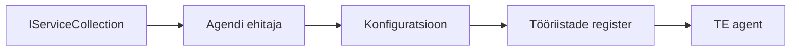

# 🎨 Agentuuridisaini mustrid Azure OpenAI (Responses API) (.NET)

## 📋 Õpieesmärgid

See näide demonstreerib ettevõtte tasemel disainimustreid nutikate agentide ehitamiseks, kasutades Microsoft Agent Framework'i .NET-is Azure OpenAI (Responses API) integratsiooniga. Õpite professionaalseid mustreid ja arhitektuurilisi lähenemisi, mis muudavad agendid tootmiskõlblikuks, hooldatavaks ja skaleeritavaks.

### Ettevõtte disainimustrid

- 🏭 **Tehase muster**: Standardiseeritud agentide loomine sõltuvussüstiga
- 🔧 **Ehitusmuster**: Voogav agentide konfigureerimine ja seadistamine
- 🧵 **Lõimeturvalised mustrid**: Paralelle arutelude haldamine
- 📋 **Repositooriumi muster**: Tööriistade ja võimekuste organiseeritud haldus

## 🎯 .NET-spetsiifilised arhitektuurilised eelised

### Ettevõtte funktsioonid

- **Tugev tüpiseerimine**: Kompileerimisaegne valideerimine ja IntelliSense tugi
- **Sõltuvussüsti integratsioon**: Sisseehitatud DI konteineri tugi
- **Konfiguratsiooni haldus**: IConfiguration ja valikute mustrid
- **Async/Await**: Esmaklassiline asünkroonne programmeerimine

### Tootmiskõlblikud mustrid

- **Logimise integratsioon**: ILogger ja struktureeritud logimine
- **Tervisekontrollid**: Sisseehitatud jälgimine ja diagnostika
- **Konfiguratsiooni valideerimine**: Tugev tüpiseerimine andmete annotatsioonidega
- **Veahaldus**: Struktureeritud erandite haldus

## 🔧 Tehniline arhitektuur

### Põhilised .NET komponendid

- **Microsoft.Extensions.AI**: Ühtsed tehisintellekti teenuste abstraktsioonid
- **Microsoft.Agents.AI**: Ettevõtte agentide orkestreerimise raamistik
- **Azure OpenAI (Responses API)**: Kõrge jõudlusega API kliendi mustrid
- **Konfiguratsioonisüsteem**: appsettings.json ja keskkonna integratsioon

### Disainimustrite rakendamine



## 🏗️ Demonstreeritud ettevõtte mustrid

### 1. **Loomismustrid**

- **Agendi tehas**: Keskne agentide loomine järjepideva konfiguratsiooniga
- **Ehitusmuster**: Voogav API keerulise agentide seadistamiseks
- **Singleton-muster**: Jagatud ressursid ja konfiguratsiooni haldus
- **Sõltuvussüst**: Lahtine koppelduvus ja testitavus

### 2. **Käitumusmustrid**

- **Strateegia muster**: Vahetatavad tööriistade täitmise strateegiad
- **Käsu muster**: Kaetud agendi toimingud koos tagasi- ja uuesti tegemisega
- **Observer-muster**: Sündmusel põhinev agendi elutsükli haldus
- **Mallimeetod**: Standardiseeritud agendi täitmise töövood

### 3. **Struktuurimustrid**

- **Adapteri muster**: Azure OpenAI (Responses API) integratsioonikiht
- **Dekoraatori muster**: Agendi võimekuse täiustamine
- **Fassaadi muster**: Lihtsustatud agendi suhtlusliidesed
- **Proksi muster**: Laisk laadimine ja vahemällu salvestamine jõudluseks

## 📚 .NET disainipõhimõtted

### SOLID põhimõtted

- **Üksik vastutus**: Iga komponent täidab ühte selget eesmärki
- **Avatud/suletud**: Laiendatav ilma modifitseerimiseta
- **Liskovi asendamise printsiip**: Liidese-põhised tööriistade teostused
- **Liidese segregatsioon**: Keskendunud, kooskõlastatud liidesed
- **Sõltuvuse inversioon**: Sõltumine abstraktsioonidest, mitte konkreetsetest

### Puhas arhitektuur

- **Domeenikiht**: Põhiagentide ja tööriistade abstraktsioonid
- **Rakenduse kiht**: Agendi orkestreerimine ja töövood
- **Taristu kiht**: Azure OpenAI (Responses API) integratsioon ja välisteenused
- **Esitluskiht**: Kasutajaliides ja vastuse vormindamine

## 🔒 Ettevõtte kaalutlused

### Turvalisus

- **Mandaatide haldus**: Turvaline API võtme käsitlemine IConfiguration abil
- **Sisendi valideerimine**: Tugev tüpiseerimine ja andmete annotatsioonide valideerimine
- **Väljundi puhastamine**: Turvaline vastuste töötlemine ja filtreerimine
- **Auditilogimine**: Põhjalik tegevuste jälgimine

### Jõudlus

- **Asünkroonsed mustrid**: Mitteblokeerivad I/O operatsioonid
- **Ühenduste pesastamine**: Tõhus HTTP kliendi haldus
- **Vahemällu salvestamine**: Vastuste vahemälu jõudluse parandamiseks
- **Ressursside haldus**: Korralik kasutusest vabanemine ja puhastusmustrid

### Skaleeritavus

- **Lõimeturvalisus**: Paralleelne agendi täitmise tugi
- **Ressursside pesastamine**: Tõhus ressursikasutus
- **Koormuse haldus**: Kiirusepiirang ja tagasilükkamise haldus
- **Jälgimine**: Jõudlusmõõdikud ja tervisekontrollid

## 🚀 Tootmise juurutus

- **Konfiguratsiooni haldus**: Keskkonnapõhised seaded
- **Logimise strateegia**: Struktureeritud logimine koos korrelatsiooni ID-dega
- **Veahaldus**: Ülemaailmne erandite käsitlemine ning korralik taastumine
- **Jälgimine**: Rakenduse inseneritööriistad ja jõudlusmõõdikud
- **Testimine**: Üksuse testid, integreerimiskatsed ja koormustestimise mustrid

Valmis ehitama ettevõtte tasemel nutikaid agente .NET-iga? Lähme arhitektuuri püstitama midagi vastupidavat! 🏢✨

## 🚀 Alustamine

### Eeltingimused

- [.NET 10 SDK](https://dotnet.microsoft.com/download/dotnet/10.0) või uuem
- [Azure tellimus](https://azure.microsoft.com/free/) Azure OpenAI ressursi ja mudeli juurutusega
- [Azure CLI](https://learn.microsoft.com/cli/azure/install-azure-cli) — logi sisse käsuga `az login`

### Nõutavad keskkonnamuutujad

```bash
# zsh/bash
export AZURE_OPENAI_ENDPOINT=https://<your-resource>.openai.azure.com
export AZURE_OPENAI_DEPLOYMENT=gpt-5-mini
# Seejärel logige sisse, et AzureCliCredential saaks saada tokeni
az login
```

```powershell
# PowerShell
$env:AZURE_OPENAI_ENDPOINT = "https://<your-resource>.openai.azure.com"
$env:AZURE_OPENAI_DEPLOYMENT = "gpt-5-mini"
# Seejärel logi sisse, et AzureCliCredential saaks tokeni kätte saada
az login
```

### Näidiskood

Koodi näite käivitamiseks,

```bash
# zsh/bash
chmod +x ./03-dotnet-agent-framework.cs
./03-dotnet-agent-framework.cs
```

Või dotnet CLI kasutades:

```bash
dotnet run ./03-dotnet-agent-framework.cs
```

Vaata täielikku koodi failist [`03-dotnet-agent-framework.cs`](../../../../03-agentic-design-patterns/code_samples/03-dotnet-agent-framework.cs).

```csharp
#!/usr/bin/dotnet run

#:package Microsoft.Extensions.AI@10.*
#:package Microsoft.Agents.AI.OpenAI@1.*-*
#:package Azure.AI.OpenAI@2.1.0
#:package Azure.Identity@1.13.1

using System.ComponentModel;

using Microsoft.Agents.AI;
using Microsoft.Extensions.AI;

using Azure.AI.OpenAI;
using Azure.Identity;

// Tool Function: Random Destination Generator
// This static method will be available to the agent as a callable tool
// The [Description] attribute helps the AI understand when to use this function
// This demonstrates how to create custom tools for AI agents
[Description("Provides a random vacation destination.")]
static string GetRandomDestination()
{
    // List of popular vacation destinations around the world
    // The agent will randomly select from these options
    var destinations = new List<string>
    {
        "Paris, France",
        "Tokyo, Japan",
        "New York City, USA",
        "Sydney, Australia",
        "Rome, Italy",
        "Barcelona, Spain",
        "Cape Town, South Africa",
        "Rio de Janeiro, Brazil",
        "Bangkok, Thailand",
        "Vancouver, Canada"
    };

    // Generate random index and return selected destination
    // Uses System.Random for simple random selection
    var random = new Random();
    int index = random.Next(destinations.Count);
    return destinations[index];
}

// Azure OpenAI with the Responses API (stable v1 endpoint). Sign in with `az login`.
var azureEndpoint = Environment.GetEnvironmentVariable("AZURE_OPENAI_ENDPOINT")
    ?? throw new InvalidOperationException("AZURE_OPENAI_ENDPOINT is not set.");
var deployment = Environment.GetEnvironmentVariable("AZURE_OPENAI_DEPLOYMENT") ?? "gpt-5-mini";

var azureClient = new AzureOpenAIClient(new Uri(azureEndpoint), new AzureCliCredential());

// Define Agent Identity and Comprehensive Instructions
// Agent name for identification and logging purposes
var AGENT_NAME = "TravelAgent";

// Detailed instructions that define the agent's personality, capabilities, and behavior
// This system prompt shapes how the agent responds and interacts with users
var AGENT_INSTRUCTIONS = """
You are a helpful AI Agent that can help plan vacations for customers.

Important: When users specify a destination, always plan for that location. Only suggest random destinations when the user hasn't specified a preference.

When the conversation begins, introduce yourself with this message:
"Hello! I'm your TravelAgent assistant. I can help plan vacations and suggest interesting destinations for you. Here are some things you can ask me:
1. Plan a day trip to a specific location
2. Suggest a random vacation destination
3. Find destinations with specific features (beaches, mountains, historical sites, etc.)
4. Plan an alternative trip if you don't like my first suggestion

What kind of trip would you like me to help you plan today?"

Always prioritize user preferences. If they mention a specific destination like "Bali" or "Paris," focus your planning on that location rather than suggesting alternatives.
""";

// Create AI Agent with Advanced Travel Planning Capabilities
// Get the Responses client for the deployment and create the AI agent
// Configure agent with name, detailed instructions, and available tools
// This demonstrates the .NET agent creation pattern with full configuration
AIAgent agent = azureClient
    .GetChatClient(deployment)
    .AsAIAgent(
        name: AGENT_NAME,
        instructions: AGENT_INSTRUCTIONS,
        tools: [AIFunctionFactory.Create(GetRandomDestination)]
    );

// Create New Conversation Session for Context Management
// Initialize a new conversation session to maintain context across multiple interactions
// Sessions enable the agent to remember previous exchanges and maintain conversational state
// This is essential for multi-turn conversations and contextual understanding
var session = await agent.CreateSessionAsync();

// Execute Agent: First Travel Planning Request
// Run the agent with an initial request that will likely trigger the random destination tool
// The agent will analyze the request, use the GetRandomDestination tool, and create an itinerary
// Using the session parameter maintains conversation context for subsequent interactions
await foreach (var update in agent.RunStreamingAsync("Plan me a day trip", session))
{
    await Task.Delay(10);
    Console.Write(update);
}

Console.WriteLine();

// Execute Agent: Follow-up Request with Context Awareness
// Demonstrate contextual conversation by referencing the previous response
// The agent remembers the previous destination suggestion and will provide an alternative
// This showcases the power of conversation sessions and contextual understanding in .NET agents
await foreach (var update in agent.RunStreamingAsync("I don't like that destination. Plan me another vacation.", session))
{
    await Task.Delay(10);
    Console.Write(update);
}
```

---

<!-- CO-OP TRANSLATOR DISCLAIMER START -->
**Lahtiütlus**:
See dokument on tõlgitud kasutades AI tõlketeenust [Co-op Translator](https://github.com/Azure/co-op-translator). Kuigi me püüdleme täpsuse poole, palun pange tähele, et automatiseeritud tõlgetes võib esineda vigu või ebatäpsusi. Originaaldokument selle emakeeles tuleks pidada autoriteetseks allikaks. Olulise teabe puhul soovitatakse kasutada professionaalset inimtõlget. Me ei vastuta selle tõlkega seotud eksimustest või valesti mõistmistest.
<!-- CO-OP TRANSLATOR DISCLAIMER END -->