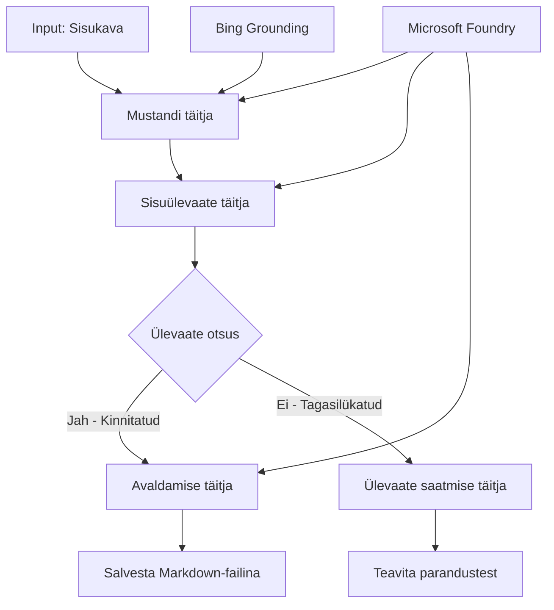

# 🔀 Tingimuslikud Agendi Töövood Microsoft Foundry'ga (.NET)

## 📋 Intelligentsed Otsustel Põhinevad Töövoo Juhendid

See märkmik demonstreerib **tingimuslikke töövoomustreid** Microsoft Foundry ja Microsoft Agent Framework .NET jaoks abil. Õpite, kuidas luua keerukaid, otsustest juhitud töövooge, mis suunavad protsesse intelligentsete AI-analüüside, ärireeglite ja dünaamiliste tingimuste põhjal ettevõtte tasemel automatiseerimiseks.

## 🎯 Õpieesmärgid

### 🧠 **Intelligentne Otsustusarhitektuur**
- **Tingimusliku Loogika Rakendamine**: Ehitage keerukaid otsustuspuusid mitmete harudega
- **AI-toega Suunamine**: Kasutage Microsoft Foundry mudeleid intelligentsete otsustusotsuste tegemiseks
- **Dünaamiline Töövoo Kohandamine**: Muutke töövoo käitumist reaalajas analüüsi ja tingimuste põhjal
- **Ettevõtte Reeglite Integratsioon**: Lisage äriloogika ja vastavusnõuded töövoogudesse

### 🔀 **Täiustatud Tingimuslikud Mustrid**
- **Mitmekriteeriumiline Otsustamine**: Hinnake suunamise otsuste tegemisel mitut tegurit
- **Kontekstitundlik Töötlemine**: Tehke otsused kogutud töövoo konteksti ja ajaloo põhjal
- **Kohanduv Töövoo Muutmine**: Dünaamiliselt reguleerige töötlusradu reaalsete tingimuste alusel
- **Reegli Mootori Integratsioon**: Rakendage keerukaid ärireeglite mootoreid töövoogudes

### 🏢 **Ettevõtte Tingimuslikud Rakendused**
- **Dokumendi Klassifitseerimine ja Suunamine**: Automaatne dokumentide klassifitseerimine ja sobivate töövoogudele suunamine
- **Klienditeeninduse Valimine**: Intelligentsed kliendipäringute suunamised spetsialiseeritud meeskondadele
- **Vastavuse ja Riski Töötlemine**: Rakendage erinevaid valideerimis- ja läbivaatamisprotsesse riski hindamise põhjal
- **Kvaliteedikindlustuse Töövood**: Suunake sisu sobivatele läbivaatamisprotsessidele kvaliteedimõõdikute põhjal

## ⚙️ Nõuded ja Seadistamine

### 📦 **Nõutavad NuGet Pakid**

Täiustatud paketid tingimusliku töövoo töötlemiseks:

```xml
<!-- Core AI Framework -->
<PackageReference Include="Microsoft.Extensions.AI" Version="9.9.0" />

<!-- Azure AI Agents with Persistent State -->
<PackageReference Include="Azure.AI.Agents.Persistent" Version="1.2.0-beta.5" />

<!-- Azure Identity and Utilities -->
<PackageReference Include="Azure.Identity" Version="1.15.0" />
<PackageReference Include="System.Linq.Async" Version="6.0.3" />
<PackageReference Include="DotNetEnv" Version="3.1.1" />

<!-- Local Workflow Framework References -->
<!-- Microsoft.Agents.Workflows.dll - Advanced workflow orchestration -->
<!-- Microsoft.Agents.AI.AzureAI.dll - Microsoft Foundry integration -->
<!-- Microsoft.Agents.AI.dll - Core agent abstractions -->
```

### 🔑 **Microsoft Foundry Konfiguratsioon**

**Nõutavad Azure Ressursid:**
- Microsoft Foundry tööruum tingimusliku protsesside mudelitega
- Azure tellimus sobivate arvutusmahtude ja õigustega
- Paigaldatud AI mudelid otsuste tegemiseks ja sisuanalüüsiks
- (Valikuline) Bing Search API ühendus info kinnitamiseks

**Keskkonna seadistus (.env fail):**
```env
# Microsoft Foundry Configuration
AZURE_AI_PROJECT_ENDPOINT=https://your-project.cognitiveservices.azure.com/
BING_CONNECTION_ID=your-bing-connection-id
```

**Autentimise Seadistamine:**
```csharp
// Azure CLI or Managed Identity authentication
using Azure.Identity;
var credential = new AzureCliCredential();

// Load environment configuration
DotNetEnv.Env.Load("../../../.env");
```

### 🏗️ **Tingimusliku Töövoo Arhitektuur**



**Põhikomponendid:**
- **Draft Executor**: AI agent, mis loob esialgsed sisu mustandid ülevaadete põhjal
- **Content Review Executor**: AI agent, mis hindab mustandi kvaliteeti ja vastavust
- **Tingimuslik Suunamine**: Otsustusloogika, mis suunab ülevaate tulemustest lähtuvalt
- **Avaldamise/Läbivaatamise Rajad**: Eraldi protsessirada heakskiidetud ja tagasilükatud sisu jaoks
- **Staatuse Halduse**: Säilitab sisu ja ülevaate konteksti kogu töövoo jooksul

## 🎨 **Tingimusliku Töövoo Disainimustrid**

### 📋 **Sisu Loomine Kvaliteedikontrolli Lävenditega**
```
Outline → Draft Creation → Quality Review → {Approve: Publish | Reject: Revise}
```

### 🎯 **Risikupõhine Dokumenditöötlus**
```
Document → Risk Assessment → {Low: Standard | High: Enhanced Review}
```

### 🔍 **Intelligentsed Klienditeeninduse Suunamised**
```
Customer Query → Analysis → {Simple: FAQ Bot | Complex: Human Agent}
```

### 💼 **Vastavuspõhised Töövood**
```
Content → Compliance Check → {Pass: Publish | Fail: Legal Review}
```

## 🏢 **Ettevõtte Tingimuslikud Kasud**

### 🎯 **Intelligentne Automaatika**
- **Nutikas Otsustamine**: AI-toega suunamised sisuanalüüsi ja konteksti alusel
- **Kohanduv Töötlemine**: Töövood, mis automaatselt kohanduvad muutuvate tingimustega
- **Ärireeglite Täitmine**: Keeruka äriloogika ja poliitikate automaatne rakendamine
- **Kontekstitundlik Suunamine**: Otsused põhinevad kogu töövoo ajaloos ja kogutud kontekstis

### 📈 **Töökorralduse Tipptase**
- **Optimeeritud Ressursside Jaotus**: Suuname töö sobivaimatele spetsialistidele ja protsessidele
- **Vähendatud Manuaalne Sekkumine**: Automatiseeritud otsustamine minimeerib vajadust inimeste sekkumiseks
- **Kiirem Lahendamise Aeg**: Otsene suunamine sobivale teadmiste- ja töötlemisvõimekusele
- **Järjepidev Rakendus**: Ühtlane ärireeglite ja otsustamiskriteeriumite rakendamine

### 🛡️ **Riskide Haldamine ja Vastavus**
- **Automatiseeritud Riskehindamine**: AI-toega sisu ja olukorra riski tasemete hindamine
- **Vastavuse Täitmine**: Automaatne suunamine vajalike regulatiivsete protsesside kaudu
- **Turvaprotokollide Rakendus**: Paranenud turvameetmed riskihinnangu põhjal
- **Auditiloengi Säilitamine**: Täielik dokumentatsioon suunamisotsustest ja põhjendustest

### 📊 **Analüütika ja Jätkuv Parendamine**
- **Otsustusanalüütika**: Jälgige suunamisotsuste efektiivsust ja täpsust
- **Mustrite Tuvastamine**: Märkige suunamistrende ja mustreid ajas
- **Tulemuslikkuse Optimeerimine**: Jätkuv otsustamiskriteeriumite ja suunamise tõhususe parendamine
- **Ärianalüüs**: Teadmised sisu omadustest ja töötlemisnõuetest

### 🔧 **Tehniline Täiuslikkus**
- **Püsiv State Management**: Säilitage keerulist olekut kogu töövoo jooksul
- **Skaalautuv Arhitektuur**: Käsitlege tingimusliku töötlemise suurmahtusid
- **Integratsiooni Võimalused**: Sujuv ühendamine olemasolevate ärisüsteemide ja protsessidega
- **Jälgimine ja Jälgitavus**: Ulatuslik töövoo jõudluse ja otsuste jälgimine

Loome intelligentseid otsustusjuhitud ettevõtte töövooge .NET-iga! 🚀

## 💻 Koodi Käivitamine

Täielik rakendus on saadaval failis `04.dotnet-agent-framework-workflow-aifoundry-condition.cs`. See demonstreerib **sisuloomise töövoogu kvaliteedikontrolli lävenditega**:

### 🏗️ **Töövoo Arhitektuur**

```
Content Outline → Draft Creation → Quality Review → Conditional Routing:
                                                      ├─ Approved (>200 words) → Publish
                                                      └─ Rejected (<200 words) → Review Notification
```

**Agendid töövoos:**
1. **Evangelist Agent**: Loob juhendite mustandid ülesehituste alusel Bing'i toe abil
2. **Content Reviewer Agent**: Hindab mustandi kvaliteeti (sõnade arv, täielikkus)
3. **Publisher Agent**: Salvestab heakskiidetud sisu kuupäevastatud Markdown failidena

**Kohandatud Täitjad:**
1. **DraftExecutor**: Korraldab mustandi loomist
2. **ContentReviewExecutor**: Teostab kvaliteedi hindamist
3. **PublishExecutor**: Tegeleb heakskiidetud sisu avaldamisega
4. **SendReviewExecutor**: Haldab tagasilükatud sisu teavitusi

### 🚀 Näite Käivitamine

**Eeltingimused:**
- Microsoft Foundry tööruum konfigureeritud
- Azure CLI autentimine (`az login`)
- (Valikuline) Bing Search ühendus informatsiooni kinnitamiseks

```bash
# Tee skript täidetavaks (Unix/Linux/macOS)
chmod +x 04.dotnet-agent-framework-workflow-aifoundry-condition.cs

# Käivita tingimuslik töövoog
./04.dotnet-agent-framework-workflow-aifoundry-condition.cs
```

Või Windowsis:
```powershell
dotnet run 04.dotnet-agent-framework-workflow-aifoundry-condition.cs
```

### 📝 Oodatud Väljund

Töövoog:
1. **Loo Agendid**: Initsialiseerib kolm spetsialiseeritud Microsoft Foundry agenti
2. **Genereeri Mustand**: Evangelist agent loob juhendi mustandi
3. **Ülevaata Sisu**: Content Reviewer hindab mustandi kvaliteeti
4. **Tingimuslik Suunamine**:
   - **Kui heaks kiidetud (>200 sõna)**: PublishExecutor salvestab Markdown failina
   - **Kui tagasi lükatud (<200 sõna)**: Saada ülevaatuse teade
5. **Kuva Tulemused**: Näita lõplikku töövoo tulemust

### 🔧 Kohandamise Valikud

**Muuda Ülevaatamiskriteeriume:**
```csharp
const string ContentReviewerInstructions = @"
You are a content reviewer...
1. Check if content is more than 500 words (instead of 200)
2. Verify technical accuracy
3. Ensure proper formatting
...";
```

**Lisa Rohkem Tingimuslikke Radu:**
```csharp
var workflow = new WorkflowBuilder(draftExecutor)
    .AddEdge(draftExecutor, contentReviewerExecutor)
    .AddEdge(contentReviewerExecutor, publishExecutor, condition: GetCondition("Excellent"))
    .AddEdge(contentReviewerExecutor, editExecutor, condition: GetCondition("Good"))
    .AddEdge(contentReviewerExecutor, sendReviewerExecutor, condition: GetCondition("Poor"))
    .Build();
```

**Muuda Sisu Nõudeid:**
```csharp
string OUTLINE_Content = @"
# Your Custom Topic
## Section 1
https://your-reference-url
## Section 2
...
";
```

### 🎯 Reaalsed Rakendused

See tingimuslik töövoomuster sobib ideaalselt:
- **Sisuhaldussüsteemid**: Automatiseeritud toimetusvood kvaliteedikontrolli lävenditega
- **Dokumenditöötlus**: Suunake dokumendid klassifikatsiooni ja vastavuse alusel
- **Klienditugi**: Intelligentsed piletite suunamised keerukuse ja kiireloomulisuse põhjal
- **Juriidiline Ülevaatus**: Suunake lepingud riski hindamise ja väärtuse alusel
- **HR Protsessid**: Suunake taotlused sobivateks hindamisvoogudeks

### 🔍 Tingimusloogika Mõistmine

**Tingimuse Funktsioon:**
```csharp
public Func<object?, bool> GetCondition(string expectedResult) =>
    reviewResult => reviewResult is ReviewResult review && review.Result == expectedResult;
```

See funktsioon loob predikaadi, mis:
1. Kontrollib, kas tulemus on tüüpi `ReviewResult`
2. Võrdleb `Result` omadust oodatud väärtusega
3. Tagastab true/false suunamise määramiseks

**Tingimusliku Töövoo Hargnemised:**
```csharp
.AddEdge(contentReviewerExecutor, publishExecutor, condition: GetCondition("Yes"))
.AddEdge(contentReviewerExecutor, sendReviewerExecutor, condition: GetCondition("No"))
```

### 📊 Täiustatud Funktsioonid

**JSON Skemade Kontroll:**
Töövoog kasutab JSON skeeme struktureeritud vastuste tagamiseks:

```csharp
// Define response structure
public class ReviewResult
{
    [JsonPropertyName("review_result")]
    public string Result { get; set; } = string.Empty;
    
    [JsonPropertyName("reason")]
    public string Reason { get; set; } = string.Empty;
    
    [JsonPropertyName("draft_content")]
    public string DraftContent { get; set; } = string.Empty;
}

// Apply to agent
ResponseFormat = ChatResponseFormat.ForJsonSchema(
    AIJsonUtilities.CreateJsonSchema(typeof(ReviewResult)), 
    "ReviewResult", 
    "Review Result From DraftContent"
)
```

**Bing'i Infoallika Integratsioon:**
Evangelist agent kasutab Bing'i infoallikat reaalajas teabe saamiseks:

```csharp
var bingGroundingConfig = new BingGroundingSearchConfiguration(bing_conn_id);
BingGroundingToolDefinition bingGroundingTool = new(
    new BingGroundingSearchToolParameters([bingGroundingConfig])
);
```

See lubab agendil järgida URL-e juhendis ja väljavõtta jooksvalt infot.

### 🛡️ Veakäsitlus

Töövoos on tugeva veahaldus tagasilükatud sisu jaoks:
- Ülevaatusvead käivitavad alternatiivse rada
- Teavitused annavad selged tagasilükkamise põhjused
- Sisu säilitatakse parandusvooruks

### 🔄 Töövoo Laiendamine

**Lisa Parandusring:**
Loo tagasisideahel, mis automaatselt loob sisu uuesti:

```csharp
.AddEdge(contentReviewerExecutor, publishExecutor, condition: GetCondition("Yes"))
.AddEdge(contentReviewerExecutor, draftExecutor, condition: GetCondition("No")) // Loop back
```

**Rakenda Mitmeastmeline Ülevaatus:**
Lisa mitu hindamisfaasi eri kriteeriumidega:

```csharp
.AddEdge(draftExecutor, technicalReviewer)
.AddEdge(technicalReviewer, editorialReviewer, condition: GetCondition("TechPass"))
.AddEdge(editorialReviewer, publishExecutor, condition: GetCondition("EditPass"))
```

See tingimuslik töövoomuster on alus keerukate, intelligentsete ettevõtte automatiseerimissüsteemide ehitamiseks! 🚀

---

<!-- CO-OP TRANSLATOR DISCLAIMER START -->
**Lahtiütlus**:
See dokument on tõlgitud kasutades AI tõlketeenust [Co-op Translator](https://github.com/Azure/co-op-translator). Kuigi me püüdleme täpsuse poole, palun pange tähele, et automatiseeritud tõlgetes võib esineda vigu või ebatäpsusi. Originaaldokument selle emakeeles tuleks pidada autoriteetseks allikaks. Olulise teabe puhul soovitatakse kasutada professionaalset inimtõlget. Me ei vastuta selle tõlkega seotud eksimustest või valesti mõistmistest.
<!-- CO-OP TRANSLATOR DISCLAIMER END -->