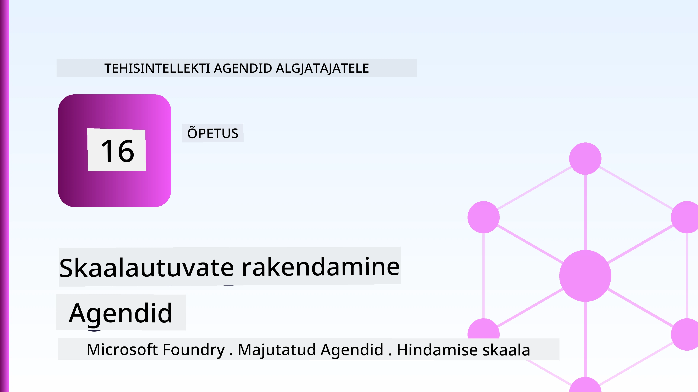
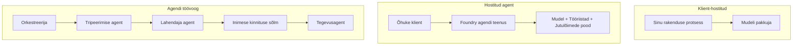
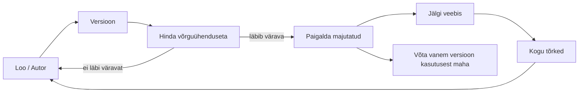
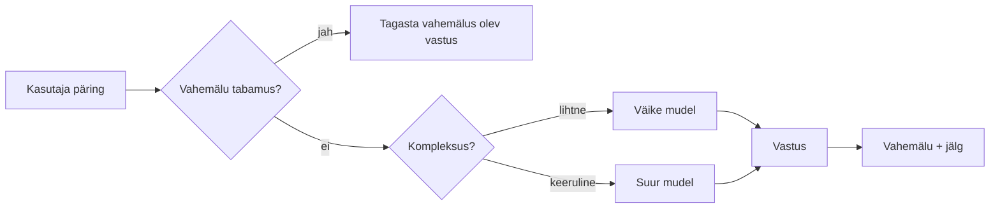
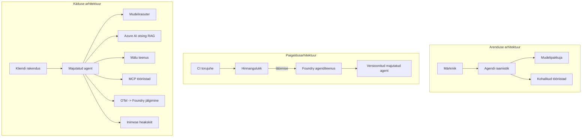

# Skaalautuvate agentide juurutamine Microsoft Foundryga



Kursuse selleks hetkeks oled ehitanud agente, kes töötavad sinu sülearvutis, märkmetes, juhituna `az login` ja mõne keskkonnamuutujaga. See on täiesti õige viis õppimiseks. See pole aga õige viis agenti käivitada, kellele tuhanded kliendid sõltuvad kell 3 öösel.

See õppetund käsitleb lõhet „see töötab minu masinas“ ja „see töötab usaldusväärselt ja taskukohaselt tootmises“ vahel. Sulgeme selle lõhe, kasutades **Microsoft Foundry** ja **Microsoft Foundry Agent Service** teenuseid, ning teeme seda, luues tõelise klienditoe agendi, millel on tööriistad, otsing, mälu, hinnang ja seire.

## Sissejuhatus

See õppetund käsitleb:

- Erinevus **prototüüp-agendi** ja **juurutatud agendi** vahel ning miks üleminek puudutab enamasti kõike *mudeli ümber*.
- Agentide **juurutusmustrid**: kliendi majutatud, teenuse majutatud (Hosted Agents) ja töövoo korraldatud.
- **Agendi elutsükkel** Microsoft Foundrys — loomine, versioonimine, juurutamine, hindamine, jälgimine, pensionile jäämine.
- **Skaalautusstrateegiad**: mudeli marsruutimine, vahemällu salvestamine, samaaegsus ja olekuta disain.
- **Jälgitavus** OpenTelemetry ja Foundry jälgimisega.
- **Kuluoptimeerimine** mudeli valiku, marsruutimise ja hindamisväravate kaudu.
- **Ettevõttetasandi kaalutlused**: juhtimine, inimtõendamine ja MCP serverite turvaline käitamine tootmises.

## Õpieesmärgid

Pärast selle õppetunniga lõpetamist oskad:

- Valida antud agendikoormuse jaoks õige juurutusmustri.
- Juurutada agent Microsoft Foundry Agent Service’i, nii et see oleks versioonitud, juhitud ja jälgitav.
- Instrumenteerida agent jälgimiseks ja ühendada väärtuspõhine hindamise torujuhe, mis töötab iga väljaande eel.
- Rakendada mudeli marsruutimist ja vahemällu salvestamist, et hoida latentsus ja kulu skaalal kontrolli all.
- Lisada inimtõenduse värav kõrge riskiga toimingute jaoks ja integreerida MCP server tootmises turvaliselt.

## Eeltingimused

Eeldatakse, et oled lõpetanud varasemad õppetunnid ja oled mugav järgmistes:

- Agentide ehitamine [Microsoft Agent Frameworkiga](../14-microsoft-agent-framework/README.md) (õppetund 14).
- [Tööriistade kasutamine](../04-tool-use/README.md) (õppetund 4) ja [Agentic RAG](../05-agentic-rag/README.md) (õppetund 5).
- [Agendi mälu](../13-agent-memory/README.md) (õppetund 13) ja [Agentic Protocols / MCP](../11-agentic-protocols/README.md) (õppetund 11).
- [Jälgitavus ja hindamine](../10-ai-agents-production/README.md) (õppetund 10) — see õppetund tugineb otse sellele.

Sul on vaja ka:

- **Azure’i tellimus** ja **Microsoft Foundry projekt** vähemalt ühe juurutatud vestlusmudeliga.
- Autentitud **Azure CLI** (`az login`).
- Python 3.12+ koos hoidlas olevate pakettidega [`requirements.txt`](../../../requirements.txt).

## Prototüübist tootmisesse: mis tegelikult muutub

Prototüüp-agent ja tootmisagent jagavad sama põhitsüklit — mõtlemine, tööriistade kutsumine, vastamine. Muu kõrvutav on aga erinev. Mudel moodustab tootmisagendist ehk 20%, ülejäänud 80% on operatiivne karkass.

| Teema | Prototüüp | Tootmine |
| --- | --- | --- |
| **Majutamine** | Jookseb sinu märkmetes | Jookseb majutatud teenusena, versioonitud ja välja lastud |
| **Identiteet** | Sinu `az login` token | Hallatud identiteet koos ulatusliku RBAC-iga |
| **Olek** | Mälus, kaob taaskäivitusel | Välise teenuse poolt hallatud (niidipood, mäluteenistus) |
| **Rikked** | Näed virna tagasikutset | Taaskatsed, varuplaanid, surnukirjad, hoiatused |
| **Kulu** | „See on paar senti“ | Jälgitakse iga päringu kohta, marsruuditakse, vahemällu salvestatakse, eelarvestatakse |
| **Kvaliteet** | Silmaga kontrollid väljundit | Hinnatakse automaatselt iga väljaande eel |
| **Usaldus** | Sa kiidad iga toimingu heaks | Poliitika + inimtõendusega riskantsete toimingute jaoks |

Hoia seda tabelit meeles. Alljärgnevad jaotised vastavad ühele selle tabeli reale.

## Agendi juurutusmustrid

Sa kasutad kolme mustrit, sageli koos:

### 1. Kliendi majutatud agendid

Agent elab *sinu* rakenduse protsessis. Sinu kood kutsub mudeli pakkujat otse; mõtlemistsükkel jookseb sinu teenuses. Kõik varasemad õppetunnid on töötanud nii.

- **Kasuta, kui** vajad täielikku kontrolli tsükli üle, kohandatud vahendust või sul on tarvis agenti olemasolevasse tagasüsteemi manustada.
- **Kaubanduslik kompromiss**: vastutad ise skaleerimise, oleku ja vastupidavuse eest.

### 2. Majutatud agendid (Foundry Agent Service)

Agent registreeritakse Microsoft Foundry ressurssina. Foundry majutab mõtlemistsükli, salvestab niidid, tagab sisuturvalisuse ja RBAC-i ning teeb agendi nähtavaks Foundry portaalis. Sinu rakendus muutub õhukeseks kliendiks, mis loob niite ja loeb vastuseid.

- **Kasuta, kui** tahad vastupidavust, sisseehitatud jälgitavust, juhtimist ja väiksemat operatiivset pinda.
- **Kaubanduslik kompromiss**: vähem madala taseme kontrolli vastukaaluks hallatavale käituskeskkonnale.

### 3. Agendi töövood

Mitmed agendid (ja tööriistad) on koondatud graafikusse selge kontrollvooga — järjestikused sammud, haruvalikud, inimtõenduse sõlmed ja vastupidavad kontrollpunktid, mis võivad peatuda ja jätkata. See on Microsoft Agent Frameworki **Workflows** võimekus, rakendatuna juurutusmastaabis.

- **Kasuta, kui** üks ülesanne hõlmab mitut spetsialiseerunud agenti või vajab keskel heakskiitu.
- **Kaubanduslik kompromiss**: rohkem liikuvat osa; vajab orkestratsiooni tasandi jälgitavust.



## Agendi elutsükkel Microsoft Foundrys

Agendi juurutamine ei ole ühekordne `push`. See on tsükkel, mis sarnaneb väga tarkvara väljaandetsükliga, sest see ongi täpselt see.



Põhiidee, mis on võetud üle [õppetunnist 10](../10-ai-agents-production/README.md): **offline hindamine on värav, mitte mõttetu samm.** Uut agenti ei tarnita, kui see ei läbi sinu hindamiskünniseid. Veebi jälgitavus toob siis reaalsete vigade tagasiside sinu offline testikomplektile. See ongi kogu tsükkel.

## Skaalautusstrateegiad

Agendi skaleerimine erineb olekuta veebipõhise API skaleerimisest, sest iga päring võib esile kutsuda mitu kulukat mudeli ja tööriista kutsumist. Neli tehnikat kannavad enamikku koormusest.

**Olekuta päringute töötlemine.** Ära hoia protsessi mälus ühtki kasutaja spetsiifilist olekut. Säilita vestlusniidid Foundry niidipoes või mäluteenistuses, nii et iga näidis saab igat päringut töödelda. See võimaldab sul horisontaalselt skaleerida — lisa näidiseid, ilma kleepuvate sessioonideta.

**Mudeli marsruutimine.** Igas päringus ei ole vaja kasutada kõige võimekamat (ja kõige kallimat) mudelit. Suuna lihtsad päringud — kavatsuse klassifitseerimine, lühikesed faktilised vastused — väikesele ja kiirusele mudelile ning suurem mudel reserveeri tõelisele mõtlemisele. Foundry **Model Router** suudab seda sinu eest teha, või saad ise ehitada kergekaalulise klassifikaatori. Laboris ehitad selle DIY versiooni.

**Vastuse vahemällu salvestamine.** Paljud tugipäringud on peaaegu topeltpäringud („kuidas ma oma parooli resetin?“). Vahemälu ühistele küsimustele ja serveeri vastuseid ilma mudelit üldse kutsumata. Isegi tagasihoidlik vahemälu tabamuse määr vähendab oluliselt kulusid ja latentsust.

**Samaaegsus ja tagasurve.** Mudelite pakkujatel on kiiruspiirangud. Piira oma samaaegsust, kasuta eksponentsiaalset tagasipöördega katsetamist ja ebaõnnestumisel käitu väärikalt (järjekorda pandud „me töötame selle kallal“ vastus on parem kui 500 veateade).



## Jälgitavus tootmises

Sa ei saa juhtida, mida sa ei näe. Nagu õppetunni 10 alguses käsitleti, Microsoft Agent Framework eraldab loomupäraselt **OpenTelemetry** jälgi — iga mudeli kutse, tööriista kutsumine ja orkestreerimisaste muutub jälgialaks. Tootmises ekspordid need jäljed Microsoft Foundry (või mõne OTel-ühilduva tagasuunaga), et saaksid:

- Jälgida ühe kliendi kaebust algusest lõpuni läbi iga mudeli ja tööriista kutsumise.
- Vaadata p50/p95 latentsust ja kulu iga päringu kohta aja jooksul.
- Hoiatada veamäära tõusude ja kulude anomaaliate kohta enne kui sinu kasutajad (või finantsosakond) seda märkavad.

```python
from agent_framework.observability import get_tracer

tracer = get_tracer()

with tracer.start_as_current_span("support_request") as span:
    span.set_attribute("customer.tier", "enterprise")
    span.set_attribute("routed.model", "gpt-5-nano")
    # agendi täitmist jälgitakse selles ulatuses automaatselt
```

Atribuudid nagu `customer.tier` ja `routed.model` muudavad jälgede kogumi vastatavateks küsimusteks („kas ettevõttekliendid suunatakse liiga sageli väikesele mudelile?“).

## Kuluoptimeerimine

Tootmisagentide kulusid mõjutavad domineerivalt sümbolid (tokens). Kolm hoobasid, mõjususjärjestuses:

1. **Õige suurusega mudel.** Väike mudel, mis läbib sinu hindamisvärava, on peaaegu alati odavam kui suur mudel, mis samuti läbib. Kasuta hindamist, et *tõestada* väikese mudeli sobivust, mitte vaikimisi valida suurimat mudelit ettevaatlikkusest.
2. **Marsruutimine keerukuse alusel.** Nagu eespool — maksa suur mudeli hinna eest vaid päringute eest, mis vajavad suurmõtlemist.
3. **Tugev vahemällu salvestamine.** Kõige odavam mudeli kutse on see, mida sa ei tee.

Hindamisväravad ja kulude kontroll on sama distsipliini kaks vaadet: hindamine ütleb *kvaliteedi põranda*, marsruutimine ja vahemälu hoiavad sind võimalikult selle põranda *kulu* lähedal.

## Ettevõttetasandi juurutuskaalutlused

**Juhtimine.** Hosted Agents pärivad Foundry RBAC, sisuturvalisuse ja auditeerimislogimise. Iga agendi jaoks anna hallatud identiteet vähima õigusega, mida vaja — lugemisõigus teadmistebaasile, piiritletud ligipääs piletite API-le, mitte midagi rohkemat.

**Inimene kaasatud.** Mõned toimingud on liiga tagajärjerikkad automaatseks tegutsemiseks — tagasimakse tegemine, konto kustutamine, õigusmeeskonnale eskaleerimine. Microsoft Agent Framework toetab **heakskiidu nõudvaid** tööriistu: agent teeb ettepaneku, täideviimine peatub, inimene kiidab heaks või lükkab tagasi ning töövoog jätkub. Seda primitiivi nägid sa [õppetunnis 6](../06-building-trustworthy-agents/README.md); siin sa seda juurutad.

**MCP tootmises.** [MCP](../11-agentic-protocols/README.md) lubab agentidel tarbida väliseid tööriistu standardliidese kaudu. Tootmises käsitle iga MCP serverit kui usaldamatut piiri: paiguta serveri versioon, käivita see piiratud identiteediga, valideeri väljundid ja ära kunagi avalikusta talle saladusi. MCP server on sõltuvus, mida parandatakse, auditeeritakse ja millele kehtestatakse kiiruspiirangud.



Need kolm diagrammi — arendus, juurutus, jooksvaaja — kujutavad sama agenti kolme elufaasi. Järgmine labor juhendab sind selle ehitamise juures.

## Praktikum: tootmisvalmis klienditoe agent

Ava [`code_samples/16-python-agent-framework.ipynb`](./code_samples/16-python-agent-framework.ipynb) ja tee see lõpuni läbi. Koostatakse **Contoso klienditoe agent**, mille iga tootmisküsimus on lahendatud:

1. **Tööriistakõned** — vaata tellimuste staatust ja ava tugipileteid.
2. **RAG** — vasta teadmistebaasil põhinevatele poliitikaküsimustele (Azure AI Search, koos mälupõhise varuplaaniga, nii et märkmik töötab ka ilma Search ressursita).
3. **Mälu** — mäleta klienti vestluse käigus.
4. **Mudeli marsruutimine** — keerukuse klassifikaator suunab iga päringu väikesele või suurele mudelile.
5. **Vastuse vahemällu salvestamine** — korduvad küsimused serveeritakse vahemälust.
6. **Inimese heakskiit** — tagasimaksed üle läve peatatakse inimheakskiidu ära ootamiseks.
7. **Hindamisvoog** — väike offline testikomplekt hindab agenti ja toimib väljaande väravana.
8. **Jälgitavus** — OpenTelemetry jälgimine iga päringu ümber.

### Läbivaatus

Märkmik on organiseeritud nii, et iga tootmisküsimus on iseseisev jooksutatav plokk. Selle süda on marsruutimise- ja vahemälu päringukäsitleja:

```python
async def handle_support_request(query: str, customer_id: str) -> str:
    # 1. Teenindage vahemälust, kui saame.
    cached = response_cache.get(normalize(query))
    if cached:
        return cached

    # 2. Marsruutige keerukuse järgi kulude kontrollimiseks.
    model = "gpt-5-nano" if is_simple(query) else "gpt-5-mini"

    # 3. Käivitage agent jälgimisalal jälgitavuse jaoks.
    with tracer.start_as_current_span("support_request") as span:
        span.set_attribute("routed.model", model)
        span.set_attribute("customer.id", customer_id)
        response = await support_agent.run(query, model=model)

    # 4. Vahemälu ja tagasta.
    response_cache.set(normalize(query), response.text)
    return response.text
```

Hindamisvärav, mis kaitseb väljaannet, näeb välja selline:

```python
async def evaluation_gate(agent, test_cases, threshold: float = 0.8) -> bool:
    passed = 0
    for case in test_cases:
        result = await agent.run(case["input"])
        if score_response(result.text, case["expected"]) >= 0.8:
            passed += 1
    pass_rate = passed / len(test_cases)
    print(f"Evaluation pass rate: {pass_rate:.0%} (gate: {threshold:.0%})")
    return pass_rate >= threshold  # rakenda ainult siis, kui värav läbib
```

Loe iga rida läbi — märkmik hoiab primitiivid tahtlikult väikestena, nii et miski pole raamistikukutse taha peidetud.

## Juurutatud agendi valideerimine suitsutestidega

Ülaltoodud hindamisvärav jookseb *offline* sinu agentobjekti vastu. Kui agent on juurutatud Hosted Agentina, vajad veel üht veel odavamat kontrolli: **kas juurutatud lõpp-punkt vastab tegelikult?**

„Õnnestunud“ juurutamine tõestab ainult, et juhtimistasand aktsepteeris definitsiooni — see ei tõesta, et agent vastab. Puuduv sõltuvus, halb mudelimarsruut või aegunud ühendus võivad jätta rohelist valmimist, mis ei tagasta midagi. **Suitsutest** tabab selle sekunditega, iga juurutuse järel, ilma täishindamise kuluta.

See hoidla sisaldab kasutusvalmis suitsutesti torujuhtme, mis põhineb [AI Smoke Test](https://github.com/marketplace/actions/ai-smoke-test) GitHub Actionil:

- **Kataloog** — [`tests/lesson-16-smoke-tests.json`](../../../tests/lesson-16-smoke-tests.json) sisaldab küsimusi ja väiteid Contoso tugiteenuse agendi kohta (toetatud poliitikavastused, tellimuste otsing, teemast kinni pidamine ja mitme intervjuu niidi järjepidevus). Teiste õppetundide agentide kataloogid asuvad selle kõrval — vaata [`tests/README.md`](../tests/README.md).
- **Töövoog** — [`.github/workflows/smoke-test.yml`](../../../.github/workflows/smoke-test.yml) logib sisse Azure OIDC-ga ja POSTitab iga küsimuse agendi Responses lõpp-punkti, ebaõnnestudes töö igal tõrkel.

```yaml
- name: Smoke-test hosted agent
  uses: JFolberth/ai-smoketest@v1
  with:
    project_endpoint: ${{ inputs.project_endpoint }}
    agent_name: ContosoSupportAgent
    tests_file: tests/lesson-16-smoke-tests.json
```


Käivitage see vahekaardilt **Tegevused** (Actions), kui teie agent on juurutatud, andes sisse oma Foundry projekti lõpp-punkti ja agendi nime. Föderaalne identiteet vajab Foundry projekti ulatuses rolli **Azure AI kasutaja**. Mõelge kihtidele kui püramiidile: suitsutestid (kas on ligipääsetav ja reageerib?) jooksevad iga juurutuse korral, võrguühenduseta hindamine (kas piisav saatmiseks?) jookseb enne edutamist ja võrguhindamine (kuidas see metsikus toimib?) jookseb pidevalt.

## Teadmiste kontroll

Testige oma arusaamist enne ülesandega edasi liikumist.

**1. Umbes kui suur osa tootmisagendist on "mudel" ja mis on ülejäänu?**

<details>
<summary>Vastus</summary>

Mudel on süsteemi vähemusosa — sageli mainitakse umbes 20%. Ülejäänu on operatiivne skelett: majutamine ja versioonihaldus, identiteet ja RBAC, eksternaliseeritud seisund, rikkehaldus, kulude jälgimine, hindamine ja inimlülis kontrollid. Tootmisse liikumine on enamasti seotud kõigega, mis on *mõtlemistsükli* ümber üles ehitatud.
</details>

**2. Millal valiksite majutatud agendi kliendiagenti asemel?**

<details>
<summary>Vastus</summary>

Kui soovite hallatud käitusaega koos sisseehitatud vastupidavusega (niidid, mis püsivad ja saavad jätkata), jälgitavust, sisu turvalisust ja RBAC-i ning olete valmis mõne madala taseme kontrolli arvelt saama väiksemat operatiivset pindala. Kliendiagent on eelistatum, kui vajate täielikku kontrolli tsükli üle või kui manustate agenti olemasolevasse tagalasse.
</details>

**3. Miks peab mastaapiv agent olema oma protsessimälus seisundita?**

<details>
<summary>Vastus</summary>

Nii saab ükskõik milline eksemplar käsitleda ükskõik millist päringut, mis võimaldab horisontaalset skaleerimist ilma seotud sessioonideta. Kasutajapõhine vestlusseisund on eksternaliseeritud niidiandmebaasi või mäluteenuse külge. Kui seisund elaks protsessimälus, kaotaksite selle taaskäivitamisel ja ei saaks koormust vabalt jaotada.
</details>

**4. Millist probleemi lahendab mudelite marsruutimine ja kuidas see seostub hindamisega?**

<details>
<summary>Vastus</summary>

Marsruutimine saadab lihtsad päringud väikesele, odavale ja kiirele mudelile ning hoiab suure mudeli päris mõtlemiseks, kontrollides nii latentsust kui kulusid. See seostub hindamisega, sest hindamine on see, mis *tõestab*, et väike mudel on piisav teatud päringute klassile — marsruutimine ilma hindamiseta on vaid oletamine.
</details>

**5. Mis on "hindamisvärav" ja kus see elutsüklis asub?**

<details>
<summary>Vastus</summary>

Hindamisvärav käivitab võrguühenduseta testkomplekti uue agendiversiooni vastu ja blokeerib juurutuse, kui edukuse määr ei ületa künnist. See asub elutsükli faaside "versioon" ja "juurutus" vahel, muutes kvaliteedi eeltingimuseks väljalaskmiseks, mitte millekski, mida kontrollitakse pärast saatmist.
</details>

**6. Miks peaks MCP serverit tootmiskeskkonnas käsitlema usaldamatuna piirinahana?**

<details>
<summary>Vastus</summary>

Sest tegemist on välise sõltuvusega, mida teie agent kutsub. Peaksite lukustama selle versiooni, käivitama selle piiritletud identiteediga, valideerima selle väljundid, rakendama hulga piiranguid ning mitte kunagi avalikustama sellel saladusi — sama distsipliini, mida kasutate iga kolmanda osapoole sõltuvuse puhul. Selle väljundid voolavad agenti mõtlemisse, nii et valideerimata usaldus on turvarisk.
</details>

**7. Milline üksik muudatus avaldab tavaliselt suurimat mõju tootmisagendi kuludele ja miks?**

<details>
<summary>Vastus</summary>

Õige suurusega mudel — kasutades kõige väiksemat mudelit, mis ikkagi läbib teie hindamisvärava. Kulud sõltuvad peamiselt tokenitest ja väiksem mudel, mis vastab kvaliteedinõuetele, on peaaegu alati odavam kui suurem mudel. Vahemällu salvestamine ja marsruutimine vähendavad kulu veelgi, kuid õige baasmudeli valikul on suurim esmatarbeline mõju.
</details>

**8. Millist rolli mängivad jälgimisomadused nagu `customer.tier` ja `routed.model` jälgitavuses?**

<details>
<summary>Vastus</summary>

Need muudavad toore jälje äriküsimusteks, millele saab vastata. Ilma omadusteta on teil hulganisti jälgi; omadustega saate küsida näiteks "kas ärikliendid suunatakse liiga tihti väikesele mudelile?" või "milline mudel käsitleb meie aeglaseimaid päringuid?" Omadused võimaldavad telemeetriat tükkideks lõigata teie tegevuse jaoks oluliste mõõtmete järgi.
</details>

## Ülesanne

Võtke laborist klienditoe agent ja tugevdage seda konkreetseks stsenaariumiks: **tellijaarvestuse tugipersonal SaaS ettevõttele.**

Teie esituses peaks olema:

1. **Asendage tööriistad** tellimisega seotud funktsioonidega: `get_subscription_status`, `get_invoice` ja `issue_credit` (krediidid üle 50 dollari nõuavad inimheakskiitu).
2. **Lisage kolm RAG dokumenti** ettevõtte tagasimaksetingimuste, arveldustsükli ja tühistamispoliitika kohta.
3. **Laiendage hindamiskomplekti** vähemalt kaheksa juhtumini, sealhulgas vähemalt kaks, mis *peavad* käivitama inimheakskiidu tee, ning kinnitage, et teie hindamisvärav läbib või ebaõnnestub õigesti.
4. **Lisage üks kuluraport**: pärast kümne segatud päringu läbimist agenti kaudu trükkige, mitu läks väikesele mudelile, mitu suurele mudelile ja mitu teenindati vahemälu kaudu.

Kirjutage lühike lõik (markdowni lahtrisse), selgitades, millise mudelite marsruutimise reegli valisite ja kuidas te selle reaalse liiklusega valideeriksite. Õigeid vastuseid pole üks; teid hinnatakse selle järgi, kas tootmisküsimused on sidusalt kokku seotud.

## Kokkuvõte

Selles õppetükis viisite agendi prototüübist tootmisse Microsoft Foundry abil:

- Tootmisse hüppamine on enamasti seotud **mudeli ümber oleva operatiivskeletiga** — majutamine, identiteet, seisund, rikkehaldus, kulud, kvaliteet ja usaldus.
- Õppisite kolme **juurutusmustrit** — kliendiagent, majutatud agendid ja agentide töövood — ning millal kumb sobib.
- Läksite läbi **agendi elutsükli**, kus võrguühenduseta **hindamine toimib väljalaskeväravana** ja võrguhindlikkus toob vigade kohta tagasisidet testkomplektile.
- Rakendasite **skaalustrateegiaid** — seisundita disain, mudelite marsruutimine, vahemällu salvestamine ja piiratud samaaegsus — ning sidusite need **kulude optimeerimisega**.
- Ühendsite **ettevõtte juhtimised**, nagu RBAC, inimlülis heakskiit ja tootmiskindel MCP integreerimine.
- Ehitasite **tootmisvalmis klienditoe agendi**, mis koondab kõik need küsimused töödeldavasse koodi.

Järgmine õppetükk läbib vastupidise tee: selle asemel, et agendi pilve üles skaleerida, toote selle alla ühe arendajamasina peale ja käivitate täielikult lokaalselt.

## Täiendavad ressursid

- <a href="https://learn.microsoft.com/azure/ai-foundry/what-is-azure-ai-foundry" target="_blank">Microsoft Foundry dokumentatsioon</a>
- <a href="https://learn.microsoft.com/azure/ai-foundry/agents/overview" target="_blank">Microsoft Foundry Agent Service ülevaade</a>
- <a href="https://aka.ms/ai-agents-beginners/agent-framework" target="_blank">Microsoft Agent Framework</a>
- <a href="https://learn.microsoft.com/azure/ai-foundry/concepts/model-router" target="_blank">Mudelimarsruuter Microsoft Foundry-s</a>
- <a href="https://learn.microsoft.com/azure/search/search-what-is-azure-search" target="_blank">Azure AI Search</a>
- <a href="https://opentelemetry.io/" target="_blank">OpenTelemetry</a>
- <a href="https://github.com/marketplace/actions/ai-smoke-test" target="_blank">AI Smoke Test GitHub Action</a>
- <a href="https://modelcontextprotocol.io/" target="_blank">Model Context Protocol (MCP)</a>

## Eelmine õppetükk

[Arvutikasutusagentide ehitamine (CUA)](../15-browser-use/README.md)

## Järgmine õppetükk

[Lokaalsete tehisintellekti agentide loomine](../17-creating-local-ai-agents/README.md)

---

<!-- CO-OP TRANSLATOR DISCLAIMER START -->
**Lahtiütlus**:
See dokument on tõlgitud kasutades AI tõlketeenust [Co-op Translator](https://github.com/Azure/co-op-translator). Kuigi me püüdleme täpsuse poole, palun pange tähele, et automatiseeritud tõlgetes võib esineda vigu või ebatäpsusi. Originaaldokument selle emakeeles tuleks pidada autoriteetseks allikaks. Olulise teabe puhul soovitatakse kasutada professionaalset inimtõlget. Me ei vastuta selle tõlkega seotud eksimustest või valesti mõistmistest.
<!-- CO-OP TRANSLATOR DISCLAIMER END -->