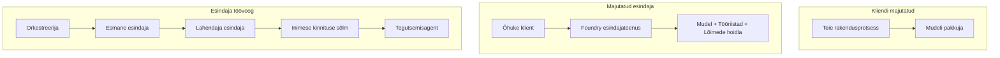
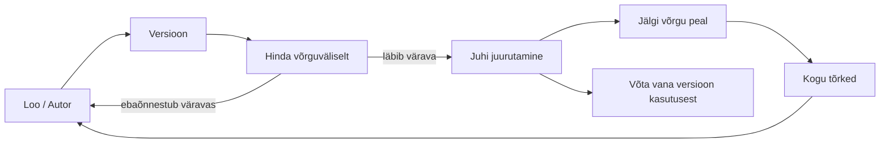
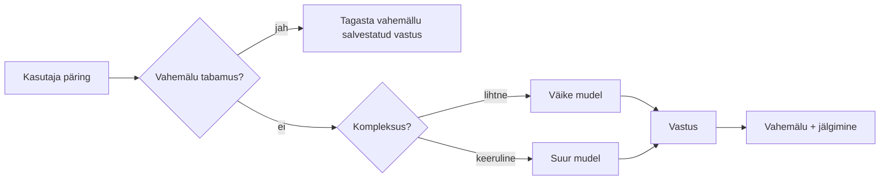
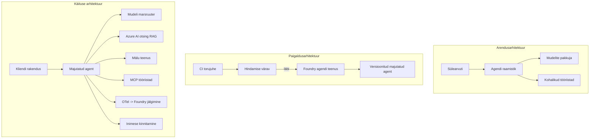

# Skalaarsete agentide juurutamine Microsoft Foundryga


Kuni selle kursuse punktini olete loonud agente, kes töötavad teie sülearvutis, märkmikus, juhituna `az login` ja käputäie keskkonnamuutujatega. See on õige viis õppimiseks. See ei ole õige viis agenti käivitamiseks, kellele tuhanded kliendid 3 hommikul toetuvad.

See õppetund räägib lõhest "see töötab minu masinal" ja "see töötab usaldusväärselt ja taskukohaselt tootmises" vahel. Selle lõhe sulgeme kasutades **Microsoft Foundry** ja **Microsoft Foundry Agent Service**, ehitades päris klienditoe agendi, millel on tööriistad, andmete hankimine, mälu, hindamine ja jälgimine.

## Sissejuhatus

See õppetund hõlmab:

- Erinevust **prototüüpagent** ja **juurutatud agenti** vahel ning miks on üleminek enamasti kõigest mudeli *ümber* olevast.
- Agentide **juurutusmustreid**: kliendi majutatud, teenuse majutatud (Hosted Agents) ja töövoo orkestreerimine.
- **Agentide elutsükkel** Microsoft Foundrys — loomine, versioonimine, juurutamine, hindamine, vaatlus, pensionile minek.
- **Skaalastrateegiad**: mudeli marsruutimine, vahemällu salvestamine, samaaegsus ja olekuta disain.
- **Jälgitavus** OpenTelemetry ja Foundry jälgimisega.
- **Kuluoptimeerimine** mudeli valiku, marsruutimise ja hindamislukkude kaudu.
- **Ettevõtte kaalutlused**: haldus, inimluba ja MCP-serverite ohutu käitamine tootmises.

## Õpieesmärgid

Pärast selle õppetunni lõpetamist oskate:

- Valida antud agentide töökoormuse jaoks õige juurutusmustri.
- Juurutada agent Microsoft Foundry Agent Service'i nii, et ta oleks versioonitud, hallatud ja jälgitav.
- Instrumenteerida agent jälgimiseks ja ühendada hindamisliin, mis töötab enne iga versiooni väljaandmist.
- Rakendada mudeli marsruutimist ja vahemälu hoidmaks latentsus ja kulud skaalal kontrolli all.
- Lisada inimluba kõrge riskiga toimingutele ja integreerida MCP server tootmises ohutult.

## Eeltingimused

See õppetund eeldab, et olete lõpetanud varasemad õppetunnid ja tunnete end mugavalt:

- Agentide loomist [Microsoft Agent Frameworkiga](../14-microsoft-agent-framework/README.md) (Õppetund 14).
- [Tööriistade kasutamine](../04-tool-use/README.md) (Õppetund 4) ja [Agentic RAG](../05-agentic-rag/README.md) (Õppetund 5).
- [Agendi mälu](../13-agent-memory/README.md) (Õppetund 13) ja [Agentic protokollid / MCP](../11-agentic-protocols/README.md) (Õppetund 11).
- [Jälgitavus ja hindamine](../10-ai-agents-production/README.md) (Õppetund 10) — see õppetund põhineb otseselt sellel.

Vajate ka:

- **Azure tellimust** ja **Microsoft Foundry projekti**, kus on vähemalt üks juurutatud vestlusmudel.
- Autentitud **Azure CLI** (`az login`).
- Python 3.12+ ja pakette hoidlas [`requirements.txt`](../../../requirements.txt).

## Prototüübist tootmisesse: mis tegelikult muutub

Prototüüpagendi ja tootmisagendi tuum on sama — järeldamine, tööriistade kutsumine, vastamine. Mis muutub, on kõik selle tsükli ümber. Mudel on tootmisagendist umbes 20%; ülejäänud 80% on operatiivne skelett.

| Teema | Prototüüp | Tootmine |
| --- | --- | --- |
| **Majutamine** | Jookseb teie märkmikus | Jookseb majutatud teenusena, versioonitud ja juurutatud |
| **Identiteet** | Teie `az login` tokeniga | Haldusega identiteet piiratud RBAC-iga |
| **Seisund** | Mälu sees, taaskäivitamisel kaob | Eksternaliseeritud (niidipood, mäluteenistus) |
| **Rike** | Näete veateateid | Taaskatsed, varuplaanid, surnu-kirjad, häired |
| **Kulu** | "See on paar senti" | Jälgitakse päringu kaupa, marsruuditakse, vahemällus, eelarvega |
| **Kvaliteet** | Te vaatate väljundit silmadega | Hinnatakse automaatselt enne igat väljaannet |
| **Usaldus** | Te heaks kiidate iga toimingu | Poliitika + inimene otsustamas riskantsete toimingute puhul |

Pidage seda tabelit meeles. Iga alljärgnev sektsioon vastab ühe reale selles tabelis.

## Agendi juurutusmustrid

On kolm mustrit, mida te sageli kombineeritult kasutate.

### 1. Kliendi majutatud agentid

Agendi objekt elab *teie* rakenduse protsessis. Teie kood kutsub mudeli pakkujat otse; järeldus-tsükkel töötab teie teenuses. Nii on iga varasem õppetund toimunud.

- **Kasuta seda**, kui vajate täielikku kontrolli tsükli üle, kohandatud vahendusrakendust või eingebetteerite agente olemasolevasse tagatarkvarasse.
- **Kompromiss**: vastutate skaleerimise, seisundi ja vastupidavuse eest ise.

### 2. Majutatud agentid (Foundry Agent Service)

Agent registreeritakse *ressursina* Microsoft Foundrys. Foundry majutab järeldus-tsükli, salvestab niidid, tagab sisuohutuse ja RBAC-i ning muudab agendi nähtavaks Foundry portaalis. Teie rakendus muutub õhukeseks kliendiks, kes loob niidid ja loeb vastuseid.

- **Kasuta seda**, kui soovite vastupidavust, sisseehitatud jälgitavust, haldust ja väiksemat operatiivpinna suurust.
- **Kompromiss**: vähem madala taseme kontrolli vahetus hallatava jooksutamisaja vastu.

### 3. Agendi töövood

Mitmed agentid (ja tööriistad) on ühendatud graafiks, millel on selge juhtimisvoog — järjestikused sammud, harud, inimluba sõlmed ja vastupidavad kontrollpunktid, mis võivad peatada ja jätkata. See on Microsoft Agent Frameworki **Workflows** võimekus juurutusmastaabis.

- **Kasuta seda**, kui üks ülesanne hõlmab mitut spetsialiseeritud agenti või vajab vahepeal luba.
- **Kompromiss**: rohkem liikuvatele osadele; vajab orkestreerimise taseme jälgimist.



## Agendi elutsükkel Microsoft Foundrys

Agendi juurutamine ei ole ühekordne `push`. See on tsükkel, mis näeb välja nagu tarkvaraväljaande tsükkel, sest see ongi.



Peamine idee, mis võetakse üle [Õppetunnist 10](../10-ai-agents-production/README.md): **võrguvälise hindamise võib olla piir, mitte järelmõte.** Uus agentide versioon ei laeku enne, kui see läbib teie hindamiskünnise. Online-jälgitavus suunab reaalse maailma tõrked tagasi võrguvälisele testikomplektile. See on kogu tsükkel.

## Skaalastrateegiad

Agendi skaleerimine erineb olekutust veebirakenduse API skaleerimisest, sest iga päring võib esile kutsuda mitu kallist mudeli- ja tööriistaahelat. Neli tehnikat kannavad enamikku laadist.

**Olekuta päringute töötlemine.** Ärge hoidke protsessimälus ühegi kasutaja seisundit. Salvestage vestluste niidid Foundry niidipoodi või mäluteenusesse, nii et ükskõik milline instants suudab iga päringuga toime tulla. See võimaldab horisontaalset skaleerimist — lisage instantsse, pole kleepuvaid sessioone.

**Mudeli marsruutimine.** Iga päring ei vaja teie võimekaimat (ja kõige kallimat) mudelit. Marsruuditakse lihtsad päringud — kavatsuse klassifikatsioon, lühikesed faktivastused — väikesele, kiirele mudelile ja reserveeritakse suur mudel tõeliseks järeldamiseks. Foundry **mudeli marsruutija** saab seda teie eest teha või saate ise kergekaalulise klassifikaatori ehitada. Laboris ehitate selle versiooni ise.

**Vastuste vahemällu salvestamine.** Paljud toetuspaigaldused on peaaegu kordused ("kuidas ma oma parooli lähtestan?"). Vahemällu salvestage vastused korduvatele küsimustele ja pakkige need mudelit kasutamata. Isegi tagasihoidlik vahemälu tabamissagedus vähendab märgatavalt kulusid ja latentsust.

**Samaaegsus ja surve tagasipaisumine.** Mudelipakkujatel on kiirusepiirangud. Piirake samaaegsust, kasutage korduskatseid eksponentsiaalse viivitusega ja ebaõnnestumisel laske graatsiliselt läbi (järjekorda pandud "me töötame selle kallal" vastus on parem kui 500).



## Jälgitavus tootmises

Te ei saa hallata seda, mida te ei näe. Nii nagu Õppetunnis 10 kirjeldatud, Microsoft Agent Framework edastab **OpenTelemetry** jälgi natiivselt — iga mudelikõne, tööriista kutsumine ja orkestreerimise samm muutub ulatuseks. Tootmises ekspordite need ulatused Microsoft Foundrysse (või mõnda OTel-i ühilduvasse taustsüsteemi), et saaksite:

- Jälgida ühe kliendikaebuse kulgu põhjalikult iga mudeli ja tööriista kõne ulatuses.
- Vaadata p50/p95 latentsust ja kulu päringu kohta aja jooksul.
- Teavitada veamäärade ja kulu anomaaliate tõusust enne, kui kasutajad (või finantstiim) seda märkavad.

```python
from agent_framework.observability import get_tracer

tracer = get_tracer()

with tracer.start_as_current_span("support_request") as span:
    span.set_attribute("customer.tier", "enterprise")
    span.set_attribute("routed.model", "gpt-4.1-mini")
    # agendi täitmist jälgitakse selle ulatuse sees automaatselt
```

Atribuudid nagu `customer.tier` ja `routed.model` muudavad suure jälgede seina vastatavatele küsimustele ("kas ettevõtte kliendid suunatakse liiga tihti väikesele mudelile?").

## Kuluoptimeerimine

Tootmisagentide kulud on domineeritud tokenite poolt. Kolm hoobasid mõju järgi:

1. **Õige mudeli suuruste valik.** Väike mudel, mis läbib teie hindamispiiri, on peaaegu alati odavam kui suur mudel, mis samuti läbib. Kasutage hindamist, et *tõestada*, et väike mudel on piisav, selle asemel, et kartusega automaatselt kõige suuremat mudelit valida.
2. **Marsruutimine keerukuse järgi.** Nagu eelnevalt — makske suurt mudelit ainult päringute eest, mis vajavad suurt mudelit järeldamiseks.
3. **Agresiivne vahemälu kasutamine.** Kõige odavam mudelikõne on see, mida te kunagi ei tee.

Hindamislukk ja kulude kontroll on sama distsipliin kahe nurga alt vaadates: hindamine määrab *kvaliteedi põranda*, marsruutimine ja vahemälu hoiavad teid võimalikult lähedal selle põranda *kulule*.

## Ettevõtte juurutuskaalutlused

**Haldus.** Majutatud agentidel on Foundry RBAC, sisuohutus ja auditilogimine. Andke igale agendile hallatav identiteet vähimate õigustega, mida ta vajab — lugemisõigus teadmistebaasile, piiritletud ligipääs pileti API-le, mitte midagi rohkemat.

**Inimene otseloomulikus.** Mõned toimingud on liiga olulised, et neid täielikult automatiseerida — tagasimakse tegemine, konto kustutamine, juriidilisele meeskonnale edastamine. Microsoft Agent Framework toetab **luba nõudvaid** tööriistu: agent pakub toimingu ette, täitmine peatub, inimene heaks kiidab või lükkab tagasi ja töövoog jätkub. Sellist primitivi nägite [Õppetunnis 6](../06-building-trustworthy-agents/README.md); siin juurutate seda.

**MCP tootmises.** [MCP](../11-agentic-protocols/README.md) lubab teie agendil tarbida väliseid tööriistu standardliidese kaudu. Tootmises käsitlege iga MCP serverit kui usaldust mitte väärivat piiri: lukustage serveri versioon, käitage seda piiratud identiteediga, valideerige väljundid ja ärge kunagi avalikustage sellele saladusi. MCP server on sõltuvus ja sõltuvused vajavad parandamist, auditeerimist ja kiirusepiiranguid.



Need kolm diagrammi — arendus, juurutus, jooksutamine — on sama agent kolme eluetapi jooksul. Järgmine labor juhatab teid selle ehitamisel.

## Käed-külge labor: tootmisele valmis klienditoe agent

Avage [`code_samples/16-python-agent-framework.ipynb`](./code_samples/16-python-agent-framework.ipynb) ja tehke see lõpuni läbi. Teil on vaja kokku panna **Contoso klienditoe agent** kõigi tootmisküsimustega ühendatult:

1. **Tööriistade kutsumine** — tellimuse staatuse pärimine ja tugipiletite avamine.
2. **RAG** — vastused poliitikaküsimustele teadmistebaasist (Azure AI Search, mälu põhine tagavara, et märkmik töötaks ilma Search ressursita).
3. **Mälu** — mäletab klienti vestluse korduste jooksul.
4. **Mudeli marsruutimine** — keerukuse klassifikaator suunab iga päringu väikesele või suurele mudelile.
5. **Vastuste vahemälu** — korduvad küsimused teenindatakse vahemälust.
6. **Inimluba** — tagasimaksed üle künnise ootavad inimluba.
7. **Hindamisliin** — väike võrguväline testikomplekt hindab agenti ja toimib väljaandmise lukkuna.
8. **Jälgitavus** — OpenTelemetry jälgimine iga päringu ümber.

### Läbivaatus

Märkmik on organiseeritud nii, et iga tootmisküsimus on iseseisev, käivitatav sektsioon. Tuum on marsruutimise ja vahemälu päringutöötlus:

```python
async def handle_support_request(query: str, customer_id: str) -> str:
    # 1. Teeninda vahemälust, kui võimalik.
    cached = response_cache.get(normalize(query))
    if cached:
        return cached

    # 2. Suuna keerukuse järgi, et kontrollida kulusid.
    model = "gpt-4.1-mini" if is_simple(query) else "gpt-4.1"

    # 3. Käivita agent jälgimisvahemikus jälgitavuse jaoks.
    with tracer.start_as_current_span("support_request") as span:
        span.set_attribute("routed.model", model)
        span.set_attribute("customer.id", customer_id)
        response = await support_agent.run(query, model=model)

    # 4. Vahemäleta ja tagasta.
    response_cache.set(normalize(query), response.text)
    return response.text
```

Väljaandmise juurdepääsutõkke näide on selline:

```python
async def evaluation_gate(agent, test_cases, threshold: float = 0.8) -> bool:
    passed = 0
    for case in test_cases:
        result = await agent.run(case["input"])
        if score_response(result.text, case["expected"]) >= 0.8:
            passed += 1
    pass_rate = passed / len(test_cases)
    print(f"Evaluation pass rate: {pass_rate:.0%} (gate: {threshold:.0%})")
    return pass_rate >= threshold  # teosta paigaldus ainult juhul, kui värav läbib kontrolli
```

Lugege iga rida — märkmik hoiab primitiivid sihikindlalt väikestena, et mitte midagi ei oleks raamistikukutse taha peidetud.

## Juurutatud agendi valideerimine suitsutestidega

Ülaltoodud hindamislussild töötab *võrguväliselt* teie agendi objekti suhtes. Kui agent on juurutatud kui Majutatud Agent, vajate veel ühe, veel odavama kontrolli: **kas juurutatud lõpp-punkt tõesti vastab?**

"Edukalt" juurutamine tõestab ainult, et kontrolltase aktsepteeris definitsiooni — see ei tõesta, et agent vastab. Puuduv sõltuvus, halb mudeli marsruutimine või aegunud ühendus võivad jätta rohelise juurutuse, mis ei tagasta midagi. **Suitsetest** tabab selle sekunditega, igal juurutusel, ilma täishindamise kuluta.

See hoidla sisaldab kasutusvalmis suitsutesti liini, mis põhineb [AI Smoke Test](https://github.com/marketplace/actions/ai-smoke-test) GitHub Action'il:

- **Kataloog** — [`tests/lesson-16-smoke-tests.json`](../../../tests/lesson-16-smoke-tests.json) sisaldab sisendeid ja väiteid Contoso tugiedendi jaoks (toetuspoliitika vastused, tellimuse päring, teemadega piirdumine ja mitme sammu niidijärjepidevus). Teiste õppetundide agentide kataloogid asuvad seal kõrval — vt [`tests/README.md`](../tests/README.md).
- **Töövoog** — [`.github/workflows/smoke-test.yml`](../../../.github/workflows/smoke-test.yml) logib sisse Azure OIDCi kaudu ja postitab iga sisendi agendi Responses lõpp-punktile, ebaõnnestudes igal valeväitel.

```yaml
- name: Smoke-test hosted agent
  uses: JFolberth/ai-smoketest@v1
  with:
    project_endpoint: ${{ inputs.project_endpoint }}
    agent_name: ContosoSupportAgent
    tests_file: tests/lesson-16-smoke-tests.json
```


Käivitage see **Actions** vahekaardilt, kui teie agend on juurutatud, esitades oma Foundry projekti lõpp-punkti ja agendi nime. Liit-identiteedil peab olema **Azure AI User** roll Foundry projekti ulatuses. Mõelge kihtidele nagu püramiidile: suitsutestid (kas on ligipääsetav ja vastab?) käivad läbi igal juurutamisel, võrguvälise hindamise (kas piisavalt hea saatmiseks?) käivad läbi enne edendamist ja võrguhindamine (kuidas lood looduses?) töötab pidevalt.

## Teadmiste Kontroll

Kontrollige oma arusaamist enne ülesande juurde liikumist.

**1. Kui suur osa tööstusagendist on ligikaudu "mudel" ja mis moodustab ülejäänu?**

<details>
<summary>Vastus</summary>

Mudel on süsteemi vähemus — tavaliselt hinnatakse seda umbes 20% ulatuses. Ülejäänud on operatiivne karkass: majutamine ja versioonihaldus, identiteet ja RBAC, eksternaliseeritud olek, tõrkehaldus, kulude jälgimine, hindamine ja inimkontrolli mehhanismid. Tootmisse minek tähendab enamasti kõigi komponentide ehitamist *arutluslõnga* ümber.
</details>

**2. Millal valiksite majutatud Agendi asemel kliendi majutatud agendi?**

<details>
<summary>Vastus</summary>

Kui soovite hallatud käitusaja, millel on sisseehitatud vastupidavus (püsivad ja jätkuvad lõimed), jälgitavus, sisuturvalisus ja RBAC ning olete valmis loovutama mõningase madalama taseme kontrolli arutluslõnga üle väiksema operatiivpinna nimel. Kliendi majutatud on soovitav, kui vajate täielikku kontrolli lõnga üle või integreerite agendi olemasolevasse tagasüsteemi.
</details>

**3. Miks peab skaleeritav agent olema oma protsessi mälus seisundita?**

<details>
<summary>Vastus</summary>

Nii saab iga instants töödelda ükskõik millist päringut, mis võimaldab horisontaalset skaleerimist ilma püsimisseanssideta. Kasutajapõhine vestluse olek on eksternaliseeritud lõimede andmebaasi või mäluteenusesse. Kui olek oleks protsessimälus, kaotaksite selle taaskäivitamisel ning ei saaks koormust vabalt jaotada.
</details>

**4. Millist probleemi lahendab mudeli marsruutimine ja kuidas see seostub hindamisega?**

<details>
<summary>Vastus</summary>

Marsruutimine suunab lihtsad päringud väikesesse, odavasse, kiire mudelisse ja jätab suure mudeli tõsisemaks arutluseks, kontrollides nii latentsust kui ka kulusid. See seostub hindamisega, sest hindamine tõestab, et väike mudel on piisavalt hea konkreetse päringuklassi jaoks — marsruutimine ilma hindamiseta on vaid arvasimine.
</details>

**5. Mis on "hindamise värav" ja kus see elutsüklis asub?**

<details>
<summary>Vastus</summary>

Hindamise värav käivitab võrguvälise testkomplekti uuele agendi versioonile ja blokeerib juurutamise, kui soorituse tase ei ületa lävendit. See asub elutsükli etappide "versioon" ja "juurutamine" vahel, muutes kvaliteedi vabastamise eelduseks, mitte millekski, mida kontrollitakse pärast saatmist.
</details>

**6. Miks tuleks tootmises MCP serverit käsitleda usaldamata piirina?**

<details>
<summary>Vastus</summary>

Sest see on väline sõltuvus, mida teie agent kutsub. Te peaksite kinnistama selle versiooni, jooksutama seda piiratud identiteediga, valideerima selle väljundid, piirama päringute arvu ja mitte kunagi jagama saladusi — sama distsipliini, mida kasutate igas kolmanda osapoole sõltuvuses. Selle väljundid sisenevad teie agendi arutlusse, nii et kinnitamata usaldus on turvarisk.
</details>

**7. Milline üksik muudatus avaldab tavaliselt suurimat mõju tootmisagendi kulule ja miks?**

<details>
<summary>Vastus</summary>

Mudeli õigesse suurusesse seadmine — kasutada kõige väiksemat mudelit, mis väldib teie hindamisvärava läbikukkumist. Kulud on peamiselt tokenitest tingitud ja väiksem mudel, mis vastab kvaliteedinõuetele, on peaaegu alati odavam kui suurem. Puhverdamine ja marsruutimine vähendavad kulu veelgi, kuid õige põhimudeli valik avaldab kõige suuremat esmase astme mõju.
</details>

**8. Millist rolli mängivad jälgitavuses sellised ulatuse atribuudi nagu `customer.tier` ja `routed.model`?**

<details>
<summary>Vastus</summary>

Need muudavad toor jäljed vastatavaks äriküsimusteks. Ilma atribuutideta on teil ainult kogum ulatusi; atribuutidega saate küsida "kas ettevõtte kliendid suunatakse liiga tihti väikesele mudelile?" või "milline mudel haldab meie kõige aeglasemaid päringuid?" Atribuudid võimaldavad teil telermeetriat lõigata nende mõõtmete põhjal, mis on teie tegevuse jaoks olulised.
</details>

## Ülesanne

Võtke laborist klienditoe agent ja tugevdage seda konkreetseks stsenaariumiks: **tellijate arvepöördumise tugi SaaS ettevõttele.**

Teie esituses peaks olema:

1. **Asendage tööriistad** arvepidamisega seotud tööriistadega: `get_subscription_status`, `get_invoice` ja `issue_credit` (kui krediidisumma ületab 50 dollarit, vajab inimkinnitust).
2. **Lisage kolm RAG dokumenti** ettevõtte tagasimaksepoliitika, arveldustsükli ja tühistamispoliitika kohta.
3. **Laiendage hindamiskomplekti** vähemalt kaheksale juhtumile, millest vähemalt kaks peaksid *käivitama* inimkinnitusprotsessi ja kinnitage, et teie hindamisvärav õigesti läbi läheb või läbi kukub.
4. **Lisage üks kuluaruanne**: pärast kümne erineva päringu läbimist agenti kaudu trükkige välja, mitu päringut läks väikesele mudelile, mitu suurele mudelile ja mitu teenindati puhvrist.

Kirjutage lühike lõik (markdown lahtris), milles selgitate, millise mudeli marsruutimise reegli valisite ja kuidas seda reaalse liiklusega valideeriksite. Ühte õiget vastust ei ole — teid hinnatakse selle järgi, kas tootmisküsimused on kooskõlas kokku ühendatud.

## Kokkuvõte

Selles õppetükis viisite agendi prototüübist tootmisse Microsoft Foundry kaudu:

- Tootmisse minek seisneb peamiselt **operatiivses karkassis** mudeli ümber — majutamine, identiteet, olek, tõrkehaldus, kulud, kvaliteet ja usaldus.
- Õppisite kolme **juurutusmustrit** — kliendi majutatud, majutatud agendid ja agendivoogud — ja millal neid kasutada.
- Läbikäisite **agendi elutsükli**, kus võrguväline **hindamine toimib väljalaske väravana** ja võrgus jälgitavus annab tõlked testikomplekti tagasi.
- Rakendasite **skaleerimisstrateegiaid** — seisunditeta disain, mudeli marsruutimine, puhverdamine ja piiratud samalajaline töö — ning sidusite need **kuluoptimeerimisega**.
- Sidusite endaga **ettevõtte juhid**: RBAC, inimkinnitus ja tootmisohutu MCP integratsioon.
- Ehitasite **tootmiskõlbliku klienditoe agendi**, mis seob kõik need kaalutlused ühtseks töökõlblikuks koodiks.

Järgmine õppetükk teeb vastupidise rännaku: selle asemel, et agendid pilvkeskkonda skaleerida, toote need *alla* ühe arendajamasina peale ja käivitate need täielikult lokaalselt.

## Lisamaterjalid

- <a href="https://learn.microsoft.com/azure/ai-foundry/what-is-azure-ai-foundry" target="_blank">Microsoft Foundry dokumentatsioon</a>
- <a href="https://learn.microsoft.com/azure/ai-foundry/agents/overview" target="_blank">Microsoft Foundry Agendi Teenuse ülevaade</a>
- <a href="https://aka.ms/ai-agents-beginners/agent-framework" target="_blank">Microsoft Agent Framework</a>
- <a href="https://learn.microsoft.com/azure/ai-foundry/concepts/model-router" target="_blank">Mudelirouter Microsoft Foundrys</a>
- <a href="https://learn.microsoft.com/azure/search/search-what-is-azure-search" target="_blank">Azure AI Search</a>
- <a href="https://opentelemetry.io/" target="_blank">OpenTelemetry</a>
- <a href="https://github.com/marketplace/actions/ai-smoke-test" target="_blank">AI Smoke Test GitHub tegevus</a>
- <a href="https://modelcontextprotocol.io/" target="_blank">Model Context Protocol (MCP)</a>

## Eelmine õppetükk

[Arvutikasutusagentide loomine (CUA)](../15-browser-use/README.md)

## Järgmine õppetükk

[Lokaalsete AI agentide loomine](../17-creating-local-ai-agents/README.md)

---

<!-- CO-OP TRANSLATOR DISCLAIMER START -->
**Lahtiütlus**:
See dokument on tõlgitud kasutades AI tõlketeenust [Co-op Translator](https://github.com/Azure/co-op-translator). Kuigi me püüdleme täpsuse poole, palun pange tähele, et automatiseeritud tõlgetes võib esineda vigu või ebatäpsusi. Originaaldokument selle emakeeles tuleks pidada autoriteetseks allikaks. Olulise teabe puhul soovitatakse kasutada professionaalset inimtõlget. Me ei vastuta selle tõlkega seotud eksimustest või valesti mõistmistest.
<!-- CO-OP TRANSLATOR DISCLAIMER END -->