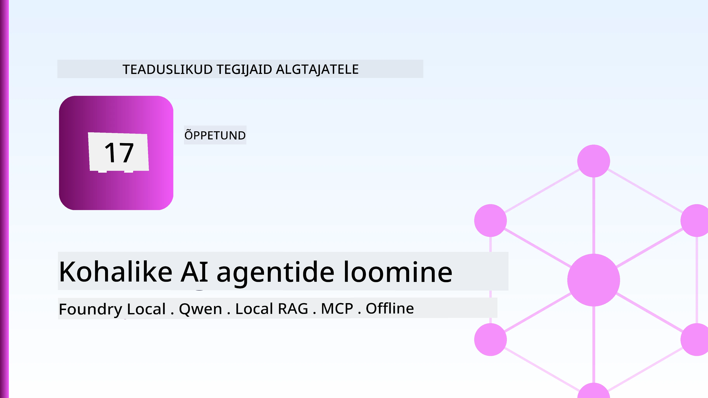
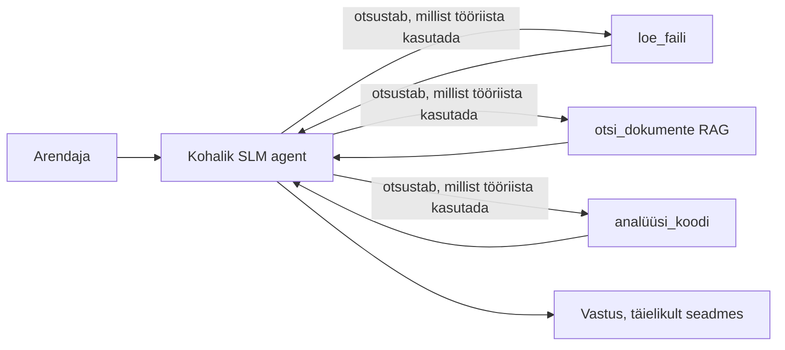
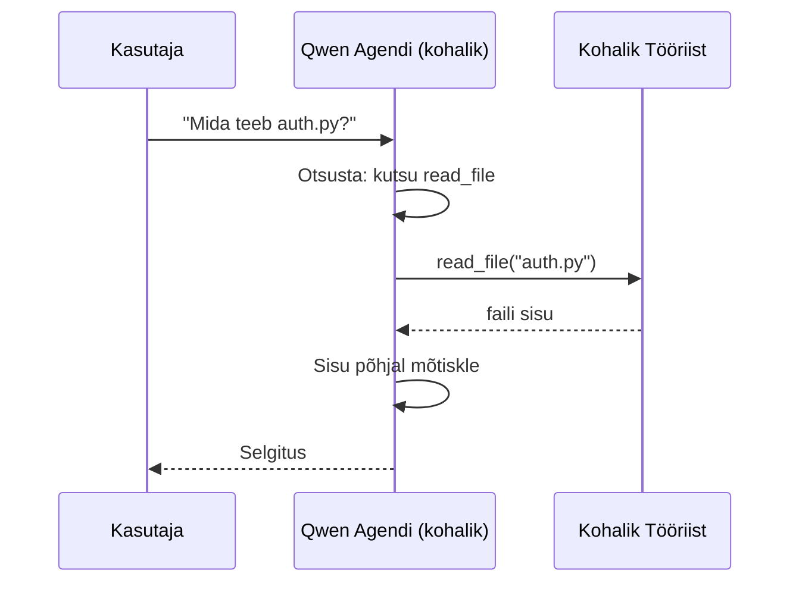
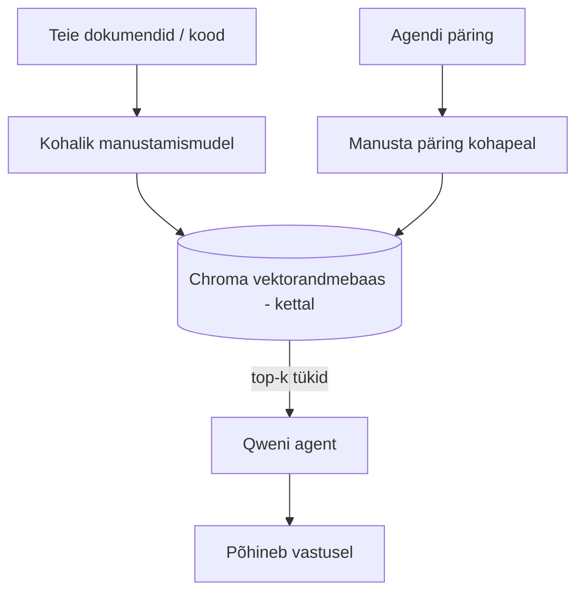
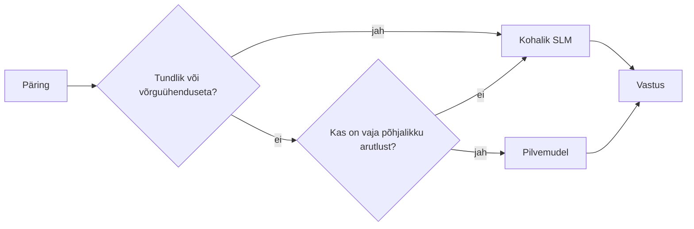

# Kohalike tehisintellekti agentide loomine Microsoft Foundry Locali ja Qweniga



Eelmine õppetund laiendas agente *pilve*. See toob nad *alla* ühele masinale. Lõpuks on sul töötav inseneriabiline, mis põhjendab, kutsub tööriistu, loeb faile ja otsib dokumentatsiooni — **ilma ühegi pilvepõhise ennustuseta**.

Miks seda tahaksid? Kolm põhjust, mis päriselus inseneritöös sageli esinevad:

- **Privaatsus.** Kood ja dokumendid ei lahku kunagi masinast. Ei päringut, ei lõiku ega kliendiandmeid ei edastata võrgust üle.
- **Kulu.** Kohalik ennustus ei maksa tokeni kohta midagi. Võid terve päeva iteratsioone teha üksnes elektri hinna eest.
- **Võrguühenduseta.** Lennukis, turvalises rajatises või katkestuse ajal töötab agent veelgi.

Konks on selles, et sa vahetad tipptasemel pilvemudeli **väikese keelemudeli (SLM)** vastu, mis jookseb CPU, GPU või NPU peal. See õppetund räägib, kuidas ehitada agente, kes selles piirangus *tõhusad* on, mitte teeselda, et piirangut pole.

## Sissejuhatus

See õppetund hõlmab:

- **Väikesed keelemudelid (SLMid)** — mis need on, kus nad paistavad ja kus mitte.
- **Microsoft Foundry Local** — käitusaeg, mis alla laadib ja pakub mudeleid otse seadmes **OpenAI-ga ühilduva API kaudu**.
- **Qweni funktsioonikõne mudelid** — SLMid, mis usaldusväärselt genereerivad tööriistakõnesid, mis võimaldab kohalikke *agente* (mitte ainult kohalikku vestlust).
- **Kohalikud tööriistad, kohalik RAG ja kohalik MCP** — võimaldades agentidel toimida ilma pilveta.
- **Hübriidmustrid** — millal hoida asjad kohalikud ja millal suunata pilve.

## Õpieesmärgid

Selle tunni läbimisel oskad:

- Selgitada SLMide kompromisse ja valida sobilikud kohaliku agendi kasutusjuhtumid.
- Käivitada Qwen mudel kohaliku Foundry Locali peal ja ühendada see OpenAI-ga ühilduva lõpp-punktiga.
- Ehitada tööriistakõnega agent, mis jookseb täielikult sinu töölaual.
- Lisada kohalik RAG oma dokumentidele, kasutades kohalikku vektorandmebaasi (Chroma).
- Ühendada agent kohalikku MCP serverisse ja mõelda hübriidsetele kohaliku/pilve lahendustele.

## Eeldused

Eeldame, et oled läbinud varasemad õppetunnid ja tunnevad mugavalt:

- [Tööriistade kasutamine](../04-tool-use/README.md) (tund 4) ja [Agentic RAG](../05-agentic-rag/README.md) (tund 5).
- [Agentic protokollid / MCP](../11-agentic-protocols/README.md) (tund 11).
- [Microsoft Agent Framework](../14-microsoft-agent-framework/README.md) (tund 14).

Vajad ka:

- Töölaua arvutit. **8 GB RAM on realistlik miinimum**, 16 GB+ mugav. GPU või NPU on abiks, kuid mitte kohustuslik.
- Paigaldatud **Microsoft Foundry Local** (vt allpool seadistamise osa).
- Python 3.12+ ja paketid kataloogis `requirements.txt`, lisaks `foundry-local-sdk`, `openai` ja `chromadb` selleks õppetunniks.

## Väikesed keelemudelid: õige vahend kohaliku töö jaoks

Tipptasemel pilvemudelil on sadu miljardeid parameetreid ja andmekeskus selle taga. SLM-il on paar miljardit parameetrit ja see peab mahutuma sinu sülearvuti mälu sisse. See erinevus seab selged ootused.

**SLMid sobivad hästi:**

- Struktureeritud, piiratud ülesandeks — klassifikatsioon, ekstraktsioon, kokkuvõtte tegemine tuntud dokumendist.
- **Tööriistade kutsumine** — otsustamine, millist funktsiooni kutsuda ja milliste argumentidega.
- Kiire, odav ja privaatne iteratsioon sinu enda andmetel.

**SLMid on nõrgemad:**

- Avatud, mitmehüppelised põhjendused suure konteksti juures.
- Lai maailmateadmus (nad on vähem näinud ja rohkem unustavad).

Kohalike agentide võidustrateegia on: **laske SLM-il orkestreerida ja tööriistadel teha rasket tööd.** Mudelil ei pea olema sinu koodi **tundmist** — sellest piisab, kui ta teab, millal kutsuda `read_file` ja `search_docs`. See mängib SLM-i tugevustele otse vastu.



## Microsoft Foundry Local

**Microsoft Foundry Local** on kergekaaluline runtime, mis laadib alla, haldab ja pakub mudeleid täielikult su masinas. Oluline omadus on see, et ta pakub **OpenAI-ga ühilduvat HTTP-lõpp-punkti** — mis tähendab, et OpenAI SDK ja Microsoft Agent Frameworki OpenAI klient töötavad selle peal lihtsalt, vahetades `base_url`-i. Kõik, mida agentide ehitamise kohta õpetati, kandub otse üle; ainus erinevus on, et lõpp-punkt liigub pilvest `localhost`i.

Foundry Local valib mudelist su arvuti jaoks parima versiooni automaatselt — kas CPU-versiooni, CUDA/GPU-versiooni või NPU-versiooni — nii et sul ei ole vaja iga masinat eraldi optimeerida.

### Seadistamine

Paigalda Foundry Local (vaata [dokumentatsiooni](https://learn.microsoft.com/azure/ai-foundry/foundry-local/) oma OS-ile) ja kontrolli, et see töötab:

```bash
# Installi (näiteks; järgi oma platvormi dokumentatsiooni)
winget install Microsoft.FoundryLocal      # Windows
# brew install microsoft/foundrylocal/foundrylocal   # macOS

# Laadi alla ja käivita Qwen mudel, seejärel alusta kohalikku teenust
foundry model run qwen2.5-7b-instruct
foundry service status
```

Kui teenus jookseb, on sul kohalik OpenAI-ga ühilduv lõpp-punkt (tavaliselt `http://localhost:PORT/v1`). Sülearvutuses kasutatakse `foundry-local-sdk` lõpp-punkti automaatseks leidmiseks, nii et pole vaja porti kõvakodeerida.

## Qweni funktsioonikõne: miks see oluline on

Agent on alles agent, kui ta suudab tööriistu kutsuda. Paljud SLMid saavad vestelda, kuid annavad ebausaldusväärseid ja vigaseid tööriistakõnesid. **Qwen** mudelid on treenitud funktsioonikõneks ja sünnitavad korrapäraselt hästi vormistatud tööriistakõnestruktuure — just see teeb kohalikust vestlusmudelist kohaliku *agendi*.

Protsess on tavaline tööriistakõne tsükkel, mida sa juba tead, lihtsalt kohapeal jooksutatud:



## Kohalik RAG

Dokumentatsiooni otsing on koht, kus kohalikud agendid tõeliselt väärtust loovad. Selle asemel, et loota, et SLM on sinu raamatu dokumendid meelde jätnud, paigutad dokumendid **kohalikku vektorandmebaasi** ja lubad agendil päringul vajalikke lõike tuua.

Kasutame **Chroma**-d, manustatud vektoripoed, mis töötab protsessis ja mille jaoks serverit ei ole. Töövoog on täielikult kohalik: kohalik sisestusmudel → kohalikud vektorid → kohalik otsing → kohalik SLM.



See on sama Agentic RAG muster nagu õppetunnis 5 — ainus erinevus, et kõiki komponente jookseb sinu masinas.

## Kohalikud MCP serverid

[MCP](../11-agentic-protocols/README.md) on transpordikiht, mitte pilveteenus. MCP server võib jookseda lokaalse protsessina `stdio`-l, pakkudes tööriistu agendile üle tavaprotokolli. See laseb kasutada kasvavat MCP serverite ökosüsteemi — failisüsteemi ligipääsu, git operatsioone, andmebaasi päringuid — täiesti võrguühenduseta.

Turvapoliitika on pilvest erinev, kuid pole puuduv: kohalik MCP server jookseb sinu kasutajaõigustes, nii et piira, mida see võib puudutada (näiteks projekti kataloog, mitte kogu kodukataloog) ja kohtu tema väljundite usaldusväärsust enne nende kasutamist.

## Hübriidpilve ja kohaliku mustrid

Kohalik esimene ei tähenda ainult kohalikku. Küpsed süsteemid marsruutivad tundlikuse ja keerukuse järgi:

| Situatsioon | Kus jookseb |
| --- | --- |
| Tundlik kood / andmed või võrguühenduseta | **Kohalik SLM** |
| Lihtne, piiratud ülesanne | **Kohalik SLM** (odav, kiire) |
| Raske mitmehüppelise põhjendusega mitte-tundlikel andmetel | **Pilvemudel** |
| Kõik katkestuse ajal | **Kohalik SLM** (peenhäälestatud degradeerumine) |

See peegeldab õppetunni 16 **mudelite marsruutimise** mõtteviisi — ainult et üks «mudelitest» oled nüüd sa ise. Tugev disain lülitab pilvest kohaliku peale, kui pilv pole saadaval, nii et agent degradeerub kvaliteedis, mitte ei ebaõnnestu täielikult.



## Praktikum: Kohalik inseneriabiline

Ava [`code_samples/17-local-agent-foundry-local.ipynb`](./code_samples/17-local-agent-foundry-local.ipynb) ja tööta läbi. Ehita **kohalik inseneriabiline**, mis töötab ainult su töölaual ja saab:

1. **Kutsuda tööriistu** — Qweni funktsioonide kaudu Foundry Locali abil.
2. **Käidelda kohalikke failioperatsioone** — projektikataloogis failide nimekiri ja lugemine.
3. **Analüüsida koodi** — katta põhistatistika lähtefaili kohta.
4. **Otsida dokumentatsioonist** — kohalik RAG dokumendikaustadel Chromaga.
5. **Kasutada MCP-d** — ühendada kohaliku MCP serveriga (juhul kui mitte, jätta graatsiliselt vahele).

Ükski pilve ennustus pole kasutusel.

### Ülevaade

Abiühendus toimub Foundry Locali OpenAI-ga ühilduva lõpp-punkti kaudu, nii et agendi kood näeb pilveõppetundidest praktiliselt ühesugune välja — ainult klient muutub:

```python
from foundry_local import FoundryLocalManager
from openai import OpenAI

# Foundry Local avastab/alla laadib mudeli ja annab meile kohaliku lõpp-punkti.
manager = FoundryLocalManager(\"qwen2.5-7b-instruct\")
client = OpenAI(base_url=manager.endpoint, api_key=manager.api_key)  # api_key on kohalik kohatäide
```

Tööriistad on tavalised Python funktsioonid, mis on piiritletud konkreetse projekti kataloogiga:

```python
def read_file(path: str) -> str:
    \"\"\"Read a file, but only inside the sandboxed project directory.\"\"\"
    full = (PROJECT_ROOT / path).resolve()
    if PROJECT_ROOT not in full.parents and full != PROJECT_ROOT:
        return \"Access denied: path is outside the project directory.\"
    return full.read_text(encoding=\"utf-8\")
```

Pöörake tähelepanu liivakasti kontrollile — isegi kohapeal on tööriist, mis loeb suvalisi radu, riskantne. Märkmik hoiab iga tööriista ühe projekti juurkaustaga piiritletuna.

## Teadmiste kontroll

Testi oma arusaamist enne ülesande juurde asumist.

**1. Too kaks konkreetset põhjust, miks agent jooksutada kohapeal, mitte pilves.**

<details>
<summary>Vastus</summary>

Kaks järgmist: **privaatsus** (kood ja andmed ei lahku masinast), **kulu** (ei ole tokenipõhist arvestust), ja **võrguühenduseta töövõime** (käib võrguta — lennukis, turvalises ruumis või katkestuse ajal). Õigus- ja regulatiivsed piirangud, mis keelavad andmed seadmest välja saata, on tavaline privaatsusmotiiv.
</details>

**2. Milline on soovitatav tööjaotus SLM-i ja tööriistade vahel kohalikus agendis ning miks?**

<details>
<summary>Vastus</summary>

Lase SLM-il **orkestreerida** (otsustada, millist tööriista kutsuda ja milliste argumentidega) ning lase **tööriistadel teha raske töö** (failide lugemine, dokumentide otsimine, arvutuste tegemine). SLMid on tugevad piiratud otsustes nagu tööriista valik, kuid nõrgemad laias maailmateadmises ja pikkade mitmehüppeliste põhjuslustega, seega tugineda tööriistadele mängib nende tugevustele vastu.
</details>

**3. Mis võimaldab taaskasutada pilve-agendi koodi Foundry Localiga?**

<details>
<summary>Vastus</summary>

Foundry Local pakub **OpenAI-ga ühilduvat HTTP-lõpp-punkti**. OpenAI SDK ja Agent Frameworki OpenAI klient töötavad selle vastu vaid `base_url`-i muutes (kasutades kohalikku kohatäite API võtit). Kõik muu agendi koodis jääb samaks.
</details>

**4. Miks kasutame spetsiaalselt Qwen funktsioonikõne mudelit, mitte suvalist SLM-i?**

<details>
<summary>Vastus</summary>

Sest agent peab tooma usaldusväärseid, korrektselt vormistatud **tööriistakõnesid**. Paljud SLMid saavad ülevahelda, kuid esitavad vigaseid või ebajärjekindlaid tööriistakõnestruktuure. Qwen mudelid on spetsiaalselt funktsioonikõneks koolitatud ja sünnitavad järjekindlaid kõnesid, mis muudab kohalikust vestlusmudelist töökorras kohaliku agendi.
</details>

**5. Millised komponendid jooksevad masina peal kohaliku RAG töövoos?**

<details>
<summary>Vastus</summary>

Kõik: sisestusmudel, vektorandmebaas (Chroma ketastel), otsingufaas ja SLM. Dokumendid sisestatakse kohapeal, salvestatakse kohapeal, tuuakse kohapeal ja neid põhjendatakse kohalikus mudelis — miski ei puutu pilve.
</details>

**6. Kohalik MCP server jookseb su masinas. Kas see teeb selle automaatselt turvaliseks? Millist ettevaatusabinõu peaksid siiski järgima?**

<details>
<summary>Vastus</summary>

Ei. Kohalik MCP server töötab sinu kasutajaõigustes, seega pääseb ligi kõigile, mida sina suudad. Piira ta kasutusala vajalikule (nt ühele projekti kaustale, mitte kogu kodukataloogile) ja käitu tema väljunditega nagu sisenditega, et neid enne valideerida.
</details>

**7. Kirjelda mõistlikku hübriidset marsruutimispõhimõtet, millesse kuulub ka kohalik mudel.**

<details>
<summary>Vastus</summary>

Suuna tundlikud või võrguühenduse puudumisega päringud kohalikku SLM-i; suuna lihtsad piiratud ülesanded kohalikku SLM-i kiiruse ja kulu tõttu; suuna rasked mitmehüppelised põhjendused mitte-tundlike andmete puhul pilvemudelisse; ja kasuta kohalikku SLM-i kui pilv ei ole saadaval, nii et agent degradeerub graatsiliselt, mitte ei ebaõnnestu. See on mudelite marsruutimine (tund 16), kus üks mudelitest oled sina ise.
</details>

**8. Milline on realistlik miinimummälu (RAM) kohalikule agendile selles tunnis, ja mida enam mälu võimaldab?**

<details>
<summary>Vastus</summary>

Umbes **8 GB** on realistlik miinimum; 16 GB+ on mugav. Rohkem mälu võimaldab jooksutada suuremaid, võimekamaid mudeleid ja hoida rohkem konteksti mälus. GPU või NPU kiirendavad ennustust, kuid pole kohustuslikud — Foundry Local valib CPU-versiooni, kui kiirendajat pole.
</details>

## Ülesanne

Arenda kohalik inseneriabiline edasi **kohalikuks dokumentatsiooni ülevaatajaks** väikse projekti jaoks, mida soovid (kasuta selle repositooriumi mõnda õppetunni kausta kui soovid).

Sinu lahendus peaks:

1. **Indekseerima reaalse dokumendi/koodi kausta** Chroma abil (vähemalt viis faili).
2. **Lisa `find_todos` tööriist**, mis otsib projektist `TODO`/`FIXME` kommentaare ja tagastab need koos faili ja reanumbriga — hoides sama liivakasti kontrolli nagu `read_file`.

3. **Esitage agendile kolm küsimust**, mis sunnivad seda tööriistu kombineerima: üks puhas RAG-küsimus, üks, mis nõuab konkreetse faili lugemist, ja üks, mis nõuab TODO-de leidmist.
4. **Mõõtke aeg**: ajastage iga kolme vastuse jaoks aeg ja märkige see märkmerakenduse lahtrisse. Kommenteerige, kas latentsus on teie kavandatud töövoo jaoks aktsepteeritav.

Seejärel kirjutage lühike lõik selle kohta, **mida te pilve viiksite ja mida kohapeal hoiaksite** selleks ülevaatajale ning miks. Teid hinnatakse selle järgi, kas lokaalsed komponendid on õigesti omavahel ühitatud ja kas teie hübriidne mõtlemine on loogiline — mitte mudeli kvaliteedi järgi.

## Kokkuvõte

Selles tunnis ehitasite agendi, mis töötab täielikult teie enda masinas:

- **SLMid** vahetavad ulatuse privaatsuse, hinna ja võrguühenduseta töö vastu — ja säravad siis, kui nad **koordineerivad tööriistu** selle asemel, et kogu teadmine ise omada.
- **Foundry Local** teenindab mudeleid seadmes OpenAI-ga ühilduva lõpp-punkti taga, nii et teie pilveagentide kood kandub üle ühe reaga.
- **Qweni funktsioonikutsed** võimaldavad usaldusväärset kohaliku tööriista kasutamist — ja seega ka kohalikke *agente*.
- **Local RAG** (Chroma) ja **kohalik MCP** annavad agendile võimekuse ilma masinast lahkumata.
- **Hübriidmustrid** võimaldavad suunata tundlikkuse ja raskusastme järgi, kus kohalik on viisaka tagavaravariandina.

See lõpetab juurutuskäigu: õppetund 16 skaleeris agendid Microsoft Foundry-sse ja see õppetund vähendas nad üheks töölauaks. Järgmine õppetund keskendub juba juurutatud agentide turvalisuse hoidmisele.

## Lisaressursid

- <a href="https://learn.microsoft.com/azure/ai-foundry/foundry-local/" target="_blank">Microsoft Foundry Local dokumentatsioon</a>
- <a href="https://learn.microsoft.com/azure/ai-foundry/what-is-azure-ai-foundry" target="_blank">Microsoft Foundry dokumentatsioon</a>
- <a href="https://aka.ms/ai-agents-beginners/agent-framework" target="_blank">Microsoft Agent Framework</a>
- <a href="https://qwen.readthedocs.io/en/latest/framework/function_call.html" target="_blank">Qwen funktsioonikutsedokumentatsioon</a>
- <a href="https://modelcontextprotocol.io/" target="_blank">Model Context Protocol (MCP)</a>
- <a href="https://docs.trychroma.com/" target="_blank">Chroma vektandmebaas</a>

## Eelmine õppetund

[Skaalautuvate agentide juurutamine](../16-deploying-scalable-agents/README.md)

## Järgmine õppetund

[AI-agentide turvamine](../18-securing-ai-agents/README.md)

---

<!-- CO-OP TRANSLATOR DISCLAIMER START -->
**Lahtiütlus**:
See dokument on tõlgitud kasutades AI tõlketeenust [Co-op Translator](https://github.com/Azure/co-op-translator). Kuigi me püüdleme täpsuse poole, palun pange tähele, et automatiseeritud tõlgetes võib esineda vigu või ebatäpsusi. Originaaldokument selle emakeeles tuleks pidada autoriteetseks allikaks. Olulise teabe puhul soovitatakse kasutada professionaalset inimtõlget. Me ei vastuta selle tõlkega seotud eksimustest või valesti mõistmistest.
<!-- CO-OP TRANSLATOR DISCLAIMER END -->