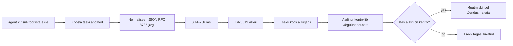
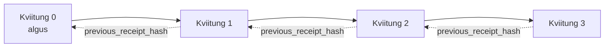

[Vaata õppetunni videot: AI-agentide turvamine krüptograafiliste kviitungitega](https://youtu.be/PLACEHOLDER_VIDEO_ID)

> _(Õppetunni video ja pisipilt lisatakse pärast ühendamist Microsofti sisu meeskonna poolt, järgides õppetunni 14/15 mustrit.)_

# AI-agentide turvamine krüptograafiliste kviitungitega

## Sissejuhatus

Selles õppetunnis käsitletakse:

- Miks on auditeerimislõigud AI-agentide jaoks tähtsad vastavuse, veaotsingu ja usalduse seisukohalt.
- Mis on krüptograafiline kviitung ja kuidas see erineb allkirjastamata logireast.
- Kuidas toota allkirjastatud kviitung agenti tööriistakõne jaoks tavalises Pythoni keeles.
- Kuidas kontrollida kviitungit võrguühenduseta ja tuvastada manipulatsiooni.
- Kuidas aheldada kviitungid, nii et ühe eemaldamine või järjekorra muutmine lõhub ahela.
- Mida kviitungid tõestavad ja mida nad selgesõnaliselt ei tõesta.

## Õpieesmärgid

Pärast selle õppetunni läbimist oskad sa:

- Tuvastada tõrkemooduseid, mis motiveerivad krüptograafilist päritolu agentide tegevuste jaoks.
- Toota Ed25519 allkirjastatud kviitungit kanonilise JSON-payloadi üle.
- Kontrollida kviitungit iseseisvalt, kasutades ainult allkirjastaja avalikku võtit.
- Tuvastada manipulatsioonid, käivitades kontrolli uuesti muudetud kviitungil.
- Ehita räsi-ahelaga kviitungite jada ja selgita, miks ahel on oluline.
- Tuvastada piirid selle vahel, mida kviitungid tõestavad (tuletis, terviklikkus, järjestus) ja mida mitte (tegevuse õigsus, poliitika kehtivus).

## Probleem: sinu agendi auditeerimislõik

Kujuta ette, et oled juurutanud AI-agendi Contoso Travel’ile. Agent loeb kliendi päringuid, küsib lennud API-st ja broneerib istekohti kliendi eest. Eelmisel kvartalil töötles agent 50 000 broneeringut.

Täna tuleb auditor. Ta küsib lihtsa küsimuse: "Näita, mida sinu agent tegi."

Annad oma logifailid. Auditor vaatab neid ja küsib keerulisemat küsimust: "Kuidas ma tean, et neid logisid ei ole muudetud?"

See on auditeerimislõigu probleem. Enamik tänapäevaseid agendi juurutusi tugineb:

- **Rakenduse logidele**: mida agent ise kirjutab ja mis on muudetavad kõigi failisüsteemi ligipääsuga.
- **Pilvelaenu teenustele**: platvormitasemel manipuleerimiskindlad, aga ainult kui auditor usaldab platvormi operaatorit.
- **Andmebaasi tehingulogidele**: sobilikud andmebaasi muudatuste jaoks, aga mitte suvaliste tööriistakõnede jaoks.

Midagi neist ei saa vastata auditori küsimusele ilma, et auditor peaks kedagi usaldama (sind, su pilvepakkujat, su andmebaasitootjat). Sisekasutuseks on see usaldus sageli aktsepteeritav. Reguleeritud töökoormuste jaoks (finants, tervishoid, kõik mis kuulub EL eelarve AI-akti alla) see ei sobi.

Krüptograafilised kviitungid lahendavad selle, tehes iga agendi tegevuse iseseisvalt kontrollitavaks. Auditor ei pea sind usaldama, vaid vajab ainult sinu avalikku võtit ja kviitungit ennast.

## Mis on krüptograafiline kviitung?

Kviitung on JSON-objekt, mis salvestab, mida agent tegi, allkirjastatud digitaalse allkirjaga.



Minimaalne kviitung näeb välja selline:

```json
{
  "type": "agent.tool_call.v1",
  "agent_id": "contoso-travel-bot",
  "tool_name": "lookup_flights",
  "tool_args_hash": "sha256:a3f9c1...",
  "result_hash": "sha256:7b2e1d...",
  "policy_id": "contoso-travel-policy-v3",
  "timestamp": "2026-04-25T14:30:00Z",
  "sequence": 47,
  "previous_receipt_hash": "sha256:9d4e6a...",
  "signature": {
    "alg": "EdDSA",
    "sig": "c5af83...",
    "public_key": "8f3b2c..."
  }
}
```

Kolm omadust teevad kogu töö:

1. **Allkiri**. Kviitungi allkirjastab agendi värav Ed25519 privaatvõtmega. Igaüks, kellel on vastav avalik võti, saab allkirja võrguühenduseta kontrollida. Igasugune välja muutmine kehtetuks teeb allkirja.

2. **Kanoniline kodeerimine**. Enne allkirjastamist serialiseeritakse kviitung JSON Kanoniseerimisskeemi (JCS, RFC 8785) abil. See tagab, et kaks samast loogilisest kviitungist toodetud implementatsiooni annavad täpselt samad baitide väljundi. Ilma kanoniseerimiseta annaksid erinevad JSON-serialiseerijad sama sisu jaoks erinevaid allkirju.

3. **Räsi ahelastamine**. `previous_receipt_hash` väli seob iga kviitungi eelmisega. Kui eemaldada või ümber järjekorda panna üks kviitung, muutub kehtetuks kogu järelejäänud ahel. Manipulatsiooni saab ahela tasandil nähtavaks, isegi kui üksikud allkirjad jäävad ümber mängituks.

Need omadused koos annavad kolm garantiid:

- **Tuletis**: see võti allkirjastas selle sisu.
- **Terviklikkus**: sisu ei ole pärast allkirjastamist muutunud.
- **Järjestus**: see kviitung tuli pärast seda kviitungit ahelas.

## Kviitungi tootmine Pythoni keeles

Sul ei ole vaja eraldi raamatukogu kviitungi loomiseks. Krüptograafilised alused on laialdaselt kättesaadavad ning loogika on vaid paarikümne reaga Pythonis.

Praktikaülesanded failis `code_samples/18-signed-receipts.ipynb` viivad läbi kogu protsessi. Kokkuvõttev versioon:

```python
import json
import hashlib
import base64
from nacl import signing
from jcs import canonicalize  # RFC 8785 kanooniline JSON

def b64url_nopad(data: bytes) -> str:
    return base64.urlsafe_b64encode(data).decode("ascii").rstrip("=")

def sha256_canonical(obj) -> str:
    """SHA-256 of a Python object's JCS-canonical JSON form."""
    return f"sha256:{hashlib.sha256(canonicalize(obj)).hexdigest()}"

# Genereeri või laadi allkirjastamisvõti (tootmises hoia võtmevaras)
signing_key = signing.SigningKey.generate()
verify_key = signing_key.verify_key

# Koosta kviitungi andmepakett (allkiri puudub)
tool_args = {"origin": "SYD", "destination": "LAX"}
tool_result = [{"flight": "QF11", "price": 1850, "stops": 0}]

payload = {
    "type": "agent.tool_call.v1",
    "agent_id": "contoso-travel-bot",
    "tool_name": "lookup_flights",
    "tool_args_hash": sha256_canonical(tool_args),
    "result_hash": sha256_canonical(tool_result),
    "policy_id": "contoso-travel-policy-v3",
    "timestamp": "2026-04-25T14:30:00Z",
    "sequence": 0,
    "previous_receipt_hash": None,
}

# Kantoneeri, räsi, allkirjasta.
canonical_bytes = canonicalize(payload)
message_hash = hashlib.sha256(canonical_bytes).digest()
signature_bytes = signing_key.sign(message_hash).signature

# Lisa struktureeritud allkirjaobjekt.
receipt = {
    **payload,
    "signature": {
        "alg": "EdDSA",
        "sig": b64url_nopad(signature_bytes),
        "public_key": b64url_nopad(bytes(verify_key)),
    },
}
```

See on kogu allkirjastamise töövoog. Notebooki harjutused juhendavad iga sammu läbi.

## Kviitungi kontrollimine ja manipulatsiooni tuvastamine

Kontrollimine on vastupidine protsess:

```python
import base64
import hashlib
from nacl import signing
from nacl.exceptions import BadSignatureError
from jcs import canonicalize

def b64url_decode(s: str) -> bytes:
    padding = "=" * ((4 - len(s) % 4) % 4)
    return base64.urlsafe_b64decode(s + padding)

def verify_receipt(receipt: dict) -> bool:
    # Allkiri on struktureeritud objekt: {"alg", "sig", "public_key"}.
    sig_obj = receipt.get("signature")
    if not sig_obj or sig_obj.get("alg") != "EdDSA":
        return False

    # Taasta koormus, mis tegelikult allkirjastati (kõik peale allkirja).
    payload = {k: v for k, v in receipt.items() if k != "signature"}

    canonical_bytes = canonicalize(payload)
    message_hash = hashlib.sha256(canonical_bytes).digest()

    try:
        verify_key = signing.VerifyKey(b64url_decode(sig_obj["public_key"]))
        verify_key.verify(message_hash, b64url_decode(sig_obj["sig"]))
        return True
    except BadSignatureError:
        return False
```

See funktsioon võtab kviitungi ja tagastab `True`, kui allkiri on korrektne, vastasel juhul `False`. Puudub võrgukõne, teenuse sõltuvus või vaja kolmandaid osapooli usaldada.

Manipulatsiooni tuvastuse näitamiseks läbib notebook:

1. Kehtiva kviitungi loomise ja kontrollimise õnnestumise.
2. Ühe baidi muutmise `tool_args_hash` väljal.
3. Kontrollimise uuesti käivitamise ning ebaõnnestumise tuvastamise.

See on praktiline demonstratsioon, et kviitungid on manipuleerimisele nähtavad: iga, ükskõik kui väike muutus rikub allkirja.

## Kviitungite ahelastamine mitmeastmeliste agentide jaoks

Üks allkirjastatud kviitung kaitseb üht tegevust. Kviitungite ahel kaitseb tegevuste jada.



Iga kviitung salvestab eelmise kviitungi räsi. Ründaja peaks vaikseks eemaldamiseks kviitungist 2:

- Muutma kviitungi 3 välja `previous_receipt_hash` (rikub kviitungi 3 allkirja), VÕI
- Valmistama uue allkirja muudetud kviitungile 3 (nõuab agendi privaatvõtit).

Kui privaatvõti hoitakse riistvara võtmes ja avalik võti avaldatakse iga kviitungiga, pole kumbki rünnak teostatav ilma avastamiseta.

Notebook läbib:

1. Kolme kviitungi ahela loomise.
2. Kontrolli, et iga kviitungi `previous_receipt_hash` sobib tegeliku eelneva kviitungi räsi väärtusega.
3. Ühe keskmise kviitungi manipuleerimise ja ahela katkemise tõesel kohal nägemise.

See võimaldab toota auditeerimislõigu, mille väline audiitor saab ise kontrollida ilma, et peaks sind usaldama.

## Mida kviitungid tõestavad (ja mida mitte)

See on selle õppetunni kõige olulisem osa. Kviitungid on võimsad, kuid nende võim on piiratud.

**Kviitungid tõestavad kolme asja:**

1. **Tuletis**: konkreetne võti allkirjastas konkreetse andmekogu.
2. **Terviklikkus**: andmed pole pärast allkirjastamist muutunud.
3. **Järjestus**: see kviitung tuli pärast seda kviitungit räsi ahelas.

**Kviitungid EI tõesta:**

1. **Õigsust**: et agendi tegevus oli õige. Kviitungi saab allkirjastada ka valedele vastustele sama hästi kui õigetele.
2. **Poliitikajärgimist**: et poliitika, millele `policy_id` viitab, oleks tõepoolest hinnatud või et see oleks selle tegevuse lubanud. Kviitung salvestab, mis väideti, mitte mida tegelikult täideti.
3. **Identiteeti väljaspool võtit**: kviitung ütleb "see võti allkirjastas selle sisu." Ta ei ütle "see inimene heaks kiitis selle." Võtme sidumine isiku või organisatsiooniga nõuab eraldi identiteedi infrastruktuuri (kataloog, avaliku võtme register jne).
4. **Sisendite tõesust**: kui agent saab manipuleeritud päringu ja tegutseb selle põhjal, salvestab kviitung tegevuse usaldusväärselt. Kviitungid on järelkontroll sisendi valideerimisel, mitte selle asendajad.

See piir on tähtis kahes põhjusel:

- See näitab, milleks kviitungid on kasulikud: muuta agentide käitumine auditeeritavaks ja manipuleerimisnähtavaks, ka organisatsiooniliste piiride vahel.
- See näitab, milliseid täiendavaid kihtide vajadusi on: sisendikontroll (Läbivaatus 6), poliitikajõustamine (allpool lühidalt) ja identiteedi infrastruktuur (selle õppetunni raamidest väljas).

Levinud viga on eeldada, et "meil on kviitungid" tähendab "meile kehtib juhtimine." Seda see ei tähenda. Kviitungid on alus. Juhtimine on süsteem, mida sellel põhjal ehitada.

## Kuidas tõestada, et inimene heaks kiitis täpse tegevuse

Punkt 3 on omaette teema: tegevuskviitung ütleb "see võti allkirjastas selle sisu," mitte kunagi "inimene autoriseeris selle." Kõrge riskiga tegevuste (tagasimaksed, kustutamised, ülekanded) puhul nõuavad juhtimismudelid järjest enam täpselt seda puuduvat kinnitust, mida on võimalik toota selle õppetunni eelnevate primitiivide abil.

Järgmine notebook `code_samples/human-authorization-receipts.ipynb` lisab teise kviitungitüübi, `human.approval.v1`, samas ümbrikuvormis nagu selle õppetunni kviitungid (tüübitud andmed Ed25519 allkirjastatud üle kanonilise SHA-256, koos allkirja objektiga väljaspool allkirjastatud baitide hulka). Nimetatud heakskiitja allkirjastab **kogu kanonilise tegevuse ja selle räsiväärtuse** enne selle täitmist; agendi tegevuskviitung kannab **sama tegevuse räsiväärtust** ja `parent_approval_ref` ehk heakskiidu kviitungi räsiväärtust, sama konventsiooni nagu `previous_receipt_hash` ahelas, mida eespool ehitasid. Üks `verify_chain` läbib mõlemad artefaktid **eraldiseisvate lukustatud võtme registritega** (heakskiitja võtmed vs agendi võtmed), nii et kooditee on ühine, aga ametivõimud kunagi mitte.

See omadus, hoolikalt formuleerituna: *inimene heaks kiitis täpselt selle tegevuse ja agent täitis täpselt selle heakskiidetud tegevuse.* Notebooki keeldumise näited teevad selle omaduse reaalseks, mitte vaid väidetavaks:

- klassikaline valik: manipulatsioon, segaduses vahendaja, korduskatse, igale poole võltsitud võtmed, valesti vormistatud sisend;
- **aegunud volitus**: allkiri, mis ikka kontrollib, aga siiski keeldutakse, sest poliitika versioon muutus, heakskiitja võti eemaldati registrist või heakskiit aegus enne käivitamist;
- **digest vahetus**: kehtivalt allkirjastatud tegevuskviitung, mis viitab *päris* heakskiidule, mis seob *teist* kanonilist tegevust.

Iga rike keeldutakse erineva põhjusega, nii et audiitor teab, kas volitus aegus või tegevus muutus. Notebooki õpetus on: allkirjastatud heakskiit ei ole iseenesest volitus. Volitus kehtib ainult siis, kui mõlemad kviitungid seovad täitmisajal sama kanonilise tegevusega. Sama Interneti mustand, mida see õppetund järgis (`draft-farley-acta-signed-receipts`), on selle mustri standarditeekonna kuju.

## Tootmise viited

Selle õppetunni Python kood on tahtlikult minimaalne, et saaksid iga rea läbi lugeda ja täpselt mõista, mis toimub. Tootmises on sul kaks valikut:

1. **Ehitada otse krüptograafiliste primitiivide peale.** Ülal näidatud 50 rida on paljudeks kasutusteks piisavad. PyNaCl (Ed25519) ja `jcs` pakett (kanoniline JSON) on hästi hooldatud ja auditeeritud raamatukogud.

2. **Kasutada tootmislikku kviitungiraamatukogu.** Mitmed avatud lähtekoodiga projektid rakendavad sama mustrit koos lisafunktsioonidega (võtme rotatsioon, partiikontroll, JWK komplekti levitamine, integratsioon poliitikamootoritega):
   - Selle õppetunni kasutatud kviitungiformaat järgib IETF Interneti-mustandit ([`draft-farley-acta-signed-receipts`](https://datatracker.ietf.org/doc/draft-farley-acta-signed-receipts/), revisjon 02), mis on praegu standardite protsessis, koos ühise vastavussarja ([agent-governance-testvectors](https://github.com/ScopeBlind/agent-governance-testvectors)), mida iseseisvad implementatsioonid ristkontrollivad baitide identse kanonilise väljundi osas.
   - Microsoft Agent Governance Toolkit kombineerib kviitungid Cedar-põhiste poliitikakäikudega; näide terve protsessi kohta leiad õpetusest 33 selles hoidlas.
   - `protect-mcp` (npm) ja `@veritasacta/verify` (npm) pakendid pakuvad Node-põhist kviitungite allkirjastamise ja võrguühenduseta kontrolli, mõeldud MCP serveri ümber pakendi mehhanismiks koos kärbitud co-sign flow’ga, milles pausitud tegevus kiirgab heakskiidukviitungit, mis seob tegevuse räsiväärtusega (WebAuthn toetatud töölaua voogus), sama heakskiidu kviitungi muster nagu ülal inimautoriseerimise notebookis.
   - **[nobulex](https://github.com/arian-gogani/nobulex)** Python SDK (`pip install nobulex`) pakub sama Ed25519 + JCS allkirjastamise mustrit Pythonis koos LangChaini ja CrewAI integratsioonidega, sealhulgas avaldatud ristkontrolli testvektoritega ja vastavuse kaardistamisega, mis on panustatud läbi [OWASP PR #2210](https://github.com/OWASP/CheatSheetSeries/pull/2210).

Otsus, kas ehitada ise või kasutada raamatukogu, peegeldab otsust, kas kirjutada ise JWT raamatukogu või kasutada testitud lahendust: mõlemad on mõistlikud; raamatukogu säästab aega ja vähendab auditeerimispinda; nullist lähenemine sunnib iga primitiivi mõistma. See õppetund õpetab nullist teed, et sul oleks alus mõlema valiku jaoks.

## Teadmiste kontroll

Testi oma arusaamist enne praktikaülesandesse liikumist.

**1. Kviitung on allkirjastatud agendi privaatse Ed25519 võtmega. Auditoril on ainult avalik võti. Kas auditor saab kviitungit võrguühenduseta kontrollida?**

<details>
<summary>Vastus</summary>

Jah. Ed25519 kontroll nõuab ainult avalikku võtit ja allkirjastatud baite. Ei võrgukõnet ega teenuse sõltuvusi. See omadus teeb kviitungid kasulikuks võrguühenduseta, mitmeorganisatsioonilise või väikese usaldusega auditeerimise seadetes.
</details>

**2. Ründaja muudab kviitungi `policy_id` välja, väites, et seda juhindus lubavam poliitika. Allkiri on tehtud algse andmepaketi peal. Mis saab kontrolli käigus?**

<details>
<summary>Vastus</summary>


Kontroll ebaõnnestub. Allkiri arvutati originaalse koormuse kanooniliste baitide alusel; mis tahes välja muutmine muudab kanoonilisi baite, mis muudab SHA-256 räsi ja teeb allkirja kehtetuks. Ründajal oleks vaja era võtit, et toota uus kehtiv allkiri, mida tal ei ole.
</details>

**3. Miks sisaldab kviitung `tool_args_hash` ja `result_hash` asemel toorargumente ja tulemust?**

<details>
<summary>Vastus</summary>

Kaks põhjust. Esiteks võib kviitungit vaja arhiveerida või edastada keskkondades, kus toore sisu lekkimine (PII, äriandmed) on probleem. Räside kasutamine hoiab kviitungi väikese ja sisu privaatse; audiitor kontrollib, et räsi vastab eraldi salvestatud tegelikule sisule. Teiseks on räsidel kindel suurus; kviitung, mis sisaldab räsideid, on suuruselt piiratud olenemata sisendite ja väljundite suurusest.
</details>

**4. Välja `previous_receipt_hash` abil seob iga kviitung oma eelkäijaga. Kui ründaja kustutab vaikides ühe kviitungi ahelast keskel, mis muutub kehtetuks?**

<details>
<summary>Vastus</summary>

Iga kviitung, mis tuli pärast kustutatut. Nende `previous_receipt_hash` väljad ei kattu enam tegeliku ahelaga (sest see kviitung, millele nad viitasid, ei eksisteeri või ahel suunab nüüd teisele eelkäijale). Kustutamise varjamiseks peaks ründaja uuesti allkirjastama kõik hilisemad kviitungid, mis nõuab era võtit.
</details>

**5. Kviitung kontrollitakse korralikult läbi. Kas see tõendab, et agendi tegevus oli õige, asjakohane või poliitikaga kooskõlas?**

<details>
<summary>Vastus</summary>

Ei. Kehtiv kviitung tõendab kolme asja: pärinemist (see võti allkirjastas selle sisu), terviklikkust (sisu ei ole muutunud) ja järjekorda (see kviitung tuli pärast seda teist). See EI tõenda, et tegevus oli õige, et `policy_id`-s nimetatud poliitika hinnati või et agent järgis kõiki reegleid. Kviitungid võimaldavad agente auditeerida, mitte tingimata kinnitada, et nad tegutsevad õigesti. See on selle õppetunni kõige olulisem piir.
</details>

## Praktikaülesanne

Ava `code_samples/18-signed-receipts.ipynb` ja täida kõik neli lõiku:

1. **Lõik 1**: Allkirjasta oma esimene kviitung ja kontrolli seda.
2. **Lõik 2**: Muuda kviitungit ja vaata, kuidas kontroll ebaõnnestub.
3. **Lõik 3**: Koosta kolm-kviitungiline ahel ja kontrolli ahela terviklikkust.
4. **Lõik 4**: Rakenda muster Microsoft Agent Frameworkil ehitatud agendi puhul: paki tööriista kõne kviitungi allkirjastamisse, seejärel kontrolli kviitungit sõltumatult.

**Lisakutse 1:** lisa kviitungi skeemi oma valitud uus väli (näiteks jälgimis-ID), uuenda kanoonilist allkirjastamise loogikat selle kaasamiseks ja kinnita, et kviitung läbib endiselt kontrolli. Seejärel muuda väli pärast allkirjastamist ja veendu, et kontroll ebaõnnestub. See sunnib sind mõistma, kuidas iga bait kanoonilises kodeeringus allkirjale panustab.

**Lisakutse 2:** tee kahe oma kviitungi SHA-256 räsi (ühenda nende kanoonilised baidid deterministlikus järjekorras) ja lisa tulemus kolmanda kviitungi uue väljana enne allkirjastamist. Kontrolli, et kõik kolm kviitungit läbivad endiselt kontrolli. Sa oled just loonud üheastmelise kaasamise tõendi: kellel on kolmas kviitung, saab tõendada, et kaks esimest eksisteerisid allkirjastamise ajal ilma nende sisu avaldamata. See on muster, mida kasutatakse laialdaselt valikulise avalikustamise kviitungitel (Merkli kohustused, RFC 6962).

## Kokkuvõte

Krüptograafilised kviitungid annavad tehisintellektil põhinevatele agentidele auditeerimisjälje, mis on:

- **Sõltumatult kontrollitav**: iga avaliku võtmega osapool saab kontrollida, ei nõua teenust.
- **Muutmisele vastupidav**: iga muudatus muudab allkirja kehtetuks.
- **Kaasaskantav**: kviitung on väike JSON-fail; seda saab arhiveerida, edastada ja kontrollida kõikjal.
- **Standarditele vastav**: ehitatud Ed25519 (RFC 8032), JCS (RFC 8785) ja SHA-256 põhjal, kõik laialt kasutatavad primitiivid.

Need ei asenda sisendi valideerimist, poliitika täitmist ega identiteedihaldust. Need on baaskihiks nendele kihtidele. Kui paigutad agente reguleeritud töökoormatesse, mitme asutuse töövoogudesse või olukorda, kus tulevikus olev auditor ei saa eeldada, et sind usaldatakse, on kviitungid viis teha auditeerimisjälg ausaks.

Kõige olulisem järeldus: kviitungid tõendavad, kes ütles mida ja millal. Need ei tõenda, et öeldu oli tõene või õige. Hoia seda vahet selgelt. See on vahe ausa algallikate süsteemi ja eksitava vahel.

## Tootmise kontrollnimekiri

Kui oled valmis sellest õppetunnist edasi liikuma ja juurutama kviitungite allkirjastamisega agente reaalses keskkonnas:

- [ ] **Tõsta allkirjastamisvõti arendaja sülearvutist eemale.** Kasuta Azure Key Vaulti, AWS KMS-i või riistvaralist turvalisusmoodulit. Era võti, mis allkirjastab kviitungeid, ei tohi kunagi olla lähtekoodihalduses ega lihttekstina rakenduse masinatel.
- [ ] **Avalikusta kontrolli avalik võti.** Audiitoritel on seda vaja võrguühenduseta kontroliks. Tavapärane muster on JWK komplekt tuntud URL-il (RFC 7517), nt `https://your-org.example.com/.well-known/agent-keys.json`.
- [ ] **Ankurdage ahel väliselt.** Kirjutage perioodiliselt ahela viimase peamise räsi läbipaistvuse logisse (Sigstore Rekor, RFC 3161 ajatempli autoriteet või teine sisemine süsteem), et välispoolel osapool saaks kinnitada „see ahel eksisteeris sellel ajal“.
- [ ] **Salvesta kviitungid muutumatult.** Lisa-ainult blob-salvestus (Azure ladustamine immutability reeglitega, AWS S3 objektlukustamine) takistab siseisikut ajaloo ümberkirjutamisel ladustamise kihis.
- [ ] **Otsusta säilitamise üle.** Paljud vastavusnõuded nõuavad mitmeaastast säilitust. Planeeri kviitungi kasvu (iga kviitung on umbes 500 baiti; agent, kes teeb 10 000 kõnet päevas, toodab ~1,8 GB aastas).
- [ ] **Dokumenteeri, mida kviitungid ei kata.** Kviitungid tõendavad päritolu, terviklikkust ja järjekorda. Sinu käsiraamat peaks selgelt loetlema, millised täiendavad kontrollid (sisendi valideerimine, poliitika täitmine, kiiruspiirangud, identiteedihaldus) toimivad koos kviitungitega sinu juhtimispoliitikas.

### On rohkem küsimusi AI agentide turvamise kohta?

Liitu [Microsoft Foundry Discordiga](https://aka.ms/ai-agents/discord), et kohtuda teiste õppijatega, osaleda jututundides ja saada vastused AI agentide küsimustele.

## Edasi sellest õppetunnist

See õppetund katab ühe-kviitungilise allkirjastamise ja räsi-ahelad. Samad primitiivid moodustavad mitu edasijõudnumat mustrit, millega võid kokku puutuda, kui sinu juhtimispoliitika areneb:

- **Valikuline avalikustamine.** Kui kviitungi väljad on iseseisvalt kohustatud (RFC 6962 stiilis Merkle puu), saad teatud väljad avalikustada teatud audiitoritele ja tõendada, et ülejäänud väljad on muutumatud, ilma neid näitamata. Kasulik, kui sama kviitung peab rahuldama nii põhjalikku auditit (mis soovib täielikkust) kui andmekaitse regulatsioone nagu GDPR (mis tahavad, et audiitor näeks võimalikult vähe).
- **Kviitungi tagasivõtmine.** Kui allkirjastamisvõti on kompromiteeritud, vajad viisi, kuidas märkida kõik selle võtmega allkirjastatud kviitungid usaldamatutena alates mingist ajast. Tavapärased mustrid: lühiajalised allkirjastamisvõtmed pluss avaldatud tagasivõtmisloend või läbipaistvuse logi tagasivõtmise kirjetega.
- **Kahepoolsed / jagatud allkirja kviitungid.** Mõned rakendused jagavad allkirjastatud koormuse enne täitmist (`authorization_*`) ja pärast täitmist (`result_*`) poolteks sõltumatute allkirjadega, kasulik kui volituse otsuse ja tulemuse genereerivad erinevad tegijad või eri ajal. See on kumuleeruv selle õppetunni kviitungi formaadi kohal.
- **Koormuse koostis.** Kviitungeid suletakse kõik baitid, mis paned `result_hash`-i. Reaalmaailma koormused on tihti rikkalikumad kui ühe tööriista tulemused: otsuse-eelne põhjendus (mudeli ennustus, kaalutletud valikud, tõendusmaterjal ja selle täielikkus, riskipositsioon, vastutusahel, lüüsitulemused) võivad kõik elada koormuses ühe kviitungi all. See hoiab kviitungi formaadi minimaalsena, lubades samal ajal koormuskeeltest aretada domeenipõhiselt.
- **Ristrakenduse kokkusobivus.** Mitmed sõltumatud rakendused samas formaadis (Python, TypeScript, Rust, Go) kontrollivad omavahel üksteise testvektoreid. Kui ehitad oma rakenduse, kinnitab avaldatud vektorite alusel valideerimine juhtme kokkusobivust.
- **Pärast-kvantmigratsioon.** Ed25519 on tänapäeval laialt kasutusel, kuid ei ole kvantkaitsev. Kviitungi formaat on algoritmiliselt paindlik: `signature.alg` väli võib kanda `ML-DSA-65` (NIST-i pärast kvanti allkirjastamise standard), kui vajad migratsiooni. Planeeri üleminekuperiood, kus kviitungid on kahekordselt allkirjastatud.

## Lisamaterjalid

- <a href="https://datatracker.ietf.org/doc/draft-farley-acta-signed-receipts/" target="_blank">IETF Internet-Draft: Masinatevahelise juurdepääsu allkirjastatud otsuse kviitungid</a>
- <a href="https://learn.microsoft.com/azure/ai-studio/responsible-use-of-ai-overview" target="_blank">Vastutustundliku tehisintellekti ülevaade (Azure AI)</a>
- <a href="https://datatracker.ietf.org/doc/html/rfc8032" target="_blank">RFC 8032: Edwards-kõvera digitaalne allkirja algoritm (EdDSA)</a>
- <a href="https://datatracker.ietf.org/doc/html/rfc8785" target="_blank">RFC 8785: JSON-kanoonilise vormindamise skeem (JCS)</a>
- <a href="https://datatracker.ietf.org/doc/html/rfc6962" target="_blank">RFC 6962: Sertifikaatide läbipaistvus</a> (Merkli-puu konstruktsioon valikulise avalikustamise kviitungites)
- <a href="https://github.com/microsoft/agent-governance-toolkit/blob/main/docs/tutorials/33-offline-verifiable-receipts.md" target="_blank">Microsoft Agent Governance Toolkit, Õpetus 33: Võrguühenduseta kontrollitavad otsuse kviitungid</a>
- <a href="https://github.com/ScopeBlind/agent-governance-testvectors" target="_blank">Ristrakenduse kokkusobivuse testvektorid</a> selle õppetunni kviitungi formaadi juures (Apache-2.0)
- <a href="https://pynacl.readthedocs.io/" target="_blank">PyNaCl dokumentatsioon</a> (Ed25519 Pythonis)

## Eelmine õppetund

[Kohalike tehisintellekti agentide loomine](../17-creating-local-ai-agents/README.md)

---

<!-- CO-OP TRANSLATOR DISCLAIMER START -->
**Lahtiütlus**:
See dokument on tõlgitud kasutades AI tõlketeenust [Co-op Translator](https://github.com/Azure/co-op-translator). Kuigi me püüdleme täpsuse poole, palun pange tähele, et automatiseeritud tõlgetes võib esineda vigu või ebatäpsusi. Originaaldokument selle emakeeles tuleks pidada autoriteetseks allikaks. Olulise teabe puhul soovitatakse kasutada professionaalset inimtõlget. Me ei vastuta selle tõlkega seotud eksimustest või valesti mõistmistest.
<!-- CO-OP TRANSLATOR DISCLAIMER END -->