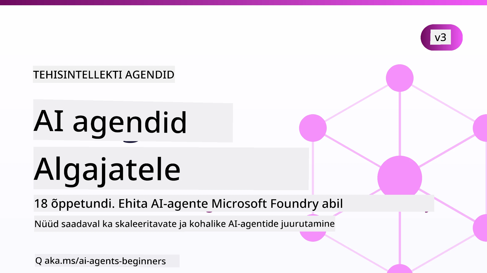

# Tehisintellekti agendid algajatele - kursus



## Kursus, mis õpetab kõike, mida pead teadma, et hakata ehitama tehisintellekti agente

[](https://github.com/microsoft/ai-agents-for-beginners/blob/master/LICENSE?WT.mc_id=academic-105485-koreyst)
[](https://GitHub.com/microsoft/ai-agents-for-beginners/graphs/contributors/?WT.mc_id=academic-105485-koreyst)
[](https://GitHub.com/microsoft/ai-agents-for-beginners/issues/?WT.mc_id=academic-105485-koreyst)
[](https://GitHub.com/microsoft/ai-agents-for-beginners/pulls/?WT.mc_id=academic-105485-koreyst)
[](http://makeapullrequest.com?WT.mc_id=academic-105485-koreyst)

### 🌐 Mitmekeelne tugi

#### Toetatud GitHub Actioni kaudu (automaatne ja alati ajakohane)

<!-- CO-OP TRANSLATOR LANGUAGES TABLE START -->
[Araabia](../ar/README.md) | [Bengali](../bn/README.md) | [Bulgaaria](../bg/README.md) | [Burma (Myanmar)](../my/README.md) | [Hiina (lihtsustatud)](../zh-CN/README.md) | [Hiina (traditsiooniline, Hongkong)](../zh-HK/README.md) | [Hiina (traditsiooniline, Macao)](../zh-MO/README.md) | [Hiina (traditsiooniline, Taiwani)](../zh-TW/README.md) | [Horvaadi](../hr/README.md) | [Tšehhi](../cs/README.md) | [Taani](../da/README.md) | [Hollandi](../nl/README.md) | [Eesti](./README.md) | [Soome](../fi/README.md) | [Prantsuse](../fr/README.md) | [Saksa](../de/README.md) | [Kreeka](../el/README.md) | [Heebrea](../he/README.md) | [Hindi](../hi/README.md) | [Ungari](../hu/README.md) | [Indoneesia](../id/README.md) | [Itaalia](../it/README.md) | [Jaapani](../ja/README.md) | [Kannada](../kn/README.md) | [Khmeri](../km/README.md) | [Korea](../ko/README.md) | [Leedu](../lt/README.md) | [Malai](../ms/README.md) | [Malajalami](../ml/README.md) | [Marathi](../mr/README.md) | [Nepali](../ne/README.md) | [Nigeeria pidžin](../pcm/README.md) | [Norra](../no/README.md) | [Pärsia (Farsi)](../fa/README.md) | [Poola](../pl/README.md) | [Portugali (Brasiilia)](../pt-BR/README.md) | [Portugali (Portugal)](../pt-PT/README.md) | [Pandžabi (Gurmukhi)](../pa/README.md) | [Rumeenia](../ro/README.md) | [Vene](../ru/README.md) | [Serbia (kirilitsa)](../sr/README.md) | [Slovaki](../sk/README.md) | [Sloveeni](../sl/README.md) | [Hispaania](../es/README.md) | [Suaheli](../sw/README.md) | [Rootsi](../sv/README.md) | [Tagalogi (Filipino)](../tl/README.md) | [Tamili](../ta/README.md) | [Telugu](../te/README.md) | [Tai](../th/README.md) | [Türgi](../tr/README.md) | [Ukraina](../uk/README.md) | [Urdu](../ur/README.md) | [Vietnam](../vi/README.md)

> **Eelistad kloonimist kohapeal?**
>
> Selle hoidla koosseisu kuulub üle 50 keele tõlge, mis suurendab allalaaditava faili mahtu märkimisväärselt. Tõlgete ilma kloonimiseks kasuta sparsi checkouti:
>
> **Bash / macOS / Linux:**
> ```bash
> git clone --filter=blob:none --sparse https://github.com/microsoft/ai-agents-for-beginners.git
> cd ai-agents-for-beginners
> git sparse-checkout set --no-cone '/*' '!translations' '!translated_images'
> ```
>
> **CMD (Windows):**
> ```cmd
> git clone --filter=blob:none --sparse https://github.com/microsoft/ai-agents-for-beginners.git
> cd ai-agents-for-beginners
> git sparse-checkout set --no-cone "/*" "!translations" "!translated_images"
> ```
>
> See annab sulle kõik, mida vajad kursuse läbimiseks märksa kiirema allalaadimisega.
<!-- CO-OP TRANSLATOR LANGUAGES TABLE END -->

**Kui soovid lisada täiendavaid tõlkeid, siis need on loetletud [siin](https://github.com/Azure/co-op-translator/blob/main/getting_started/supported-languages.md).**

[](https://GitHub.com/microsoft/ai-agents-for-beginners/watchers/?WT.mc_id=academic-105485-koreyst)
[](https://GitHub.com/microsoft/ai-agents-for-beginners/network/?WT.mc_id=academic-105485-koreyst)
[](https://GitHub.com/microsoft/ai-agents-for-beginners/stargazers/?WT.mc_id=academic-105485-koreyst)

[](https://discord.com/invite/ATgtXmAS5D)


## 🌱 Alustamine

See kursus sisaldab õppetunde, mis käsitlevad tehisintellekti agentide loomise põhialuseid. Iga õppetund käsitleb üht teemat, nii et alusta sealt, kus soovid!

Sellel kursusel on mitmekeelne tugi. Vaata meie [saadaval olevaid keeli siit](#-multi-language-support).

Kui see on sinu esimene kord Generatiivse Tehisintellektiga töötamisel, vaata meie [Generatiivse Tehisintellekti algajatele](https://aka.ms/genai-beginners) kursust, mis sisaldab 21 õppetundi GenAI-ga töötamisest.

Ära unusta [panustada (🌟) sellele hoidla](https://docs.github.com/en/get-started/exploring-projects-on-github/saving-repositories-with-stars?WT.mc_id=academic-105485-koreyst) ja [kahandada see hoidla](https://github.com/microsoft/ai-agents-for-beginners/fork), et käivitada kood.

### Kohtu teiste õppijatega, saa vastused oma küsimustele

Kui jänni jääd või on sul tehisintellekti agentide loomise kohta küsimusi, liitu meie pühendatud Discordi kanaliga aadressil [Microsoft Foundry Discord](https://aka.ms/ai-agents/discord).

### Mida vajad 

Igas kursuse õppetunnis on koodinäited, mis asuvad kaustas code_samples. Saad [kahandada selle hoidla](https://github.com/microsoft/ai-agents-for-beginners/fork), et luua oma koopia.

Need koodinäited kasutavad Microsoft Agent Frameworki koos Microsoft Foundry Agent Service V2-ga:

- [Microsoft Foundry](https://aka.ms/ai-agents-beginners/ai-foundry) - nõuab Azure kontot

See kursus kasutab järgmisi Microsofti AI agentide raamistikke ja teenuseid:

- [Microsoft Agent Framework (MAF)](https://aka.ms/ai-agents-beginners/agent-framework)
- [Microsoft Foundry Agent Service V2](https://aka.ms/ai-agents-beginners/ai-agent-service)

Mõned koodinäited toetavad ka alternatiivseid OpenAI ühilduvaid pakkujaid nagu [MiniMax](https://platform.minimaxi.com/), mis pakub suurte kontekstidega mudeleid (kuni 204K tokenit). Vaata [kuruse seadistust](./00-course-setup/README.md) lisainfo saamiseks.

Täpsema info saamiseks selle kursuse koodi käivitamise kohta vaata [kuruse seadistust](./00-course-setup/README.md).

## 🙏 Tahad aidata?

Kas sul on ettepanekuid või oled leidnud õigekirja- või koodivigu? [Esita probleem](https://github.com/microsoft/ai-agents-for-beginners/issues?WT.mc_id=academic-105485-koreyst) või [loo tõmbepäring](https://github.com/microsoft/ai-agents-for-beginners/pulls?WT.mc_id=academic-105485-koreyst)


## 📂 Igas õppetunnis on

- Kirjalik õppetund README-s ja lühike video
- Python koodinäited, mis kasutavad Microsoft Agent Frameworki koos Microsoft Foundryga
- Lingid lisamaterjalidele, et jätkata õppimist


## 🗃️ Õppetunnid

| **Õppetund**                                   | **Tekst ja kood**                                    | **Video**                                                  | **Lisalugemine**                                                                     |
|----------------------------------------------|----------------------------------------------------|------------------------------------------------------------|----------------------------------------------------------------------------------------|
| Sissejuhatus tehisintellekti agentidesse ja nende kasutusjuhtumitesse       | [Link](./01-intro-to-ai-agents/README.md)          | [Video](https://youtu.be/3zgm60bXmQk?si=z8QygFvYQv-9WtO1)  | [Link](https://aka.ms/ai-agents-beginners/collection?WT.mc_id=academic-105485-koreyst) |
| Tehisintellekti agentide raamistike uurimine              | [Link](./02-explore-agentic-frameworks/README.md)  | [Video](https://youtu.be/ODwF-EZo_O8?si=Vawth4hzVaHv-u0H)  | [Link](https://aka.ms/ai-agents-beginners/collection?WT.mc_id=academic-105485-koreyst) |
| Tehisintellekti agentide disainimustrite mõistmine     | [Link](./03-agentic-design-patterns/README.md)     | [Video](https://youtu.be/m9lM8qqoOEA?si=BIzHwzstTPL8o9GF)  | [Link](https://aka.ms/ai-agents-beginners/collection?WT.mc_id=academic-105485-koreyst) |
| Tööriistade kasutamise disainimuster                      | [Link](./04-tool-use/README.md)                    | [Video](https://youtu.be/vieRiPRx-gI?si=2z6O2Xu2cu_Jz46N)  | [Link](https://aka.ms/ai-agents-beginners/collection?WT.mc_id=academic-105485-koreyst) |
| Agentic RAG                                  | [Link](./05-agentic-rag/README.md)                 | [Video](https://youtu.be/WcjAARvdL7I?si=gKPWsQpKiIlDH9A3)  | [Link](https://aka.ms/ai-agents-beginners/collection?WT.mc_id=academic-105485-koreyst) |
| Usaldusväärsete tehisintellekti agentide loomine               | [Link](./06-building-trustworthy-agents/README.md) | [Video](https://youtu.be/iZKkMEGBCUQ?si=jZjpiMnGFOE9L8OK ) | [Link](https://aka.ms/ai-agents-beginners/collection?WT.mc_id=academic-105485-koreyst) |
| Planeerimise disainimuster                      | [Link](./07-planning-design/README.md)             | [Video](https://youtu.be/kPfJ2BrBCMY?si=6SC_iv_E5-mzucnC)  | [Link](https://aka.ms/ai-agents-beginners/collection?WT.mc_id=academic-105485-koreyst) |
| Mitme agendi disainimuster                   | [Link](./08-multi-agent/README.md)                 | [Video](https://youtu.be/V6HpE9hZEx0?si=rMgDhEu7wXo2uo6g)  | [Link](https://aka.ms/ai-agents-beginners/collection?WT.mc_id=academic-105485-koreyst) |

| Metakognitsiooni disainimuster                | [Link](./09-metacognition/README.md)               | [Video](https://youtu.be/His9R6gw6Ec?si=8gck6vvdSNCt6OcF)  | [Link](https://aka.ms/ai-agents-beginners/collection?WT.mc_id=academic-105485-koreyst) |
| AI agendid tootmises                         | [Link](./10-ai-agents-production/README.md)        | [Video](https://youtu.be/l4TP6IyJxmQ?si=31dnhexRo6yLRJDl)  | [Link](https://aka.ms/ai-agents-beginners/collection?WT.mc_id=academic-105485-koreyst) |
| Agentsete protokollide kasutamine (MCP, A2A ja NLWeb) | [Link](./11-agentic-protocols/README.md)           | [Video](https://youtu.be/X-Dh9R3Opn8)                                 | [Link](https://aka.ms/ai-agents-beginners/collection?WT.mc_id=academic-105485-koreyst) |
| Konteksti inseneritöö AI agentidele           | [Link](./12-context-engineering/README.md)         | [Video](https://youtu.be/F5zqRV7gEag)                                 | [Link](https://aka.ms/ai-agents-beginners/collection?WT.mc_id=academic-105485-koreyst) |
| Agentsete mälude haldamine                     | [Link](./13-agent-memory/README.md)     |      [Video](https://youtu.be/QrYbHesIxpw?si=vZkVwKrQ4ieCcIPx)                                                      |                                                                                        |
| Microsofti agendiraamistiku uurimine                         | [Link](./14-microsoft-agent-framework/README.md)                            |                                                            |                                                                                        |
| Arvuti kasutusagentide loomine (CUA)           | [Link](./15-browser-use/README.md)     |                                                            | [Link](https://docs.browser-use.com/examples/templates/playwright-integration)         |
| Skaalautuvate agentide juurutamine              | [Link](./16-deploying-scalable-agents/README.md) |                                                    | [Link](https://learn.microsoft.com/azure/ai-foundry/agents/overview)                   |
| Kohalike AI agentide loomine                     | [Link](./17-creating-local-ai-agents/README.md)  |                                                    | [Link](https://learn.microsoft.com/azure/ai-foundry/foundry-local/)                    |
| AI agentide turvamine                            | [Link](./18-securing-ai-agents/README.md)  |                                                            | [Link](https://aka.ms/ai-agents-beginners/collection?WT.mc_id=academic-105485-koreyst) |

## 🎒 Muud kursused

Meie meeskond toodab ka teisi kursuseid! Vaata:

<!-- CO-OP TRANSLATOR OTHER COURSES START -->
### LangChain
[](https://aka.ms/langchain4j-for-beginners)
[](https://aka.ms/langchainjs-for-beginners?WT.mc_id=m365-94501-dwahlin)
[](https://github.com/microsoft/langchain-for-beginners?WT.mc_id=m365-94501-dwahlin)
---

### Azure / Edge / MCP / Agendid
[](https://github.com/microsoft/AZD-for-beginners?WT.mc_id=academic-105485-koreyst)
[](https://github.com/microsoft/edgeai-for-beginners?WT.mc_id=academic-105485-koreyst)
[](https://github.com/microsoft/mcp-for-beginners?WT.mc_id=academic-105485-koreyst)
[](https://github.com/microsoft/ai-agents-for-beginners?WT.mc_id=academic-105485-koreyst)

---
 
### Generatiivse AI sari
[](https://github.com/microsoft/generative-ai-for-beginners?WT.mc_id=academic-105485-koreyst)
[-9333EA?style=for-the-badge&labelColor=E5E7EB&color=9333EA)](https://github.com/microsoft/Generative-AI-for-beginners-dotnet?WT.mc_id=academic-105485-koreyst)
[-C084FC?style=for-the-badge&labelColor=E5E7EB&color=C084FC)](https://github.com/microsoft/generative-ai-for-beginners-java?WT.mc_id=academic-105485-koreyst)
[-E879F9?style=for-the-badge&labelColor=E5E7EB&color=E879F9)](https://github.com/microsoft/generative-ai-with-javascript?WT.mc_id=academic-105485-koreyst)

---
 
### Põhijõud õppimiseks
[](https://aka.ms/ml-beginners?WT.mc_id=academic-105485-koreyst)
[](https://aka.ms/datascience-beginners?WT.mc_id=academic-105485-koreyst)
[](https://aka.ms/ai-beginners?WT.mc_id=academic-105485-koreyst)
[](https://github.com/microsoft/Security-101?WT.mc_id=academic-96948-sayoung)
[](https://aka.ms/webdev-beginners?WT.mc_id=academic-105485-koreyst)
[](https://aka.ms/iot-beginners?WT.mc_id=academic-105485-koreyst)
[](https://github.com/microsoft/xr-development-for-beginners?WT.mc_id=academic-105485-koreyst)

---
 
### Copiloti sari
[](https://aka.ms/GitHubCopilotAI?WT.mc_id=academic-105485-koreyst)
[](https://github.com/microsoft/mastering-github-copilot-for-dotnet-csharp-developers?WT.mc_id=academic-105485-koreyst)
[](https://github.com/microsoft/CopilotAdventures?WT.mc_id=academic-105485-koreyst)
<!-- CO-OP TRANSLATOR OTHER COURSES END -->

## 🌟 Kogukonna tänu

Täname [Shivam Goyalit](https://www.linkedin.com/in/shivam2003/) oluliste koodinäidete panustamise eest, mis demonstreerivad agentset RAG-i. 

## Panustamine

See projekt ootab panuseid ja ettepanekuid. Enamik panuseid nõuab, et nõustuksite
Kaastöölepingu (CLA) tingimustega, mis kinnitavad, et teil on õigus ja tegelikult annate meile
õigused kasutada teie panust. Lisateabe saamiseks külastage <https://cla.opensource.microsoft.com>.

Kui esitate tõmbepäringu, määrab CLA bot automaatselt, kas peate esitama
CLA ja märkima PRi vastavalt (nt oleku kontroll, kommentaar). Lihtsalt järgige
boti juhiseid. Seda tuleb teha ainult üks kord kõigi meie CLA kasutavate hoidlate jaoks.

See projekt on võtnud kasutusele [Microsofti avatud lähtekoodi käitumisreeglid](https://opensource.microsoft.com/codeofconduct/).
Lisateabe saamiseks vaadake [käitumisreeglite KKK](https://opensource.microsoft.com/codeofconduct/faq/) või
võtke ühendust aadressil [opencode@microsoft.com](mailto:opencode@microsoft.com) küsimuste või kommentaaride korral.

## Kaubamärgid

See projekt võib sisaldada kaubamärke või logosid projektide, toodete või teenuste jaoks. Microsofti
kaubamärkide või logode lubatud kasutamine allub ja peab järgima
[Microsofti kaubamärkide ja brändi juhiseid](https://www.microsoft.com/legal/intellectualproperty/trademarks/usage/general).
Muudetud versioonides Microsofti kaubamärkide või logode kasutamine ei tohi põhjustada segadust ega viidata Microsofti sponsorlusele.
Kolmandate osapoolte kaubamärkide või logode kasutamine allub vastavate kolmandate osapoolte reeglitele.

## Abi saamine


Kui jääte hätta või teil on küsimusi AI rakenduste loomise kohta, liituge:

[](https://aka.ms/foundry/discord)

Kui teil on tootepalautus või ehitamisel esineb vigu, külastage:

[](https://aka.ms/foundry/forum)

---

<!-- CO-OP TRANSLATOR DISCLAIMER START -->
**Lahtiütlus**:
See dokument on tõlgitud kasutades AI tõlketeenust [Co-op Translator](https://github.com/Azure/co-op-translator). Kuigi me püüdleme täpsuse poole, palun pange tähele, et automatiseeritud tõlgetes võib esineda vigu või ebatäpsusi. Originaaldokument selle emakeeles tuleks pidada autoriteetseks allikaks. Olulise teabe puhul soovitatakse kasutada professionaalset inimtõlget. Me ei vastuta selle tõlkega seotud eksimustest või valesti mõistmistest.
<!-- CO-OP TRANSLATOR DISCLAIMER END -->