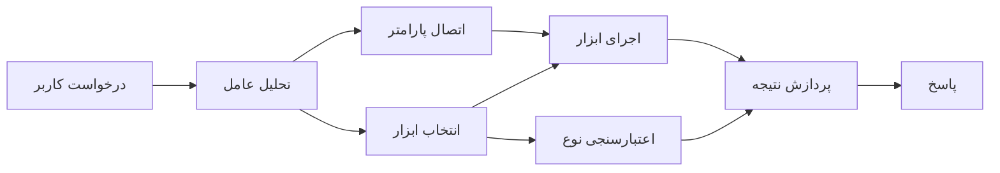

# 🛠️ استفاده پیشرفته از ابزار با Azure OpenAI (Responses API) (.NET)

## 📋 اهداف یادگیری

این نوت‌بوک الگوهای یکپارچه‌سازی ابزار در سطح سازمانی را با استفاده از Microsoft Agent Framework در .NET همراه با Azure OpenAI (Responses API) نشان می‌دهد. شما یاد می‌گیرید چگونه ایجنت‌های پیشرفته با چندین ابزار تخصصی بسازید و از تایپ قوی C# و ویژگی‌های سازمانی .NET بهره‌مند شوید.

### قابلیت‌های پیشرفته ابزار که تسلط خواهید یافت

- 🔧 **معماری چندابزاره**: ساخت ایجنت‌هایی با قابلیت‌های تخصصی متعدد
- 🎯 **اجرای ابزار نوع-امن**: استفاده از اعتبارسنجی زمان کامپایل C#
- 📊 **الگوهای ابزار سازمانی**: طراحی ابزار آماده تولید و مدیریت خطا
- 🔗 **ترکیب ابزار**: ترکیب ابزارها برای گردش‌کارهای پیچیده تجاری

## 🎯 مزایای معماری ابزار در .NET

### ویژگی‌های ابزار سازمانی

- **اعتبارسنجی زمان کامپایل**: تایپ قوی تضمین‌کننده صحت پارامترهای ابزار
- **تزریق وابستگی**: یکپارچگی با کانتینر IoC برای مدیریت ابزارها
- **الگوهای Async/Await**: اجرای غیرمسدودکننده ابزار با مدیریت درست منابع
- **ثبت لاگ ساختاریافته**: یکپارچگی لاگ‌گیری برای نظارت اجرای ابزار

### الگوهای آماده تولید

- **مدیریت استثناء**: مدیریت جامع خطا با استثناء‌های تایپ‌شده
- **مدیریت منابع**: الگوهای دفع مناسب و مدیریت حافظه
- **نظارت بر عملکرد**: معیارها و کانترهای عملکرد تعبیه‌شده
- **مدیریت پیکربندی**: پیکربندی نوع-امن همراه با اعتبارسنجی

## 🔧 معماری فنی

### اجزای اصلی ابزار در .NET

- **Microsoft.Extensions.AI**: لایه انتزاعی یکپارچه ابزار
- **Microsoft.Agents.AI**: ارکستراسیون ابزار در سطح سازمانی
- **Azure OpenAI (Responses API)**: کلاینت API با عملکرد بالا و اتصال تجمعی

### خط لوله اجرای ابزار



## 🛠️ دسته‌بندی‌ها و الگوهای ابزار

### 1. **ابزارهای پردازش داده**

- **اعتبارسنجی ورودی**: تایپ قوی با انوتیشن‌های داده
- **عملیات تبدیل**: تبدیل و قالب‌بندی داده‌ها به صورت نوع-امن
- **منطق تجاری**: ابزارهای محاسبات و تحلیل تخصصی حوزه
- **قالب‌بندی خروجی**: تولید پاسخ ساختاریافته

### 2. **ابزارهای یکپارچه‌سازی**

- **کانکتورهای API**: یکپارچه‌سازی خدمات RESTful با HttpClient
- **ابزارهای پایگاه داده**: یکپارچه‌سازی Entity Framework برای دسترسی به داده
- **عملیات فایل**: عملیات امن روی سیستم فایل با اعتبارسنجی
- **خدمات خارجی**: الگوهای یکپارچه‌سازی سرویس‌های شخص ثالث

### 3. **ابزارهای کمکی**

- **پردازش متن**: ابزارهای دستکاری و قالب‌بندی رشته‌ها
- **عملیات تاریخ/زمان**: محاسبات تاریخ/زمان آگاه به فرهنگ
- **ابزارهای ریاضی**: محاسبات دقیق و عملیات آماری
- **ابزارهای اعتبارسنجی**: اعتبارسنجی قوانین تجاری و بررسی داده

آماده‌اید تا ایجنت‌هایی در سطح سازمان با قابلیت‌های قدرتمند و نوع-امن در .NET بسازید؟ بیایید راه‌حل‌های حرفه‌ای را معماری کنیم! 🏢⚡

## 🚀 شروع به کار

### پیش‌نیازها

- [.NET 10 SDK](https://dotnet.microsoft.com/download/dotnet/10.0) یا نسخه بالاتر
- یک [اشتراک Azure](https://azure.microsoft.com/free/) همراه با منبع Azure OpenAI و استقرار مدل
- [Azure CLI](https://learn.microsoft.com/cli/azure/install-azure-cli) — با `az login` وارد شوید

### متغیرهای محیطی مورد نیاز

```bash
# زد اس اچ/باش
export AZURE_OPENAI_ENDPOINT=https://<your-resource>.openai.azure.com
export AZURE_OPENAI_DEPLOYMENT=gpt-5-mini
# سپس وارد شوید تا AzureCliCredential بتواند توکن دریافت کند
az login
```

```powershell
# پاورشل
$env:AZURE_OPENAI_ENDPOINT = "https://<your-resource>.openai.azure.com"
$env:AZURE_OPENAI_DEPLOYMENT = "gpt-5-mini"
# سپس وارد شوید تا AzureCliCredential بتواند یک توکن دریافت کند
az login
```

### کد نمونه

برای اجرای نمونه کد،

```bash
# زدش/باش
chmod +x ./04-dotnet-agent-framework.cs
./04-dotnet-agent-framework.cs
```

یا با استفاده از CLI دات‌نت:

```bash
dotnet run ./04-dotnet-agent-framework.cs
```

کد کامل را در [`04-dotnet-agent-framework.cs`](../../../../04-tool-use/code_samples/04-dotnet-agent-framework.cs) ببینید.

```csharp
#!/usr/bin/dotnet run

#:package Microsoft.Extensions.AI@10.*
#:package Microsoft.Agents.AI.OpenAI@1.*-*
#:package Azure.AI.OpenAI@2.1.0
#:package Azure.Identity@1.13.1

using System.ComponentModel;

using Microsoft.Agents.AI;
using Microsoft.Extensions.AI;

using Azure.AI.OpenAI;
using Azure.Identity;

// Tool Function: Random Destination Generator
// This static method will be available to the agent as a callable tool
// The [Description] attribute helps the AI understand when to use this function
// This demonstrates how to create custom tools for AI agents
[Description("Provides a random vacation destination.")]
static string GetRandomDestination()
{
    // List of popular vacation destinations around the world
    // The agent will randomly select from these options
    var destinations = new List<string>
    {
        "Paris, France",
        "Tokyo, Japan",
        "New York City, USA",
        "Sydney, Australia",
        "Rome, Italy",
        "Barcelona, Spain",
        "Cape Town, South Africa",
        "Rio de Janeiro, Brazil",
        "Bangkok, Thailand",
        "Vancouver, Canada"
    };

    // Generate random index and return selected destination
    // Uses System.Random for simple random selection
    var random = new Random();
    int index = random.Next(destinations.Count);
    return destinations[index];
}

// Azure OpenAI with the Responses API (stable v1 endpoint). Sign in with `az login`.
var azureEndpoint = Environment.GetEnvironmentVariable("AZURE_OPENAI_ENDPOINT")
    ?? throw new InvalidOperationException("AZURE_OPENAI_ENDPOINT is not set.");
var deployment = Environment.GetEnvironmentVariable("AZURE_OPENAI_DEPLOYMENT") ?? "gpt-5-mini";

var azureClient = new AzureOpenAIClient(new Uri(azureEndpoint), new AzureCliCredential());

// Define Agent Identity and Comprehensive Instructions
// Agent name for identification and logging purposes
var AGENT_NAME = "TravelAgent";

// Detailed instructions that define the agent's personality, capabilities, and behavior
// This system prompt shapes how the agent responds and interacts with users
var AGENT_INSTRUCTIONS = """
You are a helpful AI Agent that can help plan vacations for customers.

Important: When users specify a destination, always plan for that location. Only suggest random destinations when the user hasn't specified a preference.

When the conversation begins, introduce yourself with this message:
"Hello! I'm your TravelAgent assistant. I can help plan vacations and suggest interesting destinations for you. Here are some things you can ask me:
1. Plan a day trip to a specific location
2. Suggest a random vacation destination
3. Find destinations with specific features (beaches, mountains, historical sites, etc.)
4. Plan an alternative trip if you don't like my first suggestion

What kind of trip would you like me to help you plan today?"

Always prioritize user preferences. If they mention a specific destination like "Bali" or "Paris," focus your planning on that location rather than suggesting alternatives.
""";

// Create AI Agent with Advanced Travel Planning Capabilities
// Get the Responses client for the deployment and create the AI agent
// Configure agent with name, detailed instructions, and available tools
// This demonstrates the .NET agent creation pattern with full configuration
AIAgent agent = azureClient
    .GetChatClient(deployment)
    .AsAIAgent(
        name: AGENT_NAME,
        instructions: AGENT_INSTRUCTIONS,
        tools: [AIFunctionFactory.Create(GetRandomDestination)]
    );

// Create New Conversation Session for Context Management
// Initialize a new conversation session to maintain context across multiple interactions
// Sessions enable the agent to remember previous exchanges and maintain conversational state
// This is essential for multi-turn conversations and contextual understanding
await using var session = await agent.CreateSessionAsync();

// Execute Agent: First Travel Planning Request
// Run the agent with an initial request that will likely trigger the random destination tool
// The agent will analyze the request, use the GetRandomDestination tool, and create an itinerary
// Using the session parameter maintains conversation context for subsequent interactions
await foreach (var update in agent.RunStreamingAsync("Plan me a day trip", session))
{
    await Task.Delay(10);
    Console.Write(update);
}

Console.WriteLine();

// Execute Agent: Follow-up Request with Context Awareness
// Demonstrate contextual conversation by referencing the previous response
// The agent remembers the previous destination suggestion and will provide an alternative
// This showcases the power of conversation sessions and contextual understanding in .NET agents
await foreach (var update in agent.RunStreamingAsync("I don't like that destination. Plan me another vacation.", session))
{
    await Task.Delay(10);
    Console.Write(update);
}
```

---

<!-- CO-OP TRANSLATOR DISCLAIMER START -->
**سلب مسئولیت**:
این سند با استفاده از سرویس ترجمه هوش مصنوعی [Co-op Translator](https://github.com/Azure/co-op-translator) ترجمه شده است. در حالی که ما در تلاش برای دقت هستیم، لطفاً توجه داشته باشید که ترجمه‌های خودکار ممکن است شامل خطاها یا نادرستی‌هایی باشند. سند اصلی به زبان مادری خود باید به عنوان منبع معتبر در نظر گرفته شود. برای اطلاعات حیاتی، ترجمه حرفه‌ای انسانی توصیه می‌شود. ما در قبال هرگونه سوء تفاهم یا برداشت نادرست ناشی از استفاده از این ترجمه مسئولیتی نداریم.
<!-- CO-OP TRANSLATOR DISCLAIMER END -->