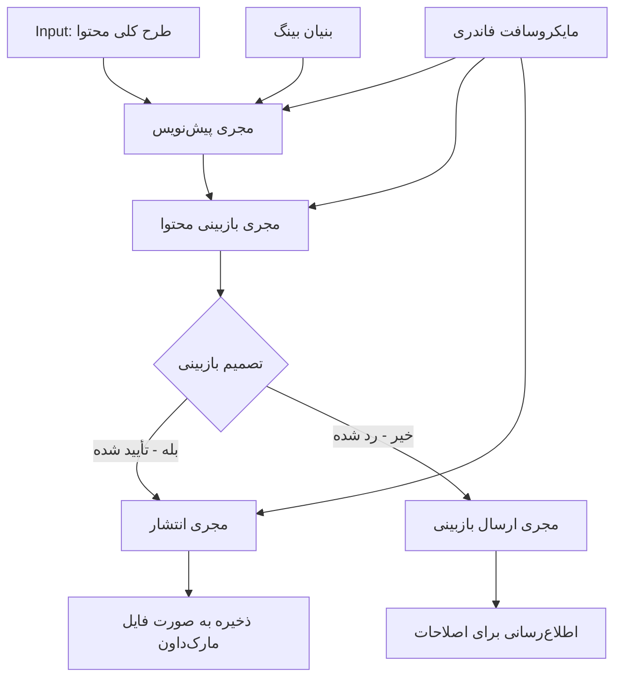

# 🔀 جریان‌های کاری شرطی عامل‌ها با Microsoft Foundry (.NET)

## 📋 آموزش جریان کاری مبتنی بر تصمیم هوشمند

این نت‌بوک الگوهای **جریان کاری شرطی** را با استفاده از Microsoft Foundry و چارچوب عامل مایکروسافت برای .NET نشان می‌دهد. شما یاد خواهید گرفت چگونه جریان‌های کاری پیچیده و مبتنی بر تصمیم‌گیری بسازید که با هوشمندی‌پردازی بر اساس تحلیل هوش مصنوعی، قوانین کسب‌وکار و شرایط پویا، مسیر پردازش را برای اتوماسیون سطح سازمانی هدایت می‌کنند.

## 🎯 اهداف یادگیری

### 🧠 **معماری تصمیم‌گیری هوشمند**
- **پیاده‌سازی منطق شرطی**: ساخت درخت‌های تصمیم پیچیده با چندین نقطه انشعاب
- **هدایت مبتنی بر هوش مصنوعی**: استفاده از مدل‌های Microsoft Foundry برای تصمیم‌گیری هوشمند در هدایت مسیرها
- **سازگارسازی پویا در جریان کاری**: تغییر رفتار جریان کاری براساس تحلیل و شرایط زمان اجرا
- **ادغام قوانین سازمانی**: بکارگیری منطق کسب‌وکار و الزامات انطباق در جریان‌های کاری

### 🔀 **الگوهای شرطی پیشرفته**
- **تصمیم‌گیری چندمعیاره**: ارزیابی چندین عامل برای تصمیمات هدایت مسیر
- **پردازش آگاه به زمینه**: تصمیم‌گیری براساس زمینه و سابقه جمع‌آوری‌شده جریان کاری
- **اصلاح تطبیقی جریان کاری**: تنظیم پویا مسیرهای پردازش بر اساس شرایط زمان واقعی
- **ادغام موتور قوانین**: پیاده‌سازی موتورهای قوانین کسب‌وکار پیچیده در جریان‌های کاری

### 🏢 **کاربردهای شرطی سازمانی**
- **دسته‌بندی و هدایت اسناد**: دسته‌بندی و هدایت خودکار اسناد به جریان‌های کاری مناسب
- **کالبدشکافی خدمات مشتری**: هدایت هوشمند درخواست‌های مشتری به تیم‌های تخصصی
- **پردازش انطباق و ریسک**: بکارگیری فرایندهای اعتبارسنجی و بازبینی مختلف مبتنی بر ارزیابی ریسک
- **جریان‌های کاری تضمین کیفیت**: هدایت محتوا از مسیرهای بازبینی مناسب بر اساس معیارهای کیفیت

## ⚙️ پیش‌نیازها و راه‌اندازی

### 📦 **بسته‌های NuGet موردنیاز**

بسته‌های پیشرفته برای پردازش جریان کاری شرطی:

```xml
<!-- Core AI Framework -->
<PackageReference Include="Microsoft.Extensions.AI" Version="9.9.0" />

<!-- Azure AI Agents with Persistent State -->
<PackageReference Include="Azure.AI.Agents.Persistent" Version="1.2.0-beta.5" />

<!-- Azure Identity and Utilities -->
<PackageReference Include="Azure.Identity" Version="1.15.0" />
<PackageReference Include="System.Linq.Async" Version="6.0.3" />
<PackageReference Include="DotNetEnv" Version="3.1.1" />

<!-- Local Workflow Framework References -->
<!-- Microsoft.Agents.Workflows.dll - Advanced workflow orchestration -->
<!-- Microsoft.Agents.AI.AzureAI.dll - Microsoft Foundry integration -->
<!-- Microsoft.Agents.AI.dll - Core agent abstractions -->
```

### 🔑 **پیکربندی Microsoft Foundry**

**منابع Azure موردنیاز:**
- فضای کاری Microsoft Foundry با مدل‌های پردازش شرطی
- اشتراک Azure با مجوزها و سهمیه‌های محاسباتی مناسب
- مدل‌های هوش مصنوعی مستقر برای تصمیم‌گیری و تحلیل محتوا
- (اختیاری) اتصال API جستجوی Bing برای قابلیت‌های مبناسازی

**پیکربندی محیط (.env):**
```env
# Microsoft Foundry Configuration
AZURE_AI_PROJECT_ENDPOINT=https://your-project.cognitiveservices.azure.com/
BING_CONNECTION_ID=your-bing-connection-id
```

**راه‌اندازی احراز هویت:**
```csharp
// Azure CLI or Managed Identity authentication
using Azure.Identity;
var credential = new AzureCliCredential();

// Load environment configuration
DotNetEnv.Env.Load("../../../.env");
```

### 🏗️ **معماری جریان کاری شرطی**



**اجزای کلیدی:**
- **مجری پیش‌نویس**: عامل هوشمندی که پیش‌نویس‌های اولیه از خطوط کلی تولید می‌کند
- **مجری بازبینی محتوا**: عامل هوشمندی که کیفیت و انطباق پیش‌نویس را ارزیابی می‌کند
- **هدایت شرطی**: منطق تصمیم‌گیری که بر اساس نتایج بازبینی، مسیرها را هدایت می‌کند
- **مسیرهای انتشار/بازبینی**: مسیرهای جداگانه پردازش برای محتوای تأییدشده و ردشده
- **مدیریت وضعیت**: نگهداری زمینه محتوا و بازبینی در سراسر جریان کاری

## 🎨 **الگوهای طراحی جریان کاری شرطی**

### 📋 **تولید محتوا با دروازه‌های کیفیت**
```
Outline → Draft Creation → Quality Review → {Approve: Publish | Reject: Revise}
```

### 🎯 **پردازش اسناد مبتنی بر ریسک**
```
Document → Risk Assessment → {Low: Standard | High: Enhanced Review}
```

### 🔍 **هدایت هوشمند خدمات مشتری**
```
Customer Query → Analysis → {Simple: FAQ Bot | Complex: Human Agent}
```

### 💼 **جریان‌های کاری مبتنی بر انطباق**
```
Content → Compliance Check → {Pass: Publish | Fail: Legal Review}
```

## 🏢 **مزایای شرطی سازمانی**

### 🎯 **اتوماسیون هوشمند**
- **تصمیم‌گیری هوشمند**: تصمیمات هدایت مسیر مبتنی بر هوش مصنوعی با تحلیل محتوا و زمینه
- **پردازش تطبیقی**: جریان‌های کاری که به طور خودکار بر اساس تغییر شرایط تنظیم می‌شوند
- **اجرای قوانین کسب‌وکار**: اعمال خودکار منطق کسب‌وکار و سیاست‌های پیچیده
- **هدایت آگاه به زمینه**: تصمیم‌گیری بر اساس تاریخچه کامل جریان کاری و زمینه جمع‌شده

### 📈 **برتری عملیاتی**
- **تخصیص بهینه منابع**: هدایت کار به مناسب‌ترین متخصصان و فرایندها
- **کاهش مداخله دستی**: تصمیم‌گیری خودکار نیاز به هدایت انسانی را به حداقل می‌رساند
- **زمان حل سریع‌تر**: هدایت مستقیم به تخصص و قابلیت‌های پردازشی مناسب
- **اجرای یکنواخت**: پیاده‌سازی یکنواخت قوانین کسب‌وکار و معیارهای تصمیم‌گیری

### 🛡️ **مدیریت ریسک و انطباق**
- **ارزیابی ریسک خودکار**: ارزیابی هوشمند سطوح ریسک محتوا و وضعیت
- **اجرای انطباق**: هدایت خودکار از طریق فرایندهای نظارتی مورد نیاز
- **اعمال پروتکل‌های امنیتی**: بهبود تدابیر امنیتی مبتنی بر ارزیابی ریسک
- **نگهداری مسیر حسابرسی**: مستندسازی کامل تصمیمات هدایت و دلایل آنها

### 📊 **تحلیل و بهبود مستمر**
- **تحلیل تصمیمات**: رصد کارایی و دقت تصمیمات هدایت مسیر
- **شناسایی الگوها**: تشخیص روندها و الگوهای تصمیمات هدایت در طول زمان
- **بهینه‌سازی عملکرد**: بهبود مستمر معیارهای تصمیم‌گیری و بهره‌وری هدایت
- **هوش کسب‌وکار**: بینش‌های مرتبط با ویژگی‌های محتوا و نیازهای پردازشی

### 🔧 **برتری فنی**
- **مدیریت وضعیت پایدار**: حفظ وضعیت‌های پیچیده در طول اجرای جریان کاری
- **معماری مقیاس‌پذیر**: پشتیبانی از نیازهای پردازش شرطی حجم بالا
- **قابلیت‌های یکپارچه‌سازی**: ادغام بی‌دردسر با سیستم‌ها و فرایندهای کسب‌وکار موجود
- **نظارت و رصدپذیری**: پیگیری جامع عملکرد و تصمیمات جریان کاری

بیایید جریان‌های کاری سازمانی هوشمند مبتنی بر تصمیم را با .NET بسازیم! 🚀

## 💻 اجرای کد

پیاده‌سازی کامل در فایل `04.dotnet-agent-framework-workflow-aifoundry-condition.cs` موجود است. این نمونه نشان‌دهنده **جریان کاری تولید محتوا با دروازه‌های کیفیت** است:

### 🏗️ **معماری جریان کاری**

```
Content Outline → Draft Creation → Quality Review → Conditional Routing:
                                                      ├─ Approved (>200 words) → Publish
                                                      └─ Rejected (<200 words) → Review Notification
```

**عامل‌ها در جریان کاری:**
1. **عامل مبلغ**: پیش‌نویس‌های آموزشی از خطوط کلی با مبناسازی Bing تولید می‌کند
2. **عامل بازبین محتوا**: کیفیت پیش‌نویس را ارزیابی می‌کند (تعداد کلمات، کامل بودن)
3. **عامل ناشر**: محتوای تأییدشده را به صورت فایل‌های Markdown زمانی ذخیره می‌کند

**مجریان سفارشی:**
1. **DraftExecutor**: هماهنگ‌کننده ساخت پیش‌نویس
2. **ContentReviewExecutor**: انجام ارزیابی کیفیت
3. **PublishExecutor**: مدیریت انتشار محتوای تأیید شده
4. **SendReviewExecutor**: مدیریت اطلاع‌رسانی‌های محتواهای ردشده

### 🚀 اجرای مثال

**پیش‌نیازها:**
- پیکربندی فضای کاری Microsoft Foundry
- احراز هویت Azure CLI (`az login`)
- (اختیاری) اتصال جستجوی Bing برای مبناسازی

```bash
# اسکریپت را قابل اجرا کنید (یونیکس/لینوکس/مک‌او‌اس)
chmod +x 04.dotnet-agent-framework-workflow-aifoundry-condition.cs

# اجرای جریان کاری شرطی
./04.dotnet-agent-framework-workflow-aifoundry-condition.cs
```

یا در ویندوز:
```powershell
dotnet run 04.dotnet-agent-framework-workflow-aifoundry-condition.cs
```

### 📝 خروجی مورد انتظار

جریان کاری:
1. **ساخت عامل‌ها**: سه عامل تخصصی Microsoft Foundry را مقداردهی اولیه می‌کند
2. **ایجاد پیش‌نویس**: عامل مبلغ پیش‌نویس آموزشی را از خطوط کلی می‌سازد
3. **بازبینی محتوا**: عامل بازبین محتوا کیفیت پیش‌نویس را ارزیابی می‌کند
4. **هدایت شرطی**:
   - **اگر تأیید شد (>۲۰۰ کلمه)**: مجری انتشار به عنوان فایل Markdown ذخیره می‌کند
   - **اگر رد شد (<۲۰۰ کلمه)**: اطلاع‌رسانی بازبینی ارسال می‌شود
5. **نمایش نتایج**: نتیجه نهایی جریان کاری نمایش داده می‌شود

### 🔧 گزینه‌های سفارشی‌سازی

**تغییر معیارهای بازبینی:**
```csharp
const string ContentReviewerInstructions = @"
You are a content reviewer...
1. Check if content is more than 500 words (instead of 200)
2. Verify technical accuracy
3. Ensure proper formatting
...";
```

**افزودن مسیرهای شرطی بیشتر:**
```csharp
var workflow = new WorkflowBuilder(draftExecutor)
    .AddEdge(draftExecutor, contentReviewerExecutor)
    .AddEdge(contentReviewerExecutor, publishExecutor, condition: GetCondition("Excellent"))
    .AddEdge(contentReviewerExecutor, editExecutor, condition: GetCondition("Good"))
    .AddEdge(contentReviewerExecutor, sendReviewerExecutor, condition: GetCondition("Poor"))
    .Build();
```

**تغییر مقادیر مورد نیاز محتوا:**
```csharp
string OUTLINE_Content = @"
# Your Custom Topic
## Section 1
https://your-reference-url
## Section 2
...
";
```

### 🎯 کاربردهای دنیای واقعی

این الگوی جریان کاری شرطی برای موارد زیر ایده‌آل است:
- **سیستم‌های مدیریت محتوا**: جریان‌های کاری ویرایشی خودکار با دروازه‌های کیفیت
- **پردازش اسناد**: هدایت اسناد بر اساس دسته‌بندی و انطباق
- **پشتیبانی مشتری**: هدایت هوشمند تیکت‌ها بر اساس پیچیدگی و فوریت
- **بازبینی حقوقی**: هدایت قراردادها بر اساس ارزیابی ریسک و ارزش
- **فرایندهای منابع انسانی**: هدایت درخواست‌ها از طریق جریان‌های غربالگری مناسب

### 🔍 درک منطق شرطی

**تابع شرط:**
```csharp
public Func<object?, bool> GetCondition(string expectedResult) =>
    reviewResult => reviewResult is ReviewResult review && review.Result == expectedResult;
```

این تابع یک گزاره ایجاد می‌کند که:
1. چک می‌کند که نتیجه از نوع `ReviewResult` باشد
2. خاصیت `Result` را با مقدار مورد انتظار مقایسه می‌کند
3. برای تعیین هدایت، true/false برمی‌گرداند

**لبه‌های جریان کاری با شرایط:**
```csharp
.AddEdge(contentReviewerExecutor, publishExecutor, condition: GetCondition("Yes"))
.AddEdge(contentReviewerExecutor, sendReviewerExecutor, condition: GetCondition("No"))
```

### 📊 قابلیت‌های پیشرفته

**اعتبارسنجی اسکمای JSON:**
جریان کاری از اسکماهای JSON برای تضمین پاسخ‌های ساخت‌یافته استفاده می‌کند:

```csharp
// Define response structure
public class ReviewResult
{
    [JsonPropertyName("review_result")]
    public string Result { get; set; } = string.Empty;
    
    [JsonPropertyName("reason")]
    public string Reason { get; set; } = string.Empty;
    
    [JsonPropertyName("draft_content")]
    public string DraftContent { get; set; } = string.Empty;
}

// Apply to agent
ResponseFormat = ChatResponseFormat.ForJsonSchema(
    AIJsonUtilities.CreateJsonSchema(typeof(ReviewResult)), 
    "ReviewResult", 
    "Review Result From DraftContent"
)
```

**ادغام مبناسازی Bing:**
عامل مبلغ از مبناسازی Bing برای دسترسی به اطلاعات به‌روز استفاده می‌کند:

```csharp
var bingGroundingConfig = new BingGroundingSearchConfiguration(bing_conn_id);
BingGroundingToolDefinition bingGroundingTool = new(
    new BingGroundingSearchToolParameters([bingGroundingConfig])
);
```

این امکان را به عامل می‌دهد تا URLها را در خطوط دنبال کرده و اطلاعات جاری را استخراج کند.

### 🛡️ مدیریت خطا

جریان کاری شامل مدیریت خطای قوی برای محتواهای ردشده است:
- شکست‌های بازبینی مسیر جایگزین را فعال می‌کنند
- اطلاع‌رسانی‌ها دلایل رد را به وضوح ارائه می‌دهند
- محتوا برای بازنگری حفظ می‌شود

### 🔄 گسترش جریان کاری

**افزودن حلقه بازنگری:**
یک حلقه بازخورد بسازید که به طور خودکار محتوا را بازنویسی می‌کند:

```csharp
.AddEdge(contentReviewerExecutor, publishExecutor, condition: GetCondition("Yes"))
.AddEdge(contentReviewerExecutor, draftExecutor, condition: GetCondition("No")) // Loop back
```

**پیاده‌سازی بازبینی چندمرحله‌ای:**
مراحل بازبینی متعدد با معیارهای متفاوت اضافه کنید:

```csharp
.AddEdge(draftExecutor, technicalReviewer)
.AddEdge(technicalReviewer, editorialReviewer, condition: GetCondition("TechPass"))
.AddEdge(editorialReviewer, publishExecutor, condition: GetCondition("EditPass"))
```

این الگوی جریان کاری شرطی پایه‌ای برای ساخت سیستم‌های اتوماسیون سازمانی هوشمند و پیچیده فراهم می‌کند! 🚀

---

<!-- CO-OP TRANSLATOR DISCLAIMER START -->
**سلب مسئولیت**:
این سند با استفاده از سرویس ترجمه هوش مصنوعی [Co-op Translator](https://github.com/Azure/co-op-translator) ترجمه شده است. در حالی که ما در تلاش برای دقت هستیم، لطفاً توجه داشته باشید که ترجمه‌های خودکار ممکن است شامل خطاها یا نادرستی‌هایی باشند. سند اصلی به زبان مادری خود باید به عنوان منبع معتبر در نظر گرفته شود. برای اطلاعات حیاتی، ترجمه حرفه‌ای انسانی توصیه می‌شود. ما در قبال هرگونه سوء تفاهم یا برداشت نادرست ناشی از استفاده از این ترجمه مسئولیتی نداریم.
<!-- CO-OP TRANSLATOR DISCLAIMER END -->