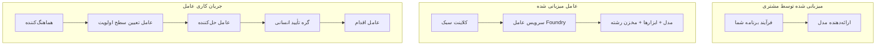
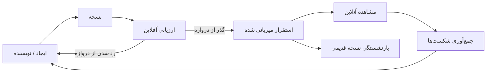
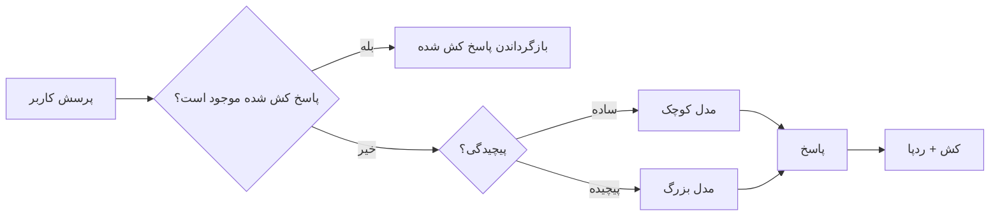
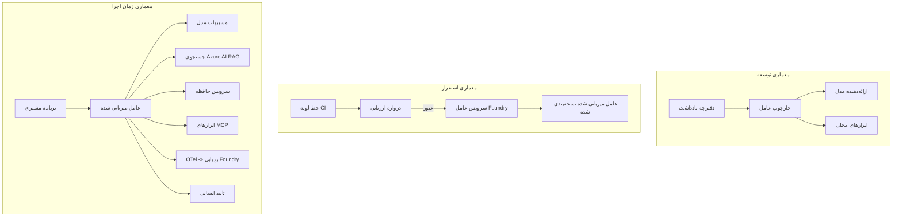

# استقرار عامل‌های مقیاس‌پذیر با Microsoft Foundry


تا این نقطه در دوره، عامل‌هایی ساخته‌اید که روی لپ‌تاپ شما، داخل یک نوت‌بوک اجرا می‌شوند، با هدایت `az login` و چند متغیر محیطی. این دقیقاً روش درست برای یادگیری است. اما روش مناسبی برای اجرای عاملی که هزاران مشتری روی آن در 3 صبح حساب می‌کنند نیست.

این درس درباره شکاف بین «روی دستگاه من کار می‌کند» و «به طور قابل اعتماد و مقرون‌به‌صرفه در تولید کار می‌کند» است. این شکاف را با استفاده از **Microsoft Foundry** و **Microsoft Foundry Agent Service** پر می‌کنیم و این کار را با ساخت یک عامل پشتیبانی مشتری واقعی که شامل ابزارها، بازیابی، حافظه، ارزیابی و نظارت است انجام می‌دهیم.

## مقدمه

این درس شامل موارد زیر است:

- تفاوت بین **عامل نمونه‌اولیه** و **عامل مستقر شده** و اینکه چرا انتقال بیشتر درباره همه چیز *دور و بر* مدل است.
- **الگوهای استقرار** برای عامل‌ها: میزبانی کلاینت، میزبانی سرویس (عامل‌های میزبانی شده)، و گردش‌کار هماهنگ‌شده.
- **چرخه عمر عامل** در Microsoft Foundry — ایجاد، نسخه‌بندی، استقرار، ارزیابی، مشاهده، بازنشستگی.
- **استراتژی‌های مقیاس‌پذیری**: مسیریابی مدل، کشینگ، همزمانی، و طراحی بدون حالت.
- **قابلیت مشاهده** با OpenTelemetry و ردگیری Foundry.
- **بهینه‌سازی هزینه** از طریق انتخاب مدل، مسیریابی، و دروازه‌های ارزیابی.
- **ملاحظات سازمانی**: حاکمیت، تأیید انسانی، و اجرای امن سرورهای MCP در تولید.

## اهداف یادگیری

پس از اتمام این درس، خواهید دانست چگونه:

- الگوی استقرار مناسب برای بار کاری عامل داده شده را انتخاب کنید.
- یک عامل را در Microsoft Foundry Agent Service مستقر کنید تا نسخه‌بندی، حاکمیت و قابل مشاهده باشد.
- عامل را برای ردگیری ابزارآموزی و وصل کردن یک خط لوله ارزیابی که قبل از هر انتشار اجرا می‌شود، سازگار کنید.
- مسیریابی مدل و کشینگ را برای کنترل تأخیر و هزینه در مقیاس اعمال کنید.
- دروازه تأیید انسانی برای اقدامات پرخطر اضافه کنید و سرور MCP را به صورت ایمن در تولید ادغام کنید.

## پیش‌نیازها

این درس فرض می‌کند شما درس‌های قبلی را گذرانده‌اید و با موارد زیر راحت هستید:

- ساخت عامل‌ها با [Microsoft Agent Framework](../14-microsoft-agent-framework/README.md) (درس ۱۴).
- [استفاده از ابزار](../04-tool-use/README.md) (درس ۴) و [Agentic RAG](../05-agentic-rag/README.md) (درس ۵).
- [حافظه عامل](../13-agent-memory/README.md) (درس ۱۳) و [پروتکل‌های Agentic / MCP](../11-agentic-protocols/README.md) (درس ۱۱).
- [قابلیت مشاهده و ارزیابی](../10-ai-agents-production/README.md) (درس ۱۰) — این درس مستقیماً بر آن بنا شده است.

همچنین به موارد زیر نیاز خواهید داشت:

- یک **اشتراک آزور** و یک **پروژه Microsoft Foundry** با حداقل یک مدل چت مستقر شده.
- **CLI آزور** ورود کرده (`az login`).
- پایتون 3.12+ و بسته‌های موجود در مخزن [`requirements.txt`](../../../requirements.txt).

## از نمونه اولیه تا تولید: چه چیزی واقعاً تغییر می‌کند

یک عامل نمونه اولیه و عامل تولیدی حلقه اصلی یکسانی دارند — استدلال، فراخوانی ابزارها، پاسخ دادن. چیزی که تغییر می‌کند، همه چیز پیرامون آن حلقه است. مدل شاید ۲۰٪ از یک عامل تولید باشد؛ ۸۰٪ باقی‌مانده اسکلت عملیات است.

| موضوع | نمونه اولیه | تولید |
| --- | --- | --- |
| **میزبانی** | در نوت‌بوک شما اجرا می‌شود | به عنوان یک سرویس میزبانی شده، نسخه‌بندی شده و منتشر می‌شود |
| **هویت** | توکن `az login` شما | هویت مدیریت شده با دسترسی RBAC محدود شده |
| **وضعیت** | در حافظه، با راه‌اندازی مجدد از بین می‌رود | برون‌سپاری شده (فروشگاه موضوع، سرویس حافظه) |
| **خطا** | شما ردگیری خطا را می‌بینید | تلاش‌های مجدد، برنامه‌های جایگزین، صف پیام‌های مرده، هشدارها |
| **هزینه** | "چند سنت است" | به ازای هر درخواست پیگیری می‌شود، مسیریابی و کش و بودجه بندی می‌شود |
| **کیفیت** | خروجی را با چشم می‌بینی | به طور خودکار قبل از هر انتشار ارزیابی می‌شود |
| **اعتماد** | شما هر اقدام را تأیید می‌کنید | سیاست + انسان در حلقه برای اقدامات پرخطر |

این جدول را به خاطر بسپارید. هر بخش زیر به یکی از این ردیف‌ها مربوط است.

## الگوهای استقرار عامل

سه الگو وجود دارد که اغلب با هم استفاده می‌کنید.

### 1. عامل‌های میزبانی شده روی کلاینت

شی عامل داخل فرایند برنامه *شما* قرار دارد. کد شما مستقیم با ارائه‌دهنده مدل تماس می‌گیرد؛ حلقه استدلال در سرویس شما اجرا می‌شود. این همان کاری است که در درس‌های قبلی انجام شده است.

- **استفاده هنگام** نیاز به کنترل کامل روی حلقه، میدلور سفارشی، یا جای دادن عامل در یک بک‌اند موجود.
- **محدودیت**: کنترل مقیاس‌پذیری، وضعیت، و مقاومت بر عهده خود شماست.

### 2. عامل‌های میزبانی شده (Foundry Agent Service)

عامل به عنوان *یک منبع* در Microsoft Foundry ثبت می‌شود. Foundry حلقه استدلال را میزبانی می‌کند، موضوعات را ذخیره می‌کند، ایمنی محتوا و RBAC را اعمال می‌کند، و عامل را در پرتال Foundry قابل مشاهده می‌سازد. برنامه شما به کلاینت نازکی تبدیل می‌شود که موضوعات ایجاد و پاسخ‌ها را می‌خواند.

- **استفاده هنگام** که دوام، قابلیت مشاهده داخلی، حاکمیت، و کاهش سطح عملیات می‌خواهید.
- **محدودیت**: کنترل سطح پایین کمتر در ازای محیط اجرایی مدیریت شده.

### 3. گردش‌کار عامل

چندین عامل (و ابزار) به صورت یک گراف با جریان کنترل صریح ترکیب شده‌اند — مراحل متوالی، انشعاب، گره‌های تأیید انسانی، و نقاط کنترل ماندگار که می‌توانند توقف و ادامه یابند. این قابلیت گردش‌کار Microsoft Agent Framework است که در مقیاس استقرار اعمال می‌شود.

- **استفاده هنگام** که یک کار واحد چندین عامل تخصصی را در بر می‌گیرد یا نیاز به مرحله تأیید در میانه دارد.
- **محدودیت**: اجزای متحرک بیشتر؛ نیاز به قابلیت مشاهده در سطح هماهنگی.



## چرخه عمر عامل در Microsoft Foundry

استقرار یک عامل صرفاً یک `push` یکباره نیست. این یک حلقه است و بسیار شبیه چرخه انتشار نرم‌افزار است چون دقیقاً همین است.



ایده اصلی، که از [درس ۱۰](../10-ai-agents-production/README.md) به عاریت گرفته شده است: **ارزیابی آفلاین یک دروازه است، نه یک فکر بعدی.** یک نسخه جدید عامل تا زمانی که از آستانه‌های ارزیابی شما عبور نکند منتشر نمی‌شود. قابلیت مشاهده آنلاین سپس شکست‌های دنیای واقعی را به مجموعه آزمایش آفلاین شما باز می‌گرداند. این کل حلقه است.

## استراتژی‌های مقیاس‌پذیری

مقیاس‌پذیری یک عامل با مقیاس‌پذیری یک API وب بدون حالت متفاوت است، زیرا هر درخواست می‌تواند فراخوانی‌های متعدد و گران‌قیمت مدل و ابزار را تحریک کند. چهار تکنیک بیشتر بار را بر دوش می‌کشند.

**مدیریت درخواست بدون حالت.** هیچ حالت خاص کاربر را به حافظه فرایند خود وارد نکنید. موضوعات گفتگو را در فروشگاه موضوع Foundry یا سرویس حافظه ذخیره کنید تا هر نمونه بتواند هر درخواستی را پاسخ دهد. این چیزی است که اجازه می‌دهد مقیاس افقی بدهید — اضافه کردن نمونه‌ها، بدون نشست‌های چسبنده.

**مسیریابی مدل.** هر درخواست به مدل پرتوان (و پرهزینه) شما نیاز ندارد. درخواست‌های ساده — طبقه‌بندی قصد، پاسخ‌های کوتاه واقعی — را به یک مدل کوچک و سریع مسیریابی کنید و مدل بزرگ را برای استدلال واقعی محفوظ بدارید. **مسیر‌یاب مدل** Foundry می‌تواند این کار را برای شما انجام دهد، یا می‌توانید طبقه‌بندی سبک خود را پیاده کنید. نسخه DIY را در آزمایشگاه خواهید ساخت.

**کش کردن پاسخ.** بسیاری از سوالات پشتیبانی نزدیک به هم ("چگونه رمز عبورم را بازنشانی کنم؟") هستند. پاسخ‌ها به سوالات رایج را کش کنید و بدون تماس دادن به مدل آنها را سرو کنید. حتی نرخ موفقیت کش متوسط هم هزینه و تأخیر را به طور قابل توجهی کاهش می‌دهد.

**همزمانی و برگشت فشار.** ارائه‌دهندگان مدل محدودیت نرخ دارند. همزمانی خود را محدود کنید، از تلاش‌های مجدد با تاخیر افزایشی استفاده کنید و با ظرافت شکست بخورید (یک پاسخ صف شده «ما در حال انجامیم» بهتر از خطای ۵۰۰ است).



## قابلیت مشاهده در تولید

نمی‌توانید آنچه را که نمی‌بینید اداره کنید. همان‌طور که در درس ۱۰ توضیح داده شد، Microsoft Agent Framework به طور بومی ردگیری‌های **OpenTelemetry** را منتشر می‌کند — هر فراخوانی مدل، هر فراخوانی ابزار، و هر گام هماهنگی به یک بازه تبدیل می‌شود. در تولید این بازه‌ها را به Microsoft Foundry (یا هر بک‌اند سازگار با OTel) صادر می‌کنید تا بتوانید:

- یک شکایت مشتری را از ابتدا تا انتها در همه فراخوانی‌های مدل و ابزار ردگیری کنید.
- تأخیر p50/p95 و هزینه به ازای هر درخواست را در طول زمان مشاهده کنید.
- قبل از اینکه کاربران یا تیم مالی شما متوجه شوند، در مورد افزایش نرخ خطا و ناهنجاری‌های هزینه هشدار بدهید.

```python
from agent_framework.observability import get_tracer

tracer = get_tracer()

with tracer.start_as_current_span("support_request") as span:
    span.set_attribute("customer.tier", "enterprise")
    span.set_attribute("routed.model", "gpt-4.1-mini")
    # اجرای عامل به طور خودکار در این بازه ردیابی می‌شود
```

ویژگی‌هایی مانند `customer.tier` و `routed.model` همان چیزی هستند که دیوار ردگیری‌ها را به سوالاتی قابل پاسخ تبدیل می‌کنند («آیا مشتریان سازمانی بیش از حد به مدل کوچک مسیریابی می‌شوند؟»).

## بهینه‌سازی هزینه

هزینه در عامل‌های تولیدی عمدتاً توسط توکن‌ها تعیین می‌شود. سه اهرم، به ترتیب تأثیر:

1. **سایز مناسب مدل.** یک مدل کوچک که از دروازه ارزیابی شما عبور می‌کند تقریباً همیشه ارزان‌تر از یک مدل بزرگ است که همچنین عبور می‌کند. از ارزیابی برای *اثبات* اینکه مدل کوچک کافی است استفاده کنید نه اینکه از روی احتیاط به بزرگ‌ترین مدل پیش‌فرض دهید.
2. **مسیریابی بر اساس پیچیدگی.** همان‌طور که گفته شد — قیمت مدل بزرگ فقط برای درخواست‌هایی که نیاز به استدلال مدل بزرگ دارند پرداخت می‌شود.
3. **کش کردن شدید.** ارزان‌ترین فراخوان مدل آن است که هرگز انجام نمی‌شود.

دروازه‌های ارزیابی و کنترل هزینه همان رشته‌ای هستند که از دو زاویه دیده می‌شوند: ارزیابی به شما *کف کیفیت* را می‌گوید، مسیریابی و کش شما را تا حد امکان نزدیک به *هزینه* آن کف نگه می‌دارد.

## ملاحظات استقرار سازمانی

**حاکمیت.** عامل‌های میزبانی شده، RBAC، ایمنی محتوا، و ثبت ممیزی Foundry را به ارث می‌برند. به هر عامل یک هویت مدیریت شده با کمترین سطح دسترسی لازم بدهید — دسترسی فقط خواندنی به پایگاه دانش، دسترسی محدود به API تیکت‌ها، چیزی بیشتر نه.

**انسان در حلقه.** بعضی اقدامات بیش از حد حیاتی هستند که به طور کامل خودکار شوند — بازپرداخت، حذف حساب، ارجاع به تیم حقوقی. Microsoft Agent Framework از ابزارهای **نیازمند تأیید** پشتیبانی می‌کند: عامل اقدام را پیشنهاد می‌دهد، اجرا متوقف می‌شود، یک انسان تأیید یا رد می‌کند، و گردش‌کار ادامه می‌یابد. این پرمیو را در [درس ۶](../06-building-trustworthy-agents/README.md) دیدید؛ اینجا آن را مستقر می‌کنید.

**MCP در تولید.** [MCP](../11-agentic-protocols/README.md) اجازه می‌دهد عامل شما از ابزارهای خارجی از طریق یک رابط استاندارد استفاده کند. در تولید، هر سرور MCP را به عنوان یک مرز غیرقابل اعتماد در نظر بگیرید: نسخه سرور را پین کنید، آن را با هویت محدود اجرا کنید، خروجی‌هایش را اعتبارسنجی کنید، و هرگز اسرار را به آن نشان ندهید. یک سرور MCP وابستگی است و وابستگی‌ها باید به‌روزرسانی، ممیزی و محدودیت نرخ داشته باشند.



آن سه نمودار — توسعه، استقرار، زمان اجرا — همان عامل در سه مرحله از عمر آن هستند. آزمایشگاهی که دنبال می‌شود شما را در ساختن آن راهنمایی می‌کند.

## آزمایشگاه عملی: یک عامل پشتیبانی مشتری آماده تولید

فایل [`code_samples/16-python-agent-framework.ipynb`](./code_samples/16-python-agent-framework.ipynb) را باز کنید و آن را از ابتدا تا انتها کار کنید. شما یک **عامل پشتیبانی مشتری Contoso** را می‌سازید که همه نگرانی‌های تولید در آن لحاظ شده است:

1. **فراخوانی ابزار** — وضعیت سفارش را جستجو کنید و بلیت‌های پشتیبانی را باز کنید.
2. **RAG** — به سوالات سیاست از یک پایگاه دانش پاسخ دهید (Azure AI Search، با یک پشتیبان حافظه تا نوت‌بوک بدون منبع جستجو اجرا شود).
3. **حافظه** — مشتری را در طول گفتگوی چند نوبتی به خاطر بسپارید.
4. **مسیریابی مدل** — یک طبقه‌بندی کننده پیچیدگی هر درخواست را به مدل کوچک یا بزرگ هدایت می‌کند.
5. **کش کردن پاسخ** — سوالات تکراری از کش پاسخ داده می‌شوند.
6. **تأیید انسانی** — بازپرداخت‌های بالاتر از آستانه منتظر امضای انسانی می‌مانند.
7. **خط لوله ارزیابی** — یک مجموعه آزمایش کوچک آفلاین عامل را امتیاز می‌دهد و به عنوان دروازه انتشار عمل می‌کند.
8. **قابلیت مشاهده** — ردگیری OpenTelemetry در اطراف هر درخواست.

### راهنمای گام‌به‌گام

نوت‌بوک به گونه‌ای سازمان یافته که هر نگرانی تولید به یک بخش مستقل و قابل اجرا تبدیل شده است. قلب آن، کنترل‌کننده درخواست همراه با مسیریابی و کشینگ است:

```python
async def handle_support_request(query: str, customer_id: str) -> str:
    # ۱. وقتی ممکن است از کش سرویس دهی کنید.
    cached = response_cache.get(normalize(query))
    if cached:
        return cached

    # ۲. به منظور کنترل هزینه، بر مبنای پیچیدگی مسیریابی کنید.
    model = "gpt-4.1-mini" if is_simple(query) else "gpt-4.1"

    # ۳. عامل را درون یک بازه ردیابی برای قابلیت مشاهده اجرا کنید.
    with tracer.start_as_current_span("support_request") as span:
        span.set_attribute("routed.model", model)
        span.set_attribute("customer.id", customer_id)
        response = await support_agent.run(query, model=model)

    # ۴. کش کنید و بازگردانید.
    response_cache.set(normalize(query), response.text)
    return response.text
```

دروازه ارزیابی که یک انتشار را محافظت می‌کند به این شکل است:

```python
async def evaluation_gate(agent, test_cases, threshold: float = 0.8) -> bool:
    passed = 0
    for case in test_cases:
        result = await agent.run(case["input"])
        if score_response(result.text, case["expected"]) >= 0.8:
            passed += 1
    pass_rate = passed / len(test_cases)
    print(f"Evaluation pass rate: {pass_rate:.0%} (gate: {threshold:.0%})")
    return pass_rate >= threshold  # فقط در صورت عبور گیت، استقرار انجام شود
```

هر خط را بخوانید — نوت‌بوک پرمیوها را عمداً کوچک نگه می‌دارد تا چیزی پشت فراخوان فریم‌ورک پنهان نباشد.

## اعتبارسنجی یک عامل مستقر شده با آزمون‌های دود

دروازه ارزیابی بالا به صورت *آفلاین* علیه شی عامل شما اجرا می‌شود. وقتی عامل به صورت Hosted Agent مستقر شد، به یک بررسی ارزان‌تر دیگر نیاز دارید: **آیا نقطه انتهایی مستقر شده واقعاً پاسخ می‌دهد؟**

استقرار "موفقیت‌آمیز" فقط اثبات می‌کند که صفحه کنترل تعریف را پذیرفته است — این اثبات نمی‌کند که عامل پاسخ می‌دهد. وابستگی گمشده، مسیریابی نامناسب مدل، یا اتصال منقضی شده می‌تواند استقراری سبز ایجاد کند که هیچ پاسخی برنمی‌گرداند. یک **آزمون دود** این را در چند ثانیه می‌گیرد، در هر استقرار، بدون هزینه یک ارزیابی کامل.

این مخزن یک خط لوله آزمون دود آماده استفاده را که بر اساس [AI Smoke Test](https://github.com/marketplace/actions/ai-smoke-test) GitHub Action ساخته شده است عرضه می‌کند:

- **کتالوگ** — [`tests/lesson-16-smoke-tests.json`](../../../tests/lesson-16-smoke-tests.json) شامل پرامپت‌ها و اظهارات برای عامل پشتیبانی Contoso است (پاسخ‌های سیاست پایه‌دار، جستجوی سفارش، ماندن در موضوع، و تداوم گفتگو چند نوبتی). کاتالوگ‌های عامل‌های درس‌های دیگر نیز کنار این قرار دارند — ببینید [`tests/README.md`](../tests/README.md).
- **گردش‌کار** — [`.github/workflows/smoke-test.yml`](../../../.github/workflows/smoke-test.yml) با Azure OIDC وارد می‌شود و هر پرامپت را به نقطه پاسخ‌دهی عامل POST می‌کند، کار را در صورت هر خطا در اظهارات شکست می‌دهد.

```yaml
- name: Smoke-test hosted agent
  uses: JFolberth/ai-smoketest@v1
  with:
    project_endpoint: ${{ inputs.project_endpoint }}
    agent_name: ContosoSupportAgent
    tests_file: tests/lesson-16-smoke-tests.json
```


پس از مستقر شدن عامل خود، آن را از زبانه **Actions** اجرا کنید و نقطه انتهایی پروژه Foundry و نام عامل خود را ارائه دهید. هویت فدرال باید نقش **Azure AI User** را در محدوده پروژه Foundry داشته باشد. لایه‌ها را مانند یک هرم در نظر بگیرید: آزمایش‌های دود (قابل دسترسی و پاسخگو؟) بر روی هر استقرار اجرا می‌شوند، ارزیابی آفلاین (کافی برای عرضه؟) قبل از ارتقاء اجرا می‌شود و ارزیابی آنلاین (عملکرد آن در محیط واقعی چگونه است؟) به صورت مداوم اجرا می‌شود.

## بررسی دانش

قبل از رفتن به تمرین، درک خود را آزمایش کنید.

**1. تقریباً چقدر از یک عامل تولیدی "مدل" است و بقیه چیست؟**

<details>
<summary>پاسخ</summary>

مدل بخش کوچکی از سیستم است — اغلب حدود ۲۰٪ ذکر می‌شود. بقیه اسکلت عملیاتی است: میزبانی و نسخه‌بندی، هویت و RBAC، وضعیت خارجی شده، مدیریت خطا، پیگیری هزینه، ارزیابی و کنترل‌های انسان در حلقه. انتقال به تولید بیشتر درباره ساختن همه چیز *در اطراف* حلقه استدلال است.
</details>

**2. چه زمانی یک Hosted Agent را به جای عامل میزبانی شده در کلاینت انتخاب می‌کنید؟**

<details>
<summary>پاسخ</summary>

وقتی که می‌خواهید یک زمان اجرای مدیریت شده با دوام داخلی (تردهایی که پایدارند و می‌توانند از سر گرفته شوند)، مشاهده‌پذیری، ایمنی محتوا و RBAC داشته باشید و مایل هستید مقداری کنترل سطح پایین‌تر بر حلقه استدلال را برای کاهش سطح عملیاتی فدا کنید. میزبانی شده در کلاینت زمانی ترجیح داده می‌شود که نیاز به کنترل کامل بر حلقه داشته باشید یا عامل را در یک بک‌اند موجود جاسازی می‌کنید.
</details>

**3. چرا یک عامل مقیاس‌پذیر باید در حافظه فرایند خودش بدون حالت باشد؟**

<details>
<summary>پاسخ</summary>

تا هر نمونه بتواند هر درخواست را پاسخ دهد، که این امکان را می‌دهد مقیاس‌بندی افقی بدون نشست‌های چسبنده انجام شود. وضعیت مکالمه هر کاربر به یک فروشگاه ترد یا سرویس حافظه خارجی شده است. اگر وضعیت در حافظه فرایند بود، با راه‌اندازی مجدد از دست می‌رفت و نمی‌توانستید بار را آزادانه توزیع کنید.
</details>

**4. مسئله مسیریابی مدل چیست و چگونه با ارزیابی مرتبط است؟**

<details>
<summary>پاسخ</summary>

مسیریابی درخواست‌های ساده را به یک مدل کوچک، ارزان و سریع می‌فرستد و مدل بزرگ را برای استدلال واقعی نگه می‌دارد، که هم تأخیر و هم هزینه را کنترل می‌کند. این با ارزیابی مرتبط است زیرا ارزیابی چیزی است که *ثابت می‌کند* مدل کوچک برای یک دسته از درخواست‌ها کافی است — مسیریابی بدون ارزیابی حدس زدن است.
</details>

**5. "دروازه ارزیابی" چیست و در چرخه عمر کجا قرار دارد؟**

<details>
<summary>پاسخ</summary>

دروازه ارزیابی یک مجموعه تست آفلاین را در برابر نسخه جدید عامل اجرا می‌کند و از استقرار جلوگیری می‌کند مگر اینکه نرخ موفقیت از آستانه‌ای عبور کند. این در چرخه عمر بین "نسخه" و "استقرار" قرار دارد و کیفیت را پیش‌شرط انتشار می‌کند نه چیزی که بعد از عرضه بررسی شود.
</details>

**6. چرا باید سرور MCP به عنوان یک مرز غیرقابل اعتماد در تولید در نظر گرفته شود؟**

<details>
<summary>پاسخ</summary>

چون یک وابستگی خارجی است که عامل شما به آن فراخوانی می‌کند. باید نسخه آن را ثابت نگه دارید، با هویتی محدود اجرا کنید، خروجی‌های آن را اعتبارسنجی کنید، نرخ آن را محدود کنید و هرگز اسرار را به آن ندهید — همان انضباطی که به هر وابستگی شخص ثالث اعمال می‌کنید. خروجی‌های آن وارد استدلال عامل شما می‌شود، بنابراین اعتماد بدون اعتبارسنجی یک ریسک امنیتی است.
</details>

**7. کدام تغییر منفرد معمولاً بزرگترین تأثیر را بر هزینه عامل تولیدی دارد و چرا؟**

<details>
<summary>پاسخ</summary>

اندازه‌گیری صحیح مدل — استفاده از کوچک‌ترین مدلی که هنوز دروازه ارزیابی شما را پاس می‌کند. هزینه عمدتاً توسط توکن‌ها تعیین می‌شود، و مدلی کوچک‌تر که سطح کیفی را رعایت کند تقریباً همیشه از مدل بزرگ‌تر ارزان‌تر است. کشینگ و مسیریابی هزینه را بیشتر کاهش می‌دهند، اما انتخاب مدل پایه صحیح بزرگ‌ترین تأثیر اولیه را دارد.
</details>

**8. نقش ویژگی‌های span مانند `customer.tier` و `routed.model` در مشاهده‌پذیری چیست؟**

<details>
<summary>پاسخ</summary>

آن‌ها ردهای خام را به سوالات تجاری قابل پاسخ تبدیل می‌کنند. بدون ویژگی‌ها، دیواری از spans دارید؛ با آن‌ها می‌توانید بپرسید "آیا مشتریان سازمانی بیش از حد به مدل کوچک مسیریابی می‌شوند؟" یا "کدام مدل درخواست‌های آهسته‌تر ما را پردازش می‌کند؟" ویژگی‌ها راهی برای تقسیم تله‌متری بر اساس ابعادی هستند که برای عملیات شما اهمیت دارد.
</details>

## تمرین

عامل پشتیبانی مشتری از آزمایشگاه را گرفته و برای یک سناریوی خاص مستحکم کنید: **یک عامل پشتیبانی صورتحساب اشتراکی برای یک شرکت SaaS.**

ارسال شما باید:

1. **ابزارها را** با ابزارهای مرتبط با صورتحساب جایگزین کنید: `get_subscription_status`، `get_invoice` و `issue_credit` (اعتبارهای بالای ۵۰ دلار نیاز به تأیید انسانی دارند).
2. **سه سند RAG** اضافه کنید که سیاست بازپرداخت، چرخه صورتحساب و سیاست لغو شرکت را پوشش می‌دهد.
3. **مجموعه ارزیابی را** به حداقل هشت مورد افزایش دهید، از جمله حداقل دو مورد که *باید* مسیر تأیید انسانی را فعال کنند و تأیید کنید که دروازه ارزیابی به درستی پاس یا رد می‌کند.
4. **یک گزارش هزینه** اضافه کنید: پس از اجرای ده پرسش مختلط از طریق عامل، تعداد پرسش‌هایی که به مدل کوچک رفت، به مدل بزرگ رفت و از کش سرو شد را چاپ کنید.

یک پاراگراف کوتاه (در یک سلول مارک‌داون) بنویسید که توضیح می‌دهد کدام قانون مسیریابی مدل را انتخاب کرده‌اید و چگونه آن را با ترافیک واقعی اعتبارسنجی می‌کنید. پاسخ واحد درست وجود ندارد — ارزیابی شما بر اساس همراهی منطقی مسائل تولید است.

## خلاصه

در این درس، شما یک عامل را از نمونه اولیه به تولید با Microsoft Foundry منتقل کردید:

- جهش به تولید بیشتر درباره **اسکلت عملیاتی** اطراف مدل است — میزبانی، هویت، وضعیت، مدیریت خطا، هزینه، کیفیت و اعتماد.
- سه **الگوی استقرار** — میزبانی شده در کلاینت، Hosted Agents و Agent Workflows — را آموختید و زمان مناسب هرکدام.
- جریان **چرخه عمر عامل** را طی کردید، جایی که ارزیابی آفلاین به عنوان **دروازه انتشار** عمل می‌کند و مشاهده‌پذیری آنلاین خطاها را به مجموعه تست بازمی‌گرداند.
- **استراتژی‌های مقیاس‌بندی** — طراحی بدون حالت، مسیریابی مدل، کشینگ و همزمانی محدود — را به کار بردید و آن‌ها را به **بهینه‌سازی هزینه** متصل کردید.
- **کنترل‌های سازمانی** را وصل کردید: RBAC، تأیید انسان در حلقه و ادغام ایمن MCP در تولید.
- یک **عامل پشتیبانی مشتری آماده تولید** ساختید که تمام این مسائل را در کد قابل اجرا به هم پیوند می‌دهد.

درس بعدی مسیر معکوس را در پیش می‌گیرد: به جای مقیاس‌دهی عوامل به ابر، آن‌ها را به یک ماشین توسعه‌دهنده واحد می‌برید و به طور کامل به صورت محلی اجرا می‌کنید.

## منابع اضافی

- <a href="https://learn.microsoft.com/azure/ai-foundry/what-is-azure-ai-foundry" target="_blank">مستندات Microsoft Foundry</a>
- <a href="https://learn.microsoft.com/azure/ai-foundry/agents/overview" target="_blank">مرور سرویس Agent در Microsoft Foundry</a>
- <a href="https://aka.ms/ai-agents-beginners/agent-framework" target="_blank">Microsoft Agent Framework</a>
- <a href="https://learn.microsoft.com/azure/ai-foundry/concepts/model-router" target="_blank">مسیریاب مدل در Microsoft Foundry</a>
- <a href="https://learn.microsoft.com/azure/search/search-what-is-azure-search" target="_blank">جستجوی Azure AI</a>
- <a href="https://opentelemetry.io/" target="_blank">OpenTelemetry</a>
- <a href="https://github.com/marketplace/actions/ai-smoke-test" target="_blank">عملکرد AI Smoke Test در گیت‌هاب</a>
- <a href="https://modelcontextprotocol.io/" target="_blank">پروتکل زمینه مدل (MCP)</a>

## درس قبلی

[ساخت عوامل استفاده رایانه‌ای (CUA)](../15-browser-use/README.md)

## درس بعدی

[ساخت عوامل هوش مصنوعی محلی](../17-creating-local-ai-agents/README.md)

---

<!-- CO-OP TRANSLATOR DISCLAIMER START -->
**سلب مسئولیت**:
این سند با استفاده از سرویس ترجمه هوش مصنوعی [Co-op Translator](https://github.com/Azure/co-op-translator) ترجمه شده است. در حالی که ما در تلاش برای دقت هستیم، لطفاً توجه داشته باشید که ترجمه‌های خودکار ممکن است شامل خطاها یا نادرستی‌هایی باشند. سند اصلی به زبان مادری خود باید به عنوان منبع معتبر در نظر گرفته شود. برای اطلاعات حیاتی، ترجمه حرفه‌ای انسانی توصیه می‌شود. ما در قبال هرگونه سوء تفاهم یا برداشت نادرست ناشی از استفاده از این ترجمه مسئولیتی نداریم.
<!-- CO-OP TRANSLATOR DISCLAIMER END -->