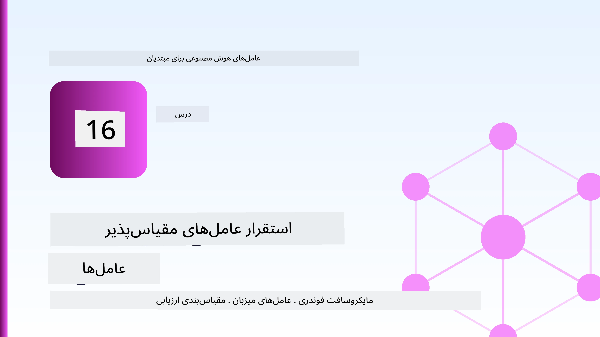
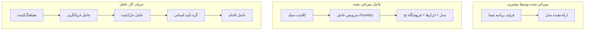
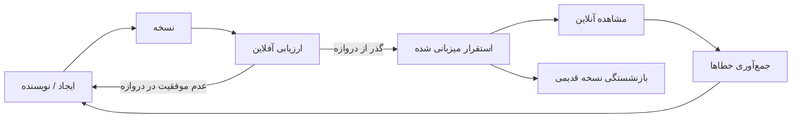
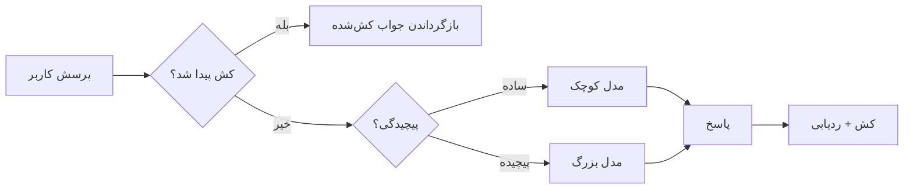
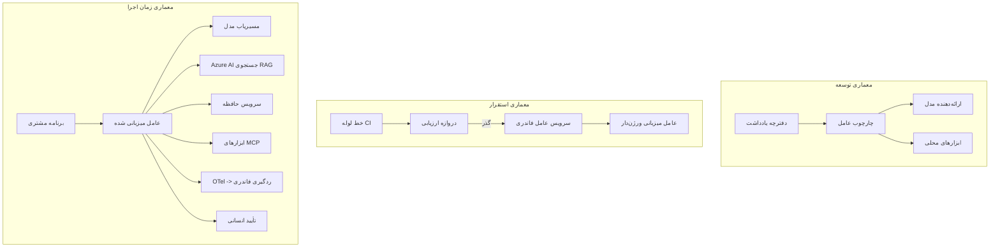

# استقرار عوامل مقیاس‌پذیر با Microsoft Foundry



تا اینجا در دوره، عواملی ساخته‌اید که روی لپ‌تاپ شما، داخل یک نوت‌بوک اجرا می‌شوند، با دستور `az login` و چند متغیر محیطی هدایت می‌شوند. این دقیقاً روش صحیح برای یادگیری است. اما این روش مناسب برای اجرای عاملی که هزاران مشتری روی آن در ساعت ۳ صبح حساب می‌کنند نیست.

این درس درباره‌ی شکاف بین "روی ماشین من کار می‌کند" و "روی محیط تولید به طور قابل اعتماد و مقرون به صرفه کار می‌کند" است. این شکاف را با استفاده از **Microsoft Foundry** و **Microsoft Foundry Agent Service** می‌بندیم، و این کار را با ساخت یک عامل پشتیبانی مشتری واقعی که ابزارها، بازیابی، حافظه، ارزیابی و پایش دارد، انجام می‌دهیم.

## مقدمه

این درس موارد زیر را پوشش می‌دهد:

- تفاوت بین **عامل نمونه اولیه** و **عامل مستقر شده** و اینکه چرا انتقال بیشتر درباره همه چیز *دور* مدل است.
- **الگوهای استقرار** برای عوامل: میزبانی روی کلاینت، میزبانی سرویس (عوامل میزبانی شده)، و هماهنگی جریان کاری.
- **چرخه عمر عامل** در Microsoft Foundry — ساخت، نسخه‌بندی، استقرار، ارزیابی، مشاهده، بازنشستگی.
- **راهبردهای مقیاس‌گذاری**: مسیریابی مدل، کش کردن، همزمانی، و طراحی بدون حالت.
- **رویت‌پذیری** با OpenTelemetry و ردگیری Foundry.
- **بهینه‌سازی هزینه** از طریق انتخاب مدل، مسیریابی، و دروازه‌های ارزیابی.
- **ملاحظات سازمانی**: حاکمیت، تأیید انسانی، و اجرای امن سرورهای MCP در محیط تولید.

## اهداف یادگیری

پس از اتمام این درس، شما خواهید دانست چگونه:

- الگوی استقرار مناسب برای بار کاری یک عامل را انتخاب کنید.
- عاملی را به Microsoft Foundry Agent Service مستقر کنید تا نسخه‌بندی، حاکمیت و رویت‌پذیری داشته باشد.
- عاملی را برای ردگیری ابزارآلات کرده و یک خط لوله ارزیابی که قبل از هر انتشار اجرا می‌شود، ایجاد کنید.
- مسیریابی مدل و کش را برای کنترل تأخیر و هزینه در مقیاس اعمال کنید.
- یک دروازه تأیید انسانی برای عملیات پرخطر اضافه کنید و یک سرور MCP را به‌صورت ایمن در محیط تولید یکپارچه کنید.

## پیش‌نیازها

این درس فرض می‌کند که درس‌های قبلی را گذرانده و با موارد زیر آشنا هستید:

- ساخت عوامل با [چارچوب عامل مایکروسافت](../14-microsoft-agent-framework/README.md) (درس ۱۴).
- [استفاده از ابزار](../04-tool-use/README.md) (درس ۴) و [RAG عامل](../05-agentic-rag/README.md) (درس ۵).
- [حافظه عامل](../13-agent-memory/README.md) (درس ۱۳) و [پروتکل‌های عاملی / MCP](../11-agentic-protocols/README.md) (درس ۱۱).
- [رویت‌پذیری و ارزیابی](../10-ai-agents-production/README.md) (درس ۱۰) — این درس مستقیماً روی آن بنا شده است.

همچنین نیاز دارید:

- یک **اشتراک Azure** و یک **پروژه Microsoft Foundry** با حداقل یک مدل چت مستقر شده.
- **Azure CLI** احراز هویت شده (`az login`).
- Python 3.12+ و بسته‌های موجود در فایل [`requirements.txt`](../../../requirements.txt).

## از نمونه اولیه تا تولید: واقعاً چه چیزهایی تغییر می‌کند

یک عامل نمونه اولیه و یک عامل تولیدی همان حلقه اصلی را دارند — استدلال، فراخوانی ابزارها، پاسخ. تفاوت در همه چیزهایی است که دور آن حلقه پیچیده شده است. مدل شاید ۲۰٪ یک عامل تولیدی باشد؛ ۸۰٪ دیگر اسکلت عملیات است.

| دغدغه | نمونه اولیه | تولید |
| --- | --- | --- |
| **میزبانی** | در نوت‌بوک شما اجرا می‌شود | به صورت سرویس میزبانی شده، نسخه‌بندی‌شده و منتشر شده اجرا می‌شود |
| **هویت** | توکن `az login` شما | هویت مدیریت شده با RBAC محدوده‌بندی‌شده |
| **وضعیت** | در حافظه موقت، با راه‌اندازی مجدد از بین می‌رود | برون‌سپاری شده (فروشگاه رشته، سرویس حافظه) |
| **خطا** | شما ردگیری خطا را می‌بینید | تلاش مجدد، حالت‌های جایگزین، صف مرده، هشدارها |
| **هزینه** | "چند سنت است" | ردیابی شده به ازای هر درخواست، مسیریابی، کش شده، بودجه‌بندی‌شده |
| **کیفیت** | خروجی را چشمی بررسی می‌کنید | قبل از هر انتشار به صورت خودکار ارزیابی می‌شود |
| **اعتماد** | شما هر اقدام را تأیید می‌کنید | سیاست + انسان در حلقه برای اقدامات پرخطر |

این جدول را به یاد داشته باشید. هر بخش زیر متناظر با یکی از این ردیف‌ها است.

## الگوهای استقرار عامل

سه الگو وجود دارد که اغلب به صورت ترکیبی استفاده می‌کنید.

### ۱. عوامل میزبانی شده روی کلاینت

شی عامل داخل فرآیند برنامه شما زندگی می‌کند. کد شما مستقیم به ارائه‌دهنده مدل تماس می‌گیرد؛ حلقه استدلال در سرویس شما اجرا می‌شود. این کاری است که در همه درس‌های قبلی انجام شده است.

- **زمان استفاده** وقتی است که نیاز به کنترل کامل حلقه، میدل‌ور سفارشی یا جاسازی عامل داخل بک‌اند موجود دارید.
- **معایب**: مقیاس‌گذاری، وضعیت، و تاب‌آوری را خودتان باید مدیریت کنید.

### ۲. عوامل میزبانی شده (Foundry Agent Service)

عامل *به عنوان یک منبع* در Microsoft Foundry ثبت می‌شود. Foundry حلقه استدلال را میزبانی می‌کند، رشته‌ها را ذخیره می‌کند، ایمنی محتوا و RBAC را اجرا می‌کند و عامل را در پورتال Foundry قابل مشاهده می‌سازد. برنامه شما به مشتری باریکی تبدیل می‌شود که رشته‌ها را می‌سازد و پاسخ‌ها را می‌خواند.

- **زمان استفاده** وقتی است که دوام، رویت‌پذیری داخلی، حاکمیت و سطح عملیات کمتر می‌خواهید.
- **معایب**: کنترل پایین‌تر سطح در ازای اجرای مدیریت‌شده.

### ۳. جریان‌های کاری عامل

چند عامل (و ابزار) در یک گراف با جریان کنترل صریح — مراحل متوالی، انشعاب، گره‌های تأیید انسانی، و نقاط چک بادوام که می‌توانند توقف و ادامه داده شوند — ترکیب می‌شوند. این قابلیت **Workflows** چارچوب عامل مایکروسافت است که در مقیاس استقرار اعمال می‌شود.

- **زمان استفاده** وقتی است که یک کار واحد شامل چند عامل تخصصی است یا نیاز به مرحله تأیید در وسط دارد.
- **معایب**: قطعات متحرک بیشتر؛ به رویت‌پذیری سطح هماهنگی نیاز دارد.



## چرخه عمر عامل در Microsoft Foundry

استقرار عامل یک `push` یک‌باره نیست. این یک حلقه است و شبیه چرخه انتشار نرم‌افزار به نظر می‌رسد چون دقیقاً همان است.



ایده کلیدی، گرفته شده از [درس ۱۰](../10-ai-agents-production/README.md): **ارزیابی آفلاین یک دروازه است، نه یک فکر بعدی.** یک نسخه جدید عامل تا زمانی که از آستانه‌های ارزیابی شما عبور نکند، منتشر نمی‌شود. رویت‌پذیری آنلاین سپس شکست‌های دنیای واقعی را به مجموعه تست آفلاین شما بازمی‌گرداند. این کل حلقه است.

## راهبردهای مقیاس‌گذاری

مقیاس‌گذاری یک عامل با مقیاس‌گذاری یک API وب بدون حالت متفاوت است، چون هر درخواست می‌تواند چندین فراخوانی مدل و ابزار هزینه‌بر ایجاد کند. چهار تکنیک بیشتر بار را تحمل می‌کنند.

**مدیریت درخواست بدون حالت.** هیچ وضعیت کاربر محور را در حافظه فرایند خود نگه ندارید. رشته‌های مکالمه را در فروشگاه رشته Foundry یا یک سرویس حافظه ذخیره کنید تا هر نمونه‌ بتواند هر درخواستی را مدیریت کند. این چیزی است که به شما اجازه می‌دهد به صورت افقی مقیاس دهید — افزودن نمونه‌ها، بدون نشست‌های چسبنده.

**مسیریابی مدل.** هر درخواستی به مدل توانمند (و پرهزینه) شما نیاز ندارد. درخواست‌های ساده — طبقه‌بندی نیت، پاسخ‌های کوتاه و حقیقی — را به مدل کوچک و سریع هدایت کنید و مدل بزرگ را برای استدلال واقعی حفظ کنید. **مدیریت مسیریاب مدل** Foundry می‌تواند این کار را برای شما انجام دهد، یا خودتان یک طبقه‌بندی‌کننده سبک بسازید. نسخه DIY را در آزمایشگاه خواهید ساخت.

**کش کردن پاسخ.** بسیاری از سؤالات پشتیبانی تقریباً تکراری‌اند ("چطور رمز عبورم را تنظیم مجدد کنم؟"). پاسخ‌ها به سوالات رایج را کش کنید و بدون تماس با مدل ارائه دهید. حتی نرخ برخورد کش متوسط به طور معنی‌داری هزینه و تأخیر را کاهش می‌دهد.

**رقابت و فشار برگشتی.** ارائه‌دهندگان مدل محدودیت نرخ دارند. همزمانی خود را محدود کنید، از تلاش مجدد با پس‌زدگی نمایی استفاده کنید، و با لطافت شکست بخورید (پاسخ صف "در دست اقدام هستیم" بهتر از خطای ۵۰۰ است).



## رویت‌پذیری در تولید

شما نمی‌توانید چیزی را که نمی‌بینید اداره کنید. همانطور که در درس ۱۰ پوشش داده شد، چارچوب عامل مایکروسافت به طور بومی ردگیری‌های **OpenTelemetry** تولید می‌کند — هر تماس مدل، فراخوانی ابزار و مرحله هماهنگی به یک اسپن تبدیل می‌شود. در تولید، آن اسپن‌ها را به Microsoft Foundry (یا هر پشتیبانی سازگار با OTel) صادر می‌کنید تا بتوانید:

- شکایتی از مشتری را از ابتدا تا انتها، در هر تماس مدل و ابزار ردگیری کنید.
- تاخیرهای p50/p95 و هزینه به ازای هر درخواست را در طول زمان مشاهده کنید.
- قبل از اینکه کاربران (یا تیم مالی شما) متوجه شوند، در افزایش نرخ خطا و ناهنجاری‌های هزینه هشدار دهید.

```python
from agent_framework.observability import get_tracer

tracer = get_tracer()

with tracer.start_as_current_span("support_request") as span:
    span.set_attribute("customer.tier", "enterprise")
    span.set_attribute("routed.model", "gpt-5-nano")
    # اجرای عامل به‌طور خودکار در داخل این بازه دنبال می‌شود
```

ویژگی‌هایی مانند `customer.tier` و `routed.model` همان چیزهایی هستند که دیوار ردگیری‌ها را به پرسش‌های قابل پاسخ تبدیل می‌کنند ("آیا مشتریان سازمانی خیلی اغلب به مدل کوچک هدایت می‌شوند؟").

## بهینه‌سازی هزینه

هزینه در عوامل تولیدی عمدتاً به توکن‌ها وابسته است. سه اهرم، به ترتیب تاثیر:

۱. **انتخاب اندازه مناسب مدل.** یک مدل کوچک که از دروازه ارزیابی عبور کند تقریباً همیشه ارزان‌تر از یک مدل بزرگ است که همچنین قبول شده باشد. از ارزیابی برای *اثبات* اینکه مدل کوچک کافی است استفاده کنید، نه اینکه به‌صورت پیش‌فرض بزرگ‌ترین مدل را به دلیل احتیاط انتخاب کنید.
۲. **مسیریابی بر اساس پیچیدگی.** همانطور که گفته شد — تنها برای درخواست‌هایی که نیاز به استدلال مدل بزرگ دارند هزینه مدل بزرگ را پرداخت کنید.
۳. **کش کردن با شدت.** ارزان‌ترین تماس مدل همان تماسی است که هرگز انجام نمی‌دهید.

دروازه‌های ارزیابی و کنترل هزینه همان انضباط هستند از دو زاویه مختلف: ارزیابی به شما *کف کیفیت* را می‌گوید، مسیریابی و کش کردن شما را به نزدیک‌ترین هزینه به آن *کف* می‌رساند.

## ملاحظات استقرار سازمانی

**حاکمیت.** عوامل میزبانی شده از RBAC، ایمنی محتوا، و لاگ‌ برداری ممیزی Foundry ارث می‌برند. به هر عامل یک هویت مدیریت شده با کمترین امتیازی که نیاز دارد بدهید — دسترسی فقط خواندنی به پایگاه دانش، دسترسی محدود به API صدور بلیت، و بس.

**انسان در حلقه.** برخی عملیات برای اتوماسیون کامل خیلی مهم هستند — بازپرداخت، حذف حساب، ارجاع به تیم حقوقی. چارچوب عامل مایکروسافت از ابزارهای **نیازمند تأیید** پشتیبانی می‌کند: عامل پیشنهاد اقدام می‌دهد، اجرا متوقف می‌شود، یک انسان تأیید یا رد می‌کند، و جریان کاری ادامه می‌یابد. شما این ابتدایی را در [درس ۶](../06-building-trustworthy-agents/README.md) دیدید؛ اینجا آن را مستقر می‌کنید.

**MCP در تولید.** [MCP](../11-agentic-protocols/README.md) به عامل شما اجازه می‌دهد ابزارهای خارجی را از طریق یک رابط استاندارد مصرف کند. در تولید، هر سرور MCP را به عنوان یک مرز غیرقابل اعتماد رفتار کنید: نسخه سرور را ثابت کنید، آن را با یک هویت محدوده‌بندی‌شده اجرا کنید، خروجی‌هایش را تأیید کنید و هرگز اسرار را به آن ندهید. یک سرور MCP یک وابستگی است، و وابستگی‌ها پچ، ممیزی، و محدود به نرخ دریافت می‌کنند.



آن سه نمودار — توسعه، استقرار، زمان اجرا — همان عامل در سه مرحله از زندگی آن هستند. آزمایشگاهی که در ادامه می‌آید شما را در ساخت آن راهنمایی می‌کند.

## آزمایشگاه عملی: عاملی پشتیبانی مشتری آماده برای تولید

فایل [`code_samples/16-python-agent-framework.ipynb`](./code_samples/16-python-agent-framework.ipynb) را باز کنید و از ابتدا تا انتها کار کنید. شما یک **عامل پشتیبانی مشتری Contoso** را با هر نگرانی تولیدی به هم متصل خواهید کرد:

۱. **فراخوانی ابزار** — وضعیت سفارش را بررسی و بلیت‌های پشتیبانی باز کنید.
۲. **RAG** — پاسخ به پرسش‌های سیاست از یک پایگاه دانش (Azure AI Search، با یک جایگزین حافظه موقت تا نوت‌بوک بدون منبع Search اجرا شود).
۳. **حافظه** — مشتری را در طول مکالمه به یاد داشته باشید.
۴. **مسیریابی مدل** — یک طبقه‌بند پیچیدگی هر درخواست را به مدل کوچک یا بزرگ هدایت می‌کند.
۵. **کش کردن پاسخ** — سوالات تکراری از کش دیده می‌شوند.
۶. **تأیید انسانی** — بازپرداخت‌های بالاتر از آستانه منتظر تأیید انسانی می‌مانند.
۷. **خط لوله ارزیابی** — یک مجموعه تست کوچک آفلاین عامل را امتیازدهی کرده و به عنوان دروازه انتشار عمل می‌کند.
۸. **رویت‌پذیری** — ردگیری OpenTelemetry حول هر درخواست.

### راهنمای گام به گام

نوت‌بوک به گونه‌ای سازماندهی شده که هر نگرانی تولیدی یک بخش مستقل و قابل اجرا است. هسته آن پردازشگر درخواست مسیریابی به علاوه کش است:

```python
async def handle_support_request(query: str, customer_id: str) -> str:
    # ۱. هنگامی که ممکن است از کش ارائه دهیم.
    cached = response_cache.get(normalize(query))
    if cached:
        return cached

    # ۲. مسیر یابی بر اساس پیچیدگی برای کنترل هزینه.
    model = "gpt-5-nano" if is_simple(query) else "gpt-5-mini"

    # ۳. اجرای عامل در داخل یک بازه ردگیری برای مشاهده‌پذیری.
    with tracer.start_as_current_span("support_request") as span:
        span.set_attribute("routed.model", model)
        span.set_attribute("customer.id", customer_id)
        response = await support_agent.run(query, model=model)

    # ۴. کش کنید و بازگردانید.
    response_cache.set(normalize(query), response.text)
    return response.text
```

دروازه ارزیابی که یک انتشار را محافظت می‌کند به این شکل است:

```python
async def evaluation_gate(agent, test_cases, threshold: float = 0.8) -> bool:
    passed = 0
    for case in test_cases:
        result = await agent.run(case["input"])
        if score_response(result.text, case["expected"]) >= 0.8:
            passed += 1
    pass_rate = passed / len(test_cases)
    print(f"Evaluation pass rate: {pass_rate:.0%} (gate: {threshold:.0%})")
    return pass_rate >= threshold  # فقط در صورتی که گیت موفق شد مستقر کن
```

هر خط را بخوانید — نوت‌بوک بخش‌های ابتدایی را عمداً کوچک نگه می‌دارد تا چیزی پشت فراخوانی چارچوب پنهان نباشد.

## اعتبارسنجی عامل مستقر شده با تست‌های دود

دروازه ارزیابی بالا به طور *آفلاین* روی شی عامل شما اجرا می‌شود. وقتی عامل به عنوان یک عامل میزبانی شده مستقر شد، به یک بررسی ارزان‌تر دیگر نیاز دارید: **آیا نقطه نهایی مستقر واقعاً پاسخ می‌دهد؟**

استقرار "موفق" تنها ثابت می‌کند که صفحه کنترل تعریف را پذیرفته است — این ثابت نمی‌کند که عامل پاسخ می‌دهد. یک وابستگی گم‌شده، مسیریابی نادرست مدل، یا اتصال منقضی می‌تواند یک استقرار سبز باقی بگذارد که هیچ چیزی برنمی‌گرداند. یک **تست دود** این را در عرض چند ثانیه، در هر استقرار، بدون هزینه‌های یک ارزیابی کامل تشخیص می‌دهد.

این مخزن یک خط لوله تست دود آماده استفاده مبتنی بر اکشن GitHub [AI Smoke Test](https://github.com/marketplace/actions/ai-smoke-test) ارائه می‌دهد:

- **کتالوگ** — [`tests/lesson-16-smoke-tests.json`](../../../tests/lesson-16-smoke-tests.json) شامل پرامپت‌ها و تأییدیه‌ها برای عامل پشتیبانی Contoso (پاسخ‌های سیاست مبتنی بر دانش، جستجوی سفارش، ماندن در موضوع، و تداوم رشته چندگانه). کاتالوگ‌های عوامل درس‌های دیگر در همان مسیر قرار دارند — ببینید [`tests/README.md`](../tests/README.md).
- **جریان کاری** — [`.github/workflows/smoke-test.yml`](../../../.github/workflows/smoke-test.yml) با OIDC Azure وارد شده و هر پرامپت را به نقطه پایانی Responses عامل ارسال می‌کند، در صورت هر عدم تطابق اعلان خطا می‌دهد.

```yaml
- name: Smoke-test hosted agent
  uses: JFolberth/ai-smoketest@v1
  with:
    project_endpoint: ${{ inputs.project_endpoint }}
    agent_name: ContosoSupportAgent
    tests_file: tests/lesson-16-smoke-tests.json
```


آن را از برگه **Actions** اجرا کنید هنگامی که عامل شما مستقر شد، با ارائه نقطه انتهایی پروژه Foundry و نام عامل خود. هویت گروهی به نقش **Azure AI User** در حوزه پروژه Foundry نیاز دارد. لایه‌ها را مانند یک هرم در نظر بگیرید: تست‌های دود (قابل دسترس و پاسخگو؟) در هر استقرار اجرا می‌شوند، ارزیابی آفلاین (کافی برای ارسال است؟) قبل از ارتقاء اجرا می‌شود، و ارزیابی آنلاین (چگونه در محیط واقعی عمل می‌کند؟) به صورت مستمر اجرا می‌شود.

## بررسی دانش

پیش از رفتن به تکلیف، دانش خود را آزمایش کنید.

**۱. تقریباً چه مقدار از یک عامل تولید «مدل» است و بقیه چیست؟**

<details>
<summary>پاسخ</summary>

مدل بخش کوچکی از سیستم است — اغلب حدود ۲۰٪ ذکر می‌شود. بقیه استخوان‌بندی عملیاتی است: میزبانی و نسخه‌بندی، هویت و RBAC، حالت خارجی‌شده، مدیریت خطا، پیگیری هزینه، ارزیابی و کنترل‌های انسان در حلقه. رفتن به مرحله تولید بیشتر درباره ساخت همه چیز *در اطراف* حلقه استدلال است.
</details>

**۲. چه زمانی عامل میزبانی‌شده را به جای عامل میزبانی‌شده توسط مشتری انتخاب می‌کنید؟**

<details>
<summary>پاسخ</summary>

وقتی می‌خواهید یک زمان‌اجرای مدیریت‌شده با دوام داخلی (ریسمان‌هایی که پایدارند و می‌توانند ادامه پیدا کنند)، قابلیت مشاهده، ایمنی محتوا و RBAC داشته باشید و آماده باشید که بخشی از کنترل سطح پایین حلقه استدلال را به ازای کاهش سطح عملیاتی فدا کنید. میزبانی‌شده توسط مشتری وقتی ترجیح دارد که کنترل کامل بر حلقه نیاز است یا عامل در بک‌اند موجود جاسازی می‌شود.
</details>

**۳. چرا یک عامل مقیاس‌پذیر باید در حافظه فرآیند خودش بدون حالت باشد؟**

<details>
<summary>پاسخ</summary>

تا هر نسخه‌ای بتواند هر درخواست را پردازش کند، که این امکان مقیاس‌پذیری افقی بدون نشست‌های ثابت (sticky sessions) را می‌دهد. حالت گفتگو برای هر کاربر به ذخیره‌سازی ریسمان یا سرویس حافظه خارجی منتقل شده است. اگر حالت در حافظه فرآیند ذخیره می‌شد، با راه‌اندازی مجدد از دست می‌رفت و بار را نمی‌توانستید به‌صورت آزاد توزیع کنید.
</details>

**۴. مسیریابی مدل چه مشکلی را حل می‌کند و چگونه به ارزیابی مرتبط است؟**

<details>
<summary>پاسخ</summary>

مسیریابی درخواست‌های ساده را به مدل کوچک، ارزان و سریع می‌فرستد و مدل بزرگ را برای استدلال واقعی نگه می‌دارد، و هم زمان تاخیر و هزینه را مدیریت می‌کند. به ارزیابی مرتبط است چون ارزیابی است که *ثابت می‌کند* مدل کوچک برای یک دسته از درخواست‌ها کافی است — مسیریابی بدون ارزیابی حدس است.
</details>

**۵. «دروازه ارزیابی» چیست و در چرخه عمر کجا قرار دارد؟**

<details>
<summary>پاسخ</summary>

دروازه ارزیابی مجموعه آزمایش‌های آفلاین را روی نسخه جدید عامل اجرا می‌کند و استقرار را مسدود می‌کند مگر اینکه نرخ عبور از یک آستانه عبور کند. این در بین «نسخه» و «استقرار» در چرخه عمر قرار می‌گیرد، و کیفیت را پیش‌شرط انتشار می‌کند نه چیزی که بعد از ارسال بررسی شود.
</details>

**۶. چرا باید سرور MCP در تولید به عنوان یک مرز غیرقابل اعتماد در نظر گرفته شود؟**

<details>
<summary>پاسخ</summary>

چون یک وابستگی خارجی است که عامل شما به آن درخواست می‌کند. باید نسخه آن را قفل کنید، با یک هویت محدود اجرا کنید، خروجی‌هایش را اعتبارسنجی کنید، نرخ آن را محدود کنید، و هرگز اسرار را به آن افشا نکنید — همان انضباطی که برای هر وابستگی شخص ثالث به کار می‌برید. خروجی‌های آن وارد استدلال عامل شما می‌شوند، بنابراین اعتماد بدون اعتبارسنجی یک ریسک امنیتی است.
</details>

**۷. کدام تغییر واحد معمولاً بیشترین تاثیر را روی هزینه عامل تولید دارد و چرا؟**

<details>
<summary>پاسخ</summary>

اندازه مناسب مدل — استفاده از کوچک‌ترین مدلی که هنوز دروازه ارزیابی شما را رد می‌کند. هزینه‌ها عمدتاً توسط توکن‌ها تعیین می‌شوند، و مدل کوچکتری که کیفیت لازم را داشته باشد تقریباً همیشه از مدل بزرگتر ارزان‌تر است. حافظه نهان و مسیریابی هزینه‌ها را بیشتر کاهش می‌دهند، اما انتخاب مدل پایه درست بیشترین تاثیر درجه اول را دارد.
</details>

**۸. ویژگی‌های Span مثل `customer.tier` و `routed.model` چه نقشی در مشاهده‌پذیری دارند؟**

<details>
<summary>پاسخ</summary>

آن‌ها ردهای خام را به سوالات قابل پاسخ تبدیل می‌کنند. بدون ویژگی‌ها، دیواری از اسپن‌ها دارید؛ با آن‌ها می‌توانید بپرسید «آیا مشتریان سازمانی خیلی اغلب به مدل کوچک فرستاده می‌شوند؟» یا «کدام مدل درخواست‌های کند ما را مدیریت می‌کند؟» ویژگی‌ها نحوه برش تله‌متری به ابعاد مهم عملیات شما هستند.
</details>

## تکلیف

عامل پشتیبانی مشتری از آزمایشگاه را گرفته و آن را برای یک سناریوی خاص سخت‌تر کنید: **عامل پشتیبانی صورتحساب اشتراک برای یک شرکت SaaS.**

ارسال شما باید:

۱. **ابزارها را جایگزین کنید** با ابزارهای مرتبط با صورتحساب: `get_subscription_status`، `get_invoice` و `issue_credit` (اعتبار بیش از ۵۰ دلار نیاز به تایید انسان دارد).
۲. **سه سند RAG اضافه کنید** که سیاست بازپرداخت شرکت، چرخه صورتحساب و سیاست لغو را پوشش می‌دهند.
۳. **مجموعه ارزیابی را به حداقل هشت مورد گسترش دهید**، از جمله حداقل دو مورد که *باید* مسیر تایید انسانی را فعال کنند، و اطمینان حاصل کنید که دروازه ارزیابی شما به درستی قبول یا رد می‌کند.
۴. **یک گزارش هزینه اضافه کنید**: پس از اجرای ده پرسش ترکیبی از طریق عامل، چاپ کنید چند مورد به مدل کوچک رفتند، چند مورد به مدل بزرگ، و چند مورد از حافظه پنهان سرو شدند.

یک پاراگراف کوتاه (در یک سلول مارک‌داون) بنویسید که توضیح دهد کدام قانون مسیریابی مدل را انتخاب کرده‌اید و چگونه آن را با ترافیک واقعی اعتبارسنجی می‌کنید. پاسخ واحد و صحیحی وجود ندارد — شما بر اساس این ارزیابی می‌شوید که آیا نگرانی‌های تولید به صورت منسجم به هم متصل شده‌اند یا خیر.

## خلاصه

در این درس یک عامل را از نمونه اولیه به تولید با Microsoft Foundry منتقل کردید:

- جهش به تولید بیشتر درباره **استخوان‌بندی عملیاتی** در اطراف مدل است — میزبانی، هویت، حالت، مدیریت خطا، هزینه، کیفیت و اعتماد.
- شما سه **الگوهای استقرار** را یاد گرفتید — میزبانی‌شده توسط مشتری، عوامل میزبانی‌شده و گردش‌کارهای عامل — و هر کدام چه وقت مناسبند.
- شما چرخه عمر **عامل** را طی کردید، جایی که ارزیابی آفلاین به عنوان **دروازه انتشار** عمل می‌کند و مشاهده‌پذیری آنلاین خطاها را به مجموعه آزمایش بازمی‌گرداند.
- شما **استراتژی‌های مقیاس‌گذاری** را به کار بردید — طراحی بدون حالت، مسیریابی مدل، حافظه پنهان و همزمانی محدود — و آن‌ها را به **بهینه‌سازی هزینه** وصل کردید.
- شما **کنترل‌های سازمانی** را وارد کردید: RBAC، تایید انسان در حلقه، و ادغام امن MCP در تولید.
- شما یک **عامل پشتیبانی مشتری آماده تولید** ساختید که هر یک از این نگرانی‌ها را در کدی قابل اجرا به هم وصل می‌کند.

درس بعدی سفر برعکس را می‌برد: به جای مقیاس‌گذاری عوامل به سمت ابر، آن‌ها را روی یک ماشین توسعه‌دهنده واحد پایین می‌آورید و کاملاً به صورت محلی اجرا می‌کنید.

## منابع اضافی

- <a href="https://learn.microsoft.com/azure/ai-foundry/what-is-azure-ai-foundry" target="_blank">مستندات Microsoft Foundry</a>
- <a href="https://learn.microsoft.com/azure/ai-foundry/agents/overview" target="_blank">مرور سرویس عامل Microsoft Foundry</a>
- <a href="https://aka.ms/ai-agents-beginners/agent-framework" target="_blank">چارچوب عامل Microsoft</a>
- <a href="https://learn.microsoft.com/azure/ai-foundry/concepts/model-router" target="_blank">مسیریاب مدل در Microsoft Foundry</a>
- <a href="https://learn.microsoft.com/azure/search/search-what-is-azure-search" target="_blank">Azure AI Search</a>
- <a href="https://opentelemetry.io/" target="_blank">OpenTelemetry</a>
- <a href="https://github.com/marketplace/actions/ai-smoke-test" target="_blank">عملگر GitHub تست دود AI</a>
- <a href="https://modelcontextprotocol.io/" target="_blank">پروتکل زمینه مدل (MCP)</a>

## درس قبلی

[ساخت عوامل استفاده کامپیوتری (CUA)](../15-browser-use/README.md)

## درس بعدی

[ایجاد عوامل AI محلی](../17-creating-local-ai-agents/README.md)

---

<!-- CO-OP TRANSLATOR DISCLAIMER START -->
**سلب مسئولیت**:
این سند با استفاده از سرویس ترجمه هوش مصنوعی [Co-op Translator](https://github.com/Azure/co-op-translator) ترجمه شده است. در حالی که ما در تلاش برای دقت هستیم، لطفاً توجه داشته باشید که ترجمه‌های خودکار ممکن است شامل خطاها یا نادرستی‌هایی باشند. سند اصلی به زبان مادری خود باید به عنوان منبع معتبر در نظر گرفته شود. برای اطلاعات حیاتی، ترجمه حرفه‌ای انسانی توصیه می‌شود. ما در قبال هرگونه سوء تفاهم یا برداشت نادرست ناشی از استفاده از این ترجمه مسئولیتی نداریم.
<!-- CO-OP TRANSLATOR DISCLAIMER END -->