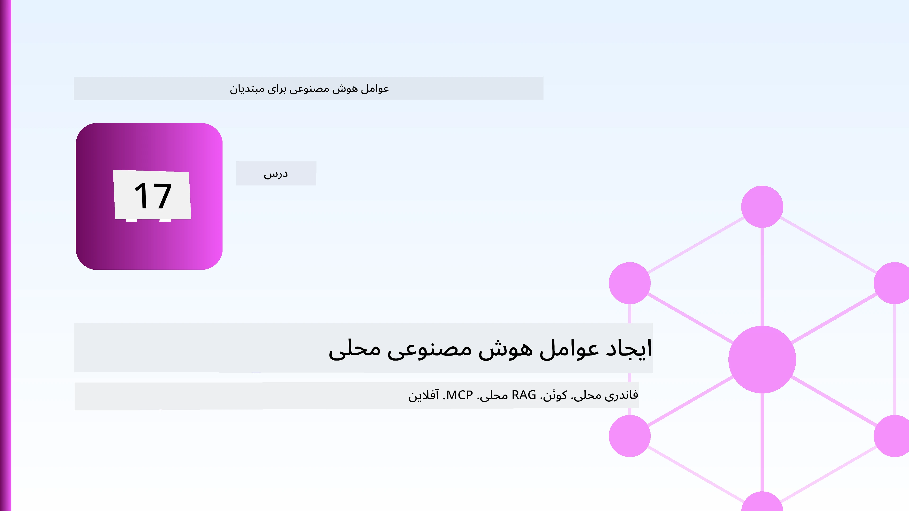
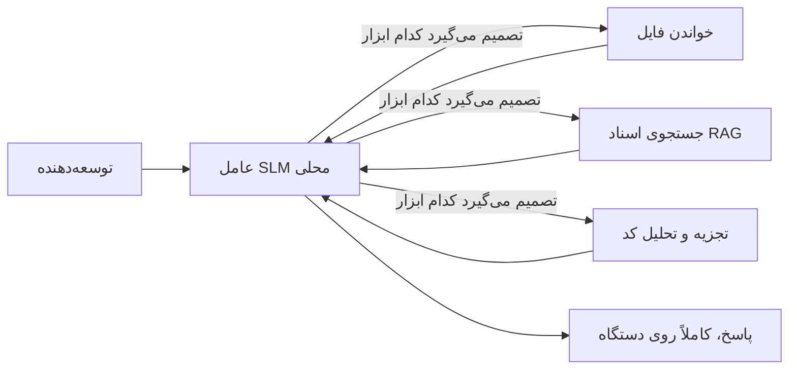
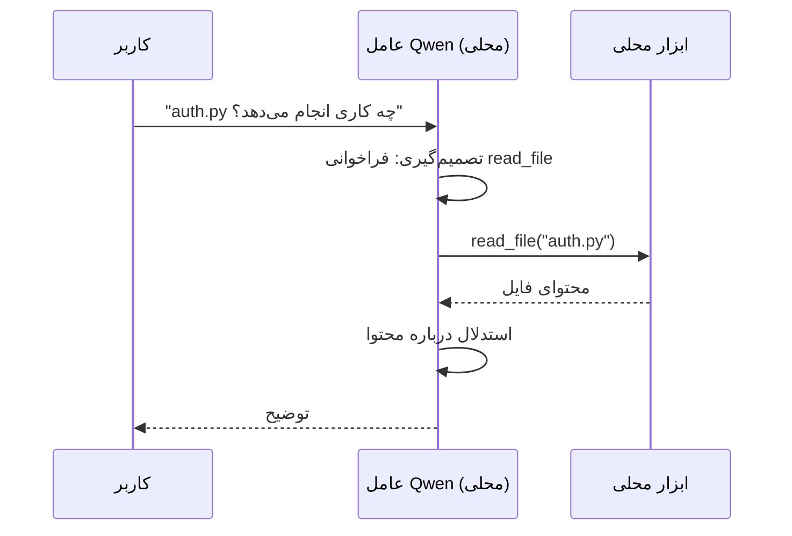
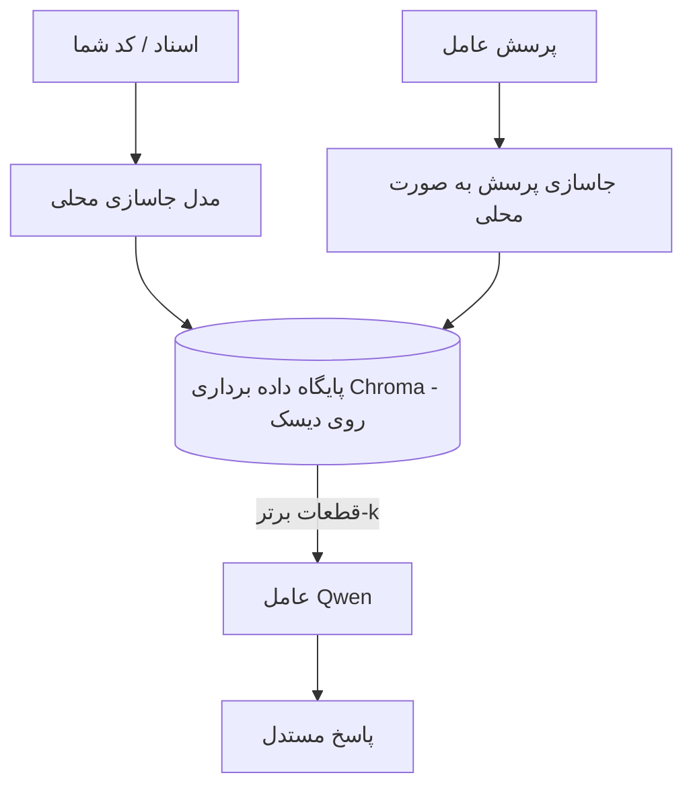
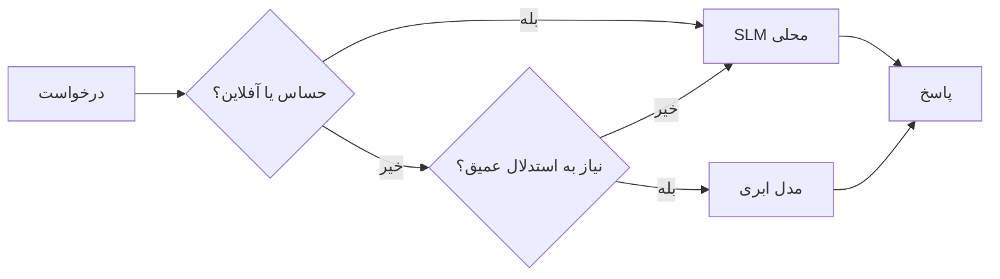

# ایجاد عامل‌های هوش مصنوعی محلی با استفاده از Microsoft Foundry Local و Qwen



درس قبلی عامل‌ها را *به‌سمت ابر* مقیاس‌بندی کرد. این یکی آن‌ها را *به‌سمت پایین* روی یک دستگاه منفرد می‌آورد. در پایان شما یک دستیار مهندسی کارآمد خواهید داشت که استدلال می‌کند، ابزارها را فراخوانی می‌کند، فایل‌های شما را می‌خواند و مدارک شما را جستجو می‌کند — **بدون حتی یک فراخوانی استنتاج ابری.**

چرا باید این را بخواهید؟ سه دلیل که در کار مهندسی واقعی مدام مطرح می‌شوند:

- **حریم خصوصی.** کد و اسناد هرگز دستگاه را ترک نمی‌کنند. هیچ پرسش، قطعه کد یا داده مشتری از مرز شبکه عبور نمی‌کند.
- **هزینه.** استنتاج محلی هیچ صورتحساب به ازای هر توکن ندارد. شما می‌توانید تمام روز با هزینه برق، تکرار کنید.
- **آفلاین.** در هواپیما، در یک مرکز امن، یا در هنگام قطعی، عامل همچنان کار می‌کند.

نکته این است که شما یک مدل ابری پیشرفته را با یک **مدل زبان کوچک (SLM)** که روی CPU، GPU یا NPU شما اجرا می‌شود، معاوضه می‌کنید. این درس در مورد ساخت عامل‌هایی است که در چارچوب این محدودیت *خوب* هستند، نه وانمود کردن به اینکه این محدودیت وجود ندارد.

## مقدمه

این درس شامل موارد زیر است:

- **مدل‌های زبان کوچک (SLMs)** — چی هستند، کجا کاربرد دارند و کجا ندارند.
- **Microsoft Foundry Local** — یک محیط اجرایی که مدل‌ها را به‌صورت محلی دانلود و ارائه می‌دهد از طریق یک **رابط برنامه‌نویسی سازگار با OpenAI**.
- **مدل‌های فراخوانی تابع Qwen** — مدل‌های SLM که قابل اعتماد فراخوانی ابزار تولید می‌کنند، که امکان ساخت *عامل‌های* محلی (نه فقط چت محلی) را فراهم می‌کند.
- **ابزارهای محلی، RAG محلی و MCP محلی** — به عامل قابلیت بدون استفاده از ابر می‌دهد.
- **الگوهای ترکیبی** — چه زمانی باید همه چیز محلی بماند و چه زمانی باید به ابر رجوع کرد.

## اهداف یادگیری

پس از تکمیل این درس، شما خواهید دانست چگونه:

- مزایا و معایب مدل‌های زبان کوچک را توضیح دهید و موارد استفاده مناسب از عامل‌های محلی را انتخاب کنید.
- یک مدل Qwen را به صورت محلی با Foundry Local ارائه دهید و از طریق نقطه انتهایی سازگار با OpenAI به آن متصل شوید.
- یک عامل فراخوانی ابزار بسازید که کاملاً روی ایستگاه کاری شما اجرا شود.
- RAG محلی را بر روی اسناد خود با استفاده از پایگاه داده برداری محلی (Chroma) اضافه کنید.
- عامل را به سرور MCP محلی متصل کنید و درباره طراحی‌های ترکیبی محلی/ابری استدلال کنید.

## پیش‌نیازها

فرض بر این است که دروس قبلی را گذرانده‌اید و با موارد زیر آشنا هستید:

- [استفاده از ابزار](../04-tool-use/README.md) (درس 4) و [RAG عاملی](../05-agentic-rag/README.md) (درس 5).
- [پروتکل‌های عاملی / MCP](../11-agentic-protocols/README.md) (درس 11).
- چارچوب عامل مایکروسافت [Microsoft Agent Framework](../14-microsoft-agent-framework/README.md) (درس 14).

همچنین نیاز دارید:

- یک ایستگاه کاری توسعه‌دهنده. **حداقل ۸ گیگابایت رم واقع‌بینانه است**؛ ۱۶ گیگابایت یا بیشتر راحت‌تر است. داشتن GPU یا NPU کمک می‌کند ولی اجباری نیست.
- نصب **Microsoft Foundry Local** (بخش نصب را در ادامه ببینید).
- پایتون ۳.۱۲+ و بسته‌های موجود در مخزن [`requirements.txt`](../../../requirements.txt) به‌علاوه `foundry-local-sdk`، `openai` و `chromadb` برای این درس.

## مدل‌های زبان کوچک: ابزار مناسب برای کار محلی

یک مدل ابری پیشرفته صدها میلیارد پارامتر دارد و پشت آن یک مرکز داده است. یک SLM چند میلیارد پارامتر دارد و باید در حافظه لپ‌تاپ شما جا شود. این تفاوت انتظارات واضحی را تعیین می‌کند.

**مدل‌های زبان کوچک در موارد زیر خوب هستند:**

- وظایف ساختاری و محدود — دسته‌بندی، استخراج، خلاصه‌سازی یک سند شناخته‌شده.
- **فراخوانی ابزار** — تصمیم‌گیری درباره کدام تابع باید فراخوانی شود و با چه آرگومان‌هایی.
- تکرار سریع، ارزان و خصوصی بر داده‌های خودتان.

**مدل‌های زبان کوچک در موارد زیر ضعیف‌ترند:**

- استدلال باز، چند مرحله‌ای بر زمینه بزرگ.
- دانش گسترده دنیایی (آن‌ها کمتر دیده‌اند و بیشتر فراموش می‌کنند).

استراتژی برنده برای عامل‌های محلی بنابراین این است: **بگذارید SLM فرماندهی کند و اجازه دهید ابزارها کار سنگین را انجام دهند.** مدل نیازی ندارد کد شما را *بداند* — باید بداند چه زمانی `read_file` و `search_docs` را فراخوانی کند. این دقیقاً به نقاط قوت SLM می‌پردازد.



## Microsoft Foundry Local

**Microsoft Foundry Local** یک محیط اجرایی سبک است که مدل‌ها را کاملاً روی دستگاه شما دانلود، مدیریت و ارائه می‌دهد. مهم‌ترین ویژگی آن برای ما این است که یک **نقطه انتهایی HTTP سازگار با OpenAI** ارائه می‌کند — به این معنی که SDK OpenAI و کلاینت OpenAI چارچوب عامل مایکروسافت می‌توانند تنها با تغییر `base_url` در مقابل آن کار کنند. همه آنچه درباره ساخت عامل‌ها یاد گرفتید مستقیماً اعمال می‌شود؛ تنها نقطه انتهایی از ابر به `localhost` منتقل می‌شود.

Foundry Local همچنین بهترین نسخه مدل را به طور خودکار برای سخت‌افزار شما انتخاب می‌کند — نسخه CPU، CUDA/GPU یا NPU — بنابراین شما نیازی به بهینه‌سازی دستی برای هر دستگاه ندارید.

### راه‌اندازی

Foundry Local را نصب کنید (مستندات را برای سیستم‌عامل خود [اینجا](https://learn.microsoft.com/azure/ai-foundry/foundry-local/) ببینید)، سپس تایید کنید که کار می‌کند:

```bash
# نصب (مثال؛ مستندات مربوط به پلتفرم خود را دنبال کنید)
winget install Microsoft.FoundryLocal      # ویندوز
# brew install microsoft/foundrylocal/foundrylocal   # مک‌اواس

# دانلود و اجرای مدل Qwen، سپس راه‌اندازی سرویس محلی
foundry model run qwen2.5-7b-instruct
foundry service status
```

هنگامی که سرویس اجرا شد، یک نقطه انتهایی محلی و سازگار با OpenAI دارید (معمولاً `http://localhost:PORT/v1`). دفترچه یادداشت از `foundry-local-sdk` برای کشف خودکار نقطه انتهایی استفاده می‌کند، بنابراین نیازی به سخت‌کدنویسی پورت ندارید.

## فراخوانی تابع Qwen: چرا اهمیت دارد

یک عامل فقط زمانی عامل است که بتواند ابزارها را فراخوانی کند. بسیاری از مدل‌های SLM می‌توانند گفتگو کنند اما فراخوانی‌های ابزار نامطمئن و ناقص تولید می‌کنند. مدل‌های **Qwen** برای فراخوانی تابع آموزش دیده‌اند و ساختارهای فراخوانی ابزار به خوبی شکل‌گرفته را به طور مداوم تولید می‌کنند — که همین باعث می‌شود یک مدل گفتگویی محلی به یک *عامل* محلی تبدیل شود.

جریان همان حلقه استاندارد فراخوانی ابزار است که قبلاً می‌شناسید، فقط به صورت محلی اجرا می‌شود:



## RAG محلی

جستجوی مستندات جایی است که عامل‌های محلی ارزش خود را نشان می‌دهند. به جای اینکه امیدوار باشید SLM مستندات چارچوب شما را به خاطر سپرده باشد، آن اسناد را در یک **پایگاه داده برداری محلی** جاسازی (امبد) می‌کنید و اجازه می‌دهید عامل بخش‌های مرتبط را به صورت درخواست‌شده بازیابی کند.

ما از **Chroma** استفاده می‌کنیم، یک فروشگاه برداری جاسازی‌شده که درون فرایند اجرا می‌شود و نیازی به سرور ندارد. مسیر کاملاً محلی است: مدل جاسازی محلی → بردارهای محلی → بازیابی محلی → SLM محلی.



این همان الگوی Agentic RAG از درس ۵ است — تنها تغییر این است که همه اجزا روی دستگاه شما اجرا می‌شوند.

## سرورهای MCP محلی

[MCP](../11-agentic-protocols/README.md) یک پروتکل انتقال است، نه یک سرویس ابری. یک سرور MCP می‌تواند به عنوان یک فرایند محلی روی `stdio` اجرا شود و ابزارها را از طریق پروتکل استاندارد به عامل شما ارائه دهد. این امکان را می‌دهد که از اکوسیستم رو به رشد سرورهای MCP بهره ببرید — دسترسی به سیستم فایل، عملیات git، پرس‌وجوهای پایگاه داده — کاملاً آفلاین.

وضعیت امنیتی متفاوت از ابر است، اما وجود دارد: سرور MCP محلی هنوز با دسترسی‌های کاربر شما اجرا می‌شود، بنابراین محدوده دسترسی آن را مشخص کنید (مثلاً یک دایرکتوری پروژه، نه کل پوشه خانگی شما) و خروجی‌هایش را به عنوان ورودی برای اعتبارسنجی در نظر بگیرید.

## الگوهای ترکیبی ابری-محلی

محلی-اول به معنی فقط-محلی نیست. سیستم‌های پیشرفته بر اساس حساسیت و دشواری مسیر دهی می‌کنند:

| وضعیت | اجرا در کجا |
| --- | --- |
| کد / داده حساس یا آفلاین | **SLM محلی** |
| وظیفه ساده و محدود | **SLM محلی** (ارزان و سریع) |
| استدلال چندمرحله‌ای سخت روی داده‌های غیرحساس | **مدل ابری** |
| همه چیز در زمان قطعی | **SLM محلی** (کاهش تدریجی عملکرد) |

این شبیه ایده **مسیر دهی مدل** در درس ۱۶ است — با این تفاوت که یکی از «مدل‌ها» حالا دستگاه خود شما است. طراحی مقاوم وقتی ابر در دسترس نیست به محلی بازمی‌گردد، پس عامل به جای اینکه به‌طور کامل از کار بیفتد، کیفیتش کاهش تدریجی می‌یابد.



## کار عملی: دستیار مهندسی محلی

فایل [`code_samples/17-local-agent-foundry-local.ipynb`](./code_samples/17-local-agent-foundry-local.ipynb) را باز کنید و با آن پیش بروید. شما یک **دستیار مهندسی محلی** می‌سازید که کامل روی ایستگاه کاری شما اجرا می‌شود و می‌تواند:

1. **ابزارها را فراخوانی کند** — از طریق فراخوانی تابع Qwen به وسیله Foundry Local.
2. **عملیات فایل محلی انجام دهد** — لیست و خواندن فایل‌ها در دایرکتوری پروژه.
3. **کد را تحلیل کند** — گزارش معیارهای پایه روی یک فایل منبع.
4. **مستندات را جستجو کند** — RAG محلی روی پوشه اسناد با Chroma.
5. **از MCP استفاده کند** — اتصال به سرور MCP محلی (با رد ملایم اگر تنظیم نشده باشد).

در هیچ نقطه‌ای از استنتاج ابری استفاده نمی‌شود.

### راهنمای گام‌به‌گام

دستیار از طریق نقطه انتهایی سازگار با OpenAI به Foundry Local متصل می‌شود، پس کد عامل تقریباً شبیه دروس ابری است — فقط کلاینت تغییر می‌کند:

```python
from foundry_local import FoundryLocalManager
from openai import OpenAI

# پیدا کردن/دانلود مدل توسط Foundry Local و ارائهٔ یک نقطه پایانی محلی به ما.
manager = FoundryLocalManager(\"qwen2.5-7b-instruct\")
client = OpenAI(base_url=manager.endpoint, api_key=manager.api_key)  # api_key یک نگهدارنده محلی است
```

ابزارها توابع معمولی پایتون هستند که به دایرکتوری پروژه محدود شده‌اند:

```python
def read_file(path: str) -> str:
    \"\"\"Read a file, but only inside the sandboxed project directory.\"\"\"
    full = (PROJECT_ROOT / path).resolve()
    if PROJECT_ROOT not in full.parents and full != PROJECT_ROOT:
        return \"Access denied: path is outside the project directory.\"
    return full.read_text(encoding=\"utf-8\")
```

توجه کنید به بررسی سندباکس— حتی در حالت محلی، ابزاری که مسیرهای دلخواه را می‌خواند مسئولیت‌زا است. دفترچه یادداشت هر ابزار را به یک ریشه پروژه محدود نگه می‌دارد.

## آزمون دانش

قبل از رفتن به تمرین، درک خود را آزمایش کنید.

**۱. دو دلیل مشخص برای اجرای یک عامل به صورت محلی به جای ابری بیان کنید.**

<details>
<summary>پاسخ</summary>

هر دو مورد از: **حریم خصوصی** (کد و داده هرگز دستگاه را ترک نمی‌کنند)، **هزینه** (هیچ صورتحساب به ازای هر توکن وجود ندارد)، و **قابلیت آفلاین** (بدون نیاز به شبکه کار می‌کند — در هواپیما، مرکز امن یا هنگام قطعی). محدودیت‌های قانونی/انطباق که ارسال داده‌ها خارج از دستگاه را ممنوع می‌کنند نیز محرک معمول دلیل حریم خصوصی هستند.
</details>

**۲. تقسیم کار پیشنهادی بین یک SLM و ابزارهایش در یک عامل محلی چیست و چرا؟**

<details>
<summary>پاسخ</summary>

بگذارید SLM **هماهنگ کند** (تصمیم بگیرد کدام ابزار با چه آرگومان‌هایی فراخوانی شود) و بگذارید **ابزارها کار سنگین را انجام دهند** (خواندن فایل‌ها، بازیابی اسناد، محاسبه نتایج). SLMها در تصمیم‌گیری محدود مثل انتخاب ابزار قوی هستند ولی در دانش گسترده و استدلال چند مرحله‌ای ضعیف‌ترند. پس تکیه‌کردن به ابزارها به نقاط قوتشان می‌پردازد.
</details>

**۳. چه چیزی امکان استفاده مجدد از کد عامل ابری را با Foundry Local فراهم می‌کند؟**

<details>
<summary>پاسخ</summary>

Foundry Local یک **نقطه انتهایی HTTP سازگار با OpenAI** ارائه می‌کند. SDK OpenAI و کلاینت OpenAI چارچوب عامل فقط با تغییر `base_url` (و استفاده از کلید API محلی موقتی) در مقابل آن کار می‌کنند. همه چیز دیگر درباره کد عامل بدون تغییر باقی می‌ماند.
</details>

**۴. چرا به طور خاص از مدل فراخوانی تابع Qwen استفاده می‌کنیم به جای هر SLM دیگری؟**

<details>
<summary>پاسخ</summary>

چون یک عامل باید فراخوانی ابزارهای قابل اعتماد و ساختاریافته تولید کند. بسیاری از SLMها می‌توانند گفتگو کنند اما ساختارهای فراخوانی ابزار ناقص یا ناسازگار تولید می‌کنند. مدل‌های Qwen برای فراخوانی تابع آموزش دیده‌اند و فراخوانی‌های ابزار منظم تولید می‌کنند که همین است که مدل گفتگویی محلی را به یک عامل محلی کارا تبدیل می‌کند.
</details>

**۵. در مسیر RAG محلی، کدام اجزا روی دستگاه اجرا می‌شوند؟**

<details>
<summary>پاسخ</summary>

همه: مدل جاسازی، پایگاه داده برداری (Chroma، روی دیسک)، مرحله بازیابی و SLM. اسناد به صورت محلی جاسازی می‌شوند، محلی ذخیره می‌شوند، محلی بازیابی می‌شوند و روی مدل محلی استدلال می‌شود — هیچ کدام به ابر دسترسی ندارند.
</details>

**۶. یک سرور MCP محلی روی دستگاه شما اجرا می‌شود. آیا این به‌طور خودکار آن را امن می‌کند؟ چه احتیاطی باید داشته باشید؟**

<details>
<summary>پاسخ</summary>

خیر. سرور MCP محلی با دسترسی‌های کاربر شما اجرا می‌شود، پس می‌تواند هر چیزی که شما می‌توانید را لمس کند. آن را به محدوده نیاز خود محدود کنید (مثلاً یک دایرکتوری پروژه به جای کل پوشه خانگی) و خروجی‌های آن‌ را قبل از استفاده به عنوان ورودی اعتبارسنجی کنید.
</details>

**۷. یک قانون منطقی برای مسیریابی ترکیبی که شامل مدل محلی باشد توصیف کنید.**

<details>
<summary>پاسخ</summary>

درخواست‌های حساس یا آفلاین را به SLM محلی مسیر دهید؛ وظایف ساده و محدود را برای سرعت و هزینه به SLM محلی بدهید؛ استدلال چندمرحله‌ای سخت روی داده‌های غیرحساس به مدل ابری ارجاع شود؛ و اگر ابر در دسترس نبود به SLM محلی بازگردید تا عامل به تدریج کاهش کیفیت پیدا کند نه اینکه به کل از کار بیفتد. این همان مسیر دهی مدل (درس ۱۶) با دستگاه محلی به عنوان یکی از مدل‌ها است.
</details>

**۸. یک رقم واقع‌بینانه حداقل رم برای اجرای عامل محلی در این درس چقدر است و افزایش رم چه مزیتی دارد؟**

<details>
<summary>پاسخ</summary>

حدود **۸ گیگابایت** حداقل واقع‌بینانه است؛ ۱۶ گیگابایت یا بیشتر راحت‌تر است. رم بیشتر به شما اجازه می‌دهد مدل‌های بزرگ‌تر و توانمندتر اجرا کنید و بیشتر زمینه را در حافظه نگه دارید. GPU یا NPU سرعت استنتاج را افزایش می‌دهد اما ضروری نیست — Foundry Local وقتی شتاب‌دهنده‌ای موجود نباشد نسخه CPU را انتخاب می‌کند.
</details>

## تمرین

دستیار مهندسی محلی را به یک **بازبین مستندات محلی** برای یک پروژه کوچک دلخواه خود توسعه دهید (اگر دوست داشتید می‌توانید از پوشه‌های درس‌های این مخزن استفاده کنید).

ارسال شما باید:

۱. یک پوشه واقعی مستندات/کد را در Chroma ایندکس کند (حداقل پنج فایل).
۲. یک ابزار `find_todos` اضافه کند که پروژه را برای کامنت‌های `TODO`/`FIXME` اسکن کرده و همراه با نام فایل و شماره خط بازمی‌گرداند — با همان بررسی سندباکس مانند `read_file`.

۳. **از عامل سه سوال بپرسید** که آن را مجبور به ترکیب ابزارها کند: یک سوال صرفاً RAG، یک سوال که نیاز به خواندن یک فایل خاص دارد، و یک سوال که نیاز دارد TODO‌ها را پیدا کند.
۴. **زمان‌بندی کنید**: زمان هر سه پاسخ را اندازه‌گیری کرده و آن‌ها را در یک سلول مارک‌داون یادداشت کنید. در مورد اینکه تأخیر برای جریان کاری مورد نظر شما قابل قبول است یا خیر، نظر دهید.

سپس یک پاراگراف کوتاه بنویسید در مورد **چه چیزهایی را به ابر منتقل می‌کنید و چه چیزهایی را به صورت محلی نگه می‌دارید** برای این بازبین، و چرا. ارزیابی شما بر این اساس خواهد بود که آیا اجزای محلی به درستی به هم متصل شده‌اند و استدلال هیبرید شما منطقی است — نه کیفیت مدل.

## خلاصه

در این درس، شما یک عامل ساختید که به طور کامل روی ماشین خودتان اجرا می‌شود:

- **SLM‌ها** گستردگی را فدای حفظ حریم خصوصی، هزینه و عملیات آفلاین می‌کنند — و زمانی می‌درخشند که **ابزارها را هماهنگ کنند** تا اینکه تمام دانش را خودشان در اختیار داشته باشند.
- **Foundry Local** مدل‌ها را به صورت روی دستگاه و پشت یک **نقطه انتهایی سازگار با OpenAI** ارائه می‌دهد، بنابراین کد عامل کلود شما با یک تغییر خط منتقل می‌شود.
- مدل‌های **فراخوانی تابع Qwen** امکان فراخوانی ابزارهای محلی قابل اعتماد — و بنابراین عاملان *محلی* — را ممکن می‌سازند.
- **RAG محلی** (Chroma) و **MCP محلی** قابلیت عامل را بدون ترک دستگاه فراهم می‌کنند.
- **الگوهای هیبرید** به شما اجازه می‌دهند بر اساس حساسیت و دشواری مسیریابی کنید، با محلی به عنوان یک بازگشت نرم و منطقی.

این تکمیل قوس استقرار است: درس ۱۶ عامل‌ها را به صورت مقیاس‌پذیر در Microsoft Foundry گسترش داد، و این درس آن‌ها را به یک ایستگاه کاری کوچک کاهش داد. درس بعدی به امنیت عامل‌های مستقر شده می‌پردازد.

## منابع اضافی

- <a href="https://learn.microsoft.com/azure/ai-foundry/foundry-local/" target="_blank">مستندات Microsoft Foundry Local</a>
- <a href="https://learn.microsoft.com/azure/ai-foundry/what-is-azure-ai-foundry" target="_blank">مستندات Microsoft Foundry</a>
- <a href="https://aka.ms/ai-agents-beginners/agent-framework" target="_blank">چارچوب عامل مایکروسافت</a>
- <a href="https://qwen.readthedocs.io/en/latest/framework/function_call.html" target="_blank">مستندات فراخوانی تابع Qwen</a>
- <a href="https://modelcontextprotocol.io/" target="_blank">پروتکل زمینه مدل (MCP)</a>
- <a href="https://docs.trychroma.com/" target="_blank">پایگاه داده برداری Chroma</a>

## درس قبلی

[استقرار عامل‌های مقیاس‌پذیر](../16-deploying-scalable-agents/README.md)

## درس بعدی

[امنیت عامل‌های هوش مصنوعی](../18-securing-ai-agents/README.md)

---

<!-- CO-OP TRANSLATOR DISCLAIMER START -->
**سلب مسئولیت**:
این سند با استفاده از سرویس ترجمه هوش مصنوعی [Co-op Translator](https://github.com/Azure/co-op-translator) ترجمه شده است. در حالی که ما در تلاش برای دقت هستیم، لطفاً توجه داشته باشید که ترجمه‌های خودکار ممکن است شامل خطاها یا نادرستی‌هایی باشند. سند اصلی به زبان مادری خود باید به عنوان منبع معتبر در نظر گرفته شود. برای اطلاعات حیاتی، ترجمه حرفه‌ای انسانی توصیه می‌شود. ما در قبال هرگونه سوء تفاهم یا برداشت نادرست ناشی از استفاده از این ترجمه مسئولیتی نداریم.
<!-- CO-OP TRANSLATOR DISCLAIMER END -->