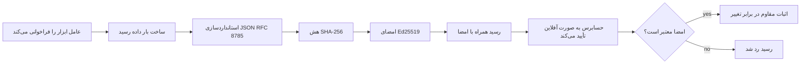
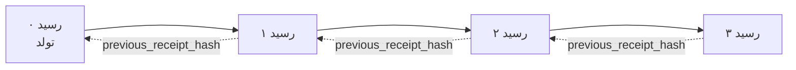

[تماشای ویدیو درس: ایمن‌سازی عامل‌های هوش مصنوعی با رسیدهای رمزنگاری‌شده](https://youtu.be/PLACEHOLDER_VIDEO_ID)

> _(ویدیو درس و تصویر بندانگشتی توسط تیم محتوای مایکروسافت پس از ادغام افزوده خواهد شد، مطابق الگوی درس ۱۴ / ۱۵.)_

# ایمن‌سازی عامل‌های هوش مصنوعی با رسیدهای رمزنگاری‌شده

## مقدمه

این درس موارد زیر را پوشش می‌دهد:

- چرا ردپای حسابرسی برای عامل‌های هوش مصنوعی برای انطباق، رفع اشکال، و اطمینان اهمیت دارد.
- رسید رمزنگاری‌شده چیست و چگونه با یک خط لاگ بدون امضا متفاوت است.
- چگونه یک رسید امضا شده برای فراخوان ابزار عامل را با پایتون ساده تولید کنیم.
- چگونه یک رسید را به صورت آفلاین بررسی کنیم و تخلف را شناسایی کنیم.
- چگونه رسیدها را به هم زنجیر کنیم به طوری که حذف یا تغییر ترتیب یکی از آنها زنجیره را بشکند.
- رسیدها چه چیزی را اثبات می‌کنند و چه چیزی را به صراحت اثبات نمی‌کنند.

## اهداف آموزشی

پس از پایان این درس، شما خواهید دانست چگونه:

- حالات خرابی که دلیل استفاده از منشأ رمزنگاری‌شده برای عملکردهای عامل است را شناسایی کنید.
- یک رسید امضا شده با Ed25519 روی یک بارگذاری JSON کاننیکال تولید کنید.
- یک رسید را به صورت مستقل تنها با استفاده از کلید عمومی امضا کننده بررسی کنید.
- تخلف را با اجرای دوباره بررسی روی رسید تغییر یافته شناسایی کنید.
- توالی ‌ای از رسیدها را با زنجیره هش بسازید و توضیح دهید چرا این زنجیره اهمیت دارد.
- مرز بین آنچه رسیدها اثبات می‌کنند (نسبت‌دهی، یکپارچگی، ترتیب) و آنچه اثبات نمی‌کنند (درستی عملکرد، درستی سیاست) را بشناسید.

## مسئله: ردپای حسابرسی عامل شما

تصور کنید یک عامل هوش مصنوعی را برای Contoso Travel مستقر کرده‌اید. این عامل درخواست‌های مشتری را می‌خواند، از API پروازها برای یافتن گزینه‌ها استفاده می‌کند و به نمایندگی مشتری صندلی رزرو می‌کند. در سه ماهه گذشته، این عامل ۵۰,۰۰۰ رزرو را پردازش کرده است.

امروز یک حسابرس می‌آید. او یک سوال ساده می‌پرسد: «به من نشان بده عامل شما چه کار کرده است.»

شما فایل‌های لاگ خود را تحویل می‌دهید. حسابرس آنها را نگاه می‌کند و سوال سخت‌تری می‌پرسد: «چطور می‌دانم این لاگ‌ها دستکاری نشده‌اند؟»

این همان مشکل ردپای حسابرسی است. اکثر استقرارهای عامل امروز به موارد زیر تکیه دارند:

- **لاگ‌های برنامه**: توسط خود عامل نوشته شده، قابل ویرایش توسط هر کسی که به سیستم فایل دسترسی دارد.
- **خدمات لاگینگ ابری**: در سطح پلتفرم، قابل تشخیص برای تغییرات غیرمجاز است اما تنها در صورتی که حسابرس به اپراتور پلتفرم اعتماد کند.
- **لاگ‌های تراکنش دیتابیس**: برای تغییرات دیتابیس مناسب‌اند اما برای فراخوان‌های دلخواه ابزارها مناسب نیستند.

هیچ کدام از اینها نمی‌تواند بدون نیاز به اعتماد حسابرس به کسی (شما، ارائه‌دهنده ابری شما، فروشنده دیتابیس شما) به سوال حسابرس پاسخ دهد. برای استفاده داخلی این اعتماد غالباً قابل قبول است. برای بارهای کاری تحت قانون‌گذاری (مالی، مراقبت‌های بهداشتی، هر چیزی که تحت قانون هوش مصنوعی اتحادیه اروپا باشد) اینگونه نیست.

رسیدهای رمزنگاری‌شده این مشکل را با مستقل کردن بررسی هر عملکرد عامل حل می‌کنند. حسابرس نیازی به اعتماد به شما ندارد؛ تنها کلید عمومی شما و خود رسید را نیاز دارد.

## رسید رمزنگاری‌شده چیست؟

رسید یک شیء JSON است که آنچه عامل انجام داده را ثبت می‌کند و با امضای دیجیتال امضا شده است.



یک رسید حداقلی به این شکل است:

```json
{
  "type": "agent.tool_call.v1",
  "agent_id": "contoso-travel-bot",
  "tool_name": "lookup_flights",
  "tool_args_hash": "sha256:a3f9c1...",
  "result_hash": "sha256:7b2e1d...",
  "policy_id": "contoso-travel-policy-v3",
  "timestamp": "2026-04-25T14:30:00Z",
  "sequence": 47,
  "previous_receipt_hash": "sha256:9d4e6a...",
  "signature": {
    "alg": "EdDSA",
    "sig": "c5af83...",
    "public_key": "8f3b2c..."
  }
}
```

سه ویژگی اصلی کار را انجام می‌دهند:

1. **امضا**. رسید توسط دروازه عامل با کلید خصوصی Ed25519 امضا می‌شود. هر کسی که کلید عمومی مربوطه را داشته باشد می‌تواند امضا را به صورت آفلاین بررسی کند. هر دستکاری در هر فیلد امضا را نامعتبر می‌کند.

2. **کدگذاری کاننیکال**. قبل از امضا، رسید با استفاده از طرح کاننیکال‌سازی JSON (JCS, RFC 8785) سریالایز می‌شود. این تضمین می‌کند که دو پیاده‌سازی که همان رسید منطقی را تولید می‌کنند، خروجی کاملاً بایتی یکسان ارائه می‌دهند. بدون کاننیکال‌سازی، سریالایزرهای مختلف JSON امضاهای متفاوتی برای همان محتوا تولید می‌کردند.

3. **زنجیره کردن هش**. فیلد `previous_receipt_hash` هر رسید را به رسید قبلی متصل می‌کند. حذف یا تغییر ترتیب یک رسید، هر رسید بعد از آن را خراب می‌کند. دستکاری حتی اگر امضاهای جداگانه گذرانده شود، در سطح زنجیره دیده می‌شود.

این سه ویژگی با هم سه تضمین ارائه می‌دهند:

- **نسبت‌دهی**: این کلید این محتوا را امضا کرده است.
- **یکپارچگی**: محتوا از زمان امضا تغییری نکرده است.
- **ترتیب**: این رسید بعد از آن رسید در زنجیره آمده است.

## تولید رسید در پایتون

برای تولید رسید نیازی به کتابخانه ویژه ندارید. ابتدایی‌های رمزنگاری به طور گسترده در دسترس‌اند و منطق چند ده خط پایتون است.

تمرین‌های عملی در `code_samples/18-signed-receipts.ipynb` روند کامل را مرحله به مرحله نشان می‌دهد. نسخه خلاصه:

```python
import json
import hashlib
import base64
from nacl import signing
from jcs import canonicalize  # JSON کاننیکال RFC 8785

def b64url_nopad(data: bytes) -> str:
    return base64.urlsafe_b64encode(data).decode("ascii").rstrip("=")

def sha256_canonical(obj) -> str:
    """SHA-256 of a Python object's JCS-canonical JSON form."""
    return f"sha256:{hashlib.sha256(canonicalize(obj)).hexdigest()}"

# تولید یا بارگذاری کلید امضا (در محیط تولید، در یک مخزن کلید ذخیره شود)
signing_key = signing.SigningKey.generate()
verify_key = signing_key.verify_key

# ساخت بار داده رسید (هنوز امضا نشده)
tool_args = {"origin": "SYD", "destination": "LAX"}
tool_result = [{"flight": "QF11", "price": 1850, "stops": 0}]

payload = {
    "type": "agent.tool_call.v1",
    "agent_id": "contoso-travel-bot",
    "tool_name": "lookup_flights",
    "tool_args_hash": sha256_canonical(tool_args),
    "result_hash": sha256_canonical(tool_result),
    "policy_id": "contoso-travel-policy-v3",
    "timestamp": "2026-04-25T14:30:00Z",
    "sequence": 0,
    "previous_receipt_hash": None,
}

# کاننیکال‌سازی، هش، امضا.
canonical_bytes = canonicalize(payload)
message_hash = hashlib.sha256(canonical_bytes).digest()
signature_bytes = signing_key.sign(message_hash).signature

# الصاق یک شی امضای ساختاریافته.
receipt = {
    **payload,
    "signature": {
        "alg": "EdDSA",
        "sig": b64url_nopad(signature_bytes),
        "public_key": b64url_nopad(bytes(verify_key)),
    },
}
```

این کل خط لوله امضا است. تمرین‌های دفترچه یادداشت هر مرحله را تشریح می‌کند.

## بررسی رسید و تشخیص دستکاری

بررسی عملیات معکوس است:

```python
import base64
import hashlib
from nacl import signing
from nacl.exceptions import BadSignatureError
from jcs import canonicalize

def b64url_decode(s: str) -> bytes:
    padding = "=" * ((4 - len(s) % 4) % 4)
    return base64.urlsafe_b64decode(s + padding)

def verify_receipt(receipt: dict) -> bool:
    # امضا یک شی ساختاریافته است: {"alg"، "sig"، "public_key"}.
    sig_obj = receipt.get("signature")
    if not sig_obj or sig_obj.get("alg") != "EdDSA":
        return False

    # بار داده‌ای را که در واقع امضا شده است بازسازی کنید (همه چیز به جز امضا).
    payload = {k: v for k, v in receipt.items() if k != "signature"}

    canonical_bytes = canonicalize(payload)
    message_hash = hashlib.sha256(canonical_bytes).digest()

    try:
        verify_key = signing.VerifyKey(b64url_decode(sig_obj["public_key"]))
        verify_key.verify(message_hash, b64url_decode(sig_obj["sig"]))
        return True
    except BadSignatureError:
        return False
```

این تابع یک رسید را می‌گیرد و اگر امضا معتبر باشد `True` و در غیر این صورت `False` برمی‌گرداند. بدون تماس شبکه، بدون وابستگی به سرویس، بدون نیاز به اعتماد به شخص ثالثی.

برای دیدن تشخیص دستکاری، دفترچه یادداشت مراحل زیر را طی می‌کند:

1. تولید یک رسید معتبر و تایید صحت آن.
2. تغییر یک بایت از فیلد `tool_args_hash`.
3. اجرای دوباره بررسی و دیدن شکست آن.

این نشان عملی است که رسیدها دستکاری‌پذیر نیستند: هر تغییر، هر چند کوچک، امضا را می‌شکند.

## زنجیره کردن رسیدها برای عامل‌های چندمرحله‌ای

یک رسید امضا شده تنها یک عمل را محافظت می‌کند. زنجیره‌ای از رسیدها دنباله‌ای از اعمال را محافظت می‌کند.



هر رسید هش رسید قبلی را ثبت می‌کند. برای حذف بی‌صدا رسید شماره ۲، یک مهاجم باید یا:

- فیلد `previous_receipt_hash` رسید ۳ را تغییر دهد (که امضای رسید ۳ را می‌شکند)، یا
- امضای جدیدی برای رسید ۳ تغییر یافته جعل کند (که نیازمند کلید خصوصی عامل است).

اگر کلید خصوصی در یک گنجینه سخت‌افزاری باشد و شما کلید عمومی را با هر رسید منتشر کنید، هیچ‌یک از این حملات بدون شناسایی ممکن نیست.

دفترچه یادداشت موارد زیر را بررسی می‌کند:

1. ساخت یک زنجیره سه رسیدی.
۲. تایید اینکه `previous_receipt_hash` هر رسید با هش واقعی رسید قبلی مطابقت دارد.
۳. دستکاری یک رسید در وسط و مشاهده شکست زنجیره دقیقاً در آن نقطه.

این روش تولید ردپایی است که حسابرس خارجی می‌تواند بدون اعتماد به شما تایید کند.

## رسیدها چه چیزی را اثبات می‌کنند (و چه چیزی را اثبات نمی‌کنند)

این مهم‌ترین بخش این درس است. رسیدها قدرتمند هستند اما قدرتشان محدود است.

**رسیدها سه چیز را اثبات می‌کنند:**

۱. **نسبت‌دهی**: یک کلید خاص یک بارگذاری خاص را امضا کرده است.
۲. **یکپارچگی**: بارگذاری از زمان امضا تغییر نکرده است.
۳. **ترتیب**: این رسید بعد از آن رسید در زنجیره هش آمده است.

**رسیدها اثبات نمی‌کنند:**

۱. **درستی**: که عملکرد عامل عملکرد درست بوده است. یک رسید می‌تواند برای پاسخ نادرست به همان وضوحی که برای پاسخ درست امضا شود.
۲. **انطباق با سیاست**: اینکه سیاست ذکر شده در `policy_id` واقعاً ارزیابی شده باشد، یا اینکه اگر بررسی می‌شد اجازه این عمل را می‌داد. رسید آنچه ادعا شده را ثبت می‌کند، نه آنچه اجرا شده.
۳. **هویت فراتر از کلید**: رسید می‌گوید «این کلید این محتوا را امضا کرده.» نمی‌گوید «این انسان این را مجاز کرده.» وصل کردن کلید به یک شخص یا سازمان نیازمند زیرساخت هویت جداگانه (دایرکتوری، رجیستری کلید عمومی و غیره) است.
۴. **درستی ورودی‌ها**: اگر عامل یک درخواست دستکاری شده دریافت کند و بر اساس آن عمل کند، رسید عمل را دقیقاً ثبت می‌کند. رسیدها بعد از اعتبارسنجی ورودی هستند، نه جایگزین آن.

این مرز به دو دلیل اهمیت دارد:

- به شما می‌گوید رسیدها برای چه چیزی مفید هستند: قابل حسابرسی و قابل تشخیص برای دستکاری بودن رفتار عامل حتی در مرزهای سازمانی.
- به شما می‌گوید چه لایه‌های اضافی هنوز نیاز دارید: اعتبارسنجی ورودی (درس ۶)، اجرای سیاست (که کمی پایین‌تر بررسی می‌شود)، و زیرساخت هویت (خارج از دامنه این درس).

یک اشتباه رایج این است که فرض کنیم «ما رسید داریم» یعنی «ما قانون‌مندیم.» اینطور نیست. رسیدها پایه هستند. قانون‌گذاری سیستمی است که روی آن می‌سازید.

## اثبات اینکه یک انسان دقیقاً این عمل را تأیید کرده است

بند ۳ بالا شایان بخش جداگانه است: رسید عمل می‌گوید «این کلید این محتوا را امضا کرده» هرگز نمی‌گوید «یک انسان این را مجاز کرده.» برای اعمال پرخطر (بازپرداخت‌ها، حذف‌ها، انتقال‌های بانکی)، چارچوب‌های حاکمیتی به طور فزاینده به همین بیان جاافتاده نیاز دارند که این درس همین پایه‌ها را به شما آموزش داده است.

دفترچه یادداشت بعدی `code_samples/human-authorization-receipts.ipynb` یک نوع رسید دوم، `human.approval.v1`، اضافه می‌کند که شکل پاکتی مشابه رسیدهای این درس دارد (یک بارگذاری تایپ شده که با Ed25519 روی SHA-256 کاننیکال آن امضا شده، با شیء `signature` خارج از بایت‌های امضا شده). یک تاییدکننده نامدار قبل از اجرا کل عمل کاننیکال و هش آن را امضا می‌کند؛ رسید عمل عامل همان هش عمل و یک `parent_approval_ref` دارد که `receipt_hash` تایید است، همان قراردادی که `previous_receipt_hash` در زنجیره بالا داشت. یک تابع `verify_chain` هر دو سند را تحت **رجیستری‌های کلید پین‌شده جداگانه** (کلیدهای تاییدکننده در مقابل کلیدهای عامل) بررسی می‌کند، بنابراین مسیر کد مشترک است اما نهادها هیچ‌گاه یکی نیستند.

خاصیتی که این می‌خرد، به دقت بیان شده: *انسان دقیقا این عمل را تایید کرده و عامل دقیقا همان عمل تایید شده را اجرا کرده است.* واکنش‌های رد دفترچه یادداشت آنچه را که این خاصیت را واقعی می‌کند نه صرفاً ادعا شده:

- مجموعه کلاسیک: دستکاری، نماینده گیج شده، بازپخش، کلیدهای جعل‌شده هر دو طرف، ورودی نامناسب؛
- **قدرت منقضی شده**: امضایی که هنوز تایید می‌شود ولی رد می‌شود چون نسخه سیاست تغییر کرده، کلید تاییدکننده از رجیستری خارج شده، یا تایید قبل از اجرا منقضی شده است؛
- **جایگزینی هش**: رسید عمل با امضای معتبر که به یک تایید واقعی اشاره دارد که مربوط به یک عمل کاننیکال *متفاوت* است.

هر خرابی با دلیلی متمایز رد می‌شود، بنابراین یک حسابرس با خواندن رد می‌تواند بگوید آیا قدرت منقضی شده یا عمل اجرا شده تغییر کرده است. قانون دفترچه یادداشت: امضای تایید به خودی خود قدرت نیست. قدرت فقط زمانی وجود دارد که هر دو رسید هنوز به همان عمل کاننیکال در زمان اجرا متصل باشند. مسیر امضای مشترک در همان پیش‌نویس اینترنتی که این درس دنبال می‌کند (`draft-farley-acta-signed-receipts`) شکل استاندارد این الگو است.

## منابع تولید

کد پایتون در این درس عمداً حداقلی است تا بتوانید هر خط را بخوانید و دقیقاً بفهمید چه اتفاقی می‌افتد. در تولید، دو گزینه دارید:

۱. **مستقیماً روی ابتدایی‌های رمزنگاری بسازید.** ۵۰ خطی که دیدید برای بسیاری از موارد کافی است. PyNaCl (Ed25519) و بسته `jcs` (JSON کاننیکال) کتابخانه‌های خوب نگهداری شده و ممیزی‌شده هستند.

۲. **از کتابخانه تولید رسید استفاده کنید.** چند پروژه متن‌باز همان الگو را با ویژگی‌های اضافی (چرخش کلید، بررسی دسته‌ای، توزیع JWK Set، ادغام با موتورهای سیاست) پیاده‌سازی می‌کنند:
   - فرمت رسید استفاده شده در این درس از پیش‌نویس اینترنتی IETF ([`draft-farley-acta-signed-receipts`](https://datatracker.ietf.org/doc/draft-farley-acta-signed-receipts/)، نسخه ۰۲) که در فرایند استانداردسازی است، استفاده می‌کند، با یک مجموعه تطابق مشترک ([agent-governance-testvectors](https://github.com/ScopeBlind/agent-governance-testvectors)) که پیاده‌سازی‌های مستقل برای خروجی بایت-یکسان آن را به صورت متقابل بررسی می‌کنند.
   - کیت حاکمیت عامل مایکروسافت رسیدها را با تصمیمات سیاست مبتنی بر Cedar ترکیب می‌کند؛ آموزش شماره ۳۳ در آن مخزن یک مثال کامل انتها به انتها است.
   - بسته‌های `protect-mcp` (npm) و `@veritasacta/verify` (npm) پیاده‌سازی مبتنی بر نود برای امضا و بررسی آفلاین رسید را ارائه می‌دهند، که برای بسته‌بندی هر سرور MCP با ردپای حسابرسی قابل تشخیص برای دستکاری است، از جمله جریان نگهداری برای امضای مشترک که در آن عملی متوقف شده رسید تایید مربوط به خلاصه عمل (backed by WebAuthn در جریان دسکتاپ) تولید می‌کند، همان الگوی رسید تایید انسانی که دفترچه بالا دارد.
   - **[nobulex](https://github.com/arian-gogani/nobulex)** SDK پایتون (`pip install nobulex`) همان الگوی امضا با Ed25519 و JCS را با ادغام‌های LangChain و CrewAI ارائه می‌دهد، شامل بردارهای تست اعتبار متقابل منتشر شده و نقشه‌برداری انطباقی که توسط [OWASP PR #2210](https://github.com/OWASP/CheatSheetSeries/pull/2210) ارائه شده است.

انتخاب بین ساختن از صفر و استفاده از کتابخانه شبیه انتخاب بین نوشتن کتابخانه JWT خودتان یا استفاده از کتابخانه تست شده است: هر دو منطقی است؛ کتابخانه وقت صرفه‌جویی می‌کند و سطح ممیزی را کاهش می‌دهد؛ رویکرد از صفر شما را وادار می‌کند هر ابتدایی را بفهمید. این درس مسیر از صفر را آموزش می‌دهد تا پایه برای هر انتخاب داشته باشید.

## آزمون دانسته‌ها

قبل از رفتن به تمرین، درک خود را آزمایش کنید.

**۱. رسید با کلید خصوصی Ed25519 عامل امضا شده است. حسابرس فقط کلید عمومی را دارد. آیا حسابرس می‌تواند رسید را به صورت آفلاین بررسی کند؟**

<details>
<summary>پاسخ</summary>

بله. بررسی Ed25519 تنها کلید عمومی و بایت‌های امضا شده را نیاز دارد. بدون تماس شبکه، بدون وابستگی به سرویس. این خاصیت، رسیدها را در محیط‌های بدون اتصال به شبکه، چندسازمانی، یا کم‌اعتماد قابل استفاده می‌کند.
</details>

**۲. یک مهاجم فیلد `policy_id` یک رسید را تغییر می‌دهد تا ادعا کند تحت سیاستی با مجوز بیشتر بوده است. امضا روی بارگذاری اصلی بوده است. در هنگام بررسی چه اتفاقی می‌افتد؟**

<details>
<summary>پاسخ</summary>


تأیید ناموفق است. امضا بر روی بایت‌های قانونی محتوای اصلی محاسبه شده بود؛ تغییر هر فیلدی باعث تغییر بایت‌های قانونی می‌شود، که هَش SHA-256 را تغییر می‌دهد و امضا را نامعتبر می‌کند. حمله‌کننده برای تولید امضای جدید و معتبر به کلید خصوصی نیاز دارد، که در اختیار ندارد.
</details>

**۳. چرا رسید شامل `tool_args_hash` و `result_hash` است به جای آرگومان‌ها و نتیجه خام؟**

<details>
<summary>پاسخ</summary>

دو دلیل وجود دارد. اولاً، ممکن است لازم باشد رسید در محیط‌هایی بایگانی یا منتقل شود که افشای محتوای خام (اطلاعات شخصی، داده‌های تجاری) مشکل‌ساز است. هش کردن باعث کوچک ماندن رسید و حفظ محرمانگی محتوا می‌شود؛ ممیز اطمینان حاصل می‌کند که هش با نسخه‌ی جداگانه‌ی ذخیره‌شده‌ی محتوای واقعی مطابقت دارد. دوم، هش‌ها اندازه ثابت دارند؛ رسیدی با هَش‌ها اندازه محدودی دارد فارغ از بزرگی ورودی‌ها و خروجی‌ها.
</details>

**۴. فیلد `previous_receipt_hash` هر رسید را به رسید قبلی متصل می‌کند. اگر حمله‌کننده بی‌صدا یکی از رسیدها را از وسط هر زنجیره حذف کند، چه چیزی نامعتبر می‌شود؟**

<details>
<summary>پاسخ</summary>

هر رسیدی که بعد از رسید حذف شده آمده است. فیلدهای `previous_receipt_hash` آنها دیگر با زنجیره واقعی مطابقت ندارند (زیرا رسید مرجع دیگر وجود ندارد یا زنجیره اکنون به پیش‌درآمد متفاوتی اشاره می‌کند). برای پنهان کردن این حذف، حمله‌کننده باید همه رسیدهای بعدی را دوباره امضا کند که نیاز به کلید خصوصی دارد.
</details>

**۵. یک رسید به درستی تأیید می‌شود. آیا این اثبات می‌کند که اقدام عامل درست، صحیح یا مطابق سیاست بوده است؟**

<details>
<summary>پاسخ</summary>

خیر. یک رسید معتبر سه چیز را اثبات می‌کند: انتساب (این کلید این محتوا را امضا کرده است)، یکپارچگی (محتوا تغییر نکرده است)، و ترتیب (این رسید بعد از آن رسید آمده است). این اثبات نمی‌کند که اقدام درست بوده یا سیاست ذکر شده در `policy_id` واقعاً ارزیابی شده یا عامل همه قوانین را رعایت کرده است. رسیدها رفتار عامل را قابل حسابرسی می‌کنند، نه لزوماً درست. این مهم‌ترین مرز این درس است.
</details>

## تمرین عملی

فایل `code_samples/18-signed-receipts.ipynb` را باز کنید و همه چهار بخش را کامل کنید:

۱. **بخش ۱**: اولین رسید خود را امضا کنید و تأییدش کنید.
۲. **بخش ۲**: با رسید دستکاری کنید و مشاهده کنید که تأیید ناموفق می‌شود.
۳. **بخش ۳**: زنجیره‌ای از سه رسید بسازید و یکپارچگی زنجیره را تأیید کنید.
۴. **بخش ۴**: الگو را برای عاملی ساخته‌شده با Microsoft Agent Framework اعمال کنید: یک فراخوان ابزار را در امضای رسید بپیچید، سپس رسید را به‌طور مستقل تأیید کنید.

**چالش توسعه ۱:** ساختار رسید را با یک فیلد اضافی دلخواه (مثلاً شناسه درخواست برای ردیابی) گسترش دهید، منطق امضای قانونی را برای آن به‌روزرسانی کنید و تأیید کنید که رسید هنوز هم به درستی توسط تأیید عبور می‌کند. سپس پس از امضا فیلد را تغییر داده و تأیید ناموفق شود. این باعث می‌شود بفهمید هر بایت از کدگذاری قانونی چگونه به امضا کمک می‌کند.

**چالش توسعه ۲:** دو رسید را با هم به صورت هش SHA-256 ترکیب کنید (بایت‌های قانونی آنها را با ترتیب تعیین شده به هم بچسبانید) و هش حاصل را به صورت فیلد جدید روی رسید سومی وارد کنید قبل از امضا. تأیید کنید هر سه رسید هنوز هم به درستی می‌چرخند. شما اکنون یک اثبات شمول یک مرحله‌ای ساخته‌اید: هرکسی که رسید سوم را دارد می‌تواند اثبات کند دو رسید اول هنگام امضا وجود داشته‌اند، بدون نیاز به افشای محتوایشان. این الگو در رسیدهای با افشاء انتخابی در مقیاس بزرگ استفاده می‌شود (تعهدات مرکِل، RFC 6962).

## نتیجه‌گیری

رسیدهای رمزنگاری‌شده به عوامل هوش مصنوعی یک رد حسابرسی می‌دهند که:

- **قابل تأیید مستقل**: هر طرفی با کلید عمومی می‌تواند تأیید کند، بدون وابستگی به سرویس.
- **ضد دستکاری**: هر تغییر امضا را نامعتبر می‌کند.
- **قابل حمل**: رسید یک فایل کوچک JSON است؛ می‌توان آن را بایگانی، ارسال و در هرجا تأیید کرد.
- **مطابقت با استانداردها**: ساخته شده بر پایه Ed25519 (RFC 8032)، JCS (RFC 8785) و SHA-256، همگی ابتدایی‌های گسترده به کار گرفته شده.

آنها جایگزینی برای اعتبارسنجی ورودی، اجرای سیاست، یا زیرساخت هویتی نیستند. بلکه پایه‌ای برای این لایه‌ها هستند. هنگام استقرار عامل‌ها در بارهای کاری تنظیم شده، جریان‌های کاری چندسازمانی یا هر محیطی که ممیزی‌کننده آتی به شما اعتماد نمی‌کند، رسیدها راهی برای درست بودن رد حسابرسی هستند.

مهم‌ترین نکته: رسیدها اثبات می‌کنند چه کسی چه چیزی را کی گفته است. آنها اثبات نمی‌کنند که گفته‌شده درست یا صحیح است. این تمایز را محکم نگه دارید. تفاوت بین یک سیستم منشاء صحیح و یک سیستم گمراه‌کننده است.

## چک‌لیست تولید

هنگام آماده شدن برای گذر از این درس به استقرار عامل‌های امضاشده در محیط واقعی:

- [ ] **کلید امضا را از لپ‌تاپ توسعه‌دهنده خارج کنید.** از Azure Key Vault، AWS KMS، یا ماژول امنیتی سخت‌افزاری استفاده کنید. کلید خصوصی که رسیدهای شما را امضا می‌کند نباید هرگز در کنترل نسخه یا به صورت متنی روی ماشین‌های برنامه زنده باشد.
- [ ] **کلید عمومی تأیید را منتشر کنید.** ممیزها برای تأیید به صورت آفلاین به آن نیاز دارند. الگوی استاندارد مجموعه JWK در یک URL شناخته شده است (RFC 7517)، مثلاً `https://your-org.example.com/.well-known/agent-keys.json`.
- [ ] **زنجیره را به صورت خارجی لنگر دهید.** به طور دوره‌ای جدیدترین هش سر زنجیره را در یک لاگ شفافیت (Sigstore Rekor، RFC 3161 مقام زمان‌سنجی، یا سیستم داخلی دیگر) ثبت کنید تا شخص بیرونی بتواند تأیید کند "این زنجیره در این زمان وجود داشت."
- [ ] **رسیدها را غیرقابل تغییر ذخیره کنید.** ذخیره بلاک الحاقی فقط (Azure Storage با سیاست غیرقابل تغییر بودن، AWS S3 Object Lock) مانع از بازنویسی تاریخ توسط فرد داخلی در لایه ذخیره‌سازی می‌شود.
- [ ] **تصمیم درباره نگهداری گرفته شود.** بسیاری از الزامات تطبیقی نیاز به نگهداری چندساله دارند. برنامه‌ریزی برای رشد رسیدها کنید (هر رسید حدود ۵۰۰ بایت است؛ عاملی که روزانه ۱۰ هزار تماس می‌دهد حدود ۱.۸ گیگابایت در سال تولید می‌کند).
- [ ] **مستندسازی چیزهایی که رسید پوشش نمی‌دهد.** رسیدها انتساب، یکپارچگی و ترتیب را اثبات می‌کنند. دفترچه راهنمای شما باید به‌وضوح فهرست کند کنترل‌های اضافی (اعتبارسنجی ورودی، اجرای سیاست، محدودیت نرخ، زیرساخت هویتی) که در کنار رسیدها در موضع حاکمیت شما قرار دارند چه هستند.

### سوالات بیشتر درباره امنیت عامل‌های هوش مصنوعی؟

به [Microsoft Foundry Discord](https://aka.ms/ai-agents/discord) بپیوندید تا با دیگر یادگیرندگان ملاقات کنید، در ساعات حضور شرکت کنید و سوالات خود درباره عامل‌های هوش مصنوعی را پاسخ بگیرید.

## فراتر از این درس

این درس امضای تک‌رسید و توالی‌های زنجیره‌ای هش‌شده را پوشش می‌دهد. همان ابتدایی‌ها در چند الگوی پیشرفته‌تر ترکیب می‌شوند که ممکن است با پیشرفت موضع حاکمیت خود با آنها مواجه شوید:

- **افشای انتخابی.** وقتی فیلدهای رسید به صورت مستقل تعهد می‌شوند (درخت مرکِل به سبک RFC 6962)، می‌توانید فیلدهای مشخصی را به ممیزهای مشخص نشان دهید و بقیه را بدون افشا ثابت کنید. این هنگامی مفید است که یک رسید باید هم حسابرسی کامل (که کاملیت می‌خواهد) را تامین کند و هم قوانین کمینه‌سازی داده مانند GDPR (که ممیز را موظف می‌کند کمترین مقدار را ببیند).
- **ابطال رسید.** اگر کلید امضا به خطر افتد، باید راهی برای علامت‌گذاری همه رسیدهای امضا شده توسط آن کلید از نقطه زمانی به بعد به عنوان غیرقابل اعتماد داشته باشید. الگوهای استاندارد: کلیدهای امضای کوتاه‌مدت همراه با فهرست ابطال منتشر شده، یا لاگ شفافیت با ورودی‌های ابطال.
- **رسیدهای امضای دوطرفه / تقسیم‌شده.** برخی پیاده‌سازی‌ها محتوای امضاشده را به دو نیمه قبل از اجرا (`authorization_*`) و بعد از اجرا (`result_*`) با امضاهای مستقل تقسیم می‌کنند، مفید وقتی تصمیم مجوز و نتیجه مشاهده شده توسط بازیگران مختلف یا در زمان‌های متفاوت تولید می‌شوند. این الگو روی فرمت رسید آموزش داده شده به صورت افزایشی ترکیب می‌شود.
- **ترکیب محموله.** یک رسید هر بایتی که در `result_hash` قرار دهید مهر و موم می‌کند. محموله‌های واقعی اغلب غنی‌تر از نتیجه فقط یک فراخوان ابزار هستند: استدلال پیشارض تصمیم (پیش‌بینی مدل، گزینه‌های بررسی شده، شواهد و کامل بودنشان، پستوریسک، زنجیره پاسخگویی، نتیجه دروازه) همه می‌توانند در محموله باشند که با یک رسید مهر و موم شود. این فرمت رسید را حداقلی نگه می‌دارد در حالی که ساختارهای محموله به تدریج در هر حوزه توسعه پیدا می‌کنند.
- **انطباق میان پیاده‌سازی‌ها.** چند پیاده‌سازی مستقل از همان فرمت رسید (پایتون، تایپ‌اسکریپت، راست، گو) بر اساس ماتریس‌های تست مشترک پشتیبانی متقابل دارند. اگر خودتان پیاده‌سازی می‌سازید، اعتبارسنجی در برابر داده‌های تست منتشر شده سازگاری را تایید می‌کند.
- **مهاجرت پساکوانتومی.** Ed25519 امروز به طور گسترده به کار رفته اما در برابر کوانتوم مقاوم نیست. فرمت رسید قابل تغییر الگوریتم است: فیلد `signature.alg` می‌تواند `ML-DSA-65` (استاندارد امضای پساکوانتومی NIST) را داشته باشد وقتی نیاز به مهاجرت است. برای یک دوره انتقال برنامه‌ریزی کنید که رسیدها دو امضایی شوند.

## منابع بیشتر

- <a href="https://datatracker.ietf.org/doc/draft-farley-acta-signed-receipts/" target="_blank">پیش‌نویس اینترنت IETF: رسیدهای تصمیم امضاشده برای کنترل دسترسی ماشین به ماشین</a>
- <a href="https://learn.microsoft.com/azure/ai-studio/responsible-use-of-ai-overview" target="_blank">مروری بر هوش مصنوعی مسئولانه (Azure AI)</a>
- <a href="https://datatracker.ietf.org/doc/html/rfc8032" target="_blank">RFC 8032: الگوریتم امضای دیجیتال منحنی ادواردز (EdDSA)</a>
- <a href="https://datatracker.ietf.org/doc/html/rfc8785" target="_blank">RFC 8785: طرح کنندگی قانونی JSON (JCS)</a>
- <a href="https://datatracker.ietf.org/doc/html/rfc6962" target="_blank">RFC 6962: شفافیت گواهی‌نامه</a> (ساختار درخت مرکِل استفاده شده توسط رسیدهای افشای انتخابی)
- <a href="https://github.com/microsoft/agent-governance-toolkit/blob/main/docs/tutorials/33-offline-verifiable-receipts.md" target="_blank">مجموعه ابزار حاکمیت عامل مایکروسافت، آموزش ۳۳: رسیدهای تصمیم قابل تأیید آفلاین</a>
- <a href="https://github.com/ScopeBlind/agent-governance-testvectors" target="_blank">بردارهای آزمایشی انطباق میان پیاده‌سازی‌ها</a> برای فرمت رسید استفاده شده در این درس (Apache-2.0)
- <a href="https://pynacl.readthedocs.io/" target="_blank">مستندات PyNaCl</a> (Ed25519 در پایتون)

## درس قبلی

[ساخت عامل‌های محلی هوش مصنوعی](../17-creating-local-ai-agents/README.md)

---

<!-- CO-OP TRANSLATOR DISCLAIMER START -->
**سلب مسئولیت**:
این سند با استفاده از سرویس ترجمه هوش مصنوعی [Co-op Translator](https://github.com/Azure/co-op-translator) ترجمه شده است. در حالی که ما در تلاش برای دقت هستیم، لطفاً توجه داشته باشید که ترجمه‌های خودکار ممکن است شامل خطاها یا نادرستی‌هایی باشند. سند اصلی به زبان مادری خود باید به عنوان منبع معتبر در نظر گرفته شود. برای اطلاعات حیاتی، ترجمه حرفه‌ای انسانی توصیه می‌شود. ما در قبال هرگونه سوء تفاهم یا برداشت نادرست ناشی از استفاده از این ترجمه مسئولیتی نداریم.
<!-- CO-OP TRANSLATOR DISCLAIMER END -->