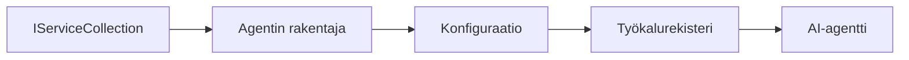

# 🎨 Agenttipohjaiset suunnittelumallit Azure OpenAI:n (Responses API) kanssa (.NET)

## 📋 Oppimistavoitteet

Tämä esimerkki havainnollistaa yritystason suunnittelumalleja älykkäiden agenttien rakentamiseen Microsoft Agent Frameworkin avulla .NET:ssä Azure OpenAI:n (Responses API) integroinnin kanssa. Opit ammattimaiset mallit ja arkkitehtoniset lähestymistavat, jotka tekevät agenteista tuotantovalmiita, ylläpidettäviä ja skaalautuvia.

### Yrityksen suunnittelumallit

- 🏭 **Factory Pattern**: Standardoitu agenttien luonti riippuvuuksien injektiolla
- 🔧 **Builder Pattern**: Sujuva agenttien konfigurointi ja asetusten määrittely
- 🧵 **Thread-Safe Patterns**: Samanaikainen keskustelujen hallinta
- 📋 **Repository Pattern**: Järjestelmällinen työkalujen ja kykyjen hallinta

## 🎯 .NET-spesifit arkkitehtuuriset hyödyt

### Yritystason ominaisuudet

- **Vahva tyyppimääritys**: Käännösaikainen validointi ja IntelliSense-tuki
- **Riippuvuuksien injektio**: Sisäänrakennettu DI-kontaineri-integraatio
- **Konfiguraation hallinta**: IConfiguration ja Options-mallit
- **Async/Await**: Ensiluokkainen asynkroninen ohjelmointi

### Tuotantovalmiit mallit

- **Lokikirjausintegraatio**: ILogger ja strukturoitu lokikirjaus
- **Terveystarkastukset**: Sisäänrakennettu valvonta ja diagnostiikka
- **Konfiguraation validointi**: Vahva tyyppimääritys ja data-anotoinnit
- **Virheenkäsittely**: Rakenteellinen poikkeusten hallinta

## 🔧 Tekninen arkkitehtuuri

### Keskeiset .NET-komponentit

- **Microsoft.Extensions.AI**: Yhtenäistetyt tekoälypalvelujen abstraktiot
- **Microsoft.Agents.AI**: Yritystason agenttien orkestrointikehys
- **Azure OpenAI (Responses API)**: Korkean suorituskyvyn API-asiakasmallit
- **Konfiguraatiojärjestelmä**: appsettings.json ja ympäristön integrointi

### Suunnittelumallin toteutus



## 🏗️ Näytetyt yrityksen mallit

### 1. **Luomismallit**

- **Agenttitehdas**: Keskitetty agenttien luonti johdonmukaisella konfiguraatiolla
- **Builder-malli**: Sujuva API monimutkaiseen agenttikonfiguraatioon
- **Singleton-malli**: Jaetut resurssit ja konfiguraation hallinta
- **Riippuvuuksien injektio**: Löysä kytkentä ja testattavuus

### 2. **Käyttäytymismallit**

- **Strategia-malli**: Vaihdettavat työkalujen suoritustrategiat
- **Komentomalli**: Kapseloidut agenttitoiminnot kumoamis- ja uudelleentoimintamahdollisuudella
- **Observer-malli**: Tapahtumapohjainen agentin elinkaaren hallinta
- **Template Method**: Standardoidut agentin suoritustyönkulut

### 3. **Rakenne- eli struktuurimallit**

- **Adapter-malli**: Azure OpenAI (Responses API) -integraatiokerros
- **Koristelija-malli**: Agentin kyvykkyyksien laajennus
- **Sivellin-malli**: Yksinkertaistetut agenttien vuorovaikutusrajapinnat
- **Proxy-malli**: Laiska lataus ja välimuisti suorituskyvyn parantamiseksi

## 📚 .NET Suunnitteluperiaatteet

### SOLID-periaatteet

- **Single Responsibility**: Jokaisella komponentilla on yksi selkeä tehtävä
- **Open/Closed**: Laajennettavissa ilman muokkausta
- **Liskov Substitution**: Rajapintaan perustuvat työkalujen toteutukset
- **Interface Segregation**: Tarkoituksenmukaiset, yhtenäiset rajapinnat
- **Dependency Inversion**: Riippuvuus abstraktioista, ei konkreettisista

### Puhtaan arkkitehtuurin malli

- **Domain Layer**: Keskeiset agentti- ja työkalun abstraktiot
- **Application Layer**: Agentin orkestrointi ja työnkulut
- **Infrastructure Layer**: Azure OpenAI (Responses API) -integraatio ja ulkoiset palvelut
- **Presentation Layer**: Käyttäjän vuorovaikutus ja vastausten muotoilu

## 🔒 Yritystason näkökohdat

### Turvallisuus

- **Tunnistetietojen hallinta**: Turvallinen API-avainten käsittely IConfigurationin avulla
- **Syötteen validointi**: Vahva tyyppimääritys ja data-anotointien tarkistus
- **Tulosten puhdistus**: Turvallinen vastausten käsittely ja suodatus
- **Auditointilokitus**: Kattava toimintojen seuranta

### Suorituskyky

- **Asynkroniset mallit**: Ei-estävät I/O-toiminnot
- **Yhteyspoolaus**: Tehokas HTTP-asiakashallinta
- **Välimuisti**: Vastausten välimuisti suorituskyvyn parantamiseksi
- **Resurssien hallinta**: Oikeaoppinen vapautus ja siivousmallit

### Skaalautuvuus

- **Thread-safety**: Samanaikainen agenttien suorittaminen
- **Resurssipoolaus**: Tehokas resurssien hyödyntäminen
- **Kuormanhallinta**: Nopeusrajoitus ja backpressuren käsittely
- **Valvonta**: Suorituskykymittarit ja terveystarkastukset

## 🚀 Tuotantoon käyttöönotto

- **Konfiguraation hallinta**: Ympäristökohtaiset asetukset
- **Lokitusstrategia**: Strukturoitu lokitus korrelaatio-ID:illä
- **Virheenkäsittely**: Globaalit poikkeusten käsittelyt oikealla palautuksella
- **Valvonta**: Sovelluksen näkymät ja suorituskykymittarit
- **Testaus**: Yksikkötestit, integraatiotestit ja kuormitustestausmallit

Valmis rakentamaan yritystason älykkäitä agenteja .NETillä? Rakennetaan jotain kestävää! 🏢✨

## 🚀 Aloittaminen

### Esivaatimukset

- [.NET 10 SDK](https://dotnet.microsoft.com/download/dotnet/10.0) tai uudempi
- [Azure-tilaus](https://azure.microsoft.com/free/), jossa on Azure OpenAI -resurssi ja mallin käyttöönotto
- [Azure CLI](https://learn.microsoft.com/cli/azure/install-azure-cli) — kirjaudu sisään `az login`-komennolla

### Vaaditut ympäristömuuttujat

```bash
# zsh/bash
export AZURE_OPENAI_ENDPOINT=https://<your-resource>.openai.azure.com
export AZURE_OPENAI_DEPLOYMENT=gpt-5-mini
# Kirjaudu sitten sisään, jotta AzureCliCredential voi saada tokenin
az login
```

```powershell
# PowerShell
$env:AZURE_OPENAI_ENDPOINT = "https://<your-resource>.openai.azure.com"
$env:AZURE_OPENAI_DEPLOYMENT = "gpt-5-mini"
# Kirjaudu sitten sisään, jotta AzureCliCredential voi saada tunnuksen
az login
```

### Esimerkkikoodi

Koodiesimerkin suorittamiseksi,

```bash
# zsh/bash
chmod +x ./03-dotnet-agent-framework.cs
./03-dotnet-agent-framework.cs
```

Tai käyttäen dotnet CLI:tä:

```bash
dotnet run ./03-dotnet-agent-framework.cs
```

Katso täydellinen koodi tiedostosta [`03-dotnet-agent-framework.cs`](../../../../03-agentic-design-patterns/code_samples/03-dotnet-agent-framework.cs).

```csharp
#!/usr/bin/dotnet run

#:package Microsoft.Extensions.AI@10.*
#:package Microsoft.Agents.AI.OpenAI@1.*-*
#:package Azure.AI.OpenAI@2.1.0
#:package Azure.Identity@1.13.1

using System.ComponentModel;

using Microsoft.Agents.AI;
using Microsoft.Extensions.AI;

using Azure.AI.OpenAI;
using Azure.Identity;

// Tool Function: Random Destination Generator
// This static method will be available to the agent as a callable tool
// The [Description] attribute helps the AI understand when to use this function
// This demonstrates how to create custom tools for AI agents
[Description("Provides a random vacation destination.")]
static string GetRandomDestination()
{
    // List of popular vacation destinations around the world
    // The agent will randomly select from these options
    var destinations = new List<string>
    {
        "Paris, France",
        "Tokyo, Japan",
        "New York City, USA",
        "Sydney, Australia",
        "Rome, Italy",
        "Barcelona, Spain",
        "Cape Town, South Africa",
        "Rio de Janeiro, Brazil",
        "Bangkok, Thailand",
        "Vancouver, Canada"
    };

    // Generate random index and return selected destination
    // Uses System.Random for simple random selection
    var random = new Random();
    int index = random.Next(destinations.Count);
    return destinations[index];
}

// Azure OpenAI with the Responses API (stable v1 endpoint). Sign in with `az login`.
var azureEndpoint = Environment.GetEnvironmentVariable("AZURE_OPENAI_ENDPOINT")
    ?? throw new InvalidOperationException("AZURE_OPENAI_ENDPOINT is not set.");
var deployment = Environment.GetEnvironmentVariable("AZURE_OPENAI_DEPLOYMENT") ?? "gpt-5-mini";

var azureClient = new AzureOpenAIClient(new Uri(azureEndpoint), new AzureCliCredential());

// Define Agent Identity and Comprehensive Instructions
// Agent name for identification and logging purposes
var AGENT_NAME = "TravelAgent";

// Detailed instructions that define the agent's personality, capabilities, and behavior
// This system prompt shapes how the agent responds and interacts with users
var AGENT_INSTRUCTIONS = """
You are a helpful AI Agent that can help plan vacations for customers.

Important: When users specify a destination, always plan for that location. Only suggest random destinations when the user hasn't specified a preference.

When the conversation begins, introduce yourself with this message:
"Hello! I'm your TravelAgent assistant. I can help plan vacations and suggest interesting destinations for you. Here are some things you can ask me:
1. Plan a day trip to a specific location
2. Suggest a random vacation destination
3. Find destinations with specific features (beaches, mountains, historical sites, etc.)
4. Plan an alternative trip if you don't like my first suggestion

What kind of trip would you like me to help you plan today?"

Always prioritize user preferences. If they mention a specific destination like "Bali" or "Paris," focus your planning on that location rather than suggesting alternatives.
""";

// Create AI Agent with Advanced Travel Planning Capabilities
// Get the Responses client for the deployment and create the AI agent
// Configure agent with name, detailed instructions, and available tools
// This demonstrates the .NET agent creation pattern with full configuration
AIAgent agent = azureClient
    .GetChatClient(deployment)
    .AsAIAgent(
        name: AGENT_NAME,
        instructions: AGENT_INSTRUCTIONS,
        tools: [AIFunctionFactory.Create(GetRandomDestination)]
    );

// Create New Conversation Session for Context Management
// Initialize a new conversation session to maintain context across multiple interactions
// Sessions enable the agent to remember previous exchanges and maintain conversational state
// This is essential for multi-turn conversations and contextual understanding
var session = await agent.CreateSessionAsync();

// Execute Agent: First Travel Planning Request
// Run the agent with an initial request that will likely trigger the random destination tool
// The agent will analyze the request, use the GetRandomDestination tool, and create an itinerary
// Using the session parameter maintains conversation context for subsequent interactions
await foreach (var update in agent.RunStreamingAsync("Plan me a day trip", session))
{
    await Task.Delay(10);
    Console.Write(update);
}

Console.WriteLine();

// Execute Agent: Follow-up Request with Context Awareness
// Demonstrate contextual conversation by referencing the previous response
// The agent remembers the previous destination suggestion and will provide an alternative
// This showcases the power of conversation sessions and contextual understanding in .NET agents
await foreach (var update in agent.RunStreamingAsync("I don't like that destination. Plan me another vacation.", session))
{
    await Task.Delay(10);
    Console.Write(update);
}
```

---

<!-- CO-OP TRANSLATOR DISCLAIMER START -->
**Vastuuvapauslauseke**:
Tämä asiakirja on käännetty käyttämällä tekoälypohjaista käännöspalvelua [Co-op Translator](https://github.com/Azure/co-op-translator). Vaikka pyrimme tarkkuuteen, otathan huomioon, että automaattiset käännökset saattavat sisältää virheitä tai epätarkkuuksia. Alkuperäinen asiakirja sen alkuperäiskielellä on virallinen lähde. Tärkeissä asioissa suositellaan ammattimaista ihmiskäännöstä. Emme ole vastuussa tämän käännöksen käytöstä aiheutuvista väärinymmärryksistä tai tulkinnoista.
<!-- CO-OP TRANSLATOR DISCLAIMER END -->