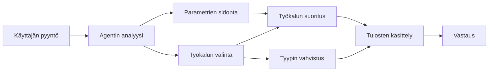

# 🛠️ Edistynyt työkalujen käyttö Azure OpenAI:n (Responses API) kanssa (.NET)

## 📋 Oppimistavoitteet

Tämä muistikirja esittelee yritystason työkalujen integrointimalleja Microsoft Agent Frameworkin avulla .NET:ssä Azure OpenAI:n (Responses API) kanssa. Opit rakentamaan kehittyneitä agenteja, joilla on useita erikoistuneita työkaluja, hyödyntäen C#:n vahvaa tyyppitarkastusta ja .NET:n yritysominaisuuksia.

### Edistyneet työkalukyvyt, jotka hallitset

- 🔧 **Monityökalurakenne**: Rakentamalla agenteja, joilla on useita erikoistuneita kykyjä
- 🎯 **Tyypitetty työkalujen suoritus**: Hyödyntämällä C#:n käännösaikaisen tarkistuksen vahvuuksia
- 📊 **Yritystason työkalumallit**: Tuotantovalmiiden työkalujen suunnittelu ja virheenkäsittely
- 🔗 **Työkalujen koostaminen**: Työkalujen yhdistäminen monimutkaisiin liiketoimintatyönkulkuihin

## 🎯 .NET-työkalurakenteen hyödyt

### Yritystason työkalujen ominaisuudet

- **Käännösaikainen validointi**: Vahva tyyppitarkistus takaa työkalun parametrien oikeellisuuden
- **Riippuvuuksien injektointi**: IoC-konttori integrointi työkalujen hallintaa varten
- **Async/Await-mallit**: Ei-estävä työkalujen suoritus oikean resurssien hallinnan kanssa
- **Rakenneellinen lokitus**: Sisäänrakennettu lokitus työkalujen suorituksen valvontaan

### Tuotantovalmiit mallit

- **Poikkeusten käsittely**: Laaja virheenkäsittely tyypitettyjen poikkeusten avulla
- **Resurssien hallinta**: Oikeat resurssien vapauttamisen mallit ja muistin hallinta
- **Suorituskyvyn seuranta**: Sisäänrakennetut mittarit ja suorituskykylaskurit
- **Konfiguraation hallinta**: Tyypitetty konfiguraation validointi

## 🔧 Tekninen arkkitehtuuri

### Keskeiset .NET-työkalukomponentit

- **Microsoft.Extensions.AI**: Yhtenäinen työkalujen abstraktiokerros
- **Microsoft.Agents.AI**: Yritystason työkalujen orkestrointi
- **Azure OpenAI (Responses API)**: Suorituskykyinen API-asiakas yhteyshallinnalla

### Työkalujen suoritusputki



## 🛠️ Työkaluluokat ja mallit

### 1. **Datan käsittelytyökalut**

- **Syötteen validointi**: Vahva tyyppitarkistus ja dataan liittyvät annotaatiot
- **Muunnostoiminnot**: Tyypiturvallinen datan muuntaminen ja muotoilu
- **Liiketoimintalogiikka**: Toimialakohtaiset laskenta- ja analyysityökalut
- **Tulosteen muotoilu**: Rakenteellinen vastausten luominen

### 2. **Integraatiotyökalut**

- **API-liittimet**: REST-tyyppinen palveluintegraatio HttpClientin kanssa
- **Tietokantatyökalut**: Entity Framework -integraatio datan käsittelyyn
- **Tiedostotoiminnot**: Turvalliset tiedostojärjestelmän toiminnot validoinnilla
- **Ulkoiset palvelut**: Kolmannen osapuolen palveluintegraatiomallit

### 3. **Apukäyttöiset työkalut**

- **Tekstin käsittely**: Merkkijonojen muokkaus- ja muotoilutyökalut
- **Päiväys/Aika-toiminnot**: Kulttuuritietoiset päiväys- ja aika-laskelmat
- **Matemaattiset työkalut**: Tarkkuuslaskelmat ja tilastolliset toiminnot
- **Validointityökalut**: Liiketoimintasääntöjen validointi ja datan varmennus

Valmiina rakentamaan yritystason agenteja, joissa on tehokkaat, tyypitetyt työkalut .NET:ssä? Rakennetaan ammattilaistasoisia ratkaisuja! 🏢⚡

## 🚀 Aloittaminen

### Vaatimukset

- [.NET 10 SDK](https://dotnet.microsoft.com/download/dotnet/10.0) tai uudempi
- [Azure-tilaus](https://azure.microsoft.com/free/), jossa Azure OpenAI -resurssi ja mallin käyttöönotto
- [Azure CLI](https://learn.microsoft.com/cli/azure/install-azure-cli) — kirjaudu sisään komennolla `az login`

### Vaaditut ympäristömuuttujat

```bash
# zsh/bash
export AZURE_OPENAI_ENDPOINT=https://<your-resource>.openai.azure.com
export AZURE_OPENAI_DEPLOYMENT=gpt-4.1-mini
# Kirjaudu sitten sisään, jotta AzureCliCredential voi hankkia tunnuksen
az login
```

```powershell
# PowerShell
$env:AZURE_OPENAI_ENDPOINT = "https://<your-resource>.openai.azure.com"
$env:AZURE_OPENAI_DEPLOYMENT = "gpt-4.1-mini"
# Kirjaudu sitten sisään, jotta AzureCliCredential voi saada tunnisteen
az login
```

### Esimerkkikoodi

Koodiesimerkin suorittamiseksi,

```bash
# zsh/bash
chmod +x ./04-dotnet-agent-framework.cs
./04-dotnet-agent-framework.cs
```

Tai dotnet CLI:llä:

```bash
dotnet run ./04-dotnet-agent-framework.cs
```

Katso täydellinen koodi tiedostosta [`04-dotnet-agent-framework.cs`](../../../../04-tool-use/code_samples/04-dotnet-agent-framework.cs).

```csharp
#!/usr/bin/dotnet run

#:package Microsoft.Extensions.AI@10.*
#:package Microsoft.Agents.AI.OpenAI@1.*-*
#:package Azure.AI.OpenAI@2.1.0
#:package Azure.Identity@1.13.1

using System.ComponentModel;

using Microsoft.Agents.AI;
using Microsoft.Extensions.AI;

using Azure.AI.OpenAI;
using Azure.Identity;

// Tool Function: Random Destination Generator
// This static method will be available to the agent as a callable tool
// The [Description] attribute helps the AI understand when to use this function
// This demonstrates how to create custom tools for AI agents
[Description("Provides a random vacation destination.")]
static string GetRandomDestination()
{
    // List of popular vacation destinations around the world
    // The agent will randomly select from these options
    var destinations = new List<string>
    {
        "Paris, France",
        "Tokyo, Japan",
        "New York City, USA",
        "Sydney, Australia",
        "Rome, Italy",
        "Barcelona, Spain",
        "Cape Town, South Africa",
        "Rio de Janeiro, Brazil",
        "Bangkok, Thailand",
        "Vancouver, Canada"
    };

    // Generate random index and return selected destination
    // Uses System.Random for simple random selection
    var random = new Random();
    int index = random.Next(destinations.Count);
    return destinations[index];
}

// Azure OpenAI with the Responses API (stable v1 endpoint). Sign in with `az login`.
var azureEndpoint = Environment.GetEnvironmentVariable("AZURE_OPENAI_ENDPOINT")
    ?? throw new InvalidOperationException("AZURE_OPENAI_ENDPOINT is not set.");
var deployment = Environment.GetEnvironmentVariable("AZURE_OPENAI_DEPLOYMENT") ?? "gpt-4.1-mini";

var azureClient = new AzureOpenAIClient(new Uri(azureEndpoint), new AzureCliCredential());

// Define Agent Identity and Comprehensive Instructions
// Agent name for identification and logging purposes
var AGENT_NAME = "TravelAgent";

// Detailed instructions that define the agent's personality, capabilities, and behavior
// This system prompt shapes how the agent responds and interacts with users
var AGENT_INSTRUCTIONS = """
You are a helpful AI Agent that can help plan vacations for customers.

Important: When users specify a destination, always plan for that location. Only suggest random destinations when the user hasn't specified a preference.

When the conversation begins, introduce yourself with this message:
"Hello! I'm your TravelAgent assistant. I can help plan vacations and suggest interesting destinations for you. Here are some things you can ask me:
1. Plan a day trip to a specific location
2. Suggest a random vacation destination
3. Find destinations with specific features (beaches, mountains, historical sites, etc.)
4. Plan an alternative trip if you don't like my first suggestion

What kind of trip would you like me to help you plan today?"

Always prioritize user preferences. If they mention a specific destination like "Bali" or "Paris," focus your planning on that location rather than suggesting alternatives.
""";

// Create AI Agent with Advanced Travel Planning Capabilities
// Get the Responses client for the deployment and create the AI agent
// Configure agent with name, detailed instructions, and available tools
// This demonstrates the .NET agent creation pattern with full configuration
AIAgent agent = azureClient
    .GetChatClient(deployment)
    .AsAIAgent(
        name: AGENT_NAME,
        instructions: AGENT_INSTRUCTIONS,
        tools: [AIFunctionFactory.Create(GetRandomDestination)]
    );

// Create New Conversation Session for Context Management
// Initialize a new conversation session to maintain context across multiple interactions
// Sessions enable the agent to remember previous exchanges and maintain conversational state
// This is essential for multi-turn conversations and contextual understanding
await using var session = await agent.CreateSessionAsync();

// Execute Agent: First Travel Planning Request
// Run the agent with an initial request that will likely trigger the random destination tool
// The agent will analyze the request, use the GetRandomDestination tool, and create an itinerary
// Using the session parameter maintains conversation context for subsequent interactions
await foreach (var update in agent.RunStreamingAsync("Plan me a day trip", session))
{
    await Task.Delay(10);
    Console.Write(update);
}

Console.WriteLine();

// Execute Agent: Follow-up Request with Context Awareness
// Demonstrate contextual conversation by referencing the previous response
// The agent remembers the previous destination suggestion and will provide an alternative
// This showcases the power of conversation sessions and contextual understanding in .NET agents
await foreach (var update in agent.RunStreamingAsync("I don't like that destination. Plan me another vacation.", session))
{
    await Task.Delay(10);
    Console.Write(update);
}
```

---

<!-- CO-OP TRANSLATOR DISCLAIMER START -->
**Vastuuvapauslauseke**:
Tämä asiakirja on käännetty käyttämällä tekoälypohjaista käännöspalvelua [Co-op Translator](https://github.com/Azure/co-op-translator). Vaikka pyrimme tarkkuuteen, otathan huomioon, että automaattiset käännökset saattavat sisältää virheitä tai epätarkkuuksia. Alkuperäinen asiakirja sen alkuperäiskielellä on virallinen lähde. Tärkeissä asioissa suositellaan ammattimaista ihmiskäännöstä. Emme ole vastuussa tämän käännöksen käytöstä aiheutuvista väärinymmärryksistä tai tulkinnoista.
<!-- CO-OP TRANSLATOR DISCLAIMER END -->