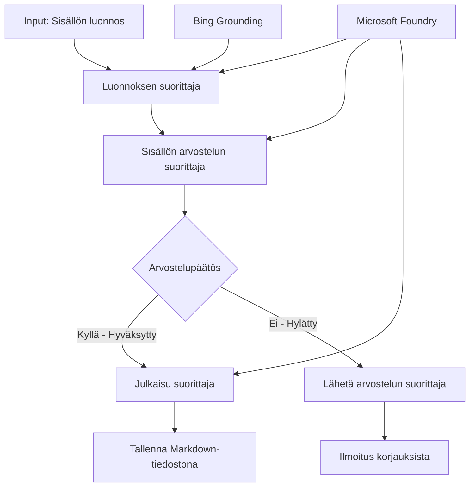

# 🔀 Ehdolliset agenttiprosessit Microsoft Foundryn (.NET) kanssa

## 📋 Älykäs päätöksentekoon perustuva työnkulkuopas

Tämä muistikirja demonstroi **ehdollisia työnkulkujen kuvioita** Microsoft Foundryn ja Microsoft Agent Frameworkin .NET-versiolla. Opit rakentamaan monimutkaisia, päätöksentekoon perustuvia työnkulkuja, jotka ohjaavat älykkäästi käsittelyä AI-analyysin, liiketoimintasääntöjen ja dynaamisten ehtojen perusteella yritystason automaatiota varten.

## 🎯 Oppimistavoitteet

### 🧠 **Älykäs päätösarkkitehtuuri**
- **Ehdollisen logiikan toteutus**: Rakennetaan monimutkaisia päätöspuita useilla haaroituskohdilla
- **AI-vetoiset reititykset**: Käytä Microsoft Foundryn malleja älykkäisiin reitityspäätöksiin
- **Dynaaminen työnkulun mukautus**: Muokkaa työnkulun käyttäytymistä suoritusaikaisen analyysin ja ehtojen mukaan
- **Yrityssääntöjen integraatio**: Sisällytä liiketoimintalogiikka ja vaatimustenmukaisuus työnkulkuihin

### 🔀 **Edistyneet ehdolliset mallit**
- **Monikriteerinen päätöksenteko**: Arvioi useita tekijöitä reitityspäätöksissä
- **Kontekstia huomioiva käsittely**: Tee päätöksiä kerätyn työnkulun kontekstin ja historian perusteella
- **Mukautuva työnkulun muokkaus**: Säädä käsittelypolkuja dynaamisesti reaaliaikaisten ehtojen perusteella
- **Sääntökoneen integraatio**: Toteuta kehittyneet liiketoimintasääntömoottorit työnkuluissa

### 🏢 **Yritysten ehdolliset sovellukset**
- **Dokumenttien luokittelu ja reititys**: Automaattinen dokumenttien luokittelu ja reititys sopiviin työnkulkuihin
- **Asiakaspalvelun triage**: Älykäs asiakaskyselyjen reititys erikoistuneille käsittelytiimeille
- **Vaatimustenmukaisuus ja riskikäsittely**: Sovella eri validointi- ja tarkastusprosesseja riskinarvioinnin perusteella
- **Laatutarkastusprosessi**: Reititä sisältö asianmukaisten tarkastusprosessien läpi laatumittareiden perusteella

## ⚙️ Esivaatimukset ja asennus

### 📦 **Vaaditut NuGet-paketit**

Kehittyneet paketit ehdolliseen työnkulkukäsittelyyn:

```xml
<!-- Core AI Framework -->
<PackageReference Include="Microsoft.Extensions.AI" Version="9.9.0" />

<!-- Azure AI Agents with Persistent State -->
<PackageReference Include="Azure.AI.Agents.Persistent" Version="1.2.0-beta.5" />

<!-- Azure Identity and Utilities -->
<PackageReference Include="Azure.Identity" Version="1.15.0" />
<PackageReference Include="System.Linq.Async" Version="6.0.3" />
<PackageReference Include="DotNetEnv" Version="3.1.1" />

<!-- Local Workflow Framework References -->
<!-- Microsoft.Agents.Workflows.dll - Advanced workflow orchestration -->
<!-- Microsoft.Agents.AI.AzureAI.dll - Microsoft Foundry integration -->
<!-- Microsoft.Agents.AI.dll - Core agent abstractions -->
```

### 🔑 **Microsoft Foundry -konfiguraatio**

**Vaaditut Azure-resurssit:**
- Microsoft Foundryn työtila, jossa on ehdollisia käsittelymalleja
- Azure-tilaus, jossa sopivat laskentaresurssit ja käyttöoikeudet
- Käytössä olevat AI-mallit päätöksentekoa ja sisällön analyysiä varten
- (Valinnainen) Bing Search API -yhteys pohjustusominaisuuksia varten

**Ympäristökonfiguraatio (.env-tiedosto):**
```env
# Microsoft Foundry Configuration
AZURE_AI_PROJECT_ENDPOINT=https://your-project.cognitiveservices.azure.com/
BING_CONNECTION_ID=your-bing-connection-id
```

**Autentikointiasetukset:**
```csharp
// Azure CLI or Managed Identity authentication
using Azure.Identity;
var credential = new AzureCliCredential();

// Load environment configuration
DotNetEnv.Env.Load("../../../.env");
```

### 🏗️ **Ehdollisen työnkulun arkkitehtuuri**



**Keskeiset komponentit:**
- **Draft Executor**: AI-agentti, joka luo alustavia luonnoksia rungon pohjalta
- **Content Review Executor**: AI-agentti, joka arvioi luonnoksen laatua ja vaatimustenmukaisuutta
- **Ehdollinen reititys**: Päätöslogiikka, joka reitittää arviointitulosten perusteella
- **Julkaisun/tarkastuksen polut**: Eri käsittelypolut hyväksytyille ja hylätyille sisällöille
- **Tilanhallinta**: Ylläpitää sisällön ja arvioinnin kontekstia työnkulun ajan

## 🎨 **Ehdollisen työnkulun suunnittelumallit**

### 📋 **Sisällöntuotanto laatukriittisin porttien kautta**
```
Outline → Draft Creation → Quality Review → {Approve: Publish | Reject: Revise}
```

### 🎯 **Riskiperusteinen dokumenttien käsittely**
```
Document → Risk Assessment → {Low: Standard | High: Enhanced Review}
```

### 🔍 **Älykäs asiakaspalvelun reititys**
```
Customer Query → Analysis → {Simple: FAQ Bot | Complex: Human Agent}
```

### 💼 **Vaatimustenmukaisuuteen perustuvat työnkulut**
```
Content → Compliance Check → {Pass: Publish | Fail: Legal Review}
```

## 🏢 **Yritysten ehdolliset hyödyt**

### 🎯 **Älykäs automaatio**
- **Älykäs päätöksenteko**: AI-vetoiset reitityspäätökset sisällön analyysin ja kontekstin perusteella
- **Mukautuva käsittely**: Työnkulut, jotka automaattisesti sopeutuvat muuttuviin ehtoihin
- **Liiketoimintasääntöjen noudattaminen**: Monimutkaisen liiketoimintalogiikan ja politiikkojen automaattinen soveltaminen
- **Kontekstia huomioiva reititys**: Päätökset perustuvat koko työnkulun historiaan ja kerättyyn kontekstiin

### 📈 **Toiminnallinen huippuunsaattaminen**
- **Optimoitu resurssien kohdistus**: Reititä työ sopivimmille asiantuntijoille ja prosesseille
- **Vähentynyt manuaalinen puuttuminen**: Automaattinen päätöksenteko minimoi ihmisen tekemän reitityksen tarpeen
- **Nopeammat ratkaisuajat**: Suora reititys oikeaan asiantuntemukseen ja käsittelykykyihin
- **Johdonmukainen soveltaminen**: Sääntöjen ja päätöskriteerien yhtenäinen soveltaminen

### 🛡️ **Riskienhallinta ja vaatimustenmukaisuus**
- **Automaattinen riskinarviointi**: AI:lla toteutettu sisällön ja tilanteen riskitasojen arviointi
- **Vaatimustenmukaisuuden valvonta**: Automaattinen reititys pakollisten sääntelyprosessien läpi
- **Turvaprotokollien soveltaminen**: Parannetut turvamääräykset riskinarviointien perusteella
- **Auditointilokien ylläpito**: Kattava dokumentaatio reitityspäätöksistä ja perusteluista

### 📊 **Analytiikka ja jatkuva parantaminen**
- **Päätösanalytiikka**: Seuraa reitityspäätösten tehokkuutta ja tarkkuutta
- **Kuvioiden tunnistus**: Tunnista trendejä ja kuvioita reitityspäätöksissä ajan myötä
- **Suorituskyvyn optimointi**: Päätöskriteerien ja reititystehokkuuden jatkuva parantaminen
- **Liiketoimintatieto**: Näkemyksiä sisällön ominaisuuksista ja käsittelyvaatimuksista

### 🔧 **Tekninen huippuosaaminen**
- **Pysyvä tilanhallinta**: Ylläpitää monimutkaista tilaa työnkulun suorituksen ajan
- **Skaalautuva arkkitehtuuri**: Käsittele suuren volyymin ehdolliset käsittelyvaatimukset
- **Integraatiomahdollisuudet**: Saumaton integrointi olemassa oleviin liiketoimintajärjestelmiin ja prosesseihin
- **Valvonta ja havaittavuus**: Kattava seuranta työnkulun suorituskyvystä ja päätöksistä

Rakennetaan älykkäitä, päätöksentekoon perustuvia yritystyönkulkuja .NET:llä! 🚀

## 💻 Koodin suorittaminen

Täydellinen toteutus löytyy tiedostosta `04.dotnet-agent-framework-workflow-aifoundry-condition.cs`. Tämä demonstroi **sisällöntuotantotyönkulkua laatukriteereillä**:

### 🏗️ **Työnkulun arkkitehtuuri**

```
Content Outline → Draft Creation → Quality Review → Conditional Routing:
                                                      ├─ Approved (>200 words) → Publish
                                                      └─ Rejected (<200 words) → Review Notification
```

**Agentit työnkulussa:**
1. **Evangelist Agent**: Luodaan opasteluun luonnoksia rungon perusteella Bing-pohjustuksella
2. **Content Reviewer Agent**: Arvioi luonnoksen laatua (sanamäärä, täydellisyys)
3. **Publisher Agent**: Tallentaa hyväksytyt sisällöt aikaleimattuina Markdown-tiedostoina

**Mukautetut suorittajat:**
1. **DraftExecutor**: Orkestroi luonnoksen luomisen
2. **ContentReviewExecutor**: Suorittaa laatuarvioinnin
3. **PublishExecutor**: Hoitaa hyväksytyn sisällön julkaisun
4. **SendReviewExecutor**: Hallinnoi hylätyn sisällön ilmoituksia

### 🚀 Esimerkin suorittaminen

**Esivaatimukset:**
- Microsoft Foundryn työtila konfiguroituna
- Azure CLI -autentikointi (`az login`)
- (Valinnainen) Bing Search -yhteys pohjustukseen

```bash
# Tee skriptistä suoritettava (Unix/Linux/macOS)
chmod +x 04.dotnet-agent-framework-workflow-aifoundry-condition.cs

# Suorita ehdollinen työnkulku
./04.dotnet-agent-framework-workflow-aifoundry-condition.cs
```

Tai Windowsilla:
```powershell
dotnet run 04.dotnet-agent-framework-workflow-aifoundry-condition.cs
```

### 📝 Odotettu tulos

Työnkulku:
1. **Luo agentit**: Alustaa kolme erikoistunutta Microsoft Foundry -agenttia
2. **Generoi luonnos**: Evangelist-agentti luo opetusluonnoksen rungon pohjalta
3. **Arvioi sisältö**: Content Reviewer arvioi luonnoksen laatua
4. **Ehdollinen reititys**:
   - **Jos hyväksytty (>200 sanaa)**: Julkaisusuorittaja tallentaa Markdown-tiedostona
   - **Jos hylätty (<200 sanaa)**: Lähetetään tarkastuksen ilmoitus
5. **Näytä tulokset**: Näyttää työnkulun lopputuloksen

### 🔧 Mukautusvaihtoehdot

**Muokkaa arviointikriteerejä:**
```csharp
const string ContentReviewerInstructions = @"
You are a content reviewer...
1. Check if content is more than 500 words (instead of 200)
2. Verify technical accuracy
3. Ensure proper formatting
...";
```

**Lisää lisää ehdollisia polkuja:**
```csharp
var workflow = new WorkflowBuilder(draftExecutor)
    .AddEdge(draftExecutor, contentReviewerExecutor)
    .AddEdge(contentReviewerExecutor, publishExecutor, condition: GetCondition("Excellent"))
    .AddEdge(contentReviewerExecutor, editExecutor, condition: GetCondition("Good"))
    .AddEdge(contentReviewerExecutor, sendReviewerExecutor, condition: GetCondition("Poor"))
    .Build();
```

**Muuta sisältövaatimuksia:**
```csharp
string OUTLINE_Content = @"
# Your Custom Topic
## Section 1
https://your-reference-url
## Section 2
...
";
```

### 🎯 Käytännön sovellukset

Tämä ehdollinen työnkulkumalli sopii erinomaisesti:
- **Sisällönhallintajärjestelmiin**: Automaattiset toimitukselliset työnkulut laatukriittisin portin kautta
- **Dokumenttien käsittelyyn**: Reititä dokumentit luokituksen ja vaatimusten mukaan
- **Asiakastukeen**: Älykäs tikettien reititys monimutkaisuuden ja kiireellisyyden mukaan
- **Lakikatselmuksissa**: Reititä sopimuksia riskinarviointien ja arvon perusteella
- **HR-prosesseihin**: Reititä hakemukset oikeiden seulontaprosessien läpi

### 🔍 Ehdollisen logiikan ymmärtäminen

**Ehto-funktio:**
```csharp
public Func<object?, bool> GetCondition(string expectedResult) =>
    reviewResult => reviewResult is ReviewResult review && review.Result == expectedResult;
```

Tämä funktio luo predikaatin, joka:
1. Tarkistaa, onko tulos tyypiltään `ReviewResult`
2. Vertaa `Result`-ominaisuutta odotettuun arvoon
3. Palauttaa tosi/epätosi reitityksen määrittämiseksi

**Työnkulun kaaret ehtojen kanssa:**
```csharp
.AddEdge(contentReviewerExecutor, publishExecutor, condition: GetCondition("Yes"))
.AddEdge(contentReviewerExecutor, sendReviewerExecutor, condition: GetCondition("No"))
```

### 📊 Edistyneet ominaisuudet

**JSON-schema-validaatio:**
Työnkulku käyttää JSON-skeemoja varmistaakseen jäsennellyt vastaukset:

```csharp
// Define response structure
public class ReviewResult
{
    [JsonPropertyName("review_result")]
    public string Result { get; set; } = string.Empty;
    
    [JsonPropertyName("reason")]
    public string Reason { get; set; } = string.Empty;
    
    [JsonPropertyName("draft_content")]
    public string DraftContent { get; set; } = string.Empty;
}

// Apply to agent
ResponseFormat = ChatResponseFormat.ForJsonSchema(
    AIJsonUtilities.CreateJsonSchema(typeof(ReviewResult)), 
    "ReviewResult", 
    "Review Result From DraftContent"
)
```

**Bing-pohjustuksen integraatio:**
Evangelist-agentti käyttää Bing-pohjustusta saadakseen reaaliaikaista tietoa:

```csharp
var bingGroundingConfig = new BingGroundingSearchConfiguration(bing_conn_id);
BingGroundingToolDefinition bingGroundingTool = new(
    new BingGroundingSearchToolParameters([bingGroundingConfig])
);
```

Tämä mahdollistaa agentin seuraamaan URL-osoitteita rungossa ja poimimaan ajankohtaista tietoa.

### 🛡️ Virheenkäsittely

Työnkulku sisältää vankan virheenkäsittelyn hylätylle sisällölle:
- Arviointivirheet ohjaavat vaihtoehtoiselle polulle
- Ilmoitukset antavat selkeät hylkäyssyyt
- Sisältö säilytetään revisiota varten

### 🔄 Työnkulun laajentaminen

**Lisää revisiosilmukka:**
Luo palautejärjestelmä, joka uudelleenluo sisältöä automaattisesti:

```csharp
.AddEdge(contentReviewerExecutor, publishExecutor, condition: GetCondition("Yes"))
.AddEdge(contentReviewerExecutor, draftExecutor, condition: GetCondition("No")) // Loop back
```

**Toteuta monitasoinen arviointi:**
Lisää useita arviointivaiheita eri kriteereillä:

```csharp
.AddEdge(draftExecutor, technicalReviewer)
.AddEdge(technicalReviewer, editorialReviewer, condition: GetCondition("TechPass"))
.AddEdge(editorialReviewer, publishExecutor, condition: GetCondition("EditPass"))
```

Tämä ehdollinen työnkulku tarjoaa perustan monimutkaisten, älykkäiden yrityksen automaatiojärjestelmien rakentamiseen! 🚀

---

<!-- CO-OP TRANSLATOR DISCLAIMER START -->
**Vastuuvapauslauseke**:
Tämä asiakirja on käännetty käyttämällä tekoälypohjaista käännöspalvelua [Co-op Translator](https://github.com/Azure/co-op-translator). Vaikka pyrimme tarkkuuteen, otathan huomioon, että automaattiset käännökset saattavat sisältää virheitä tai epätarkkuuksia. Alkuperäinen asiakirja sen alkuperäiskielellä on virallinen lähde. Tärkeissä asioissa suositellaan ammattimaista ihmiskäännöstä. Emme ole vastuussa tämän käännöksen käytöstä aiheutuvista väärinymmärryksistä tai tulkinnoista.
<!-- CO-OP TRANSLATOR DISCLAIMER END -->