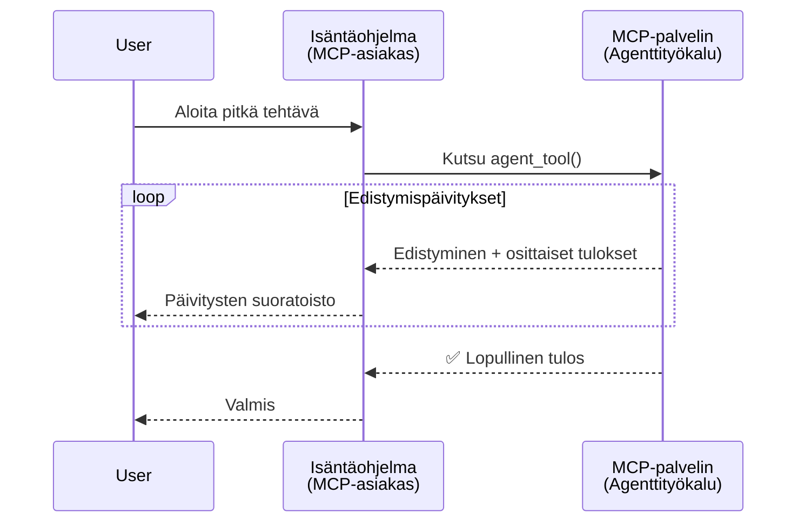
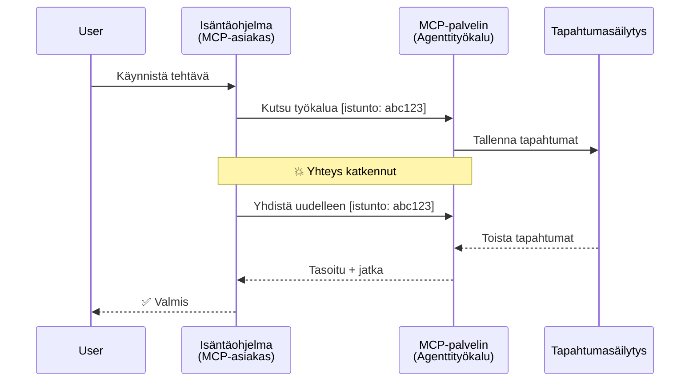
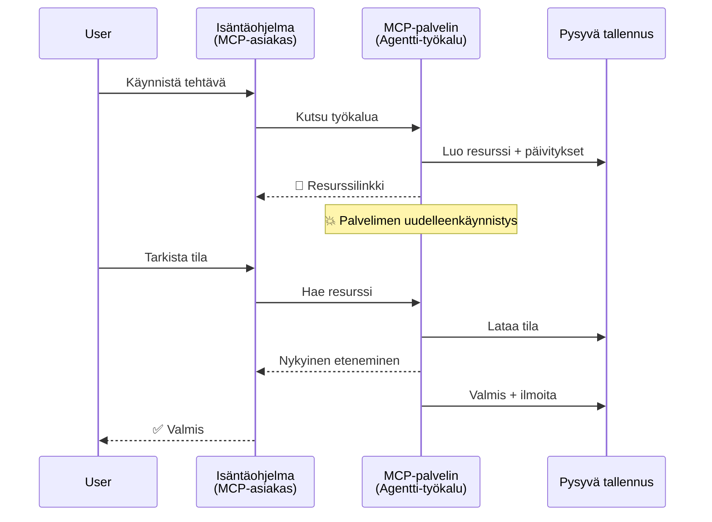
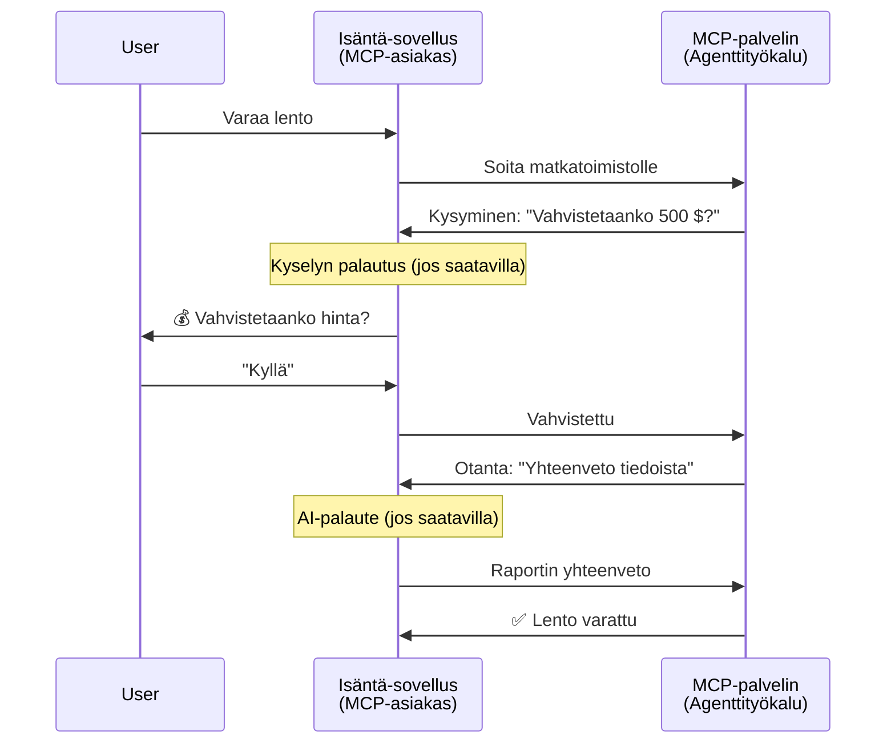
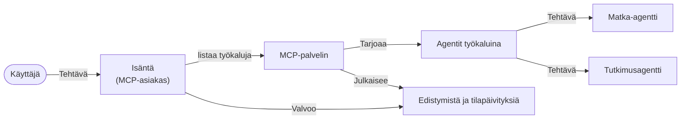

# Agentti-agenttiviestintäjärjestelmien rakentaminen MCP:llä

> Yhteenveto - Voiko MCP:llä rakentaa Agent2Agent-viestintää? Kyllä voi!

MCP on kehittynyt merkittävästi alkuperäisestä tavoitteestaan "tarjota kontekstia LLM-malleille". Viimeaikaisten parannusten, kuten [jatkettavat tiedonsyötteet](https://modelcontextprotocol.io/docs/concepts/transports#resumability-and-redelivery), [kyselyt](https://modelcontextprotocol.io/specification/2025-06-18/client/elicitation), [näytteenotto](https://modelcontextprotocol.io/specification/2025-06-18/client/sampling) ja ilmoitukset ([edistymisestä](https://modelcontextprotocol.io/specification/2025-06-18/basic/utilities/progress) ja [resursseista](https://modelcontextprotocol.io/specification/2025-06-18/schema#resourceupdatednotification)), MCP tarjoaa nyt vahvan perustan monimutkaisten agentti-agenttiviestintäjärjestelmien rakentamiseen.

## Agentti/työkalu-harhaanjohtavuus

Kun yhä useammat kehittäjät tutustuvat agenttimaisiin työkaluisiin (joita voi ajaa pitkiä aikoja, jotka saattavat vaatia lisäsyötteitä kesken suorituksen jne.), yleinen väärinkäsitys on, että MCP sopii huonosti, koska sen varhaiset esimerkit työkaluista keskittyivät yksinkertaisiin pyyntö-vastaus-kuvioihin.

Tämä käsitys on vanhentunut. MCP-spesifikaatiota on parannettu merkittävästi viime kuukausina ominaisuuksilla, jotka sulkevat aukkoa pitkäkestoisen agenttikäytöksen rakentamisessa:

- **Suoratoisto ja osittaiset tulokset**: Todelliset edistymisilmoitukset suorituksen aikana
- **Jatkettavuus**: Asiakas voi yhdistää uudelleen ja jatkaa katkeamisen jälkeen
- **Kestävyys**: Tulokset säilyvät palvelimen uudelleenkäynnistyksen jälkeen (esim. resurssilinkkien avulla)
- **Monivuorovaikutteisuus**: Interaktiivinen syöte suorituksen aikana kyselyjen ja näytteenoton avulla

Näitä ominaisuuksia voi yhdistellä monimutkaisiin agentti- ja moniagenttisovelluksiin, kaikki MCP-protokollan päällä.

Viitteen vuoksi kutsumme agenttia "työkaluksi", joka on saatavilla MCP-palvelimella. Tämä olettaa isäntäohjelman olemassaolon, joka toteuttaa MCP-asiakkaan, joka avaa istunnon MCP-palvelimen kanssa ja pystyy kutsumaan agenttia.

## Mikä tekee MCP-työkalusta "agenttimaisen"?

Ennen toteutukseen sukeltamista määritellään, mitä infrastruktuurin ominaisuuksia tarvitaan pitkäkestoisten agenttien tukemiseen.

> Määrittelemme agentin sellaiseksi toimijaksi, joka voi toimia itsenäisesti pitkään, suorittaa monimutkaisia tehtäviä, jotka voivat vaatia useita vuorovaikutuksia tai sopeutumista reaaliaikaisen palautteen perusteella.

### 1. Suoratoisto ja osittaiset tulokset

Perinteiset pyyntö-vastaus-kuviot eivät toimi pitkäkestoisissa tehtävissä. Agenttien on tarjottava:

- Todelliset edistymisilmoitukset
- Välitulokset

**MCP-tuki**: Resurssipäivitysilmoitukset mahdollistavat osittaiset tulokset suoratoistona, vaikka tämä vaatii huolellista suunnittelua, jotta vältetään ristiriidat JSON-RPC:n 1:1 pyyntö/vastaus -mallin kanssa.

| Ominaisuus                 | Käyttötapaus                                                                                                                                                                     | MCP-tuki                                                                                |
| ------------------------- | -------------------------------------------------------------------------------------------------------------------------------------------------------------------------------- | -------------------------------------------------------------------------------------- |
| Todelliset edistymisilmoitukset | Käyttäjä pyytää koodipohjan siirtotehtävää. Agentti striimaa edistymisen: "10 % - Riippuvuuksien analyysi... 25 % - Typescript-tiedostojen muuntaminen... 50 % - Tuontien päivitys..." | ✅ Edistymisilmoitukset                                                                |
| Osittaiset tulokset       | "Kirjan luonti" -tehtävä striimaa osittaisia tuloksia, esim. 1) Tarinan kaaren hahmotelma, 2) Lukujärjestys, 3) Kappale kerrallaan valmiina. Isäntä voi tarkastella, peruuttaa tai ohjata missä vaiheessa tahansa. | ✅ Ilmoituksia voi "laajentaa" osittaisiin tuloksiin, katso ehdotukset PR 383, 776          |

<div align="center" style="font-style: italic; font-size: 0.95em; margin-bottom: 0.5em;">
<strong>Kuvio 1:</strong> Tämä kaavio havainnollistaa, kuinka MCP-agentti striimaa reaaliaikaiset edistymisilmoitukset ja osittaiset tulokset isäntäohjelmalle pitkäkestoisen tehtävän aikana, mahdollistaen käyttäjän seurata suoritusta reaaliajassa.
</div>



### 2. Jatkettavuus

Agenttien on käsiteltävä verkkokatkokset sulavasti:

- Yhdistyä uudelleen (asiakas)kokon katkeamisen jälkeen
- Jatkaa siitä, mihin jäätiin (viestien uudelleenlähetys)

**MCP-tuki**: MCP StreamableHTTP -kuljetus tukee tänään istunnon jatkumista ja viestien uudelleenlähetystä istunnon ja viimeisen tapahtuman tunnisteilla. Tärkeä huomio on, että palvelimen on toteutettava EventStore, joka mahdollistaa tapahtumien toiston asiakasliittymän uudelleenyhdistyksen yhteydessä.  
Huomaa, että yhteisössä on ehdotus (PR #975), joka tutkii kuljetusneutraaleja jatkettavia tiedonsyötteitä.

| Ominaisuus   | Käyttötapaus                                                                                                                                                               | MCP-tuki                                                                |
| ----------- | -------------------------------------------------------------------------------------------------------------------------------------------------------------------------- | ---------------------------------------------------------------------- |
| Jatkettavuus | Asiakas katkeaa pitkäkestoisen tehtävän aikana. Uudelleenyhdistyksen jälkeen istunto jatkuu, kadonneet tapahtumat toistetaan, ja tehtävä jatkuu saumattomasti siitä, mihin jäätiin. | ✅ StreamableHTTP-kuljetus istuntotunnisteilla, tapahtumien toistolla ja EventStorella |

<div align="center" style="font-style: italic; font-size: 0.95em; margin-bottom: 0.5em;">
<strong>Kuvio 2:</strong> Tämä kaavio näyttää, kuinka MCP:n StreamableHTTP-kuljetus ja tapahtumavarasto mahdollistavat saumattoman istunnon jatkamisen: jos asiakas katkeaa, se voi yhdistyä uudelleen ja toistaa kadonneet tapahtumat, jatkaen tehtävää ilman edistymisen menetystä.
</div>



### 3. Kestävyys

Pitkäkestoiset agentit tarvitsevat pysyvän tilan:

- Tulokset säilyvät palvelimen uudelleenkäynnistyksestä huolimatta
- Tilanne voidaan hakea irrallisestikin
- Edistymisen seuranta istuntojen yli

**MCP-tuki**: MCP tukee nyt resurssilinkin paluutyyppiä työkalukutsuissa. Yleinen malli on suunnitella työkalu, joka luo resurssin ja palauttaa välittömästi resurssilinkin. Työkalu voi taustalla jatkaa tehtävän käsittelyä ja päivittää resurssia. Asiakas voi valita joko kyselyllä seurata resurssin tilaa saadakseen osittaiset tai täydelliset tulokset (riippuen siitä, mitä resurssipäivityksiä palvelin tarjoaa) tai tilata resurssin päivitysilmoitukset.

Yksi rajoitus on se, että resurssien kysely tai tilaus päivityksistä voi olla resurssi-intensiivistä ja sillä voi olla laajamittaisia vaikutuksia. Avoimessa yhteisöehdotuksessa (mukaan lukien #992) tutkitaan webhookien tai laukaisimien lisäämistä, joilla palvelin voisi ilmoittaa asiakas/isäntäohjelmalle päivityksistä.

| Ominaisuus  | Käyttötapaus                                                                                                                                    | MCP-tuki                                                        |
| ---------- | ----------------------------------------------------------------------------------------------------------------------------------------------- | --------------------------------------------------------------- |
| Kestävyys  | Palvelin kaatuu tiedonsiirtotehtävän aikana. Tulokset ja edistyminen säilyvät uudelleenkäynnistyksestä huolimatta, asiakas voi tarkistaa tilan ja jatkaa pysyvästä resurssista. | ✅ Resurssilinkit pysyvällä tallennuksella ja tilailmoituksilla |

Tänään yleinen malli on suunnitella työkalu, joka luo resurssin ja palauttaa välittömästi resurssilinkin. Työkalu voi taustalla hoitaa tehtävää, lähettää resurssipäivityksiä edistymisilmoituksina tai sisältää osittaisia tuloksia, ja päivittää resurssin sisältöä tarpeen mukaan.

<div align="center" style="font-style: italic; font-size: 0.95em; margin-bottom: 0.5em;">
<strong>Kuvio 3:</strong> Tämä kaavio havainnollistaa, kuinka MCP-agentit käyttävät pysyviä resursseja ja tilailmoituksia varmistaakseen, että pitkäkestoiset tehtävät selviävät palvelimen uudelleenkäynnistyksistä, mahdollistaen asiakkaiden seurata edistymistä ja hakea tulokset myös virhetilanteiden jälkeen.
</div>



### 4. Monivuorovaikutteiset keskustelut

Agentit tarvitsevat usein lisäsyötettä suorituksen aikana:

- Ihmisen selvennys tai hyväksyntä
- AI-avustus monimutkaisiin päätöksiin
- Dynaaminen parametrien säätö

**MCP-tuki**: Täysin tuettu kyselyjen (ihmisen syötteelle) ja näytteenoton (AI-syötteelle) kautta.

| Ominaisuus                 | Käyttötapaus                                                                                                                                | MCP-tuki                                           |
| ------------------------- | ------------------------------------------------------------------------------------------------------------------------------------------- | ------------------------------------------------- |
| Monivuorovaikutteisuus    | Matkavarauksen agentti pyytää käyttäjältä hintavahvistusta ja pyytää sitten AI:ta tiivistämään matkadata ennen varauksen viimeistelyä.           | ✅ Kysely ihmisen syötteelle, näytteenotto AI-syötteelle |

<div align="center" style="font-style: italic; font-size: 0.95em; margin-bottom: 0.5em;">
<strong>Kuvio 4:</strong> Tämä kaavio kuvaa, kuinka MCP-agentit voivat interaktiivisesti pyytää ihmisen syötettä tai AI-avustusta suorituksen aikana, tukien monimutkaisia, monivuorovaikutteisia työnkulkuja, kuten vahvistuksia ja dynaamista päätöksentekoa.
</div>



## Pitkäkestoisten agenttien toteutus MCP:llä - Koodikatsaus

Tässä artikkelissa tarjoamme [koodivaraston](https://github.com/victordibia/ai-tutorials/tree/main/MCP%20Agents), joka sisältää täydellisen toteutuksen pitkäkestoisista agenteista käyttäen MCP Python SDK:ta ja StreamableHTTP-kuljetusta istunnon jatkamiseen ja viestien uudelleenlähetykseen. Toteutus osoittaa, kuinka MCP:n ominaisuuksia voi yhdistellä kehittyneiden agenttimaisen toiminnan mahdollistamiseksi.

Tarkemmin toteutamme palvelimen, jossa on kaksi pääagenttityökalua:

- **Matka-agentti** - Simuloi matkavarauksen palvelua hintavahvistuksella kyselyjen avulla
- **Tutkimus-agentti** - Suorittaa tutkimustehtäviä AI-avusteisilla tiivistelmillä näytteenoton avulla

Molemmat agentit demonstroivat reaaliaikaisia edistymisilmoituksia, vuorovaikutteisia vahvistuksia sekä täyttä istunnon jatkumiskykyä.

### Keskeiset toteutuskäsitteet

Seuraavat osiot näyttävät palvelinpuolen agenttien toteutuksen ja asiakaspuolen isännän käsittelyn kustakin ominaisuudesta:

#### Suoratoisto ja edistymisilmoitukset - tehtävän tilan reaaliaikainen seuranta

Suoratoisto mahdollistaa agenttien toimittaa käyttäjille reaaliaikaiset edistymisilmoitukset pitkäkestoisten tehtävien aikana, pitäen käyttäjät ajan tasalla tehtävän tilasta ja välituloksista.

**Palvelimen toteutus (agentti lähettää edistymisilmoituksia):**

```python
# Matkatoimisto lähettää etenemispäivityksiä
for i, step in enumerate(steps):
    await ctx.session.send_progress_notification(
        progress_token=ctx.request_id,
        progress=i * 25,
        total=100,
        message=step,
        related_request_id=str(ctx.request_id)
    )
    await anyio.sleep(2)  # Simuloi työtä

# Vaihtoehto: Kirjaa viestejä yksityiskohtaisiin vaiheittaisiin päivityksiin
await ctx.session.send_log_message(
    level="info",
    data=f"Processing step {current_step}/{steps} ({progress_percent}%)",
    logger="long_running_agent",
    related_request_id=ctx.request_id,
)
```

**Asiakkaan toteutus (isäntä vastaanottaa edistymisilmoituksia):**

```python
# Asiakas/client.py - Asiakas reaaliaikaisten ilmoitusten käsittelyssä
async def message_handler(message) -> None:
    if isinstance(message, types.ServerNotification):
        if isinstance(message.root, types.LoggingMessageNotification):
            console.print(f"📡 [dim]{message.root.params.data}[/dim]")
        elif isinstance(message.root, types.ProgressNotification):
            progress = message.root.params
            console.print(f"🔄 [yellow]{progress.message} ({progress.progress}/{progress.total})[/yellow]")

# Rekisteröi viestinkäsittelijä istuntoa luotaessa
async with ClientSession(
    read_stream, write_stream,
    message_handler=message_handler
) as session:
```

#### Kyselyt – käyttäjän syötteen pyytäminen

Kyselyt antavat agenttien pyytää käyttäjän syötettä suorituksen aikana. Tämä on tärkeää vahvistuksissa, selvennyksissä tai hyväksynnöissä pitkäkestoisten tehtävien aikana.

**Palvelimen toteutus (agentti pyytää vahvistusta):**

```python
# Palvelimelta/server.py - Matkatoimisto pyytää hinnan vahvistusta
elicit_result = await ctx.session.elicit(
    message=f"Please confirm the estimated price of $1200 for your trip to {destination}",
    requestedSchema=PriceConfirmationSchema.model_json_schema(),
    related_request_id=ctx.request_id,
)

if elicit_result and elicit_result.action == "accept":
    # Jatka varaamista
    logger.info(f"User confirmed price: {elicit_result.content}")
elif elicit_result and elicit_result.action == "decline":
    # Peruuta varaus
    booking_cancelled = True
```

**Asiakkaan toteutus (isäntä tarjoaa kyselycallbackin):**

```python
# Asiakas/client.py - Asiakaskäsittely pyynnön keräämiseksi
async def elicitation_callback(context, params):
    console.print(f"💬 Server is asking for confirmation:")
    console.print(f"   {params.message}")

    response = console.input("Do you accept? (y/n): ").strip().lower()

    if response in ['y', 'yes']:
        return types.ElicitResult(
            action="accept",
            content={"confirm": True, "notes": "Confirmed by user"}
        )
    else:
        return types.ElicitResult(
            action="decline",
            content={"confirm": False, "notes": "Declined by user"}
        )

# Rekisteröi takaisinsoitto luotaessa istuntoa
async with ClientSession(
    read_stream, write_stream,
    elicitation_callback=elicitation_callback
) as session:
```

#### Näytteenotto – AI-avustuksen pyytäminen

Näytteenotto mahdollistaa agenttien pyytää LLM:n apua monimutkaisiin päätöksiin tai sisällöntuotantoon suorituksen aikana. Tämä tukee ihmisen ja tekoälyn yhdistelmätyönkulkuja.

**Palvelimen toteutus (agentti pyytää AI-avustusta):**

```python
# Palvelimelta/server.py - Tutkimusagentti pyytää tekoälyn yhteenvetoa
sampling_result = await ctx.session.create_message(
    messages=[
        SamplingMessage(
            role="user",
            content=TextContent(type="text", text=f"Please summarize the key findings for research on: {topic}")
        )
    ],
    max_tokens=100,
    related_request_id=ctx.request_id,
)

if sampling_result and sampling_result.content:
    if sampling_result.content.type == "text":
        sampling_summary = sampling_result.content.text
        logger.info(f"Received sampling summary: {sampling_summary}")
```

**Asiakkaan toteutus (isäntä tarjoaa näytteenottocallbackin):**

```python
# Asiakkaasta/client.py - Asiakashallinta otospyyntöihin
async def sampling_callback(context, params):
    message_text = params.messages[0].content.text if params.messages else 'No message'
    console.print(f"🧠 Server requested sampling: {message_text}")

    # Todellisessa sovelluksessa tämä voisi kutsua LLM-rajapintaa
    # Demon vuoksi tarjoamme mallivastauksen
    mock_response = "Based on current research, MCP has evolved significantly..."

    return types.CreateMessageResult(
        role="assistant",
        content=types.TextContent(type="text", text=mock_response),
        model="interactive-client",
        stopReason="endTurn"
    )

# Rekisteröi takaisinkutsu istunnon luomisessa
async with ClientSession(
    read_stream, write_stream,
    sampling_callback=sampling_callback,
    elicitation_callback=elicitation_callback
) as session:
```

#### Jatkettavuus – istunnon jatkuvuus yhteyksien katkeamisen yli

Jatkettavuus varmistaa, että pitkäkestoiset agenttitehtävät selviävät asiakasliittymän katkeamisista ja jatkuvat saumattomasti uudelleen yhdistettynä. Tämä toteutetaan tapahtumavarastojen ja jatkamistunnisteiden avulla.

**Tapahtumavaraston toteutus (palvelin pitää istuntotilaa):**

```python
# From server/event_store.py - Yksinkertainen muistissa oleva tapahtumavarasto
class SimpleEventStore(EventStore):
    def __init__(self):
        self._events: list[tuple[StreamId, EventId, JSONRPCMessage]] = []
        self._event_id_counter = 0

    async def store_event(self, stream_id: StreamId, message: JSONRPCMessage) -> EventId:
        """Store an event and return its ID."""
        self._event_id_counter += 1
        event_id = str(self._event_id_counter)
        self._events.append((stream_id, event_id, message))
        return event_id

    async def replay_events_after(self, last_event_id: EventId, send_callback: EventCallback) -> StreamId | None:
        """Replay events after the specified ID for resumption."""
        # Etsi tapahtumat viimeisimmän tunnetun tapahtuman jälkeen ja toista ne
        for _, event_id, message in self._events[start_index:]:
            await send_callback(EventMessage(message, event_id))

# From server/server.py - Tapahtumavaraston välittäminen istuntojen hallintaan
def create_server_app(event_store: Optional[EventStore] = None) -> Starlette:
    server = ResumableServer()

    # Luo istuntojen hallinta tapahtumavarastolla jatkamista varten
    session_manager = StreamableHTTPSessionManager(
        app=server,
        event_store=event_store,  # Tapahtumavarasto mahdollistaa istunnon jatkamisen
        json_response=False,
        security_settings=security_settings,
    )

    return Starlette(routes=[Mount("/mcp", app=session_manager.handle_request)])

# Käyttö: Alusta tapahtumavaraston kanssa
event_store = SimpleEventStore()
app = create_server_app(event_store)
```

**Asiakkaan metatiedot jatkamistunnisteella (asiakas yhdistää uudelleen tallennetun tilan avulla):**

```python
# Asiakas/client.py - Asiakkaan jatkaminen metatietojen kanssa
if existing_tokens and existing_tokens.get("resumption_token"):
    # Käytä olemassa olevaa jatkamistunnusta jatkaaksesi siitä, mihin jäimme
    metadata = ClientMessageMetadata(
        resumption_token=existing_tokens["resumption_token"],
    )
else:
    # Luo takaisinkutsu jatkamistunnuksen tallentamiseksi vastaanoton yhteydessä
    def enhanced_callback(token: str):
        protocol_version = getattr(session, 'protocol_version', None)
        token_manager.save_tokens(session_id, token, protocol_version, command, args)

    metadata = ClientMessageMetadata(
        on_resumption_token_update=enhanced_callback,
    )

# Lähetä pyyntö jatkamismetatiedoilla
result = await session.send_request(
    types.ClientRequest(
        types.CallToolRequest(
            method="tools/call",
            params=types.CallToolRequestParams(name=command, arguments=args)
        )
    ),
    types.CallToolResult,
    metadata=metadata,
)
```

Isäntäohjelma ylläpitää paikallisesti istuntotunnisteita ja jatkamistunnisteita, mahdollistaen uudelleen yhdistämisen olemassa oleviin istuntioihin ilman edistymisen tai tilan menetystä.

### Koodin organisointi

<div align="center" style="font-style: italic; font-size: 0.95em; margin-bottom: 0.5em;">
<strong>Kuvio 5:</strong> MCP-pohjaisen agenttijärjestelmän arkkitehtuuri
</div>



**Keskeiset tiedostot:**

- **`server/server.py`** - Jatkuva MCP-palvelin matkailu- ja tutkimusagentteineen, jotka demonstroivat kyselyjä, näytteenottoa ja edistymisilmoituksia
- **`client/client.py`** - Vuorovaikutteinen isäntäohjelma jatkumistuen, callback-käsittelijöiden ja tunnistehallinnan kanssa
- **`server/event_store.py`** - Tapahtumavaraston toteutus istunnon jatkumisen ja viestien uudelleenlähetyksen mahdollistamiseksi

## Laajentaminen moniagenttiviestintään MCP:llä

Edellä kuvattu toteutus voidaan laajentaa moniagenttijärjestelmiksi parantamalla isäntäohjelman älykkyyttä ja käsittelemää laajempaa tehtäväalaa:

- **Älykäs tehtävien pilkkominen**: Isäntä analysoi monimutkaiset käyttäjäpyynnöt ja jakaa ne alitehtäviksi eri erikoistuneille agenteille
- **Monipalvelinkoordinointi**: Isäntä ylläpitää yhteyksiä useisiin MCP-palvelimiin, joista jokainen tarjoaa erilaisia agenttikyvykkyyksiä
- **Tehtävien tilanhallinta**: Isäntä seuraa edistymistä useissa samanaikaisissa agenttitehtävissä, hoitaa riippuvuuksia ja järjestyksiä
- **Varmuus ja uudelleenyritykset**: Isäntä hallitsee epäonnistumisia, toteuttaa uudelleenyrityskäytäntöjä ja ohjaa tehtävät uudelleen, kun agentit eivät ole käytettävissä
- **Tulosten yhdistäminen**: Isäntä yhdistää useiden agenttien tuottamat tulokset johdonmukaisiksi lopputuloksiksi

Isännästä kehittyy yksinkertaisesta asiakkaasta älykäs orkestroija, joka koordinoi hajautettuja agenttikyvykkyyksiä samalla säilyttäen saman MCP-protokollaperustan.

## Yhteenveto

MCP:n parannetut ominaisuudet - resurssien ilmoitukset, kyselyt/näytteenotto, jatkettavat tiedonsyötteet ja pysyvät resurssit - mahdollistavat monimutkaiset agentti-agenttien vuorovaikutukset samalla, kun protokolla pysyy yksinkertaisena.

## Aloittaminen

Valmiina rakentamaan oman agentti2agentti-järjestelmäsi? Noudata näitä ohjeita:

### 1. Aja Demo

```bash
# Käynnistä palvelin tapahtumavarastolla jatkoa varten
python -m server.server --port 8006

# Toisessa päätelaitteessa suorita interaktiivinen asiakas
python -m client.client --url http://127.0.0.1:8006/mcp
```

**Komentojen saatavuus interaktiivisessa tilassa:**

- `travel_agent` - Varaa matka hintavahvistuksella kyselyn avulla
- `research_agent` - Tutki aiheita AI-avusteisin tiivistelmin näytteenoton avulla
- `list` - Näytä kaikki saatavilla olevat työkalut
- `clean-tokens` - Tyhjennä jatkamistunnisteet
- `help` - Näytä yksityiskohtainen komentojen ohje
- `quit` - Poistu asiakkaasta

### 2. Testaa jatkettavuusominaisuudet

- Käynnistä pitkäkestoinen agentti (esim. `travel_agent`)
- Keskeytä asiakas suorituksen aikana (Ctrl+C)
- Käynnistä asiakas uudelleen – se jatkaa automaattisesti siitä, mihin jäi

### 3. Tutki ja laajenna

- **Tutki esimerkkejä**: Katso tämä [mcp-agents](https://github.com/victordibia/ai-tutorials/tree/main/MCP%20Agents)
- **Liity yhteisöön**: Osallistu MCP-keskusteluihin GitHubissa
- **Kokeile**: Aloita yksinkertaisella pitkäkestoisella tehtävällä ja lisää vähitellen suoratoisto, jatkettavuus ja moniagenttien koordinointi

Tämä osoittaa, kuinka MCP mahdollistaa älykkään agenttikäytöksen säilyttäen työkalupohjaisen yksinkertaisuuden.

MCP-protokollan spesifikaatio kehittyy nopeasti; lukijaa kehotetaan tutustumaan viralliseen dokumentaatiosivustoon viimeisimpien päivitysten vuoksi – https://modelcontextprotocol.io/introduction

---

<!-- CO-OP TRANSLATOR DISCLAIMER START -->
**Vastuuvapauslauseke**:
Tämä asiakirja on käännetty käyttämällä tekoälypohjaista käännöspalvelua [Co-op Translator](https://github.com/Azure/co-op-translator). Vaikka pyrimme tarkkuuteen, otathan huomioon, että automaattiset käännökset saattavat sisältää virheitä tai epätarkkuuksia. Alkuperäinen asiakirja sen alkuperäiskielellä on virallinen lähde. Tärkeissä asioissa suositellaan ammattimaista ihmiskäännöstä. Emme ole vastuussa tämän käännöksen käytöstä aiheutuvista väärinymmärryksistä tai tulkinnoista.
<!-- CO-OP TRANSLATOR DISCLAIMER END -->