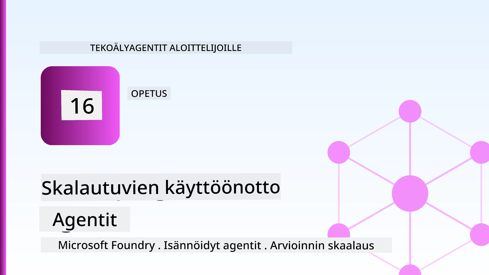
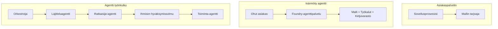
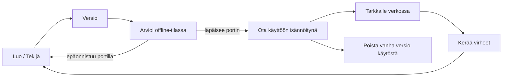
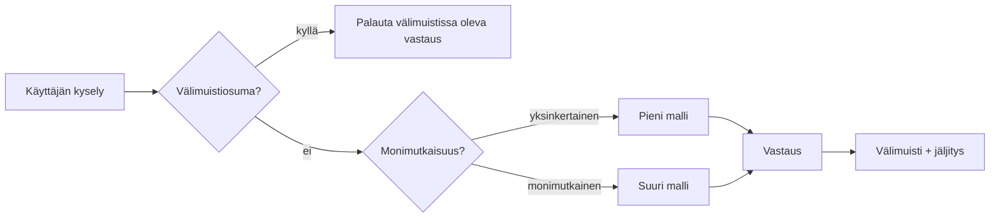
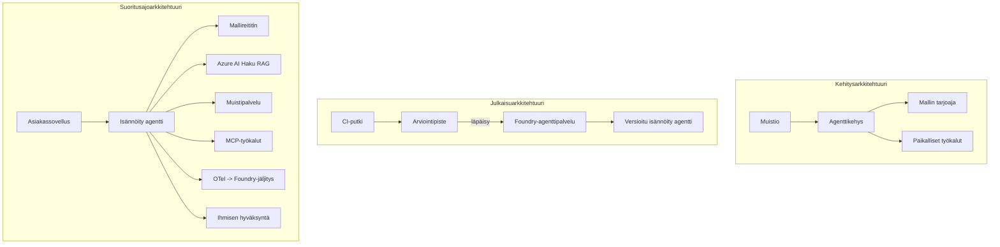

# Skaalautuvien agenttien käyttöönotto Microsoft Foundryn avulla



Tähän mennessä olet luonut agentteja, jotka suoritetaan kannettavallasi tietokoneella, muistikirjan sisällä, ajettuna `az login` -käskyllä ja muutamalla ympäristömuuttujalla. Tämä on juuri oikea tapa oppia. Se ei kuitenkaan ole oikea tapa ajaa agenttia, johon tuhannet asiakkaat luottavat kello kolmen aikaan yöllä.

Tämä oppitunti käsittelee kuilua "se toimii koneellani" ja "se toimii luotettavasti ja kustannustehokkaasti tuotannossa" välillä. Suljemme tämän kuilun käyttämällä **Microsoft Foundrya** ja **Microsoft Foundry Agent Serviceä**, rakentamalla todellisen asiakastukiedustajan, jolla on työkalut, haku, muisti, arviointi ja valvonta.

## Johdanto

Tämä oppitunti käsittelee:

- Erot **prototyyppiagentin** ja **käyttöönotetun agentin** välillä ja miksi siirtymä koskee pääasiassa kaikkea *mallin ympärillä olevaa*.
- Agenttien **käyttöönotto-mallit**: asiakkaan isännöimät, palvelun isännöimät (Hosted Agents) ja työnkulun orkestroimat.
- **Agentin elinkaaren vaiheet** Microsoft Foundryssa — luonti, versiointi, käyttöönotto, arviointi, seuranta, eläkkeelle siirto.
- **Skaalausstrategiat**: mallin reititys, välimuisti, samanaikaisuus ja tilattomuus.
- **Havaittavuus** OpenTelemetryn ja Foundryn jäljityksen avulla.
- **Kustannusten optimointi** mallin valinnan, reitityksen ja arviointikynnyksen kautta.
- **Yritysvaatimukset**: hallinto, ihmisen hyväksyntä ja MCP-palvelinten turvallinen käyttö tuotannossa.

## Oppimistavoitteet

Oppitunnin suorittamisen jälkeen osaat:

- Valita oikean käyttöönotto-mallin tietylle agenttikuormitukselle.
- Ottaa agentti käyttöön Microsoft Foundry Agent Servicessä siten, että se versionhallitaan, hallitaan ja se on havaittavissa.
- Varustaa agentti jäljityksellä ja kytkeä arviointiputki, joka suoritetaan ennen jokaista julkaisua.
- Soveltaa mallin reititystä ja välimuistia pitämään viive ja kustannukset hallinnassa skaalattaessa.
- Lisätä ihmisen hyväksyntäkynnys korkean riskin toimiin ja integroida MCP-palvelin tuotantoystävällisesti.

## Esivaatimukset

Tämä oppitunti olettaa, että olet suorittanut aiemmat oppitunnit ja hallitset:

- Agenttien rakentamisen [Microsoft Agent Frameworkilla](../14-microsoft-agent-framework/README.md) (Oppitunti 14).
- [Työkalujen käyttö](../04-tool-use/README.md) (Oppitunti 4) ja [Agentic RAG](../05-agentic-rag/README.md) (Oppitunti 5).
- [Agentin muisti](../13-agent-memory/README.md) (Oppitunti 13) ja [Agentic Protocols / MCP](../11-agentic-protocols/README.md) (Oppitunti 11).
- [Havaittavuus ja arviointi](../10-ai-agents-production/README.md) (Oppitunti 10) — tämä oppitunti rakentuu suoraan sen päälle.

Tarvitset myös:

- **Azure-tilauksen** ja **Microsoft Foundry -projektin**, jossa on vähintään yksi käyttöön otettu keskustelumalli.
- **Azure CLI:n** autentikoituna (`az login`).
- Python 3.12+ ja pakettien asennettuna hakemistosta [`requirements.txt`](../../../requirements.txt).

## Prototyyypistä tuotantoon: Mikä oikeastaan muuttuu

Prototyyppiagentilla ja tuotantokäyttöön tarkoitetulla agentilla on sama ydinsykli — päättely, työkalujen kutsuminen, vastaaminen. Muutokset koskevat kaikkea, mikä kietoutuu tuon syklin ympärille. Malli on ehkä 20 % tuotantoagentin kokonaistoteutuksesta; loput 80 % muodostaa operaatiollisen rungon.

| Huolenaihe | Prototyyppi | Tuotanto |
| --- | --- | --- |
| **Isännöinti** | Suoritetaan muistikirjassasi | Suoritetaan isännöitynä palveluna, versionhallittuna ja vaiheittain käyttöönotettuna |
| **Tunnistus** | Sinun `az login` -tokenisi | Hallittu identiteetti rajatulla RBAC-oikeutuksella |
| **Tila** | Muistissa, katoaa uudelleenkäynnistyksessä | Ulkoistettu (säikeiden tallennus, muisti-palvelu) |
| **Vika** | Näet virheen jäljityksen | Uudelleenyrittämiset, vararatkaisut, dead-letter, hälytykset |
| **Kustannus** | "Muuta pari senttiä" | Seurataan pyynnöittäin, reititetään, välimuistitetaan, budjetoidaan |
| **Laatu** | Tarkastat tuloksen silmämääräisesti | Arvioidaan automaattisesti ennen jokaista julkaisua |
| **Luottamus** | Hyväksyt jokaisen toimenpiteen | Politiikka + ihminen valvontakierrossa riskitoimissa |

Pidä tämä taulukko mielessä. Jokainen alla oleva osio liittyy yhteen näistä riveistä.

## Agentin käyttöönotto-mallit

Käytössä on kolme mallia, usein yhdistelminä.

### 1. Asiakkaan isännöimät agentit

Agentti-objekti sijaitsee *sinun* sovellusprosessissasi. Koodisi kutsuu mallin tarjoajaa suoraan; päättelysilmukka ajetaan palvelussasi. Tätä on toteutettu kaikissa aiemmissa oppitunneissa.

- **Käytä, kun** tarvitset täyden hallinnan silmukan yli, mukautettua middlewarea, tai upotat agentin olemassa olevaan backend-järjestelmään.
- **Kompromissi**: vastaat itse skaalauksesta, tilasta ja kestävyydestä.

### 2. Isännöidyt agentit (Foundry Agent Service)

Agentti on *rekisteröity resurssina* Microsoft Foundryssa. Foundry isännöi päättelysilmukkaa, tallentaa säikeet, valvoo sisältöturvallisuutta ja RBAC-oikeuksia, ja tekee agentin näkyväksi Foundryn portaalissa. Sovelluksesi toimii kevyenä asiakkaana, joka luo säikeitä ja lukee vastauksia.

- **Käytä, kun** haluat kestävyyttä, sisäänrakennettua havaittavuutta, hallintaa ja vähemmän operatiivista hallintaa.
- **Kompromissi**: vähemmän matalan tason kontrollia hallitun suoritusympäristön hyväksi.

### 3. Agenttien työnkulut

Useita agentteja (ja työkaluja) yhdistetään graafiksi, jossa on eksplisiittinen ohjausvirtaus — peräkkäisiä vaiheita, haarautumisia, ihmisen hyväksyntäsolmuja ja kestäviä tarkistuspisteitä, jotka voivat keskeyttää ja jatkaa. Tämä on Microsoft Agent Frameworkin **Workflows**-toiminnallisuus sovellettuna käyttöönoton skaalaan.

- **Käytä, kun** yksittäinen tehtävä ulottuu useiden erikoistuneiden agenttien vastuulle tai vaatii hyväksyntävaiheen keskellä.
- **Kompromissi**: enemmän liikkuvia osia; tarvitsee orkestroinnin tason havaittavuuden.



## Agentin elinkaari Microsoft Foundryssa

Agentin käyttöönotto ei ole kertaluonteinen `push`-toimenpide. Se on sykli, joka muistuttaa ohjelmiston julkaisusykliä, koska juuri sitä se on.



Keskeinen ajatus, joka on peräisin [Oppitunnista 10](../10-ai-agents-production/README.md): **offline-arviointi on portti, ei jälkinäkemys.** Uusi agentin versio ei lähetetä, ellei se täytä arviointikynnyksiäsi. Online-havaittavuus syöttää todellisen maailman virheet takaisin offline-testikokoelmaasi. Tämä on koko sykli.

## Skaalausstrategiat

Agentin skaalaus eroaa tilattoman web-API:n skaalaamisesta, koska jokainen pyyntö voi laukaista useita kalliita mallin ja työkalujen kutsuja. Neljä tekniikkaa kantaa suurimman kuorman.

**Tilaton pyyntöjen käsittely.** Älä säilytä käyttäjäkohtaista tilaa prosessimuistissa. Tallenna keskustelusäikeet Foundryn säikeiden tallennuspaikkaan tai muisti-palveluun, jotta mikä tahansa instanssi voi käsitellä mitä tahansa pyyntöä. Tämä mahdollistaa vaakasuuntaisen skaalauksen — lisää instansseja, ei tarttuvia istuntoja.

**Mallin reititys.** Kaikki pyynnöt eivät tarvitse kyvykkäintä (ja kalleinta) malliasi. Reititä yksinkertaiset pyynnöt — aikomuksen luokittelu, lyhyet faktavastaukset — pieneen, nopeaan malliin ja pidä suuri malli varattuna oikeaan päättelyyn. Foundryn **Model Router** voi tehdä tämän puolestasi, tai voit toteuttaa kevyen luokittelijan itse. Rakennat itse tehdyn version labrassa.

**Vastausten välimuisti.** Monet tukikyselyt ovat lähes kopioita ("kuinka vaihdan salasanani?"). Välimuistita vastaukset yleisiin kysymyksiin ja tarjoa ne ilman, että mallia tarvitsee kutsua. Jopa modestikin välimuistiosuma vähentää merkittävästi kustannuksia ja viivettä.

**Samanaikaisuus ja takaisinpaine.** Mallin tarjoajilla on rajoituksia nopeudelle. Rajaa samanaikaisuutta, käytä eksponentiaalisen takaisinkytkennän uudelleenyritystä, ja epäonnistu hienovaraisesti (jonotettu "olemme käsittelemässä" -vastaus voittaa 500-virheen).



## Havaittavuus tuotannossa

Et voi hallita sitä, mitä et näe. Kuten Oppitunnissa 10 käsiteltiin, Microsoft Agent Framework lähettää **OpenTelemetry**-jälkiä natiivisti — jokainen mallikutsu, työkalukutsu ja orkestrointivaihe muuttuu spaniksi. Tuotannossa viet nämä spanit Microsoft Foundryyn (tai mihin tahansa OTel-yhteensopivaan backend-järjestelmään), jotta voit:

- Jäljittää yhden asiakasvalituksen päästä päähän jokaisen mallin ja työkalukutsun yli.
- Tarkkailla p50/p95-viivettä ja kustannuksia pyyntöä kohden ajan kuluessa.
- Hälyttää virheiden nousuista ja kustannuspoikkeamista ennen kuin käyttäjät (tai taloustiimi) huomaavat ne.

```python
from agent_framework.observability import get_tracer

tracer = get_tracer()

with tracer.start_as_current_span("support_request") as span:
    span.set_attribute("customer.tier", "enterprise")
    span.set_attribute("routed.model", "gpt-4.1-mini")
    # agentin suoritus jäljitetään automaattisesti tämän laajuuden sisällä
```

Attribuutit kuten `customer.tier` ja `routed.model` muuttavat seinän verran jälkiä vastattaviksi kysymyksiksi ("ohjautuuko yritysasiakkaat liian usein pieneen malliin?").

## Kustannusten optimointi

Tuotantoagenttien kustannukset muodostuvat pääasiassa tokeneista. Kolme vipua vaikuttaa eniten:

1. **Säädä malli sopivankokoiseksi.** Pieni malli, joka läpäisee arviointikynnyksesi, on lähes aina halvempaa kuin suuri, joka myös läpäisee. Käytä arviointia *todistaaksesi*, että pieni malli riittää, äläkä valitse isointa varmuuden vuoksi.
2. **Reititä monimutkaisuuden mukaan.** Kuten yllä — maksa suurimallin hinnoittelu vain pyynnöissä, jotka tarvitsevat suurimallin päättelyä.
3. **Välimuistita aggressiivisesti.** Halvin mallikutsu on se, jota et koskaan tee.

Arviointikynnykset ja kustannusten hallinta ovat samaa kurinalaisuutta eri näkökulmista: arviointi kertoo *laadun minimitason*, reititys ja välimuisti pitävät kustannukset mahdollisimman lähellä tätä tasoa.

## Yrityskäyttöön liittyvät näkökohdat

**Hallinto.** Hosted Agents periävät Foundryn RBAC:n, sisältöturvallisuuden ja tarkastuslokit. Anna jokaiselle agentille hallittu identiteetti, jolla on vain tarvittavat vähimmät oikeudet — lukuoikeus tietokantaan, rajattu pääsy tikettien API:iin, ei mitään ylimääräistä.

**Ihminen valvontakierrossa.** Jotkut toimet ovat liian merkittäviä automatisoitavaksi suoraan — hyvityksen myöntäminen, tilin poistaminen, asian vieminen lakitiimille. Microsoft Agent Framework tukee **hyväksyntää edellyttäviä** työkaluja: agentti ehdottaa toimintoa, suoritus keskeytyy, ihminen hyväksyy tai hylkää, ja työnkulku jatkuu. Näit primitiivin [Oppitunnissa 6](../06-building-trustworthy-agents/README.md); tässä otat sen käyttöön.

**MCP tuotannossa.** [MCP](../11-agentic-protocols/README.md) antaa agentillesi mahdollisuuden käyttää ulkoisia työkaluja standardiliitännän kautta. Tuotannossa käsittele jokaista MCP-palvelinta epäluotettavana rajapintana: määritä palvelimen versio, suorita se rajatussa identiteetissä, varmista tulosten oikeellisuus äläkä koskaan paljasta sille salaisuuksia. MCP-palvelin on riippuvuus, ja riippuvuuksia korjataan, auditoidaan ja rajoitetaan.



Nämä kolme diagrammia – kehitys, käyttöönotto, ajoaika – kuvaavat samaa agenttia sen elämän kolmessa vaiheessa. Seuraava labra opastaa sinua sen rakentamisessa.

## Käytännön labra: Tuotantovalmiin asiakastukiagentin rakentaminen

Avaa [`code_samples/16-python-agent-framework.ipynb`](./code_samples/16-python-agent-framework.ipynb) ja käy se läpi alusta loppuun. Koot itsellesi **Contoso-asiakastukiagentin**, johon on liitetty kaikki tuotantohuolet:

1. **Työkalukutsut** — tilan tarkistus ja tukipyyntöjen avaaminen.
2. **RAG** — vastaa politiikkakysymyksiin tietokannasta (Azure AI Search, sisäinen muistivaraus, jotta muistikirja toimii ilman hakuresurssia).
3. **Muisti** — muista asiakas keskustelun eri vaiheissa.
4. **Mallin reititys** — monimutkaisuusluokittelija ohjaa pyynnön pieneen tai suureen malliin.
5. **Vastausten välimuisti** — toistuvat kysymykset vastataan välimuistista.
6. **Ihmisen hyväksyntä** — palautukset tietyn kynnyksen ylittäessä odottavat ihmisen hyväksyntää.
7. **Arviointiputki** — pieni offline-testikokoelma pisteyttää agentin ja toimii julkaisun porttina.
8. **Havaittavuus** — OpenTelemetry-jäljitys jokaisen pyynnön ympärillä.

### Läpikäynti

Muistikirja on järjestetty niin, että jokainen tuotantohuolet on itsenäinen, ajettava osio. Sydän on reititys- ja välimuistituspyynnön käsittelijä:

```python
async def handle_support_request(query: str, customer_id: str) -> str:
    # 1. Tarjoa välimuistista aina kun mahdollista.
    cached = response_cache.get(normalize(query))
    if cached:
        return cached

    # 2. Reititä monimutkaisuuden mukaan kustannusten hallitsemiseksi.
    model = "gpt-4.1-mini" if is_simple(query) else "gpt-4.1"

    # 3. Suorita agentti jäljitysvälin sisällä havaittavuuden vuoksi.
    with tracer.start_as_current_span("support_request") as span:
        span.set_attribute("routed.model", model)
        span.set_attribute("customer.id", customer_id)
        response = await support_agent.run(query, model=model)

    # 4. Välimuistita ja palauta.
    response_cache.set(normalize(query), response.text)
    return response.text
```

Julkaisua suojaava arviointikynnys näyttää tältä:

```python
async def evaluation_gate(agent, test_cases, threshold: float = 0.8) -> bool:
    passed = 0
    for case in test_cases:
        result = await agent.run(case["input"])
        if score_response(result.text, case["expected"]) >= 0.8:
            passed += 1
    pass_rate = passed / len(test_cases)
    print(f"Evaluation pass rate: {pass_rate:.0%} (gate: {threshold:.0%})")
    return pass_rate >= threshold  # ota käyttöön vain, jos portti menee läpi
```

Lue jokainen rivi — muistikirja pitää primitiivit tahallaan pieniä, ettei mitään ole piilotettu kehysfunktion taakse.

## Käyttöönotetun agentin validointi savutesteillä

Edellä mainittu arviointikynnys suoritetaan *offline*-tilassa agenttiobjektiisi vastaan. Kun agentti on käyttöönotettu Hosted Agentina, tarvitset vielä yhden halvempaan tarkastukseen: **vastaaako käyttöönotettu päätepiste oikeasti?**

"Onnistunut" käyttöönotto todistaa vain, että hallintakerros hyväksyi määritelmän — se ei todista, että agentti vastaa. Puuttuva riippuvuus, virheellinen mallin reititys tai vanhentunut yhteys voi jättää vihreän käyttöönoton, joka ei vastaa mitään. **Savutesti** havaitsee tämän muutamassa sekunnissa jokaisen käyttöönoton yhteydessä ilman täyden arvioinnin kustannuksia.

Tämä repositorio sisältää käyttövalmiin savutestiputken, joka perustuu [AI Smoke Test](https://github.com/marketplace/actions/ai-smoke-test) GitHub-toimintoon:

- **Katalogi** — [`tests/lesson-16-smoke-tests.json`](../../../tests/lesson-16-smoke-tests.json) sisältää kehotteet ja väitteet Contoso-tukiagentille (perustellut politiikkavastaukset, tilan tarkistus, pysyminen aiheessa ja monivaiheinen säikeen jatkuvuus). Muiden oppituntien agenttien katalogit sijaitsevat samalla tasolla — katso [`tests/README.md`](../tests/README.md).
- **Työnkulku** — [`.github/workflows/smoke-test.yml`](../../../.github/workflows/smoke-test.yml) kirjautuu sisään Azure OIDC:llä ja POSTaa jokaisen kehotteen agentin Responses-päätepisteeseen, epäonnistuu työ tehtävänä jokaisen väitteen kohdalla.

```yaml
- name: Smoke-test hosted agent
  uses: JFolberth/ai-smoketest@v1
  with:
    project_endpoint: ${{ inputs.project_endpoint }}
    agent_name: ContosoSupportAgent
    tests_file: tests/lesson-16-smoke-tests.json
```


Aja se **Actions**-välilehdeltä, kun agenttisi on otettu käyttöön, syöttämällä Foundry-projektisi päätepiste ja agentin nimi. Liitetylle identiteetille tarvitaan **Azure AI User** -rooli Foundry-projektin laajuudessa. Ajattele kerroksia pyramidina: savutestit (saavutettavissa ja vastaavatko ne?) suoritetaan jokaisen käyttöönoton yhteydessä, offline-arviointi (riittävän hyvä julkaistavaksi?) suoritetaan ennen ylennystä ja online-arviointi (miten se pärjää käytännössä?) suoritetaan jatkuvasti.

## Tietovisa

Testaa ymmärrystäsi ennen siirtymistä tehtävään.

**1. Kuinka suuri osa tuotantoagentista on suunnilleen "malli" ja mitä on loput?**

<details>
<summary>Vastaus</summary>

Malli on järjestelmän vähemmistö — usein arvioidaan noin 20 %. Loput muodostavat toiminnallisen rangan: isännöinti ja versionhallinta, identiteetti ja RBAC, ulkoistettu tila, virheenkäsittely, kustannusten seuranta, arviointi ja ihmisen osallisuus ohjauksessa. Siirtyminen tuotantoon tarkoittaa suurimmaksi osaksi kaiken rakentamista *päättelysilmukan* ympärille.
</details>

**2. Milloin valitsisit Hosted Agentin asiakas-isännöidyn agentin sijaan?**

<details>
<summary>Vastaus</summary>

Kun haluat hallinnoidun suoritusympäristön, jossa on sisäänrakennettu kestävyyttä (säikeet, jotka säilyvät ja voivat jatkua), havaittavuutta, sisältöturvaa ja RBACia, ja olet valmis vaihtamaan osan matalan tason kontrollista päättelysilmukasta pienemmän operatiivisen pinta-alan vuoksi. Asiakas-isännöity on parempi, kun tarvitset täyden kontrollin silmukasta tai upotat agentin olemassa olevaan taustajärjestelmään.
</details>

**3. Miksi skaalautuvan agentin täytyy olla tilaton omassa prosessimuistissaan?**

<details>
<summary>Vastaus</summary>

Jotta mikä tahansa instanssi voi käsitellä minkä tahansa pyynnön, mikä mahdollistaa horisontaalisen skaalaamisen ilman tilausperusteisia istuntoja. Käyttäjäkohtainen keskustelutila on ulkoistettu säikeiden tallennuspalveluun tai muistipalveluun. Jos tila asuisi prosessimuistissa, se menetettäisiin uudelleenkäynnistyksessä eikä kuormaa voisi jakaa vapaasti.
</details>

**4. Mitä ongelmaa mallien reititys ratkaisee ja miten se liittyy arviointiin?**

<details>
<summary>Vastaus</summary>

Reititys lähettää yksinkertaiset pyynnöt pienelle, edulliselle, nopealle mallille ja varaa suuren mallin varsinaiseen päättelyyn, säädellen sekä latenssia että kustannuksia. Se liittyy arviointiin, koska arviointi todistaa, että pieni malli on tarpeeksi hyvä eräälle pyyntölajille — ilman arviointia reititys on arvailua.
</details>

**5. Mikä on "arviointiloukku" ja missä kohtaa elinkaaren se sijaitsee?**

<details>
<summary>Vastaus</summary>

Arviointiloukku suorittaa offline-testisarjan uutta agentin versiota vastaan ja estää käyttöönoton, ellei läpäisyaste ylitä kynnystä. Se sijaitsee elinkaaressa "version" ja "käyttöönoton" välissä tehden laadusta ehdon julkaisulle sen sijaan, että sitä tarkistettaisiin vasta julkaisun jälkeen.
</details>

**6. Miksi MCP-palvelinta pitäisi tuotannossa käsitellä epäluotettavana rajapintana?**

<details>
<summary>Vastaus</summary>

Koska se on ulkoinen riippuvuus, johon agenttisi tekee kutsuja. Sen version tulisi olla lukittu, sitä pitäisi ajaa rajatussa identiteetissä, validoida sen tulokset, rajoittaa sen käyttöä ja olla koskaan paljastamatta salaisuuksia sille — sama kurinalaisuus kuin mihin tahansa kolmannen osapuolen riippuvuuteen. Sen tulokset vaikuttavat agentin päättelyyn, joten validoimaton luottamus on tietoturvariski.
</details>

**7. Mikä yksittäinen muutos vaikuttaa yleensä eniten tuotantoagentin kustannuksiin, ja miksi?**

<details>
<summary>Vastaus</summary>

Oikean mallin koon valinta — käytät pienintä mallia, joka vielä läpäisee arviointiloukkuasi. Kustannukset koostuvat pääasiassa tokeneista, ja pienempi malli, joka täyttää laatutason, on lähes aina edullisempi kuin suurempi. Välimuisti ja reititys alentavat kustannuksia entisestään, mutta oikean perustason mallin valinnalla on suurin ensisijainen vaikutus.
</details>

**8. Millainen rooli span-atribuutteilla kuten `customer.tier` ja `routed.model` on havaittavuudessa?**

<details>
<summary>Vastaus</summary>

Ne muuttavat raakajäljet vastattaviksi liiketoiminnan kysymyksiksi. Ilman attribuutteja sinulla on pelkkä joukko span-eja; niiden avulla voit kysyä "reititetäänkö yritysasiakkaat liian usein pienelle mallille?" tai "mikä malli käsittelee hitaimmat pyyntömme?" Attribuutit ovat tapa pilkkoa telemetria sinulle tärkeiden ulottuvuuksien mukaan.
</details>

## Tehtävä

Ota laboratoriosta asiakastukagentti ja vahvista sitä tiettyä skenaariota varten: **tilauslaskutuksen tukipalvelu SaaS-yritykselle.**

Palautuksesi tulisi sisältää:

1. **Korvaa työkalut** laskutukseen liittyvillä: `get_subscription_status`, `get_invoice` ja `issue_credit` (yli 50 dollarin hyvitykset vaativat ihmisen hyväksynnän).
2. **Lisää kolme RAG-dokumenttia**, jotka kattavat yrityksen hyvityskäytännön, laskutusjakson ja peruuttamiskäytännön.
3. **Laajenna arviointisarjaa** vähintään kahdeksaan tapaukseen, mukaan lukien vähintään kaksi, joiden tulisi *laukaista* ihmisen hyväksyntäreitti, ja varmista että arviointiloukku toimii oikein.
4. **Lisää yksi kustannusraportti**: ajon jälkeen kymmenellä sekoitetulla kyselyllä agentin läpi, tulosta kuinka monta meni pienelle mallille, kuinka monta suurelle mallille ja kuinka monta palveltiin välimuistista.

Kirjoita lyhyt kappale (markdown-soluun), jossa selität valitsemasi mallien reitityssäännön ja miten validoisit sen todellisella liikenteellä. Oikeaa vastausta ei ole — sinua arvioidaan sen mukaan, kuinka johdonmukaisesti tuotantoon liittyvät asiat on yhdistetty.

## Yhteenveto

Tässä oppitunnissa siirsit agentin prototyypistä tuotantoon Microsoft Foundryn avulla:

- Siirtyminen tuotantoon tarkoittaa suurimmaksi osaksi **toiminnallista runkoa** mallin ympärillä — isännöintiä, identiteettiä, tilaa, virheenkäsittelyä, kustannuksia, laatua ja luotettavuutta.
- Opit kolme **käyttöönotto-kuviota** — asiakas-isännöity, Hosted Agentit ja Agenttityönkulut — ja milloin kukin soveltuu.
- Kävit läpi **agentin elinkaaren**, jossa offline-**arviointi toimii julkaisuesteenä** ja online-havaittavuus syöttää virheet takaisin testisarjaan.
- Käytit **skaalausstrategioita** — tilattomuus, mallin reititys, välimuisti ja rajoitettu samanaikaisuus — ja yhdistit ne **kustannusten optimointiin**.
- Otit käyttöön **yritystason kontrollit**: RBAC, ihmisen hyväksyntä silmukan osana ja MCP-integraation tuotantoturvallisuus.
- Rakensit **tuotantovalmis asiakastukagentin**, joka yhdistää kaikki nämä asiat toimivaksi koodiksi.

Seuraava oppitunti kulkee päinvastaiseen suuntaan: skaalaamisen sijaan pilveen viet, tuot ne *alas* yhdelle kehittäjän koneelle ja ajat täysin paikallisesti.

## Lisäresurssit

- <a href="https://learn.microsoft.com/azure/ai-foundry/what-is-azure-ai-foundry" target="_blank">Microsoft Foundry -dokumentaatio</a>
- <a href="https://learn.microsoft.com/azure/ai-foundry/agents/overview" target="_blank">Microsoft Foundry Agent Service -yleiskatsaus</a>
- <a href="https://aka.ms/ai-agents-beginners/agent-framework" target="_blank">Microsoft Agent Framework</a>
- <a href="https://learn.microsoft.com/azure/ai-foundry/concepts/model-router" target="_blank">Mallien reititin Microsoft Foundryssa</a>
- <a href="https://learn.microsoft.com/azure/search/search-what-is-azure-search" target="_blank">Azure AI Search</a>
- <a href="https://opentelemetry.io/" target="_blank">OpenTelemetry</a>
- <a href="https://github.com/marketplace/actions/ai-smoke-test" target="_blank">AI Smoke Test GitHub Action</a>
- <a href="https://modelcontextprotocol.io/" target="_blank">Model Context Protocol (MCP)</a>

## Edellinen oppitunti

[Rakennetaan tietokoneen käyttöagentteja (CUA)](../15-browser-use/README.md)

## Seuraava oppitunti

[Paikallisten AI-agenttien luominen](../17-creating-local-ai-agents/README.md)

---

<!-- CO-OP TRANSLATOR DISCLAIMER START -->
**Vastuuvapauslauseke**:
Tämä asiakirja on käännetty käyttämällä tekoälypohjaista käännöspalvelua [Co-op Translator](https://github.com/Azure/co-op-translator). Vaikka pyrimme tarkkuuteen, otathan huomioon, että automaattiset käännökset saattavat sisältää virheitä tai epätarkkuuksia. Alkuperäinen asiakirja sen alkuperäiskielellä on virallinen lähde. Tärkeissä asioissa suositellaan ammattimaista ihmiskäännöstä. Emme ole vastuussa tämän käännöksen käytöstä aiheutuvista väärinymmärryksistä tai tulkinnoista.
<!-- CO-OP TRANSLATOR DISCLAIMER END -->