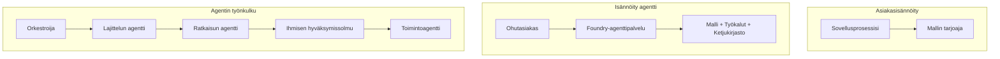
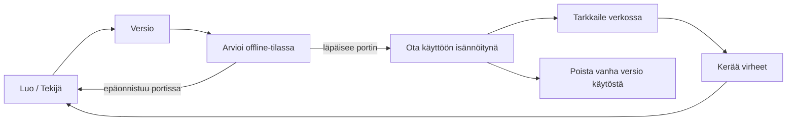
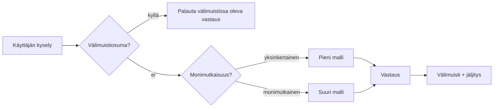
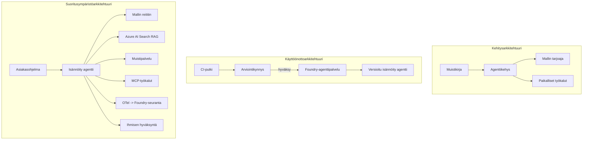

# Skaalautuvien agenttien käyttöönotto Microsoft Foundryn avulla


Tähän asti kurssilla olet rakentanut agentteja, jotka toimivat kannettavallasi tietokoneella, muistikirjassa, `az login` -komennon ja pienen joukon ympäristömuuttujia ohjaamana. Tämä on täysin oikea tapa oppia. Se ei kuitenkaan ole oikea tapa ajaa agenttia, johon tuhannet asiakkaat luottavat kello 3 yöllä.

Tässä oppitunnissa käsitellään kuilua "se toimii omalla koneellani" ja "se toimii luotettavasti ja edullisesti tuotannossa" välillä. Suljemme tämän kuilun käyttämällä **Microsoft Foundrya** ja **Microsoft Foundry Agent Serviceä**, ja teemme sen rakentamalla todellisen asiakastukiasiantuntijan, jolla on työkalut, haku, muisti, arviointi ja valvonta.

## Johdanto

Tässä oppitunnissa käsitellään:

- Ero **prototyyppiagentin** ja **käyttöönotetun agentin** välillä sekä miksi siirtymä koskee enimmäkseen kaikkea *mallin ympärillä* olevaa.
- **Käyttöönoton mallit** agenteille: asiakkaan ylläpitämä, palvelimella ylläpidetty (Hosted Agents) ja työnkulun orkestroima.
- **Agentin elinkaari** Microsoft Foundryssa — luo, versioi, ota käyttöön, arvioi, seuraa, poista käytöstä.
- **Skaalausstrategiat**: mallin reititys, välimuistitus, samanaikaisuus ja tilatonta suunnittelu.
- **Havaittavuus** OpenTelemetryllä ja Foundryn jäljityksellä.
- **Kustannusten optimointi** mallin valinnan, reitityksen ja arviointilukkojen avulla.
- **Yrityksen näkökohdat**: hallinnointi, ihmisen hyväksyntä ja MCP-palvelimien turvallinen ajaminen tuotannossa.

## Oppimistavoitteet

Oppitunnin suorittamisen jälkeen osaat:

- Valita oikean käyttöönoton mallin tietylle agentin työkuormalle.
- Ota agentti käyttöön Microsoft Foundry Agent Servicessä niin, että siitä tulee versioitu, hallittu ja havaittava.
- Instrumentoida agentti jäljitystä varten ja liittää arviointiputki joka suoritetaan ennen jokaista julkaisua.
- Soveltaa mallin reititystä ja välimuistitusta, jotta viive ja kustannukset pysyvät kurissa skaalautuessa.
- Lisätä ihmisen hyväksyntälukko riskialttiita toimintoja varten ja integroida MCP-palvelin tuotantoturvallisesti.

## Esivaatimukset

Tämä oppitunti edellyttää, että olet suorittanut aiemmat oppitunnit ja osaat:

- Rakentaa agentteja [Microsoft Agent Frameworkilla](../14-microsoft-agent-framework/README.md) (Oppitunti 14).
- [Työkalujen käyttö](../04-tool-use/README.md) (Oppitunti 4) ja [Agentic RAG](../05-agentic-rag/README.md) (Oppitunti 5).
- [Agentin muisti](../13-agent-memory/README.md) (Oppitunti 13) ja [Agentic-protokollat / MCP](../11-agentic-protocols/README.md) (Oppitunti 11).
- [Havaittavuus ja arviointi](../10-ai-agents-production/README.md) (Oppitunti 10) — tämä oppitunti rakentuu suoraan sen päälle.

Tarvitset myös:

- **Azure-tilauksen** ja **Microsoft Foundry -projektin**, jossa on vähintään yksi chat-malli tuotannossa.
- **Azure CLI:n** todennettuna (`az login`).
- Python 3.12+ ja repositorion [`requirements.txt`](../../../requirements.txt) -paketit.

## Prototyypistä tuotantoon: mitä oikeasti muuttuu

Prototyyppiagentti ja tuotantoagentti jakavat saman ytimen — päättely, työkalukutsut, vastaaminen. Muuttuu kaikki se, mikä kietoutuu tämän silmukan ympärille. Malli on ehkä 20 % tuotantoagentista; loput 80 % on operatiivinen runko.

| Huomio | Prototyyppi | Tuotanto |
| --- | --- | --- |
| **Isännöinti** | Suoritetaan muistikirjassasi | Suoritetaan isännöitynä palveluna, versioituna ja vaiheittain otettuna käyttöön |
| **Tunnistus** | Sinun `az login` -tunnuksesi | Hallittu identiteetti rajatuilla RBAC-oikeuksilla |
| **Tila** | Muistissa, katoaa uudelleenkäynnistyksessä | Ulkoistettu (thread store, muistipalvelu) |
| **Virhe** | Näet virheen jäljitteen | Uudelleenyritykset, varatilat, dead-letter, hälytykset |
| **Kustannus** | "Se on muutama sentti" | Seurataan per pyyntö, reititetään, välimuistitetaan, budjetoidaan |
| **Laadukkuus** | Katsot lopputulosta silmämääräisesti | Arvioidaan automaattisesti ennen jokaista julkaisua |
| **Luottamus** | Hyväksyt jokaisen toiminnon | Politiikka + ihmisen hyväksyntä riskialttiissa toimissa |

Pidä tämä taulukko mielessä. Jokainen alla oleva osio vastaa yhtä taulukon riviä.

## Agenttien käyttöönotto mallina

Käytettävissäsi on kolme mallia, usein yhdistelminä.

### 1. Asiakkaan ylläpitämät agentit

Agentti-olio elää *sinun* sovellusprosessissasi. Koodisi kutsuu mallipalvelua suoraan; päättelysilmukka suoritetaan palvelussasi. Tämä on mitä kaikki aiemmat oppitunnit ovat tehneet.

- **Käytä kun** tarvitset täyden hallinnan silmukkaan, mukautettua välimuistia tai upotat agentin olemassa olevaan taustapalveluun.
- **Kompromissi**: skaalautuminen, tila ja saumattomuus ovat sinun vastuullasi.

### 2. Isännöidyt agentit (Foundry Agent Service)

Agentti on *rekisteröity resurssiksi* Microsoft Foundryssa. Foundry ylläpitää päättelysilmukkaa, tallentaa ketjuja, valvoo sisällön turvallisuutta ja RBAC:ia sekä tekee agentin näkyväksi Foundryn portaalissa. Sovelluksesi on kevyt asiakas, joka luo ketjuja ja lukee vastauksia.

- **Käytä kun** haluat kestävyyttä, sisäänrakennettua havaittavuutta, hallintaa ja vähemmän ylläpidollista työtä.
- **Kompromissi**: vähemmän matalan tason hallintaa hallitusta suoritusaikaympäristöstä luopumisen vuoksi.

### 3. Agenttien työnkulut

Useita agenteja (ja työkaluja) yhdistetään kaavioon eksplisiittisellä ohjauksella — peräkkäiset vaiheet, haarautuminen, ihmisen hyväksyntäsolmut ja kestävät tarkistuspisteet, jotka voivat tauottaa ja jatkaa. Tämä on Microsoft Agent Frameworkin **Workflows**-ominaisuus käytössä käyttöönoton mittakaavassa.

- **Käytä kun** yksi tehtävä kattaa useita erikoistuneita agentteja tai vaatii hyväksymisvaiheen keskellä.
- **Kompromissi**: enemmän liikkuvia osia; vaatii orkestrointitason havaittavuutta.



## Agentin elinkaari Microsoft Foundryssa

Agentin käyttöönotto ei ole kertaalleen tehtävä `push`. Se on sykli, ja muistuttaa paljon ohjelmistojulkaisusykliä, koska sitähän se on.



Keskeinen idea, peräisin [Oppitunnista 10](../10-ai-agents-production/README.md): **offline-arviointi on portti, ei jälkikäteen tehtävä lisäys.** Uutta agenttiversiota ei julkaista, ellei se ylitä arviointikynnyksiäsi. Online-havaittavuus palauttaa todelliset virheet offline-testisarjaan. Se on koko sykli.

## Skaalausstrategiat

Agentin skaalaus eroaa tilattomasta web-API:sta, koska jokainen pyyntö voi laukaista useita kalliita malli- ja työkalukutsuja. Neljä tekniikkaa kantaa suurimman kuorman.

**Tilaton pyyntöjen käsittely.** Älä säilytä käyttäjäkohtaista tilaa prosessin muistissa. Tallenna keskusteluketjut Foundryn ketjutallennukseen tai muistipalveluun, jotta mikä tahansa instanssi voi käsitellä minkä tahansa pyynnön. Tämä mahdollistaa horisontaalisen skaalaamisen — lisää instansseja, ei istuntasidonnaisuuksia.

**Mallin reititys.** Kaikki pyynnöt eivät tarvitse kyvykkäintä (ja kalleinta) malliasi. Ohjaa yksinkertaiset pyynnöt — tarkoituksen luokittelu, lyhyet faktavastaukset — pieneen ja nopeaan malliin ja varaa iso malli aidolle päättelylle. Foundryn **Model Router** voi tehdä tämän puolestasi, tai voit itse toteuttaa kevyen luokittelijan. Rakennat DIY-version laboratoriossa.

**Vastausten välimuistitus.** Monet tukikyselyt ovat lähes kopioita ("kuinka vaihdan salasanani?"). Välimuistita yleisimpien kysymysten vastaukset ja palvele niitä ilman, että malli kutsutaan lainkaan. Jopa kohtuullinen välimuistiosuma pienentää merkittävästi kustannuksia ja viivettä.

**Samanaikaisuus ja takaisinpainesäätö.** Mallipalveluilla on nopeusrajoituksia. Rajaudu samanaikaisuuteen, käytä eksponentiaalisen peruutuksen kanssa uudelleenyrityksiä ja epäonnistumiset hoida tyylikkäästi (jonoitettu "olemme hoidossa" -vastaus on parempi kuin 500 virhe).



## Havaittavuus tuotannossa

Et voi ohjata sitä, mitä et näe. Kuten Oppitunnissa 10 käsiteltiin, Microsoft Agent Framework tuottaa **OpenTelemetry**-jälkiä natiivisti — jokainen mallikutsu, työkalukutsu ja orkestrointivaihe dokumentoidaan yhtenä spanina. Tuotannossa viet nämä spanit Microsoft Foundryyn (tai mihin tahansa OTel-yhteensopivaan backend-järjestelmään), jotta voit:

- Jäljittää yksittäisen asiakasvalituksen päästä päähän jokaisen mallin ja työkalun kutsun yli.
- Seurata p50- ja p95-viivettä sekä kustannuksia per pyyntö ajan kuluessa.
- Hälyttää virheiden määrän piikeistä ja kustannuspoikkeamista ennen kuin käyttäjät (tai talousosasto) huomaavat.

```python
from agent_framework.observability import get_tracer

tracer = get_tracer()

with tracer.start_as_current_span("support_request") as span:
    span.set_attribute("customer.tier", "enterprise")
    span.set_attribute("routed.model", "gpt-5-nano")
    # agentin suoritus jäljitetään automaattisesti tämän alueen sisällä
```

Muuttujat kuten `customer.tier` ja `routed.model` muuttavat suuren jäljityspinon vastattaviksi kysymyksiksi ("reititetäänkö yritysasiakkaat liian usein pieneen malliin?").

## Kustannusten optimointi

Tuotantoagenteissa kustannuksiin vaikuttavat eniten tokenit. Kolme vipua vaikutuksen suuruusjärjestyksessä:

1. **Säädä mallin koko sopivaksi.** Pieni malli, joka läpäisee arviointikynnyksesi, on lähes aina edullisempi kuin iso, joka myös läpäisee. Käytä arviointia *todistaaksesi*, että pieni malli on tarpeeksi hyvä, älä olettaen että suurin malli on paras varotoimena.
2. **Reititä monimutkaisuuden mukaan.** Kuten yllä — maksa ison mallin hinnat vain pyynnöistä, jotka vaativat sitä.
3. **Välimuistita aggressiivisesti.** Halvin mallikutsu on se, jota et koskaan tee.

Arviointilukot ja kustannusten hallinta ovat samaa kurinalaisuutta katsottuna eri näkökulmista: arviointi kertoo *laatutasosta* ja reititys sekä välimuistitus pitävät sinut mahdollisimman lähellä tämän tason *kustannuksia*.

## Yrityskäyttöönoton näkökohdat

**Hallinnointi.** Hosted Agents peri löytävät Foundryn RBAC:n, sisällön turvallisuuden ja auditointilokit. Anna jokaiselle agentille hallittu identiteetti, jolla on vähimmät tarvittavat oikeudet — vain lukuoikeus tietokantaan, rajattu pääsy tikettijärjestelmään, eikä enempää.

**Ihminen silmukassa.** Jotkut toiminnot ovat liian merkittäviä automatisoitavaksi suoraan — hyvityksen myöntäminen, tilin poistaminen, eskalointi lakitiimille. Microsoft Agent Framework tukee **hyväksyntää vaativia** työkaluja: agentti ehdottaa toimintoa, suoritus pysäytetään, ihminen hyväksyy tai hylkää, ja työnkulku jatkuu. Näit primitiivin [Oppitunnissa 6](../06-building-trustworthy-agents/README.md); tässä otat sen käyttöön.

**MCP tuotannossa.** [MCP](../11-agentic-protocols/README.md) antaa agentillesi mahdollisuuden käyttää ulkoisia työkaluja standardin rajapinnan kautta. Tuotannossa kohdellaan jokaista MCP-palvelinta luottamattomana rajapintana: kiinnitä palvelimen versio, aja se rajatun identiteetin kanssa, validoi sen tuotokset, älä koskaan paljasta sille salaisuuksia. MCP-palvelin on riippuvuus, ja riippuvuudet päivitetään, auditoidaan ja nopeusrajoitetaan.



Nuo kolme kaaviota — kehitys, käyttöönotto, ajonaikainen — kuvaavat samaa agenttia sen elämän kolmessa vaiheessa. Seuraava laboratorio ohjaa sinut sen rakentamisessa.

## Käytännön laboratorio: Tuotantokelpoinen asiakastukiagentti

Avaa [`code_samples/16-python-agent-framework.ipynb`](./code_samples/16-python-agent-framework.ipynb) ja käy se läpi alusta loppuun. Kootset **Contoso-asiakastukiagentin**, jossa on kaikki tuotannon vaatimukset toteutettuina:

1. **Työkalukutsut** — tilauksen tilan tarkistus ja tukitikkettien avaaminen.
2. **RAG** — vastaukset politiikkakysymyksiin tietokannasta (Azure AI Search, sisäisen muistin varalikalla jotta muistikirja toimii ilman Search-resurssia).
3. **Muisti** — muistaa asiakkaan keskustelun eri vaiheissa.
4. **Mallin reititys** — monimutkaisuusluokittelija ohjaa pyynnöt pienelle tai isolle mallille.
5. **Vastausten välimuistitus** — toistuvat kysymykset vastataan välimuistista.
6. **Ihmisen hyväksyntä** — tietyn kynnyksen ylittävät hyvitykset pysäytetään ihmisen hyväksyttäväksi.
7. **Arviointiputki** — pieni offline-testisarja pisteyttää agentin ja toimii julkaisuporttina.
8. **Havaittavuus** — OpenTelemetry-jäljitys jokaisen pyynnön ympärillä.

### Läpikäynti

Muistikirja on järjestetty niin, että jokainen tuotannon vaatimus on itsenäinen ja suoritettava osio. Sydän on reititys- ja välimuistikäsittelijä:

```python
async def handle_support_request(query: str, customer_id: str) -> str:
    # 1. Palvele välimuistista aina kun mahdollista.
    cached = response_cache.get(normalize(query))
    if cached:
        return cached

    # 2. Jaa reititys monimutkaisuuden mukaan kustannusten hallitsemiseksi.
    model = "gpt-5-nano" if is_simple(query) else "gpt-5-mini"

    # 3. Suorita agentti jäljityskehyksen sisällä havainnoitavuuden vuoksi.
    with tracer.start_as_current_span("support_request") as span:
        span.set_attribute("routed.model", model)
        span.set_attribute("customer.id", customer_id)
        response = await support_agent.run(query, model=model)

    # 4. Talleta välimuistiin ja palauta.
    response_cache.set(normalize(query), response.text)
    return response.text
```

Arviointiportti, joka vartioi julkaisua näyttää tältä:

```python
async def evaluation_gate(agent, test_cases, threshold: float = 0.8) -> bool:
    passed = 0
    for case in test_cases:
        result = await agent.run(case["input"])
        if score_response(result.text, case["expected"]) >= 0.8:
            passed += 1
    pass_rate = passed / len(test_cases)
    print(f"Evaluation pass rate: {pass_rate:.0%} (gate: {threshold:.0%})")
    return pass_rate >= threshold  # ota käyttöön vain, jos portti menee läpi
```

Lue jokainen rivi — muistikirja pitää primitiivit tahallaan pieninä, jotta mikään ei ole piilossa kehyksen kutsun takana.

## Käyttöönotetun agentin validointi savutesteillä

Edellä mainittu arviointilukko suoritetaan *offline* agenttioliosta vastaan. Kun agentti on otettu käyttöön Hosted Agentina, tarvitset vielä yhden, vielä halvemman tarkistuksen: **vastaatko oikeasti otettu päätepiste?**

"Onnistunut" käyttöönotto todistaa vain, että ohjaustaso hyväksyi määritelmän — se ei todista agentin vastaavan. Puuttuva riippuvuus, virhe mallin reitityksessä tai umpeutunut yhteys voivat jättää vihreän käyttöönoton, joka ei palauta mitään. **Savutesti** havaitsee tämän sekunneissa, jokaisella käyttöönotolla, ilman täyden arvioinnin kustannuksia.

Tämä repositorio sisältää valmiin savutestiputken, joka perustuu [AI Smoke Test](https://github.com/marketplace/actions/ai-smoke-test) GitHub Actioniin:

- **Luettelo** — [`tests/lesson-16-smoke-tests.json`](../../../tests/lesson-16-smoke-tests.json) sisältää kehotteet ja väittämät Contoso-tukiaagentille (tuen politiikasta vastaaminen, tilauksen tarkistus, aiheessa pysyminen ja monivaiheisen ketjun jatkuvuus). Luetteloita muiden oppituntien agenteille on samassa paikassa — katso [`tests/README.md`](../tests/README.md).
- **Työnkulku** — [`.github/workflows/smoke-test.yml`](../../../.github/workflows/smoke-test.yml) kirjautuu Azure OIDC:llä ja POSTaa jokaisen kehotteen agentin Responses-päätepisteeseen, epäonnistuu työ kun mikä tahansa väite jää täyttymättä.

```yaml
- name: Smoke-test hosted agent
  uses: JFolberth/ai-smoketest@v1
  with:
    project_endpoint: ${{ inputs.project_endpoint }}
    agent_name: ContosoSupportAgent
    tests_file: tests/lesson-16-smoke-tests.json
```


Suorita se **Actions**-välilehdeltä, kun agenttisi on otettu käyttöön, antaen Foundry-projektisi päätepiste ja agentin nimi. Hajautetulla identiteetillä tulee olla **Azure AI User** -rooli Foundry-projektin laajuudessa. Ajattele kerroksia pyramidina: savutestit (saavutettavissa ja vastaavatko?) ajetaan jokaisen käyttöönoton yhteydessä, offline-arviointi (riittävän hyvä julkaistavaksi?) ajetaan ennen edistämistä, ja online-arviointi (miten se pärjää käytännössä?) ajetaan jatkuvasti.

## Tietotesti

Testaa ymmärryksesi ennen siirtymistä tehtävään.

**1. Kuinka suuri osa tuotantoagentista on suunnilleen "malli" ja mikä on muu osa?**

<details>
<summary>Vastaus</summary>

Malli on vähemmistö järjestelmästä — usein mainitaan noin 20 %. Loput ovat operatiivinen runko: hosting ja versiointi, identiteetti ja RBAC, ulkoistettu tila, virheenkäsittely, kustannusseuranta, arviointi ja ihminen-silmukassa -hallinta. Siirtyminen tuotantoon koskee pääasiassa kaikkea *ajattelusilmukan ympärillä*.
</details>

**2. Milloin valitsisit Hosted Agentin asiakasisännöidyn agentin sijaan?**

<details>
<summary>Vastaus</summary>

Kun haluat hallitun suoritusaikaympäristön, jossa on sisäänrakennettu kestävyys (keskeytyksettömät ja jatkuvasti palautuvat säikeet), havaittavuus, sisällön turvallisuus ja RBAC, ja olet valmis luopumaan jonkin verran matalan tason hallinnasta ajattelusilmukassa vähentyneen operatiivisen pinta-alan vuoksi. Asiakasisännöity on suositeltava, kun tarvitset täyden hallinnan silmukan yli tai upotat agentin olemassa olevaan taustajärjestelmään.
</details>

**3. Miksi skaalautuvan agentin täytyy olla tilaton omassa prosessimuistissaan?**

<details>
<summary>Vastaus</summary>

Jotta mikä tahansa instanssi voi käsitellä minkä tahansa pyynnön, mikä mahdollistaa vaakasuuntaisen skaalaamisen ilman kiinteitä istuntoja. Käyttäjäkohtaisten keskustelutilojen tila ulkoistetaan säievarastoon tai muistipalveluun. Jos tila olisi prosessimuistissa, se menisi hukkaan uudelleenkäynnistyksessä eikä kuormaa voisi jakaa vapaasti.
</details>

**4. Minkä ongelman mallin reititys ratkaisee ja miten se liittyy arviointiin?**

<details>
<summary>Vastaus</summary>

Reititys ohjaa yksinkertaiset pyynnöt pienelle, edulliselle ja nopealle mallille ja varaa suuren mallin aidolle päättelylle, halliten sekä latenssia että kustannuksia. Se liittyy arviointiin, koska arviointi *todistaa*, että pieni malli on riittävän hyvä tietylle pyyntöluokalle — reititys ilman arviointia on arvailua.
</details>

**5. Mikä on "arviointiloukku" ja missä se sijaitsee elinkaaren vaiheessa?**

<details>
<summary>Vastaus</summary>

Arviointiloukku ajaa offline-testisarjan uutta agentin versiota vastaan ja estää käyttöönoton, ellei läpäisyprosentti ylitä kynnystä. Se sijaitsee "versio" ja "käyttöönotto" -vaiheiden välissä elinkaarella, tehden laadusta ehtona julkaisulle sen sijaan, että tarkastus tehtäisiin jälkeenpäin.
</details>

**6. Miksi MCP-palvelinta tulee käsitellä epäluotettavana rajapintana tuotannossa?**

<details>
<summary>Vastaus</summary>

Koska se on ulkoinen riippuvuus, johon agenttisi kutsuu. Sen versio tulisi lukita, ajaa rajoitetulla identiteetillä, validoida sen tulokset, rajoittaa sen käyttöä ja olla koskaan paljastamatta salaisuuksia sille — sama kuri kuin muille kolmannen osapuolen riippuvuuksille. Sen tulokset vaikuttavat agentin päättelyyn, joten valvomaton luottamus on tietoturvariski.
</details>

**7. Mikä yksittäinen muutos yleensä vaikuttaa eniten tuotantoagentin kustannuksiin ja miksi?**

<details>
<summary>Vastaus</summary>

Mallin oikea koko — käyttää pienintä mallia, joka läpäisee arviointiloukun. Kustannukset muodostuvat pääosin tokeneista, ja pienempi malli, joka täyttää laatukynnyksen, on lähes aina edullisempi kuin isompi. Välimuistitus ja reititys alentavat kustannuksia vielä lisää, mutta oikean pohjamallin valinta vaikuttaa eniten.
</details>

**8. Mikä rooli leveysattribuuteilla kuten `customer.tier` ja `routed.model` on havaittavuudessa?**

<details>
<summary>Vastaus</summary>

Ne muuttavat raakajäljet vastauskelpoisiksi liiketoimintakysymyksiksi. Ilman attribuutteja sinulla on pelkkä sarja jälkiä; niiden kanssa voit kysyä "ohjataanko yritysasiakkaat liian usein pienelle mallille?" tai "mikä malli käsittelee hitaimmat pyyntömme?" Attribuutit ovat tapa segmentoida telemetriaa toimintasi kannalta merkityksellisillä ulottuvuuksilla.
</details>

## Tehtävä

Ota laboratoriosta asiakastukagentti ja tee siitä kestävä tietylle skenaariolle: **tilausten laskutustuki SaaS-yritykselle.**

Palautuksesi tulisi:

1. **Korvata työkalut** laskutukseen liittyvillä: `get_subscription_status`, `get_invoice` ja `issue_credit` (yli 50 dollarin hyvitykset vaativat ihmisen hyväksynnän).
2. **Lisätä kolme RAG-dokumenttia**, jotka kattavat yrityksen hyvityskäytännön, laskutusjakson ja peruutuskäytännön.
3. **Laajentaa arviointisarjaa** vähintään kahdeksaan tapaukseen, joista ainakin kaksi *pitäisi* laukaista ihmisen hyväksymisreitti, ja varmistaa, että arviointiloukku toimii oikein.
4. **Lisätä yksi kustannusraportti**: kymmenen erilaista kyselyä ajettua agentin läpi, tulostaa kuinka monta päätyi pienelle mallille, kuinka monta isolle mallille ja kuinka monta palveltiin välimuistista.

Kirjoita lyhyt kappale (markdown-soluun), jossa selität valitsemasi mallin reitityssäännön ja miten validoisit sen todellisella liikenteellä. Ei ole yhtä oikeaa vastausta — sinua arvioidaan sen perusteella, ovatko tuotantoon liittyvät asiat jäsennelty järkevästi.

## Yhteenveto

Tässä oppitunnissa siirsit agentin prototyypistä tuotantoon Microsoft Foundryn avulla:

- Siirtymä tuotantoon koskee pääosin **mallin ympärillä olevaa operatiivista runkoa** — hosting, identiteetti, tila, virheenkäsittely, kustannukset, laatu ja luottamus.
- Opit kolme **käyttöönotto-mallia** — asiakasisännöity, Hosted Agents ja Agent Workflows — ja milloin kukin soveltuu.
- Kävit läpi **agentin elinkaaren**, jossa offline-**arviointi toimii julkaisuluukkuna** ja online-havaittavuus ohjaa virheet takaisin testisarjaan.
- Käytit **skaalausstrategioita** — tilattomuus, mallin reititys, välimuistitus ja rajallinen samanaikaisuus — ja yhdistit ne **kustannusten optimointiin**.
- Liitit mukaan **yritystason hallintakeinoja**: RBAC, ihmisen hyväksyntä ja tuotantoon turvallinen MCP-integraatio.
- Rakensit **tuotantovalmiin asiakastukiagentin**, joka kokoaa kaikki nämä kysymykset yhteen suoritettavaan koodiin.

Seuraavassa oppitunnissa teet päinvastaisen matkan: skaalauksen sijaan tuot agentit *alas* yhdelle kehittäjän koneelle ja ajat ne kokonaan paikallisesti.

## Lisäresurssit

- <a href="https://learn.microsoft.com/azure/ai-foundry/what-is-azure-ai-foundry" target="_blank">Microsoft Foundry -dokumentaatio</a>
- <a href="https://learn.microsoft.com/azure/ai-foundry/agents/overview" target="_blank">Microsoft Foundry Agent Service -yleiskatsaus</a>
- <a href="https://aka.ms/ai-agents-beginners/agent-framework" target="_blank">Microsoft Agent Framework</a>
- <a href="https://learn.microsoft.com/azure/ai-foundry/concepts/model-router" target="_blank">Model Router Microsoft Foundryssa</a>
- <a href="https://learn.microsoft.com/azure/search/search-what-is-azure-search" target="_blank">Azure AI Search</a>
- <a href="https://opentelemetry.io/" target="_blank">OpenTelemetry</a>
- <a href="https://github.com/marketplace/actions/ai-smoke-test" target="_blank">AI Smoke Test GitHub Action</a>
- <a href="https://modelcontextprotocol.io/" target="_blank">Model Context Protocol (MCP)</a>

## Edellinen Oppitunti

[Building Computer Use Agents (CUA)](../15-browser-use/README.md)

## Seuraava Oppitunti

[Creating Local AI Agents](../17-creating-local-ai-agents/README.md)

---

<!-- CO-OP TRANSLATOR DISCLAIMER START -->
**Vastuuvapauslauseke**:
Tämä asiakirja on käännetty käyttämällä tekoälypohjaista käännöspalvelua [Co-op Translator](https://github.com/Azure/co-op-translator). Vaikka pyrimme tarkkuuteen, otathan huomioon, että automaattiset käännökset saattavat sisältää virheitä tai epätarkkuuksia. Alkuperäinen asiakirja sen alkuperäiskielellä on virallinen lähde. Tärkeissä asioissa suositellaan ammattimaista ihmiskäännöstä. Emme ole vastuussa tämän käännöksen käytöstä aiheutuvista väärinymmärryksistä tai tulkinnoista.
<!-- CO-OP TRANSLATOR DISCLAIMER END -->