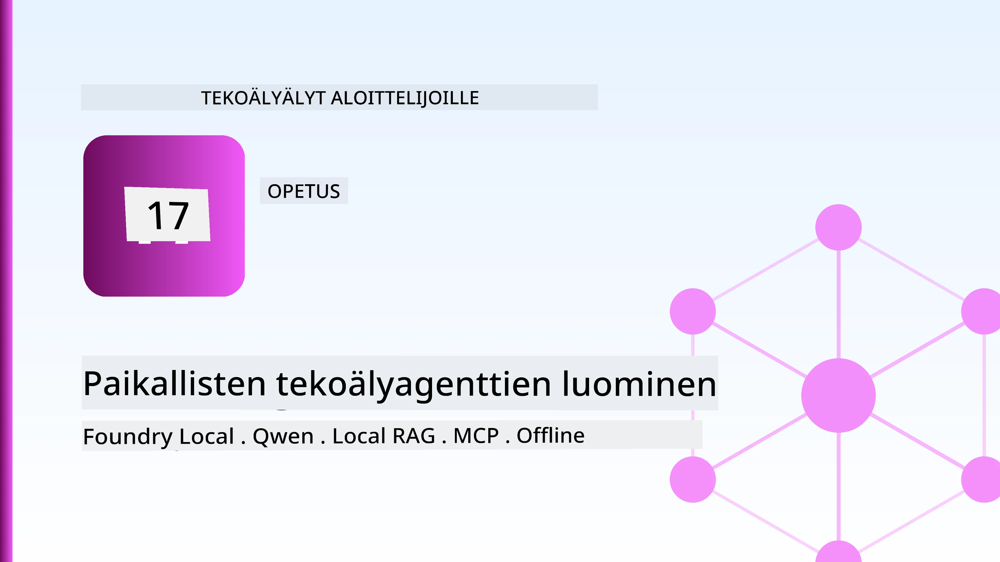
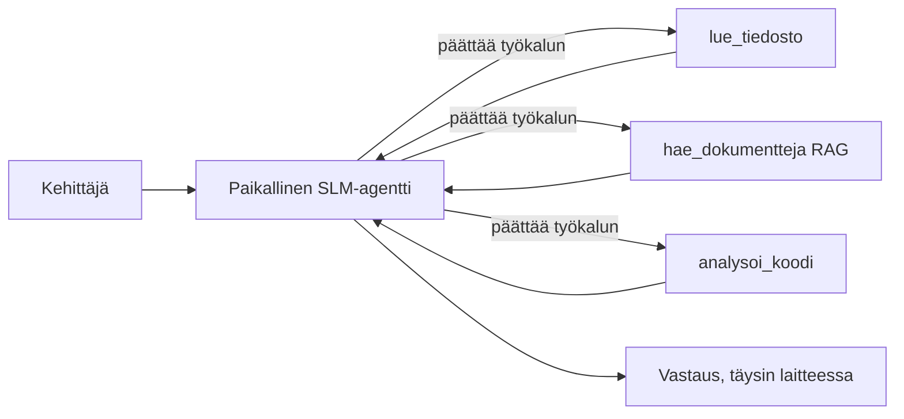
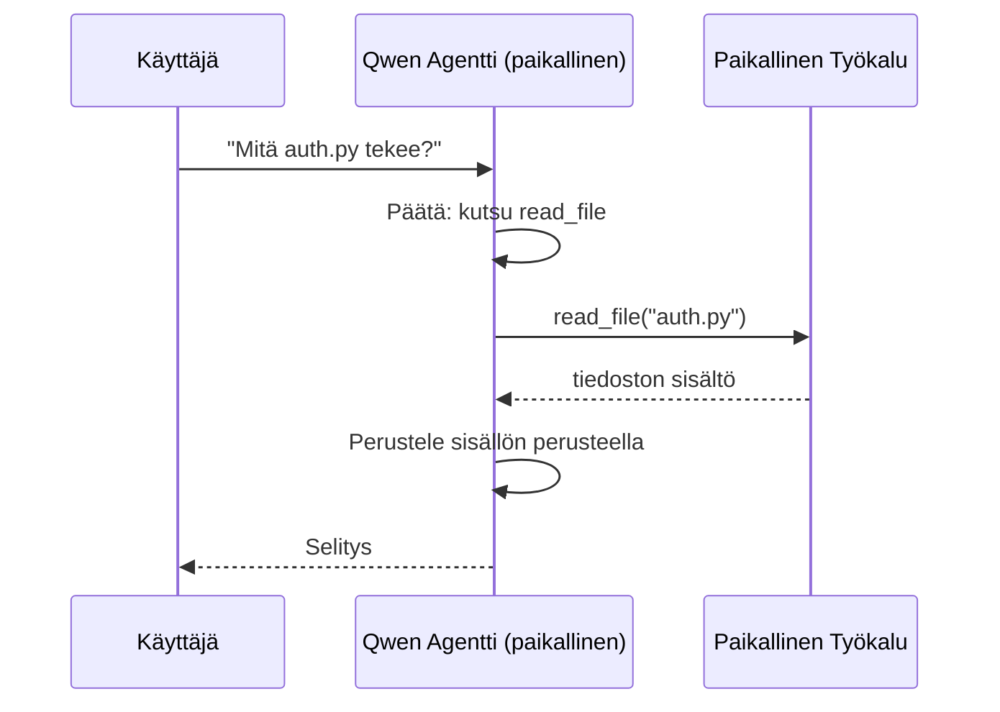
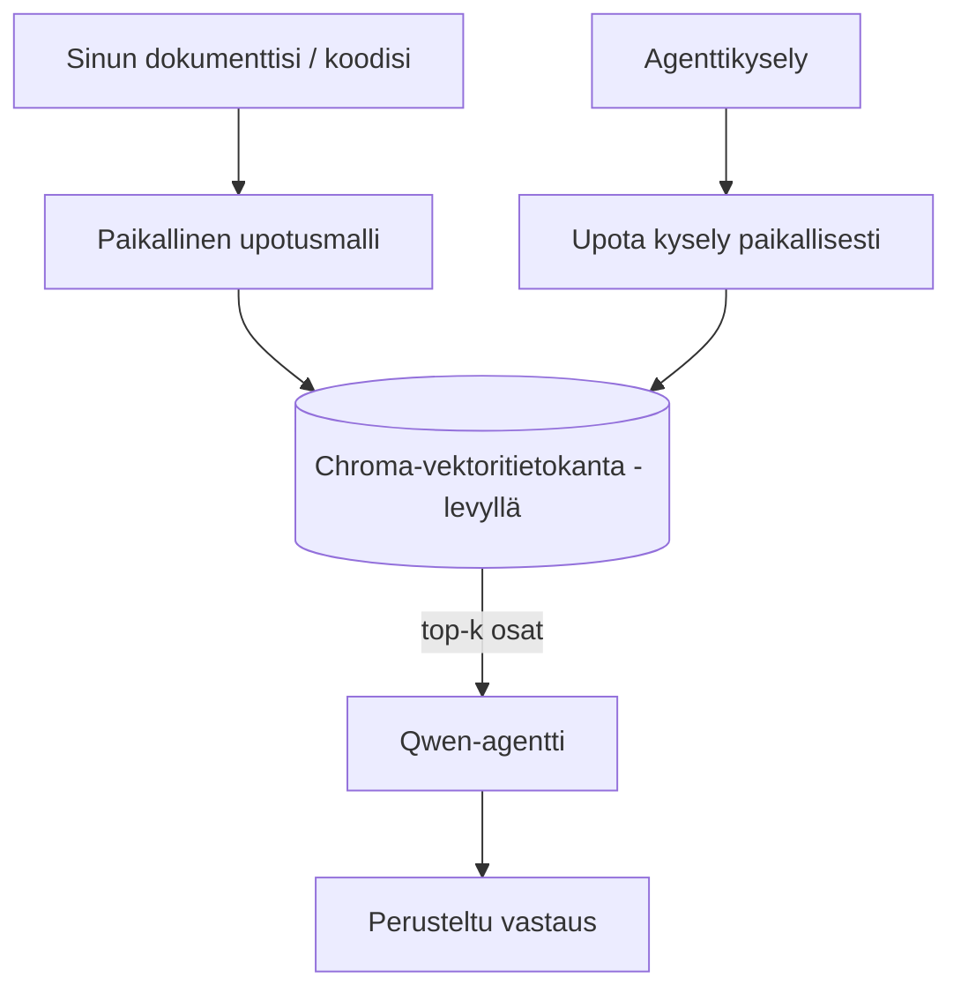
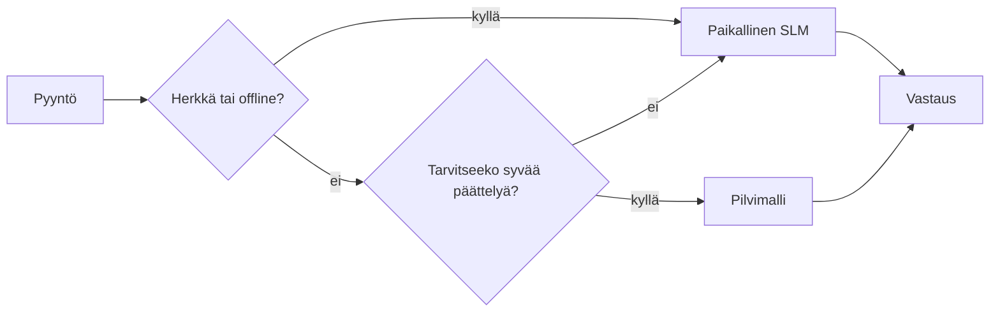

# Paikallisten tekoälyagenttien luominen Microsoft Foundry Localin ja Qwenin avulla



Edellinen oppitunti skaalasi agentteja *pilveen*. Tämä tuo ne *alas* yhdelle koneelle. Lopuksi sinulla on toimiva insinöörin assistentti, joka perustelee, kutsuu työkaluja, lukee tiedostojasi ja etsii dokumentaatiostasi — **ilman yhtään pilvipohjaista päättelykutsua.**

Miksi haluaisit niin? Kolme syytä, jotka nousevat jatkuvasti esiin todellisessa insinöörityössä:

- **Yksityisyys.** Koodi ja dokumentit eivät koskaan poistu koneelta. Ei pyyntöjä, ei katkelmia, ei asiakastietoja ylitä verkkorajaa.
- **Kustannukset.** Paikallinen päätelmä ei laskuta per token. Voit toistaa koko päivän sähköenergian hinnalla.
- **Offline-tila.** Lentokoneessa, turvallisessa tilassa tai sähkökatkon aikana agentti toimii edelleen.

Kiintiönä on, että vaihdat eturivin pilvimallin **pieneen kielimalliin (SLM)**, joka toimii CPU:llasi, GPU:llasi tai NPU:llasi. Tämä oppitunti käsittelee agenttien rakentamista, jotka ovat *hyviä* tämän rajoitteen puitteissa sen sijaan, että teeskentelet ettei rajoitetta ole.

## Johdanto

Tässä oppitunnissa käsitellään:

- **Pienet kielimallit (SLM)** — mitä ne ovat, missä ne loistavat ja missä eivät.
- **Microsoft Foundry Local** — suoritusaikaympäristö, joka lataa ja tarjoaa malleja laitteella **OpenAI-yhteensopivan API:n** kautta.
- **Qwen-funktiokutsumallit** — SLM:t, jotka luotettavasti tuottavat työkalukutsuja, minkä ansiosta paikalliset *agentit* (eivät vain paikallinen keskustelu) ovat mahdollisia.
- **Paikalliset työkalut, paikallinen RAG ja paikallinen MCP** — antavat agentille kyvyn ilman pilveä.
- **Hybridikuviot** — milloin pitää pysyä paikallisena ja milloin käyttää pilveä.

## Oppimistavoitteet

Oppitunnin suorittamisen jälkeen osaat:

- Selittää SLM:ien kompromissit ja valita sopivia paikallisia agenttikäyttötapauksia.
- Tarjota Qwen-malli paikallisesti Foundry Localin avulla ja yhdistää siihen OpenAI-yhteensopivan päätepisteen kautta.
- Rakentaa työkalukutsuvan agentin, joka toimii kokonaan työasemallasi.
- Lisätä paikallinen RAG omiin dokumentteihisi käyttäen paikallista vektoripohjaista tietokantaa (Chroma).
- Yhdistää agentti paikalliseen MCP-palvelimeen ja perustella hybridien paikallisten/pilviarkkitehtuurien valintaa.

## Esitiedot

Tämä oppitunti olettaa, että olet suorittanut aikaisemmat oppitunnit ja olet perehtynyt:

- [Tool Use](../04-tool-use/README.md) (Oppitunti 4) ja [Agentic RAG](../05-agentic-rag/README.md) (Oppitunti 5).
- [Agentic Protocols / MCP](../11-agentic-protocols/README.md) (Oppitunti 11).
- [Microsoft Agent Framework](../14-microsoft-agent-framework/README.md) (Oppitunti 14).

Tarvitset myös:

- Kehittäjän työaseman. **8 GB RAM on realistinen minimi**; 16 GB+ on mukava. GPU tai NPU auttaa mutta ei ole pakollinen.
- **Microsoft Foundry Local** asennettuna (katso asennus alla).
- Python 3.12+ ja repossa olevat paketit [`requirements.txt`](../../../requirements.txt), lisäksi `foundry-local-sdk`, `openai` ja `chromadb` tätä oppituntia varten.

## Pienet Kielimallit: Oikea työkalu paikalliseen työhön

Eturivin pilvimallissa on satoja miljardeja parametreja ja datakeskus takana. SLM:llä on muutama miljardi parametria ja se täytyy mahtua kannettavan tietokoneen muistiin. Tämä ero luo selkeät odotukset.

**SLM:t ovat hyviä:**

- Rakenteelliset, rajalliset tehtävät — luokittelu, tiedon poiminta, tunnetun dokumentin tiivistäminen.
- **Työkalukutsuissa** — päättää, mitä funktiota kutsutaan ja millä argumenteilla.
- Nopea, halpa ja yksityinen iterointi omalla datalla.

**SLM:t ovat heikompia:**

- Avoimet, monivaiheiset päättelyt laajassa kontekstissa.
- Laaja maailmantuntemus (ne ovat nähneet vähemmän ja unohtavat enemmän).

Menestyksen avain paikallisissa agenteissa on siis: **anna SLM:n orkestroida, ja anna työkalujen hoitaa raskas työ.** Mallin ei tarvitse *tuntea* koodikantaasi — sen täytyy tietää milloin kutsua `read_file` ja `search_docs`. Tämä sopii suoraan SLM:n vahvuuksiin.



## Microsoft Foundry Local

**Microsoft Foundry Local** on kevyt suoritusaikaympäristö, joka lataa, hallinnoi ja tarjoaa malleja kokonaan koneellasi. Tärkein ominaisuus meille on, että se tarjoaa **OpenAI-yhteensopivan HTTP-päätepisteen** — mikä tarkoittaa, että OpenAI SDK ja Microsoft Agent Frameworkin OpenAI-asiakas toimivat sen kanssa vain vaihtamalla `base_url`:n. Kaikki agentin rakentamiseen liittyvä oppimasi siirtyy suoraan; vain päätepiste muuttaa pilvestä `localhost`:iin.

Foundry Local valitsee myös automaattisesti parhaan malliversion laitteistollesi — CPU-buildin, CUDA/GPU-buildin tai NPU-buildin — joten sinun ei tarvitse optimoida konetta kohden manuaalisesti.

### Asennus

Asenna Foundry Local (katso [dokumentaatio](https://learn.microsoft.com/azure/ai-foundry/foundry-local/) omalle käyttöjärjestelmällesi), ja tarkista toiminta:

```bash
# Asenna (esimerkki; seuraa alustan ohjeita)
winget install Microsoft.FoundryLocal      # Windows
# brew install microsoft/foundrylocal/foundrylocal   # macOS

# Lataa ja suorita Qwen-malli, käynnistä sitten paikallinen palvelu
foundry model run qwen2.5-7b-instruct
foundry service status
```

Kun palvelu on käynnissä, sinulla on paikallinen, OpenAI-yhteensopiva päätepiste (tyypillisesti `http://localhost:PORT/v1`). Muistikirja käyttää `foundry-local-sdk`:ta löytääkseen päätepisteen automaattisesti, joten porttia ei tarvitse kovakoodata.

## Qwen-funktiokutsu: Miksi se on tärkeä

Agentti on agentti vain jos se voi kutsua työkaluja. Moni SLM voi keskustella mutta tuottaa epäluotettavia, virheellisiä työkalukutsuja. **Qwen**-mallit on koulutettu funktiokutsuihin ja ne tuottavat johdonmukaisia, hyvin muodostettuja työkalukutsurakenteita — ja juuri tämä tekee paikallisesta keskustelumallista paikallisen *agentin*.

Kulku on tuttu työkalukutsusilmukka, mutta se toimii laitteellasi:



## Paikallinen RAG

Dokumentaation haku on se, missä paikalliset agentit ansaitsevat paikkansa. Sen sijaan, että toivoisit SLM:n muistaneen kehyskirjastosi dokumentaation, sijoitat dokumentit **paikalliseen vektoripohjaiseen tietokantaan** ja annat agentin hakea asiaankuuluvat palat tarpeen mukaan.

Käytämme **Chroma**a, upotettua vektorivarastoa, joka toimii prosessin sisällä ilman palvelimen hallintaa. Prosessi on täysin paikallinen: paikallinen upotusmalli → paikalliset vektorit → paikallinen haku → paikallinen SLM.



Tämä on sama Agentic RAG -kuvio kuin Oppitunnissa 5 — ainoa ero, että kaikki komponentit toimivat koneellasi.

## Paikalliset MCP-palvelimet

[MCP](../11-agentic-protocols/README.md) on tiedonsiirtoprotokolla, ei pilvipalvelu. MCP-palvelin voi toimia paikallisena prosessina `stdio`:lla, tarjoten työkaluja agentillesi standardiprotokollan kautta. Tällä voit käyttää uudelleen kasvavaa MCP-palvelimien ekosysteemiä — tiedostojärjestelmän käyttö, git-toiminnot, tietokantakyselyt — täysin offline-tilassa.

Turvallisuusnäkökulma on eri kuin pilvessä, mutta ei poissa: paikallinen MCP-palvelin toimii käyttäjäoikeuksillasi, joten rajoita mitä se voi käsitellä (esim. projektihakemisto, ei koko kotihakemistoasi) ja käsittele sen tulosteita syötteinä tarkistuksen kautta.

## Hybridiset pilvi- ja paikalliskuvio

Paikallinen ei tarkoita vain paikallista. Kypsissä järjestelmissä ohjaus perustuu herkkyyteen ja vaikeuteen:

| Tilanne | Missä toimii |
| --- | --- |
| Herkkä koodi/data tai offline-tila | **Paikallinen SLM** |
| Yksinkertainen, rajallinen tehtävä | **Paikallinen SLM** (halpa, nopea) |
| Vaativa monivaiheinen päättely ei-herkällä datalla | **Pilvimalli** |
| Kaikki sähkökatkon aikana | **Paikallinen SLM** (sujuva vikaantuminen) |

Tämä peilaa **mallin reititystä** Oppitunnista 16 — paitsi että yksi "malleista" on nyt oma koneesi. Vankka rakenne palaa paikalliseen, kun pilvi ei ole käytettävissä, jolloin agentti heikkenee laadullisesti eikä kaadu kokonaan.



## Käytännön harjoitus: Paikallinen insinöörin avustaja

Avaa [`code_samples/17-local-agent-foundry-local.ipynb`](./code_samples/17-local-agent-foundry-local.ipynb) ja käy se läpi. Rakennat **paikallisen insinöörin avustajan**, joka toimii kokonaan työasemallasi ja voi:

1. **Kutsua työkaluja** — Qwen-funktiokutsujen kautta Foundry Localin välityksellä.
2. **Tehdä paikallisia tiedostotoimia** — listata ja lukea tiedostoja projektihakemistossa.
3. **Analysoida koodia** — raportoida perustason mittarit lähdetiedostosta.
4. **Etsiä dokumentaatiosta** — paikallinen RAG dokumenttihakemistolle Chroman avulla.
5. **Käyttää MCP:tä** — yhdistää paikalliseen MCP-palvelimeen (hyväksyen tyylikkään ohituksen, jos palvelin ei ole konfiguroitu).

Pilvijohdannaisia ei käytetä missään vaiheessa.

### Läpi kulku

Avustaja yhdistyy Foundry Localiin OpenAI-yhteensopivan päätepisteen kautta, joten agenttikoodi näyttää lähes yhtä hyvältä kuin pilvioppitunneilla — vain asiakas muuttuu:

```python
from foundry_local import FoundryLocalManager
from openai import OpenAI

# Foundry Local löytää/lataa mallin ja antaa meille paikallisen päätepisteen.
manager = FoundryLocalManager(\"qwen2.5-7b-instruct\")
client = OpenAI(base_url=manager.endpoint, api_key=manager.api_key)  # api_key on paikallinen paikkamerkki
```

Työkalut ovat tavallisia Python-funktioita, jotka on rajattu projektihakemistoon:

```python
def read_file(path: str) -> str:
    \"\"\"Read a file, but only inside the sandboxed project directory.\"\"\"
    full = (PROJECT_ROOT / path).resolve()
    if PROJECT_ROOT not in full.parents and full != PROJECT_ROOT:
        return \"Access denied: path is outside the project directory.\"
    return full.read_text(encoding=\"utf-8\")
```

Huomaa hiekkalaatikkotarkistus — vaikka paikallisesti, työkalu, joka lukee mielivaltaisia polkuja, on riski. Muistikirja pitää kaikki työkalut rajattuina yhteen projektiin.

## Tietämystesti

Testaa ymmärryksesi ennen tehtäviin siirtymistä.

**1. Anna kaksi konkreettista syytä ajaa agentti paikallisesti pilven sijaan.**

<details>
<summary>Vastaus</summary>

Kaksi mistä tahansa: **yksityisyys** (koodi ja data eivät koskaan poistu koneelta), **kustannukset** (ei laskutusta per token) ja **offline-toimivuus** (toimii ilman verkkoa — lentokoneessa, turvallisessa tilassa tai sähkökatkon aikana). Yksityisyyssyynä on usein sääntely, joka kieltää datan lähettämisen laitteen ulkopuolelle.
</details>

**2. Mikä on suositeltu työnjako SLM:n ja sen työkalujen välillä paikallisessa agentissa, ja miksi?**

<details>
<summary>Vastaus</summary>

Anna SLM:n **orkestroida** (päätellä, mitä työkalua kutsutaan ja millä argumenteilla) ja anna **työkalujen tehdä raskas työ** (lukeminen, dokumenttien hakeminen, tulosten laskeminen). SLM:t ovat hyviä rajoitettuihin päätöksiin kuten työkalun valintaan, mutta heikompia laajassa tiedossa ja pitkissä monivaiheisissa päättelyissä, joten työkalujen käyttäminen hyödyntää niiden vahvuuksia.
</details>

**3. Mikä tekee mahdolliseksi pilviagenttikoodin uudelleenkäytön Foundry Localin kanssa?**

<details>
<summary>Vastaus</summary>

Foundry Local tarjoaa **OpenAI-yhteensopivan HTTP-päätepisteen**. OpenAI SDK ja Agent Frameworkin OpenAI-asiakas toimivat sen kanssa vaihtamalla vain `base_url`:n (ja käyttämällä paikallista paikantimen API-avainta). Muuten agenttikoodi pysyy samana.
</details>

**4. Miksi käytämme nimenomaan Qwen-funktiokutsumallia eikä mitä tahansa SLM:ää?**

<details>
<summary>Vastaus</summary>

Koska agentin täytyy tuottaa luotettavia ja hyvin muodostettuja **työkalukutsuja**. Monet SLM:t voivat keskustella, mutta tuottavat virheellisiä tai epäjohdonmukaisia työkalukutsurakenteita. Qwen-mallit on koulutettu funktiokutsuihin ja ne tuottavat johdonmukaisia työkalukutsuja, mikä muuttaa paikallisen keskustelumallin toimivaksi paikalliseksi agentiksi.
</details>

**5. Mitkä komponentit paikallisessa RAG-putkessa toimivat koneella?**

<details>
<summary>Vastaus</summary>

Kaikki: upotusmalli, vektoripohjainen tietokanta (Chroma, levyllä), hakuvaihe ja SLM. Dokumentit upotetaan paikallisesti, tallennetaan paikallisesti, haetaan paikallisesti ja niistä päättelyä tekee paikallinen malli — mikään komponentti ei kosketa pilveä.
</details>

**6. Jos paikallinen MCP-palvelin toimii koneellasi, tekeekö se siitä automaattisesti turvallisen? Mitä varotoimia kannattaa silti noudattaa?**

<details>
<summary>Vastaus</summary>

Ei. Paikallinen MCP-palvelin toimii käyttäjäoikeuksillasi, joten se voi käsitellä mitä sinä voit. Rajoita sen oikeudet tarvittavaan (esim. yksi projektihakemisto, ei koko kotihakemistoasi) ja käsittele sen tuottamat tiedot syötteinä, jotka validoit ennen käyttöä.
</details>

**7. Kuvaile järkevä hybridireitityssääntö, joka sisältää paikallisen mallin.**

<details>
<summary>Vastaus</summary>

Reititä herkkä tai offline-pyyntö paikalliselle SLM:lle; reititä yksinkertaiset rajalliset tehtävät paikalliselle SLM:lle nopeuden ja kustannusten vuoksi; reititä vaikea monivaiheinen päättely ei-herkällä datalla pilvimallille; ja palaa paikalliseen SLM:ään jos pilvi ei ole käytettävissä, jolloin agentti heikkenee tyylikkäästi eikä epäonnistu kokonaan. Tämä on mallin reititystä (Oppitunti 16), jossa paikallinen kone on yksi malleista.
</details>

**8. Mikä on realistinen vähimmäismuisti paikallisen agentin ajamiseen tässä oppitunnissa, ja mitä enemmän muisti tarjoaa?**

<details>
<summary>Vastaus</summary>

Noin **8 GB** on realistinen minimi; 16 GB+ on mukava. Enemmän muistia mahdollistaa suurempien, kyvykkäämpien mallien ajon ja enemmän kontekstin muistamisen. GPU tai NPU nopeuttaa päättelyä mutta ei ole pakollinen — Foundry Local valitsee CPU-buildin, jos kiihdytintä ei ole saatavilla.
</details>

## Tehtävä

Laajenna paikallista insinöörin assistenttia **paikalliseksi dokumenttien tarkastajaksi** pienelle valitsemallesi projektille (voit käyttää tätä repo-kansion oppitunnin kansiota, jos haluat).

Palautuksesi tulisi:

1. **Indeksoida oikea dokumentti-/koodihakemisto** Chromaan (vähintään viisi tiedostoa).
2. **Lisätä `find_todos`-työkalu**, joka skannaa projektista `TODO`/`FIXME`-kommentit ja palauttaa ne tiedoston ja rivinumeron kanssa — säilyttäen saman hiekkalaatikkotarkistuksen kuin `read_file`.

3. **Kysy agentilta kolme kysymystä**, jotka pakottavat sen yhdistämään työkaluja: yksi puhdas RAG-kysymys, yksi joka vaatii tietyn tiedoston lukemista, ja yksi joka vaatii TODO-kohteiden löytämistä.
4. **Mittaa se**: aikata kolme vastausta ja kirjaa ne muotoilusoluun. Kommentoi, onko viive hyväksyttävä suunnitellussa työnkulussasi.

Kirjoita sitten lyhyt kappale siitä, **mitä siirtäisit pilveen ja mitä pitäisit paikallisena** tälle arvioijalle ja miksi. Sinua arvioidaan sen perusteella, onko paikalliset komponentit kytketty oikein ja ovatko hybridiratkaisusi järkeviä — ei mallin laadun perusteella.

## Yhteenveto

Tässä oppitunnissa rakensit agentin, joka toimii kokonaan omalla koneellasi:

- **SLM:t** vaihtavat laajuutta yksityisyyteen, kustannuksiin ja offline-käyttöön — ja loistavat, kun ne **orkestroivat työkaluja** sen sijaan, että kantaisivat kaiken tiedon itse.
- **Foundry Local** palvelee malleja laitteella OpenAI-yhteensopivan päätepisteen takana, joten pilviagenttikoodisi siirtyy yhdellä rivillä.
- **Qwen-funktiokutsumallit** tekevät luotettavan paikallisen työkalukutsun — ja siten paikalliset *agentit* — mahdolliseksi.
- **Paikallinen RAG** (Chroma) ja **paikallinen MCP** antavat agentille kyvykkyyden ilman koneelta poistumista.
- **Hybridimallit** antavat reitityksen herkkyyden ja vaikeuden mukaan, paikallinen on sujuva varajärjestelmä.

Tämä päättää käyttöönoton: Oppitunti 16 suurensi agentteja Microsoft Foundryyn, ja tämä oppitunti pienensi niitä yhdelle työasemalle. Seuraava oppitunti käsittelee käyttöönotettujen agenttien turvallisuuden varmistamista.

## Lisäresurssit

- <a href="https://learn.microsoft.com/azure/ai-foundry/foundry-local/" target="_blank">Microsoft Foundry Local -dokumentaatio</a>
- <a href="https://learn.microsoft.com/azure/ai-foundry/what-is-azure-ai-foundry" target="_blank">Microsoft Foundry -dokumentaatio</a>
- <a href="https://aka.ms/ai-agents-beginners/agent-framework" target="_blank">Microsoft Agent Framework</a>
- <a href="https://qwen.readthedocs.io/en/latest/framework/function_call.html" target="_blank">Qwen-funktiokutsudokumentaatio</a>
- <a href="https://modelcontextprotocol.io/" target="_blank">Model Context Protocol (MCP)</a>
- <a href="https://docs.trychroma.com/" target="_blank">Chroma-vektoritietokanta</a>

## Edellinen oppitunti

[Skalautuvien agenttien käyttöönotto](../16-deploying-scalable-agents/README.md)

## Seuraava oppitunti

[AI-agenttien turvallisuuden varmistaminen](../18-securing-ai-agents/README.md)

---

<!-- CO-OP TRANSLATOR DISCLAIMER START -->
**Vastuuvapauslauseke**:
Tämä asiakirja on käännetty käyttämällä tekoälypohjaista käännöspalvelua [Co-op Translator](https://github.com/Azure/co-op-translator). Vaikka pyrimme tarkkuuteen, otathan huomioon, että automaattiset käännökset saattavat sisältää virheitä tai epätarkkuuksia. Alkuperäinen asiakirja sen alkuperäiskielellä on virallinen lähde. Tärkeissä asioissa suositellaan ammattimaista ihmiskäännöstä. Emme ole vastuussa tämän käännöksen käytöstä aiheutuvista väärinymmärryksistä tai tulkinnoista.
<!-- CO-OP TRANSLATOR DISCLAIMER END -->