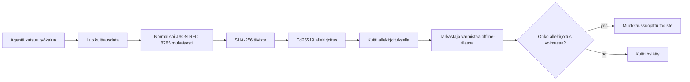
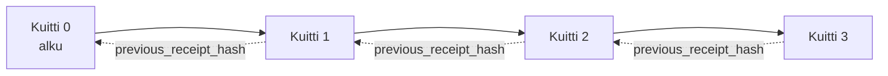

[Katso oppituntivideo: Turvaaminen tekoäly agenteille kryptografisilla kuiteilla](https://youtu.be/PLACEHOLDER_VIDEO_ID)

> _(Oppituntivideo ja pikkukuva lisätään Microsoftin sisältötiimin toimesta yhdistämisen jälkeen, vastaamaan oppituntien 14 / 15 kaavaa.)_

# Tekoälyagenttien turvaaminen kryptografisilla kuiteilla

## Johdanto

Tässä oppitunnissa käsitellään:

- Miksi tekoälyagenttien tarkastuslokeilla on merkitystä vaatimustenmukaisuuden, virheenkorjauksen ja luottamuksen kannalta.
- Mikä kryptografinen kuitti on ja miten se eroaa allekirjoittamattomasta lokirivistä.
- Kuinka tuottaa allekirjoitettu kuitti agentin työkalukutsusta puhtaalla Pythonilla.
- Kuinka vahvistaa kuitti offline-tilassa ja havaita manipuloinnit.
- Kuinka ketjuttaa kuitteja niin, että yhden poistaminen tai uudelleenjärjestely katkaisee ketjun.
- Mitä kuitit todistavat ja mitä ne nimenomaan eivät todista.

## Oppimistavoitteet

Oppitunnin jälkeen osaat:

- Tunnistaa epäonnistumistilat, jotka motivoivat kryptografista alkuperän todentamista agenttitoiminnoille.
- Tuottaa Ed25519-allekirjoitetun kuitin kanonisesta JSON-payloadista.
- Vahvistaa kuitin itsenäisesti käyttäen vain allekirjoittajan julkista avainta.
- Havainnoida manipuloinnit suorittamalla vahvistus uudelleen muokatuilla kuiteilla.
- Rakentaa hajautusketjutettu kuitujono ja selittää, miksi ketju on tärkeä.
- Tunnistaa raja, jonka sisällä kuitit todistavat (attribuutio, eheys, järjestys) ja mitä ne eivät todista (toiminnon oikeellisuus, politiikan pätevyys).

## Ongelma: Agenttisi tarkastusloki

Kuvittele, että olet ottanut käyttöön tekoälyagentin Contoso Travelille. Agentti lukee asiakaspyynnöt, kutsuu lentojen APIa etsiäkseen vaihtoehtoja ja varaa paikkoja asiakkaan puolesta. Viime neljänneksellä agentti käsitteli 50 000 varausta.

Tänään tarkastaja saapuu. Hän esittää yksinkertaisen kysymyksen: "Näytä minulle, mitä agenttisi teki."

Luovutat lokitiedostosi. Tarkastaja katsoo niitä ja esittää vaikeamman kysymyksen: "Mistä tiedän, ettei näitä lokeja ole muokattu?"

Tämä on tarkastuslokiongelma. Suurin osa agenttien käyttöönotosta perustuu nykyään:

- **Sovelluslokit**: agentin itsensä kirjoittamia, muokattavissa kuka tahansa, jolla on tiedostojärjestelmän käyttöoikeus.
- **Pilvilokinpalvelut**: alustatasolla havaittavia manipulaatioita, mutta vain jos tarkastaja luottaa alustan ylläpitäjään.
- **Tietokantatapahtumalokit**: sopivia tietokantamuutoksiin, mutta eivät satunnaisiin työkalukutsuihin.

Mikään näistä ei voi vastata tarkastajan kysymykseen ilman, että tarkastajan täytyy luottaa johonkin (sinuun, pilvipalveluntarjoajaasi, tietokantavalmistajaasi). Sisäiseen käyttöön tämä luottamus on usein hyväksyttävää. Säännellyissä työkuormissa (rahoitus, terveydenhuolto, kaiken EU:n tekoälyasetuksen alaisena) se ei ole.

Kryptografiset kuitit ratkaisevat tämän tekemällä jokaisesta agentin toiminnosta itsenäisesti varmennettavan. Tarkastajan ei tarvitse luottaa sinuun. Tarvitaan vain julkinen avain ja kuitti itse.

## Mikä on kryptografinen kuitti?

Kuitti on JSON-objekti, joka tallentaa agentin tekemän toimen, allekirjoitettuna digitaalisella allekirjoituksella.



Pienin kuitti näyttää tältä:

```json
{
  "type": "agent.tool_call.v1",
  "agent_id": "contoso-travel-bot",
  "tool_name": "lookup_flights",
  "tool_args_hash": "sha256:a3f9c1...",
  "result_hash": "sha256:7b2e1d...",
  "policy_id": "contoso-travel-policy-v3",
  "timestamp": "2026-04-25T14:30:00Z",
  "sequence": 47,
  "previous_receipt_hash": "sha256:9d4e6a...",
  "signature": {
    "alg": "EdDSA",
    "sig": "c5af83...",
    "public_key": "8f3b2c..."
  }
}
```

Kolme ominaisuutta tekevät työn:

1. **Allekirjoitus**. Kuitti allekirjoitetaan agentin portin toimesta Ed25519-avaimella. Kenellä tahansa, jolla on vastaava julkinen avain, on mahdollisuus vahvistaa allekirjoitus offline-tilassa. Kenttien manipulointi mitätöi allekirjoituksen.

2. **Kanoninen koodaus**. Ennen allekirjoitusta kuitti serialisoidaan JSON Canonicalization Scheme (JCS, RFC 8785) -standardin mukaisesti. Tämä takaa, että kaksi eri toteutusta, jotka tuottavat saman loogisen kuitin, tuottavat täysin identtisen tavujonon. Ilman kanonisoimista eri JSON-serialisoijat tuottaisivat eri allekirjoituksia samalle sisällölle.

3. **Hajautusketjutus**. `previous_receipt_hash` -kenttä linkittää jokaisen kuitin edeltäjäänsä. Yhden kuitin poistaminen tai uudelleenjärjestely rikkoo kaikki sen jälkeiset kuitit. Manipuloinnit näkyvät ketjutasolla vaikka yksittäiset allekirjoitukset ohitettaisiin.

Yhdessä nämä ominaisuudet tarjoavat kolme takuita:

- **Attribuutio**: tämä avain allekirjoitti tämän sisällön.
- **Eheys**: sisältö ei ole muuttunut allekirjoittamisen jälkeen.
- **Järjestys**: tämä kuitti tuli ketjussa sen kuitin jälkeen.

## Kuittien tuottaminen Pythonissa

Kuittia varten ei tarvita erikoiskirjastoa. Kryptografiset peruskomponentit ovat laajalti saatavilla ja logiikka on muutaman kymmenen rivin Python-koodia.

Käytännön harjoitukset `code_samples/18-signed-receipts.ipynb` kävelevät koko prosessin läpi. Yhteenveto:

```python
import json
import hashlib
import base64
from nacl import signing
from jcs import canonicalize  # RFC 8785 kanoninen JSON

def b64url_nopad(data: bytes) -> str:
    return base64.urlsafe_b64encode(data).decode("ascii").rstrip("=")

def sha256_canonical(obj) -> str:
    """SHA-256 of a Python object's JCS-canonical JSON form."""
    return f"sha256:{hashlib.sha256(canonicalize(obj)).hexdigest()}"

# Luo tai lataa allekirjoitusavain (tuotannossa, säilytä avain holvissa)
signing_key = signing.SigningKey.generate()
verify_key = signing_key.verify_key

# Rakenna kuittausmaksu (ei vielä allekirjoitusta)
tool_args = {"origin": "SYD", "destination": "LAX"}
tool_result = [{"flight": "QF11", "price": 1850, "stops": 0}]

payload = {
    "type": "agent.tool_call.v1",
    "agent_id": "contoso-travel-bot",
    "tool_name": "lookup_flights",
    "tool_args_hash": sha256_canonical(tool_args),
    "result_hash": sha256_canonical(tool_result),
    "policy_id": "contoso-travel-policy-v3",
    "timestamp": "2026-04-25T14:30:00Z",
    "sequence": 0,
    "previous_receipt_hash": None,
}

# Kanonisoi, hajauta, allekirjoita.
canonical_bytes = canonicalize(payload)
message_hash = hashlib.sha256(canonical_bytes).digest()
signature_bytes = signing_key.sign(message_hash).signature

# Liitä rakenteellinen allekirjoitusobjekti.
receipt = {
    **payload,
    "signature": {
        "alg": "EdDSA",
        "sig": b64url_nopad(signature_bytes),
        "public_key": b64url_nopad(bytes(verify_key)),
    },
}
```

Tämä on koko allekirjoitusputki. Muistikirjan harjoitukset esittelevät jokaisen vaiheen.

## Kuitin vahvistaminen ja manipuloinnin havaitseminen

Vahvistaminen on päinvastainen operaatio:

```python
import base64
import hashlib
from nacl import signing
from nacl.exceptions import BadSignatureError
from jcs import canonicalize

def b64url_decode(s: str) -> bytes:
    padding = "=" * ((4 - len(s) % 4) % 4)
    return base64.urlsafe_b64decode(s + padding)

def verify_receipt(receipt: dict) -> bool:
    # Allekirjoitus on jäsennelty objekti: {"alg", "sig", "public_key"}.
    sig_obj = receipt.get("signature")
    if not sig_obj or sig_obj.get("alg") != "EdDSA":
        return False

    # Rakenna uudelleen varsinainen allekirjoitettava sisältö (kaikki paitsi allekirjoitus).
    payload = {k: v for k, v in receipt.items() if k != "signature"}

    canonical_bytes = canonicalize(payload)
    message_hash = hashlib.sha256(canonical_bytes).digest()

    try:
        verify_key = signing.VerifyKey(b64url_decode(sig_obj["public_key"]))
        verify_key.verify(message_hash, b64url_decode(sig_obj["sig"]))
        return True
    except BadSignatureError:
        return False
```

Tämä funktio ottaa kuitin ja palauttaa `True`, jos allekirjoitus on validi, muuten `False`. Ei verkkokutsua, ei palveluriippuvuutta, ei kolmannen osapuolen luottamusta.

Näyttämään, miten manipuloinnin havaitseminen toimii, muistikirja käy läpi:

1. Validin kuitin tuottaminen ja sen vahvistuksen varmistaminen.
2. Yhden tavun muokkaaminen `tool_args_hash` -kentässä.
3. Vahvistuksen suorittaminen uudestaan ja epäonnistumisen todistaminen.

Tämä on käytännön demonstraatio siitä, että kuitit ovat manipulaatioita vastaan suojaavia: mikä tahansa muutos, kuinka pieni tahansa, rikkoo allekirjoituksen.

## Kuittien ketjuttaminen monivaiheisille agenteille

Yksi allekirjoitettu kuitti suojaa yhtä toimintoa. Kuituketju suojaa toimintojen sarjaa.



Jokainen kuitti tallentaa edellisen kuitin hajautuksen. Jos hyökkääjä poistaisi kuitin 2 hiljaisesti, hänen täytyisi joko:

- Muokata kuitin 3 `previous_receipt_hash` -kenttää (rikkoutuu kuitin 3 allekirjoitus) TAI
- Väärennellä uusi allekirjoitus muokatulle kuittille 3 (vaatii agentin yksityisen avaimen).

Jos yksityinen avain on laitteistopohjaisessa avainholvissa ja julkinen avain julkaistaan jokaisen kuitin mukana, kumpikaan hyökkäys ei ole havaittamaton.

Muistikirja käy läpi seuraavat:

1. Kolmen kuitin ketjun rakentamisen.
2. Todenna, että kunkin kuitin `previous_receipt_hash` vastaa edellisen kuitin todellista hajautusarvoa.
3. Muokkaa keskellä olevaa kuittia ja katso, miten ketju katkeaa juuri siinä kohtaa.

Näin tuot auditointilokin, jonka ulkopuolinen tarkastaja voi varmentaa luottamatta sinuun.

## Mitä kuitit todistavat (ja mitä ne eivät todista)

Tämä on tämän oppitunnin tärkein osio. Kuitit ovat tehokkaita, mutta niiden voima on rajallinen.

**Kuitit todistavat kolme asiaa:**

1. **Attribuutio**: tietty avain allekirjoitti tietyn payloadin.
2. **Eheys**: payload ei ole muuttunut allekirjoittamisen jälkeen.
3. **Järjestys**: tämä kuitti tuli sen kuitin jälkeen hajautusketjussa.

**Kuitit EIVÄT todista:**

1. **Oikeellisuus**: että agentin toiminto oli oikea toiminto. Kuitti voidaan allekirjoittaa väärälle vastaukselle yhtä puhtain konstein kuin oikealle.
2. **Politiikan noudattaminen**: että `policy_id`-kentässä viitattu politiikka todella arvioitiin tai että se olisi sallinut tämän toiminnon, jos olisi tarkistettu. Kuitti tallentaa mitä väitettiin, ei mitä toteutettiin.
3. **Identiteetti avaimen ulkopuolella**: kuitti sanoo "tämä avain allekirjoitti tämän sisällön." Se ei sanou "tämä ihminen valtuutti tämän." Avain voidaan yhdistää henkilöön tai organisaatioon vain erillisellä tunnistusjärjestelmällä (hakemisto, julkisen avaimen rekisteri jne.).
4. **Syötteiden totuudenmukaisuus**: jos agentti saa manipuloidun kehotteen ja toimii sen mukaan, kuitti tallentaa toiminnon uskollisesti. Kuitit ovat syötteen validoinnin jälkeisiä, eivät sen korvaavia.

Tämä raja on tärkeä kahdesta syystä:

- Se kertoo, mihin kuitit soveltuvat: agentin käyttäytymisen auditointiin ja manipulointien havaitsemiseen, myös organisaatiorajojen yli.
- Se kertoo, mitä lisäkerroksia edelleen tarvitaan: syötteen validointi (oppitunti 6), politiikan siirtyminen (käsitelty tiiviisti alla) ja tunnistusjärjestelmät (ei tämän oppitunnin aihe).

Yleinen virhe on olettaa, että "meillä on kuitit" tarkoittaa "meitä säännellään." Näin ei ole. Kuitit ovat perusta. Hallinto on järjestelmä, jonka rakennat tämän päälle.

## Todistaminen, että ihminen hyväksyi tarkalleen toiminnon

Kohta 3 edellä ansaitsee oman osionsa: toimintakuitti sanoo "tämä avain allekirjoitti tämän sisällön," ei koskaan "ihminen valtuutti tämän." Korkean riskin toiminnoissa (hyvitykset, poistot, tilisiirrot) hallintakehykset vaativat yhä useammin juuri tämän puuttuvan lausuman, ja se voidaan tuottaa samoilla perustoiminnoilla, jotka rakensit tässä oppitunnissa.

Seuraava muistikirja `code_samples/human-authorization-receipts.ipynb` lisää toisen kuittilajin, `human.approval.v1`, samanlaisessa kuorimuodossa kuin tämän oppitunnin kuitit (tyypitetty payload, allekirjoitettu Ed25519:llä kanonisesta SHA-256:sta, jossa `signature` on allekirjoitettujen tavujen ulkopuolella). Nimeltä mainittu hyväksyjä allekirjoittaa **kokonaisen kanonisen toiminnon ja sen tiivisteen** ennen suorittamista; agentin toimintakuitti kantaa **saman toimintatiivisteen** ja parent_approval_ref:n, hyväksynnän kuitin tiivisteen, saman konvention kuin `previous_receipt_hash` ketjussa, jonka rakensit ylhäällä. Yksi `verify_chain` suorittaa molemmat artefaktit **erillisissä kiinnitetyissä avainrekistereissä** (hyväksyjien avaimet vs agenttien avaimet), joten koodipolku on jaettu, mutta valtuudet eivät ole.

Ominaisuus, jonka tämä ostaa, jonka ilmaisee tarkasti: *ihminen hyväksyi tämän tarkalleen toiminnon, ja agentti suoritti juuri sen hyväksytyn toiminnon.* Muistikirjan kieltomekanismit ovat ne, jotka tekevät ominaisuudesta todellisen, eivät pelkän väitteen:

- klassinen setti: manipulointi, sekoittunut sijainen, uudelleensoitto, väärennetyt avaimet kummallakin puolella, väärän muodon syöte;
- **vanhentunut valtuutus**: allekirjoitus, joka edelleen validoituu, mutta hylätään koska politiikan versio on muuttunut, hyväksyjän avain on poistettu kiinnitetyistä rekistereistä tai hyväksyntä on vanhentunut ennen suoritusta;
- **tiivisteen vaihto**: validisti allekirjoitettu toimintakuitti, joka osoittaa *todelliseen* hyväksyntään, joka sitoo *toisen* kanonisen toiminnon.

Jokainen epäonnistuminen hylätään eri syystä, joten tarkastaja lukemassa kieltoa pystyy erottamaan, johtuuko se henkilön valtuutuksen vanhentumisesta vai toiminnon muuttumisesta. Oppikirjan sääntö: allekirjoitettu hyväksyntä ei ole valtuutus sellaisenaan. Valtuutus on olemassa vain, jos molemmat kuitit sitoutuvat samaan kanoniseen toimintaan suorituksen aikaan. Samassa Internet-Draftissa, jota tämä oppitunti seuraa (`draft-farley-acta-signed-receipts`), yhteisallekirjoitusreitti on tämän kaavan standardirakenteen muoto.

## Tuotantoviitteet

Tämän oppitunnin Python-koodi on tarkoituksella minimaalista, jotta voit lukea jokaisen rivin ja ymmärtää tarkalleen, mitä tapahtuu. Tuotannossa sinulla on kaksi vaihtoehtoa:

1. **Rakenna suoraan kryptografisten primitiivien päälle.** Yllä nähty 50 riviä riittää moniin käyttötarkoituksiin. PyNaCl (Ed25519) ja `jcs`-paketti (kanoninen JSON) ovat hyvin ylläpidettyjä ja auditoituja kirjastoja.

2. **Käytä tuotantovalmiita kuittikirjastoja.** Useat avoimen lähdekoodin projektit toteuttavat saman kaavan lisäominaisuuksilla (avainten kierto, erävarmennus, JWK-setin jakelu, integraatio politiikkamoottoreihin):
   - Tässä oppitunnissa käytetty kuittimuoto seuraa IETF Internet-Draftia ([`draft-farley-acta-signed-receipts`](https://datatracker.ietf.org/doc/draft-farley-acta-signed-receipts/), revisio 02), joka on parhaillaan standardiprosessissa, ja jolla on yhteinen yhteensopivuussarja ([agent-governance-testvectors](https://github.com/ScopeBlind/agent-governance-testvectors)), jota riippumattomat toteutukset ristiinvarmentavat tavujonoidenttisen kanonisen tuloksen varmistamiseksi.
   - Microsoft Agent Governance Toolkit yhdistää kuitit Cedar-pohjaisiin politiikkapäätöksiin; katso tuon varaston opastus 33 täydellisen esimerkin saamiseksi.
   - `protect-mcp` (npm) ja `@veritasacta/verify` (npm) paketit tarjoavat Node-pohjaisen toteutuksen kuittien allekirjoitukseen ja offline-varmennukseen, tarkoitettu minkä tahansa MCP-palvelimen kääreeksi manipulaatioita havaitsevalla auditointilogilla, mukaan lukien "pidetty yhteisallekirjoitus" työnkulku, jossa pysäytetty toiminto lähettää hyväksyntäkuitin sidottuna toimintotiivisteeseen (WebAuthn-tuettu työpöytävirtaus); sama hyväksyntäkuittikaava kuin yllä mainitussa ihmisen valtuutusmuistikirjassa.
   - **[nobulex](https://github.com/arian-gogani/nobulex)** Python SDK (`pip install nobulex`) tarjoaa saman Ed25519 + JCS allekirjoituskaavan Pythonissa LangChain- ja CrewAI-integroinneilla, mukaan lukien julkaistut ristiinvalidointitestivektorit ja OWASP PR #2210:n kautta lahjoitettu vaatimustenmukaisuuskartoitus.

Päätös rakentaa itse tai käyttää kirjastoa muistuttaa valintaa JWT-kirjaston kirjoittamisen ja testatun kirjaston käytön välillä: molemmat ovat perusteltuja; kirjasto säästää aikaa ja vähentää auditointipinta-alaa; itse tehty polku pakottaa ymmärtämään jokaisen primitiivin. Tämä oppitunti opettaa itse tehdyn polun, jotta sinulla on perusta kumpaankin vaihtoehtoon.

## Tietotarkistus

Testaa ymmärrystäsi ennen käytännön harjoitusta.

**1. Kuitti allekirjoitetaan agentin yksityisellä Ed25519-avaimella. Tarkastajalla on vain julkinen avain. Voiko tarkastaja vahvistaa kuitin offline-tilassa?**

<details>
<summary>Vastaus</summary>

Kyllä. Ed25519-varmennukseen tarvitaan vain julkinen avain ja allekirjoitetut tavut. Ei verkkokutsua, ei palveluriippuvuutta. Tämä ominaisuus tekee kuiteista hyödyllisiä ilmakytkennöissä, moniorganisaatioympäristöissä tai vähäluottamuksisissa tarkastustilanteissa.
</details>

**2. Hyökkääjä muuttaa kuitin `policy_id`-kentän väittääkseen, että sitä säätelee sallivampi politiikka. Allekirjoitus oli alkuperäisen payloadin ylitse. Mitä vahvistuksen aikana tapahtuu?**

<details>
<summary>Vastaus</summary>


Varmennus epäonnistuu. Allekirjoitus laskettiin alkuperäisen hyötykuorman kanonisista tavuista; minkä tahansa kentän muuttaminen muuttaa kanonisia tavuja, mikä muuttaa SHA-256-tiivistettä, mikä tekee allekirjoituksesta virheellisen. Hyökkääjä tarvitsisi yksityisen avaimen tuottaakseen uuden kelvollisen allekirjoituksen, jota heillä ei ole.
</details>

**3. Miksi kuitti sisältää kentät `tool_args_hash` ja `result_hash` sen sijaan, että se sisältäisi raakat argumentit ja tuloksen?**

<details>
<summary>Vastaus</summary>

Kaksi syytä. Ensinnäkin kuitti saatetaan joutua arkistoimaan tai siirtämään ympäristöissä, joissa raakadatan (henkilötiedot, liiketoimintadata) vuotaminen on ongelma. Tiivistelmä pitää kuitin pienenä ja sisällön yksityisenä; tarkastaja varmistaa, että tiiviste vastaa erikseen tallennettua varsinaista sisältöä. Toiseksi tiivisteillä on kiinteä koko; kuitti, joka sisältää tiivisteitä, on kooltaan rajallinen riippumatta siitä, kuinka suuret syötteet ja tulokset olivat.
</details>

**4. Kenttä `previous_receipt_hash` linkittää jokaisen kuitin edeltäjäänsä. Mitä käy vikaan, jos hyökkääjä poistaa hiljaa yhden kuitin ketjun keskeltä?**

<details>
<summary>Vastaus</summary>

Kaikki kuitit, jotka tulivat poistettua jälkeen. Niiden `previous_receipt_hash` -kentät eivät enää vastaa todellista ketjua (koska viitattu kuitti ei enää ole olemassa, tai ketju osoittaa nyt eri edeltäjään). Poiston piilottamiseksi hyökkääjän pitäisi allekirjoittaa kaikki myöhemmät kuitit uudelleen, mikä vaatii yksityistä avainta.
</details>

**5. Kuitti varmentuu puhtaasti. Todistaako se agentin toiminnan olleen oikea, pätevä tai sääntöjen mukainen?**

<details>
<summary>Vastaus</summary>

Ei. Kelvollinen kuitti todistaa kolme asiaa: kohdistuksen (tämä avain allekirjoitti tämän sisällön), eheyden (sisältöä ei ole muutettu) ja järjestyksen (tässä kuitti tuli tuon kuitin jälkeen). Se EI todista, että toiminta oli oikea, että `policy_id`-kentässä nimetty sääntö todella arvioitiin, tai että agentti noudatti kaikkia sääntöjä. Kuitit tekevät agentin toiminnan auditoitavaksi, eivät pakosti oikeaksi. Tämä on tärkein oppitunnin rajapyykki.
</details>

## Harjoitustehtävä

Avaa tiedosto `code_samples/18-signed-receipts.ipynb` ja tee kaikki neljä osiota:

1. **Osa 1**: Allekirjoita ensimmäinen kuittisi ja varmista se.
2. **Osa 2**: Muokkaa kuittia ja tarkkaile varmennuksen epäonnistumista.
3. **Osa 3**: Rakenna kolmen kuitin ketju ja varmista ketjun eheys.
4. **Osa 4**: Käytä mallia Microsoft Agent Frameworkilla rakennetun agentin työkalukutsun ympärillä, allekirjoita ja varmista kuitti itsenäisesti.

**Lisähaaste 1:** laajenna kuittikaavaa omalla valitsemallasi lisäkentällä (esim. pyyntö-ID jäljitettävyyteen), päivitä kanoninen allekirjoituslogiikka ottamaan se mukaan, ja varmista, että kuitti silti käy läpi varmennuksen. Muuta kenttää allekirjoittamisen jälkeen ja varmista, että varmennus epäonnistuu. Tämä pakottaa sinut ymmärtämään, miten jokainen kanonisen koodauksen tavu vaikuttaa allekirjoitukseen.

**Lisähaaste 2:** Aggregoi kahden kuitin SHA-256-tiivisteet yhdeksi (ketjuta kanonisina tavuina deterministisesti) ja upota tuloksena oleva tiiviste kolmannen kuitin uudeksi kentäksi ennen allekirjoitusta. Varmista, että kaikki kolme kuittia käyvät edelleen varmennuksen läpi. Olet juuri rakentanut yhden askeleen sisällyttämistodistuksen: kuka tahansa, jolla on kolmas kuitti, voi todistaa, että ensimmäiset kaksi olivat olemassa allekirjoitushetkellä paljastamatta niiden sisältöä. Tätä mallia valikoivasti paljastavat kuitit käyttävät laajamittaisesti (Merkle-sitoumukset, RFC 6962).

## Yhteenveto

Kryptografiset kuitit antavat tekoälyagenteille auditointiketjun, joka on:

- **Riippumattomasti varmennettavissa**: kuka tahansa julkisella avaimella voi varmistaa, ei palvelu-riippuvuutta.
- **Muokkaustodistettavia**: mikä tahansa muutos mitätöi allekirjoituksen.
- **Siirrettäviä**: kuitti on pieni JSON-tiedosto; sen voi arkistoida, siirtää ja varmistaa missä tahansa.
- **Standardien mukaisia**: perustuu Ed25519:ään (RFC 8032), JCS:ään (RFC 8785) ja SHA-256:een, kaikki laajasti käytettyjä primitiivejä.

Ne eivät korvaa syötteiden validointia, sääntöjen noudattamisen valvontaa tai identiteettijärjestelmää. Ne ovat näiden kerrosten perusta. Kun otat agentteja käyttöön säädellyissä järjestelmissä, moniorganisaatiotyönkuluissa tai missä tahansa tilanteessa, jossa tulevaa tarkastajaa ei voi olettaa luottavan sinuun, kuitit tekevät auditointiketjusta luotettavan.

Tärkein asia: kuitit todistavat kuka sanoi mitä ja milloin. Ne eivät todista, että sanottu oli totta tai oikein. Pidä tämä ero tarkasti mielessä. Se erottaa rehellisen alkuperäisjärjestelmän harhaanjohtavasta.

## Tuotantovalmiuden tarkistuslista

Kun olet valmis etenemään tämän oppitunnin jälkeen kuitin allekirjoittavien agenttien tuotantokäyttöön:

- [ ] **Siirrä allekirjoitusavain pois kehittäjän läppäriltä.** Käytä Azure Key Vaultia, AWS KMS:ää tai laitteistoturvamoduulia. Yksityinen avain, jolla allekirjoitat kuitit, ei koskaan saa olla versionhallinnassa tai selväkielisenä sovelluslaitteissa.
- [ ] **Julkaise varmennuksen julkinen avain.** Tarkastajat tarvitsevat sen offline-varmennukseen. Standardikäytäntö on JWK Set tunnetussa URL-osoitteessa (RFC 7517), esim. `https://your-org.example.com/.well-known/agent-keys.json`.
- [ ] **Ankkuroi ketju ulkoisesti.** Kirjoita säännöllisesti ketjun viimeisimmän pään tiiviste läpinäkyvyyslokiin (Sigstore Rekor, RFC 3161 -aikaleiman myöntäjä, tai toinen sisäinen järjestelmä) niin, että ulkopuolinen voi vahvistaa "tämä ketju oli olemassa tähän aikaan."
- [ ] **Tallenna kuitit muuttumattomasti.** Lisäys-only tyyppinen blob-varasto (Azure Storage immutability-politiikoilla, AWS S3 Object Lock) estää sisäpiiriläisen kostean historian muokkauksen tallennustasolla.
- [ ] **Päätä säilytysaika.** Monet säädökset vaativat monen vuoden säilytyksen. Suunnittele kuitujen kasvu (kuitti ~500 tavua; agentti, joka tekee 10 000 kutsua päivässä tuottaa noin 1,8 GB vuodessa).
- [ ] **Dokumentoi, mitä kuitit eivät kata.** Kuitit todistavat kohdistuksen, eheyden ja järjestyksen. Toimintakäsikirjasi tulisi nimenomaan mainita, mitä lisävalvontoja (syötteiden validointi, sääntöjen noudattaminen, nopeuden rajoitus, identiteettijärjestelmä) ovat kuitin rinnalla hallintasi osana.

### Lisää kysymyksiä tekoälyagenttien turvaamisesta?

Liity [Microsoft Foundry Discordiin](https://aka.ms/ai-agents/discord) tapaamaan muita oppijoita, osallistumaan ohjaustunteihin ja saamaan vastaukset tekoälyagentteja koskeviin kysymyksiisi.

## Oppitunnin jälkeiset aiheet

Tässä oppitunnissa käsiteltiin yksittäisten kuittien allekirjoitusta ja tiivisteketjutettuja sekvenssejä. Samat primitiivit muodostavat useita edistyneempiä kaavoja, joita voit kohdata hallinnan kehittyessä:

- **Valikoiva paljastus.** Kun kuitin kentät sitoutuvat itsenäisesti (RFC 6962 -tyylinen Merkle-puu), voit paljastaa tietyt kentät tietyille tarkastajille ja todistaa, että muut kentät ovat muuttumattomia ilman niiden näyttämistä. Hyödyllinen, kun sama kuitti tarvitsee täyttää kokonaisvaltainen auditointi (joka vaatii täydellisyyttä) ja tietosuoja-asetukset kuten GDPR (joka haluaa, että tarkastaja näkee vain tarpeellisen).
- **Kuittien mitätöinti.** Jos allekirjoitusavain vaarantuu, tarvitaan tapa merkitä kaikki kyseisellä avaimella allekirjoitetut kuitit epäluotettaviksi tietystä ajankohdasta alkaen. Vakiotapoja: lyhytikäiset allekirjoitusavaimet ja julkaistu mitätöintilista, tai läpinäkyvyysloki mitätöintimerkinnöillä.
- **Kaksois-/yhteisallekirjoituskuittaukset.** Joissain toteutuksissa allekirjoitettu hyötykuorma on jaettu esisuoritukseen (`authorization_*`) ja jälkisuoritukseen (`result_*`), joilla on omat allekirjoituksensa. Tämä on hyödyllistä, kun valtuutuspäätös ja tapahtuman tulos tuottaa eri toimija tai eri aikaan. Tämä kerrostuu tämän oppitunnin kuittikaavan päälle.
- **Hyötykuorman koostaminen.** Kuitti sinetöi mitä tahansa `result_hash`-kenttään laitat. Todelliset hyötykuormat ovat usein rikkaampia kuin yksittäisen työkalukutsun tulos: ennakkopäätöksen pohdinta (mallin ennuste, harkitut vaihtoehdot, todisteet ja niiden täydellisyys, riskitaso, vastuuketju, portin lopputulos) voivat kaikki sisältää kuormassa, sinetöitynä yhdellä kuitilla. Tämä pitää kuittikaavan minimaalisena, mutta antaa hyötykuorimallien kehittyä toimialakohtaisesti.
- **Eri toteutusten yhteensopivuus.** Useat riippumattomat toteutukset samalle kuittikaavalle (Python, TypeScript, Rust, Go) testaavat yhteensopivuutta ja tarkkuutta jakamalla yhteisiä testivektoreita. Jos rakennat oman toteutuksen, julkisiin vektoreihin vertailu varmistaa protokollan yhteensopivuuden.
- **Jälkikvanttimigraatio.** Ed25519 on laajasti käytössä nyt, mutta ei kvanttikestävä. Kuittikaava on algoritmisesti joustava: `signature.alg`-kenttä voi sisältää `ML-DSA-65` (NISTin jälkikvanttimekanismi), kun haluat migroida. Suunnittele siirtymäkausi, jolloin kuitit allekirjoitetaan kahdesti.

## Lisäresurssit

- <a href="https://datatracker.ietf.org/doc/draft-farley-acta-signed-receipts/" target="_blank">IETF Internet-Draft: Alleissäkirjoitetut päätöskuittaukset koneiden väliseen pääsynhallintaan</a>
- <a href="https://learn.microsoft.com/azure/ai-studio/responsible-use-of-ai-overview" target="_blank">Vastuullinen tekoäly – yleiskatsaus (Azure AI)</a>
- <a href="https://datatracker.ietf.org/doc/html/rfc8032" target="_blank">RFC 8032: Edwards-käyräpohjainen digitaalinen allekirjoitusalgoritmi (EdDSA)</a>
- <a href="https://datatracker.ietf.org/doc/html/rfc8785" target="_blank">RFC 8785: JSON Canonicalization Scheme (JCS)</a>
- <a href="https://datatracker.ietf.org/doc/html/rfc6962" target="_blank">RFC 6962: Sertifikaattien läpinäkyvyys</a> (Merkle-puun rakentelu, jota käytetään valikoivasti paljastavissa kuiteissa)
- <a href="https://github.com/microsoft/agent-governance-toolkit/blob/main/docs/tutorials/33-offline-verifiable-receipts.md" target="_blank">Microsoft Agent Governance Toolkit, Opas 33: Offline-vahvistettavat päätöskuittaukset</a>
- <a href="https://github.com/ScopeBlind/agent-governance-testvectors" target="_blank">Moniimplementaation yhteensopivuustestivektorit</a> tässä oppitunnissa käytetylle kuittikaavalle (Apache-2.0)
- <a href="https://pynacl.readthedocs.io/" target="_blank">PyNaCl dokumentaatio</a> (Ed25519 Pythonissa)

## Edellinen oppitunti

[Paikallisten tekoälyagenttien luominen](../17-creating-local-ai-agents/README.md)

---

<!-- CO-OP TRANSLATOR DISCLAIMER START -->
**Vastuuvapauslauseke**:
Tämä asiakirja on käännetty käyttämällä tekoälypohjaista käännöspalvelua [Co-op Translator](https://github.com/Azure/co-op-translator). Vaikka pyrimme tarkkuuteen, otathan huomioon, että automaattiset käännökset saattavat sisältää virheitä tai epätarkkuuksia. Alkuperäinen asiakirja sen alkuperäiskielellä on virallinen lähde. Tärkeissä asioissa suositellaan ammattimaista ihmiskäännöstä. Emme ole vastuussa tämän käännöksen käytöstä aiheutuvista väärinymmärryksistä tai tulkinnoista.
<!-- CO-OP TRANSLATOR DISCLAIMER END -->