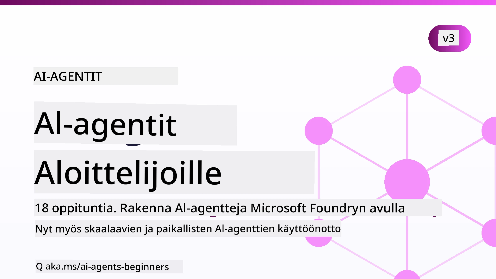

# AI-agentit aloittelijoille - Kurssi



## Kurssi, joka opettaa kaiken mitä tarvitset AI-agenttien rakentamisen aloittamiseen

[](https://github.com/microsoft/ai-agents-for-beginners/blob/master/LICENSE?WT.mc_id=academic-105485-koreyst)
[](https://GitHub.com/microsoft/ai-agents-for-beginners/graphs/contributors/?WT.mc_id=academic-105485-koreyst)
[](https://GitHub.com/microsoft/ai-agents-for-beginners/issues/?WT.mc_id=academic-105485-koreyst)
[](https://GitHub.com/microsoft/ai-agents-for-beginners/pulls/?WT.mc_id=academic-105485-koreyst)
[](http://makeapullrequest.com?WT.mc_id=academic-105485-koreyst)

### 🌐 Monikielinen tuki

#### Tuettu GitHub Actionin kautta (automaattinen & aina ajan tasalla)

<!-- CO-OP TRANSLATOR LANGUAGES TABLE START -->
[Arabic](../ar/README.md) | [Bengali](../bn/README.md) | [Bulgarian](../bg/README.md) | [Burmese (Myanmar)](../my/README.md) | [Chinese (Simplified)](../zh-CN/README.md) | [Chinese (Traditional, Hong Kong)](../zh-HK/README.md) | [Chinese (Traditional, Macau)](../zh-MO/README.md) | [Chinese (Traditional, Taiwan)](../zh-TW/README.md) | [Croatian](../hr/README.md) | [Czech](../cs/README.md) | [Danish](../da/README.md) | [Dutch](../nl/README.md) | [Estonian](../et/README.md) | [Finnish](./README.md) | [French](../fr/README.md) | [German](../de/README.md) | [Greek](../el/README.md) | [Hebrew](../he/README.md) | [Hindi](../hi/README.md) | [Hungarian](../hu/README.md) | [Indonesian](../id/README.md) | [Italian](../it/README.md) | [Japanese](../ja/README.md) | [Kannada](../kn/README.md) | [Khmer](../km/README.md) | [Korean](../ko/README.md) | [Lithuanian](../lt/README.md) | [Malay](../ms/README.md) | [Malayalam](../ml/README.md) | [Marathi](../mr/README.md) | [Nepali](../ne/README.md) | [Nigerian Pidgin](../pcm/README.md) | [Norwegian](../no/README.md) | [Persian (Farsi)](../fa/README.md) | [Polish](../pl/README.md) | [Portuguese (Brazil)](../pt-BR/README.md) | [Portuguese (Portugal)](../pt-PT/README.md) | [Punjabi (Gurmukhi)](../pa/README.md) | [Romanian](../ro/README.md) | [Russian](../ru/README.md) | [Serbian (Cyrillic)](../sr/README.md) | [Slovak](../sk/README.md) | [Slovenian](../sl/README.md) | [Spanish](../es/README.md) | [Swahili](../sw/README.md) | [Swedish](../sv/README.md) | [Tagalog (Filipino)](../tl/README.md) | [Tamil](../ta/README.md) | [Telugu](../te/README.md) | [Thai](../th/README.md) | [Turkish](../tr/README.md) | [Ukrainian](../uk/README.md) | [Urdu](../ur/README.md) | [Vietnamese](../vi/README.md)

> **Haluatko mieluummin kloonata paikallisesti?**
>
> Tämä repositorio sisältää yli 50 kielikäännöstä, jotka kasvattavat merkittävästi latauskoon. Kloonataksesi ilman käännöksiä, käytä sparse checkout -toimintoa:
>
> **Bash / macOS / Linux:**
> ```bash
> git clone --filter=blob:none --sparse https://github.com/microsoft/ai-agents-for-beginners.git
> cd ai-agents-for-beginners
> git sparse-checkout set --no-cone '/*' '!translations' '!translated_images'
> ```
>
> **CMD (Windows):**
> ```cmd
> git clone --filter=blob:none --sparse https://github.com/microsoft/ai-agents-for-beginners.git
> cd ai-agents-for-beginners
> git sparse-checkout set --no-cone "/*" "!translations" "!translated_images"
> ```
>
> Tämän avulla saat kaiken tarvittavan kurssin suorittamiseen huomattavasti nopeammalla latauksella.
<!-- CO-OP TRANSLATOR LANGUAGES TABLE END -->

**Jos haluat tukea lisää käännöskieliä, ne on lueteltu [tässä](https://github.com/Azure/co-op-translator/blob/main/getting_started/supported-languages.md).**

[](https://GitHub.com/microsoft/ai-agents-for-beginners/watchers/?WT.mc_id=academic-105485-koreyst)
[](https://GitHub.com/microsoft/ai-agents-for-beginners/network/?WT.mc_id=academic-105485-koreyst)
[](https://GitHub.com/microsoft/ai-agents-for-beginners/stargazers/?WT.mc_id=academic-105485-koreyst)

[](https://discord.com/invite/ATgtXmAS5D)


## 🌱 Aloittaminen

Tämä kurssi sisältää oppitunteja, jotka kattavat AI-agenttien rakentamisen perusteet. Jokainen oppitunti käsittelee omaa aihettaan, joten aloita mistä haluat!

Kurssilla on monikielinen tuki. Katso [saatavilla olevat kielet täältä](#-multi-language-support). 

Jos olet ensimmäistä kertaa rakentamassa generatiivisia AI-malleja, tutustu [Generative AI For Beginners](https://aka.ms/genai-beginners) -kurssiin, joka sisältää 21 oppituntia GenAI:n kanssa rakentamisesta.

Älä unohda [tähtäillä (🌟) tätä repositoriota](https://docs.github.com/en/get-started/exploring-projects-on-github/saving-repositories-with-stars?WT.mc_id=academic-105485-koreyst) ja [haaraa tätä repo](https://github.com/microsoft/ai-agents-for-beginners/fork) koodin suorittamiseksi.

### Tapaa muita oppijoita, saa kysymyksiisi vastauksia

Jos juutut tai sinulla on kysymyksiä AI-agenttien rakentamisesta, liity omistettuun Discord-kanavaamme [Microsoft Foundry Discordissa](https://aka.ms/ai-agents/discord).

### Mitä tarvitset 

Jokainen tämän kurssin oppitunti sisältää koodiesimerkkejä, jotka löytyvät koodi_samples kansiosta. Voit [haara tämän repositorion](https://github.com/microsoft/ai-agents-for-beginners/fork) luodaksesi oman kopiosi.  

Näissä harjoituksissa käytetyt koodiesimerkit hyödyntävät Microsoft Agent Frameworkia Microsoft Foundry Agent Service V2:n kanssa:

- [Microsoft Foundry](https://aka.ms/ai-agents-beginners/ai-foundry) - Azure-tili vaaditaan

Tämä kurssi käyttää seuraavia Microsoftin AI-agenttikehyksiä ja -palveluita:

- [Microsoft Agent Framework (MAF)](https://aka.ms/ai-agents-beginners/agent-framework)
- [Microsoft Foundry Agent Service V2](https://aka.ms/ai-agents-beginners/ai-agent-service)

Jotkin koodiesimerkit tukevat myös vaihtoehtoisia OpenAI-yhteensopivia palveluntarjoajia, kuten [MiniMax](https://platform.minimaxi.com/), joka tarjoaa suuria kontekstimalleja (jopa 204K tokenia). Katso [Kurssin asennus](./00-course-setup/README.md) asetusohjeita varten.

Lisätietoja koodin ajamisesta tätä kurssia varten löydät kohdasta [Kurssin asennus](./00-course-setup/README.md).

## 🙏 Haluatko auttaa?

Onko sinulla ehdotuksia tai löysitkö kirjoitus- tai koodivirheitä? [Nosta issue](https://github.com/microsoft/ai-agents-for-beginners/issues?WT.mc_id=academic-105485-koreyst) tai [Luo pull request](https://github.com/microsoft/ai-agents-for-beginners/pulls?WT.mc_id=academic-105485-koreyst)


## 📂 Jokainen oppitunti sisältää

- Kirjoitetun oppitunnin README-tiedostossa ja lyhyen videon
- Python-koodiesimerkit Microsoft Agent Frameworkia käyttäen Microsoft Foundryn kanssa
- Linkit lisäresursseihin oppimisen jatkamiseksi


## 🗃️ Oppitunnit

| **Oppitunti**                                | **Teksti & Koodi**                                  | **Video**                                                 | **Lisäoppiminen**                                                                    |
|----------------------------------------------|----------------------------------------------------|------------------------------------------------------------|----------------------------------------------------------------------------------------|
| Johdanto AI-agentteihin ja agenttien käyttötapauksiin | [Linkki](./01-intro-to-ai-agents/README.md)         | [Video](https://youtu.be/3zgm60bXmQk?si=z8QygFvYQv-9WtO1)  | [Linkki](https://aka.ms/ai-agents-beginners/collection?WT.mc_id=academic-105485-koreyst) |
| AI-agenttikehysten tutkiminen                | [Linkki](./02-explore-agentic-frameworks/README.md) | [Video](https://youtu.be/ODwF-EZo_O8?si=Vawth4hzVaHv-u0H)  | [Linkki](https://aka.ms/ai-agents-beginners/collection?WT.mc_id=academic-105485-koreyst) |
| AI-agenttisuunnittelumallien ymmärtäminen  | [Linkki](./03-agentic-design-patterns/README.md)    | [Video](https://youtu.be/m9lM8qqoOEA?si=BIzHwzstTPL8o9GF)  | [Linkki](https://aka.ms/ai-agents-beginners/collection?WT.mc_id=academic-105485-koreyst) |
| Työkalujen käyttösuunnittelumalli           | [Linkki](./04-tool-use/README.md)                   | [Video](https://youtu.be/vieRiPRx-gI?si=2z6O2Xu2cu_Jz46N)  | [Linkki](https://aka.ms/ai-agents-beginners/collection?WT.mc_id=academic-105485-koreyst) |
| Agenttinen RAG                               | [Linkki](./05-agentic-rag/README.md)                | [Video](https://youtu.be/WcjAARvdL7I?si=gKPWsQpKiIlDH9A3)  | [Linkki](https://aka.ms/ai-agents-beginners/collection?WT.mc_id=academic-105485-koreyst) |
| Luotettavien AI-agenttien rakentaminen      | [Linkki](./06-building-trustworthy-agents/README.md)| [Video](https://youtu.be/iZKkMEGBCUQ?si=jZjpiMnGFOE9L8OK ) | [Linkki](https://aka.ms/ai-agents-beginners/collection?WT.mc_id=academic-105485-koreyst) |
| Suunnittelumalli (Planning Design Pattern)  | [Linkki](./07-planning-design/README.md)            | [Video](https://youtu.be/kPfJ2BrBCMY?si=6SC_iv_E5-mzucnC)  | [Linkki](https://aka.ms/ai-agents-beginners/collection?WT.mc_id=academic-105485-koreyst) |
| Moni-agenttinen suunnittelumalli             | [Linkki](./08-multi-agent/README.md)                | [Video](https://youtu.be/V6HpE9hZEx0?si=rMgDhEu7wXo2uo6g)  | [Linkki](https://aka.ms/ai-agents-beginners/collection?WT.mc_id=academic-105485-koreyst) |

| Metakognition suunnittelumalli                 | [Linkki](./09-metacognition/README.md)               | [Video](https://youtu.be/His9R6gw6Ec?si=8gck6vvdSNCt6OcF)  | [Linkki](https://aka.ms/ai-agents-beginners/collection?WT.mc_id=academic-105485-koreyst) |
| AI-agentit tuotannossa                          | [Linkki](./10-ai-agents-production/README.md)        | [Video](https://youtu.be/l4TP6IyJxmQ?si=31dnhexRo6yLRJDl)  | [Linkki](https://aka.ms/ai-agents-beginners/collection?WT.mc_id=academic-105485-koreyst) |
| Agenttiprotocolien käyttö (MCP, A2A ja NLWeb)  | [Linkki](./11-agentic-protocols/README.md)           | [Video](https://youtu.be/X-Dh9R3Opn8)                                 | [Linkki](https://aka.ms/ai-agents-beginners/collection?WT.mc_id=academic-105485-koreyst) |
| Kontekstisuunnittelu AI-agenteille              | [Linkki](./12-context-engineering/README.md)         | [Video](https://youtu.be/F5zqRV7gEag)                                 | [Linkki](https://aka.ms/ai-agents-beginners/collection?WT.mc_id=academic-105485-koreyst) |
| Agenttimuistin hallinta                         | [Linkki](./13-agent-memory/README.md)     |      [Video](https://youtu.be/QrYbHesIxpw?si=vZkVwKrQ4ieCcIPx)                                                      |                                                                                        |
| Microsoft Agent Frameworkin tutkiminen          | [Linkki](./14-microsoft-agent-framework/README.md)                            |                                                            |                                                                                        |
| Tietokoneen käyttöagenttien rakentaminen (CUA) | [Linkki](./15-browser-use/README.md)     |                                                            | [Linkki](https://docs.browser-use.com/examples/templates/playwright-integration)         |
| Skaalautuvien agenttien käyttöönotto            | [Linkki](./16-deploying-scalable-agents/README.md) |                                                    | [Linkki](https://learn.microsoft.com/azure/ai-foundry/agents/overview)                   |
| Paikallisten AI-agenttien luominen              | [Linkki](./17-creating-local-ai-agents/README.md)  |                                                    | [Linkki](https://learn.microsoft.com/azure/ai-foundry/foundry-local/)                    |
| AI-agenttien suojaaminen                         | [Linkki](./18-securing-ai-agents/README.md)  |                                                            | [Linkki](https://aka.ms/ai-agents-beginners/collection?WT.mc_id=academic-105485-koreyst) |

## 🎒 Muut kurssit

Tiimimme tuottaa myös muita kursseja! Tutustu:

<!-- CO-OP TRANSLATOR OTHER COURSES START -->
### LangChain
[](https://aka.ms/langchain4j-for-beginners)
[](https://aka.ms/langchainjs-for-beginners?WT.mc_id=m365-94501-dwahlin)
[](https://github.com/microsoft/langchain-for-beginners?WT.mc_id=m365-94501-dwahlin)
---

### Azure / Edge / MCP / Agentit
[](https://github.com/microsoft/AZD-for-beginners?WT.mc_id=academic-105485-koreyst)
[](https://github.com/microsoft/edgeai-for-beginners?WT.mc_id=academic-105485-koreyst)
[](https://github.com/microsoft/mcp-for-beginners?WT.mc_id=academic-105485-koreyst)
[](https://github.com/microsoft/ai-agents-for-beginners?WT.mc_id=academic-105485-koreyst)

---
 
### Generatiivisen tekoälyn sarja
[](https://github.com/microsoft/generative-ai-for-beginners?WT.mc_id=academic-105485-koreyst)
[-9333EA?style=for-the-badge&labelColor=E5E7EB&color=9333EA)](https://github.com/microsoft/Generative-AI-for-beginners-dotnet?WT.mc_id=academic-105485-koreyst)
[-C084FC?style=for-the-badge&labelColor=E5E7EB&color=C084FC)](https://github.com/microsoft/generative-ai-for-beginners-java?WT.mc_id=academic-105485-koreyst)
[-E879F9?style=for-the-badge&labelColor=E5E7EB&color=E879F9)](https://github.com/microsoft/generative-ai-with-javascript?WT.mc_id=academic-105485-koreyst)

---
 
### Perusopinnot
[](https://aka.ms/ml-beginners?WT.mc_id=academic-105485-koreyst)
[](https://aka.ms/datascience-beginners?WT.mc_id=academic-105485-koreyst)
[](https://aka.ms/ai-beginners?WT.mc_id=academic-105485-koreyst)
[](https://github.com/microsoft/Security-101?WT.mc_id=academic-96948-sayoung)
[](https://aka.ms/webdev-beginners?WT.mc_id=academic-105485-koreyst)
[](https://aka.ms/iot-beginners?WT.mc_id=academic-105485-koreyst)
[](https://github.com/microsoft/xr-development-for-beginners?WT.mc_id=academic-105485-koreyst)

---
 
### Copilot-sarja
[](https://aka.ms/GitHubCopilotAI?WT.mc_id=academic-105485-koreyst)
[](https://github.com/microsoft/mastering-github-copilot-for-dotnet-csharp-developers?WT.mc_id=academic-105485-koreyst)
[](https://github.com/microsoft/CopilotAdventures?WT.mc_id=academic-105485-koreyst)
<!-- CO-OP TRANSLATOR OTHER COURSES END -->

## 🌟 Yhteisön kiitokset

Kiitos [Shivam Goyalille](https://www.linkedin.com/in/shivam2003/) tärkeiden esimerkkikoodien toimittamisesta, jotka havainnollistavat Agentic RAG:ia.

## Osallistuminen

Tämä projekti toivottaa tervetulleiksi osallistumiset ja ehdotukset. Useimmat osallistumiset edellyttävät, että hyväksyt
Contributor License Agreementin (CLA), jossa vahvistat, että sinulla on oikeus ja myönnät meille
oikeudet käyttää panostasi. Lisätietoja saat osoitteesta <https://cla.opensource.microsoft.com>.

Kun lähetät pull requestin, CLA-botti automaattisesti arvioi, tarvitsetko toimittaa
CLA:n ja merkitsee PR:n asianmukaisesti (esim. tilatarkistus, kommentti). Noudata vain botin
ohjeita. Tarvitset tämän tehdä vain kerran kaikissa CLA:a käyttäviä repoja varten.

Tämä projekti on ottanut käyttöön [Microsoft Open Source Code of Conductin](https://opensource.microsoft.com/codeofconduct/).
Lisätietoja löydät [Code of Conduct FAQ:sta](https://opensource.microsoft.com/codeofconduct/faq/) tai
ota yhteyttä osoitteeseen [opencode@microsoft.com](mailto:opencode@microsoft.com), jos sinulla on lisäkysymyksiä tai kommentteja.

## Tavara- ja palvelumerkit

Tämä projekti saattaa sisältää tavara- tai palvelumerkkejä projekteista, tuotteista tai palveluista. Microsoftin
tavara- ja palvelumerkkien luvallinen käyttö on sallittu ja sitä on noudatettava
[Microsoftin tavara- ja brändiohjeiden](https://www.microsoft.com/legal/intellectualproperty/trademarks/usage/general) mukaisesti.
Microsoftin tavara- tai palvelumerkkien käyttäminen tämän projektin muokatuissa versioissa ei saa aiheuttaa sekaannusta eikä antaa ymmärtää Microsoftin tukemista.
Kolmansien osapuolien tavara- tai palvelumerkkien käyttö on kunkin kolmannen osapuolen sääntöjen alaista.

## Apua saadaksesi


Jos jumitut tai sinulla on kysyttävää AI-sovellusten rakentamisesta, liity:

[](https://aka.ms/foundry/discord)

Jos sinulla on tuotearvioita tai kohtaat virheitä rakentaessa, käy:

[](https://aka.ms/foundry/forum)

---

<!-- CO-OP TRANSLATOR DISCLAIMER START -->
**Vastuuvapauslauseke**:
Tämä asiakirja on käännetty käyttämällä tekoälypohjaista käännöspalvelua [Co-op Translator](https://github.com/Azure/co-op-translator). Vaikka pyrimme tarkkuuteen, otathan huomioon, että automaattiset käännökset saattavat sisältää virheitä tai epätarkkuuksia. Alkuperäinen asiakirja sen alkuperäiskielellä on virallinen lähde. Tärkeissä asioissa suositellaan ammattimaista ihmiskäännöstä. Emme ole vastuussa tämän käännöksen käytöstä aiheutuvista väärinymmärryksistä tai tulkinnoista.
<!-- CO-OP TRANSLATOR DISCLAIMER END -->