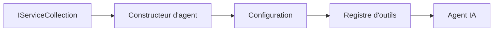

# 🎨 Modèles de conception agentiques avec Azure OpenAI (API Responses) (.NET)

## 📋 Objectifs d'apprentissage

Cet exemple montre des modèles de conception de niveau entreprise pour construire des agents intelligents utilisant le Microsoft Agent Framework en .NET avec l'intégration d'Azure OpenAI (API Responses). Vous apprendrez des modèles professionnels et des approches architecturales qui rendent les agents prêts pour la production, maintenables et évolutifs.

### Modèles de conception d'entreprise

- 🏭 **Modèle Factory** : Création standardisée d'agents avec injection de dépendances
- 🔧 **Modèle Builder** : Configuration et préparation fluide des agents
- 🧵 **Modèles threadsafe** : Gestion concurrente des conversations
- 📋 **Modèle Repository** : Gestion organisée des outils et capacités

## 🎯 Avantages architecturaux spécifiques à .NET

### Fonctionnalités d'entreprise

- **Typage fort** : Validation à la compilation et support IntelliSense
- **Injection de dépendances** : Intégration native du conteneur DI
- **Gestion de configuration** : IConfiguration et modèles Options
- **Async/Await** : Support natif de la programmation asynchrone

### Modèles prêts pour la production

- **Intégration de journalisation** : ILogger et journalisation structurée
- **Contrôles de santé** : Surveillance et diagnostics intégrés
- **Validation de configuration** : Typage fort avec annotations de données
- **Gestion des erreurs** : Gestion structurée des exceptions

## 🔧 Architecture technique

### Composants .NET principaux

- **Microsoft.Extensions.AI** : Abstractions unifiées des services d’IA
- **Microsoft.Agents.AI** : Framework d’orchestration agent d’entreprise
- **Azure OpenAI (API Responses)** : Modèles client API haute performance
- **Système de configuration** : appsettings.json et intégration environnement

### Implémentation des modèles de conception



## 🏗️ Modèles d'entreprise démontrés

### 1. **Modèles de création**

- **Factory d’agents** : Création centralisée d’agents avec configuration cohérente
- **Modèle Builder** : API fluide pour la configuration complexe d’agents
- **Modèle Singleton** : Gestion partagée des ressources et configurations
- **Injection de dépendances** : Couplage faible et facilité de test

### 2. **Modèles comportementaux**

- **Modèle Strategy** : Stratégies interchangeables d’exécution des outils
- **Modèle Command** : Opérations d’agents encapsulées avec annulation/répétition
- **Modèle Observer** : Gestion du cycle de vie agent basée sur les événements
- **Méthode Template** : Flux d’exécution standardisés pour agents

### 3. **Modèles structurels**

- **Modèle Adapter** : Couche d’intégration Azure OpenAI (API Responses)
- **Modèle Decorator** : Amélioration des capacités d’agents
- **Modèle Facade** : Interfaces simplifiées d’interaction agents
- **Modèle Proxy** : Chargement paresseux et mise en cache pour performance

## 📚 Principes de conception .NET

### Principes SOLID

- **Responsabilité unique** : Chaque composant a un but clair
- **Ouvert/Fermé** : Extensible sans modification
- **Substitution de Liskov** : Implémentations d’outils basées sur interfaces
- **Ségrégation d’interface** : Interfaces ciblées et cohésives
- **Inversion de dépendance** : Dépendre des abstractions, pas des concrétions

### Architecture propre

- **Couche domaine** : Abstractions centrales agents et outils
- **Couche application** : Orchestration agents et flux de travail
- **Couche infrastructure** : Intégration Azure OpenAI (API Responses) et services externes
- **Couche présentation** : Interaction utilisateur et formatage réponses

## 🔒 Considérations d’entreprise

### Sécurité

- **Gestion des identifiants** : Gestion sécurisée des clés API avec IConfiguration
- **Validation des entrées** : Typage fort et validation par annotation de données
- **Assainissement des sorties** : Traitement sécurisé et filtrage des réponses
- **Journalisation d’audit** : Suivi complet des opérations

### Performance

- **Modèles asynchrones** : Opérations d’I/O non bloquantes
- **Pooling de connexion** : Gestion efficace du client HTTP
- **Mise en cache** : Mise en cache des réponses pour performance améliorée
- **Gestion des ressources** : Schémas corrects de nettoyage et disposition

### Scalabilité

- **Sécurité des threads** : Support de l’exécution concurrente d’agents
- **Pooling de ressources** : Utilisation efficace des ressources
- **Gestion de charge** : Limitation de débit et gestion de pression inversée
- **Surveillance** : Métriques de performance et contrôles de santé

## 🚀 Déploiement en production

- **Gestion de configuration** : Paramètres spécifiques à l’environnement
- **Stratégie de journalisation** : Journalisation structurée avec IDs de corrélation
- **Gestion des erreurs** : Gestion globale des exceptions avec récupération appropriée
- **Surveillance** : Application Insights et compteurs de performance
- **Tests** : Tests unitaires, d’intégration et de charge

Prêt à construire des agents intelligents de niveau entreprise avec .NET ? Architecturons quelque chose de robuste ! 🏢✨

## 🚀 Commencer

### Prérequis

- [SDK .NET 10](https://dotnet.microsoft.com/download/dotnet/10.0) ou supérieur
- Un [abonnement Azure](https://azure.microsoft.com/free/) avec une ressource Azure OpenAI et un déploiement de modèle
- L’[Azure CLI](https://learn.microsoft.com/cli/azure/install-azure-cli) — connectez-vous avec `az login`

### Variables d’environnement requises

```bash
# zsh/bash
export AZURE_OPENAI_ENDPOINT=https://<your-resource>.openai.azure.com
export AZURE_OPENAI_DEPLOYMENT=gpt-5-mini
# Ensuite, connectez-vous pour que AzureCliCredential puisse obtenir un jeton
az login
```

```powershell
# PowerShell
$env:AZURE_OPENAI_ENDPOINT = "https://<your-resource>.openai.azure.com"
$env:AZURE_OPENAI_DEPLOYMENT = "gpt-5-mini"
# Ensuite, connectez-vous afin que AzureCliCredential puisse obtenir un jeton
az login
```

### Exemple de code

Pour exécuter l'exemple de code,

```bash
# zsh/bash
chmod +x ./03-dotnet-agent-framework.cs
./03-dotnet-agent-framework.cs
```

Ou en utilisant la CLI dotnet :

```bash
dotnet run ./03-dotnet-agent-framework.cs
```

Voir [`03-dotnet-agent-framework.cs`](../../../../03-agentic-design-patterns/code_samples/03-dotnet-agent-framework.cs) pour le code complet.

```csharp
#!/usr/bin/dotnet run

#:package Microsoft.Extensions.AI@10.*
#:package Microsoft.Agents.AI.OpenAI@1.*-*
#:package Azure.AI.OpenAI@2.1.0
#:package Azure.Identity@1.13.1

using System.ComponentModel;

using Microsoft.Agents.AI;
using Microsoft.Extensions.AI;

using Azure.AI.OpenAI;
using Azure.Identity;

// Tool Function: Random Destination Generator
// This static method will be available to the agent as a callable tool
// The [Description] attribute helps the AI understand when to use this function
// This demonstrates how to create custom tools for AI agents
[Description("Provides a random vacation destination.")]
static string GetRandomDestination()
{
    // List of popular vacation destinations around the world
    // The agent will randomly select from these options
    var destinations = new List<string>
    {
        "Paris, France",
        "Tokyo, Japan",
        "New York City, USA",
        "Sydney, Australia",
        "Rome, Italy",
        "Barcelona, Spain",
        "Cape Town, South Africa",
        "Rio de Janeiro, Brazil",
        "Bangkok, Thailand",
        "Vancouver, Canada"
    };

    // Generate random index and return selected destination
    // Uses System.Random for simple random selection
    var random = new Random();
    int index = random.Next(destinations.Count);
    return destinations[index];
}

// Azure OpenAI with the Responses API (stable v1 endpoint). Sign in with `az login`.
var azureEndpoint = Environment.GetEnvironmentVariable("AZURE_OPENAI_ENDPOINT")
    ?? throw new InvalidOperationException("AZURE_OPENAI_ENDPOINT is not set.");
var deployment = Environment.GetEnvironmentVariable("AZURE_OPENAI_DEPLOYMENT") ?? "gpt-5-mini";

var azureClient = new AzureOpenAIClient(new Uri(azureEndpoint), new AzureCliCredential());

// Define Agent Identity and Comprehensive Instructions
// Agent name for identification and logging purposes
var AGENT_NAME = "TravelAgent";

// Detailed instructions that define the agent's personality, capabilities, and behavior
// This system prompt shapes how the agent responds and interacts with users
var AGENT_INSTRUCTIONS = """
You are a helpful AI Agent that can help plan vacations for customers.

Important: When users specify a destination, always plan for that location. Only suggest random destinations when the user hasn't specified a preference.

When the conversation begins, introduce yourself with this message:
"Hello! I'm your TravelAgent assistant. I can help plan vacations and suggest interesting destinations for you. Here are some things you can ask me:
1. Plan a day trip to a specific location
2. Suggest a random vacation destination
3. Find destinations with specific features (beaches, mountains, historical sites, etc.)
4. Plan an alternative trip if you don't like my first suggestion

What kind of trip would you like me to help you plan today?"

Always prioritize user preferences. If they mention a specific destination like "Bali" or "Paris," focus your planning on that location rather than suggesting alternatives.
""";

// Create AI Agent with Advanced Travel Planning Capabilities
// Get the Responses client for the deployment and create the AI agent
// Configure agent with name, detailed instructions, and available tools
// This demonstrates the .NET agent creation pattern with full configuration
AIAgent agent = azureClient
    .GetChatClient(deployment)
    .AsAIAgent(
        name: AGENT_NAME,
        instructions: AGENT_INSTRUCTIONS,
        tools: [AIFunctionFactory.Create(GetRandomDestination)]
    );

// Create New Conversation Session for Context Management
// Initialize a new conversation session to maintain context across multiple interactions
// Sessions enable the agent to remember previous exchanges and maintain conversational state
// This is essential for multi-turn conversations and contextual understanding
var session = await agent.CreateSessionAsync();

// Execute Agent: First Travel Planning Request
// Run the agent with an initial request that will likely trigger the random destination tool
// The agent will analyze the request, use the GetRandomDestination tool, and create an itinerary
// Using the session parameter maintains conversation context for subsequent interactions
await foreach (var update in agent.RunStreamingAsync("Plan me a day trip", session))
{
    await Task.Delay(10);
    Console.Write(update);
}

Console.WriteLine();

// Execute Agent: Follow-up Request with Context Awareness
// Demonstrate contextual conversation by referencing the previous response
// The agent remembers the previous destination suggestion and will provide an alternative
// This showcases the power of conversation sessions and contextual understanding in .NET agents
await foreach (var update in agent.RunStreamingAsync("I don't like that destination. Plan me another vacation.", session))
{
    await Task.Delay(10);
    Console.Write(update);
}
```

---

<!-- CO-OP TRANSLATOR DISCLAIMER START -->
**Avertissement** :
Ce document a été traduit à l'aide du service de traduction automatique [Co-op Translator](https://github.com/Azure/co-op-translator). Bien que nous nous efforçions d'assurer l'exactitude, veuillez noter que les traductions automatisées peuvent contenir des erreurs ou des inexactitudes. Le document original dans sa langue native doit être considéré comme la source faisant autorité. Pour les informations critiques, il est recommandé de recourir à une traduction professionnelle réalisée par un humain. Nous ne saurions être tenus responsables des malentendus ou erreurs d'interprétation découlant de l'utilisation de cette traduction.
<!-- CO-OP TRANSLATOR DISCLAIMER END -->