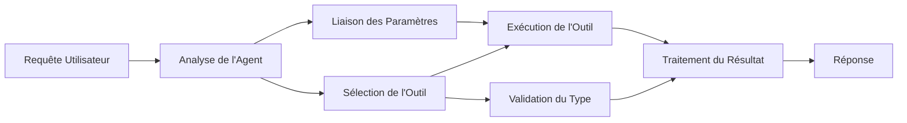

# 🛠️ Utilisation avancée des outils avec Azure OpenAI (API de réponses) (.NET)

## 📋 Objectifs d'apprentissage

Ce cahier illustre des modèles d’intégration d’outils de qualité entreprise en utilisant le Microsoft Agent Framework en .NET avec Azure OpenAI (API de réponses). Vous apprendrez à créer des agents sophistiqués avec plusieurs outils spécialisés, en tirant parti du typage fort de C# et des fonctionnalités d'entreprise de .NET.

### Capacités avancées des outils que vous maîtriserez

- 🔧 **Architecture Multi-Outils** : Construction d’agents avec plusieurs capacités spécialisées
- 🎯 **Exécution d’Outils Typée** : Exploiter la validation à la compilation de C#
- 📊 **Modèles d'Outils Entreprise** : Conception d’outils prêts pour la production et gestion des erreurs
- 🔗 **Composition d’Outils** : Combinaison d’outils pour des flux métier complexes

## 🎯 Avantages de l’Architecture d’Outils .NET

### Fonctionnalités d’Outils Entreprise

- **Validation à la Compilation** : Le typage fort garantit la justesse des paramètres d’outils
- **Injection de Dépendances** : Intégration du conteneur IoC pour la gestion des outils
- **Modèles Async/Await** : Exécution non bloquante des outils avec gestion appropriée des ressources
- **Journalisation Structurée** : Intégration native de la journalisation pour le suivi d’exécution des outils

### Modèles Prêts pour la Production

- **Gestion des Exceptions** : Gestion complète des erreurs avec exceptions typées
- **Gestion des Ressources** : Modèles de disposition correcte et gestion de la mémoire
- **Suivi des Performances** : Métriques intégrées et compteurs de performance
- **Gestion de Configuration** : Configuration typée avec validation

## 🔧 Architecture Technique

### Composants principaux des outils .NET

- **Microsoft.Extensions.AI** : Couche d’abstraction unifiée des outils
- **Microsoft.Agents.AI** : Orchestration d’outils de qualité entreprise
- **Azure OpenAI (API de réponses)** : Client API haute performance avec pool de connexions

### Pipeline d’Exécution des Outils



## 🛠️ Catégories et Modèles d’Outils

### 1. **Outils de Traitement des Données**

- **Validation d’Entrée** : Typage fort avec annotations de données
- **Opérations de Transformation** : Conversion et formatage de données typé
- **Logique Métier** : Outils de calcul et d’analyse spécifiques au domaine
- **Formatage de Sortie** : Génération de réponses structurées

### 2. **Outils d’Intégration**

- **Connecteurs API** : Intégration de services RESTful avec HttpClient
- **Outils de Base de Données** : Intégration Entity Framework pour accès aux données
- **Opérations sur Fichiers** : Opérations sécurisées sur le système de fichiers avec validation
- **Services Externes** : Modèles d’intégration de services tiers

### 3. **Outils Utilitaires**

- **Traitement de Texte** : Utilitaires de manipulation et formatage de chaînes
- **Opérations Date/Heure** : Calculs date/heure sensibles à la culture
- **Outils Mathématiques** : Calculs de précision et opérations statistiques
- **Outils de Validation** : Validation des règles métier et vérification de données

Prêt à créer des agents de qualité entreprise avec des capacités d’outils puissantes et typées en .NET ? Architecturons des solutions professionnelles ! 🏢⚡

## 🚀 Démarrage

### Prérequis

- [SDK .NET 10](https://dotnet.microsoft.com/download/dotnet/10.0) ou version supérieure
- Un [abonnement Azure](https://azure.microsoft.com/free/) avec une ressource Azure OpenAI et un déploiement de modèle
- L’[Azure CLI](https://learn.microsoft.com/cli/azure/install-azure-cli) — connectez-vous avec `az login`

### Variables d’Environnement Requises

```bash
# zsh/bash
export AZURE_OPENAI_ENDPOINT=https://<your-resource>.openai.azure.com
export AZURE_OPENAI_DEPLOYMENT=gpt-5-mini
# Ensuite, connectez-vous pour que AzureCliCredential puisse obtenir un jeton
az login
```

```powershell
# PowerShell
$env:AZURE_OPENAI_ENDPOINT = "https://<your-resource>.openai.azure.com"
$env:AZURE_OPENAI_DEPLOYMENT = "gpt-5-mini"
# Connectez-vous ensuite pour que AzureCliCredential puisse obtenir un jeton
az login
```

### Exemple de Code

Pour exécuter l’exemple de code,

```bash
# zsh/bash
chmod +x ./04-dotnet-agent-framework.cs
./04-dotnet-agent-framework.cs
```

Ou en utilisant la CLI dotnet :

```bash
dotnet run ./04-dotnet-agent-framework.cs
```

Voir [`04-dotnet-agent-framework.cs`](../../../../04-tool-use/code_samples/04-dotnet-agent-framework.cs) pour le code complet.

```csharp
#!/usr/bin/dotnet run

#:package Microsoft.Extensions.AI@10.*
#:package Microsoft.Agents.AI.OpenAI@1.*-*
#:package Azure.AI.OpenAI@2.1.0
#:package Azure.Identity@1.13.1

using System.ComponentModel;

using Microsoft.Agents.AI;
using Microsoft.Extensions.AI;

using Azure.AI.OpenAI;
using Azure.Identity;

// Tool Function: Random Destination Generator
// This static method will be available to the agent as a callable tool
// The [Description] attribute helps the AI understand when to use this function
// This demonstrates how to create custom tools for AI agents
[Description("Provides a random vacation destination.")]
static string GetRandomDestination()
{
    // List of popular vacation destinations around the world
    // The agent will randomly select from these options
    var destinations = new List<string>
    {
        "Paris, France",
        "Tokyo, Japan",
        "New York City, USA",
        "Sydney, Australia",
        "Rome, Italy",
        "Barcelona, Spain",
        "Cape Town, South Africa",
        "Rio de Janeiro, Brazil",
        "Bangkok, Thailand",
        "Vancouver, Canada"
    };

    // Generate random index and return selected destination
    // Uses System.Random for simple random selection
    var random = new Random();
    int index = random.Next(destinations.Count);
    return destinations[index];
}

// Azure OpenAI with the Responses API (stable v1 endpoint). Sign in with `az login`.
var azureEndpoint = Environment.GetEnvironmentVariable("AZURE_OPENAI_ENDPOINT")
    ?? throw new InvalidOperationException("AZURE_OPENAI_ENDPOINT is not set.");
var deployment = Environment.GetEnvironmentVariable("AZURE_OPENAI_DEPLOYMENT") ?? "gpt-5-mini";

var azureClient = new AzureOpenAIClient(new Uri(azureEndpoint), new AzureCliCredential());

// Define Agent Identity and Comprehensive Instructions
// Agent name for identification and logging purposes
var AGENT_NAME = "TravelAgent";

// Detailed instructions that define the agent's personality, capabilities, and behavior
// This system prompt shapes how the agent responds and interacts with users
var AGENT_INSTRUCTIONS = """
You are a helpful AI Agent that can help plan vacations for customers.

Important: When users specify a destination, always plan for that location. Only suggest random destinations when the user hasn't specified a preference.

When the conversation begins, introduce yourself with this message:
"Hello! I'm your TravelAgent assistant. I can help plan vacations and suggest interesting destinations for you. Here are some things you can ask me:
1. Plan a day trip to a specific location
2. Suggest a random vacation destination
3. Find destinations with specific features (beaches, mountains, historical sites, etc.)
4. Plan an alternative trip if you don't like my first suggestion

What kind of trip would you like me to help you plan today?"

Always prioritize user preferences. If they mention a specific destination like "Bali" or "Paris," focus your planning on that location rather than suggesting alternatives.
""";

// Create AI Agent with Advanced Travel Planning Capabilities
// Get the Responses client for the deployment and create the AI agent
// Configure agent with name, detailed instructions, and available tools
// This demonstrates the .NET agent creation pattern with full configuration
AIAgent agent = azureClient
    .GetChatClient(deployment)
    .AsAIAgent(
        name: AGENT_NAME,
        instructions: AGENT_INSTRUCTIONS,
        tools: [AIFunctionFactory.Create(GetRandomDestination)]
    );

// Create New Conversation Session for Context Management
// Initialize a new conversation session to maintain context across multiple interactions
// Sessions enable the agent to remember previous exchanges and maintain conversational state
// This is essential for multi-turn conversations and contextual understanding
await using var session = await agent.CreateSessionAsync();

// Execute Agent: First Travel Planning Request
// Run the agent with an initial request that will likely trigger the random destination tool
// The agent will analyze the request, use the GetRandomDestination tool, and create an itinerary
// Using the session parameter maintains conversation context for subsequent interactions
await foreach (var update in agent.RunStreamingAsync("Plan me a day trip", session))
{
    await Task.Delay(10);
    Console.Write(update);
}

Console.WriteLine();

// Execute Agent: Follow-up Request with Context Awareness
// Demonstrate contextual conversation by referencing the previous response
// The agent remembers the previous destination suggestion and will provide an alternative
// This showcases the power of conversation sessions and contextual understanding in .NET agents
await foreach (var update in agent.RunStreamingAsync("I don't like that destination. Plan me another vacation.", session))
{
    await Task.Delay(10);
    Console.Write(update);
}
```

---

<!-- CO-OP TRANSLATOR DISCLAIMER START -->
**Avertissement** :
Ce document a été traduit à l'aide du service de traduction automatique [Co-op Translator](https://github.com/Azure/co-op-translator). Bien que nous nous efforçions d'assurer l'exactitude, veuillez noter que les traductions automatisées peuvent contenir des erreurs ou des inexactitudes. Le document original dans sa langue native doit être considéré comme la source faisant autorité. Pour les informations critiques, il est recommandé de recourir à une traduction professionnelle réalisée par un humain. Nous ne saurions être tenus responsables des malentendus ou erreurs d'interprétation découlant de l'utilisation de cette traduction.
<!-- CO-OP TRANSLATOR DISCLAIMER END -->