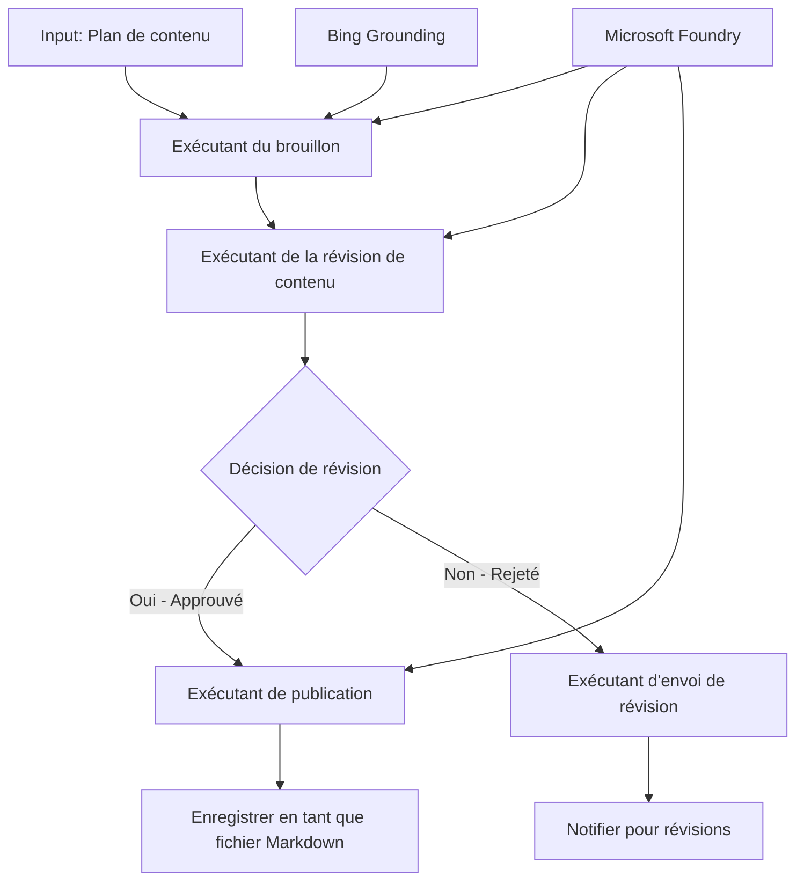

# 🔀 Flux de travail d'agent conditionnels avec Microsoft Foundry (.NET)

## 📋 Tutoriel sur les flux de travail intelligents basés sur la décision

Ce notebook démontre des **modèles de flux de travail conditionnels** utilisant Microsoft Foundry et le Microsoft Agent Framework pour .NET. Vous apprendrez à créer des flux de travail sophistiqués pilotés par des décisions qui routent intelligemment le traitement en fonction de l'analyse IA, des règles métier et des conditions dynamiques pour une automatisation de niveau entreprise.

## 🎯 Objectifs d'apprentissage

### 🧠 **Architecture de décision intelligente**
- **Implémentation de la logique conditionnelle** : Construisez des arbres de décision complexes avec plusieurs points de branchement
- **Routage alimenté par IA** : Utilisez les modèles Microsoft Foundry pour prendre des décisions de routage intelligentes
- **Adaptation dynamique du flux de travail** : Modifiez le comportement du flux de travail en fonction de l'analyse et des conditions en temps réel
- **Intégration des règles d'entreprise** : Incorporez la logique métier et les exigences de conformité dans les flux de travail

### 🔀 **Modèles conditionnels avancés**
- **Prise de décision multi-critères** : Évaluez plusieurs facteurs pour les décisions de routage
- **Traitement contextuel** : Prenez des décisions basées sur le contexte accumulé et l'historique du flux de travail
- **Modification adaptative du flux de travail** : Ajustez dynamiquement les chemins de traitement selon les conditions en temps réel
- **Intégration d’un moteur de règles** : Implémentez des moteurs de règles métier sophistiqués dans les flux de travail

### 🏢 **Applications conditionnelles en entreprise**
- **Classification et routage des documents** : Classez automatiquement et orientez les documents vers les flux de travail appropriés
- **Tri du service client** : Routage intelligent des demandes clients vers des équipes spécialisées
- **Traitement conformité & risque** : Appliquez différents processus de validation et de révision en fonction de l’évaluation des risques
- **Flux de travail de contrôle qualité** : Orientez le contenu via des processus de révision appropriés selon les métriques de qualité

## ⚙️ Prérequis & Configuration

### 📦 **Packages NuGet requis**

Packages avancés pour le traitement conditionnel des flux de travail :

```xml
<!-- Core AI Framework -->
<PackageReference Include="Microsoft.Extensions.AI" Version="9.9.0" />

<!-- Azure AI Agents with Persistent State -->
<PackageReference Include="Azure.AI.Agents.Persistent" Version="1.2.0-beta.5" />

<!-- Azure Identity and Utilities -->
<PackageReference Include="Azure.Identity" Version="1.15.0" />
<PackageReference Include="System.Linq.Async" Version="6.0.3" />
<PackageReference Include="DotNetEnv" Version="3.1.1" />

<!-- Local Workflow Framework References -->
<!-- Microsoft.Agents.Workflows.dll - Advanced workflow orchestration -->
<!-- Microsoft.Agents.AI.AzureAI.dll - Microsoft Foundry integration -->
<!-- Microsoft.Agents.AI.dll - Core agent abstractions -->
```

### 🔑 **Configuration Microsoft Foundry**

**Ressources Azure requises :**
- Espace de travail Microsoft Foundry avec modèles de traitement conditionnel
- Abonnement Azure avec quotas informatiques et permissions appropriés
- Modèles IA déployés pour prise de décision et analyse de contenu
- (Optionnel) Connexion API Bing Search pour capacités de grounding

**Configuration de l'environnement (fichier .env) :**
```env
# Microsoft Foundry Configuration
AZURE_AI_PROJECT_ENDPOINT=https://your-project.cognitiveservices.azure.com/
BING_CONNECTION_ID=your-bing-connection-id
```

**Configuration authentification :**
```csharp
// Azure CLI or Managed Identity authentication
using Azure.Identity;
var credential = new AzureCliCredential();

// Load environment configuration
DotNetEnv.Env.Load("../../../.env");
```

### 🏗️ **Architecture du flux de travail conditionnel**



**Composants clés :**
- **Draft Executor** : Agent IA qui crée les brouillons initiaux à partir des plans
- **Content Review Executor** : Agent IA qui évalue la qualité et la conformité des brouillons
- **Routage conditionnel** : Logique décisionnelle qui oriente selon les résultats de la révision
- **Chemins de publication/révision** : Chemins de traitement séparés pour contenu approuvé vs rejeté
- **Gestion d'état** : Maintient le contexte du contenu et de la révision durant le flux de travail

## 🎨 **Patrons de conception de flux de travail conditionnels**

### 📋 **Production de contenu avec contrôles qualité**
```
Outline → Draft Creation → Quality Review → {Approve: Publish | Reject: Revise}
```

### 🎯 **Traitement documentaire basé sur le risque**
```
Document → Risk Assessment → {Low: Standard | High: Enhanced Review}
```

### 🔍 **Routage intelligent du service client**
```
Customer Query → Analysis → {Simple: FAQ Bot | Complex: Human Agent}
```

### 💼 **Flux de travail pilotés par conformité**
```
Content → Compliance Check → {Pass: Publish | Fail: Legal Review}
```

## 🏢 **Bénéfices conditionnels en entreprise**

### 🎯 **Automatisation intelligente**
- **Prise de décision intelligente** : décisions de routage alimentées par IA basées sur l’analyse de contenu et le contexte
- **Traitement adaptatif** : flux de travail qui s’ajustent automatiquement selon l’évolution des conditions
- **Application des règles métier** : application automatique de la logique métier et des politiques complexes
- **Routage contextuel** : décisions basées sur l’historique complet du flux et le contexte accumulé

### 📈 **Excellence opérationnelle**
- **Allocation optimisée des ressources** : oriente le travail vers les spécialistes et processus les plus adaptés
- **Réduction des interventions manuelles** : la prise de décision automatisée minimise le besoin en routage humain
- **Délais de résolution plus rapides** : routage direct vers les expertises et capacités de traitement appropriées
- **Application cohérente** : application uniforme des règles métier et critères de décision

### 🛡️ **Gestion des risques & conformité**
- **Évaluation automatisée des risques** : évaluation IA des niveaux de risque du contenu et de la situation
- **Application de la conformité** : routage automatique via les processus réglementaires requis
- **Application des protocoles de sécurité** : mesures de sécurité renforcées appliquées selon l’évaluation des risques
- **Maintenance d’une traçabilité** : documentation complète des décisions de routage et de leurs justifications

### 📊 **Analytique & amélioration continue**
- **Analyse des décisions** : suivi de l’efficacité et de la précision des décisions de routage
- **Reconnaissance de motifs** : identification des tendances et motifs dans les décisions de routage au fil du temps
- **Optimisation des performances** : amélioration continue des critères de décision et de l’efficacité du routage
- **Intelligence d’affaires** : insights sur les caractéristiques du contenu et les besoins de traitement

### 🔧 **Excellence technique**
- **Gestion d’état persistante** : maintien d’états complexes durant l’exécution du flux de travail
- **Architecture scalable** : prise en charge des exigences de traitement conditionnel à grand volume
- **Capacités d’intégration** : intégration transparente avec les systèmes et processus métier existants
- **Surveillance & observabilité** : suivi complet des performances et décisions du flux de travail

Construisons des flux de travail d’entreprise intelligents pilotés par la décision avec .NET ! 🚀

## 💻 Exécution du code

L’implémentation complète est disponible dans `04.dotnet-agent-framework-workflow-aifoundry-condition.cs`. Elle démontre un **flux de production de contenu avec contrôles qualité** :

### 🏗️ **Architecture du flux de travail**

```
Content Outline → Draft Creation → Quality Review → Conditional Routing:
                                                      ├─ Approved (>200 words) → Publish
                                                      └─ Rejected (<200 words) → Review Notification
```

**Agents dans le flux de travail :**
1. **Agent évangéliste** : crée les brouillons du tutoriel à partir des plans avec grounding Bing
2. **Agent réviseur de contenu** : évalue la qualité du brouillon (nombre de mots, exhaustivité)
3. **Agent éditeur** : sauvegarde le contenu approuvé en fichiers Markdown horodatés

**Exécuteurs personnalisés :**
1. **DraftExecutor** : orchestre la création de brouillons
2. **ContentReviewExecutor** : effectue l’évaluation de qualité
3. **PublishExecutor** : gère la publication du contenu approuvé
4. **SendReviewExecutor** : gère les notifications de contenu rejeté

### 🚀 Exécution de l’exemple

**Prérequis :**
- Espace de travail Microsoft Foundry configuré
- Authentification CLI Azure (`az login`)
- (Optionnel) Connexion Bing Search pour grounding

```bash
# Rendre le script exécutable (Unix/Linux/macOS)
chmod +x 04.dotnet-agent-framework-workflow-aifoundry-condition.cs

# Exécuter le flux de travail conditionnel
./04.dotnet-agent-framework-workflow-aifoundry-condition.cs
```

Ou sous Windows :
```powershell
dotnet run 04.dotnet-agent-framework-workflow-aifoundry-condition.cs
```

### 📝 Résultat attendu

Le flux de travail va :
1. **Créer les agents** : initialiser trois agents Microsoft Foundry spécialisés
2. **Générer le brouillon** : l’agent évangéliste crée le brouillon du tutoriel à partir du plan
3. **Réviser le contenu** : l’agent réviseur de contenu évalue la qualité du brouillon
4. **Routage conditionnel** :
   - **Si approuvé (>200 mots)** : l’exécuteur de publication sauvegarde en fichier Markdown
   - **Si refusé (<200 mots)** : envoi d’une notification de révision
5. **Afficher les résultats** : montrer le résultat final du flux de travail

### 🔧 Options de personnalisation

**Modifier les critères de révision :**
```csharp
const string ContentReviewerInstructions = @"
You are a content reviewer...
1. Check if content is more than 500 words (instead of 200)
2. Verify technical accuracy
3. Ensure proper formatting
...";
```

**Ajouter plus de chemins conditionnels :**
```csharp
var workflow = new WorkflowBuilder(draftExecutor)
    .AddEdge(draftExecutor, contentReviewerExecutor)
    .AddEdge(contentReviewerExecutor, publishExecutor, condition: GetCondition("Excellent"))
    .AddEdge(contentReviewerExecutor, editExecutor, condition: GetCondition("Good"))
    .AddEdge(contentReviewerExecutor, sendReviewerExecutor, condition: GetCondition("Poor"))
    .Build();
```

**Changer les exigences de contenu :**
```csharp
string OUTLINE_Content = @"
# Your Custom Topic
## Section 1
https://your-reference-url
## Section 2
...
";
```

### 🎯 Applications réelles

Ce modèle de flux conditionnel est idéal pour :
- **Systèmes de gestion de contenu** : flux éditoriaux automatisés avec contrôles qualité
- **Traitement des documents** : routage des documents selon classification et conformité
- **Support client** : routage intelligent des tickets selon complexité et urgence
- **Revue juridique** : oriente les contrats selon évaluation du risque et valeur
- **Processus RH** : oriente les candidatures selon les flux de screening appropriés

### 🔍 Comprendre la logique conditionnelle

**Fonction de condition :**
```csharp
public Func<object?, bool> GetCondition(string expectedResult) =>
    reviewResult => reviewResult is ReviewResult review && review.Result == expectedResult;
```

Cette fonction crée un prédicat qui :
1. Vérifie si le résultat est de type `ReviewResult`
2. Compare la propriété `Result` à la valeur attendue
3. Retourne vrai/faux pour déterminer le routage

**Arêtes du flux de travail avec conditions :**
```csharp
.AddEdge(contentReviewerExecutor, publishExecutor, condition: GetCondition("Yes"))
.AddEdge(contentReviewerExecutor, sendReviewerExecutor, condition: GetCondition("No"))
```

### 📊 Fonctionnalités avancées

**Validation du schéma JSON :**
Le flux de travail utilise des schémas JSON pour garantir des réponses structurées :

```csharp
// Define response structure
public class ReviewResult
{
    [JsonPropertyName("review_result")]
    public string Result { get; set; } = string.Empty;
    
    [JsonPropertyName("reason")]
    public string Reason { get; set; } = string.Empty;
    
    [JsonPropertyName("draft_content")]
    public string DraftContent { get; set; } = string.Empty;
}

// Apply to agent
ResponseFormat = ChatResponseFormat.ForJsonSchema(
    AIJsonUtilities.CreateJsonSchema(typeof(ReviewResult)), 
    "ReviewResult", 
    "Review Result From DraftContent"
)
```

**Intégration du grounding Bing :**
L’agent évangéliste utilise le grounding Bing pour accéder à l’information en temps réel :

```csharp
var bingGroundingConfig = new BingGroundingSearchConfiguration(bing_conn_id);
BingGroundingToolDefinition bingGroundingTool = new(
    new BingGroundingSearchToolParameters([bingGroundingConfig])
);
```

Cela permet à l’agent de suivre les URLs dans le plan et d’extraire des informations actuelles.

### 🛡️ Gestion des erreurs

Le flux de travail inclut une gestion robuste des erreurs pour contenu rejeté :
- Les échecs de révision déclenchent le chemin alternatif
- Les notifications fournissent des raisons claires du refus
- Le contenu est conservé pour révision

### 🔄 Extension du flux de travail

**Ajouter une boucle de révision :**
Créez une boucle de feedback qui redéfinit automatiquement le contenu :

```csharp
.AddEdge(contentReviewerExecutor, publishExecutor, condition: GetCondition("Yes"))
.AddEdge(contentReviewerExecutor, draftExecutor, condition: GetCondition("No")) // Loop back
```

**Implémenter une révision multi-niveaux :**
Ajoutez plusieurs étapes de revue avec des critères différents :

```csharp
.AddEdge(draftExecutor, technicalReviewer)
.AddEdge(technicalReviewer, editorialReviewer, condition: GetCondition("TechPass"))
.AddEdge(editorialReviewer, publishExecutor, condition: GetCondition("EditPass"))
```

Ce modèle conditionnel fournit la fondation pour construire des systèmes d’automatisation d’entreprise sophistiqués et intelligents ! 🚀

---

<!-- CO-OP TRANSLATOR DISCLAIMER START -->
**Avertissement** :
Ce document a été traduit à l'aide du service de traduction automatique [Co-op Translator](https://github.com/Azure/co-op-translator). Bien que nous nous efforçions d'assurer l'exactitude, veuillez noter que les traductions automatisées peuvent contenir des erreurs ou des inexactitudes. Le document original dans sa langue native doit être considéré comme la source faisant autorité. Pour les informations critiques, il est recommandé de recourir à une traduction professionnelle réalisée par un humain. Nous ne saurions être tenus responsables des malentendus ou erreurs d'interprétation découlant de l'utilisation de cette traduction.
<!-- CO-OP TRANSLATOR DISCLAIMER END -->