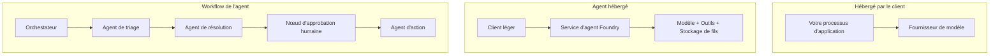
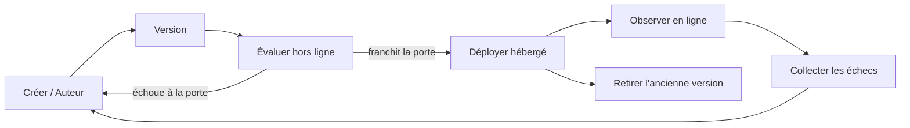
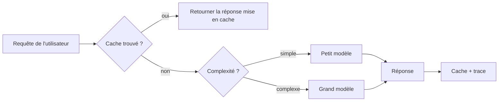
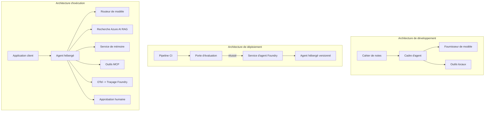

# Déploiement d'agents évolutifs avec Microsoft Foundry


Jusqu'à présent dans le cours, vous avez construit des agents qui s'exécutent sur votre ordinateur portable, à l'intérieur d'un carnet de notes, pilotés par `az login` et quelques variables d'environnement. C'est exactement la bonne façon d'apprendre. Ce n'est pas la bonne façon de faire fonctionner un agent dont des milliers de clients dépendent à 3 heures du matin.

Cette leçon porte sur l'écart entre « ça marche sur ma machine » et « ça marche, de façon fiable et abordable, en production ». Nous comblons cet écart en utilisant **Microsoft Foundry** et le **Microsoft Foundry Agent Service**, et nous le faisons en construisant un véritable agent de support client qui dispose d'outils, de récupération, de mémoire, d'évaluation et de surveillance.

## Introduction

Cette leçon couvrira :

- La différence entre un **agent prototype** et un **agent déployé**, et pourquoi la transition concerne principalement tout ce qui entoure le modèle.
- Les **modèles de déploiement** pour les agents : hébergé côté client, hébergé côté service (Hosted Agents), et orchestré par workflows.
- Le **cycle de vie de l'agent** sur Microsoft Foundry — création, versionnage, déploiement, évaluation, observation, retrait.
- Les **stratégies d’échelle** : routage des modèles, mise en cache, concurrence, et conception sans état.
- **Observabilité** avec OpenTelemetry et traçage Foundry.
- **Optimisation des coûts** via la sélection du modèle, le routage, et les portes d’évaluation.
- **Considérations d'entreprise** : gouvernance, approbation humaine, et exécution sécurisée des serveurs MCP en production.

## Objectifs d'apprentissage

Après avoir terminé cette leçon, vous saurez comment :

- Choisir le bon modèle de déploiement pour une charge de travail d'agent donnée.
- Déployer un agent sur le Microsoft Foundry Agent Service afin qu'il soit versionné, gouverné, et observable.
- Instrumenter un agent pour le traçage et connecter une chaîne d’évaluation qui s'exécute avant chaque publication.
- Appliquer le routage des modèles et la mise en cache pour maîtriser la latence et le coût à grande échelle.
- Ajouter une porte d'approbation humaine pour les actions à haut risque et intégrer un serveur MCP de manière sécurisée en production.

## Prérequis

Cette leçon suppose que vous avez terminé les leçons précédentes et que vous êtes à l'aise avec :

- Construire des agents avec le [Microsoft Agent Framework](../14-microsoft-agent-framework/README.md) (Leçon 14).
- [Utilisation d’outils](../04-tool-use/README.md) (Leçon 4) et [Agentic RAG](../05-agentic-rag/README.md) (Leçon 5).
- [Mémoire de l’agent](../13-agent-memory/README.md) (Leçon 13) et [Protocoles Agentiques / MCP](../11-agentic-protocols/README.md) (Leçon 11).
- [Observabilité et évaluation](../10-ai-agents-production/README.md) (Leçon 10) — cette leçon s'appuie directement dessus.

Vous aurez également besoin de :

- Un **abonnement Azure** et un **projet Microsoft Foundry** avec au moins un modèle de chat déployé.
- L'**Azure CLI** authentifiée (`az login`).
- Python 3.12+ et les paquets dans le fichier [`requirements.txt`](../../../requirements.txt) du dépôt.

## Du prototype à la production : ce qui change vraiment

Un agent prototype et un agent de production partagent la même boucle centrale — raisonner, appeler les outils, répondre. Ce qui change, c’est tout ce qui entoure cette boucle. Le modèle représente environ 20 % d’un agent en production ; les 80 % restants sont le squelette opérationnel.

| Préoccupation | Prototype | Production |
| --- | --- | --- |
| **Hébergement** | S’exécute dans votre carnet | S’exécute comme un service hébergé, versionné et déployé |
| **Identité** | Votre token `az login` | Identité gérée avec RBAC restreint |
| **État** | En mémoire, perdu au redémarrage | Externalisé (magasin de threads, service de mémoire) |
| **Défaillance** | Vous voyez la trace d'erreur | Reprises, secours, boîte d'attente pour erreurs, alertes |
| **Coût** | "C’est quelques centimes" | Suivi par requête, routé, mis en cache, budgété |
| **Qualité** | Vous jugez la sortie à l'œil nu | Évalué automatiquement avant chaque publication |
| **Confiance** | Vous approuvez chaque action | Politique + intervention humaine pour les actions risquées |

Gardez ce tableau à l'esprit. Chaque section ci-dessous correspond à une ligne de ce tableau.

## Modèles de déploiement des agents

Il existe trois modèles que vous utiliserez, souvent en combinaison.

### 1. Agents hébergés côté client

L’objet agent réside dans *votre* processus d’application. Votre code appelle directement le fournisseur de modèle ; la boucle de raisonnement s’exécute dans votre service. C’est ce que toutes les leçons précédentes ont fait.

- **À utiliser quand** vous avez besoin d’un contrôle total sur la boucle, d’un middleware personnalisé, ou vous intégrez l’agent dans un backend existant.
- **Compromis** : vous gérez vous-même la montée en charge, l’état, et la résilience.

### 2. Agents hébergés (Foundry Agent Service)

L’agent est *enregistré comme une ressource* dans Microsoft Foundry. Foundry héberge la boucle de raisonnement, stocke les threads, applique la sécurité de contenu et le RBAC, et rend l’agent visible dans le portail Foundry. Votre application devient un client léger qui crée des threads et lit les réponses.

- **À utiliser quand** vous souhaitez durabilité, observabilité intégrée, gouvernance, et une moindre surface opérationnelle.
- **Compromis** : moins de contrôle bas niveau en échange d’un runtime géré.

### 3. Workflows d’agents

Plusieurs agents (et outils) sont composés en un graphe avec un flux de contrôle explicite — étapes séquentielles, embranchements, nœuds d’approbation humaine, et points de contrôle durables qui peuvent suspendre et reprendre. C’est la capacité **Workflows** du Microsoft Agent Framework appliquée à l’échelle du déploiement.

- **À utiliser quand** une tâche unique implique plusieurs agents spécialisés ou nécessite une étape d’approbation en cours de travail.
- **Compromis** : plus de pièces mobiles ; nécessite une observabilité au niveau de l’orchestration.



## Le cycle de vie de l'agent sur Microsoft Foundry

Déployer un agent n’est pas un simple `push` ponctuel. C’est une boucle, et elle ressemble beaucoup à un cycle de publication logiciel parce que c’est exactement ça.



L’idée clé, issue de la [Leçon 10](../10-ai-agents-production/README.md) : **l’évaluation hors ligne est une porte, pas une réflexion après coup.** Une nouvelle version d’agent ne sera pas publiée à moins qu’elle ne passe vos seuils d’évaluation. L’observabilité en ligne alimente ensuite les échecs réels dans votre ensemble de tests hors ligne. C’est toute la boucle.

## Stratégies de montée en charge

Monter en charge un agent est différent de monter en charge une API web sans état, car chaque requête peut déclencher plusieurs appels coûteux de modèles et d’outils. Quatre techniques supportent la majorité de la charge.

**Gestion sans état des requêtes.** Ne conservez aucun état par utilisateur dans la mémoire de votre processus. Persistez les conversations dans le magasin de threads Foundry ou un service de mémoire pour que n’importe quelle instance puisse traiter n’importe quelle requête. C’est ce qui permet la montée en charge horizontale — ajoutez des instances, pas de sessions collantes.

**Routage des modèles.** Pas chaque requête a besoin de votre modèle le plus performant (et le plus coûteux). Orientez les requêtes simples — classification d’intention, réponses factuelles courtes — vers un petit modèle rapide, et réservez le grand modèle pour le raisonnement réel. Le **Model Router** de Foundry peut faire cela pour vous, ou vous pouvez implémenter un classifieur léger vous-même. Vous construirez la version DIY dans le laboratoire.

**Mise en cache des réponses.** Beaucoup de requêtes de support sont presque identiques ("comment réinitialiser mon mot de passe ?"). Mettez en cache les réponses aux questions communes et servez-les sans interroger le modèle. Même un taux de cache modeste réduit significativement le coût et la latence.

**Concurrence et pression à la source.** Les fournisseurs de modèles ont des limites de débit. Limitez votre concurrence, utilisez des reprises avec backoff exponentiel, et échouez élégamment (une réponse en file d’attente « on s’en occupe » vaut mieux qu’une erreur 500).



## Observabilité en production

Vous ne pouvez pas exploiter ce que vous ne voyez pas. Comme couvert dans la Leçon 10, le Microsoft Agent Framework émet nativement des traces **OpenTelemetry** — chaque appel de modèle, invocation d’outil, et étape d’orchestration devient un span. En production, vous exportez ces spans vers Microsoft Foundry (ou tout backend compatible OTel) pour pouvoir :

- Tracer une plainte client unique de bout en bout à travers chaque appel de modèle et d’outil.
- Surveiller la latence p50/p95 et le coût par requête dans le temps.
- Alerter sur les pics de taux d’erreur et les anomalies de coût avant que vos utilisateurs (ou votre équipe financière) ne les remarquent.

```python
from agent_framework.observability import get_tracer

tracer = get_tracer()

with tracer.start_as_current_span("support_request") as span:
    span.set_attribute("customer.tier", "enterprise")
    span.set_attribute("routed.model", "gpt-5-nano")
    # l'exécution de l'agent est tracée automatiquement à l'intérieur de cette plage
```

Des attributs comme `customer.tier` et `routed.model` transforment un mur de traces en questions exploitables (« les clients entreprise sont-ils trop souvent dirigés vers le petit modèle ? »).

## Optimisation des coûts

Le coût dans les agents de production est dominé par les jetons. Trois leviers, par ordre d’impact :

1. **Bien dimensionner le modèle.** Un petit modèle qui passe votre porte d’évaluation est presque toujours moins cher qu’un grand qui la passe aussi. Utilisez l’évaluation pour *démontrer* que le petit modèle est suffisant au lieu de choisir par défaut le plus grand par prudence.
2. **Routage selon la complexité.** Comme ci-dessus — ne payez le prix du grand modèle que pour les requêtes nécessitant un raisonnement complexe.
3. **Mettez en cache de manière agressive.** L’appel de modèle le moins coûteux est celui que vous ne faites jamais.

Les portes d’évaluation et le contrôle des coûts sont la même discipline vue sous deux angles : l’évaluation vous donne le *plafond de qualité*, le routage et la mise en cache vous rapprochent le plus possible du *coût* de ce plafond.

## Considérations pour le déploiement en entreprise

**Gouvernance.** Les Hosted Agents héritent du RBAC, de la sécurité du contenu et de la journalisation d’audit de Foundry. Donnez à chaque agent une identité gérée avec le moindre privilège nécessaire — accès en lecture seule à la base de connaissances, accès restreint à l’API des tickets, rien de plus.

**Intervention humaine.** Certaines actions sont trop critiques pour être automatisées directement — émettre un remboursement, supprimer un compte, escalader vers une équipe juridique. Le Microsoft Agent Framework supporte les outils **avec approbation requise** : l’agent propose l’action, l’exécution est suspendue, un humain approuve ou rejette, et le workflow reprend. Vous avez vu le primitif dans la [Leçon 6](../06-building-trustworthy-agents/README.md) ; ici vous le déployez.

**MCP en production.** [MCP](../11-agentic-protocols/README.md) permet à votre agent de consommer des outils externes via une interface standard. En production, traitez chaque serveur MCP comme une frontière non fiable : figez la version serveur, exécutez-le avec une identité restreinte, validez ses sorties, et ne lui exposez jamais de secrets. Un serveur MCP est une dépendance, et les dépendances sont patchées, auditées, et soumises à des quotas.



Ces trois diagrammes — développement, déploiement, exécution — représentent le même agent à trois étapes de sa vie. Le laboratoire qui suit vous guide dans sa construction.

## Laboratoire pratique : un agent de support client prêt pour la production

Ouvrez [`code_samples/16-python-agent-framework.ipynb`](./code_samples/16-python-agent-framework.ipynb) et parcourez-le de bout en bout. Vous assemblerez un **agent de support client Contoso** avec toutes les préoccupations de production intégrées :

1. **Appel d’outils** — consultation du statut de commande et ouverture de tickets de support.
2. **RAG** — répondre aux questions de politique depuis une base de connaissances (Azure AI Search, avec un repli mémoire en local pour que le carnet fonctionne sans ressource Search).
3. **Mémoire** — se souvenir du client au fil des tours de conversation.
4. **Routage du modèle** — un classifieur de complexité oriente chaque requête vers un petit ou un grand modèle.
5. **Mise en cache des réponses** — les questions répétées sont servies depuis le cache.
6. **Approbation humaine** — les remboursements au-delà d’un seuil suspendent en attente de validation humaine.
7. **Chaine d’évaluation** — un petit jeu de tests hors ligne note l’agent et agit comme porte de publication.
8. **Observabilité** — traçage OpenTelemetry autour de chaque requête.

### Parcours

Le carnet est organisé pour que chaque préoccupation de production soit une section autonome et exécutable. Le cœur est le gestionnaire de requêtes avec routage plus mise en cache :

```python
async def handle_support_request(query: str, customer_id: str) -> str:
    # 1. Servir depuis le cache lorsque cela est possible.
    cached = response_cache.get(normalize(query))
    if cached:
        return cached

    # 2. Router selon la complexité pour contrôler les coûts.
    model = "gpt-5-nano" if is_simple(query) else "gpt-5-mini"

    # 3. Exécuter l'agent à l'intérieur d'une plage de trace pour l'observabilité.
    with tracer.start_as_current_span("support_request") as span:
        span.set_attribute("routed.model", model)
        span.set_attribute("customer.id", customer_id)
        response = await support_agent.run(query, model=model)

    # 4. Mettre en cache et retourner.
    response_cache.set(normalize(query), response.text)
    return response.text
```

La porte d’évaluation qui protège une publication ressemble à ceci :

```python
async def evaluation_gate(agent, test_cases, threshold: float = 0.8) -> bool:
    passed = 0
    for case in test_cases:
        result = await agent.run(case["input"])
        if score_response(result.text, case["expected"]) >= 0.8:
            passed += 1
    pass_rate = passed / len(test_cases)
    print(f"Evaluation pass rate: {pass_rate:.0%} (gate: {threshold:.0%})")
    return pass_rate >= threshold  # ne déployer que si la porte est franchie
```

Lisez chaque ligne — le carnet garde les primitifs volontairement petits pour que rien ne soit caché derrière un appel de framework.

## Validation d'un agent déployé avec des tests de fumée

La porte d’évaluation ci-dessus s’exécute *hors ligne* contre votre objet agent. Une fois l’agent déployé comme Hosted Agent, vous avez besoin d’un contrôle supplémentaire, encore moins coûteux : **le point d'accès déployé répond-il réellement ?**

Un déploiement "réussi" ne prouve que le plan de contrôle a accepté la définition — il ne prouve pas que l’agent répond. Une dépendance manquante, un mauvais routage du modèle, ou une connexion expirée peut laisser un déploiement vert qui ne renvoie rien. Un **test de fumée** détecte cela en secondes, à chaque déploiement, sans le coût d’une évaluation complète.

Ce dépôt fournit une chaîne de tests de fumée prête à l'emploi construite sur l’action GitHub [AI Smoke Test](https://github.com/marketplace/actions/ai-smoke-test) :

- **Catalogue** — [`tests/lesson-16-smoke-tests.json`](../../../tests/lesson-16-smoke-tests.json) contient les invites et assertions pour l’agent de support Contoso (réponses politique fondées, recherche de commande, maintien du sujet, et continuité multi-tours). Les catalogues des agents d’autres leçons sont à côté — voir [`tests/README.md`](../tests/README.md).
- **Workflow** — [`.github/workflows/smoke-test.yml`](../../../.github/workflows/smoke-test.yml) se connecte avec Azure OIDC et POST chaque invite au point de terminaison Responses de l’agent, échouant la tâche à toute assertion manquée.

```yaml
- name: Smoke-test hosted agent
  uses: JFolberth/ai-smoketest@v1
  with:
    project_endpoint: ${{ inputs.project_endpoint }}
    agent_name: ContosoSupportAgent
    tests_file: tests/lesson-16-smoke-tests.json
```


Exécutez-le depuis l’onglet **Actions** une fois que votre agent est déployé, en fournissant votre point de terminaison de projet Foundry et le nom de l’agent. L’identité fédérée doit avoir le rôle **Utilisateur Azure AI** dans le périmètre du projet Foundry. Pensez aux couches comme une pyramide : les tests de fumée (accessible et répond ?) s’exécutent à chaque déploiement, l’évaluation hors ligne (suffisamment bonne pour être déployée ?) s’exécute avant la promotion, et l’évaluation en ligne (comment se comporte-t-elle en conditions réelles ?) s’exécute en continu.

## Vérification des connaissances

Testez votre compréhension avant de passer à l’exercice.

**1. Environ quelle part d’un agent en production est « le modèle », et qu’est-ce que le reste ?**

<details>
<summary>Réponse</summary>

Le modèle constitue une minorité du système — souvent estimée à environ 20 %. Le reste est le squelette opérationnel : hébergement et gestion des versions, identité et RBAC, état externalisé, gestion des échecs, suivi des coûts, évaluation et contrôle humain dans la boucle. Passer en production consiste surtout à construire tout *autour* de la boucle de raisonnement.
</details>

**2. Quand choisiriez-vous un agent hébergé plutôt qu’un agent hébergé côté client ?**

<details>
<summary>Réponse</summary>

Lorsque vous souhaitez un environnement d’exécution géré avec durabilité intégrée (threads qui persistent et peuvent reprendre), observabilité, sécurité du contenu et RBAC, et que vous êtes prêt à céder un certain contrôle bas niveau de la boucle de raisonnement pour une surface opérationnelle réduite. L’hébergement côté client est préférable lorsque vous avez besoin d’un contrôle total sur la boucle ou que vous intégrez l’agent dans un backend existant.
</details>

**3. Pourquoi un agent évolutif doit-il être sans état dans sa propre mémoire de processus ?**

<details>
<summary>Réponse</summary>

Ainsi, n’importe quelle instance peut traiter n’importe quelle requête, ce qui permet la mise à l’échelle horizontale sans sessions adhérentes. L’état de conversation par utilisateur est externalisé vers un magasin de threads ou un service de mémoire. Si l’état vivait en mémoire de processus, vous le perdriez au redémarrage et ne pourriez pas répartir librement la charge.
</details>

**4. Quel problème résout le routage du modèle, et comment cela se rapporte-t-il à l’évaluation ?**

<details>
<summary>Réponse</summary>

Le routage envoie des requêtes simples à un petit modèle peu coûteux et rapide, et réserve le grand modèle pour un véritable raisonnement, contrôlant ainsi la latence et le coût. Cela se rapporte à l’évaluation car l’évaluation est ce qui *prouve* que le petit modèle est suffisamment bon pour une catégorie de requêtes — le routage sans évaluation est une supposition.
</details>

**5. Qu’est-ce qu’une « porte d’évaluation » et où se situe-t-elle dans le cycle de vie ?**

<details>
<summary>Réponse</summary>

Une porte d’évaluation exécute un ensemble de tests hors ligne contre une nouvelle version de l’agent et bloque le déploiement à moins que le taux de réussite ne dépasse un seuil. Elle se situe entre « version » et « déployer » dans le cycle de vie, faisant de la qualité une condition préalable à la publication plutôt que quelque chose que vous vérifiez après la mise en production.
</details>

**6. Pourquoi un serveur MCP doit-il être considéré comme une frontière non fiable en production ?**

<details>
<summary>Réponse</summary>

Parce qu’il s’agit d’une dépendance externe appelée par votre agent. Vous devez fixer sa version, l’exécuter avec une identité limitée, valider ses sorties, limiter son débit et ne jamais lui exposer de secrets — la même discipline que celle appliquée à toute dépendance tierce. Ses sorties alimentent le raisonnement de votre agent, donc une confiance non validée est un risque de sécurité.
</details>

**7. Quel changement unique a généralement le plus grand impact sur le coût d’un agent en production, et pourquoi ?**

<details>
<summary>Réponse</summary>

Dimensionner correctement le modèle — utiliser le plus petit modèle qui passe encore votre porte d’évaluation. Le coût est dominé par les tokens, et un modèle plus petit qui respecte le seuil de qualité est presque toujours moins cher qu’un plus grand. La mise en cache et le routage réduisent ensuite les coûts, mais choisir le bon modèle de base a le plus grand effet de premier ordre.
</details>

**8. Quel rôle jouent les attributs de span comme `customer.tier` et `routed.model` dans l’observabilité ?**

<details>
<summary>Réponse</summary>

Ils transforment les traces brutes en questions métier auxquelles on peut répondre. Sans attributs, vous avez un mur de spans ; avec eux, vous pouvez demander « les clients entreprises sont-ils trop souvent dirigés vers le petit modèle ? » ou « quel modèle traite nos requêtes les plus lentes ? » Les attributs sont la façon dont vous découpez la télémétrie selon les dimensions importantes pour votre exploitation.
</details>

## Exercice

Prenez l’agent de support client du laboratoire et renforcez-le pour un scénario spécifique : **un agent de support à la facturation par abonnement pour une entreprise SaaS.**

Votre soumission doit :

1. **Remplacer les outils** par ceux pertinents pour la facturation : `get_subscription_status`, `get_invoice` et `issue_credit` (crédits supérieurs à 50 $ nécessitent une approbation humaine).
2. **Ajouter trois documents RAG** couvrant la politique de remboursement de l’entreprise, le cycle de facturation et la politique d’annulation.
3. **Étendre l’ensemble d’évaluation** à au moins huit cas, incluant au moins deux cas qui *doivent* déclencher la voie d’approbation humaine, et confirmer que votre porte d’évaluation passe ou bloque correctement.
4. **Ajouter un rapport de coûts** : après avoir exécuté dix requêtes mixtes via l’agent, afficher combien sont allées au petit modèle, combien au grand modèle, et combien ont été servies depuis le cache.

Rédigez un court paragraphe (dans une cellule markdown) expliquant quelle règle de routage de modèle vous avez choisie et comment vous la valideriez avec un trafic réel. Il n’y a pas de réponse unique correcte — votre évaluation portera sur la cohérence des préoccupations de production reliées ensemble.

## Résumé

Dans cette leçon, vous avez déplacé un agent du prototype à la production avec Microsoft Foundry :

- Le passage en production concerne surtout le **squelette opérationnel** autour du modèle — hébergement, identité, état, gestion des échecs, coûts, qualité et confiance.
- Vous avez appris les trois **modèles de déploiement** — client-hosted, agents hébergés, et workflows d’agents — et quand chacun est adapté.
- Vous avez parcouru le **cycle de vie de l’agent**, où l’évaluation hors ligne **agit comme une porte de libération** et l’observabilité en ligne alimente les échecs dans l’ensemble de tests.
- Vous avez appliqué des **stratégies d’évolutivité** — conception sans état, routage de modèle, mise en cache et concurrence bornée — et relié cela à **l’optimisation des coûts**.
- Vous avez intégré **des contrôles d’entreprise** : RBAC, approbation humaine dans la boucle, et intégration MCP sécurisée pour la production.
- Vous avez construit un **agent de support client prêt pour la production** qui relie toutes ces préoccupations ensemble dans un code exécutable.

La prochaine leçon suit le chemin inverse : au lieu d’étendre les agents dans le cloud, vous les ramènerez *sur* une machine de développeur unique pour les faire fonctionner entièrement localement.

## Ressources supplémentaires

- <a href="https://learn.microsoft.com/azure/ai-foundry/what-is-azure-ai-foundry" target="_blank">Documentation Microsoft Foundry</a>
- <a href="https://learn.microsoft.com/azure/ai-foundry/agents/overview" target="_blank">Présentation du service d’agents Microsoft Foundry</a>
- <a href="https://aka.ms/ai-agents-beginners/agent-framework" target="_blank">Cadre d’agents Microsoft</a>
- <a href="https://learn.microsoft.com/azure/ai-foundry/concepts/model-router" target="_blank">Routage de modèle dans Microsoft Foundry</a>
- <a href="https://learn.microsoft.com/azure/search/search-what-is-azure-search" target="_blank">Azure AI Search</a>
- <a href="https://opentelemetry.io/" target="_blank">OpenTelemetry</a>
- <a href="https://github.com/marketplace/actions/ai-smoke-test" target="_blank">Action GitHub AI Smoke Test</a>
- <a href="https://modelcontextprotocol.io/" target="_blank">Protocole Model Context (MCP)</a>

## Leçon précédente

[Construction d’agents d’utilisation d’ordinateur (CUA)](../15-browser-use/README.md)

## Leçon suivante

[Création d’agents IA locaux](../17-creating-local-ai-agents/README.md)

---

<!-- CO-OP TRANSLATOR DISCLAIMER START -->
**Avertissement** :
Ce document a été traduit à l'aide du service de traduction automatique [Co-op Translator](https://github.com/Azure/co-op-translator). Bien que nous nous efforçions d'assurer l'exactitude, veuillez noter que les traductions automatisées peuvent contenir des erreurs ou des inexactitudes. Le document original dans sa langue native doit être considéré comme la source faisant autorité. Pour les informations critiques, il est recommandé de recourir à une traduction professionnelle réalisée par un humain. Nous ne saurions être tenus responsables des malentendus ou erreurs d'interprétation découlant de l'utilisation de cette traduction.
<!-- CO-OP TRANSLATOR DISCLAIMER END -->