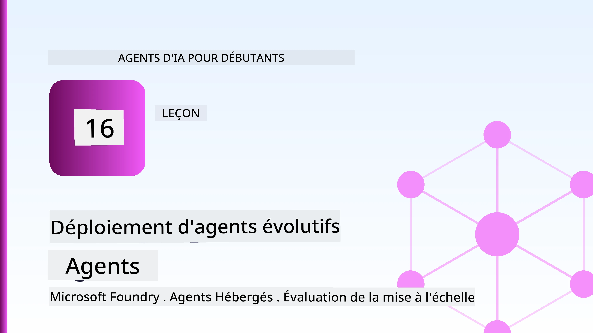
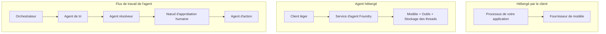
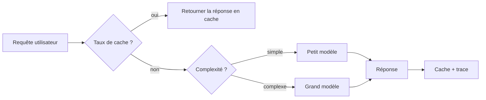
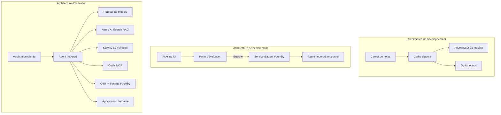

# Déploiement d'agents à grande échelle avec Microsoft Foundry



Jusqu'à présent dans le cours, vous avez construit des agents qui s'exécutent sur votre ordinateur portable, à l'intérieur d'un notebook, pilotés par `az login` et quelques variables d'environnement. C'est exactement la bonne façon d'apprendre. Ce n'est pas la bonne façon d'exécuter un agent dont des milliers de clients dépendent à 3 heures du matin.

Cette leçon porte sur l'écart entre « ça marche sur ma machine » et « ça marche, de manière fiable et abordable, en production ». Nous comblons cet écart en utilisant **Microsoft Foundry** et le **Microsoft Foundry Agent Service**, et nous le faisons en construisant un véritable agent de support client qui dispose d'outils, de récupération, de mémoire, d'évaluation et de surveillance.

## Introduction

Cette leçon couvrira :

- La différence entre un **agent prototype** et un **agent déployé**, et pourquoi la transition concerne surtout tout ce qui *entoure* le modèle.
- Les **modèles de déploiement** pour les agents : hébergés côté client, hébergés en service (Agents hébergés) et orchestrés par un workflow.
- Le **cycle de vie de l'agent** sur Microsoft Foundry — création, versionnage, déploiement, évaluation, observation, retrait.
- Les **stratégies de montée en charge** : routage du modèle, mise en cache, concurrence et conception sans état.
- L'**observabilité** avec OpenTelemetry et le traçage Foundry.
- L'**optimisation des coûts** via la sélection du modèle, le routage et les contrôles d'évaluation.
- Les **considérations d'entreprise** : gouvernance, validation humaine et exécution sécurisée des serveurs MCP en production.

## Objectifs d'apprentissage

Après avoir terminé cette leçon, vous saurez comment :

- Choisir le bon modèle de déploiement pour une charge de travail agent donnée.
- Déployer un agent sur le Microsoft Foundry Agent Service afin qu'il soit versionné, gouverné et observable.
- Instrumenter un agent pour le traçage et connecter un pipeline d'évaluation qui fonctionne avant chaque publication.
- Appliquer le routage du modèle et la mise en cache pour garder la latence et le coût sous contrôle à grande échelle.
- Ajouter un contrôle de validation humaine pour les actions à risque élevé et intégrer un serveur MCP de manière sécurisée en production.

## Prérequis

Cette leçon suppose que vous avez terminé les leçons précédentes et que vous êtes à l'aise avec :

- La construction d'agents avec le [Microsoft Agent Framework](../14-microsoft-agent-framework/README.md) (Leçon 14).
- [Utilisation d'outils](../04-tool-use/README.md) (Leçon 4) et [Agentic RAG](../05-agentic-rag/README.md) (Leçon 5).
- [Mémoire d'agent](../13-agent-memory/README.md) (Leçon 13) et [Protocoles agentiques / MCP](../11-agentic-protocols/README.md) (Leçon 11).
- [Observabilité et évaluation](../10-ai-agents-production/README.md) (Leçon 10) — cette leçon s'appuie directement dessus.

Vous aurez également besoin de :

- Un **abonnement Azure** et un **projet Microsoft Foundry** avec au moins un modèle de chat déployé.
- L'**Azure CLI** authentifié (`az login`).
- Python 3.12+ et les paquets du dépôt [`requirements.txt`](../../../requirements.txt).

## Du prototype à la production : ce qui change réellement

Un agent prototype et un agent de production partagent la même boucle centrale — raisonner, appeler des outils, répondre. Ce qui change est tout ce qui entoure cette boucle. Le modèle représente peut-être 20 % d'un agent de production ; les 80 % restants sont le squelette opérationnel.

| Préoccupation | Prototype | Production |
| --- | --- | --- |
| **Hébergement** | S'exécute dans votre notebook | S'exécute en tant que service hébergé, versionné et déployé |
| **Identité** | Votre token `az login` | Identité gérée avec RBAC ciblé |
| **État** | En mémoire, perdu au redémarrage | Externalisé (magasin de fils, service mémoire) |
| **Défaillance** | Vous voyez la trace des erreurs | Retentatives, repli, dead-letter, alertes |
| **Coût** | « Ça coûte quelques centimes » | Suivi par requête, routé, mis en cache, budgété |
| **Qualité** | Vous évaluez visuellement la sortie | Évalué automatiquement avant chaque publication |
| **Confiance** | Vous approuvez chaque action | Politique + intervention humaine pour les actions risquées |

Gardez ce tableau en tête. Chaque section ci-dessous correspond à une de ces lignes.

## Modèles de déploiement des agents

Il y a trois modèles que vous utiliserez souvent en combinaison.

### 1. Agents hébergés côté client

L'objet agent vit à l'intérieur du processus de *votre* application. Votre code appelle directement le fournisseur de modèle ; la boucle de raisonnement s'exécute dans votre service. C'est ce que toutes les leçons précédentes ont fait.

- **À utiliser lorsque** vous avez besoin d'un contrôle total sur la boucle, de middleware personnalisé, ou si vous intégrez l'agent dans un backend existant.
- **Inconvénient** : vous gérez vous-même la montée en charge, l'état et la résilience.

### 2. Agents hébergés (Foundry Agent Service)

L'agent est *enregistré en tant que ressource* dans Microsoft Foundry. Foundry héberge la boucle de raisonnement, stocke les fils, applique la sécurité des contenus et le RBAC, et rend l'agent visible dans le portail Foundry. Votre application devient un client léger qui crée des fils et lit les réponses.

- **À utiliser lorsque** vous voulez de la durabilité, une observabilité intégrée, une gouvernance et une moindre surface opérationnelle.
- **Inconvénient** : moins de contrôle bas niveau en échange d'un runtime géré.

### 3. Workflows d'agents

Plusieurs agents (et outils) sont composés en un graphe avec un flux de contrôle explicite — étapes séquentielles, branches, nœuds de validation humaine et points de contrôle durables pouvant se mettre en pause et reprendre. C'est la capacité **Workflows** de Microsoft Agent Framework appliquée à l'échelle du déploiement.

- **À utiliser lorsque** une tâche unique s'étend sur plusieurs agents spécialisés ou nécessite une étape de validation au milieu.
- **Inconvénient** : plus de parties mobiles ; nécessite une observabilité au niveau de l'orchestration.



## Le cycle de vie de l'agent sur Microsoft Foundry

Déployer un agent n'est pas un simple `push`. C'est une boucle, qui ressemble beaucoup à un cycle de publication de logiciel parce que c'est exactement ce que c'est.


L'idée clé, héritée de la [Leçon 10](../10-ai-agents-production/README.md) : **l'évaluation hors ligne est une condition préalable, pas une réflexion après coup.** Une nouvelle version d'agent n'est pas publiée à moins de franchir vos seuils d'évaluation. L'observabilité en ligne alimente ensuite les défaillances du monde réel dans votre jeu de tests hors ligne. C'est toute la boucle.

## Stratégies de montée en charge

La montée en charge d'un agent est différente de celle d'une API web sans état, car chaque requête peut déclencher plusieurs appels coûteux de modèles et d'outils. Quatre techniques supportent la majeure partie de la charge.

**Gestion sans état des requêtes.** Ne conservez pas d'état par utilisateur dans la mémoire de votre processus. Persistez les fils de conversation dans le magasin de fils Foundry ou un service de mémoire afin que n'importe quelle instance puisse gérer n'importe quelle requête. C'est ce qui vous permet de monter en charge horizontalement — ajoutez des instances, pas de sessions collantes.

**Routage du modèle.** Toutes les requêtes ne nécessitent pas votre modèle le plus performant (et le plus cher). Orientez les requêtes simples — classification d'intention, réponses factuelles courtes — vers un petit modèle rapide, et réservez le grand modèle pour un véritable raisonnement. Le **Routeur de Modèle** de Foundry peut le faire pour vous, ou vous pouvez implémenter un classifieur léger vous-même. Vous construirez la version DIY dans le laboratoire.

**Mise en cache des réponses.** De nombreuses questions au support sont presque des doublons (« comment réinitialiser mon mot de passe ? »). Mettez en cache les réponses aux questions courantes et servez-les sans interroger le modèle du tout. Même un taux de cache modeste réduit sensiblement les coûts et la latence.

**Concurrence et backpressure.** Les fournisseurs de modèles ont des limites de débit. Limitez votre concurrence, utilisez des retentatives avec backoff exponentiel, et échouez gracieusement (une réponse en file d'attente « on s'en occupe » vaut mieux qu'une erreur 500).



## Observabilité en production

Vous ne pouvez pas exploiter ce que vous ne voyez pas. Comme couvert dans la Leçon 10, Microsoft Agent Framework émet nativement des traces **OpenTelemetry** — chaque appel de modèle, invocation d'outil et étape d'orchestration devient un span. En production, vous exportez ces spans vers Microsoft Foundry (ou tout backend compatible OTel) pour pouvoir :

- Tracer une plainte client de bout en bout à travers chaque appel de modèle et d'outil.
- Suivre la latence p50/p95 et le coût par requête dans le temps.
- Alerter sur les pics de taux d'erreurs et les anomalies de coût avant que vos utilisateurs (ou votre équipe finance) ne les remarquent.

```python
from agent_framework.observability import get_tracer

tracer = get_tracer()

with tracer.start_as_current_span("support_request") as span:
    span.set_attribute("customer.tier", "enterprise")
    span.set_attribute("routed.model", "gpt-4.1-mini")
    # l'exécution de l'agent est tracée automatiquement à l'intérieur de cette plage
```

Des attributs comme `customer.tier` et `routed.model` transforment un mur de traces en questions pertinentes (« les clients entreprises sont-ils trop souvent dirigés vers le petit modèle ? »).

## Optimisation des coûts

Les coûts dans les agents de production sont dominés par les tokens. Trois leviers, par ordre d'impact :

1. **Adapter la taille du modèle.** Un petit modèle qui passe votre contrôle d'évaluation est presque toujours moins cher qu'un grand qui passe aussi. Utilisez l'évaluation pour *prouver* que le petit modèle est suffisamment bon plutôt que de par défaut choisir le plus grand par prudence.
2. **Routage selon la complexité.** Comme ci-dessus — ne payez le prix du grand modèle que pour les requêtes nécessitant un raisonnement de grand modèle.
3. **Cacher agressivement.** L'appel de modèle le moins cher est celui que vous ne faites jamais.

Les contrôles d'évaluation et la gestion des coûts sont la même discipline vue sous deux angles : l'évaluation vous indique le *plancher de qualité*, le routage et la mise en cache vous maintiennent aussi proche que possible du *coût* de ce plancher.

## Considérations pour le déploiement en entreprise

**Gouvernance.** Les Agents hébergés héritent du RBAC, de la sécurité des contenus et du journal d'audit de Foundry. Donnez à chaque agent une identité gérée avec les privilèges minimaux nécessaires — accès en lecture seule à la base de connaissances, accès ciblé à l'API de tickets, rien de plus.

**Intervention humaine.** Certaines actions sont trop lourdes de conséquences pour être automatisées directement — émettre un remboursement, supprimer un compte, escalader vers l'équipe juridique. Microsoft Agent Framework supporte les outils **nécessitant une approbation** : l'agent propose l'action, l'exécution se met en pause, un humain approuve ou rejette, et le workflow reprend. Vous avez vu le primitif dans la [Leçon 6](../06-building-trustworthy-agents/README.md) ; ici vous le déployez.

**MCP en production.** [MCP](../11-agentic-protocols/README.md) permet à votre agent de consommer des outils externes via une interface standard. En production, traitez chaque serveur MCP comme une frontière non fiable : fixez la version du serveur, exécutez-le avec une identité ciblée, validez ses sorties, et ne lui exposez jamais de secrets. Un serveur MCP est une dépendance, et les dépendances sont patchées, auditées et soumises à des limites de débit.



Ces trois diagrammes — développement, déploiement, exécution — représentent le même agent à trois étapes de sa vie. Le laboratoire qui suit vous accompagne dans sa construction.

## Laboratoire pratique : un agent de support client prêt pour la production

Ouvrez [`code_samples/16-python-agent-framework.ipynb`](./code_samples/16-python-agent-framework.ipynb) et parcourez-le intégralement. Vous assemblerez un **agent de support client Contoso** avec toutes les préoccupations de production intégrées :

1. **Appel d'outils** — consulter le statut des commandes et ouvrir des tickets de support.
2. **RAG** — répondre aux questions de politique depuis une base de connaissances (Azure AI Search, avec une solution de secours en mémoire pour que le notebook fonctionne sans ressource Search).
3. **Mémoire** — se rappeler du client au fil des tours de conversation.
4. **Routage du modèle** — un classifieur de complexité envoie chaque requête vers un petit ou un grand modèle.
5. **Mise en cache des réponses** — les questions répétées sont servies depuis le cache.
6. **Validation humaine** — les remboursements au-delà d'un seuil s'arrêtent pour validation humaine.
7. **Pipeline d'évaluation** — un petit jeu de tests hors ligne évalue l'agent et sert de condition de publication.
8. **Observabilité** — traçage OpenTelemetry autour de chaque requête.

### Déroulé

Le notebook est organisé pour que chaque préoccupation de production soit une section autonome et exécutable. Le cœur en est le gestionnaire de requêtes avec routage et mise en cache :

```python
async def handle_support_request(query: str, customer_id: str) -> str:
    # 1. Servir depuis le cache lorsque c'est possible.
    cached = response_cache.get(normalize(query))
    if cached:
        return cached

    # 2. Acheminer par complexité pour contrôler le coût.
    model = "gpt-4.1-mini" if is_simple(query) else "gpt-4.1"

    # 3. Exécuter l'agent à l'intérieur d'une trace pour l'observabilité.
    with tracer.start_as_current_span("support_request") as span:
        span.set_attribute("routed.model", model)
        span.set_attribute("customer.id", customer_id)
        response = await support_agent.run(query, model=model)

    # 4. Mettre en cache et retourner.
    response_cache.set(normalize(query), response.text)
    return response.text
```

Le contrôle d'évaluation qui protège une publication ressemble à ceci :

```python
async def evaluation_gate(agent, test_cases, threshold: float = 0.8) -> bool:
    passed = 0
    for case in test_cases:
        result = await agent.run(case["input"])
        if score_response(result.text, case["expected"]) >= 0.8:
            passed += 1
    pass_rate = passed / len(test_cases)
    print(f"Evaluation pass rate: {pass_rate:.0%} (gate: {threshold:.0%})")
    return pass_rate >= threshold  # déployer uniquement si la porte est franchie
```

Lisez chaque ligne — le notebook maintient les primitives volontairement petites pour que rien ne soit caché derrière un appel de framework.

## Validation d'un agent déployé avec des tests basiques

Le contrôle d'évaluation ci-dessus s'exécute *hors ligne* sur votre objet agent. Une fois l'agent déployé en tant qu'Agent hébergé, vous avez besoin d'un contrôle supplémentaire, encore moins coûteux : **le point de terminaison déployé répond-il réellement ?**

Un déploiement « réussi » ne prouve que que le plan de contrôle a accepté la définition — cela ne prouve pas que l’agent répond. Une dépendance manquante, un mauvais routage modèle ou une connexion expirée peuvent laisser un déploiement vert qui ne renvoie rien. Un **test de fumée** détecte cela en quelques secondes, à chaque déploiement, sans le coût d'une évaluation complète.

Ce dépôt fournit un pipeline de test de fumée prêt à l'emploi basé sur l'action GitHub [AI Smoke Test](https://github.com/marketplace/actions/ai-smoke-test) :

- **Catalogue** — [`tests/lesson-16-smoke-tests.json`](../../../tests/lesson-16-smoke-tests.json) contient des invites et assertions pour l'agent de support Contoso (réponses politiques fondées, consultation de commande, maintien du sujet, continuité multi-tours). Les catalogues pour les agents des autres leçons vivent à côté — voir [`tests/README.md`](../tests/README.md).
- **Workflow** — [`.github/workflows/smoke-test.yml`](../../../.github/workflows/smoke-test.yml) connecte via Azure OIDC et poste chaque invite au point de terminaison Responses de l'agent, échouant le job sur toute assertion ratée.

```yaml
- name: Smoke-test hosted agent
  uses: JFolberth/ai-smoketest@v1
  with:
    project_endpoint: ${{ inputs.project_endpoint }}
    agent_name: ContosoSupportAgent
    tests_file: tests/lesson-16-smoke-tests.json
```


Exécutez-le depuis l'onglet **Actions** une fois que votre agent est déployé, en fournissant le point de terminaison de votre projet Foundry et le nom de l'agent. L'identité fédérée doit avoir le rôle **Azure AI User** au niveau du projet Foundry. Pensez aux couches comme une pyramide : les tests de fumée (accessible et répond-il ?) s’exécutent à chaque déploiement, l’évaluation hors ligne (suffisamment bon pour être livré ?) s’effectue avant la promotion, et l’évaluation en ligne (comment se comporte-t-il en conditions réelles ?) s’exécute en continu.

## Vérification des connaissances

Testez votre compréhension avant de passer à l'exercice.

**1. Environ quelle part d’un agent en production est "le modèle", et qu’est-ce qui constitue le reste ?**

<details>
<summary>Réponse</summary>

Le modèle constitue une minorité du système — souvent cité comme environ 20 %. Le reste est le squelette opérationnel : hébergement et gestion des versions, identité et contrôle d'accès basé sur les rôles (RBAC), état externalisé, gestion des échecs, suivi des coûts, évaluation et contrôles avec intervention humaine. Passer en production consiste principalement à construire tout *autour* de la boucle de raisonnement.
</details>

**2. Quand choisiriez-vous un agent hébergé plutôt qu’un agent hébergé côté client ?**

<details>
<summary>Réponse</summary>

Lorsque vous souhaitez un environnement d'exécution géré avec durabilité intégrée (threads qui persistent et peuvent reprendre), observabilité, sécurité de contenu et RBAC, et que vous êtes prêt à échanger un peu de contrôle bas niveau sur la boucle de raisonnement contre une moindre surface opérationnelle. L’agent côté client est préférable lorsque vous avez besoin d’un contrôle total sur la boucle ou que vous intégrez l’agent dans un backend existant.
</details>

**3. Pourquoi un agent scalable doit-il être sans état dans sa propre mémoire de processus ?**

<details>
<summary>Réponse</summary>

Afin que n'importe quelle instance puisse gérer n'importe quelle requête, ce qui permet une mise à l'échelle horizontale sans sessions collantes. L'état des conversations par utilisateur est externalisé dans un magasin de threads ou un service de mémoire. Si l'état était en mémoire de processus, vous le perdriez au redémarrage et ne pourriez pas répartir librement la charge.
</details>

**4. Quel problème résout le routage de modèle, et comment est-il lié à l’évaluation ?**

<details>
<summary>Réponse</summary>

Le routage envoie les requêtes simples à un petit modèle peu coûteux et rapide, et réserve le grand modèle pour le vrai raisonnement, contrôlant à la fois la latence et le coût. Cela est lié à l’évaluation car c’est l’évaluation qui *prouve* que le petit modèle est assez bon pour une catégorie de requêtes — le routage sans évaluation est une supposition.
</details>

**5. Qu’est-ce qu’une "porte d’évaluation" et où se situe-t-elle dans le cycle de vie ?**

<details>
<summary>Réponse</summary>

Une porte d’évaluation exécute un jeu de tests hors ligne contre une nouvelle version de l’agent et bloque le déploiement à moins que le taux de réussite dépasse un seuil. Elle se situe entre "version" et "déploiement" dans le cycle de vie, faisant de la qualité une condition préalable à la sortie plutôt que quelque chose à vérifier après livraison.
</details>

**6. Pourquoi un serveur MCP doit-il être considéré comme une frontière non fiable en production ?**

<details>
<summary>Réponse</summary>

Parce qu’il s’agit d’une dépendance externe appelée par votre agent. Vous devez fixer sa version, l’exécuter avec une identité restreinte, valider ses sorties, limiter son débit, et ne jamais lui exposer de secrets — la même discipline que pour toute dépendance tierce. Ses sorties alimentent le raisonnement de votre agent, donc une confiance non validée constitue un risque de sécurité.
</details>

**7. Quel changement unique a généralement le plus grand impact sur le coût d’un agent en production, et pourquoi ?**

<details>
<summary>Réponse</summary>

Ajuster la taille du modèle — utiliser le plus petit modèle qui passe encore votre porte d’évaluation. Le coût est dominé par les tokens, et un modèle plus petit qui atteint le seuil de qualité est presque toujours moins cher qu’un plus grand. La mise en cache et le routage réduisent ensuite encore le coût, mais choisir le bon modèle de base a le plus grand effet de premier ordre.
</details>

**8. Quel rôle jouent les attributs de span comme `customer.tier` et `routed.model` dans l’observabilité ?**

<details>
<summary>Réponse</summary>

Ils transforment les traces brutes en questions business auxquelles on peut répondre. Sans attributs, vous avez un mur de spans ; avec eux, vous pouvez demander « les clients entreprise sont-ils routés trop souvent vers le petit modèle ? » ou « quel modèle gère nos requêtes les plus lentes ? » Les attributs permettent de segmenter la télémétrie selon les dimensions importantes pour votre exploitation.
</details>

## Exercice

Prenez l’agent de support client du laboratoire et renforcez-le pour un scénario spécifique : **un agent de support facturation par abonnement pour une société SaaS.**

Votre soumission doit :

1. **Remplacer les outils** par ceux pertinents pour la facturation : `get_subscription_status`, `get_invoice`, et `issue_credit` (les crédits supérieurs à 50$ nécessitent une approbation humaine).
2. **Ajouter trois documents RAG** couvrant la politique de remboursement de l’entreprise, le cycle de facturation, et la politique d’annulation.
3. **Étendre le jeu d’évaluation** à au moins huit cas, incluant au moins deux qui *devraient* déclencher la voie d’approbation humaine, et confirmer que votre porte d’évaluation passe ou échoue correctement.
4. **Ajouter un rapport de coûts** : après avoir exécuté dix requêtes mixtes via l’agent, imprimer combien ont été envoyées au petit modèle, combien au grand modèle, et combien ont été servies depuis le cache.

Rédigez un court paragraphe (dans une cellule markdown) expliquant quelle règle de routage de modèle vous avez choisie et comment vous la valideriez avec du trafic réel. Il n’y a pas de réponse unique — vous êtes évalué sur la cohérence des préoccupations liées à la production.

## Résumé

Dans cette leçon, vous avez fait passer un agent du prototype à la production avec Microsoft Foundry :

- Le passage à la production concerne principalement le **squelette opérationnel** autour du modèle — hébergement, identité, état, gestion des échecs, coût, qualité et confiance.
- Vous avez appris les trois **modèles de déploiement** — côté client, agents hébergés, et workflows d’agents — et quand les utiliser.
- Vous avez parcouru le **cycle de vie de l’agent**, où l’**évaluation hors ligne agit comme une porte de sortie** et l’observabilité en ligne réinjecte les échecs dans le jeu de tests.
- Vous avez appliqué des **stratégies d’échelle** — conception sans état, routage de modèle, mise en cache, et concurrences bornées — et les avez reliées à l’**optimisation des coûts**.
- Vous avez intégré des **contrôles d'entreprise** : RBAC, approbation humaine, et intégration MCP sécurisée pour la production.
- Vous avez construit un **agent support client prêt pour la production** qui relie toutes ces préoccupations en code exécutable.

La leçon suivante effectue le chemin inverse : au lieu de faire monter les agents dans le cloud, vous allez les faire *descendre* sur une seule machine développeur et les exécuter entièrement en local.

## Ressources supplémentaires

- <a href="https://learn.microsoft.com/azure/ai-foundry/what-is-azure-ai-foundry" target="_blank">Documentation Microsoft Foundry</a>
- <a href="https://learn.microsoft.com/azure/ai-foundry/agents/overview" target="_blank">Présentation du service Agent Microsoft Foundry</a>
- <a href="https://aka.ms/ai-agents-beginners/agent-framework" target="_blank">Microsoft Agent Framework</a>
- <a href="https://learn.microsoft.com/azure/ai-foundry/concepts/model-router" target="_blank">Routeur de modèle dans Microsoft Foundry</a>
- <a href="https://learn.microsoft.com/azure/search/search-what-is-azure-search" target="_blank">Azure AI Search</a>
- <a href="https://opentelemetry.io/" target="_blank">OpenTelemetry</a>
- <a href="https://github.com/marketplace/actions/ai-smoke-test" target="_blank">Action GitHub AI Smoke Test</a>
- <a href="https://modelcontextprotocol.io/" target="_blank">Model Context Protocol (MCP)</a>

## Leçon précédente

[Création d’agents d’utilisation informatique (CUA)](../15-browser-use/README.md)

## Leçon suivante

[Créer des agents IA locaux](../17-creating-local-ai-agents/README.md)

---

<!-- CO-OP TRANSLATOR DISCLAIMER START -->
**Avertissement** :
Ce document a été traduit à l'aide du service de traduction automatique [Co-op Translator](https://github.com/Azure/co-op-translator). Bien que nous nous efforçions d'assurer l'exactitude, veuillez noter que les traductions automatisées peuvent contenir des erreurs ou des inexactitudes. Le document original dans sa langue native doit être considéré comme la source faisant autorité. Pour les informations critiques, il est recommandé de recourir à une traduction professionnelle réalisée par un humain. Nous ne saurions être tenus responsables des malentendus ou erreurs d'interprétation découlant de l'utilisation de cette traduction.
<!-- CO-OP TRANSLATOR DISCLAIMER END -->