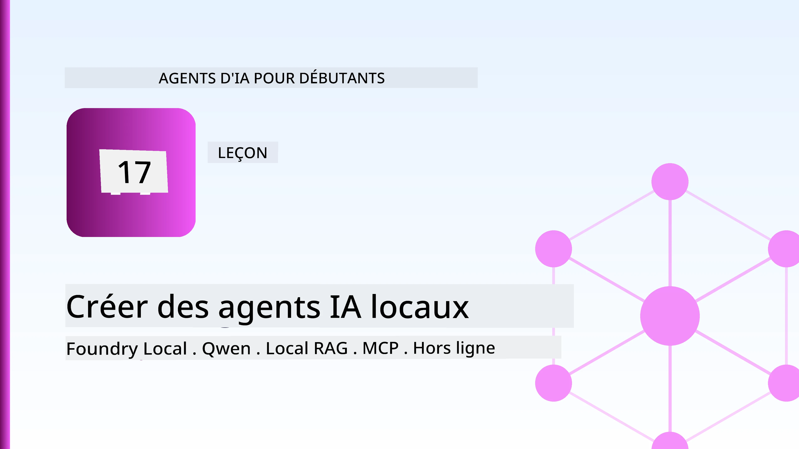
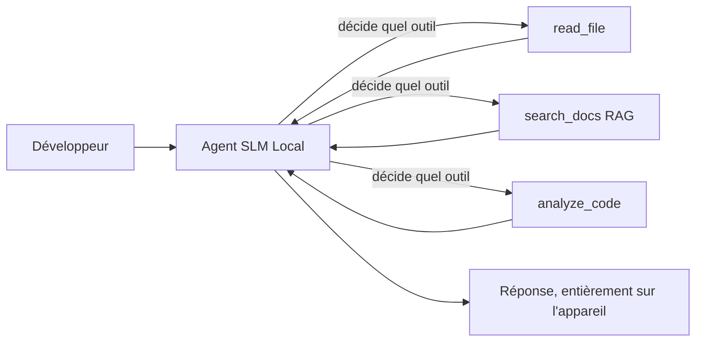
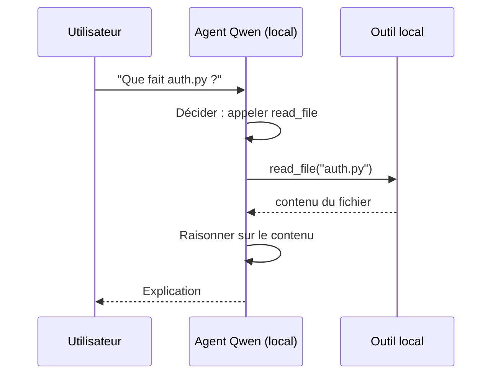
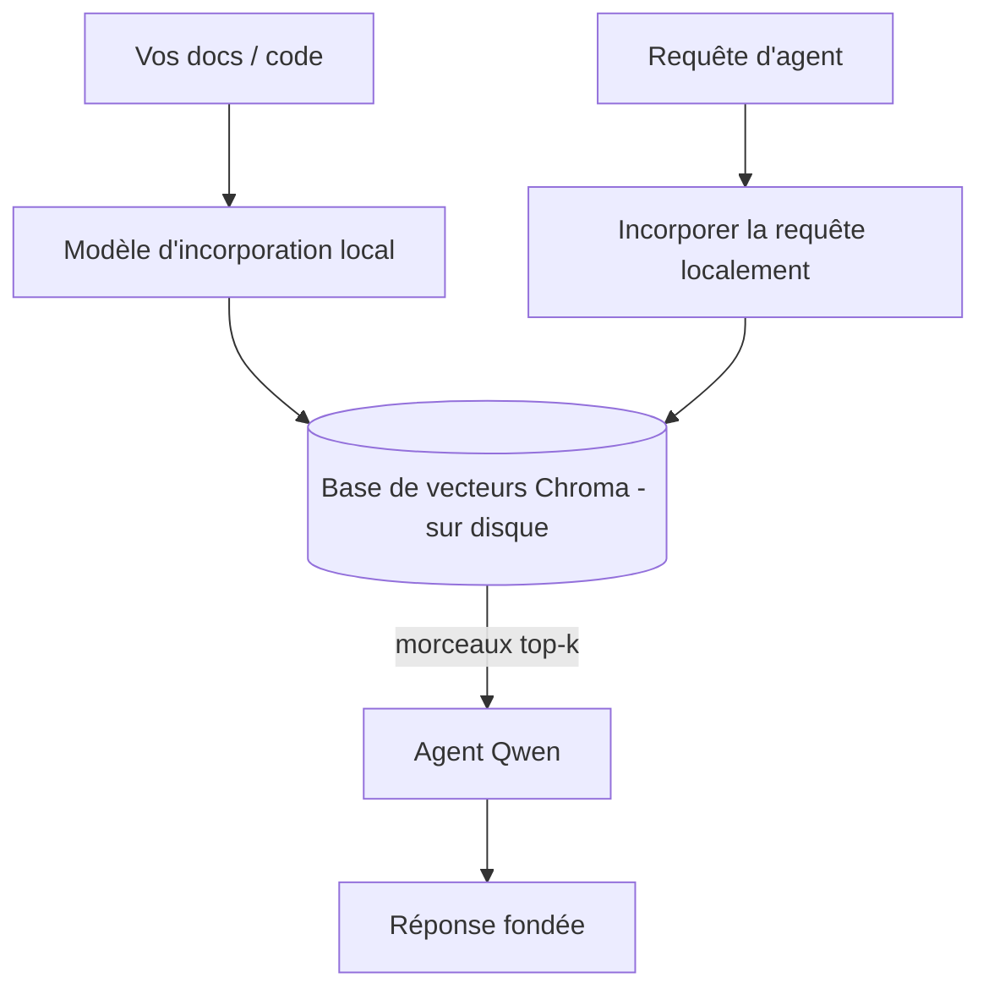
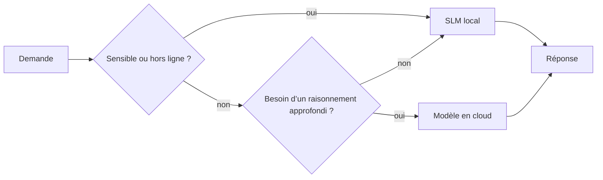

# Création d'agents IA locaux avec Microsoft Foundry Local et Qwen



La leçon précédente a étendu les agents *vers le haut* dans le cloud. Celle-ci les ramène *vers le bas* sur une seule machine. À la fin, vous aurez un assistant ingénieur opérationnel qui raisonne, appelle des outils, lit vos fichiers, et recherche dans votre documentation — **sans une seule requête d'inférence dans le cloud.**

Pourquoi voudriez-vous cela ? Trois raisons qui reviennent constamment dans le travail d'ingénierie réel :

- **Confidentialité.** Le code et les documents ne quittent jamais la machine. Aucune invite, aucun extrait, aucune donnée client ne traverse la frontière réseau.
- **Coût.** L'inférence locale ne génère aucune facture par token. Vous pouvez itérer toute la journée pour le prix de l'électricité.
- **Hors ligne.** Dans un avion, dans une installation sécurisée ou lors d'une panne, l'agent fonctionne toujours.

Le compromis est que vous échangez un modèle cloud de pointe contre un **Petit Modèle de Langage (SLM)** fonctionnant sur votre CPU, GPU ou NPU. Cette leçon porte sur la construction d'agents qui sont *bons* dans cette contrainte plutôt que de faire comme si elle n'existait pas.

## Introduction

Cette leçon couvrira :

- **Petits Modèles de Langage (SLM)** — ce qu'ils sont, où ils excellent et où ils sont moins performants.
- **Microsoft Foundry Local** — un runtime qui télécharge et sert les modèles localement via une **API compatible OpenAI**.
- **Modèles Qwen d'appel de fonctions** — des SLM formés pour produire des appels d'outils fiables, ce qui rend les *agents* locaux (et pas seulement le chat local) possibles.
- **Outils locaux, RAG local et MCP local** — apportant des capacités à l'agent sans le cloud.
- **Modèles hybrides** — quand garder les choses locales et quand solliciter le cloud.

## Objectifs d'apprentissage

Après avoir terminé cette leçon, vous saurez comment :

- Expliquer les compromis des SLM et choisir des cas d’usage appropriés pour un agent local.
- Servir un modèle Qwen localement avec Foundry Local et s'y connecter via le point de terminaison compatible OpenAI.
- Construire un agent appelant des outils fonctionnant entièrement sur votre poste de travail.
- Ajouter un RAG local sur vos propres documents en utilisant une base de vecteurs locale (Chroma).
- Connecter l'agent à un serveur MCP local et raisonner sur des architectures hybrides local/cloud.

## Prérequis

Cette leçon suppose que vous avez complété les leçons précédentes et que vous êtes à l'aise avec :

- [Utilisation d'outils](../04-tool-use/README.md) (Leçon 4) et [RAG agentique](../05-agentic-rag/README.md) (Leçon 5).
- [Protocoles agentiques / MCP](../11-agentic-protocols/README.md) (Leçon 11).
- Le [Microsoft Agent Framework](../14-microsoft-agent-framework/README.md) (Leçon 14).

Vous aurez également besoin de :

- Un poste de travail de développeur. **8 Go de RAM est un minimum réaliste** ; 16 Go et plus est confortable. Une GPU ou NPU aide, mais n’est pas obligatoire.
- **Microsoft Foundry Local** installé (voir section d’installation ci-dessous).
- Python 3.12+ et les packages du dépôt [`requirements.txt`](../../../requirements.txt), plus `foundry-local-sdk`, `openai`, et `chromadb` pour cette leçon.

## Petits Modèles de Langage : L'outil adapté pour le travail local

Un modèle de pointe dans le cloud possède des centaines de milliards de paramètres et un centre de données derrière lui. Un SLM a quelques milliards de paramètres et doit tenir dans la RAM de votre ordinateur portable. Cette différence fixe des attentes claires.

**Les SLM excellent dans :**

- Les tâches structurées et bornées — classification, extraction, résumé d’un document connu.
- **Appel d'outils** — décider quelle fonction appeler et avec quels arguments.
- Itération rapide, économique et privée sur vos propres données.

**Les SLM sont moins bons dans :**

- Raisonnement ouvert et multi-sauts sur un contexte large.
- Connaissance générale étendue (ils en ont vu moins et oublient plus).

La stratégie gagnante pour les agents locaux est donc : **laisser le SLM orchestrer, et laisser les outils faire le travail lourd.** Le modèle n’a pas besoin de *connaître* votre base de code — il doit savoir quand appeler `read_file` et `search_docs`. Cela exploite directement les forces d’un SLM.



## Microsoft Foundry Local

**Microsoft Foundry Local** est un runtime léger qui télécharge, gère et sert les modèles entièrement sur votre machine. Sa fonction la plus importante pour nous est qu’il expose un **point de terminaison HTTP compatible OpenAI** — ce qui signifie que le SDK OpenAI et le client OpenAI du Microsoft Agent Framework fonctionnent avec lui en ne changeant que le `base_url`. Tout ce que vous avez appris sur la construction d’agents se transpose directement ; seul le point de terminaison change, du cloud vers `localhost`.

Foundry Local choisit également automatiquement la meilleure version d’un modèle pour votre matériel — une version CPU, CUDA/GPU ou NPU — vous n’avez pas à optimiser manuellement par machine.

### Installation

Installez Foundry Local (voir la [documentation](https://learn.microsoft.com/azure/ai-foundry/foundry-local/) pour votre OS), puis confirmez que cela fonctionne :

```bash
# Installer (exemple ; suivez la documentation pour votre plateforme)
winget install Microsoft.FoundryLocal      # Windows
# brew install microsoft/foundrylocal/foundrylocal   # macOS

# Téléchargez et exécutez un modèle Qwen, puis démarrez le service local
foundry model run qwen2.5-7b-instruct
foundry service status
```

Une fois le service en marche, vous avez un point de terminaison local compatible OpenAI (généralement `http://localhost:PORT/v1`). Le notebook utilise le `foundry-local-sdk` pour découvrir automatiquement le point de terminaison, vous n’avez donc pas besoin de coder en dur le port.

## Appels de fonctions Qwen : pourquoi c’est important

Un agent n’est un agent que s’il peut appeler des outils. Beaucoup de SLM peuvent discuter mais produisent des appels d’outil peu fiables ou mal formés. Les modèles **Qwen** sont entraînés pour l’appel de fonctions et émettent systématiquement des structures d’appels d’outils bien formées — ce qui transforme un modèle de chat local en *agent* local.

Le flux est la boucle standard d’appel d’outils que vous connaissez déjà, juste en local :



## RAG local

La recherche documentaire est là où les agents locaux gagnent leur place. Au lieu d’espérer que le SLM ait mémorisé les docs de votre framework, vous intégrez ces docs dans une **base vectorielle locale** et laissez l’agent récupérer les passages pertinents à la demande.

Nous utilisons **Chroma**, un magasin de vecteurs embarqué qui fonctionne en processus sans serveur à gérer. La chaîne est entièrement locale : modèle d’intégration local → vecteurs locaux → récupération locale → SLM local.



C’est le même modèle Agentic RAG de la leçon 5 — la seule différence est que chaque composant s’exécute sur votre machine.

## Serveurs MCP locaux

[MCP](../11-agentic-protocols/README.md) est un transport, pas un service cloud. Un serveur MCP peut tourner comme un processus local sur `stdio`, exposant des outils à votre agent via le protocole standard. Cela vous permet de réutiliser l’écosystème croissant de serveurs MCP — accès au système de fichiers, opérations git, requêtes base de données — entièrement hors ligne.

La posture de sécurité est différente du cloud, mais pas absente : un serveur MCP local s’exécute toujours avec les permissions de votre utilisateur, donc limitez ce qu’il peut toucher (un répertoire projet, pas votre dossier personnel complet) et traitez ses sorties comme des entrées à valider.

## Modèles hybrides cloud et local

Priorité au local ne veut pas dire uniquement local. Les systèmes matures routent selon la sensibilité et la difficulté :

| Situation | Où ça s’exécute |
| --- | --- |
| Code / données sensibles, ou hors ligne | **SLM local** |
| Tâche simple et limitée | **SLM local** (économique, rapide) |
| Raisonnement multi-sauts dur sur données non sensibles | **Modèle cloud** |
| Tout, en cas de panne | **SLM local** (dégradation élégante) |

Cela reflète l’idée de **routage de modèle** de la leçon 16 — sauf qu’un des « modèles » est maintenant votre propre machine. Un design robuste bascule en local si le cloud est indisponible, de sorte que l’agent dégrade la qualité plutôt que de planter.



## Atelier pratique : un assistant ingénieur local

Ouvrez [`code_samples/17-local-agent-foundry-local.ipynb`](./code_samples/17-local-agent-foundry-local.ipynb) et travaillez dessus. Vous construirez un **assistant ingénieur local** qui fonctionne entièrement sur votre poste de travail et peut :

1. **Appeler des outils** — via l’appel de fonction Qwen avec Foundry Local.
2. **Effectuer des opérations sur les fichiers locaux** — lister et lire les fichiers dans un répertoire projet.
3. **Analyser le code** — fournir des métriques basiques sur un fichier source.
4. **Rechercher dans la documentation** — RAG local sur un dossier docs avec Chroma.
5. **Utiliser MCP** — se connecter à un serveur MCP local (avec une saute élégante si aucun n’est configuré).

Aucune inférence cloud n’est utilisée à aucun moment.

### Parcours guidé

L’assistant se connecte à Foundry Local via le point de terminaison compatible OpenAI, donc le code de l’agent ressemble presque à celui des leçons cloud — seul le client change :

```python
from foundry_local import FoundryLocalManager
from openai import OpenAI

# Foundry Local découvre/télécharge le modèle et nous fournit un point de terminaison local.
manager = FoundryLocalManager(\"qwen2.5-7b-instruct\")
client = OpenAI(base_url=manager.endpoint, api_key=manager.api_key)  # api_key est un espace réservé local
```

Les outils sont des fonctions Python ordinaires limitées à un répertoire projet :

```python
def read_file(path: str) -> str:
    \"\"\"Read a file, but only inside the sandboxed project directory.\"\"\"
    full = (PROJECT_ROOT / path).resolve()
    if PROJECT_ROOT not in full.parents and full != PROJECT_ROOT:
        return \"Access denied: path is outside the project directory.\"
    return full.read_text(encoding=\"utf-8\")
```

Notez la vérification du bac à sable — même en local, un outil qui lit des chemins arbitraires est un risque. Le notebook limite chaque outil à une racine de projet unique.

## Vérification des connaissances

Testez votre compréhension avant de passer à l’exercice.

**1. Donnez deux raisons concrètes d’exécuter un agent localement plutôt que dans le cloud.**

<details>
<summary>Réponse</summary>

Deux parmi : **confidentialité** (le code et les données ne quittent pas la machine), **coût** (pas de facture d’inférence par token), et **capacité hors ligne** (fonctionne sans réseau — dans un avion, une installation sécurisée, ou lors d’une panne). Les contraintes réglementaires/compliantes qui interdisent d’envoyer les données hors de l’appareil sont un moteur commun de la raison confidentialité.
</details>

**2. Quelle est la répartition recommandée du travail entre un SLM et ses outils dans un agent local, et pourquoi ?**

<details>
<summary>Réponse</summary>

Laissez le SLM **orchestrer** (décider quel outil appeler et avec quels arguments) et laissez les **outils faire le travail lourd** (lire les fichiers, récupérer les docs, calculer les résultats). Les SLM sont forts dans les décisions bornées comme la sélection d’outils mais plus faibles en connaissances étendues et en raisonnement multi-sauts longs, donc s’appuyer sur les outils joue sur leurs forces.
</details>

**3. Qu’est-ce qui rend possible la réutilisation du code d’agent cloud avec Foundry Local ?**

<details>
<summary>Réponse</summary>

Foundry Local expose un **point de terminaison HTTP compatible OpenAI**. Le SDK OpenAI et le client OpenAI du Agent Framework fonctionnent avec lui en ne changeant que le `base_url` (et en utilisant une clé API fictive locale). Tout le reste dans le code de l’agent reste identique.
</details>

**4. Pourquoi utilisons-nous spécifiquement un modèle Qwen d’appel de fonctions plutôt qu’un SLM quelconque ?**

<details>
<summary>Réponse</summary>

Parce qu’un agent doit produire des **appels d’outils** fiables et bien formés. De nombreux SLM peuvent chatter mais émettent des structures d’appels d’outils mal formées ou incohérentes. Les modèles Qwen sont entraînés pour l’appel de fonctions et produisent des appels d’outils cohérents, ce qui transforme un modèle de chat local en un agent local fonctionnel.
</details>

**5. Dans la chaîne RAG locale, quels composants s’exécutent sur la machine ?**

<details>
<summary>Réponse</summary>

Tous : le modèle d’intégration, la base de vecteurs (Chroma, sur disque), l’étape de récupération, et le SLM. Les documents sont intégrés localement, stockés localement, récupérés localement, et traités par un modèle local — aucun composant ne communique avec le cloud.
</details>

**6. Un serveur MCP local tourne sur votre machine. Est-il automatiquement sûr ? Quelle précaution devez-vous encore prendre ?**

<details>
<summary>Réponse</summary>

Non. Un serveur MCP local s’exécute avec les permissions de votre utilisateur, donc il peut accéder à tout ce que vous pouvez. Limitez-le à ce dont il a besoin (par exemple, un seul répertoire projet au lieu de tout votre dossier personnel) et traitez ses sorties comme des entrées à valider avant de les utiliser.
</details>

**7. Décrivez une règle de routage hybride sensée incluant un modèle local.**

<details>
<summary>Réponse</summary>

Orientez les requêtes sensibles ou hors ligne vers le SLM local ; orientez les tâches simples et bornées vers le SLM local pour la vitesse et le coût ; orientez les raisonnements multi-sauts difficiles sur données non sensibles vers un modèle cloud ; et basculez sur le SLM local si le cloud est indisponible afin que l’agent dégrade élégamment au lieu de planter. C’est le routage de modèle (Leçon 16) avec la machine locale comme un des modèles.
</details>

**8. Quelle est la quantité réaliste minimale de RAM pour exécuter l’agent local de cette leçon, et qu’apporte plus de RAM ?**

<details>
<summary>Réponse</summary>

Environ **8 Go** est un minimum réaliste ; 16 Go et plus est confortable. Plus de RAM vous permet d’exécuter des modèles plus grands et plus performants et de conserver plus de contexte en mémoire. Une GPU ou NPU accélère l’inférence mais n’est pas requise — Foundry Local sélectionne une version CPU s’il n’y a pas d’accélérateur disponible.
</details>

## Exercice

Étendez l’assistant ingénieur local en un **relecteur de documentation local** pour un petit projet de votre choix (utilisez un des dossiers de leçons de ce dépôt si vous voulez).

Votre soumission doit :

1. **Indexer un vrai dossier docs/code** dans Chroma (au moins cinq fichiers).
2. **Ajouter un outil `find_todos`** qui analyse le projet pour les commentaires `TODO`/`FIXME` et les retourne avec fichier et numéro de ligne — en conservant la même vérification bac à sable que `read_file`.

3. **Posez trois questions à l’agent** qui l’obligent à combiner des outils : une question purement RAG, une qui nécessite de lire un fichier spécifique, et une qui exige de trouver des TODO.
4. **Mesurez-le** : chronométrez chacune des trois réponses et notez-les dans une cellule markdown. Commentez si la latence est acceptable pour votre flux de travail prévu.

Ensuite, écrivez un court paragraphe sur **ce que vous déplaceriez vers le cloud et ce que vous garderiez localement** pour cet évaluateur, et pourquoi. Vous êtes évalué sur la bonne connexion des composants locaux et sur la cohérence de votre raisonnement hybride — pas sur la qualité du modèle.

## Résumé

Dans cette leçon, vous avez construit un agent qui fonctionne entièrement sur votre propre machine :

- Les **SLMs** échangent l’étendue contre la confidentialité, le coût et le fonctionnement hors ligne — et excellent lorsqu’ils **orchestrent des outils** plutôt que de porter eux-mêmes toutes les connaissances.
- **Foundry Local** sert des modèles en local derrière un **point de terminaison compatible OpenAI**, si bien que votre code d’agent cloud se transfère en changeant une seule ligne.
- Les **modèles Qwen avec appels de fonction** rendent possible un appel fiable d’outils locaux — et donc des *agents* locaux.
- Le **RAG local** (Chroma) et le **MCP local** donnent à l’agent ses capacités sans quitter la machine.
- Les **modèles hybrides** vous permettent de router selon la sensibilité et la difficulté, avec local comme solution de repli élégante.

Cela complète l’arc de déploiement : la Leçon 16 a développé les agents dans Microsoft Foundry, et cette leçon les a réduits sur une seule station de travail. La prochaine leçon porte sur la sécurisation des agents déployés.

## Ressources supplémentaires

- <a href="https://learn.microsoft.com/azure/ai-foundry/foundry-local/" target="_blank">Documentation Microsoft Foundry Local</a>
- <a href="https://learn.microsoft.com/azure/ai-foundry/what-is-azure-ai-foundry" target="_blank">Documentation Microsoft Foundry</a>
- <a href="https://aka.ms/ai-agents-beginners/agent-framework" target="_blank">Microsoft Agent Framework</a>
- <a href="https://qwen.readthedocs.io/en/latest/framework/function_call.html" target="_blank">Documentation des appels de fonction Qwen</a>
- <a href="https://modelcontextprotocol.io/" target="_blank">Model Context Protocol (MCP)</a>
- <a href="https://docs.trychroma.com/" target="_blank">Base de données vectorielle Chroma</a>

## Leçon précédente

[Déployer des agents évolutifs](../16-deploying-scalable-agents/README.md)

## Leçon suivante

[Sécuriser les agents IA](../18-securing-ai-agents/README.md)

---

<!-- CO-OP TRANSLATOR DISCLAIMER START -->
**Avertissement** :
Ce document a été traduit à l'aide du service de traduction automatique [Co-op Translator](https://github.com/Azure/co-op-translator). Bien que nous nous efforçions d'assurer l'exactitude, veuillez noter que les traductions automatisées peuvent contenir des erreurs ou des inexactitudes. Le document original dans sa langue native doit être considéré comme la source faisant autorité. Pour les informations critiques, il est recommandé de recourir à une traduction professionnelle réalisée par un humain. Nous ne saurions être tenus responsables des malentendus ou erreurs d'interprétation découlant de l'utilisation de cette traduction.
<!-- CO-OP TRANSLATOR DISCLAIMER END -->