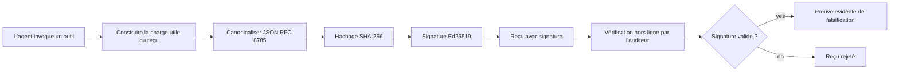
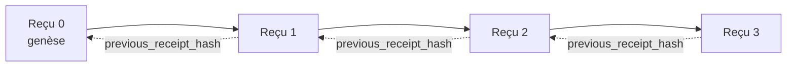

[Regarder la vidéo de la leçon : Sécurisation des agents IA avec des reçus cryptographiques](https://youtu.be/PLACEHOLDER_VIDEO_ID)

> _(Vidéo de la leçon et miniature à ajouter par l'équipe de contenu Microsoft après la fusion, en suivant le modèle des leçons 14 / 15.)_

# Sécurisation des agents IA avec des reçus cryptographiques

## Introduction

Cette leçon couvrira :

- Pourquoi les pistes d'audit pour les agents IA sont importantes pour la conformité, le débogage et la confiance.
- Ce qu'est un reçu cryptographique et en quoi il diffère d'une ligne de journal non signée.
- Comment produire un reçu signé pour un appel d'outil d'un agent en Python pur.
- Comment vérifier un reçu hors ligne et détecter toute altération.
- Comment chaîner les reçus afin que la suppression ou le réarrangement d'un reçu casse la chaîne.
- Ce que les reçus prouvent et ce qu'ils ne prouvent pas explicitement.

## Objectifs d'apprentissage

Après avoir terminé cette leçon, vous saurez comment :

- Identifier les modes de défaillance qui motivent la provenance cryptographique des actions de l'agent.
- Produire un reçu signé Ed25519 sur une charge utile JSON canonique.
- Vérifier un reçu de manière indépendante en utilisant uniquement la clé publique du signataire.
- Détecter la falsification en relançant la vérification sur un reçu modifié.
- Construire une séquence de reçus chaînés par hachage et expliquer pourquoi cette chaîne est importante.
- Reconnaître la limite entre ce que les reçus prouvent (attribution, intégrité, ordre) et ce qu'ils ne prouvent pas (exactitude de l'action, solidité de la politique).

## Le problème : la piste d'audit de votre agent

Imaginez que vous avez déployé un agent IA pour Contoso Travel. L'agent lit les demandes des clients, interroge une API de vols pour rechercher des options, et réserve des places pour le compte du client. Le trimestre dernier, l'agent a traité 50 000 réservations.

Aujourd’hui, un auditeur arrive. Il pose une question simple : « Montrez-moi ce que votre agent a fait. »

Vous lui remettez vos fichiers journaux. L'auditeur les examine et pose la question plus difficile : « Comment puis-je savoir que ces journaux n'ont pas été modifiés ? »

C’est le problème de la piste d’audit. La plupart des déploiements d’agents aujourd’hui reposent sur :

- **Journaux applicatifs** : écrits par l’agent lui-même, modifiables par toute personne ayant accès au système de fichiers.
- **Services de journalisation cloud** : à preuve d’altération au niveau de la plateforme, mais seulement si l'auditeur fait confiance à l'opérateur de la plateforme.
- **Journaux de transactions de bases de données** : adaptés aux modifications de bases de données mais pas aux appels arbitraires d’outils.

Aucun de ces systèmes ne peut répondre à la question de l'auditeur sans que celui-ci ne doive faire confiance à quelqu'un (vous, votre fournisseur cloud, votre vendeur de base de données). Pour un usage interne, cette confiance est souvent acceptable. Pour des charges réglementées (finance, santé, tout ce qui est soumis à l'EU AI Act), ce n’est pas le cas.

Les reçus cryptographiques résolvent ce problème en rendant chaque action de l’agent vérifiable indépendamment. L'auditeur n’a pas besoin de vous faire confiance. Il lui suffit de votre clé publique et du reçu lui-même.

## Qu'est-ce qu'un reçu cryptographique ?

Un reçu est un objet JSON qui enregistre ce qu’un agent a fait, signé avec une signature numérique.



Un reçu minimal ressemble à ceci :

```json
{
  "type": "agent.tool_call.v1",
  "agent_id": "contoso-travel-bot",
  "tool_name": "lookup_flights",
  "tool_args_hash": "sha256:a3f9c1...",
  "result_hash": "sha256:7b2e1d...",
  "policy_id": "contoso-travel-policy-v3",
  "timestamp": "2026-04-25T14:30:00Z",
  "sequence": 47,
  "previous_receipt_hash": "sha256:9d4e6a...",
  "signature": {
    "alg": "EdDSA",
    "sig": "c5af83...",
    "public_key": "8f3b2c..."
  }
}
```

Trois propriétés font le travail :

1. **La signature**. Le reçu est signé par la passerelle de l’agent en utilisant une clé privée Ed25519. Toute personne disposant de la clé publique correspondante peut vérifier la signature hors ligne. Toute altération d’un champ invalide la signature.

2. **Encodage canonique**. Avant la signature, le reçu est sérialisé en utilisant le JSON Canonicalization Scheme (JCS, RFC 8785). Cela garantit que deux implémentations produisant le même reçu logique génèrent une sortie identique au niveau des octets. Sans canonicalisation, différents sérialiseurs JSON produiraient des signatures différentes pour le même contenu.

3. **Chaînage par hachage**. Le champ `previous_receipt_hash` relie chaque reçu à celui qui le précède. Supprimer ou réarranger un reçu casse chaque reçu qui vient après. Toute altération devient visible au niveau de la chaîne même si les signatures individuelles sont contournées.

Ensemble, ces propriétés fournissent trois garanties :

- **Attribution** : cette clé a signé ce contenu.
- **Intégrité** : le contenu n’a pas changé depuis sa signature.
- **Ordre** : ce reçu est venu après ce reçu dans la chaîne.

## Produire un reçu en Python

Vous n’avez pas besoin d’une bibliothèque spéciale pour produire un reçu. Les primitives cryptographiques sont largement disponibles et la logique consiste en quelques dizaines de lignes Python.

Les exercices pratiques dans `code_samples/18-signed-receipts.ipynb` parcourent le flux complet. La version résumée :

```python
import json
import hashlib
import base64
from nacl import signing
from jcs import canonicalize  # JSON canonique RFC 8785

def b64url_nopad(data: bytes) -> str:
    return base64.urlsafe_b64encode(data).decode("ascii").rstrip("=")

def sha256_canonical(obj) -> str:
    """SHA-256 of a Python object's JCS-canonical JSON form."""
    return f"sha256:{hashlib.sha256(canonicalize(obj)).hexdigest()}"

# Générer ou charger une clé de signature (en production, stocker dans un coffre-fort à clés)
signing_key = signing.SigningKey.generate()
verify_key = signing_key.verify_key

# Construire la charge utile du reçu (pas encore de signature)
tool_args = {"origin": "SYD", "destination": "LAX"}
tool_result = [{"flight": "QF11", "price": 1850, "stops": 0}]

payload = {
    "type": "agent.tool_call.v1",
    "agent_id": "contoso-travel-bot",
    "tool_name": "lookup_flights",
    "tool_args_hash": sha256_canonical(tool_args),
    "result_hash": sha256_canonical(tool_result),
    "policy_id": "contoso-travel-policy-v3",
    "timestamp": "2026-04-25T14:30:00Z",
    "sequence": 0,
    "previous_receipt_hash": None,
}

# Canonaliser, hacher, signer.
canonical_bytes = canonicalize(payload)
message_hash = hashlib.sha256(canonical_bytes).digest()
signature_bytes = signing_key.sign(message_hash).signature

# Joindre un objet de signature structuré.
receipt = {
    **payload,
    "signature": {
        "alg": "EdDSA",
        "sig": b64url_nopad(signature_bytes),
        "public_key": b64url_nopad(bytes(verify_key)),
    },
}
```

C'est toute la chaîne de signature. Les exercices dans le notebook parcourent chaque étape.

## Vérifier un reçu et détecter les altérations

La vérification est l'opération inverse :

```python
import base64
import hashlib
from nacl import signing
from nacl.exceptions import BadSignatureError
from jcs import canonicalize

def b64url_decode(s: str) -> bytes:
    padding = "=" * ((4 - len(s) % 4) % 4)
    return base64.urlsafe_b64decode(s + padding)

def verify_receipt(receipt: dict) -> bool:
    # La signature est un objet structuré : {"alg", "sig", "public_key"}.
    sig_obj = receipt.get("signature")
    if not sig_obj or sig_obj.get("alg") != "EdDSA":
        return False

    # Reconstruisez la charge utile qui a été réellement signée (tout sauf la signature).
    payload = {k: v for k, v in receipt.items() if k != "signature"}

    canonical_bytes = canonicalize(payload)
    message_hash = hashlib.sha256(canonical_bytes).digest()

    try:
        verify_key = signing.VerifyKey(b64url_decode(sig_obj["public_key"]))
        verify_key.verify(message_hash, b64url_decode(sig_obj["sig"]))
        return True
    except BadSignatureError:
        return False
```

Cette fonction prend un reçu et retourne `True` si la signature est valide, `False` sinon. Pas d’appel réseau, pas de dépendance de service, pas de confiance requise envers un tiers.

Pour voir la détection des altérations en action, le notebook parcourt :

1. La production d’un reçu valide et la confirmation qu’il vérifie.
2. La modification d’un octet du champ `tool_args_hash`.
3. La relance de la vérification et la constatation de son échec.

Ceci est la démonstration pratique que les reçus sont à preuve d’altération : toute modification, même minime, casse la signature.

## Chaîner les reçus pour les agents multi-étapes

Un seul reçu signé protège une action. Une chaîne de reçus protège une séquence.



Chaque reçu enregistre le hachage du reçu précédent. Pour supprimer silencieusement le reçu 2, un attaquant devrait soit :

- Modifier le champ `previous_receipt_hash` du reçu 3 (ce qui casse la signature du reçu 3), OU
- Forger une nouvelle signature sur un reçu 3 modifié (ce qui exige la clé privée de l’agent).

Si la clé privée est dans un coffre-fort matériel et que vous publiez la clé publique avec chaque reçu, aucune de ces attaques n’est faisable sans être détectée.

Le notebook parcourt :

1. La construction d’une chaîne de trois reçus.
2. La vérification que le `previous_receipt_hash` de chaque reçu correspond bien au hachage réel du reçu précédent.
3. L’altération d’un reçu au milieu et la constatation que la chaîne se casse précisément à ce point.

Voilà comment vous produisez une piste d’audit qu’un auditeur externe peut vérifier sans avoir besoin de vous faire confiance.

## Ce que les reçus prouvent (et ce qu'ils ne prouvent pas)

C’est la section la plus importante de cette leçon. Les reçus sont puissants mais leur puissance a des limites.

**Les reçus prouvent trois choses :**

1. **Attribution** : une clé spécifique a signé une charge utile spécifique.
2. **Intégrité** : la charge utile n’a pas changé depuis sa signature.
3. **Ordre** : ce reçu est venu après ce reçu dans la chaîne de hachage.

**Les reçus NE prouvent PAS :**

1. **Exactitude** : que l’action de l’agent était la bonne action. Un reçu peut être signé pour une réponse erronée aussi proprement que pour une réponse correcte.
2. **Conformité à la politique** : que la politique référencée dans `policy_id` a réellement été évaluée, ou qu’elle aurait permis cette action si elle avait été vérifiée. Le reçu enregistre ce qui a été affirmé, pas ce qui a été appliqué.
3. **Identité au-delà de la clé** : le reçu dit « cette clé a signé ce contenu. » Il ne dit pas « cet humain a autorisé cela. » Relier une clé à une personne ou organisation nécessite une infrastructure d’identité distincte (un annuaire, un registre de clés publiques, etc.).
4. **Véracité des entrées** : si l’agent reçoit une invite manipulée et agit en conséquence, le reçu enregistre l’action fidèlement. Les reçus sont en aval de la validation d’entrée, pas un substitut.

Cette limite est importante pour deux raisons :

- Elle indique à quoi les reçus sont utiles : rendre le comportement de l’agent auditable et à preuve d’altération, même au-delà des frontières organisationnelles.
- Elle montre quelles couches supplémentaires vous devez encore ajouter : validation des entrées (leçon 6), application de la politique (abordée brièvement ci-dessous), et infrastructure d’identité (hors du cadre de cette leçon).

Une erreur fréquente est de penser que « nous avons des reçus » signifie « nous sommes gouvernés ». Ce n’est pas le cas. Les reçus sont une base. La gouvernance est le système que vous construisez par-dessus.

## Prouver qu’un humain a approuvé l’action exacte

Le point 3 ci-dessus mérite sa propre section : un reçu d’action dit « cette clé a signé ce contenu », jamais « un humain a autorisé cela ». Pour les actions à haut risque (remboursements, suppressions, virements), les cadres de gouvernance exigent de plus en plus cette affirmation manquante, et elle est réalisable avec les mêmes primitives que vous avez déjà construites dans cette leçon.

Le notebook suivant `code_samples/human-authorization-receipts.ipynb` ajoute un second type de reçu, `human.approval.v1`, dans la même forme d’enveloppe que les reçus de la leçon (une charge utile typée signée par Ed25519 sur son SHA-256 canonique, avec l’objet `signature` en dehors des octets signés). Un approbateur nommé signe **l’action canonique complète et son condensé** avant exécution ; le reçu d’action de l’agent porte **le même condensé d’action** et une `parent_approval_ref`, le `receipt_hash` de l’approbation, la même convention que `previous_receipt_hash` dans la chaîne que vous avez construite plus haut. Une seule fonction `verify_chain` parcourt les deux artefacts sous **des registres de clés épinglés séparés** (clés des approbateurs vs clés de l’agent), donc le chemin de code est partagé mais pas les autorités.

La propriété obtenue, énoncée soigneusement : *l'humain a approuvé cette action exacte, et l'agent a exactement exécuté cette action approuvée.* Les cas de refus du notebook sont ce qui rend cette propriété réelle plutôt que simplement affirmée :

- la série classique : altération, délégué confus, rejouage, clés falsifiées de chaque côté, entrée malformée ;
- **autorité périmée** : une signature qui vérifie toujours, refusée quand même parce que la version de la politique a changé, la clé d'approbateur a été retirée du registre épinglé, ou l’approbation a expiré avant l’exécution ;
- **substitution de condensé** : un reçu d’action validement signé pointant vers une *vraie* approbation qui lie une *autre* action canonique.

Chaque échec refuse avec une raison distincte, ainsi un auditeur lisant un refus peut dire si l'autorité a périmé ou si l'action exécutée a changé. La règle enseignée par le notebook : une approbation signée n’est pas une autorité en soi. L’autorité existe seulement si les deux reçus lient encore à la même action canonique au moment de l’exécution. Le chemin de co-signature dans le même Internet-Draft que cette leçon suit (`draft-farley-acta-signed-receipts`) est la forme officielle de cette approche.

## Références de production

Le code Python de cette leçon est volontairement minimal pour que vous puissiez lire chaque ligne et comprendre exactement ce qui se passe. En production, vous avez deux options :

1. **Construire directement sur les primitives cryptographiques.** Les 50 lignes vues plus haut suffisent pour de nombreux cas d’usage. PyNaCl (Ed25519) et le paquet `jcs` (JSON canonique) sont des bibliothèques bien maintenues et auditées.

2. **Utiliser une bibliothèque de reçus en production.** Plusieurs projets open source implémentent le même modèle avec des fonctionnalités supplémentaires (rotation de clés, vérification par lots, distribution de JWK Set, intégration avec moteurs de politique) :
   - Le format de reçu utilisé dans cette leçon suit un Internet-Draft IETF ([`draft-farley-acta-signed-receipts`](https://datatracker.ietf.org/doc/draft-farley-acta-signed-receipts/), révision 02) actuellement en cours de standardisation, avec une suite de conformité partagée ([agent-governance-testvectors](https://github.com/ScopeBlind/agent-governance-testvectors)) que les implémentations indépendantes vérifient avec pour sortie canonique identique aux octets près.
   - Le Microsoft Agent Governance Toolkit compose les reçus avec des décisions de politique basées sur Cedar ; voir le Tutoriel 33 dans ce dépôt pour un exemple complet.
   - Les paquets `protect-mcp` (npm) et `@veritasacta/verify` (npm) fournissent une implémentation Node de la signature et vérification hors ligne des reçus, destinée à envelopper tout serveur MCP avec une piste d’audit à preuve d’altération, incluant un flux de tenue pour co-signature dans lequel une action en pause émet un reçu d’approbation lié au condensé d’action (soutenu par WebAuthn dans le flux desktop), le même modèle de reçu d’approbation que dans le notebook d’autorisation humaine ci-dessus.
   - Le SDK Python **[nobulex](https://github.com/arian-gogani/nobulex)** (`pip install nobulex`) fournit le même modèle de signature Ed25519 + JCS en Python avec intégrations LangChain et CrewAI, incluant des vecteurs de test de validation croisée publiés et une cartographie de conformité contributive via [OWASP PR #2210](https://github.com/OWASP/CheatSheetSeries/pull/2210).

Le choix entre réaliser votre propre solution et utiliser une bibliothèque reflète celui entre écrire votre propre bibliothèque JWT et en utiliser une testée : les deux sont raisonnables ; la bibliothèque économise du temps et réduit la surface d’audit ; l’approche from scratch vous force à comprendre chaque primitive. Cette leçon enseigne la voie from scratch pour que vous ayez la base pour chaque choix.

## Vérification des connaissances

Testez votre compréhension avant de passer à l’exercice pratique.

**1. Un reçu est signé avec la clé privée Ed25519 de l’agent. L’auditeur n’a que la clé publique. L’auditeur peut-il vérifier le reçu hors ligne ?**

<details>
<summary>Réponse</summary>

Oui. La vérification Ed25519 nécessite uniquement la clé publique et les octets signés. Pas d’appel réseau, pas de dépendance à un service. C’est cette propriété qui rend les reçus utiles dans des contextes isolés, multi-organisations ou à faible confiance.
</details>

**2. Un attaquant modifie le champ `policy_id` d’un reçu pour prétendre qu’il était gouverné par une politique plus permissive. La signature portait sur la charge utile originale. Que se passe-t-il lors de la vérification ?**

<details>
<summary>Réponse</summary>


Échec de la vérification. La signature a été calculée sur les octets canoniques de la charge utile originale ; modifier un champ quelconque change les octets canoniques, ce qui modifie le hachage SHA-256, ce qui rend la signature invalide. L'attaquant aurait besoin de la clé privée pour produire une nouvelle signature valide, ce qu'il ne possède pas.
</details>

**3. Pourquoi le reçu inclut-il un `tool_args_hash` et un `result_hash` plutôt que les arguments bruts et le résultat ?**

<details>
<summary>Réponse</summary>

Deux raisons. Premièrement, le reçu peut devoir être archivé ou transmis dans des environnements où la fuite du contenu brut (PII, données commerciales) est un problème. Le hachage garde le reçu petit et le contenu privé ; l'auditeur vérifie que le hachage correspond à une copie stockée séparément du contenu réel. Deuxièmement, les hachages ont une taille fixe ; un reçu avec des hachages est limité en taille, peu importe la taille des entrées et sorties.
</details>

**4. Le champ `previous_receipt_hash` relie chaque reçu à son prédécesseur. Si un attaquant supprime silencieusement un reçu au milieu d'une chaîne, qu'est-ce qui devient invalide ?**

<details>
<summary>Réponse</summary>

Tous les reçus qui viennent après celui supprimé. Leurs champs `previous_receipt_hash` ne correspondent plus à la chaîne réelle (parce que le reçu auquel ils faisaient référence n'existe plus, ou que la chaîne pointe maintenant vers un prédécesseur différent). Pour cacher la suppression, l'attaquant devrait re-signer tous les reçus ultérieurs, ce qui nécessite la clé privée.
</details>

**5. Un reçu se vérifie correctement. Cela prouve-t-il que l'action de l'agent était correcte, fiable ou conforme à la politique ?**

<details>
<summary>Réponse</summary>

Non. Un reçu valide prouve trois choses : l'attribution (cette clé a signé ce contenu), l'intégrité (le contenu n'a pas changé) et l'ordre (ce reçu est venu après ce reçu-là). Il ne prouve PAS que l'action était correcte, que la politique nommée dans `policy_id` a réellement été évaluée, ni que l'agent a suivi chaque règle. Les reçus rendent le comportement de l'agent auditable, pas nécessairement correct. C'est la limite la plus importante de la leçon.
</details>

## Exercice Pratique

Ouvrez `code_samples/18-signed-receipts.ipynb` et complétez les quatre sections :

1. **Section 1** : Signez votre premier reçu et vérifiez-le.
2. **Section 2** : Altérez le reçu et observez l'échec de la vérification.
3. **Section 3** : Construisez une chaîne de trois reçus et vérifiez l'intégrité de la chaîne.
4. **Section 4** : Appliquez le modèle à un agent construit avec le Microsoft Agent Framework : encapsulez un appel d'outil dans la signature de reçu, puis vérifiez le reçu de manière indépendante.

**Défi supplémentaire 1 :** étendez le schéma du reçu avec un champ supplémentaire de votre choix (par exemple, un identifiant de requête pour le traçage), mettez à jour la logique de signature canonique pour l'inclure, et confirmez que le reçu circule encore correctement lors de la vérification. Puis modifiez le champ après la signature et confirmez que la vérification échoue. Cela vous oblige à comprendre comment chaque octet de l'encodage canonique contribue à la signature.

**Défi supplémentaire 2 :** Hachez SHA-256 deux de vos reçus ensemble (concaténez leurs octets canoniques dans un ordre déterministe) et intégrez le résultat comme un nouveau champ dans un troisième reçu avant de le signer. Vérifiez que les trois reçus circulent toujours correctement. Vous venez de construire une preuve d'inclusion en un seul niveau : toute personne détenant le troisième reçu peut prouver que les deux premiers existaient au moment de la signature, sans avoir besoin de révéler leur contenu. C'est le modèle utilisé à grande échelle par les reçus à divulgation sélective (engagements de Merkle, RFC 6962).

## Conclusion

Les reçus cryptographiques fournissent aux agents IA une piste d'audit qui est :

- **Indépendamment vérifiable** : toute partie possédant la clé publique peut vérifier, sans dépendance de service.
- **Témoin de falsification** : toute modification invalide la signature.
- **Portable** : un reçu est un petit fichier JSON ; il peut être archivé, transmis et vérifié n'importe où.
- **Conforme aux standards** : basé sur Ed25519 (RFC 8032), JCS (RFC 8785) et SHA-256, tous des primitives largement déployées.

Ils ne remplacent pas la validation des entrées, l'application des politiques ou l'infrastructure d'identité. Ils constituent une base pour ces couches. Lorsque vous déployez des agents dans des charges régulées, des flux de travail multi-organisationnels ou tout contexte où un auditeur futur ne peut pas être supposé vous faire confiance, les reçus sont la façon dont vous rendez la piste d’audit honnête.

L'enseignement le plus important : les reçus prouvent qui a dit quoi, quand. Ils ne prouvent pas que ce qui a été dit est vrai ou juste. Gardez cette distinction bien présente. C’est la différence entre un système de provenance honnête et un système trompeur.

## Liste de vérification pour la production

Lorsque vous êtes prêt à passer de cette leçon au déploiement d’agents signés par reçu en production :

- [ ] **Retirez la clé de signature de l’ordinateur portable du développeur.** Utilisez Azure Key Vault, AWS KMS ou un module de sécurité matériel. La clé privée signant vos reçus ne doit jamais résider dans le contrôle de version ou en clair sur des machines applicatives.
- [ ] **Publiez la clé publique de vérification.** Les auditeurs en ont besoin pour vérifier hors ligne. Le modèle standard est un JWK Set à une URL bien connue (RFC 7517), par exemple `https://your-org.example.com/.well-known/agent-keys.json`.
- [ ] **Ancrez la chaîne de manière externe.** Écrivez périodiquement le hachage de la tête de la chaîne dans un journal de transparence (Sigstore Rekor, autorité de timestamp RFC 3161 ou un second système interne) afin qu’une partie externe puisse confirmer « cette chaîne existait à ce moment ».
- [ ] **Stockez les reçus de façon immuable.** Le stockage en mode append-only (Azure Storage avec politiques d’immuabilité, AWS S3 Object Lock) empêche un initié de réécrire l’historique au niveau du stockage.
- [ ] **Décidez de la rétention.** De nombreux régimes de conformité exigent une rétention pluriannuelle. Prévoyez la croissance des reçus (chaque reçu fait ~500 octets ; un agent appelant 10 000 fois par jour produit ~1,8 Go par an).
- [ ] **Documentez ce que les reçus ne couvrent pas.** Les reçus prouvent attribution, intégrité, et ordre. Votre manuel d’exploitation doit lister explicitement quels contrôles additionnels (validation des entrées, application des politiques, limitation de débit, infrastructure d’identité) s’accompagnent des reçus dans votre posture de gouvernance.

### Vous avez d’autres questions sur la sécurisation des agents IA ?

Rejoignez le [Microsoft Foundry Discord](https://aka.ms/ai-agents/discord) pour rencontrer d’autres apprenants, participer aux heures de bureau, et obtenir des réponses à vos questions sur les agents IA.

## Au-delà de cette leçon

Cette leçon couvre la signature d’un seul reçu et les séquences en chaîne de hachage. Les mêmes primitives se combinent en plusieurs modèles plus avancés que vous rencontrerez au fur et à mesure que votre posture de gouvernance mûrit :

- **Divulgation sélective.** Quand les champs d’un reçu sont engagés indépendamment (arbre de Merkle de style RFC 6962), vous pouvez révéler certains champs à certains auditeurs et prouver que le reste est inchangé sans les exposer. Utile quand le même reçu doit satisfaire à la fois un audit complet (qui veut la totalité) et des réglementations sur la minimisation des données comme le RGPD (qui veulent que l’auditeur voie le moins possible).
- **Révocation de reçus.** Si une clé de signature est compromise, vous devez pouvoir marquer tous les reçus signés par cette clé comme non fiables à partir d’un certain moment. Modèles standards : clés de signature à courte durée de vie plus liste de révocation publiée, ou journal de transparence avec entrées de révocation.
- **Reçus bilatéraux / à signature double.** Certaines implémentations divisent la charge signée en deux moitiés pré-exécution (`authorization_*`) et post-exécution (`result_*`) avec des signatures indépendantes, utile quand la décision d’autorisation et le résultat observé sont produits par des acteurs ou à des moments différents. Cela s’ajoute au format de reçu enseigné ici.
- **Composition de la charge.** Un reçu scelle les octets mis dans `result_hash`. Les charges réelles sont souvent plus riches que le seul résultat d’un appel d’outil : le raisonnement pré-décision (prédiction du modèle, options considérées, preuves et leur exhaustivité, posture de risque, chaîne de responsabilité, résultat des contrôles) peut tous vivre dans la charge, scellée par un seul reçu. Cela maintient le format du reçu minimal tout en laissant évoluer les schémas de charge par domaine.
- **Conformité entre implémentations.** Plusieurs implémentations indépendantes du même format de reçu (Python, TypeScript, Rust, Go) se vérifient contre des vecteurs de test partagés. Si vous créez votre propre implémentation, la validation contre des vecteurs publiés confirme la compatibilité filaire.
- **Migration post-quantique.** Ed25519 est largement déployé aujourd’hui mais n’est pas résistant aux ordinateurs quantiques. Le format de reçu est agile par rapport à l’algorithme : le champ `signature.alg` peut porter `ML-DSA-65` (la norme de signature post-quantique NIST) dès que vous devez migrer. Prévoyez une période de transition où les reçus sont doublement signés.

## Ressources supplémentaires

- <a href="https://datatracker.ietf.org/doc/draft-farley-acta-signed-receipts/" target="_blank">Brouillon IETF : Reçus de Décision Signés pour le Contrôle d’Accès Machine-à-Machine</a>
- <a href="https://learn.microsoft.com/azure/ai-studio/responsible-use-of-ai-overview" target="_blank">Vue d’ensemble de l’IA responsable (Azure AI)</a>
- <a href="https://datatracker.ietf.org/doc/html/rfc8032" target="_blank">RFC 8032 : Algorithme de Signature Numérique Edwards-Curve (EdDSA)</a>
- <a href="https://datatracker.ietf.org/doc/html/rfc8785" target="_blank">RFC 8785 : Schéma de Canonicalisation JSON (JCS)</a>
- <a href="https://datatracker.ietf.org/doc/html/rfc6962" target="_blank">RFC 6962 : Transparence des certificats</a> (construction d’arbre Merkle utilisée par les reçus à divulgation sélective)
- <a href="https://github.com/microsoft/agent-governance-toolkit/blob/main/docs/tutorials/33-offline-verifiable-receipts.md" target="_blank">Microsoft Agent Governance Toolkit, Tutoriel 33 : Reçus de Décision Vérifiables Hors-ligne</a>
- <a href="https://github.com/ScopeBlind/agent-governance-testvectors" target="_blank">Vecteurs de test de conformité inter-implémentations</a> pour le format de reçu utilisé dans cette leçon (Apache-2.0)
- <a href="https://pynacl.readthedocs.io/" target="_blank">Documentation PyNaCl</a> (Ed25519 en Python)

## Leçon précédente

[Créer des agents IA locaux](../17-creating-local-ai-agents/README.md)

---

<!-- CO-OP TRANSLATOR DISCLAIMER START -->
**Avertissement** :
Ce document a été traduit à l'aide du service de traduction automatique [Co-op Translator](https://github.com/Azure/co-op-translator). Bien que nous nous efforçions d'assurer l'exactitude, veuillez noter que les traductions automatisées peuvent contenir des erreurs ou des inexactitudes. Le document original dans sa langue native doit être considéré comme la source faisant autorité. Pour les informations critiques, il est recommandé de recourir à une traduction professionnelle réalisée par un humain. Nous ne saurions être tenus responsables des malentendus ou erreurs d'interprétation découlant de l'utilisation de cette traduction.
<!-- CO-OP TRANSLATOR DISCLAIMER END -->