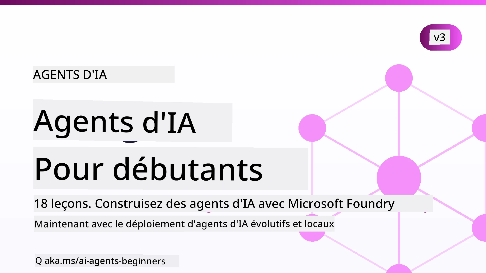

# Agents IA pour Débutants - Un Cours



## Un cours qui enseigne tout ce que vous devez savoir pour commencer à construire des Agents IA

[](https://github.com/microsoft/ai-agents-for-beginners/blob/master/LICENSE?WT.mc_id=academic-105485-koreyst)
[](https://GitHub.com/microsoft/ai-agents-for-beginners/graphs/contributors/?WT.mc_id=academic-105485-koreyst)
[](https://GitHub.com/microsoft/ai-agents-for-beginners/issues/?WT.mc_id=academic-105485-koreyst)
[](https://GitHub.com/microsoft/ai-agents-for-beginners/pulls/?WT.mc_id=academic-105485-koreyst)
[](http://makeapullrequest.com?WT.mc_id=academic-105485-koreyst)

### 🌐 Support Multilingue

#### Pris en charge via GitHub Action (Automatisé & Toujours à jour)

<!-- CO-OP TRANSLATOR LANGUAGES TABLE START -->
[Arabic](../ar/README.md) | [Bengali](../bn/README.md) | [Bulgarian](../bg/README.md) | [Burmese (Myanmar)](../my/README.md) | [Chinese (Simplified)](../zh-CN/README.md) | [Chinese (Traditional, Hong Kong)](../zh-HK/README.md) | [Chinese (Traditional, Macau)](../zh-MO/README.md) | [Chinese (Traditional, Taiwan)](../zh-TW/README.md) | [Croatian](../hr/README.md) | [Czech](../cs/README.md) | [Danish](../da/README.md) | [Dutch](../nl/README.md) | [Estonian](../et/README.md) | [Finnish](../fi/README.md) | [French](./README.md) | [German](../de/README.md) | [Greek](../el/README.md) | [Hebrew](../he/README.md) | [Hindi](../hi/README.md) | [Hungarian](../hu/README.md) | [Indonesian](../id/README.md) | [Italian](../it/README.md) | [Japanese](../ja/README.md) | [Kannada](../kn/README.md) | [Khmer](../km/README.md) | [Korean](../ko/README.md) | [Lithuanian](../lt/README.md) | [Malay](../ms/README.md) | [Malayalam](../ml/README.md) | [Marathi](../mr/README.md) | [Nepali](../ne/README.md) | [Nigerian Pidgin](../pcm/README.md) | [Norwegian](../no/README.md) | [Persian (Farsi)](../fa/README.md) | [Polish](../pl/README.md) | [Portuguese (Brazil)](../pt-BR/README.md) | [Portuguese (Portugal)](../pt-PT/README.md) | [Punjabi (Gurmukhi)](../pa/README.md) | [Romanian](../ro/README.md) | [Russian](../ru/README.md) | [Serbian (Cyrillic)](../sr/README.md) | [Slovak](../sk/README.md) | [Slovenian](../sl/README.md) | [Spanish](../es/README.md) | [Swahili](../sw/README.md) | [Swedish](../sv/README.md) | [Tagalog (Filipino)](../tl/README.md) | [Tamil](../ta/README.md) | [Telugu](../te/README.md) | [Thai](../th/README.md) | [Turkish](../tr/README.md) | [Ukrainian](../uk/README.md) | [Urdu](../ur/README.md) | [Vietnamese](../vi/README.md)

> **Vous préférez cloner localement ?**
>
> Ce dépôt comprend plus de 50 traductions, ce qui augmente considérablement la taille du téléchargement. Pour cloner sans les traductions, utilisez le sparse checkout :
>
> **Bash / macOS / Linux :**
> ```bash
> git clone --filter=blob:none --sparse https://github.com/microsoft/ai-agents-for-beginners.git
> cd ai-agents-for-beginners
> git sparse-checkout set --no-cone '/*' '!translations' '!translated_images'
> ```
>
> **CMD (Windows) :**
> ```cmd
> git clone --filter=blob:none --sparse https://github.com/microsoft/ai-agents-for-beginners.git
> cd ai-agents-for-beginners
> git sparse-checkout set --no-cone "/*" "!translations" "!translated_images"
> ```
>
> Cela vous donne tout ce dont vous avez besoin pour compléter le cours avec un téléchargement beaucoup plus rapide.
<!-- CO-OP TRANSLATOR LANGUAGES TABLE END -->

**Si vous souhaitez que des langues de traduction supplémentaires soient prises en charge, elles sont listées [ici](https://github.com/Azure/co-op-translator/blob/main/getting_started/supported-languages.md).**

[](https://GitHub.com/microsoft/ai-agents-for-beginners/watchers/?WT.mc_id=academic-105485-koreyst)
[](https://GitHub.com/microsoft/ai-agents-for-beginners/network/?WT.mc_id=academic-105485-koreyst)
[](https://GitHub.com/microsoft/ai-agents-for-beginners/stargazers/?WT.mc_id=academic-105485-koreyst)

[](https://discord.com/invite/ATgtXmAS5D)


## 🌱 Commencer

Ce cours comprend des leçons couvrant les bases de la création d’Agents IA. Chaque leçon traite d’un sujet spécifique, commencez donc où vous voulez !

Il y a un support multilingue pour ce cours. Découvrez nos [langues disponibles ici](#-multi-language-support).

Si c’est votre première fois à construire avec des modèles d’IA générative, consultez notre cours [IA Générative pour Débutants](https://aka.ms/genai-beginners), qui comprend 21 leçons sur la construction avec GenAI.

N’oubliez pas de [mettre une étoile (🌟) sur ce dépôt](https://docs.github.com/en/get-started/exploring-projects-on-github/saving-repositories-with-stars?WT.mc_id=academic-105485-koreyst) et de [forker ce dépôt](https://github.com/microsoft/ai-agents-for-beginners/fork) pour exécuter le code.

### Rencontrez d’autres apprenants, obtenez vos questions répondues

Si vous êtes bloqué ou avez des questions sur la création d’Agents IA, rejoignez notre chaîne Discord dédiée sur le [Microsoft Foundry Discord](https://aka.ms/ai-agents/discord).

### Ce dont vous avez besoin

Chaque leçon de ce cours inclut des exemples de code, que vous pouvez trouver dans le dossier code_samples. Vous pouvez [forker ce dépôt](https://github.com/microsoft/ai-agents-for-beginners/fork) pour créer votre propre copie.

Les exemples de code dans ces exercices utilisent le Microsoft Agent Framework avec Microsoft Foundry Agent Service V2 :

- [Microsoft Foundry](https://aka.ms/ai-agents-beginners/ai-foundry) - Compte Azure requis

Ce cours utilise les frameworks et services d’agents IA suivants de Microsoft :

- [Microsoft Agent Framework (MAF)](https://aka.ms/ai-agents-beginners/agent-framework)
- [Microsoft Foundry Agent Service V2](https://aka.ms/ai-agents-beginners/ai-agent-service)

Certains exemples de code prennent aussi en charge des fournisseurs compatibles OpenAI alternatifs comme [MiniMax](https://platform.minimaxi.com/), qui propose des modèles à large contexte (jusqu’à 204 K tokens). Consultez la [Configuration du cours](./00-course-setup/README.md) pour les détails.

Pour plus d’informations sur l’exécution du code pour ce cours, consultez la [Configuration du cours](./00-course-setup/README.md).

## 🙏 Vous voulez aider ?

Avez-vous des suggestions ou avez-vous trouvé des fautes d’orthographe ou des erreurs de code ? [Ouvrez un problème](https://github.com/microsoft/ai-agents-for-beginners/issues?WT.mc_id=academic-105485-koreyst) ou [Créez une pull request](https://github.com/microsoft/ai-agents-for-beginners/pulls?WT.mc_id=academic-105485-koreyst)


## 📂 Chaque leçon comprend

- Une leçon écrite dans le README et une courte vidéo
- Des exemples de code Python utilisant Microsoft Agent Framework avec Microsoft Foundry
- Des liens vers des ressources supplémentaires pour continuer à apprendre


## 🗃️ Leçons

| **Leçon**                                  | **Texte & Code**                                   | **Vidéo**                                                  | **Apprentissage Supplémentaire**                                                        |
|--------------------------------------------|--------------------------------------------------|------------------------------------------------------------|-----------------------------------------------------------------------------------------|
| Introduction aux Agents IA et Cas d’Utilisation | [Lien](./01-intro-to-ai-agents/README.md)          | [Vidéo](https://youtu.be/3zgm60bXmQk?si=z8QygFvYQv-9WtO1)  | [Lien](https://aka.ms/ai-agents-beginners/collection?WT.mc_id=academic-105485-koreyst)  |
| Exploration des Frameworks Agentiques       | [Lien](./02-explore-agentic-frameworks/README.md)  | [Vidéo](https://youtu.be/ODwF-EZo_O8?si=Vawth4hzVaHv-u0H)  | [Lien](https://aka.ms/ai-agents-beginners/collection?WT.mc_id=academic-105485-koreyst)  |
| Comprendre les Design Patterns Agentiques  | [Lien](./03-agentic-design-patterns/README.md)     | [Vidéo](https://youtu.be/m9lM8qqoOEA?si=BIzHwzstTPL8o9GF)  | [Lien](https://aka.ms/ai-agents-beginners/collection?WT.mc_id=academic-105485-koreyst)  |
| Design Pattern d’Utilisation d’Outils       | [Lien](./04-tool-use/README.md)                     | [Vidéo](https://youtu.be/vieRiPRx-gI?si=2z6O2Xu2cu_Jz46N)  | [Lien](https://aka.ms/ai-agents-beginners/collection?WT.mc_id=academic-105485-koreyst)  |
| RAG Agentique                               | [Lien](./05-agentic-rag/README.md)                  | [Vidéo](https://youtu.be/WcjAARvdL7I?si=gKPWsQpKiIlDH9A3)  | [Lien](https://aka.ms/ai-agents-beginners/collection?WT.mc_id=academic-105485-koreyst)  |
| Construire des Agents IA Fiables            | [Lien](./06-building-trustworthy-agents/README.md) | [Vidéo](https://youtu.be/iZKkMEGBCUQ?si=jZjpiMnGFOE9L8OK ) | [Lien](https://aka.ms/ai-agents-beginners/collection?WT.mc_id=academic-105485-koreyst)  |
| Design Pattern de Planification             | [Lien](./07-planning-design/README.md)              | [Vidéo](https://youtu.be/kPfJ2BrBCMY?si=6SC_iv_E5-mzucnC)  | [Lien](https://aka.ms/ai-agents-beginners/collection?WT.mc_id=academic-105485-koreyst)  |
| Design Pattern Multi-Agent                   | [Lien](./08-multi-agent/README.md)                  | [Vidéo](https://youtu.be/V6HpE9hZEx0?si=rMgDhEu7wXo2uo6g)  | [Lien](https://aka.ms/ai-agents-beginners/collection?WT.mc_id=academic-105485-koreyst)  |

| Modèle de conception Métacognition          | [Link](./09-metacognition/README.md)               | [Video](https://youtu.be/His9R6gw6Ec?si=8gck6vvdSNCt6OcF)  | [Link](https://aka.ms/ai-agents-beginners/collection?WT.mc_id=academic-105485-koreyst) |
| Agents IA en production                      | [Link](./10-ai-agents-production/README.md)        | [Video](https://youtu.be/l4TP6IyJxmQ?si=31dnhexRo6yLRJDl)  | [Link](https://aka.ms/ai-agents-beginners/collection?WT.mc_id=academic-105485-koreyst) |
| Utilisation des protocoles agentiques (MCP, A2A et NLWeb) | [Link](./11-agentic-protocols/README.md)           | [Video](https://youtu.be/X-Dh9R3Opn8)                                 | [Link](https://aka.ms/ai-agents-beginners/collection?WT.mc_id=academic-105485-koreyst) |
| Ingénierie du contexte pour agents IA       | [Link](./12-context-engineering/README.md)         | [Video](https://youtu.be/F5zqRV7gEag)                                 | [Link](https://aka.ms/ai-agents-beginners/collection?WT.mc_id=academic-105485-koreyst) |
| Gestion de la mémoire agentique              | [Link](./13-agent-memory/README.md)     |      [Video](https://youtu.be/QrYbHesIxpw?si=vZkVwKrQ4ieCcIPx)                                                      |                                                                                        |
| Exploration du Microsoft Agent Framework     | [Link](./14-microsoft-agent-framework/README.md)                            |                                                            |                                                                                        |
| Création d'agents d'utilisation informatique (CUA) | [Link](./15-browser-use/README.md)     |                                                            | [Link](https://docs.browser-use.com/examples/templates/playwright-integration)         |
| Déploiement d'agents évolutifs               | [Link](./16-deploying-scalable-agents/README.md) |                                                    | [Link](https://learn.microsoft.com/azure/ai-foundry/agents/overview)                   |
| Création d'agents IA locaux                   | [Link](./17-creating-local-ai-agents/README.md)  |                                                    | [Link](https://learn.microsoft.com/azure/ai-foundry/foundry-local/)                    |
| Sécurisation des agents IA                    | [Link](./18-securing-ai-agents/README.md)  |                                                            | [Link](https://aka.ms/ai-agents-beginners/collection?WT.mc_id=academic-105485-koreyst) |

## 🎒 Autres cours

Notre équipe produit d'autres cours ! Découvrez :

<!-- CO-OP TRANSLATOR OTHER COURSES START -->
### LangChain
[](https://aka.ms/langchain4j-for-beginners)
[](https://aka.ms/langchainjs-for-beginners?WT.mc_id=m365-94501-dwahlin)
[](https://github.com/microsoft/langchain-for-beginners?WT.mc_id=m365-94501-dwahlin)
---

### Azure / Edge / MCP / Agents
[](https://github.com/microsoft/AZD-for-beginners?WT.mc_id=academic-105485-koreyst)
[](https://github.com/microsoft/edgeai-for-beginners?WT.mc_id=academic-105485-koreyst)
[](https://github.com/microsoft/mcp-for-beginners?WT.mc_id=academic-105485-koreyst)
[](https://github.com/microsoft/ai-agents-for-beginners?WT.mc_id=academic-105485-koreyst)

---
 
### Série Intelligence Artificielle Générative
[](https://github.com/microsoft/generative-ai-for-beginners?WT.mc_id=academic-105485-koreyst)
[-9333EA?style=for-the-badge&labelColor=E5E7EB&color=9333EA)](https://github.com/microsoft/Generative-AI-for-beginners-dotnet?WT.mc_id=academic-105485-koreyst)
[-C084FC?style=for-the-badge&labelColor=E5E7EB&color=C084FC)](https://github.com/microsoft/generative-ai-for-beginners-java?WT.mc_id=academic-105485-koreyst)
[-E879F9?style=for-the-badge&labelColor=E5E7EB&color=E879F9)](https://github.com/microsoft/generative-ai-with-javascript?WT.mc_id=academic-105485-koreyst)

---
 
### Apprentissage Fondamental
[](https://aka.ms/ml-beginners?WT.mc_id=academic-105485-koreyst)
[](https://aka.ms/datascience-beginners?WT.mc_id=academic-105485-koreyst)
[](https://aka.ms/ai-beginners?WT.mc_id=academic-105485-koreyst)
[](https://github.com/microsoft/Security-101?WT.mc_id=academic-96948-sayoung)
[](https://aka.ms/webdev-beginners?WT.mc_id=academic-105485-koreyst)
[](https://aka.ms/iot-beginners?WT.mc_id=academic-105485-koreyst)
[](https://github.com/microsoft/xr-development-for-beginners?WT.mc_id=academic-105485-koreyst)

---
 
### Série Copilot
[](https://aka.ms/GitHubCopilotAI?WT.mc_id=academic-105485-koreyst)
[](https://github.com/microsoft/mastering-github-copilot-for-dotnet-csharp-developers?WT.mc_id=academic-105485-koreyst)
[](https://github.com/microsoft/CopilotAdventures?WT.mc_id=academic-105485-koreyst)
<!-- CO-OP TRANSLATOR OTHER COURSES END -->

## 🌟 Remerciements à la communauté

Merci à [Shivam Goyal](https://www.linkedin.com/in/shivam2003/) pour avoir contribué des exemples de code importants démontrant Agentic RAG.

## Contribution

Ce projet accepte les contributions et suggestions. La plupart des contributions nécessitent que vous acceptiez un
Accord de licence de contributeur (CLA) déclarant que vous avez le droit, et que vous accordez effectivement,
les droits d'utiliser votre contribution. Pour plus de détails, visitez <https://cla.opensource.microsoft.com>.

Lorsque vous soumettez une pull request, un bot CLA déterminera automatiquement si vous devez fournir
un CLA et décorera la PR de façon appropriée (p. ex., vérification de statut, commentaire). Suivez simplement les instructions
fournies par le bot. Vous n'aurez besoin de faire cela qu'une seule fois sur tous les dépôts utilisant notre CLA.

Ce projet a adopté le [Code de conduite Open Source Microsoft](https://opensource.microsoft.com/codeofconduct/).
Pour plus d'informations, consultez la [FAQ du Code de conduite](https://opensource.microsoft.com/codeofconduct/faq/) ou
contactez [opencode@microsoft.com](mailto:opencode@microsoft.com) pour toute question ou commentaire supplémentaire.

## Marques déposées

Ce projet peut contenir des marques déposées ou logos de projets, produits ou services. L'utilisation autorisée des marques
ou logos Microsoft est soumise et doit suivre
[Les directives de marque et d'identité Microsoft](https://www.microsoft.com/legal/intellectualproperty/trademarks/usage/general).
L'utilisation des marques ou logos Microsoft dans des versions modifiées de ce projet ne doit pas créer de confusion ni laisser entendre un parrainage par Microsoft.
Toute utilisation de marques ou logos tiers est soumise aux politiques de ces tierces parties.

## Obtenir de l'aide


Si vous êtes bloqué ou avez des questions sur la création d'applications IA, rejoignez :

[](https://aka.ms/foundry/discord)

Si vous avez des retours sur le produit ou des erreurs lors de la création, visitez :

[](https://aka.ms/foundry/forum)

---

<!-- CO-OP TRANSLATOR DISCLAIMER START -->
**Avertissement** :
Ce document a été traduit à l'aide du service de traduction automatique [Co-op Translator](https://github.com/Azure/co-op-translator). Bien que nous nous efforçions d'assurer l'exactitude, veuillez noter que les traductions automatisées peuvent contenir des erreurs ou des inexactitudes. Le document original dans sa langue native doit être considéré comme la source faisant autorité. Pour les informations critiques, il est recommandé de recourir à une traduction professionnelle réalisée par un humain. Nous ne saurions être tenus responsables des malentendus ou erreurs d'interprétation découlant de l'utilisation de cette traduction.
<!-- CO-OP TRANSLATOR DISCLAIMER END -->