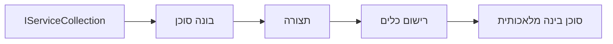

# 🎨 דפוסי עיצוב סוכניים עם Azure OpenAI (Responses API) (.NET)

## 📋 מטרות הלמידה

דוגמה זו ממחישה דפוסי עיצוב ברמת ארגון לבניית סוכנים אינטליגנטיים תוך שימוש במסגרת Microsoft Agent ב-.NET עם אינטגרציה של Azure OpenAI (Responses API). תלמדו דפוסים מקצועיים וגישות ארכיטקטוניות שהופכים את הסוכנים למוכנים לייצור, ניתנים לתחזוקה ומדרגיים.

### דפוסי עיצוב ארגוניים

- 🏭 **דפוס מפעל (Factory Pattern)**: יצירת סוכנים סטנדרטית עם הזרקת תלות
- 🔧 **דפוס בונה (Builder Pattern)**: קונפיגורציה והגדרה שוטפת של סוכנים
- 🧵 **דפוסי בטיחות לתזמורת (Thread-Safe Patterns)**: ניהול שיחות מקבילי
- 📋 **דפוס מחסן (Repository Pattern)**: ניהול מאורגן של כלים ויכולות

## 🎯 יתרונות ארכיטקטוניים ייחודיים ל-.NET

### תכונות ארגוניות

- **טייפינג חזק (Strong Typing)**: אימות בזמן הקומפילציה ותמיכה ב-IntelliSense
- **הזרקת תלות (Dependency Injection)**: אינטגרציה מובנית של מכולת DI
- **ניהול קונפיגורציה (Configuration Management)**: דפוסי IConfiguration ו-Options
- **Async/Await**: תמיכה בתכנות אסינכרוני מדרגה ראשונה

### דפוסים מוכנים לייצור

- **אינטגרציה ליומן (Logging Integration)**: תמיכה ב-ILogger ויומנים מובנים
- **בדיקות בריאות (Health Checks)**: ניטור ואבחון מובנים
- **אימות קונפיגורציה (Configuration Validation)**: טייפינג חזק עם אנוטציות נתונים
- **טיפול בשגיאות (Error Handling)**: ניהול מובנה של חריגות

## 🔧 ארכיטקטורה טכנית

### רכיבי ליבה של .NET

- **Microsoft.Extensions.AI**: אבסטרקציות אחודות לשירותי AI
- **Microsoft.Agents.AI**: מסגרת תזמור סוכנים ארגונית
- **Azure OpenAI (Responses API)**: דפוסי לקוח API בעלי ביצועים גבוהים
- **מערכת קונפיגורציה**: appsettings.json ואינטגרציה עם הסביבה

### יישום דפוסי עיצוב



## 🏗️ דפוסי ארגון שהודגמו

### 1. **דפוסי יצירה**

- **מפעל סוכנים**: יצירת סוכנים מרוכזת עם קונפיגורציה עקבית
- **דפוס בונה**: API שוטף לקונפיגורציה מורכבת של סוכנים
- **דפוס סינגלטון**: ניהול משאבים וקונפיגורציה משותף
- **הזרקת תלות**: צימוד רופף ויכולת בדיקה

### 2. **דפוסי התנהגות**

- **דפוס אסטרטגיה**: אסטרטגיות ביצוע כלים להחלפה
- **דפוס פקודה**: פעולות סוכן מקופסות עם אפשרות לביטול/שחזור
- **דפוס צופה**: ניהול מחזור חיים סוכן מונחה אירועים
- **דפוס שיטת תבנית**: זרימות עבודה סטנדרטיות לביצוע סוכנים

### 3. **דפוסי מבנה**

- **דפוס מתאם (Adapter Pattern)**: שכבת אינטגרציה ל-Azure OpenAI (Responses API)
- **דפוס דקורטור**: שיפור יכולות הסוכן
- **דפוס חזית (Facade Pattern)**: ממשקי אינטראקציה מפורטים לסוכן
- **דפוס פרוקסי**: טעינה עצלה ומטמון לביצועים

## 📚 עקרונות עיצוב ב-.NET

### עקרונות SOLID

- **אחריות יחידה**: לכל רכיב יש מטרה ברורה אחת
- **פתוח/סגור**: ניתן להרחבה ללא שינוי
- **החלפת ליסקוב**: מימושי כלים מבוססי ממשק
- **הפרדת ממשקים**: ממשקים ממוקדים וקוהרנטיים
- **היפוך תלות**: תלות באבסטרקציות, לא במימושים קונקרטיים

### ארכיטקטורה נקייה

- **שכבת תחום**: אבסטרקציות ליבתיות לסוכן ולכלים
- **שכבת יישום**: תזמור וזרימות עבודה של סוכנים
- **שכבת תשתית**: אינטגרציה של Azure OpenAI (Responses API) ושירותים חיצוניים
- **שכבת מצגת**: אינטראקציה עם המשתמש ועיצוב תגובות

## 🔒 שיקולים ארגוניים

### אבטחה

- **ניהול אישורים**: טיפול מאובטח במפתחות API עם IConfiguration
- **אימות קלט**: טיפוס חזק ואימות אנוטציית נתונים
- **ניקוי פלט**: עיבוד וסינון תגובות מאובטח
- **רישום ביקורת**: מעקב מקיף אחרי פעולות

### ביצועים

- **דפוסי אסינכרוניות**: פעולות I/O לא חוסמות
- **מאגר חיבורים**: ניהול יעיל של לקוח HTTP
- **מטמון**: שמירת תגובות לשיפור ביצועים
- **ניהול משאבים**: דפוסים לטיפול וניקוי נכון

### מדרגיות

- **בטיחות לתזמורת**: תמיכה בהרצת סוכנים מקבילית
- **מאגר משאבים**: ניצול משאבים יעיל
- **ניהול עומס**: הגבלת קצב וטיפול בלחץ חוזר
- **ניטור**: מדדי ביצועים ובדיקות בריאות

## 🚀 פריסה לייצור

- **ניהול קונפיגורציה**: הגדרות ספציפיות לסביבה
- **אסטרטגיית רישום**: יומנים מובנים עם מזהי קורלציה
- **טיפול בשגיאות**: טיפול גלובלי בחריגות עם התאוששות נאותה
- **ניטור**: תובנות אפליקציה ומדדי ביצועים
- **בדיקות**: בדיקות יחידה, אינטגרציה וטעינת עומס

מוכנים לבנות סוכנים אינטליגנטיים רמת ארגון עם .NET? בואו נעצב משהו איתן! 🏢✨

## 🚀 התחלה מהירה

### דרישות מוקדמות

- [.NET 10 SDK](https://dotnet.microsoft.com/download/dotnet/10.0) או גרסה גבוהה יותר
- [מנוי Azure](https://azure.microsoft.com/free/) עם משאב Azure OpenAI ופריסת דגם
- ה-[Azure CLI](https://learn.microsoft.com/cli/azure/install-azure-cli) — התחבר עם `az login`

### משתני סביבה דרושים

```bash
# zsh/bash
export AZURE_OPENAI_ENDPOINT=https://<your-resource>.openai.azure.com
export AZURE_OPENAI_DEPLOYMENT=gpt-4.1-mini
# לאחר מכן התחבר כדי ש-AzureCliCredential יוכל לקבל אסימון
az login
```

```powershell
# PowerShell
$env:AZURE_OPENAI_ENDPOINT = "https://<your-resource>.openai.azure.com"
$env:AZURE_OPENAI_DEPLOYMENT = "gpt-4.1-mini"
# ואז התחבר כך ש-AzureCliCredential יוכל לקבל אסימון
az login
```

### דוגמת קוד

להריץ את דוגמת הקוד,

```bash
# זש/באש
chmod +x ./03-dotnet-agent-framework.cs
./03-dotnet-agent-framework.cs
```

או בעזרת dotnet CLI:

```bash
dotnet run ./03-dotnet-agent-framework.cs
```

ראה את [`03-dotnet-agent-framework.cs`](../../../../03-agentic-design-patterns/code_samples/03-dotnet-agent-framework.cs) עבור הקוד המלא.

```csharp
#!/usr/bin/dotnet run

#:package Microsoft.Extensions.AI@10.*
#:package Microsoft.Agents.AI.OpenAI@1.*-*
#:package Azure.AI.OpenAI@2.1.0
#:package Azure.Identity@1.13.1

using System.ComponentModel;

using Microsoft.Agents.AI;
using Microsoft.Extensions.AI;

using Azure.AI.OpenAI;
using Azure.Identity;

// Tool Function: Random Destination Generator
// This static method will be available to the agent as a callable tool
// The [Description] attribute helps the AI understand when to use this function
// This demonstrates how to create custom tools for AI agents
[Description("Provides a random vacation destination.")]
static string GetRandomDestination()
{
    // List of popular vacation destinations around the world
    // The agent will randomly select from these options
    var destinations = new List<string>
    {
        "Paris, France",
        "Tokyo, Japan",
        "New York City, USA",
        "Sydney, Australia",
        "Rome, Italy",
        "Barcelona, Spain",
        "Cape Town, South Africa",
        "Rio de Janeiro, Brazil",
        "Bangkok, Thailand",
        "Vancouver, Canada"
    };

    // Generate random index and return selected destination
    // Uses System.Random for simple random selection
    var random = new Random();
    int index = random.Next(destinations.Count);
    return destinations[index];
}

// Azure OpenAI with the Responses API (stable v1 endpoint). Sign in with `az login`.
var azureEndpoint = Environment.GetEnvironmentVariable("AZURE_OPENAI_ENDPOINT")
    ?? throw new InvalidOperationException("AZURE_OPENAI_ENDPOINT is not set.");
var deployment = Environment.GetEnvironmentVariable("AZURE_OPENAI_DEPLOYMENT") ?? "gpt-4.1-mini";

var azureClient = new AzureOpenAIClient(new Uri(azureEndpoint), new AzureCliCredential());

// Define Agent Identity and Comprehensive Instructions
// Agent name for identification and logging purposes
var AGENT_NAME = "TravelAgent";

// Detailed instructions that define the agent's personality, capabilities, and behavior
// This system prompt shapes how the agent responds and interacts with users
var AGENT_INSTRUCTIONS = """
You are a helpful AI Agent that can help plan vacations for customers.

Important: When users specify a destination, always plan for that location. Only suggest random destinations when the user hasn't specified a preference.

When the conversation begins, introduce yourself with this message:
"Hello! I'm your TravelAgent assistant. I can help plan vacations and suggest interesting destinations for you. Here are some things you can ask me:
1. Plan a day trip to a specific location
2. Suggest a random vacation destination
3. Find destinations with specific features (beaches, mountains, historical sites, etc.)
4. Plan an alternative trip if you don't like my first suggestion

What kind of trip would you like me to help you plan today?"

Always prioritize user preferences. If they mention a specific destination like "Bali" or "Paris," focus your planning on that location rather than suggesting alternatives.
""";

// Create AI Agent with Advanced Travel Planning Capabilities
// Get the Responses client for the deployment and create the AI agent
// Configure agent with name, detailed instructions, and available tools
// This demonstrates the .NET agent creation pattern with full configuration
AIAgent agent = azureClient
    .GetChatClient(deployment)
    .AsAIAgent(
        name: AGENT_NAME,
        instructions: AGENT_INSTRUCTIONS,
        tools: [AIFunctionFactory.Create(GetRandomDestination)]
    );

// Create New Conversation Session for Context Management
// Initialize a new conversation session to maintain context across multiple interactions
// Sessions enable the agent to remember previous exchanges and maintain conversational state
// This is essential for multi-turn conversations and contextual understanding
var session = await agent.CreateSessionAsync();

// Execute Agent: First Travel Planning Request
// Run the agent with an initial request that will likely trigger the random destination tool
// The agent will analyze the request, use the GetRandomDestination tool, and create an itinerary
// Using the session parameter maintains conversation context for subsequent interactions
await foreach (var update in agent.RunStreamingAsync("Plan me a day trip", session))
{
    await Task.Delay(10);
    Console.Write(update);
}

Console.WriteLine();

// Execute Agent: Follow-up Request with Context Awareness
// Demonstrate contextual conversation by referencing the previous response
// The agent remembers the previous destination suggestion and will provide an alternative
// This showcases the power of conversation sessions and contextual understanding in .NET agents
await foreach (var update in agent.RunStreamingAsync("I don't like that destination. Plan me another vacation.", session))
{
    await Task.Delay(10);
    Console.Write(update);
}
```

---

<!-- CO-OP TRANSLATOR DISCLAIMER START -->
**כתב ויתור**:
מסמך זה תורגם באמצעות שירות תרגום אוטומטי [Co-op Translator](https://github.com/Azure/co-op-translator). למרות שאנו שואפים לדיוק, יש לקחת בחשבון שתרגומים אוטומטיים עלולים להכיל שגיאות או אי-דיוקים. יש להחשיב את המסמך המקורי בשפתו הטבעית כמקור הסמכות. למידע קריטי מומלץ להשתמש בתרגום מקצועי על ידי מתרגם אדם. אנו לא אחראים לכל אי-הבנה או פירוש שגוי הנובע מהשימוש בתרגום זה.
<!-- CO-OP TRANSLATOR DISCLAIMER END -->