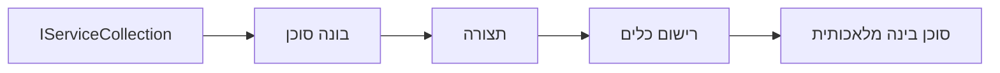

# 🎨 דפוסי עיצוב אג'נטיים עם Azure OpenAI (Responses API) (.NET)

## 📋 מטרות למידה

דוגמה זו מראה דפוסי עיצוב ברמת ארגון לבניית סוכנים אינטיליגנטים באמצעות Microsoft Agent Framework ב-.NET עם אינטגרציה של Azure OpenAI (Responses API). תלמד דפוסים מקצועיים וגישות ארכיטקטוניות שהופכות סוכנים למוכנים לייצור, ניתנים לתחזוקה ומדרגים.

### דפוסי עיצוב ארגוניים

- 🏭 **דפוס מפעל**: יצירת סוכנים סטנדרטית עם הזרקת תלות
- 🔧 **דפוס בונה**: קונפיגורציה והגדרה שוטפת של סוכן
- 🧵 **דפוסים בטוחים לתהליכים**: ניהול שיחות מתוזמנות בו זמנית
- 📋 **דפוס מאגר**: ארגון ניהול כלים ויכולות

## 🎯 יתרונות ארכיטקטוניים ספציפיים ל-.NET

### תכונות ארגוניות

- **טיפוס חזק**: אימות בעת קימפול ותמיכה ב-IntelliSense
- **הזרקת תלות**: אינטגרציה מובנית של מכולת DI 
- **ניהול קונפיגורציה**: דפוסי IConfiguration ו-Options
- **Async/Await**: תמיכה איסינכרונית ברמה גבוהה

### דפוסים מוכנים לייצור

- **אינטגרציית רישום**: ILogger ותמיכה ברישום מובנה ומובנה
- **בדיקות בריאות**: ניטור ואבחון מובנים
- **אימות קונפיגורציה**: טיפוס חזק עם הערות נתונים
- **ניהול שגיאות**: ניהול חריגים מובנה

## 🔧 ארכיטקטורה טכנית

### רכיבי ליבה של .NET

- **Microsoft.Extensions.AI**: הפשטות שירותי AI מאוחדות
- **Microsoft.Agents.AI**: מסגרת לארכיטקטורת סוכנים ארגונית
- **Azure OpenAI (Responses API)**: דפוסי לקוח API לביצועים גבוהים
- **מערכת קונפיגורציה**: שילוב appsettings.json וסביבה

### יישום דפוסי עיצוב



## 🏗️ דפוסים ארגוניים מתועדים

### 1. **דפוסי יצירה**

- **מפעל סוכנים**: יצירת סוכנים ריכוזית עם קונפיגורציה עקבית
- **דפוס בונה**: API זורם לקונפיגורציה מורכבת של סוכן
- **דפוס סינגלטון**: משאבים משותפים וניהול קונפיגורציה
- **הזרקת תלות**: קישור רופף ויכולת לבדיקה

### 2. **דפוסי התנהגות**

- **דפוס אסטרטגיה**: אסטרטגיות ביצוע כלים ניתנות להחלפה
- **דפוס פקודה**: פעולות סוכן מקופסות עם ביטול/שחזור
- **דפוס מתבונן**: ניהול מחזור חיים ממוקד אירועים
- **שיטת תבנית**: תהליכי ביצוע סוכנים סטנדרטיים

### 3. **דפוסי מבנה**

- **דפוס מתאם**: שכבת אינטגרציה של Azure OpenAI (Responses API)
- **דפוס דקורטור**: שדרוג יכולות סוכן
- **דפוס חזית**: ממשקי אינטראקציה מפושטים עם סוכן
- **דפוס פרוקסי**: טעינה עצלנית ואחסון זמני לביצועים

## 📚 עקרונות עיצוב ב-.NET

### עקרונות SOLID

- **אחריות בודדת**: לכל רכיב מטרה ברורה אחת
- **פתוח/סגור**: ניתן להרחבה ללא שינוי
- **החלפת ליסקוב**: מימושים מבוססי ממשק
- **הפרדת ממשקים**: ממשקים ממוקדים וקוהרנטיים
- **היפוך תלות**: תלות בהפשטות, לא במימושים

### ארכיטקטורה נקייה

- **שכבת דומיין**: הפשטות ליבה של סוכן וכלים
- **שכבת יישום**: תזמור ועבודות סוכן
- **שכבת תשתית**: אינטגרציית Azure OpenAI (Responses API) ושירותים חיצוניים
- **שכבת הצגה**: אינטראקציה עם משתמש ועיצוב תגובות

## 🔒 שיקולים ארגוניים

### אבטחה

- **ניהול אישורים**: טיפול מאובטח במפתחות API עם IConfiguration
- **אימות קלט**: טיפוס חזק ואימות עם הערות נתונים
- **סניטציה של פלט**: עיבוד וסינון תגובות מאובטח
- **רישום ביקורת**: מעקב מקיף אחר פעולות

### ביצועים

- **דפוסי Async**: פעולות I/O לא חוסמות
- **חיבור במאגר**: ניהול לקוחות HTTP יעיל
- **אחסון זמני**: מטמון תגובות לשיפור ביצועים
- **ניהול משאבים**: דפוסים לפינוי וניקוי נאותים

### מדרגיות

- **בטיחות תהליכים**: תמיכה בהרצת סוכנים במקביל
- **חיבורי משאבים**: ניצול יעיל של משאבים
- **ניהול עומסים**: הגבלת קצב וטיפול בלחץ חוזר
- **ניטור**: מדדי ביצועים ובדיקות בריאות

## 🚀 פריסה לייצור

- **ניהול קונפיגורציה**: הגדרות מותאמות לסביבה
- **אסטרטגיית רישום**: רישום מובנה עם מזהי קורלציה
- **ניהול שגיאות**: טיפול גלובלי בחריגות עם החלמה נאותה
- **ניטור**: Application Insights ומדדי ביצועים
- **בדיקות**: בדיקות יחידה, אינטגרציה ודפוסי בדיקת עומס

מוכנים לבנות סוכנים אינטיליגנטים ברמת ארגון עם .NET? בואו נעצב משהו יציב! 🏢✨

## 🚀 התחלת עבודה

### דרישות מוקדמות

- [.NET 10 SDK](https://dotnet.microsoft.com/download/dotnet/10.0) או גרסה גבוהה יותר
- [מנוי Azure](https://azure.microsoft.com/free/) עם משאב Azure OpenAI ופריסת מודל
- [Azure CLI](https://learn.microsoft.com/cli/azure/install-azure-cli) — התחבר עם `az login`

### משתני סביבה נדרשים

```bash
# zsh/bash
export AZURE_OPENAI_ENDPOINT=https://<your-resource>.openai.azure.com
export AZURE_OPENAI_DEPLOYMENT=gpt-5-mini
# לאחר מכן, התחבר כדי ש-AzureCliCredential יוכל לקבל אסימון
az login
```

```powershell
# PowerShell
$env:AZURE_OPENAI_ENDPOINT = "https://<your-resource>.openai.azure.com"
$env:AZURE_OPENAI_DEPLOYMENT = "gpt-5-mini"
# לאחר מכן היכנס כדי ש-AzureCliCredential יוכל לקבל אסימון
az login
```

### דוגמת קוד

להריץ את דוגמת הקוד,

```bash
# זש/באש
chmod +x ./03-dotnet-agent-framework.cs
./03-dotnet-agent-framework.cs
```

או באמצעות CLI של dotnet:

```bash
dotnet run ./03-dotnet-agent-framework.cs
```

עיין ב-[`03-dotnet-agent-framework.cs`](../../../../03-agentic-design-patterns/code_samples/03-dotnet-agent-framework.cs) לקוד המלא.

```csharp
#!/usr/bin/dotnet run

#:package Microsoft.Extensions.AI@10.*
#:package Microsoft.Agents.AI.OpenAI@1.*-*
#:package Azure.AI.OpenAI@2.1.0
#:package Azure.Identity@1.13.1

using System.ComponentModel;

using Microsoft.Agents.AI;
using Microsoft.Extensions.AI;

using Azure.AI.OpenAI;
using Azure.Identity;

// Tool Function: Random Destination Generator
// This static method will be available to the agent as a callable tool
// The [Description] attribute helps the AI understand when to use this function
// This demonstrates how to create custom tools for AI agents
[Description("Provides a random vacation destination.")]
static string GetRandomDestination()
{
    // List of popular vacation destinations around the world
    // The agent will randomly select from these options
    var destinations = new List<string>
    {
        "Paris, France",
        "Tokyo, Japan",
        "New York City, USA",
        "Sydney, Australia",
        "Rome, Italy",
        "Barcelona, Spain",
        "Cape Town, South Africa",
        "Rio de Janeiro, Brazil",
        "Bangkok, Thailand",
        "Vancouver, Canada"
    };

    // Generate random index and return selected destination
    // Uses System.Random for simple random selection
    var random = new Random();
    int index = random.Next(destinations.Count);
    return destinations[index];
}

// Azure OpenAI with the Responses API (stable v1 endpoint). Sign in with `az login`.
var azureEndpoint = Environment.GetEnvironmentVariable("AZURE_OPENAI_ENDPOINT")
    ?? throw new InvalidOperationException("AZURE_OPENAI_ENDPOINT is not set.");
var deployment = Environment.GetEnvironmentVariable("AZURE_OPENAI_DEPLOYMENT") ?? "gpt-5-mini";

var azureClient = new AzureOpenAIClient(new Uri(azureEndpoint), new AzureCliCredential());

// Define Agent Identity and Comprehensive Instructions
// Agent name for identification and logging purposes
var AGENT_NAME = "TravelAgent";

// Detailed instructions that define the agent's personality, capabilities, and behavior
// This system prompt shapes how the agent responds and interacts with users
var AGENT_INSTRUCTIONS = """
You are a helpful AI Agent that can help plan vacations for customers.

Important: When users specify a destination, always plan for that location. Only suggest random destinations when the user hasn't specified a preference.

When the conversation begins, introduce yourself with this message:
"Hello! I'm your TravelAgent assistant. I can help plan vacations and suggest interesting destinations for you. Here are some things you can ask me:
1. Plan a day trip to a specific location
2. Suggest a random vacation destination
3. Find destinations with specific features (beaches, mountains, historical sites, etc.)
4. Plan an alternative trip if you don't like my first suggestion

What kind of trip would you like me to help you plan today?"

Always prioritize user preferences. If they mention a specific destination like "Bali" or "Paris," focus your planning on that location rather than suggesting alternatives.
""";

// Create AI Agent with Advanced Travel Planning Capabilities
// Get the Responses client for the deployment and create the AI agent
// Configure agent with name, detailed instructions, and available tools
// This demonstrates the .NET agent creation pattern with full configuration
AIAgent agent = azureClient
    .GetChatClient(deployment)
    .AsAIAgent(
        name: AGENT_NAME,
        instructions: AGENT_INSTRUCTIONS,
        tools: [AIFunctionFactory.Create(GetRandomDestination)]
    );

// Create New Conversation Session for Context Management
// Initialize a new conversation session to maintain context across multiple interactions
// Sessions enable the agent to remember previous exchanges and maintain conversational state
// This is essential for multi-turn conversations and contextual understanding
var session = await agent.CreateSessionAsync();

// Execute Agent: First Travel Planning Request
// Run the agent with an initial request that will likely trigger the random destination tool
// The agent will analyze the request, use the GetRandomDestination tool, and create an itinerary
// Using the session parameter maintains conversation context for subsequent interactions
await foreach (var update in agent.RunStreamingAsync("Plan me a day trip", session))
{
    await Task.Delay(10);
    Console.Write(update);
}

Console.WriteLine();

// Execute Agent: Follow-up Request with Context Awareness
// Demonstrate contextual conversation by referencing the previous response
// The agent remembers the previous destination suggestion and will provide an alternative
// This showcases the power of conversation sessions and contextual understanding in .NET agents
await foreach (var update in agent.RunStreamingAsync("I don't like that destination. Plan me another vacation.", session))
{
    await Task.Delay(10);
    Console.Write(update);
}
```

---

<!-- CO-OP TRANSLATOR DISCLAIMER START -->
**כתב ויתור**:
מסמך זה תורגם באמצעות שירות תרגום אוטומטי [Co-op Translator](https://github.com/Azure/co-op-translator). למרות שאנו שואפים לדיוק, יש לקחת בחשבון שתרגומים אוטומטיים עלולים להכיל שגיאות או אי-דיוקים. יש להחשיב את המסמך המקורי בשפתו הטבעית כמקור הסמכות. למידע קריטי מומלץ להשתמש בתרגום מקצועי על ידי מתרגם אדם. אנו לא אחראים לכל אי-הבנה או פירוש שגוי הנובע מהשימוש בתרגום זה.
<!-- CO-OP TRANSLATOR DISCLAIMER END -->