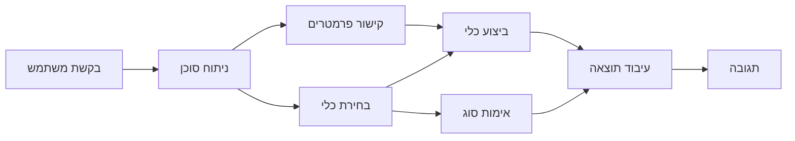

# 🛠️ שימוש מתקדם בכלים עם Azure OpenAI (Responses API) (.NET)

## 📋 מטרות הלמידה

פנקס זה מדגים דפוסי אינטגרציה מתקדמים של כלים ברמת הארגון באמצעות Microsoft Agent Framework ב-.NET עם Azure OpenAI (Responses API). תלמדו לבנות סוכנים מתוחכמים עם מספר כלים מתמחים, תוך ניצול הטיפוס החזק של C# ותכונות הארגון של .NET.

### יכולות מתקדמות של כלים שתשלוטו בהן

- 🔧 **ארכיטקטורת כלים מרובים**: בניית סוכנים עם יכולות מתמחות מרובות
- 🎯 **הרצת כלים בטיפוס בטוח**: ניצול בדיקות בזמן ההידור של C#
- 📊 **דפוסי כלים ארגוניים**: עיצוב כלים מוכנים לייצור וטיפול בשגיאות
- 🔗 **הרכבת כלים**: שילוב כלים עבור תהליכים עסקיים מורכבים

## 🎯 יתרונות ארכיטקטורת הכלים ב-.NET

### תכונות כלים ארגוניות

- **בדיקת תקינות בזמן הידור**: טיפוס חזק מבטיח נכונות פרמטרי הכלים
- **הזרקת תלות**: אינטגרציה עם מכולת IoC לניהול כלים
- **דפוסי Async/Await**: הרצת כלים ללא חסימה עם ניהול משאבים תקין
- **רישום מובנה**: אינטגרציה מובנית לרישום לניטור ביצועי הכלים

### דפוסים מוכנים לייצור

- **ניהול חריגות**: טיפול מקיף בשגיאות עם חריגות ממוטבות
- **ניהול משאבים**: דפוסי סילוק וניהול זיכרון תקינים
- **ניטור ביצועים**: מדדים ומונים מובנים
- **ניהול קונפיגורציה**: קונפיגורציה בטיפוס בטוח עם אימות

## 🔧 ארכיטקטורה טכנית

### רכיבי כלי הליבה ב-.NET

- **Microsoft.Extensions.AI**: שכבת הפשטה מאוחדת לכלים
- **Microsoft.Agents.AI**: אקורדינציה של כלים ברמת ארגון
- **Azure OpenAI (Responses API)**: לקוח API עם ביצועים גבוהים ו-pooling של חיבורים

### צינור הרצת כלים



## 🛠️ קטגוריות ודפוסי כלים

### 1. **כלי עיבוד נתונים**

- **אימות קלט**: טיפוס חזק עם אנוטציות נתונים
- **פעולות המרה**: המרת נתונים ופורמט בטיפוס בטוח
- **לוגיקה עסקית**: כלי חישוב וניתוח ספציפיים לתחום
- **עיצוב פלט**: יצירת תגובות מובנות

### 2. **כלי אינטגרציה**

- **מחברי API**: אינטגרציה עם שירותי REST בעזרת HttpClient
- **כלי מסד נתונים**: אינטגרציה עם Entity Framework לגישה לנתונים
- **פעולות קבצים**: פעולות מערכת קבצים מאובטחות עם אימות
- **שירותים חיצוניים**: דפוסי אינטגרציה עם שירותי צד שלישי

### 3. **כלי שירותים**

- **עיבוד טקסט**: פעולות מחרוזות וכלי עיצוב
- **פעולות תאריך/שעה**: חישובים מודעים לתרבות תאריך/שעה
- **כלים מתמטיים**: חישובים מדויקים וסטטיסטיים
- **כלי אימות**: אימות כללי של חוקי עסק ונתונים

מוכנים לבנות סוכנים ברמת ארגון עם יכולות כלים חזקים ובטיפוס בטוח ב-.NET? בואו נעצב פתרונות מקצועיים! 🏢⚡

## 🚀 התחלה מהירה

### דרישות מקדימות

- [ערכת הפיתוח .NET 10 SDK](https://dotnet.microsoft.com/download/dotnet/10.0) או גרסה גבוהה יותר
- [מנוי Azure](https://azure.microsoft.com/free/) כולל משאב Azure OpenAI ופריסת מודל
- [Azure CLI](https://learn.microsoft.com/cli/azure/install-azure-cli) — התחבר עם `az login`

### משתני סביבה נדרשים

```bash
# zsh/bash
export AZURE_OPENAI_ENDPOINT=https://<your-resource>.openai.azure.com
export AZURE_OPENAI_DEPLOYMENT=gpt-4.1-mini
# לאחר מכן היכנס כדי ש-AzureCliCredential יוכל לקבל אסימון
az login
```

```powershell
# פאוארשל
$env:AZURE_OPENAI_ENDPOINT = "https://<your-resource>.openai.azure.com"
$env:AZURE_OPENAI_DEPLOYMENT = "gpt-4.1-mini"
# ואז התחבר כדי ש-AzureCliCredential יוכל לקבל אסימון
az login
```

### דוגמת קוד

להפעלת דוגמת הקוד,

```bash
# זש/בש
chmod +x ./04-dotnet-agent-framework.cs
./04-dotnet-agent-framework.cs
```

או בשימוש ב-dotnet CLI:

```bash
dotnet run ./04-dotnet-agent-framework.cs
```

ראה [`04-dotnet-agent-framework.cs`](../../../../04-tool-use/code_samples/04-dotnet-agent-framework.cs) לקבלת הקוד המלא.

```csharp
#!/usr/bin/dotnet run

#:package Microsoft.Extensions.AI@10.*
#:package Microsoft.Agents.AI.OpenAI@1.*-*
#:package Azure.AI.OpenAI@2.1.0
#:package Azure.Identity@1.13.1

using System.ComponentModel;

using Microsoft.Agents.AI;
using Microsoft.Extensions.AI;

using Azure.AI.OpenAI;
using Azure.Identity;

// Tool Function: Random Destination Generator
// This static method will be available to the agent as a callable tool
// The [Description] attribute helps the AI understand when to use this function
// This demonstrates how to create custom tools for AI agents
[Description("Provides a random vacation destination.")]
static string GetRandomDestination()
{
    // List of popular vacation destinations around the world
    // The agent will randomly select from these options
    var destinations = new List<string>
    {
        "Paris, France",
        "Tokyo, Japan",
        "New York City, USA",
        "Sydney, Australia",
        "Rome, Italy",
        "Barcelona, Spain",
        "Cape Town, South Africa",
        "Rio de Janeiro, Brazil",
        "Bangkok, Thailand",
        "Vancouver, Canada"
    };

    // Generate random index and return selected destination
    // Uses System.Random for simple random selection
    var random = new Random();
    int index = random.Next(destinations.Count);
    return destinations[index];
}

// Azure OpenAI with the Responses API (stable v1 endpoint). Sign in with `az login`.
var azureEndpoint = Environment.GetEnvironmentVariable("AZURE_OPENAI_ENDPOINT")
    ?? throw new InvalidOperationException("AZURE_OPENAI_ENDPOINT is not set.");
var deployment = Environment.GetEnvironmentVariable("AZURE_OPENAI_DEPLOYMENT") ?? "gpt-4.1-mini";

var azureClient = new AzureOpenAIClient(new Uri(azureEndpoint), new AzureCliCredential());

// Define Agent Identity and Comprehensive Instructions
// Agent name for identification and logging purposes
var AGENT_NAME = "TravelAgent";

// Detailed instructions that define the agent's personality, capabilities, and behavior
// This system prompt shapes how the agent responds and interacts with users
var AGENT_INSTRUCTIONS = """
You are a helpful AI Agent that can help plan vacations for customers.

Important: When users specify a destination, always plan for that location. Only suggest random destinations when the user hasn't specified a preference.

When the conversation begins, introduce yourself with this message:
"Hello! I'm your TravelAgent assistant. I can help plan vacations and suggest interesting destinations for you. Here are some things you can ask me:
1. Plan a day trip to a specific location
2. Suggest a random vacation destination
3. Find destinations with specific features (beaches, mountains, historical sites, etc.)
4. Plan an alternative trip if you don't like my first suggestion

What kind of trip would you like me to help you plan today?"

Always prioritize user preferences. If they mention a specific destination like "Bali" or "Paris," focus your planning on that location rather than suggesting alternatives.
""";

// Create AI Agent with Advanced Travel Planning Capabilities
// Get the Responses client for the deployment and create the AI agent
// Configure agent with name, detailed instructions, and available tools
// This demonstrates the .NET agent creation pattern with full configuration
AIAgent agent = azureClient
    .GetChatClient(deployment)
    .AsAIAgent(
        name: AGENT_NAME,
        instructions: AGENT_INSTRUCTIONS,
        tools: [AIFunctionFactory.Create(GetRandomDestination)]
    );

// Create New Conversation Session for Context Management
// Initialize a new conversation session to maintain context across multiple interactions
// Sessions enable the agent to remember previous exchanges and maintain conversational state
// This is essential for multi-turn conversations and contextual understanding
await using var session = await agent.CreateSessionAsync();

// Execute Agent: First Travel Planning Request
// Run the agent with an initial request that will likely trigger the random destination tool
// The agent will analyze the request, use the GetRandomDestination tool, and create an itinerary
// Using the session parameter maintains conversation context for subsequent interactions
await foreach (var update in agent.RunStreamingAsync("Plan me a day trip", session))
{
    await Task.Delay(10);
    Console.Write(update);
}

Console.WriteLine();

// Execute Agent: Follow-up Request with Context Awareness
// Demonstrate contextual conversation by referencing the previous response
// The agent remembers the previous destination suggestion and will provide an alternative
// This showcases the power of conversation sessions and contextual understanding in .NET agents
await foreach (var update in agent.RunStreamingAsync("I don't like that destination. Plan me another vacation.", session))
{
    await Task.Delay(10);
    Console.Write(update);
}
```

---

<!-- CO-OP TRANSLATOR DISCLAIMER START -->
**כתב ויתור**:
מסמך זה תורגם באמצעות שירות תרגום אוטומטי [Co-op Translator](https://github.com/Azure/co-op-translator). למרות שאנו שואפים לדיוק, יש לקחת בחשבון שתרגומים אוטומטיים עלולים להכיל שגיאות או אי-דיוקים. יש להחשיב את המסמך המקורי בשפתו הטבעית כמקור הסמכות. למידע קריטי מומלץ להשתמש בתרגום מקצועי על ידי מתרגם אדם. אנו לא אחראים לכל אי-הבנה או פירוש שגוי הנובע מהשימוש בתרגום זה.
<!-- CO-OP TRANSLATOR DISCLAIMER END -->