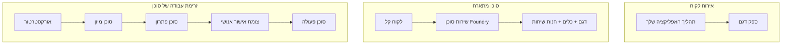
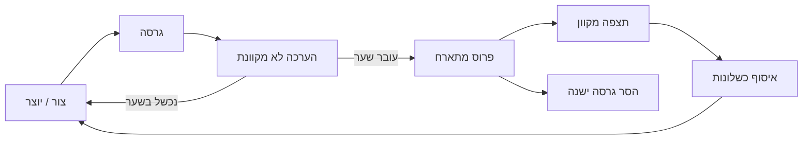
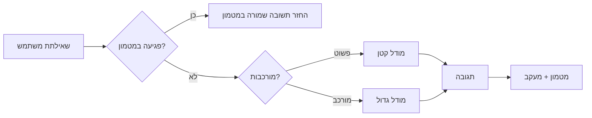
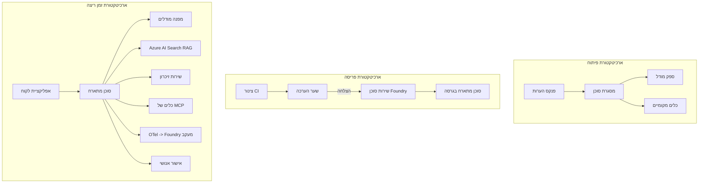

# פריסת סוכנים מתרחבים עם Microsoft Foundry


עד לנקודה זו בקורס בנית סוכנים שפועלים על הלפטופ שלך, בתוך פנקס הערות, מונעים על ידי `az login` ומספר משתני סביבה. זו בדיוק הדרך הנכונה ללמוד. זו לא הדרך הנכונה להפעיל סוכן שעל אלפי לקוחות תלויים בו ב-3 לפנות בוקר.

שיעור זה עוסק בפער בין "זה עובד על המחשב שלי" לבין "זה עובד, באמינות ובמחיר סביר, בפועל." אנו סוגרים את הפער הזה באמצעות **Microsoft Foundry** ו-**Microsoft Foundry Agent Service**, ועושים זאת על ידי בניית סוכן תמיכת לקוחות אמיתי שיש לו כלים, אחזור, זיכרון, הערכה ומעקב.

## הקדמה

שיעור זה יכסה:

- ההבדל בין **סוכן אב-טיפוס** לבין **סוכן פרוס**, ולמה המעבר בעיקר עוסק בכל מה ש*מסביב* למודל.
- **דפוסי פריסה** לסוכנים: מתארח בלקוח, מתארח בשירות (Hosted Agents), וזרימת עבודה מתוזמנת.
- **מחזור חיי הסוכן** ב-Microsoft Foundry — יצירה, גירסה, פריסה, הערכה, צפייה, פרישה.
- **אסטרטגיות התרחבות**: ניתוב מודל, מטמון, משותפות, ועיצוב ללא מצב.
- **נראות** באמצעות OpenTelemetry ומעקב Foundry.
- **אופטימיזציית עלות** דרך בחירת מודל, ניתוב ושערי הערכה.
- **שיקולי ארגון**: ממשל, אישור אנושי, והפעלת שרתי MCP בבטחה בייצור.

## מטרות למידה

לאחר סיום שיעור זה תדע כיצד:

- לבחור את דפוס הפריסה הנכון עבור עומס העבודה של סוכן נתון.
- לפרוס סוכן לשירות Microsoft Foundry Agent כך שיהיה בעל גירסה, ממשל ונראות.
- לאבחן סוכן למעקב ולחבר קו צינור הערכה שרץ לפני כל שחרור.
- ליישם ניתוב מודל ומטמון כדי לשמור על זמניות ועלות תחת שליטה בקנה מידה.
- להוסיף שער אישור אנושי לפעולות בסיכון גבוה ולשלב שרת MCP בצורה בטוחה בייצור.

## דרישות מוקדמות

שיעור זה מניח שסיימת את השיעורים הקודמים ואתה שולט ב:

- בניית סוכנים עם [Microsoft Agent Framework](../14-microsoft-agent-framework/README.md) (שיעור 14).
- [שימוש בכלים](../04-tool-use/README.md) (שיעור 4) ו-[Agentic RAG](../05-agentic-rag/README.md) (שיעור 5).
- [זיכרון סוכן](../13-agent-memory/README.md) (שיעור 13) ו-[פרוטוקולים אגנטיים / MCP](../11-agentic-protocols/README.md) (שיעור 11).
- [נראות והערכה](../10-ai-agents-production/README.md) (שיעור 10) — שיעור זה ממשיך ישירות ממנו.

תזדקק גם ל:

- **מנוי Azure** ו-**פרויקט Microsoft Foundry** עם לפחות מודל צ'אט פרוס אחד.
- ממשק שורת הפקודה Azure CLI מאומת (`az login`).
- Python 3.12+ והחבילות במאגר [`requirements.txt`](../../../requirements.txt).

## מאב-טיפוס לייצור: מה באמת משתנה

סוכן אב-טיפוס וסוכן ייצור חולקים את אותו לולאת ליבה — חשיבה, קריאה לכלים, תגובה. מה שמשתנה הוא כל מה שמסביב ללולאה הזו. המודל הוא אולי 20% מסוכן ייצור; ה-80% הנותרים הם השלד התפעולי.

| עניין | אב-טיפוס | ייצור |
| --- | --- | --- |
| **אירוח** | פועל בפנקס הערות שלך | פועל כשירות מתארח, עם גירסה ופריסה |
| **זהות** | אסימון `az login` שלך | זהות מנוהלת עם RBAC מוגדר |
| **מצב** | בזיכרון, אובד באתחול | מנותב חיצונית (מאגר תהליכים, שירות זיכרון) |
| **כישלון** | רואים את עקבות השגיאה | ניסיונות חוזרים, אופציות חילופיות, דואר מת, התראות |
| **עלות** | "זה כמה סנטים" | מעקב לפי בקשה, ניתוב, מטמון, תקציב |
| **איכות** | בודקים בעין | מוערך אוטומטית לפני כל שחרור |
| **אמון** | מאשרים כל פעולה | מדיניות + אופט אנושי לפעולות בסיכון |

זכור את הטבלה הזאת. כל קטע למטה מתייחס לאחת משורות אלו.

## דפוסי פריסת סוכן

יש שלושה דפוסים ששתמש בהם, לעיתים בשילוב.

### 1. סוכנים מתארחים בלקוח

אובייקט הסוכן חי בתוך תהליך היישום *שלך*. הקוד שלך קורא לספק המודל ישירות; לולאת החשיבה פועלת בשירות שלך. זה מה שכל שיעור קודם עשה.

- **משתמשים בזה כש** אתה זקוק לבקרה מלאה על הלולאה, למידול מותאם, או משלב את הסוכן בתוך backend קיים.
- **וויתור**: אתה אחראי להרחבה, מצבי זיכרון ועמידות בעצמך.

### 2. סוכנים מתארחים (Foundry Agent Service)

הסוכן *נרשם כמשאב* ב-Microsoft Foundry. Foundry מארח את לולאת החשיבה, מאחסן תהליכים, אוכף בטיחות תוכן ו-RBAC, ומציג את הסוכן בפורטל Foundry. האפליקציה שלך הופכת ללקוח דק שיוצר תהליכים וקורא תגובות.

- **משתמשים בזה כש** רוצים עמידות, נראות מובנית, ממשל ושטח תפעולי מוגבל.
- **וויתור**: בקרה נמוכה יותר מול ריצה מנוהלת.

### 3. זרימות עבודה לסוכן

מספר סוכנים (וכלים) מורכבים לגרף עם זרימת בקרה מפורשת — שלבים סדרתיים, הסתעפויות, נקודות אישור אנושיות, ונקודות בדיקה עמידות שיכולות להשהות ולהמשיך. זו היכולת של Microsoft Agent Framework **Workflows** במדרג פריסה.

- **משתמשים בזה כש** משימה אחת כוללת מספר סוכנים מיוחדים או דורשת שלב אישור באמצע.
- **וויתור**: יותר חלקים נעים; דורש נראות ברמת אורקסטרציה.



## מחזור חיי הסוכן ב-Microsoft Foundry

פריסת סוכן אינה "push" חד פעמי. זו לולאה, ונראית הרבה כמו מחזור שחרור תוכנה כי זה בדיוק מה שהיא.



הרעיון המרכזי, שמגיע משיעור [10](../10-ai-agents-production/README.md): **הערכת offline היא שער, לא מחשבה לאחר מעשה.** גרסת סוכן חדשה לא נשלחת עד שהיא עוברת את סף ההערכה שלך. הנראות האונליין מזינה אז כישלונות אמתיים חזרה למאגר הבדיקות האופליין שלך. זו כל הלולאה.

## אסטרטגיות התרחבות

הרחבת סוכן שונה מהרחבת Web API ללא מצב, כי כל בקשה יכולה להפעיל קריאות יקרות למודל ולכלים. ארבע טכניקות נושאות את רוב העומס.

**טיפול בבקשות ללא מצב.** אל תשמור מצב לכל משתמש בזיכרון התהליך שלך. שמור את תהליכי השיחה במאגר Foundry או בשירות זיכרון כך שכל מופע יכול לטפל בכל בקשה. זה מאפשר לך להרחיב אופקית — הוסף מופעים, ללא מושבים קשיחים.

**ניתוב מודל.** לא כל בקשה צריכה את המודל היעיל (והיקר) ביותר שלך. נהל בקשות פשוטות — סיווג כוונות, תשובות עובדתיות קצרות — למודל קטן וזריז, שמור את המודל הגדול לניתוח אמיתי. Foundry's **Model Router** יכול לעשות זאת עבורך, או שתוכל לממש מסווג קל בעצמך. תבנה את הגרסה העצמית במעבדה.

**מטמון תגובות.** שאלות תמיכה רבות הן כמעט כפילויות ("איך מאפסים סיסמה?"). מטמון תשובות לשאלות נפוצות והגש אותן בלי לפנות למודל. אפילו שיעור פגיעת מטמון מתון חותך משמעותית עלות וזמניות.

**קונקרנטיות ולחץ נגד.** לספקי מודלים יש מגבלות קצב. הגב את הקונקרנטיות, השתמש בניסיונות חוזרים עם התערבות מוערכת, וכשל בחן (תגובה בתור "אנחנו מטפלים בזה" עדיפה על שגיאה 500).



## נראות בייצור

אי אפשר להפעיל מה שאינו נראה. כפי שכוסה בשיעור 10, Microsoft Agent Framework מפיק באופן טבעי עקבות **OpenTelemetry** — כל קריאת מודל, הפעלת כלי, ושלב אורקסטרציה הופכים ל-span. בייצור אתה מייצא את ה-spans אל Microsoft Foundry (או כל backend תומך OTel) כך שתוכל:

- לעקוב אחר תלונת לקוח מקצה לקצה בכל קריאה למודל וכלי.
- לעקוב אחר p50/p95 זמניות ועלות לכל בקשה לאורך זמן.
- להתריע על זינוקים בשיעור שגיאות ואנומליות עלות לפני שהמשתמשים (או צוות הכספים שלך) שם לב.

```python
from agent_framework.observability import get_tracer

tracer = get_tracer()

with tracer.start_as_current_span("support_request") as span:
    span.set_attribute("customer.tier", "enterprise")
    span.set_attribute("routed.model", "gpt-5-nano")
    # ביצוע הסוכן מתועק אוטומטית בתוך טווח זה
```

תכונות כמו `customer.tier` ו-`routed.model` הופכות קיר של עקבות לשאלות שניתן לענות עליהן ("האם לקוחות ארגוניים ניתבים למודל הקטן מדי לעיתים קרובות?").

## אופטימיזציית עלות

העלות בסוכני ייצור נשלטת בעיקר על ידי טוקנים. שלושה מנופים, בסדר ההשפעה:

1. **גודל נכון של המודל.** מודל קטן שעובר את שער ההערכה שלך כמעט תמיד זול יותר ממודל גדול שעובר גם. השתמש בהערכה כדי *להוכיח* שהמודל הקטן מספיק טוב במקום לברוח למודל הגדול מתוך זהירות.
2. **ניתוב לפי מורכבות.** כפי למעלה — לשלם מחירי מודל גדול רק עבור בקשות שדורשות חשיבה במודל גדול.
3. **מטמון אגרסיבי.** קריאת המודל הזולה ביותר היא זו שמעולם לא מבוצעת.

שערי הערכה ושליטה בעלות הם אותו תחום אצל שני זוויות שונות: הערכה מגדירה את *רצפת האיכות*, ניתוב ומטמון שומרים אותך קרוב ככל האפשר ל-*עלות* של רצפה זו.

## שיקולי פריסה ארגוניים

**ממשל.** סוכנים מתארחים יורשים את RBAC, בטיחות התוכן ורישום הביקורת של Foundry. תן לכל סוכן זהות מנוהלת עם המינימום הרשאות הנדרש — גישה לקריאה בלבד לבסיס הידע, גישה מוגדרת ל-API כרטיסים, ולא יותר.

**אדם בלולאה.** חלק מהפעולות קריטיות מידי לאוטומציה מלאה — הנפקת החזר כספי, מחיקת חשבון, העלאה לצוות משפטי. Microsoft Agent Framework תומך בכלים שדורשים **אישור**: הסוכן מציע את הפעולה, ההוצאה מפסיקה, אדם מאשר או דוחה, וזרימת העבודה ממשיכה. ראית את הפרימיטיב ב-[שיעור 6](../06-building-trustworthy-agents/README.md); כאן אתה מפעיל אותו.

**MCP בייצור.** [MCP](../11-agentic-protocols/README.md) מאפשר לסוכן שלך להשתמש בכלים חיצוניים דרך ממשק סטנדרטי. בייצור, התייחס לכל שרת MCP כגבול לא מהימן: קבע את גרסת השרת, הפעילו עם זהות מוגדרת, אמת את הפלט שלו, ואל תחשוף לו סודות. שרת MCP הוא תלות, ותלויות מתעדכנות, מבוקרות ומוגבלות בקצב.



שלושת השרטוטים — פיתוח, פריסה, זמן ריצה — הם אותו סוכן בשלושת שלבי חייו. המעבדה הבאה תוביל אותך לבנייתו.

## מעבדת ידיים על: סוכן תמיכת לקוחות המוכן לייצור

פתח את [`code_samples/16-python-agent-framework.ipynb`](./code_samples/16-python-agent-framework.ipynb) ועבוד איתו מקצה לקצה. תרכיב סוכן תמיכת לקוחות **Contoso** עם כל שיקולי הייצור מחוברים:

1. **קריאת כלים** — לבדוק מצב הזמנה ולפתוח כרטיסי תמיכה.
2. **RAG** — לענות על שאלות מדיניות מבסיס ידע (Azure AI Search, עם גיבוי בזיכרון כך שהפנקס רץ ללא משאב Search).
3. **זיכרון** — לזכור את הלקוח בסביבות השיחה.
4. **ניתוב מודל** — מסווג מורכבות מנווט כל בקשה למודל קטן או גדול.
5. **מטמון תגובות** — שאלות חוזרות מוגשות מהמטמון.
6. **אישור אנושי** — החזרים מעל סף מחכים לאישור אנושי.
7. **קו הערכה** — סט בדיקה קטן אוף-ליין מדרג את הסוכן ומשמש כשער שחרור.
8. **נראות** — מעקב OpenTelemetry סביב כל בקשה.

### הליכה צעד-צעד

הפנקס מאורגן כך שכל שיקול ייצור הוא קטע עצמאי והרצה. הלב הוא מטפל הבקשות המשלב ניתוב ומטמון:

```python
async def handle_support_request(query: str, customer_id: str) -> str:
    # 1. לשרת מהמטמון כשאפשר.
    cached = response_cache.get(normalize(query))
    if cached:
        return cached

    # 2. לנתב לפי מורכבות כדי לשלוט בעלות.
    model = "gpt-5-nano" if is_simple(query) else "gpt-5-mini"

    # 3. להריץ את הסוכן בתוך טווח עקיבה לצפייה.
    with tracer.start_as_current_span("support_request") as span:
        span.set_attribute("routed.model", model)
        span.set_attribute("customer.id", customer_id)
        response = await support_agent.run(query, model=model)

    # 4. למטמן ולהחזיר.
    response_cache.set(normalize(query), response.text)
    return response.text
```

שער ההערכה ששומר על השחרור נראה כך:

```python
async def evaluation_gate(agent, test_cases, threshold: float = 0.8) -> bool:
    passed = 0
    for case in test_cases:
        result = await agent.run(case["input"])
        if score_response(result.text, case["expected"]) >= 0.8:
            passed += 1
    pass_rate = passed / len(test_cases)
    print(f"Evaluation pass rate: {pass_rate:.0%} (gate: {threshold:.0%})")
    return pass_rate >= threshold  # לפרוס רק אם השער עובר
```

קרא כל שורה — הפנקס שומר על הפרימיטיבים קטנים בכוונה כדי שלא יוסתר כלום מאחורי קריאה למסגרת.

## אימות סוכן פרוס עם בדיקות עשן

שער ההערכה לעיל רץ *אוף-ליין* כנגד אובייקט הסוכן שלך. לאחר שהסוכן פרוס כסוכן מתארח, אתה זקוק לבדיקה נוספת, אפילו זולה יותר: **האם נקודת הקצה הפרוסה באמת מגיבה?**

פריסה "מוצלחת" מוכיחה רק ש-plane השליטה קיבל את ההגדרה — לא שהסוכן מגיב. תלות חסרה, ניתוב מודל לא תקין, או חיבור שפג תוקף יכולים להשאיר פריסה ירוקה שמחזירה כלום. **בדיקת עשן** תופסת זאת בתוך שניות, בכל פריסה, מבלי עלות הערכה מלאה.

מאגר זה מספק קו צינור בדיקות עשן מוכן לשימוש, המבוסס על הפעולה GitHub [AI Smoke Test](https://github.com/marketplace/actions/ai-smoke-test):

- **קטלוג** — [`tests/lesson-16-smoke-tests.json`](../../../tests/lesson-16-smoke-tests.json) מכיל הנחיות ואישורים לסוכן התמיכה של Contoso (תשובות מדיניות מבוססות ידע, בדיקת הזמנה, שמירה על נושא, ורציפות שיחה רב-סיבובית). קטלוגים לסוכנים משיעורים אחרים נמצאים לצדו — ראה [`tests/README.md`](../tests/README.md).
- **זרימת עבודה** — [`.github/workflows/smoke-test.yml`](../../../.github/workflows/smoke-test.yml) מתחבר עם Azure OIDC ושולח POST לכל הנחיה לנקודת הקצה התגובות של הסוכן, ומכשל את המשימה על כל החמצת אישור.

```yaml
- name: Smoke-test hosted agent
  uses: JFolberth/ai-smoketest@v1
  with:
    project_endpoint: ${{ inputs.project_endpoint }}
    agent_name: ContosoSupportAgent
    tests_file: tests/lesson-16-smoke-tests.json
```


הרץ את זה מלשונית **Actions** ברגע שהסוכן שלך פרוס, תוך מתן נקודת קצה של פרויקט Foundry ושם הסוכן. הזהות הפדרטיבית חייבת לקבל את תפקיד **Azure AI User** בהיקף פרויקט Foundry. חשבו על השכבות כמו פירמידה: בדיקות עשן (נגישה ומגיבה?) רצות בכל פריסה, הערכה לא מקוונת (טובה מספיק לשחרור?) רצה לפני קידום, והערכה מקוונת (איך זה מתפקד בשטח?) מתבצעת באופן רציף.

## בדיקת ידע

בדקו את הבנתכם לפני המעבר למשימה.

**1. בערך מהי כמות ה-"מודל" ביחס לסוכן ייצור, ומהו השאר?**

<details>
<summary>תשובה</summary>

המודל הוא מיעוט במערכת — מצוין לעיתים קרובות כסביבות 20%. השאר הוא השלד התפעולי: אירוח וגרסאות, זהות ושליטה מבוססת תפקידים (RBAC), מצב חיצוני, ניהול כשלים, מעקב עלויות, הערכה ובקרות שמערבות בני אדם. המעבר לייצור עוסק בעיקר בבניית כל מה ש*סביב* לולאת ההיגיון.
</details>

**2. מתי תבחר סוכן אירוח (Hosted Agent) על פני סוכן מתארח בלקוח?**

<details>
<summary>תשובה</summary>

כאשר אתה רוצה סביבת ריצה מנוהלת עם מקורות עמידות מובנים (תהליכים שנשארים ויכולים להמשיך), אפשרות תצפית, בטיחות תוכן, ו-RBAC, ואתה מוכן לוותר על קצת שליטה נמוכה יותר על לולאת ההיגיון עבור פחות שטח תפעולי. סוכן מתארח בלקוח עדיף כשאתה צריך שליטה מלאה על הלולאה או משלב את הסוכן במערכת קצה קיימת.
</details>

**3. למה סוכן סקלאבילי חייב להיות ללא מצב בזיכרון התהליך שלו?**

<details>
<summary>תשובה</summary>

כדי שכל מופע יוכל לטפל בכל בקשה, מה שמאפשר סקיילינג אופקי בלי קשרים קשיחים (sticky sessions). מצב שיחה של משתמש מאוחסן החוצה לחנות תהליכים או שירות זיכרון. אם המצב היה בזיכרון התהליך, היית מאבד אותו באתחול ולא יכול להפיץ עומס בחופשיות.
</details>

**4. איזו בעיה פותר ניתוב מודלים, ואיך זה קשור להערכה?**

<details>
<summary>תשובה</summary>

ניתוב שולח בקשות פשוטות למודל קטן, זול ומהיר ושומר את המודל הגדול להיגיון ממשי, שולט גם על עיכוב וגם על עלות. זה קשור להערכה כי ההערכה היא מה *מוכיח* שהמודל הקטן טוב מספיק לסוג של בקשות — ניתוב ללא הערכה הוא ניחוש.
</details>

**5. מה זה "שער הערכה" והיכן הוא נמצא במחזור החיים?**

<details>
<summary>תשובה</summary>

שער הערכה מריץ סט בדיקות לא מקוונות נגד גרסה חדשה של סוכן וחוסם פריסה אלא אם שיעור ההצלחה עובר סף. הוא נמצא בין "גרסה" ל"פריסה" במחזור החיים, והופך איכות לתנאי מקדים לשחרור ולא למשהו שבודקים לאחר השחרור.
</details>

**6. למה צריך להתייחס לשרת MCP boundary שאינו מהימן בייצור?**

<details>
<summary>תשובה</summary>

כי הוא תלות חיצונית שהסוכן שלך קורא אליה. עליך לקבע את גרסתו, להריץ אותו עם זהות מוגבלת, לאמת את הפלט שלו, להגביל קצב, ולעולם לא לחשוף סודות אליו — אותה משמעת שאתה מיישם על כל תלות של צד שלישי. הפלט שלו זורם להיגיון הסוכן שלך, ולכן אמון לא מאומת הוא סיכון אבטחה.
</details>

**7. איזו שינוי יחיד בדרך כלל משפיע הכי הרבה על עלות סוכן בייצור, ולמה?**

<details>
<summary>תשובה</summary>

התאמת המודל — להשתמש במודל הקטן ביותר שעובר את שער ההערכה שלך. העלות נשלטת על ידי סימנים (tokens), ומודל קטן יותר שעומד ברף האיכות כמעט תמיד זול יותר ממודל גדול יותר. שמירת מטמון וניתוב בהמשך מפחיתים עוד יותר עלות, אבל בחירת מודל בסיס נכון היא ההשפעה הגדולה ביותר.
</details>

**8. איזו תפקיד משחקים מאפייני span כמו `customer.tier` ו-`routed.model` בתצפית?**

<details>
<summary>תשובה</summary>

הם הופכים את הרישומים הגולמיים לשאלות עסקיות שניתן לענות עליהן. בלי מאפיינים יש לך חומה של ספאנים; איתם אפשר לשאול "האם לקוחות ארגוניים מנותבים יותר מדי למודל הקטן?" או "איזה מודל מטפל בבקשות האיטיות ביותר שלנו?" מאפיינים הם איך אתה מפרק את הטלמטריה לפי הממדים שמשמעותיים לתפעול שלך.
</details>

## משימה

קחו את סוכן התמיכה בלקוחות מהמעבדה וחזקו אותו לתרחיש ספציפי: **סוכן תמיכה בחיובי מנויים לחברת SaaS.**

ההגשה שלך צריכה לכלול:

1. **החלף את הכלים** בכלים רלוונטיים לחיובים: `get_subscription_status`, `get_invoice`, ו-`issue_credit` (אשראי מעל 50 דולר דורש אישור בני אדם).
2. **הוסף שלושה מסמכי RAG** המכסים את מדיניות ההחזר, מחזור החיוב, ומדיניות הביטול של החברה.
3. **הרחב את סט ההערכה** לפחות לשמונה מקרים, כולל לפחות שניים ש*צריכים* להפעיל את מסלול אישור האנושי, ואשרור שער ההערכה שלך עובר או נכשל כראוי.
4. **הוסף דוח עלויות אחד**: לאחר הרצת עשר שאילתות מעורבות דרך הסוכן, הדפס כמה הלכו למודל הקטן, כמה לגדול, וכמה הוגשו מהמטמון.

כתוב פסקה קצרה (בתא מרקדהון) שמסבירה איזו כלל ניתוב מודל בחרת ואיך תוודא אותו עם תעבורה אמיתית. אין תשובה נכונה יחידה — אתה מוערך לפי האופן שבו העניינים הייצוריים מחוברים בהרמוניה.

## סיכום

בשיעור זה העברת סוכן מפרוטוטייפ לייצור עם Microsoft Foundry:

- המעבר לייצור הוא בעיקר על **השלד התפעולי** סביב המודל — אירוח, זהות, מצב, ניהול כשלים, עלות, איכות, ואמון.
- למדת את שלושת **דפוסי הפריסה** — סוכן מתארח בלקוח, סוכני אירוח, וזרמי עבודה של סוכן — ומתי כל אחד מתאים.
- למדת את **מחזור החיים של הסוכן**, שבה ההערכה הלא מקוונת פועלת כ"פורץ שחרור" והתצפית המקוונת מחזירה כשלים לסט הבדיקות.
- יישמת **אסטרטגיות סקיילינג** — עיצוב ללא מצב, ניתוב מודלים, מטמון, וכיווניות מוגבלת — וקישרת אותם ל**אופטימיזציית עלויות**.
- שילבת **בקרות ארגוניות**: RBAC, אישור בני אדם, ואינטגרציית MCP בטוחה לייצור.
- בנית סוכן תמיכה בלקוחות מוכן לייצור שמחבר את כל אחת מהדאגות האלה יחד בקוד שניתן להריץ.

השיעור הבא לוקח את המסלול ההפוך: במקום להרחיב סוכנים לענן, תוריד אותם *למטה* למכונת מפתח בודדת ותפעיל אותם באופן מקומי לגמרי.

## משאבים נוספים

- <a href="https://learn.microsoft.com/azure/ai-foundry/what-is-azure-ai-foundry" target="_blank">תיעוד Microsoft Foundry</a>
- <a href="https://learn.microsoft.com/azure/ai-foundry/agents/overview" target="_blank">סקירת שירות סוכני Microsoft Foundry</a>
- <a href="https://aka.ms/ai-agents-beginners/agent-framework" target="_blank">מסגרת הסוכנים של Microsoft</a>
- <a href="https://learn.microsoft.com/azure/ai-foundry/concepts/model-router" target="_blank">נתב מודלים ב-Microsoft Foundry</a>
- <a href="https://learn.microsoft.com/azure/search/search-what-is-azure-search" target="_blank">Azure AI Search</a>
- <a href="https://opentelemetry.io/" target="_blank">OpenTelemetry</a>
- <a href="https://github.com/marketplace/actions/ai-smoke-test" target="_blank">פעולת AI Smoke Test ב-GitHub</a>
- <a href="https://modelcontextprotocol.io/" target="_blank">פרוטוקול הקשר מודל (MCP)</a>

## שיעור קודם

[בניית סוכני שימוש במחשב (CUA)](../15-browser-use/README.md)

## שיעור הבא

[יצירת סוכני AI מקומיים](../17-creating-local-ai-agents/README.md)

---

<!-- CO-OP TRANSLATOR DISCLAIMER START -->
**כתב ויתור**:
מסמך זה תורגם באמצעות שירות תרגום אוטומטי [Co-op Translator](https://github.com/Azure/co-op-translator). למרות שאנו שואפים לדיוק, יש לקחת בחשבון שתרגומים אוטומטיים עלולים להכיל שגיאות או אי-דיוקים. יש להחשיב את המסמך המקורי בשפתו הטבעית כמקור הסמכות. למידע קריטי מומלץ להשתמש בתרגום מקצועי על ידי מתרגם אדם. אנו לא אחראים לכל אי-הבנה או פירוש שגוי הנובע מהשימוש בתרגום זה.
<!-- CO-OP TRANSLATOR DISCLAIMER END -->