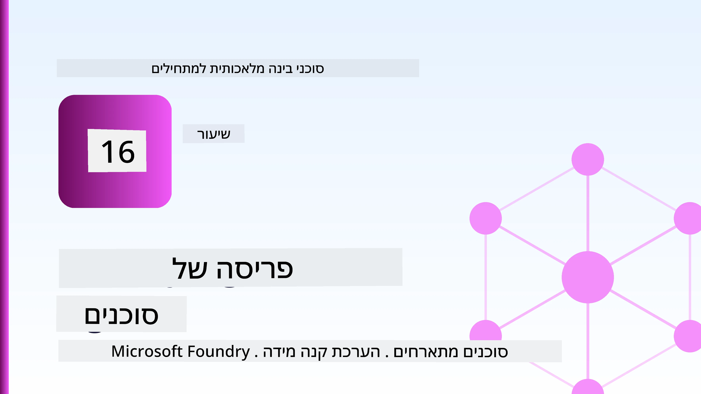
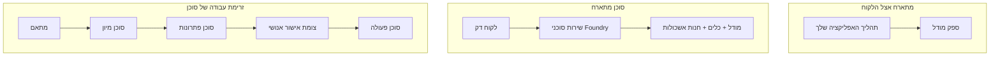
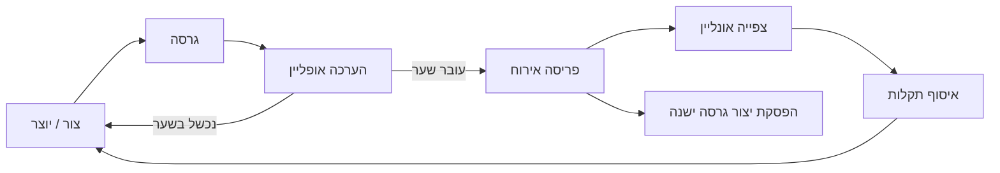
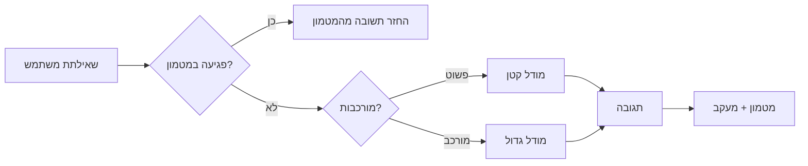
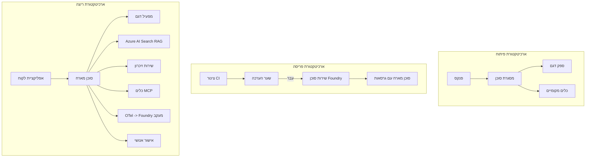

# פריסת סוכנים מדרגית עם Microsoft Foundry



עד לנקודה זו בקורס בניתם סוכנים שרצים על הלפטופ שלכם, בתוך פנקס רשימות, מונעים על ידי `az login` ומספר משתני סביבה. זו בדיוק הדרך הנכונה ללמוד. זו לא הדרך הנכונה להפעיל סוכן שאליו אלפים של לקוחות תלויים בשעה 3 לפנות בוקר.

שיעור זה עוסק בפער בין "זה עובד על המחשב שלי" ו-"זה עובד, בצורה אמינה ובמחיר סביר, בפרודקשן." אנו סוגרים את הפער הזה באמצעות **Microsoft Foundry** ו-**Microsoft Foundry Agent Service**, ועושים זאת על ידי בניית סוכן תמיכה אמיתי ללקוח שכולל כלים, אחזור, זיכרון, הערכה ומעקב.

## הקדמה

בשיעור זה נסקור:

- ההבדל בין **סוכן אב-טיפוס** ל-**סוכן פרוס**, ולמה המעבר הוא בעיקר על כל מה *סביב* המודל.
- **תבניות פריסה** לסוכנים: אירוח בצד הלקוח, שירותית (סוכנים מתארחים), ותזמורת תהליכית.
- **מחזור חיי הסוכן** ב-Microsoft Foundry — יצירה, גירסה, פריסה, הערכה, תצפית, פרישה.
- **אסטרטגיות סקיילינג**: ניתוב מודלים, אחסון מטמון, ריבוי משימות, ועיצוב חסר-מצב.
- **תצפיתיות** עם OpenTelemetry ותקשורת Foundry.
- **אופטימיזציית עלות** דרך בחירת מודלים, ניתוב, ושערי הערכה.
- **התחשבות ארגונית**: ממשל, אישור אנושי, והרצת שרתי MCP בבטחה בפרודקשן.

## מטרות הלמידה

לאחר שתסיימו את השיעור, תוכלו:

- לבחור את תבנית הפריסה הנכונה לעומס העבודה של סוכן מסוים.
- לפרוס סוכן לשירות הסוכנים ב-Microsoft Foundry כך שיקבל גירסאות, ממשל ותצפית.
- לתזמן סוכן למעקב ולעשות קו צינור הערכה שרץ לפני כל שחרור.
- ליישם ניתוב מודלים ואחסון מטמון כדי לשמור על זמן תגובה ועלות תחת שליטה בהיקף.
- להוסיף שער אישור אנושי לפעולות בסיכון גבוה ולשלב שרת MCP בצורה בטוחה בפרודקשן.

## דרישות מוקדמות

שיעור זה מניח שסיימתם את השיעורים הקודמים ואתם שוחים בנושאים הבאים:

- בניית סוכנים עם [Microsoft Agent Framework](../14-microsoft-agent-framework/README.md) (שיעור 14).
- [שימוש בכלים](../04-tool-use/README.md) (שיעור 4) ו-[Agentic RAG](../05-agentic-rag/README.md) (שיעור 5).
- [זיכרון סוכן](../13-agent-memory/README.md) (שיעור 13) ו-[פרוטוקולי סוכן / MCP](../11-agentic-protocols/README.md) (שיעור 11).
- [תצפית והערכה](../10-ai-agents-production/README.md) (שיעור 10) — שיעור זה בונה ישירות עליו.

בנוסף תצטרכו:

- **מנוי Azure** ו-**פרויקט Microsoft Foundry** עם לפחות מודל צ'אט פרוס אחד.
- CLI של Azure מאומת (`az login`).
- Python 3.12+ והספריות בקובץ [`requirements.txt`](../../../requirements.txt).

## מאב-טיפוס לפרודקשן: מה באמת משתנה

סוכן אב-טיפוס וסוכן פרודקשן חולקים את אותו לולאת ליבה — הסקת מסקנות, קריאה לכלים, תגובה. מה שמשתנה הוא כל מה שמקיף את הלולאה. המודל הוא אולי 20% מסוכן פרודקשן; ה-80% האחרים הם השלד התפעולי.

| דאגה | אב-טיפוס | פרודקשן |
| --- | --- | --- |
| **אירוח** | רץ בפנקס הרשימות שלך | רץ כשירות מתארח, בעל גירסאות ומופץ |
| **זהות** | אסימון `az login` שלך | זהות מנוהלת עם RBAC ממוקד |
| **מצב** | בזיכרון, אבד בעת אתחול | מאוחסן חיצונית (מאגר תהליכים, שירות זיכרון) |
| **כשלונות** | רואים מצע השגיאות | ניסיונות חוזרים, גיבויים, תיבות מייל למות, התראות |
| **עלות** | "כמה סנט" | מנוטר לפי בקשה, מנוהל בניתוב, באחסון מטמון, תקצוב |
| **איכות** | בוחנים בעין את הפלט | מוערך אוטומטית לפני כל שחרור |
| **אמון** | מאשרים כל פעולה | מדיניות + אדם בלולאה לפעולות בסיכון |

שמרו טבלה זו בזכרון. כל מקטע להלן מתאים לאחת מהשורות.

## תבניות פריסת סוכנים

קיימות שלוש תבניות שתשתמשו בהן, לעיתים בשילוב.

### 1. סוכני אירוח בצד הלקוח

אובייקט הסוכן חי בתוך תהליך היישום *שלך*. הקוד שלך קורא ישירות לספק המודל; לולאת ההסקה רצה בשירות שלך. זה מה שכל השיעורים הקודמים עשו.

- **השימוש בו כש** אתה צריך שליטה מלאה על הלולאה, תווך מותאם אישית, או שאתה משלב את הסוכן בתוך backend קיים.
- **מסחר כפול**: אתה אחראי על סקיילינג, מצב ומעכב בעצמך.

### 2. סוכני שרות אירוח (Foundry Agent Service)

הסוכן *נרשם כמשאב* ב-Microsoft Foundry. Foundry מארח את לולאת ההסקה, מאחסן תהליכים, אוכף בטיחות תוכן ו-RBAC, ומציג את הסוכן בפורטל Foundry. האפליקציה שלך הופכת ללקוח דק שיוצר תהליכים וקורא תגובות.

- **השימוש בו כש** אתה רוצה עמידות, תצפית מובנית, ממשל, ופחות שטח תפעולי.
- **מסחר כפול**: פחות שליטה נמוכה בעד זמן ריצה מנוהל.

### 3. זרימות עבודה לסוכן

מספר סוכנים (וכלים) מורכבים לגרף עם זרימת בקרה מפורשת — שלבים סדרתיים, הסתעפויות, נקודות אישור אנושית, ונקודות בדיקה עמידות שניתן להשהות ולחדש. זו יכולת **זרימות עבודה** של Microsoft Agent Framework שמיושמת בקנה מידה של פריסה.

- **השימוש בו כש** משימה אחת מכסה מספר סוכנים מתמחים או דורשת שלב אישור באמצע.
- **מסחר כפול**: יותר רכיבים נעים; דורש תצפיתית ברמת התזמור.



## מחזור חיי הסוכן ב-Microsoft Foundry

פריסת סוכן אינה "דחיפה" חד-פעמית. זו לולאה, והיא דומה מאוד למחזור שחרור תוכנה כי זה בדיוק מה שהיא.



הרעיון המרכזי, המועבר מ-[שיעור 10](../10-ai-agents-production/README.md): **הערכה לא מקוונת היא שער, לא מחשבה נוספת.** גרסת סוכן חדשה לא נשלחת אלא אם היא עוברת את ספי ההערכה שלך. תצפית מקוונת מזינה כישלונות בעולם האמיתי חזרה למערך הבדיקות הלא מקוון שלך. זו כל הלולאה.

## אסטרטגיות סקיילינג

סקיילינג של סוכן שונה מסקיילינג של API וובי חסר-מצב, כי כל בקשה יכולה לעורר קריאות רבות ליישומים ולמודלים יקרים. ארבע טכניקות נושאות את רוב העומס.

**ניהול בקשה חסרת מצב.** אל תאחסן מצב פר משתמש בזיכרון התהליך שלך. שמור תהליכי שיחה במאגר התהליכים של Foundry או בשירות זיכרון כך שכל מופע יוכל לטפל בכל בקשה. זה מה שמאפשר סקייל אופקי — הוסף מופעים, אין מושבים דביקים.

**ניתוב מודלים.** לא כל בקשה צריכה את המודל היעיל והיקר ביותר שלך. נהל בקשות פשוטות — סיווג כוונות, תשובות עובדתיות קצרות — למודל קטן ומהיר, והשריין את המודל הגדול להסקה אמיתית. ה-**Model Router** של Foundry יכול לעשות זאת בשבילך, או שתוכל ליישם מכוון קל משקל עצמאי. תבנה את הגרסה העצמית במעבדה.

**אחסון מטמון תגובות.** הרבה שאילתות תמיכה הן כמעט כפילויות ("איך מאפסים סיסמה?"). אחסן תשובות לשאלות נפוצות והגש אותן מבלי לפנות למודל כלל. אפילו שיעור פגיעות במטמון סביר מפחית משמעותית עלויות וזמני תגובה.

**ריבוי משימות ולחץ אחורי.** לספקי מודלים יש הגבלות קצב. הגב את ריבוי המשימות, השתמש בניסיונות חוזרים עם התאוששות אקספוננציאלית, וכשל בחסד (תגובה ממוינת "אנחנו מטפלים בזה" עדיפה על 500).



## תצפית בפרודקשן

אי אפשר לנהל מה שאי אפשר לראות. כפי שנדון בשיעור 10, Microsoft Agent Framework מפיק **עקבות OpenTelemetry** באופן מובנה — כל קריאת מודל, הפעלת כלי, ושלב תזמור הופכים למקטע. בפרודקשן אתה מייצא את המקטעים ל-Microsoft Foundry (או לכל backend תואם OTel) כך שתוכל:

- לעקוב אחרי תלונת לקוח בודדת מקצה לקצה לכל קריאת מודל וכלי.
- לצפות בלטנטיות ועלות p50/p95 לכל בקשה לאורך זמן.
- להתריע על פרצי שיעור שגיאות וחריגות עלות לפני שהמשתמשים (או צוות הכספים שלך) שמים לב.

```python
from agent_framework.observability import get_tracer

tracer = get_tracer()

with tracer.start_as_current_span("support_request") as span:
    span.set_attribute("customer.tier", "enterprise")
    span.set_attribute("routed.model", "gpt-4.1-mini")
    # ביצוע הסוכן מתועד אוטומטית בתוך טווח זה
```

תכונות כמו `customer.tier` ו-`routed.model` הן מה שהופך קיר של עקבות לשאלות שניתן לענות עליהן ("האם לקוחות ארגוניים מנותבים יותר מדי למודל הקטן?").

## אופטימיזציית עלות

העלות בסוכנים פרודקשן נשלטת בעיקר על ידי טוקנים. שלושה מנופים, לפי סדר השפעה:

1. **גודל נכון של המודל.** מודל קטן שעובר את שער ההערכה שלך הוא כמעט תמיד זול יותר ממודל גדול שעובר גם כן. השתמש בהערכה כדי *להוכיח* שהמודל הקטן טוב מספיק במקום לבחור כברירת מחדל במודל הגדול ביותר מתוך זהירות.
2. **ניתוב לפי מורכבות.** כפי שצוין — שלם מחירי מודל גדול רק עבור בקשות שדורשות הסקת מסקנות עם המודל הגדול.
3. **אחסון מטמון אגבי.** הקריאה הזולה ביותר למודל היא זו שמעולם לא נעשתה.

שערי הערכה ושליטה בעלות הם אותו תחום משמעת המתבונן משני זוויות: ההערכה מראה את *רצפת האיכות*, הניתוב והמטמון שומרים אותך קרוב ככל האפשר ל-*עלות* של רצפה זו.

## התחשבות בארגון בפריסה

**ממשל.** סוכנים מתארחים יורשים את RBAC, בטיחות התוכן ויומני הביקורת של Foundry. תן לכל סוכן זהות מנוהלת עם ההרשאות המינימליות הנדרשות — גישה לקריאה בלבד למאגר הידע, גישה ממוקדת ל-API של הטיקטינג, ולא יותר.

**אדם בלולאה.** חלק מהפעולות קריטיות מדי לאוטומציה מלאה — מתן החזר, מחיקת חשבון, העברה לצוות משפטי. Microsoft Agent Framework תומך בכלים שדורשים **אישור**: הסוכן מציע את הפעולה, ההפעלה נעצרת, אדם מאשר או דוחה, וזרימת העבודה ממשיכה. ראיתם את הפרימיטיב ב-[שיעור 6](../06-building-trustworthy-agents/README.md); כאן תפרסמו אותו.

**MCP בפרודקשן.** [MCP](../11-agentic-protocols/README.md) מאפשר לסוכן שלך לצרוך כלים חיצוניים דרך ממשק סטנדרטי. בפרודקשן, התייחס לכל שרת MCP כגבול לא אמין: נעץ את גירסת השרת, הרץ אותו עם זהות ממוקדת, אמת את הפלט שלו, ואל תחשוף סודות לעולם. שרת MCP הוא תלות, ותלויות מתוקנות, נבדקות ומוגבלות בקצב.



שלוש הדיאגרמות הללו — פיתוח, פריסה, ריצה — הן אותו סוכן בשלושה שלבים של חייו. המעבדה הבאה תדריך אותך בבנייתו.

## מעבדת פרקטיקה: סוכן תמיכה ללקוח מוכן לפרודקשן

פתח [`code_samples/16-python-agent-framework.ipynb`](./code_samples/16-python-agent-framework.ipynb) ועבור עליה מההתחלה ועד הסוף. תבנה **סוכן תמיכה ללקוח Contoso** שכולל כל דאגה עסקית:

1. **קריאת כלים** — בדיקת מצב הזמנה ופתיחת פניות תמיכה.
2. **RAG** — מתן תשובות מדיניות ממאגר ידע (Azure AI Search, עם חזרה בזיכרון כדי שהפנקס ירוץ בלי משאב Search).
3. **זיכרון** — לזכור את הלקוח בין סבבי השיחה.
4. **ניתוב מודל** — מסווג מורכבות שמפנה כל בקשה למודל קטן או גדול.
5. **אחסון מטמון תגובות** — שאלות חוזרות מוגשות מהמטמון.
6. **אישור אנושי** — החזרים מעל סף מסוים נעצרים לאישור אדם.
7. **קו צינור הערכה** — מערך בדיקות קטן לא מקוון מדרג את הסוכן ומשמש כשער שחרור.
8. **תצפית** — עקבות OpenTelemetry סביב כל בקשה.

### הסבר

הפנקס מאורגן כך שכל עניין פרודקשן הוא מקטע עצמאי שניתן להריץ. הלב הוא מטפל בבקשות שמשלב ניתוב ואחסון מטמון:

```python
async def handle_support_request(query: str, customer_id: str) -> str:
    # 1. לשרת מהמטמון כשאפשר.
    cached = response_cache.get(normalize(query))
    if cached:
        return cached

    # 2. למסלל לפי מורכבות כדי לשלוט בעלות.
    model = "gpt-4.1-mini" if is_simple(query) else "gpt-4.1"

    # 3. להריץ את הסוכן בתוך תחום מעקב לצורך ניתור.
    with tracer.start_as_current_span("support_request") as span:
        span.set_attribute("routed.model", model)
        span.set_attribute("customer.id", customer_id)
        response = await support_agent.run(query, model=model)

    # 4. לבצע מטמון ולהחזיר.
    response_cache.set(normalize(query), response.text)
    return response.text
```

שער ההערכה ששומר על שחרור נראה כך:

```python
async def evaluation_gate(agent, test_cases, threshold: float = 0.8) -> bool:
    passed = 0
    for case in test_cases:
        result = await agent.run(case["input"])
        if score_response(result.text, case["expected"]) >= 0.8:
            passed += 1
    pass_rate = passed / len(test_cases)
    print(f"Evaluation pass rate: {pass_rate:.0%} (gate: {threshold:.0%})")
    return pass_rate >= threshold  # לפרוס רק אם השער עובר
```

קרא כל שורה — הפנקס שומר על הפרימיטיבים קטנים בכוונה כדי שלא יוסתר דבר מאחורי קריאת מסגרת.

## אימות סוכן פרוס עם בדיקות עישון

שער ההערכה למעלה רץ *לא מקוון* מול אובייקט הסוכן שלך. ברגע שהסוכן פרוס כסוכן מתארח, אתה צריך בדיקה נוספת, אפילו זולה יותר: **האם נקודת הקצה הפרוסה באמת מגיבה?**

פריסה "מוצלחת" מוכיחה רק ש-plane בקרה קיבל את ההגדרה — היא לא מוכיחה שהסוכן מגיב. תלות חסרה, ניתוב מודל שגוי, או חיבור שפג תוקף יכולים להשאיר פריסה ירוקה שמחזירה כלום. **בדיקת עישון** תופסת את זה בשניות, בכל פריסה, בלי עלות מלא של הערכה.

מאגר זה כולל קו צינור בדיקת עישון מוכן לשימוש מבוסס על הפעולה [AI Smoke Test](https://github.com/marketplace/actions/ai-smoke-test) ב-GitHub:

- **קטלוג** — [`tests/lesson-16-smoke-tests.json`](../../../tests/lesson-16-smoke-tests.json) מכיל פרומפטים ואשורים לסוכן התמיכה של Contoso (תשובות מדיניות מבוססות, בדיקת הזמנה, שמירת נושא, ורציפות שיחה רב-סיבתית). קטלוגים לסוכני שיעורים אחרים נמצאים לצידו — ראו [`tests/README.md`](../tests/README.md).
- **זרימת עבודה** — [`.github/workflows/smoke-test.yml`](../../../.github/workflows/smoke-test.yml) מתחבר עם Azure OIDC ושולח POST לכל פרומפט לנקודת הקצה Responses של הסוכן, ומפסיד את המשימה בכל החמצת אישור.

```yaml
- name: Smoke-test hosted agent
  uses: JFolberth/ai-smoketest@v1
  with:
    project_endpoint: ${{ inputs.project_endpoint }}
    agent_name: ContosoSupportAgent
    tests_file: tests/lesson-16-smoke-tests.json
```


הפעל אותו מתפריט **Actions** ברגע שסוכן שלך מופעל, וספק את נקודת הקצה של פרויקט Foundry ואת שם הסוכן שלך. הזהות המאוחדת צריכה לקבל את התפקיד **Azure AI User** בגבול הפרויקט Foundry. חשוב על השכבות כמו פירמידה: בדיקות עשן (נגיש ותגובתי?) מתבצעות בכל פריסה, הערכה לא מקוונת (טוב מספיק למשלוח?) מתבצעת לפני קידום, והערכה מקוונת (איך זה מתפקד בשטח?) מתבצעת באופן רציף.

## בדיקת ידע

בדוק את הבנתך לפני שתעבור למשימה.

**1. בערך כמה מהסוכן במצב ייצור הוא "המודל", ומהו השאר?**

<details>
<summary>תשובה</summary>

המודל הוא מיעוט במערכת — מצוין לעיתים קרובות בכ-20%. השאר הוא השלד התפעולי: אירוח וניהול גרסאות, זהות ו-RBAC, מצב חיצוני, טיפול בכשלים, מעקב עלויות, הערכה, ובקרות עם מעורבות אנושית. המעבר לייצור הוא בעיקר סביב בניית הכל *סביב* לולאת ההסקה.
</details>

**2. מתי תבחר סוכן מתארח על פני סוכן מתארח בצד לקוח?**

<details>
<summary>תשובה</summary>

כאשר אתה רוצה סביבת ריצה מנוהלת עם עמידות מובנית (שורשים שממשיכים ויכולים להמשיך מפסק), נראות, בטיחות תוכן ו-RBAC, ואתה מוכן לוותר על קצת שליטה ברמה נמוכה בלולאת ההסקה בתמורה לפחות שטח תפעולי. אירוח בצד לקוח מועדף כאשר דרושה שליטה מלאה על הלולאה או כאשר משובץ הסוכן במערכת קיימת.
</details>

**3. למה סוכן סקלאבילי חייב להיות חסר מצב בזיכרון התהליך שלו?**

<details>
<summary>תשובה</summary>

כך שכל מופע יכול לטפל בכל בקשה, וזה מאפשר סקייל אופקי בלי מושבים קבועים (sticky sessions). מצב שיחה per-user מחוץ ללולאה נשמר בחנות שורשים או שירות זיכרון חיצוני. אם המצב היה בזיכרון התהליך, היית מאבד אותו בהפעלה מחדש ולא יכול להפיץ עומס בחופשיות.
</details>

**4. איזה בעיה פותר ניתוב מודל, ואיך זה קשור להערכה?**

<details>
<summary>תשובה</summary>

ניתוב שולח בקשות פשוטות למודל קטן, זול ומהיר ומשאיר את המודל הגדול להסקה אמיתית, שולט גם בזמן תגובה וגם בעלות. זה קשור להערכה כי ההערכה היא מה *מוכיח* שהמודל הקטן טוב מספיק לסוג של בקשות — ניתוב ללא הערכה הוא ניחוש.
</details>

**5. מהו "שער הערכה" ואיפה הוא נמצא במחזור החיים?**

<details>
<summary>תשובה</summary>

שער הערכה מריץ סט מבחנים לא מקוון נגד גרסה חדשה של הסוכן וחוסם פריסה אלא אם שיעור ההצלחה עובר סף מסוים. הוא ממוקם בין "גרסה" ל"פריסה" במחזור החיים, מה שהופך איכות לתנאי מקדים לשחרור ולא לדבר שבודקים אחרי השחרור.
</details>

**6. למה יש להתייחס לשרת MCP כגבול לא אמין בייצור?**

<details>
<summary>תשובה</summary>

כי הוא תלות חיצונית שהסוכן שלך קורא לה. יש לנעוץ את גרסתו, להפעילו עם זהות מוגבלת, לאמת את הפלטים שלו, להגביל קצב, ולא לחשוף לו סודות — אותה משמעת שאתה מיישם עם כל תלות מצד שלישי. הפלטים שלו זורמים להסקה של הסוכן, ולכן אמון ללא אימות הוא סיכון אבטחה.
</details>

**7. איזו שינוי בודד בדרך כלל משפיע הכי הרבה על עלות סוכן בייצור, ומדוע?**

<details>
<summary>תשובה</summary>

התאמת גודל המודל — שימוש במודל הקטן ביותר שעדיין עובר את שער ההערכה. העלות נשלטת על ידי הטוקנים, ומודל קטן שמתאים לקו איכות הוא כמעט תמיד זול יותר מזה הגדול. אחסון זמני וניתוב מפחיתים עוד יותר את העלות, אבל בחירת המודל הבסיסי הנכון היא עם ההשפעה הגדולה ביותר.
</details>

**8. איזה תפקיד יש למאפייני span כמו `customer.tier` ו`routed.model` בנראות?**

<details>
<summary>תשובה</summary>

הם הופכים ריצופים גולמיים לשאלות עסקיות נענות. בלי מאפיינים יש לך קיר של spans; איתם אתה יכול לשאול "האם לקוחות ארגוניים מנותבים יותר מדי למודל הקטן?" או "איזה דגם מטפל בבקשות האיטיות ביותר שלנו?" מאפיינים הם איך אתה מפצל מנהרת נתוני הטלמטריה לפי הממדים החשובים לתפעול שלך.
</details>

## משימה

קח את סוכן התמיכה בלקוחות מהמעבדה והקשיח אותו לתרחיש ספציפי: **סוכן תמיכה בחיוב מנויים לחברת SaaS.**

ההגשה שלך צריכה לכלול:

1. **החלף את הכלים** לאלו הרלוונטיים לחיוב: `get_subscription_status`, `get_invoice`, ו-`issue_credit` (אשראי מעל 50$ דורש אישור אנושי).
2. **הוסף שלושה מסמכי RAG** המכסים את מדיניות ההחזרים, מחזור החיוב, ומדיניות הביטולים של החברה.
3. **הרחב את סט ההערכה** לפחות לשמונה מקרים, כולל לפחות שניים ש*חייבים* להפעיל את נתיב האישור האנושי, וודא ששער ההערכה שלך עובר או נכשל כראוי.
4. **הוסף דוח עלויות אחד**: לאחר הרצת עשר שאילתות מעורבות דרך הסוכן, הדפס כמה עברו למודל הקטן, כמה למודל הגדול, וכמה עלו מהמטמון.

כתוב פסקה קצרה (בתא markdown) המסבירה איזה כלל ניתוב מודל בחרת ואיך תוודא אותו עם תעבורה אמיתית. אין תשובה נכונה אחת — אתה מוערך על האם החששות הייצוריים מקושרים יחד באופן הגיוני.

## סיכום

בשיעור זה העברת סוכן מפרוטוטיפ לייצור עם Microsoft Foundry:

- המעבר לייצור הוא בעיקר סביב ה**שלד התפעולי** סביב המודל — אירוח, זהות, מצב, טיפול בכשלים, עלויות, איכות, ואמון.
- למדת את שלושת **תבניות הפריסה** — אירוח בצד לקוח, Hosted Agents, ו-Agent Workflows — ומתי כל אחת מתאימה.
- הלכת לאורך **מחזור חיי הסוכן**, כאשר הערכה לא מקוונת **משמשת כשער שחרור** ונראות מקוונת מזינה כשלים חזרה לסט המבחנים.
- יישמת **אסטרטגיות סקיילינג** — עיצוב חסר מצב, ניתוב מודל, אחסון זמני, וקונקרנטיות מוגבלת — וקישרת אותן ל**אופטימיזציית עלויות**.
- חיברת **בקרות ארגוניות**: RBAC, אישור עם מעורבות אנושית, ואינטגרציה בטוחה בייצור עם MCP.
- בנית סוכן תמיכה בלקוחות **מוכן לייצור** שקושר את כל החששות האלה יחד בקוד שניתן להריץ.

השיעור הבא עושה את הדרך ההפוכה: במקום להגדיל סוכנים לענן, תוריד אותם *למחשב מפתח יחיד* ותפעיל אותם לחלוטין מקומית.

## משאבים נוספים

- <a href="https://learn.microsoft.com/azure/ai-foundry/what-is-azure-ai-foundry" target="_blank">תיעוד Microsoft Foundry</a>
- <a href="https://learn.microsoft.com/azure/ai-foundry/agents/overview" target="_blank">סקירת שירותי סוכני Microsoft Foundry</a>
- <a href="https://aka.ms/ai-agents-beginners/agent-framework" target="_blank">מסגרת סוכנים של מייקרוסופט</a>
- <a href="https://learn.microsoft.com/azure/ai-foundry/concepts/model-router" target="_blank">נתב מודלים ב-Microsoft Foundry</a>
- <a href="https://learn.microsoft.com/azure/search/search-what-is-azure-search" target="_blank">Azure AI Search</a>
- <a href="https://opentelemetry.io/" target="_blank">OpenTelemetry</a>
- <a href="https://github.com/marketplace/actions/ai-smoke-test" target="_blank">פעולת GitHub לבדיקות עשן AI</a>
- <a href="https://modelcontextprotocol.io/" target="_blank">פרוטוקול הקשר המודל (MCP)</a>

## שיעור קודם

[בניית סוכני שימוש מחשב (CUA)](../15-browser-use/README.md)

## שיעור הבא

[יצירת סוכני AI מקומיים](../17-creating-local-ai-agents/README.md)

---

<!-- CO-OP TRANSLATOR DISCLAIMER START -->
**כתב ויתור**:
מסמך זה תורגם באמצעות שירות תרגום אוטומטי [Co-op Translator](https://github.com/Azure/co-op-translator). למרות שאנו שואפים לדיוק, יש לקחת בחשבון שתרגומים אוטומטיים עלולים להכיל שגיאות או אי-דיוקים. יש להחשיב את המסמך המקורי בשפתו הטבעית כמקור הסמכות. למידע קריטי מומלץ להשתמש בתרגום מקצועי על ידי מתרגם אדם. אנו לא אחראים לכל אי-הבנה או פירוש שגוי הנובע מהשימוש בתרגום זה.
<!-- CO-OP TRANSLATOR DISCLAIMER END -->