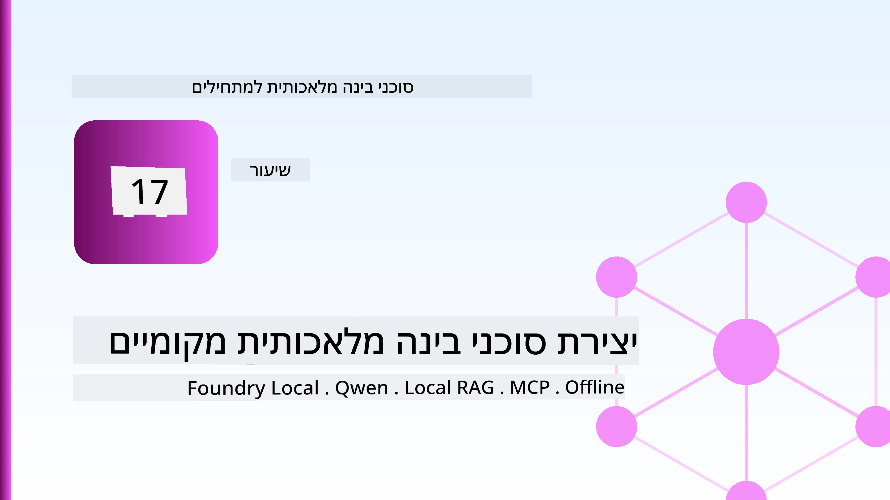
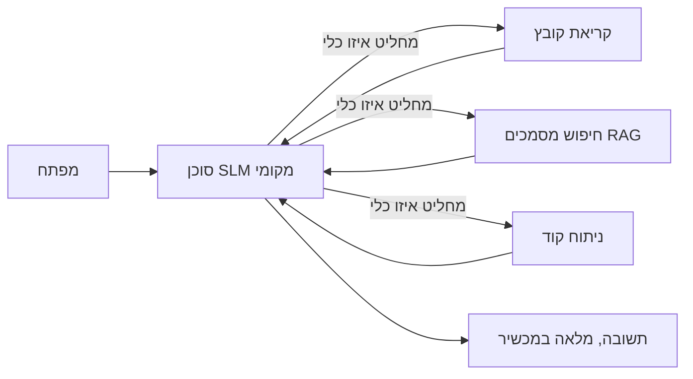
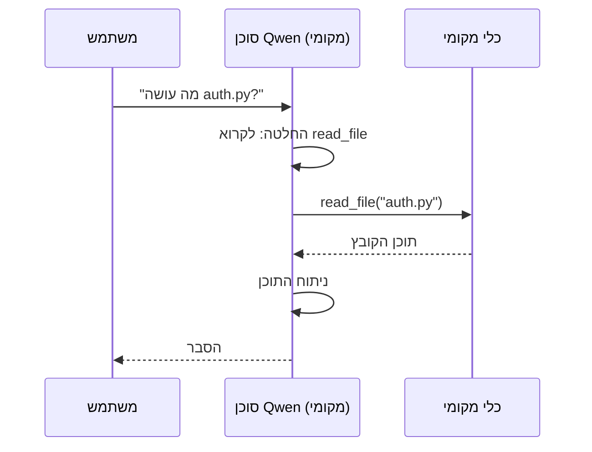
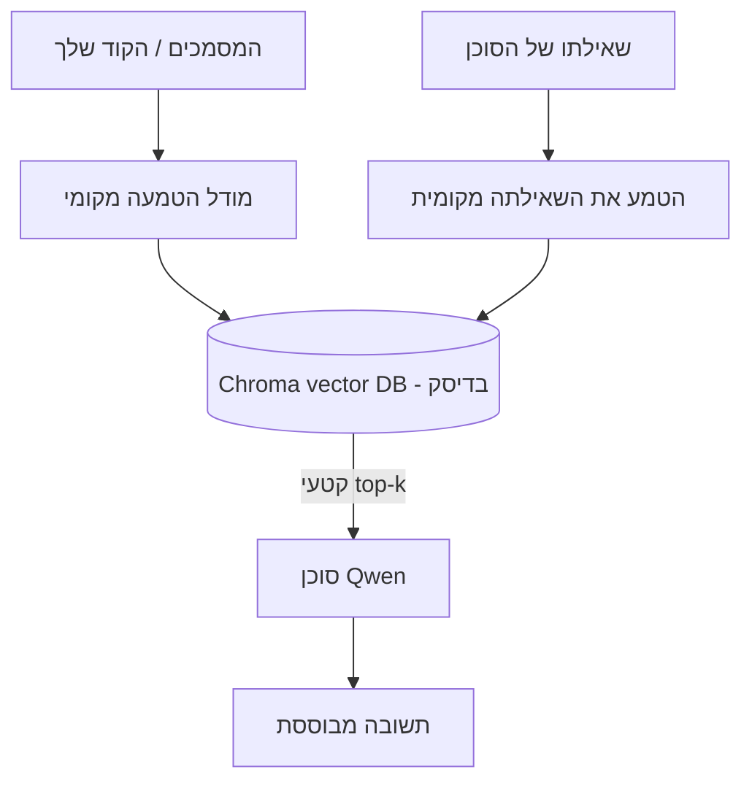
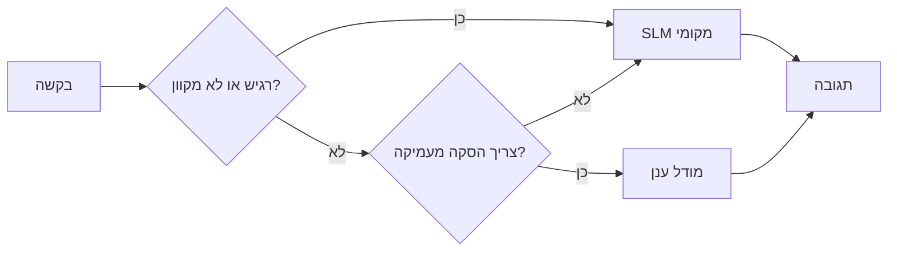

# יצירת סוכני בינה מלאכותית מקומיים באמצעות Microsoft Foundry Local ו-Qwen



השיעור הקודם הגדיל סוכנים *אל* הענן. שיעור זה מביא אותם *למטה* למכונה אחת. בסופו יהיה לך עוזר הנדסי פעיל החושב, קורא כלים, קורא את הקבצים שלך ומחפש בתיעוד שלך — **בלי אפילו קריאה אחת להסקת מסקנות בענן.**

למה תרצה את זה? שלושה סיבות שבאות לידי ביטוי בתדירות גבוהה בעבודה הנדסית אמיתית:

- **פרטיות.** הקוד והמסמכים לא עוזבים אף פעם את המכונה. שום פרומפט, שום קטע קוד, שום נתוני לקוח לא עוברים את גבול הרשת.
- **עלות.** אינפרנס מקומי אין לו חיוב על כל טוקן. אתה יכול לחזור על תהליך כל היום במחיר חשמל בלבד.
- **לא מקוון.** בטיסה, במתקן מאובטח, או בזמן הפסקת חשמל, הסוכן עדיין עובד.

העניין הוא שאתה מחליף מודל ענן מהשורה הראשונה עבור **מודל שפה קטן (SLM)** שרץ על המעבד שלך, כרטיס המסך או מעבד עצבי. שיעור זה עוסק בבניית סוכנים שהם *טובים* במסגרת מגבלה זו במקום להעמיד פנים שהמגבלה אינה קיימת.

## הקדמה

שיעור זה יכסה:

- **מודלי שפה קטנים (SLMs)** — מה הם, היכן הם מצטיינים והיכן לא.
- **Microsoft Foundry Local** — סביבת הרצה שיורדת ומספקת מודלים במכשיר דרך **API תואם OpenAI**.
- **מודלי קריאת פונקציות Qwen** — SLMs שמפיקים קריאות כלים אמינות, מה שהופך סוכנים מקומיים לאפשריים (לא רק צ'אט מקומי).
- **כלים מקומיים, RAG מקומי, ו-MCP מקומי** — נותנים לסוכן יכולות ללא ענן.
- **תבניות משולבות** — מתי לשמור דברים מקומיים ומתי לפנות לענן.

## מטרות למידה

לאחר סיום שיעור זה תדע כיצד:

- להסביר את הפשרות של SLMs ולבחור מקרים מתאימים לשימוש בסוכני בינה מקומיים.
- להפעיל מודל Qwen מקומית באמצעות Foundry Local ולחבר אליו דרך נקודת הקצה התואמת OpenAI.
- לבנות סוכן שמבצע קריאות כלים שרץ לגמרי על תחנת העבודה שלך.
- להוסיף RAG מקומי על מסמכים שלך באמצעות מסד נתונים וקטורי מקומי (Chroma).
- לחבר את הסוכן לשרת MCP מקומי ולנתח עיצובים משולבים של מקומי/ענן.

## דרישות מוקדמות

שיעור זה מניח שסיימת את השיעורים הקודמים ונוח לך עם:

- [שימוש בכלים](../04-tool-use/README.md) (שיעור 4) ו-[Agentic RAG](../05-agentic-rag/README.md) (שיעור 5).
- [פרוטוקולי סוכנים / MCP](../11-agentic-protocols/README.md) (שיעור 11).
- [מסגרת סוכנים של מיקרוסופט](../14-microsoft-agent-framework/README.md) (שיעור 14).

תזדקק גם ל:

- תחנת עבודה למפתח. **8 ג"ב RAM הוא מינימום ריאלי**; 16 ג"ב ומעלה נוח יותר. GPU או NPU עוזרים אך אינם דרושים.
- **Microsoft Foundry Local** מותקן (ראה את סעיף ההתקנה למטה).
- Python 3.12+ והחבילות במאגר [`requirements.txt`](../../../requirements.txt), בנוסף `foundry-local-sdk`, `openai` ו-`chromadb` עבור שיעור זה.

## מודלי שפה קטנים: הכלי המתאים לעבודה מקומית

מודל ענן מהשורה הראשונה כולל מאות מיליארדי פרמטרים ומרכז נתונים מאחוריו. SLM כולל כמה מיליארדי פרמטרים וחייב להיכנס לזיכרון ה-RAM של המחשב הנייד שלך. ההבדל הזה מגדיר ציפיות ברורות.

**SLMs מצטיינים ב:**

- משימות מובנות ומוגבלות — סיווג, חילוץ, סיכום של מסמך ידוע.
- **קריאת כלים** — החלטה איזו פונקציה לקרוא ובאילו ארגומנטים.
- איטרציה מהירה, זולה ופרטית על הנתונים שלך.

**SLMs חלשים ב:**

- הסקה פתוחה ומרובת־קפיצות בהקשר גדול.
- ידע עולמי רחב (הם ראו פחות, ושוכחים יותר).

האסטרטגיה המנצחת לסוכנים מקומיים היא לכן: **תן ל-SLM לארגן, ותן לכלים לבצע את המשימות הכבדות.** המודל לא צריך *לדעת* את בסיס הקוד שלך — הוא צריך לדעת מתי לקרוא ל־`read_file` ומתי ל־`search_docs`. זה מתאים ישירות לחוזקות של SLM.



## Microsoft Foundry Local

**Microsoft Foundry Local** היא סביבת הרצה קלה שיורדת, מנהלת ומספקת מודלים לגמרי על המכונה שלך. התכונה החשובה ביותר עבורנו היא שהיא חושפת **נקודת קצה HTTP תואמת OpenAI** — מה שאומר ש-SDK של OpenAI ולקוח OpenAI במסגרת סוכני Microsoft עובדים איתה עם שינוי בלבד של `base_url`. כל מה שלמדת על בניית סוכנים עובר ישירות; רק נקודת הקצה זזה מהענן ל־`localhost`.

Foundry Local גם בוחרת אוטומטית את הבניה הטובה ביותר של מודל לחומרה שלך — בניית CPU, בניית CUDA/GPU, או בניית NPU — כדי שלא תצטרך לבצע אופטימיזציה ידנית למכונה.

### התקנה

התקן את Foundry Local (ראה את [התיעוד](https://learn.microsoft.com/azure/ai-foundry/foundry-local/) עבור מערכת ההפעלה שלך), ואז בדוק שהוא עובד:

```bash
# התקן (לדוגמה; עקוב אחרי התיעוד עבור הפלטפורמה שלך)
winget install Microsoft.FoundryLocal      # חלונות
# brew install microsoft/foundrylocal/foundrylocal   # macOS

# הורד והפעל מודל Qwen, ואז התחל את השירות המקומי
foundry model run qwen2.5-7b-instruct
foundry service status
```

ברגע שהשירות פועל יש לך נקודת קצה מקומית, תואמת OpenAI (לרוב `http://localhost:PORT/v1`). הפנקס משתמש ב־`foundry-local-sdk` כדי לאתר את נקודת הסיום באופן אוטומטי, כך שלא צריך לקבוע את הפורט בקוד באופן נוקשה.

## קריאת פונקציות Qwen: למה זה חשוב

סוכן הוא סוכן רק אם הוא יכול לקרוא כלים. הרבה SLMs מסוגלים לשוחח אבל מייצרים קריאות כלים לא אמינות ולא תקניות. מודלי **Qwen** מאומנים לקריאה לפונקציות ופולטים מבני קריאות כלים תקניים בעקביות — וזה בדיוק מה שהופך מודל צ'אט מקומי ל־*סוכן* מקומי.

הזרימה היא הלולאה הסטנדרטית של קריאת כלים שאתה כבר מכיר, רק שרצה על המכשיר:



## RAG מקומי

חיפוש בתיעוד הוא המקום שבו סוכנים מקומיים מצדיקים את קיומם. במקום לקוות שה-SLM זכר את התיעוד של המסגרת שלך, אתה משתיל את המסמכים האלה ל**מסד נתונים וקטורי מקומי** ומאפשר לסוכן לאחזר את הקטעים הרלוונטיים לפי דרישה.

אנחנו משתמשים ב**Chroma**, מאגר וקטורי משובץ שרץ בתהליך ללא שרת לניהול. התהליך כולו מקומי: מודל הטמעה מקומי → וקטורים מקומיים → אחזור מקומי → SLM מקומי.



זה אותו תבנית Agentic RAG משיעור 5 — השינוי היחיד שכל רכיב פועל על המכונה שלך.

## שרתי MCP מקומיים

[MCP](../11-agentic-protocols/README.md) הוא פרוטוקול תקשורת, לא שירות ענן. שרת MCP יכול לרוץ כתהליך מקומי ב־`stdio`, וחשוף כלים לסוכן שלך דרך הפרוטוקול הסטנדרטי. זה מאפשר להשתמש מחדש באקו־סיסטם ההולך וגדל של שרתי MCP — גישה למערכת הקבצים, פעולות גיט, שאילתות מסד נתונים — כל זה לגמרי באופליין.

התפקיד האבטחתי שונה מהענן, אך לא נעדר: שרת MCP מקומי עדיין פועל בהרשאות המשתמש שלך, לכן הגבל את מה שהוא יכול לגעת בו (לדוגמה, תיקיית פרויקט בלבד ולא כל ספריית הבית שלך) וטפל ביציאתו כקלט לאימות.

## תבניות משולבות של ענן ומקומי

"מקומי קודם" לא אומר רק מקומי. מערכות בשלות מנתבות לפי רגישות וקושי:

| מצב | איפה זה פועל |
| --- | --- |
| קוד/נתונים רגישים או לא מקוון | **SLM מקומי** |
| משימה פשוטה ומוגבלת | **SLM מקומי** (זול, מהיר) |
| הסקת מסקנות מרובת קפיצות קשה על נתונים לא רגישים | **מודל ענן** |
| הכל בזמן הפסקת שירות | **SLM מקומי** (ירידה איכותית) |

זה משקף את רעיון **ניתוב המודל** משיעור 16 — פרט שאחד ה"מודלים" הוא כעת המכונה שלך. עיצוב חסון חוזר למקומי כשהענן אינו זמין, כך שהסוכן יורד באיכות במקום לכשל לחלוטין.



## מעבדה מעשית: עוזר הנדסי מקומי

פתח [`code_samples/17-local-agent-foundry-local.ipynb`](./code_samples/17-local-agent-foundry-local.ipynb) ועבוד דרכו. תבנה **עוזר הנדסי מקומי** שרץ לגמרי על תחנת העבודה שלך ויכול:

1. **לקרא כלים** — דרך קריאת פונקציות Qwen דרך Foundry Local.
2. **לבצע פעולות קבצים מקומיות** — לרשום ולקרוא קבצים בתיקיית פרויקט.
3. **לנתח קוד** — לדווח מדדים בסיסיים על קובץ מקור.
4. **לחפש בתיעוד** — RAG מקומי על תיקיית תיעוד באמצעות Chroma.
5. **להשתמש ב-MCP** — להתחבר לשרת MCP מקומי (עם דילוג מתחשב אם אינו מוגדר).

לא נעשה שימוש באינפרנס ענן בשום שלב.

### הליכה צעד-אחר-צעד

העוזר מתחבר ל-Foundry Local דרך נקודת קצה תואמת OpenAI, כך שקוד הסוכן כמעט זהה לשיעורי הענן — רק הלקוח משתנה:

```python
from foundry_local import FoundryLocalManager
from openai import OpenAI

# Foundry Local מגלה/מוריד את הדגם ומספק לנו נקודת קצה מקומית.
manager = FoundryLocalManager(\"qwen2.5-7b-instruct\")
client = OpenAI(base_url=manager.endpoint, api_key=manager.api_key)  # api_key הוא מייצג מקומי
```

הכלים הם פונקציות Python רגילות המוגבלות לתיקיית פרויקט:

```python
def read_file(path: str) -> str:
    \"\"\"Read a file, but only inside the sandboxed project directory.\"\"\"
    full = (PROJECT_ROOT / path).resolve()
    if PROJECT_ROOT not in full.parents and full != PROJECT_ROOT:
        return \"Access denied: path is outside the project directory.\"
    return full.read_text(encoding=\"utf-8\")
```

שים לב לבדיקה של הסביבה המבודדת — אפילו במקומי, כלי שקורא נתיבים שרירותיים הוא סיכון. הפנקס שומר שכל כלי מוגבל לשורש פרויקט יחיד.

## בדיקת ידע

בדוק את ההבנה שלך לפני המעבר למשימה.

**1. תן שני סיבות ברורות להפעיל סוכן מקומית במקום בענן.**

<details>
<summary>תשובה</summary>

כל שתיים מ: **פרטיות** (קוד ונתונים לא עוזבים את המכונה), **עלות** (אין חיוב אינפרנס על כל טוקן), ו**יכולת לא מקוונת** (עובד בלי רשת — בטיסה, במתקן מאובטח, או בזמן הפסקת חשמל). מגבלות רגולטוריות/ציות שמונעות שליחת נתונים מחוץ למכשיר הן סיבה נפוצה לפרטיות.
</details>

**2. מה החלוקה המומלצת של העבודה בין SLM לכליו בסוכן מקומי, ולמה?**

<details>
<summary>תשובה</summary>

תן ל-SLM **לארגן** (להחליט איזה כלי לקרוא ובאילו ארגומנטים) ותן ל**כלים לבצע את העבודה הכבדה** (קריאת קבצים, אחזור מסמכים, חישוב תוצאות). SLMs חזקים בהחלטות מוגבלות כמו בחירת כלים אך חלשים בידע רחב ובהסקת מסקנות ארוכת קפיצות, כך שהסתמכות על כלים מנצלת את חוזקותיהם.
</details>

**3. מה מאפשר שימוש מחדש בקוד סוכני ענן עם Foundry Local?**

<details>
<summary>תשובה</summary>

Foundry Local חושפת **נקודת קצה HTTP תואמת OpenAI**. SDK של OpenAI ולקוח OpenAI במסגרת סוכנים עובדים איתה על ידי שינוי רק של `base_url` (ושימוש במפתח API מקומי). כל השאר בקוד הסוכן נשאר זהה.
</details>

**4. למה אנחנו משתמשים במיוחד במודל קריאת פונקציות Qwen ולא בכל SLM?**

<details>
<summary>תשובה</summary>

כי סוכן חייב להפיק קריאות כלים אמינות ותקניות. הרבה SLMs יכולים לשוחח אך מפיקים מבני קריאות כלים שגויים או לא עקביים. מודלי Qwen מאומנים לקריאת פונקציות ומפיקים קריאות כלים עקביות, וזה מה שהופך מודל צ'אט מקומי לסוכן מקומי שעובד.
</details>

**5. באפיק RAG מקומי, אילו רכיבים רצים על המכונה?**

<details>
<summary>תשובה</summary>

כולם: מודל ההטמעה, מסד הנתונים הוקטורי (Chroma, בדיסק), שלב האחזור, ו-SLM. המסמכים מוטמעים מקומית, נשמרים מקומית, מאוחזרים מקומית, ומנותחים באמצעות מודל מקומי — שום רכיב לא נוגע בענן.
</details>

**6. שרת MCP מקומי רץ על המכונה שלך. האם זה הופך אותו אוטומטית לבטוח? איזו זהירות עדיין צריך לנקוט?**

<details>
<summary>תשובה</summary>

לא. שרת MCP מקומי רץ בהרשאות המשתמש שלך, אז הוא יכול לגשת לכל מה שאתה יכול. הגבל אותו למה שהוא צריך (למשל, תיקיית פרויקט יחידה ולא הספרייה הביתית כולה) וטפל ביציאות שלו כקלט לאימות לפני ביצוע.
</details>

**7. תאר חוק ניתוב היברידי הגיוני הכולל מודל מקומי.**

<details>
<summary>תשובה</summary>

נהל בקשות רגישות או לא מקוונות ל-SLM מקומי; נהל משימות פשוטות ומוגבלות ל-SLM מקומי לשם מהירות ועלות; נהל הסקות קשות מרובות קפיצות על נתונים לא רגישים למודל ענן; וחזור ל-SLM מקומי אם הענן אינו זמין כך שהסוכן מתדרדר באיכות בצורה מתחשבת במקום לכשל. זה ניתוב מודלים (שיעור 16) כאשר המכונה המקומית היא אחד המודלים.
</details>

**8. מהו נתון מינימום זיכרון RAM ריאלי להפעלת הסוכן המקומי בשיעור זה, ומה זיכרון נוסף נותן לך?**

<details>
<summary>תשובה</summary>

כ-**8 ג"ב** הוא מינימום ריאלי; 16 ג"ב ומעלה נוח יותר. זיכרון נוסף מאפשר הפעלה של מודלים גדולים ויותר חזקים ושמירת הקשר יותר בזיכרון. GPU או NPU מזרזים אינפרנס אך אינם דרושים — Foundry Local בוחר בניית CPU כשאין מאיץ זמין.
</details>

## משימה

הרחב את העוזר ההנדסי המקומי ל**בוחן תיעוד מקומי** עבור פרויקט קטן לפי בחירתך (השתמש באחת מתיקיות השיעורים במאגר אם תרצה).

ההגשה שלך צריכה:

1. **לאנדקס תיקיית מסמכים/קוד אמיתית** ל-Chroma (לפחות חמישה קבצים).
2. **להוסיף כלי `find_todos`** שסורק את הפרויקט אחר הערות 'TODO'/'FIXME' ומחזיר אותן עם שם הקובץ ומספר השורה — תוך שמירה על הבדיקה הביטחונית כמו ב־`read_file`.

3. **שאל את הסוכן שלוש שאלות** שמכריחות אותו לשלב כלי עבודה: שאלה אחת טהורה של RAG, שאלה אחת שמחייבת קריאת קובץ ספציפי, ושאלה אחת שמחייבת מציאת TODOים.
4. **מדוד את זה**: הזמן כל אחת משלוש התשובות ורשום אותן בתא מרקדאון. הגב אם זמן התגובה מקובל עבור זרימת העבודה המיועדת לך.

לאחר מכן כתוב פסקה קצרה על **מה היית מעביר לענן ומה היית שומר מקומי** עבור הסוקר הזה, ולמה. אתה מוערך האם הרכיבים המקומיים מחוברים נכון והאם החשיבה ההיברידית שלך תקפה — לא על איכות המודל.

## סיכום

בשיעור זה בנית סוכן שפועל כולו על המחשב האישי שלך:

- **SLMs** מחליפים רוחב לטובת פרטיות, עלות ותפעול לא מקוון — ומצטיינים כשהם **מתזמרים כלים** במקום שנושא הכל בעצמם.
- **Foundry Local** משרת מודלים על המכשיר מאחורי **נקודת קצה תואמת OpenAI**, כך שקוד הסוכן שלך לענן עובר עם שינוי של שורה אחת.
- **מודלי קריאה לפונקציות Qwen** מאפשרים קריאה אמינה לכלי מקומי — וכך *סוכנים* מקומיים.
- **RAG מקומי** (Chroma) ו-**MCP מקומי** נותנים לסוכן יכולת מבלי לצאת מהמכשיר.
- **תבניות היברידיות** מאפשרות לך לנתב לפי רגישות וקושי, כאשר מקומי הוא פתרון חלופי אלגנטי.

זה משלים את מחזור הפריסה: שיעור 16 הגדיל את הסוכנים לMicrosoft Foundry, והשיעור הזה מקטין אותם למחשב עבודה יחיד. השיעור הבא עוסק בשמירת הסוכנים המופעלים מאובטחים.

## משאבים נוספים

- <a href="https://learn.microsoft.com/azure/ai-foundry/foundry-local/" target="_blank">תיעוד Microsoft Foundry Local</a>
- <a href="https://learn.microsoft.com/azure/ai-foundry/what-is-azure-ai-foundry" target="_blank">תיעוד Microsoft Foundry</a>
- <a href="https://aka.ms/ai-agents-beginners/agent-framework" target="_blank">מסגרת הסוכנים של Microsoft</a>
- <a href="https://qwen.readthedocs.io/en/latest/framework/function_call.html" target="_blank">תיעוד קריאה לפונקציות של Qwen</a>
- <a href="https://modelcontextprotocol.io/" target="_blank">פרוטוקול הקשר למודל (MCP)</a>
- <a href="https://docs.trychroma.com/" target="_blank">מסד הנתונים וקטורי Chroma</a>

## השיעור הקודם

[פריסת סוכנים מתקדמים](../16-deploying-scalable-agents/README.md)

## השיעור הבא

[אבטחת סוכני בינה מלאכותית](../18-securing-ai-agents/README.md)

---

<!-- CO-OP TRANSLATOR DISCLAIMER START -->
**כתב ויתור**:
מסמך זה תורגם באמצעות שירות תרגום אוטומטי [Co-op Translator](https://github.com/Azure/co-op-translator). למרות שאנו שואפים לדיוק, יש לקחת בחשבון שתרגומים אוטומטיים עלולים להכיל שגיאות או אי-דיוקים. יש להחשיב את המסמך המקורי בשפתו הטבעית כמקור הסמכות. למידע קריטי מומלץ להשתמש בתרגום מקצועי על ידי מתרגם אדם. אנו לא אחראים לכל אי-הבנה או פירוש שגוי הנובע מהשימוש בתרגום זה.
<!-- CO-OP TRANSLATOR DISCLAIMER END -->