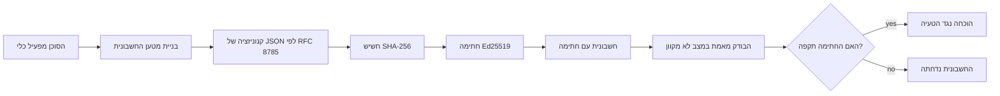
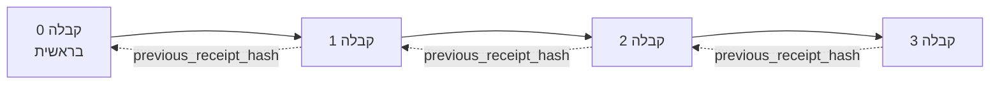

[צפו בסרטון השיעור: אבטחת סוכני AI עם קבלות קריפטוגרפיות](https://youtu.be/PLACEHOLDER_VIDEO_ID)

> _(סרטון השיעור והתמונה המקדימה יתווספו על ידי צוות התוכן של מיקרוסופט לאחר המיזוג, בהתאמה לתבנית של שיעור 14 / 15.)_

# אבטחת סוכני AI עם קבלות קריפטוגרפיות

## מבוא

שיעור זה יכסה:

- מדוע שבילי ביקורת לסוכני AI חשובים לצורך תאימות, איתור באגים ואמון.
- מהי קבלה קריפטוגרפית וכיצד היא שונה משורת לוג לא חתומה.
- כיצד ליצור קבלה חתומה עבור קריאת כלים של סוכן בפייתון פשוט.
- כיצד לאמת קבלה באופן לא מקוון ולגלות זיוף.
- כיצד לקשר בין קבלות כך שהסרת או שינוי סדר של אחת תשבור את השרשרת.
- מה הקבלות מוכיחות ומה הן במפורש אינן מוכיחות.

## יעדים ללמידה

בסיום שיעור זה, תדעו כיצד:

- לזהות את מצבי הכשל המניעים מקוריות קריפטוגרפית לפעולות סוכן.
- ליצור קבלה חתומה Ed25519 מעל מטען JSON קנוני.
- לאמת קבלה באופן עצמאי באמצעות מפתח ציבורי של החותם בלבד.
- לגלות זיוף על ידי הרצת אימות מחדש על קבלה ששונתה.
- לבנות רצף מקושר של קבלות ולהסביר מדוע השרשרת חשובה.
- להבחין בגבול בין מה שהקבלות מוכיחות (אישוש, שלמות, סדר) למה שאינן מוכיחות (נכונות הפעולה, תקפות המדיניות).

## הבעיה: שביל הביקורת של הסוכן שלך

דמיינו שפרסתם סוכן AI עבור Contoso Travel. הסוכן קורא בקשות מלקוחות, מפעיל API לטיסות כדי לאתר אפשרויות, ומזמין מושבים עבור הלקוח. ברבעון הקודם, הסוכן עיבד 50,000 הזמנות.

היום מגיע בוחן. הוא שואל שאלה פשוטה: "הראה לי מה הסוכן שלך עשה."

אתם מוסרים את קבצי הלוג שלכם. הבוחן מסתכל עליהם ושואל שאלה קשה יותר: "איך אני יודע שהלוגים הללו לא נערכו?"

זו הבעיה של שביל ביקורת. רוב הפריסות של סוכנים כיום מסתמכות על:

- **לוגי אפליקציה**: נכתבים על ידי הסוכן עצמו, ניתנים לעריכה על ידי כל מי שיש לו גישה למערכת הקבצים.
- **שירותי לוג בענן**: שובה זיוף ברמת הפלטפורמה אבל רק אם הבוחן סומך על מפעיל הפלטפורמה.
- **לוגים של עסקאות במסד נתונים**: מתאימים לשינויים במסד הנתונים אך לא לקריאות כלים אקראיות.

אף אחד מאלה לא יכול לענות על שאלת הבוחן מבלי לדרוש מהבוחן לסמוך על מישהו (אתם, ספק הענן שלכם, ספק מסד הנתונים שלכם). לשימוש פנימי, האמון הזה לרוב מקובל. לעומסי עבודה מוסדרים (כספים, בריאות, כל דבר ברגולציה תחת חוק ה-AI של האיחוד האירופי), זה לא מקובל.

קבלות קריפטוגרפיות פותרות זאת בכך שכל פעולה של סוכן ניתנת לאימות באופן עצמאי. הבוחן אינו צריך לסמוך עליכם. הוא צריך רק את המפתח הציבורי שלכם ואת הקבלה עצמה.

## מהי קבלה קריפטוגרפית?

קבלה היא אובייקט JSON שמתעד מה סוכן עשה, חתום בחתימה דיגיטלית.



קבלה מינימלית נראית כך:

```json
{
  "type": "agent.tool_call.v1",
  "agent_id": "contoso-travel-bot",
  "tool_name": "lookup_flights",
  "tool_args_hash": "sha256:a3f9c1...",
  "result_hash": "sha256:7b2e1d...",
  "policy_id": "contoso-travel-policy-v3",
  "timestamp": "2026-04-25T14:30:00Z",
  "sequence": 47,
  "previous_receipt_hash": "sha256:9d4e6a...",
  "signature": {
    "alg": "EdDSA",
    "sig": "c5af83...",
    "public_key": "8f3b2c..."
  }
}
```

שלוש תכונות עושות את העבודה:

1. **החתימה**. הקבלה חתומה על ידי שער הסוכן באמצעות מפתח פרטי Ed25519. כל מי שיש לו את המפתח הציבורי המתאים יכול לאמת את החתימה באופן לא מקוון. זיוף בכל שדה מבטל את החתימה.

2. **קידוד קנוני**. לפני החתימה, הקבלה מסודרת לפי סכמת קנוניזציה של JSON (JCS, RFC 8785). זה מבטיח ששני מימושים המייצרים את אותה הקבלה הלוגית מייצרים פלט זהה בדיוק בבייטים. ללא קנוניזציה, סדרות JSON שונות היו מייצרות חתימות שונות על אותו תוכן.

3. **שרשור חשיש**. השדה `previous_receipt_hash` מקשר כל קבלה לזו שקדמה לה. הסרת או שינוי סדר של קבלה שוברים כל קבלה שבאה אחריה. זיוף הופך לגלוי ברמת השרשרת אפילו אם חתימות בודדות עוקפות.

יחד התכונות הללו מספקות שלוש הבטחות:

- **אישוש**: מפתח זה חתם על תוכן זה.
- **שלמות**: התוכן לא שונה מאז החתימה.
- **סדר**: קבלה זו הגיעה אחרי קבלה זו בשרשרת.

## יצירת קבלה בפייתון

אינכם צריכים ספרייה מיוחדת כדי ליצור קבלה. הפונקציות הקריפטוגרפיות זמינות נרחבות והלוגיקה היא כמה עשרות שורות פייתון.

התרגילים המעשיים ב־`code_samples/18-signed-receipts.ipynb` מראים את כל התהליך. הגרסה המסכמת:

```python
import json
import hashlib
import base64
from nacl import signing
from jcs import canonicalize  # JSON קנוני עפ"י RFC 8785

def b64url_nopad(data: bytes) -> str:
    return base64.urlsafe_b64encode(data).decode("ascii").rstrip("=")

def sha256_canonical(obj) -> str:
    """SHA-256 of a Python object's JCS-canonical JSON form."""
    return f"sha256:{hashlib.sha256(canonicalize(obj)).hexdigest()}"

# צור או טען מפתח חתימה (בסביבת ייצור, אחסן במאגר מפתחות)
signing_key = signing.SigningKey.generate()
verify_key = signing_key.verify_key

# בנה את המטען של הקבלה (עדיין ללא חתימה)
tool_args = {"origin": "SYD", "destination": "LAX"}
tool_result = [{"flight": "QF11", "price": 1850, "stops": 0}]

payload = {
    "type": "agent.tool_call.v1",
    "agent_id": "contoso-travel-bot",
    "tool_name": "lookup_flights",
    "tool_args_hash": sha256_canonical(tool_args),
    "result_hash": sha256_canonical(tool_result),
    "policy_id": "contoso-travel-policy-v3",
    "timestamp": "2026-04-25T14:30:00Z",
    "sequence": 0,
    "previous_receipt_hash": None,
}

# בצע קנוניזציה, חשיש, חתום.
canonical_bytes = canonicalize(payload)
message_hash = hashlib.sha256(canonical_bytes).digest()
signature_bytes = signing_key.sign(message_hash).signature

# צרף אובייקט חתימה מובנה.
receipt = {
    **payload,
    "signature": {
        "alg": "EdDSA",
        "sig": b64url_nopad(signature_bytes),
        "public_key": b64url_nopad(bytes(verify_key)),
    },
}
```

זו כל תשתית החתימה. התרגילים במחברת מדגימים כל שלב.

## אימות קבלה וזיהוי זיוף

האימות הוא הפעולה ההפוכה:

```python
import base64
import hashlib
from nacl import signing
from nacl.exceptions import BadSignatureError
from jcs import canonicalize

def b64url_decode(s: str) -> bytes:
    padding = "=" * ((4 - len(s) % 4) % 4)
    return base64.urlsafe_b64decode(s + padding)

def verify_receipt(receipt: dict) -> bool:
    # החתימה היא אובייקט מבנה: {"alg", "sig", "public_key"}.
    sig_obj = receipt.get("signature")
    if not sig_obj or sig_obj.get("alg") != "EdDSA":
        return False

    # להרכיב מחדש את המטען שנחתם בפועל (הכל חוץ מהחתימה).
    payload = {k: v for k, v in receipt.items() if k != "signature"}

    canonical_bytes = canonicalize(payload)
    message_hash = hashlib.sha256(canonical_bytes).digest()

    try:
        verify_key = signing.VerifyKey(b64url_decode(sig_obj["public_key"]))
        verify_key.verify(message_hash, b64url_decode(sig_obj["sig"]))
        return True
    except BadSignatureError:
        return False
```

פונקציה זו מקבלת קבלה ומחזירה `True` אם החתימה תקפה, ו־`False` אחרת. אין קריאת רשת, אין תלות בשירות, אין צורך באמון באף צד שלישי.

כדי לראות את זיהוי הזיוף בפעולה, המחברת מדגימה:

1. יצירת קבלה תקפה ואישור שהיא מאומתת.
2. שינוי בתא אחד של השדה `tool_args_hash`.
3. הרצת אימות מחדש וראיית כשל.

זו הדגמה מעשית שקבלות הן מוליכות לזיוף: כל שינוי, אפילו קטן, שוברים את החתימה.

## שרשור קבלות לסוכנים עם מספר שלבים

קבלה חתומה אחת מגנה על פעולה אחת. שרשרת של קבלות מגנה על רצף פעולות.



כל קבלה מתעדת את החשיש של הקבלה שלפניה. להסיר בשקט את הקבלה השנייה, התוקף יצטרך או:

- לשנות את השדה `previous_receipt_hash` של הקבלה השלישית (שוברת את חתימת הקבלה השלישית), או
- לזייף חתימה חדשה על הקבלה השלישית ששונתה (דורש את המפתח הפרטי של הסוכן).

אם המפתח הפרטי מאוחסן בארון מפתחות חומרתי ואתם מפרסמים את המפתח הציבורי עם כל קבלה, אף אחד מהתקפות הללו אינו אפשרי מבלי להתגלות.

המחברת מראה:

1. בניית שרשרת של שלוש קבלות.
2. אימות שכל `previous_receipt_hash` של כל קבלה מתאים לחשיש האמיתי של הקבלה הקודמת.
3. זיוף בקבלה באמצע וראיית השבירה בשרשרת בדיוק בנקודה זו.

זוהי הדרך שבה יוצרים שביל ביקורת שבוחן חיצוני יכול לאמת מבלי לסמוך עליכם.

## מה הקבלות מוכיחות (ומה הן אינן מוכיחות)

זה החלק החשוב ביותר בשיעור זה. הקבלות עוצמתיות אך העוצמה מוגבלת.

**הקבלות מוכיחות שלושה דברים:**

1. **אישוש**: מפתח מסוים חתם על מטען מסוים.
2. **שלמות**: המטען לא שינה מאז החתימה.
3. **סדר**: קבלה זו הגיעה אחרי קבלה זו בשרשרת החשיש.

**הקבלות אינן מוכיחות:**

1. **נכונות**: שהפעולה של הסוכן הייתה הפעולה הנכונה. ניתן לחתום על קבלה אפילו לתשובה לא נכונה באותה מידה כמו לתשובה נכונה.
2. **ציות למדיניות**: שהמדיניות שצוינה ב־`policy_id` אכן הוערכה, או שהיא הייתה מאפשרת פעולה זו אם הייתה נבדקת. הקבלה מתעדת את מה שטען, לא מה שאכפו.
3. **זהות מעבר למפתח**: הקבלה אומרת "המפתח הזה חתם על התוכן הזה." היא לא אומרת "אדם זה אישר זאת." חיבור מפתח לאדם או ארגון דורש תשתית זהות נפרדת (ספריה, רישום מפתחות ציבוריים וכו').
4. **אמינות הקלטים**: אם הסוכן מקבל פקודה מנופחת ופועל עליה, הקבלה מתעדת את הפעולה באמונה. הקבלות הן אחרי אימות הקלט, לא תחליף לו.

הגבול הזה חשוב משתי סיבות:

- הוא מבהיר עבור מה הקבלות שימושיות: להפוך את התנהגות הסוכן לניתנת לביקורת ומוליכה לזיוף, אפילו מעבר לגבולות ארגוניים.
- הוא מבהיר מהן השכבות הנוספות שאתם עדיין זקוקים להן: אימות קלט (שיעור 6), אכיפת מדיניות (מוזכר בקצרה מטה), ותשתית זהות (מחוץ לתחום השיעור).

טעות נפוצה היא להניח ש"יש לנו קבלות" משמעותו "אנו נשלטים." זה לא נכון. הקבלות הן יסוד. השליטה היא המערכת שבונים מעליהן.

## הוכחת כי אדם אישר את הפעולה המדויקת

סעיף 3 לעיל שווה לסעיף נפרד: קבלה לפעולה אומרת "מפתח זה חתם על תוכן זה," לא "אדם אישר זאת." עבור פעולות בסיכון גבוה (החזרים, מחיקות, העברות כספים), מסגרות שליטה דורשות יותר ויותר את ההצהרה החסרה הזו, והיא ניתנת ליצירה באמצעות אותם פרימיטיבים שבניתם כבר בשיעור זה.

המחברת המשך `code_samples/human-authorization-receipts.ipynb` מוסיפה סוג שני של קבלה, `human.approval.v1`, באותו פורמט כמעטפות של הקבלות בשיעור (מטען מקודד בחתימת Ed25519 על SHA-256 הקנוני שלו, עם אובייקט `signature` מחוץ לבייטים החתומים). מאשר בשם חותם על **הפעולה הקנונית המלאה והמעבד שלה** לפני ביצוע; קבלת הפעולה של הסוכן נושאת את **אותו המעבד של הפעולה** ו־`parent_approval_ref`, החשיש של האישור, בהתאם לאותו קונבנציה של `previous_receipt_hash` בשרשרת שבניתם למעלה. אחת `verify_chain` מבצעת אימות על שני המסמכים תחת **רשימות מפתחות מנעלות נפרדות** (מפתחות המאשרים מול מפתחות הסוכן), כך שנתיב הקוד משותף אבל הרשויות לעולם לא.

התכונה שנוספת בזה, מנוסחת בקפידה: *האדם אישר את הפעולה המדויקת הזו, והסוכן ביצע בדיוק את אותה פעולה שאושרה.* התסריטים של מחברת הבחירה הן מה שעושים את התכונה ריאלית ולא רק מודגשת:

- הקלאסיקות: זיוף, סוכן מבלבל, השמעה מחדש, מפתחות מזויפים משני הצדדים, קלט מעוות;
- **רשות מיושנת**: חתימה שעדיין מאמתת, נדחתה בכל זאת כי גרסת המדיניות השתנתה, מפתח המאשר הוחלף ברשומה מנעולת, או האישור פקע לפני הוצאה לפועל;
- **החלפת מעבד**: קבלת פעולה חתומה כהלכה שמפנה לאישור *אמיתי* שקושר לפעולה קנונית *שונה*.

כל כשל מסרב מסיבה שונה, כך שבוחן שקורא סירוב יכול לדעת אם הרשות התיישנה או שהפעולה שבוצעה השתנתה. הכלל שהמחברת מלמדת: אישור חתום אינו רשות בפני עצמו. הרשות קיימת רק אם שתי הקבלות עדיין מתקשרות לאותה פעולה קנונית בזמן הביצוע. נתיב החתימה המשותפת במחברת Internet-Draft זו שעוקבת אחרי השיעור (`draft-farley-acta-signed-receipts`) הוא התבנית בסטנדרטים לכך.

## הפניות לייצור

קוד הפייתון בשיעור זה מכוון להיות מינימלי כדי שתוכלו לקרוא כל שורה ולהבין בדיוק מה קורה. בייצור יש לכם שתי אפשרויות:

1. **לבנות ישירות על הפרימיטיבים הקריפטוגרפיים.** 50 השורות שראיתם למעלה מספיקות לרבים מהמקרים. PyNaCl (Ed25519) ו־`jcs` (JSON קנוני) הן ספריות מתוחזקות ומבוקרות היטב.

2. **להשתמש בספריית קבלות ייצורית.** מספר פרויקטים פתוחים מיישמים את אותה התבנית עם תכונות נוספות (סיבוב מפתחות, אימות אצווה, הפצת סט JWK, אינטגרציה עם מנועי מדיניות):
   - פורמט הקבלה בשיעור זה עוקב אחרי טיוטת IETF Internet-Draft ([`draft-farley-acta-signed-receipts`](https://datatracker.ietf.org/doc/draft-farley-acta-signed-receipts/), סקירה 02) שנמצא בתהליך תקני, עם סט התאמה משותף ([agent-governance-testvectors](https://github.com/ScopeBlind/agent-governance-testvectors)) שמיישמים עצמאיים מאמתים כדי לקבל פלט קנוני זהה בבייטים.
   - חבילת Microsoft Agent Governance Toolkit משלבת קבלות עם החלטות מדיניות מבוססות Cedar; ראה את הדרכה 33 במאגר לקבלת דוגמה מקצה לקצה.
   - חבילות `protect-mcp` (npm) ו־`@veritasacta/verify` (npm) מספקות מימוש Node לחתימת קבלות ואימות לא מקוון, מיועדות לעטוף כל שרת MCP עם שביל ביקורת מוליך לזיוף, כולל זרימת החזקה־לחתימה שבה פעולה מושהה פולגת קבלת אישור המקושרת למעבד הפעולה (WebAuthn בתהליך שולחני), באותו תבנית קבלת אישור-אנוש שמוזכר למעלה.
   - ערכת פיתוח Python **[nobulex](https://github.com/arian-gogani/nobulex)** (`pip install nobulex`) מספקת את אותו תבנית חתימת Ed25519 + JCS בפייתון עם אינטגרציות ל-LangChain ו-CrewAI, כולל וקטורי בדיקה לחציית אימות ותרשים תאימות שנתרם דרך [OWASP PR #2210](https://github.com/OWASP/CheatSheetSeries/pull/2210).

ההחלטה בין לכתוב לבד לבין להשתמש בספרייה היא כמו ההחלטה בין לכתוב ספריית JWT לבד לבין להשתמש בקיימת ונבדקת: שתיהן סבירות; הספרייה חוסכת זמן ומפחיתה את אזור הביקורת; הגישה מהבסיס מחייבת להבין כל פרימיטיב. שיעור זה מלמד את הנתיב מהבסיס כדי שתהיה לכם יסוד לשתי האפשרויות.

## בדיקת ידע

בדקו את הבנתכם לפני המעבר לתרגיל המעשי.

**1. קבלה חתומה במפתח הפרטי Ed25519 של הסוכן. לבוחן יש רק את המפתח הציבורי. האם הבוחן יכול לאמת את הקבלה באופן לא מקוון?**

<details>
<summary>תשובה</summary>

כן. אימות Ed25519 דורש רק את המפתח הציבורי ואת הבייטים החתומים. אין קריאה לרשת, אין תלות בשירות. זו התכונה שהופכת את הקבלות לשימושיות במצבי ביקורת מנותקים, רב-ארגוניים או בעלי אמון נמוך.
</details>

**2. תוקף משנה את שדה `policy_id` של קבלה כדי לטעון שנוהלה על ידי מדיניות מרחיבה יותר. החתימה הייתה על המטען המקורי. מה קורה במהלך האימות?**

<details>
<summary>תשובה</summary>


האימות נכשל. החתימה חושבה על גבי בתים קנוניים של המטען המקורי; שינוי כל שדה משנה את הבתים הקנוניים, מה שמשנה את הגיבוב SHA-256, מה שהופך את החתימה ללא תקפה. התוקף יצטרך את המפתח הפרטי לייצר חתימה תקפה חדשה, שאין לו.
</details>

**3. מדוע הקבלה כוללת `tool_args_hash` ו-`result_hash` במקום את הפרמטרים והתוצאה הגולמיים?**

<details>
<summary>תשובה</summary>

שני סיבות. ראשית, ייתכן שיש לארכב או לשדר את הקבלה בסביבות שבהן חשיפת התוכן הגולמי (מידע מזהה, נתוני עסק) מהווה בעיה. הגיבוב שומר על הקבלה קטנה ועל התוכן פרטי; המבקר מאשר שהגיבוב תואם עותק המאוחסן בנפרד של התוכן האמיתי. שנית, לגיבובים יש גודל קבוע; קבלה עם גיבובים מוגבלת בגודלה ללא תלות בגודל הקלטים והתוצאות.
</details>

**4. שדה `previous_receipt_hash` מקשר כל קבלה לקודמתה. אם תוקף מוחק בשקט קבלה אחת מאמצע שרשרת, מה הופך ללא חוקי?**

<details>
<summary>תשובה</summary>

כל קבלה שבאה אחרי זו שנמחקה. שדות `previous_receipt_hash` שלהן לא תואמים עוד את השרשרת בפועל (כי הקבלה שהם הפנו אליה כבר לא קיימת, או שהשרשרת מצביעה עכשיו על קודמת שונה). כדי להסתיר את המחיקה, התוקף יצטרך לחתום מחדש על כל הקבלות המאוחרות יותר, דבר שדורש את המפתח הפרטי.
</details>

**5. קבלה מאומתת באופן נקי. האם זה מוכיח שהפעולה של הסוכן הייתה נכונה, תקפה או תואמת למדיניות?**

<details>
<summary>תשובה</summary>

לא. קבלה תקפה מוכיחה שלושה דברים: שיוך (המפתח הזה חתם את התוכן הזה), שלמות (התוכן לא השתנה), וסידור (קבלה זו באה אחרי קבלה אחרת). אינה מוכיחה שהפעולה הייתה נכונה, שהמדיניות בשם `policy_id` הוערכה בפועל, או שהסוכן עקב אחרי כל כלל. הקבלות מאפשרות ביקורת התנהגות סוכן, לא בהכרח נכונה. זו הגבול החשוב ביותר בשיעור.
</details>

## תרגול מעשי

פתח את `code_samples/18-signed-receipts.ipynb` והשלים את כל ארבעת החלקים:

1. **חלק 1**: חתום את הקבלה הראשונה שלך ואמת אותה.
2. **חלק 2**: תערבב את הקבלה וצפה בכשל אימות.
3. **חלק 3**: בנה שרשרת של שלוש קבלות ואמת את שלמות השרשרת.
4. **חלק 4**: החל דפוס זה על סוכן שבנה עם Microsoft Agent Framework: עטוף קריאת כלי בחתימת קבלה, ואז אמת את הקבלה באופן עצמאי.

**אתגר מתיחה 1:** הרחב את סכמת הקבלה בשדה נוסף לבחירתך (למשל, מזהה בקשה למעקב), עדכן את הלוגיקה של החתימה הקנונית לכלול אותו, ואשר שהקבלה עדיין עברה סבוב אימות. לאחר מכן, שנה את השדה אחרי החתימה ואשר כי האימות נכשל. זה מאלץ אותך להבין כיצד כל בית בקידוד הקנוני תורם לחתימה.

**אתגר מתיחה 2:** חשב יחד גיבוב SHA-256 לשתי הקבלות שלך (שרשר את הבתים הקנוניים שלהן בסדר קבוע) והטמע את הרב-גיבוב כתוסף שדה בקבלה שלישית לפני חתימתה. אמת שכל שלוש הקבלות עוברות סבוב. זה יצר הוכחת הכללה חד-שלבית: כל מי שמחזיק בקבלה השלישית יכול להוכיח ששתיהן הראשונות התקיימו בזמן חתימתה, בלי צורך לגלות את תוכנם. זהו הדפוס שקבלות גילוי סלקטיבי משתמשות בו בקנה מידה (התחייבויות מרקל, RFC 6962).

## סיכום

קבלות קריפטוגרפיות נותנות לסוכני AI מסלול ביקורת שהוא:

- **ניתן לאימות עצמאי**: כל צד שמחזיק במפתח הציבורי יכול לאמת, ללא תלות בשירות.
- **ברור לזיופים**: כל שינוי מבטל את החתימה.
- **נייד**: הקבלה היא קובץ JSON קטן; ניתן לארכב, לשדר ולאמת בכל מקום.
- **מתואם עם תקנים**: מבוסס על Ed25519 (RFC 8032), JCS (RFC 8785), ו-SHA-256, כולם פרימיטיבים נפוצים.

הם אינם תחליף לאימות קלט, לאכיפת מדיניות או לתשתית זהויות. הם בסיס לשכבות אלה. כאשר מפעילים סוכנים בסביבות מבוקרות, תהליכי עבודה בין-ארגוניים או כל סביבת בה לא ניתן להניח שמבקר עתידי ייתן אמון, הקבלות הן האופן בו עושים את מסלול הבדיקה הוגן.

ההבחנה החשובה ביותר: הקבלות מוכיחות מי אמר מה, ומתי. הן לא מוכיחות שמה שנאמר היה נכון או מדויק. שמור על הבחנה זו בקפידה. זה ההבדל בין מערכת שייכות כנה ומערכת מטעה.

## רשימת בדיקה לפרודקשן

כשאתה מוכן לעבור מהשיעור לפריסה של סוכנים שחתומים על קבלות בסביבה אמיתית:

- [ ] **העבר את מפתח החתימה מהלפטופ של המפתח.** השתמש ב-Azure Key Vault, AWS KMS, או מודול אבטחה חומרתי. מפתח פרטי החתימה על הקבלות חייב לעולם לא להימצא בבקרת מקור או טקסט נקי על מכונות ההפעלה.
- [ ] **פרסם את מפתח האימות הציבורי.** מבקרים צריכים אותו לאימות אופליין. דפוס סטנדרטי הוא מערך JWK בכתובת URL ידועה (RFC 7517), למשל `https://your-org.example.com/.well-known/agent-keys.json`.
- [ ] **עגן את השרשרת חיצונית.** כתוב מדי תקופה את גיבוב ראש השרשרת ללוג שקיפות (Sigstore Rekor, RFC 3161 timestamp authority, או מערכת פנימית שנייה) כדי שצד חיצוני יוכל לאשר "שהשרשרת התקיימה בזמן זה."
- [ ] **אחסן קבלות בצורה בלתי משתנה.** אחסון בלוב קיים בלבד (Azure Storage עם מדיניות אי-שינוי, AWS S3 Object Lock) מונע ממשתמש פנימי לשכתב היסטוריה בשכבת האחסון.
- [ ] **החלט על מדיניות שימור.** תקנות רבות דורשות שימור למספר שנים. תכנן את גדילת הקבלות (כל קבלה היא כ-500 בתים; סוכן שעושה 10,000 קריאות ביום מייצר כ-1.8 גיגה לשנה).
- [ ] **תעד מה הקבלות לא מכסות.** הקבלות מוכיחות שיוך, שלמות וסדר. ספר הריצות שלך צריך לציין במפורש אילו בקרות נוספות (אימות קלט, אכיפת מדיניות, הגבלת קצב, תשתית זהויות) נמצאות לצד הקבלות במצב הממשל שלך.

### יש שאלות נוספות על אבטחת סוכני AI?

הצטרף ל-[Microsoft Foundry Discord](https://aka.ms/ai-agents/discord) כדי לפגוש לומדים אחרים, להשתתף במשרדי שעות, ולקבל תשובות לשאלותיך על סוכני AI.

## מעבר לשיעור זה

שיעור זה מכסה חתימת קבלה יחידה ורצפים בשרשרת גיבוב. אותם פרימיטיבים מרכיבים כמה דפוסים מתקדמים יותר שתיתקל בהם ככל שמדיניות הממשל שלך מתפתחת:

- **גילוי סלקטיבי.** כאשר שדות הקבלה מחויבים באופן עצמאי (עץ מרקל בסגנון RFC 6962), ניתן לחשוף שדות מסוימים למבקרים מסוימים ולהוכיח שהשאר לא השתנו מבלי לחשוף אותם. שימושי כאשר אותה קבלה צריכה לעמוד הן בביקורת מקיפה (שדורשת שלמות) והן בתקנות מזעור נתונים כמו GDPR (שדורשות שהמבקר יראה כמה שפחות).
- **ביטול קבלה.** אם מפתח חתימה חשוף, יש צורך לסמן כל קבלה שחתומה במפתח זה כלא מהימנה מנקודת זמן מסוימת והלאה. דפוסים סטנדרטיים: מפתחות חתימה בעלי תוחלת קצרה עם רשימת ביטול מפורסמת, או לוג שקיפות עם רשומות ביטול.
- **קבלות חתימה דו-צדדית / מפוצלת.** חלק מיישומים מפצלים את המטען החתום לשני חלקים — לפני ביצוע (`authorization_*`) ואחרי ביצוע (`result_*`) עם חתימות עצמאיות, שימושי כאשר החלטת האישור והתוצאה הנצפית מיוצרים על ידי שחקנים שונים או בזמנים שונים. זה נבנה מעל לפורמט הקבלה שנלמד בשיעור זה.
- **הרכב מטען.** קבלה חותמת את כל הבתים שאתה שם ב-`result_hash`. מטענים אמיתיים לעיתים עשירים יותר מתוצאה של קריאת כלי יחידה: נימוקים לפני החלטה (תחזיות מודל, אפשרויות שנשקלו, ראיות ושלמותן, סיכון, שרשרת אחריות, תוצאה של שער) יכולים להתקיים כולם בתוך המטען, שמוחתם בקבלה אחת. זה משאיר את פורמט הקבלה מינימלי תוך מתן גמישות להתפתחות סכמות מטען לפי תחום.
- **התאמה בין יישומים שונים.** יישומים עצמאיים רבים של אותו פורמט קבלה (פייתון, TypeScript, Rust, Go) מבצעים אימות צולב נגד וקטורי בדיקה משותפים. אם אתה בונה יישום משלך, אימות מול וקטורי בדיקה מפורסמים מאשר תאימות בכבל.
- **מעבר לפוסט-קוואנטום.** Ed25519 משמש נפוץ כיום אך אינו עמיד לקוואנטום. פורמט הקבלה גמיש אלגוריתמית: שדה `signature.alg` יכול לשאת `ML-DSA-65` (תקן החתימה הפוסט-קוואנטום של NIST) כשצריך לעבור. תכנן תקופת מעבר שבה הקבלות חתומות כפול.

## משאבים נוספים

- <a href="https://datatracker.ietf.org/doc/draft-farley-acta-signed-receipts/" target="_blank">טיוטת IETF: קבלות החלטה חתומות לשליטה במכונה-למכונה</a>
- <a href="https://learn.microsoft.com/azure/ai-studio/responsible-use-of-ai-overview" target="_blank">סקירה של שימוש אחראי ב-AI (Azure AI)</a>
- <a href="https://datatracker.ietf.org/doc/html/rfc8032" target="_blank">RFC 8032: אלגוריתם חתימה דיגיטלית על עקומת אדוארדס (EdDSA)</a>
- <a href="https://datatracker.ietf.org/doc/html/rfc8785" target="_blank">RFC 8785: סכמת קנוניזציה ל-JSON (JCS)</a>
- <a href="https://datatracker.ietf.org/doc/html/rfc6962" target="_blank">RFC 6962: שקיפות תעודות</a> (בניית עץ מרקל המשמשת בקבלות גילוי סלקטיבי)
- <a href="https://github.com/microsoft/agent-governance-toolkit/blob/main/docs/tutorials/33-offline-verifiable-receipts.md" target="_blank">ערכת כלים לממשל סוכנים של מיקרוסופט, מדריך 33: קבלות החלטה שניתן לאמתן אופליין</a>
- <a href="https://github.com/ScopeBlind/agent-governance-testvectors" target="_blank">וקטורי בדיקה להתאמה בין יישומים</a> עבור פורמט הקבלה הנלמד בשיעור זה (Apache-2.0)
- <a href="https://pynacl.readthedocs.io/" target="_blank">תיעוד PyNaCl</a> (Ed25519 בפייתון)

## השיעור הקודם

[יצירת סוכני AI מקומיים](../17-creating-local-ai-agents/README.md)

---

<!-- CO-OP TRANSLATOR DISCLAIMER START -->
**כתב ויתור**:
מסמך זה תורגם באמצעות שירות תרגום אוטומטי [Co-op Translator](https://github.com/Azure/co-op-translator). למרות שאנו שואפים לדיוק, יש לקחת בחשבון שתרגומים אוטומטיים עלולים להכיל שגיאות או אי-דיוקים. יש להחשיב את המסמך המקורי בשפתו הטבעית כמקור הסמכות. למידע קריטי מומלץ להשתמש בתרגום מקצועי על ידי מתרגם אדם. אנו לא אחראים לכל אי-הבנה או פירוש שגוי הנובע מהשימוש בתרגום זה.
<!-- CO-OP TRANSLATOR DISCLAIMER END -->