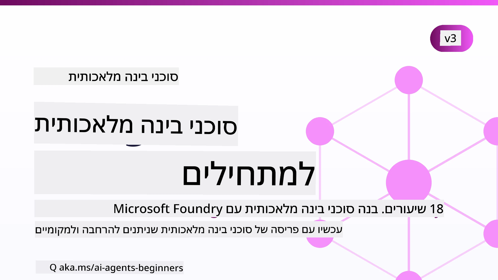

# סוכני בינה מלאכותית למתחילים - קורס



## קורס המלמד את כל מה שצריך לדעת כדי להתחיל לבנות סוכני בינה מלאכותית

[](https://github.com/microsoft/ai-agents-for-beginners/blob/master/LICENSE?WT.mc_id=academic-105485-koreyst)
[](https://GitHub.com/microsoft/ai-agents-for-beginners/graphs/contributors/?WT.mc_id=academic-105485-koreyst)
[](https://GitHub.com/microsoft/ai-agents-for-beginners/issues/?WT.mc_id=academic-105485-koreyst)
[](https://GitHub.com/microsoft/ai-agents-for-beginners/pulls/?WT.mc_id=academic-105485-koreyst)
[](http://makeapullrequest.com?WT.mc_id=academic-105485-koreyst)

### 🌐 תמיכה רב-לשונית

#### נתמך באמצעות פעולה ב-GitHub (מאוטומט ועדכני תמיד)

<!-- CO-OP TRANSLATOR LANGUAGES TABLE START -->
[ערבית](../ar/README.md) | [בנגלית](../bn/README.md) | [בולגרית](../bg/README.md) | [בורמזית (מיאנמר)](../my/README.md) | [סינית (מפושטת)](../zh-CN/README.md) | [סינית (מסורתית, הונג קונג)](../zh-HK/README.md) | [סינית (מסורתית, מקאו)](../zh-MO/README.md) | [סינית (מסורתית, טייוואן)](../zh-TW/README.md) | [קרואטית](../hr/README.md) | [צ'כית](../cs/README.md) | [דנית](../da/README.md) | [הולנדית](../nl/README.md) | [אסטונית](../et/README.md) | [פינית](../fi/README.md) | [צרפתית](../fr/README.md) | [גרמנית](../de/README.md) | [יוונית](../el/README.md) | [עברית](./README.md) | [הינדי](../hi/README.md) | [הונגרית](../hu/README.md) | [אינדונזית](../id/README.md) | [איטלקית](../it/README.md) | [יפנית](../ja/README.md) | [קאנדה](../kn/README.md) | [חמרית](../km/README.md) | [קוריאנית](../ko/README.md) | [ליטאית](../lt/README.md) | [מלאית](../ms/README.md) | [מלאיאלאם](../ml/README.md) | [מרתהית](../mr/README.md) | [נפאלית](../ne/README.md) | [פידג'ין ניגריאנית](../pcm/README.md) | [נורווגית](../no/README.md) | [פרסית (פרסי)](../fa/README.md) | [פולנית](../pl/README.md) | [פורטוגזית (ברזיל)](../pt-BR/README.md) | [פורטוגזית (פורטוגל)](../pt-PT/README.md) | [פונג'בית (גורמוכי)](../pa/README.md) | [רומנית](../ro/README.md) | [רוסית](../ru/README.md) | [סרבית (קירילית)](../sr/README.md) | [סלובקית](../sk/README.md) | [סלובנית](../sl/README.md) | [ספרדית](../es/README.md) | [סווהילי](../sw/README.md) | [שוודית](../sv/README.md) | [טגלוג (פיליפינית)](../tl/README.md) | [טמילית](../ta/README.md) | [טלאגו](../te/README.md) | [תאית](../th/README.md) | [טורקית](../tr/README.md) | [אוקראינית](../uk/README.md) | [אורדו](../ur/README.md) | [וייטנאמית](../vi/README.md)

> **מעוניינים לשכפל מקומית?**
>
> מאגר זה כולל מעל ל-50 תרגומים בשפות שונות, מה שמגדיל משמעותית את גודל ההורדה. כדי לשכפל ללא תרגומים, השתמשו בבדיקה סלקטיבית:
>
> **Bash / macOS / Linux:**
> ```bash
> git clone --filter=blob:none --sparse https://github.com/microsoft/ai-agents-for-beginners.git
> cd ai-agents-for-beginners
> git sparse-checkout set --no-cone '/*' '!translations' '!translated_images'
> ```
>
> **CMD (Windows):**
> ```cmd
> git clone --filter=blob:none --sparse https://github.com/microsoft/ai-agents-for-beginners.git
> cd ai-agents-for-beginners
> git sparse-checkout set --no-cone "/*" "!translations" "!translated_images"
> ```
>
> זה ייתן לכם את כל מה שצריך לסיים את הקורס עם הורדה הרבה יותר מהירה.
<!-- CO-OP TRANSLATOR LANGUAGES TABLE END -->

**אם תרצו שיתמכו בשפות תרגום נוספות, הן רשומות [כאן](https://github.com/Azure/co-op-translator/blob/main/getting_started/supported-languages.md).**

[](https://GitHub.com/microsoft/ai-agents-for-beginners/watchers/?WT.mc_id=academic-105485-koreyst)
[](https://GitHub.com/microsoft/ai-agents-for-beginners/network/?WT.mc_id=academic-105485-koreyst)
[](https://GitHub.com/microsoft/ai-agents-for-beginners/stargazers/?WT.mc_id=academic-105485-koreyst)

[](https://discord.com/invite/ATgtXmAS5D)


## 🌱 להתחלה

הקורס כולל שיעורים המכסים את יסודות בניית סוכני בינה מלאכותית. כל שיעור עוסק בנושא שלו, אז התחילו איפה שאתם רוצים!

יש תמיכה רב-לשונית לקורס זה. עברו ל[השפות הזמינות כאן](#-multi-language-support). 

אם זו הפעם הראשונה שלכם בעבודה עם מודלים של בינה מלאכותית יוצרת, בדקו את קורס [בינה מלאכותית יוצרת למתחילים](https://aka.ms/genai-beginners), הכולל 21 שיעורים על בנייה עם GenAI.

אל תשכחו [לסמן בכוכב (🌟) את המאגר הזה](https://docs.github.com/en/get-started/exploring-projects-on-github/saving-repositories-with-stars?WT.mc_id=academic-105485-koreyst) ו[לעשות מזלג למאגר זה](https://github.com/microsoft/ai-agents-for-beginners/fork) כדי להריץ את הקוד.

### פגשו לומדים אחרים, קבלו תשובות לשאלותכם

אם נתקעתם או יש לכם שאלות לגבי בניית סוכני בינה מלאכותית, הצטרפו לערוץ הדיסקורד המוקדש שלנו ב[Microsoft Foundry Discord](https://aka.ms/ai-agents/discord).

### מה אתם צריכים

כל שיעור בקורס כולל דוגמאות קוד, שנמצאות בתיקיית code_samples. תוכלו [לעשות מזלג למאגר הזה](https://github.com/microsoft/ai-agents-for-beginners/fork) כדי ליצור עותק משלכם.  

דוגמאות הקוד בתרגילים אלה משתמשות במסגרת סוכנים של מיקרוסופט עם שירות סוכני Microsoft Foundry V2:

- [Microsoft Foundry](https://aka.ms/ai-agents-beginners/ai-foundry) - דרוש חשבון Azure

קורס זה משתמש במסגרת ושירותים של סוכני בינה מלאכותית מ-Microsoft:

- [Microsoft Agent Framework (MAF)](https://aka.ms/ai-agents-beginners/agent-framework)
- [Microsoft Foundry Agent Service V2](https://aka.ms/ai-agents-beginners/ai-agent-service)

חלק מדוגמאות הקוד תומכות גם בספקים אלטרנטיביים תואמי OpenAI כגון [MiniMax](https://platform.minimaxi.com/), המציעים מודלים עם הקשר גדול (עד 204K טוקנים). ראו את [הגדרת הקורס](./00-course-setup/README.md) לפרטי ההגדרה.

למידע נוסף על הרצת הקוד לקורס זה, עברו ל[הגדרת הקורס](./00-course-setup/README.md).

## 🙏 רוצים לעזור?

יש לכם הצעות או מצאתם טעויות איות או קוד? [הגישו בעיה](https://github.com/microsoft/ai-agents-for-beginners/issues?WT.mc_id=academic-105485-koreyst) או [צרו בקשת משיכה](https://github.com/microsoft/ai-agents-for-beginners/pulls?WT.mc_id=academic-105485-koreyst)


## 📂 כל שיעור כולל

- שיעור כתוב הממוקם בקובץ README ווידאו קצר
- דוגמאות קוד בפייתון המשתמשות במסגרת סוכני מיקרוסופט עם Microsoft Foundry
- קישורים למשאבים נוספים להמשך הלמידה


## 🗃️ שיעורים

| **שיעור**                                  | **טקסט וקוד**                                   | **וידאו**                                                  | **למידה נוספת**                                                                       |
|----------------------------------------------|-------------------------------------------------|------------------------------------------------------------|----------------------------------------------------------------------------------------|
| מבוא לסוכני בינה מלאכותית ושימושי סוכן      | [קישור](./01-intro-to-ai-agents/README.md)       | [וידאו](https://youtu.be/3zgm60bXmQk?si=z8QygFvYQv-9WtO1)  | [קישור](https://aka.ms/ai-agents-beginners/collection?WT.mc_id=academic-105485-koreyst) |
| חקירת מסגרות סוכנים                        | [קישור](./02-explore-agentic-frameworks/README.md) | [וידאו](https://youtu.be/ODwF-EZo_O8?si=Vawth4hzVaHv-u0H)  | [קישור](https://aka.ms/ai-agents-beginners/collection?WT.mc_id=academic-105485-koreyst) |
| הבנת תבניות עיצוב סוכנים                   | [קישור](./03-agentic-design-patterns/README.md)  | [וידאו](https://youtu.be/m9lM8qqoOEA?si=BIzHwzstTPL8o9GF)  | [קישור](https://aka.ms/ai-agents-beginners/collection?WT.mc_id=academic-105485-koreyst) |
| תבנית עיצוב לשימוש בכלי                     | [קישור](./04-tool-use/README.md)                  | [וידאו](https://youtu.be/vieRiPRx-gI?si=2z6O2Xu2cu_Jz46N)  | [קישור](https://aka.ms/ai-agents-beginners/collection?WT.mc_id=academic-105485-koreyst) |
| RAG סוכן                                    | [קישור](./05-agentic-rag/README.md)               | [וידאו](https://youtu.be/WcjAARvdL7I?si=gKPWsQpKiIlDH9A3)  | [קישור](https://aka.ms/ai-agents-beginners/collection?WT.mc_id=academic-105485-koreyst) |
| בניית סוכני בינה מלאכותית אמינים           | [קישור](./06-building-trustworthy-agents/README.md) | [וידאו](https://youtu.be/iZKkMEGBCUQ?si=jZjpiMnGFOE9L8OK ) | [קישור](https://aka.ms/ai-agents-beginners/collection?WT.mc_id=academic-105485-koreyst) |
| תבנית עיצוב לתכנון                         | [קישור](./07-planning-design/README.md)           | [וידאו](https://youtu.be/kPfJ2BrBCMY?si=6SC_iv_E5-mzucnC)  | [קישור](https://aka.ms/ai-agents-beginners/collection?WT.mc_id=academic-105485-koreyst) |
| תבנית עיצוב רב-סוכני                       | [קישור](./08-multi-agent/README.md)               | [וידאו](https://youtu.be/V6HpE9hZEx0?si=rMgDhEu7wXo2uo6g)  | [קישור](https://aka.ms/ai-agents-beginners/collection?WT.mc_id=academic-105485-koreyst) |

| תבנית עיצוב מטה-קוגניציה                     | [Link](./09-metacognition/README.md)               | [וידאו](https://youtu.be/His9R6gw6Ec?si=8gck6vvdSNCt6OcF)  | [קישור](https://aka.ms/ai-agents-beginners/collection?WT.mc_id=academic-105485-koreyst) |
| סוכני AI בפרודקשן                          | [Link](./10-ai-agents-production/README.md)        | [וידאו](https://youtu.be/l4TP6IyJxmQ?si=31dnhexRo6yLRJDl)  | [קישור](https://aka.ms/ai-agents-beginners/collection?WT.mc_id=academic-105485-koreyst) |
| שימוש בפרוטוקולי סוכנים (MCP, A2A ו-NLWeb) | [Link](./11-agentic-protocols/README.md)           | [וידאו](https://youtu.be/X-Dh9R3Opn8)                                 | [קישור](https://aka.ms/ai-agents-beginners/collection?WT.mc_id=academic-105485-koreyst) |
| הנדסת הקשר לסוכני AI                       | [Link](./12-context-engineering/README.md)         | [וידאו](https://youtu.be/F5zqRV7gEag)                                 | [קישור](https://aka.ms/ai-agents-beginners/collection?WT.mc_id=academic-105485-koreyst) |
| ניהול זיכרון סוכנים                       | [Link](./13-agent-memory/README.md)     |      [וידאו](https://youtu.be/QrYbHesIxpw?si=vZkVwKrQ4ieCcIPx)                                                      |                                                                                        |
| חקר מסגרת הסוכן של מיקרוסופט              | [Link](./14-microsoft-agent-framework/README.md)                            |                                                            |                                                                                        |
| בניית סוכני שימוש במחשב (CUA)               | [Link](./15-browser-use/README.md)     |                                                            | [קישור](https://docs.browser-use.com/examples/templates/playwright-integration)         |
| פריסת סוכנים מדרגיים                      | [Link](./16-deploying-scalable-agents/README.md) |                                                    | [קישור](https://learn.microsoft.com/azure/ai-foundry/agents/overview)                   |
| יצירת סוכני AI מקומיים                     | [Link](./17-creating-local-ai-agents/README.md)  |                                                    | [קישור](https://learn.microsoft.com/azure/ai-foundry/foundry-local/)                    |
| אבטחת סוכני AI                             | [Link](./18-securing-ai-agents/README.md)  |                                                            | [קישור](https://aka.ms/ai-agents-beginners/collection?WT.mc_id=academic-105485-koreyst) |

## 🎒 קורסים נוספים

הצוות שלנו מייצר קורסים נוספים! בדקו את:

<!-- CO-OP TRANSLATOR OTHER COURSES START -->
### LangChain
[](https://aka.ms/langchain4j-for-beginners)
[](https://aka.ms/langchainjs-for-beginners?WT.mc_id=m365-94501-dwahlin)
[](https://github.com/microsoft/langchain-for-beginners?WT.mc_id=m365-94501-dwahlin)
---

### Azure / Edge / MCP / סוכנים
[](https://github.com/microsoft/AZD-for-beginners?WT.mc_id=academic-105485-koreyst)
[](https://github.com/microsoft/edgeai-for-beginners?WT.mc_id=academic-105485-koreyst)
[](https://github.com/microsoft/mcp-for-beginners?WT.mc_id=academic-105485-koreyst)
[](https://github.com/microsoft/ai-agents-for-beginners?WT.mc_id=academic-105485-koreyst)

---
 
### סדרת AI גנרטיבי
[](https://github.com/microsoft/generative-ai-for-beginners?WT.mc_id=academic-105485-koreyst)
[-9333EA?style=for-the-badge&labelColor=E5E7EB&color=9333EA)](https://github.com/microsoft/Generative-AI-for-beginners-dotnet?WT.mc_id=academic-105485-koreyst)
[-C084FC?style=for-the-badge&labelColor=E5E7EB&color=C084FC)](https://github.com/microsoft/generative-ai-for-beginners-java?WT.mc_id=academic-105485-koreyst)
[-E879F9?style=for-the-badge&labelColor=E5E7EB&color=E879F9)](https://github.com/microsoft/generative-ai-with-javascript?WT.mc_id=academic-105485-koreyst)

---
 
### למידה עיקרית
[](https://aka.ms/ml-beginners?WT.mc_id=academic-105485-koreyst)
[](https://aka.ms/datascience-beginners?WT.mc_id=academic-105485-koreyst)
[](https://aka.ms/ai-beginners?WT.mc_id=academic-105485-koreyst)
[](https://github.com/microsoft/Security-101?WT.mc_id=academic-96948-sayoung)
[](https://aka.ms/webdev-beginners?WT.mc_id=academic-105485-koreyst)
[](https://aka.ms/iot-beginners?WT.mc_id=academic-105485-koreyst)
[](https://github.com/microsoft/xr-development-for-beginners?WT.mc_id=academic-105485-koreyst)

---
 
### סדרת Copilot
[](https://aka.ms/GitHubCopilotAI?WT.mc_id=academic-105485-koreyst)
[](https://github.com/microsoft/mastering-github-copilot-for-dotnet-csharp-developers?WT.mc_id=academic-105485-koreyst)
[](https://github.com/microsoft/CopilotAdventures?WT.mc_id=academic-105485-koreyst)
<!-- CO-OP TRANSLATOR OTHER COURSES END -->

## 🌟 תודה לקהילה

תודה ל-[שיבאם גויאל](https://www.linkedin.com/in/shivam2003/) על שתרם דוגמאות קוד חשובות המדגימות Agentic RAG.

## תרומה

פרויקט זה מקבל בברכה תרומות והצעות. רוב התרומות דורשות שתסכים ל
הסכם רישיון תורם (CLA) שמצהיר שיש לך את הזכות, ושאתה אכן מאפשר לנו
להשתמש בתרומתך. לפרטים בקר בכתובת <https://cla.opensource.microsoft.com>.

כשאתה שולח בקשת משיכה, בוט ה-CLA יזהה אוטומטית אם אתה צריך לספק
CLA ויעניק לבקשה את הסימונים המתאימים (למשל, בדיקת סטטוס, תגובה). פשוט עקוב אחרי ההוראות
שמספק הבוט. תצטרך לעשות זאת רק פעם אחת בכל הרפוזיטוריות שמשתמשות ב-CLA שלנו.

פרויקט זה אימץ את [קוד ההתנהגות לקוד פתוח של מיקרוסופט](https://opensource.microsoft.com/codeofconduct/).
למידע נוסף ראו את [שאלות נפוצות על קוד ההתנהגות](https://opensource.microsoft.com/codeofconduct/faq/) או
פנה ל-[opencode@microsoft.com](mailto:opencode@microsoft.com) עם שאלות או הערות נוספות.

## סימני מסחר

פרויקט זה עשוי לכלול סימני מסחר או לוגואים של פרויקטים, מוצרים או שירותים. שימוש מורשה בסימני המסחר או הלוגואים של מיקרוסופט
כפוף וצריך לעמוד ב
[הנחיות סימני המסחר והמוצרים של מיקרוסופט](https://www.microsoft.com/legal/intellectualproperty/trademarks/usage/general).
שימוש בסימני המסחר או בלוגואים של מיקרוסופט בגרסאות ממודרות של הפרויקט הזה לא יגרום לבלבול או ירמז על חסות מיקרוסופט.
כל שימוש בסימני מסחר או לוגואים של צדדים שלישיים כפוף למדיניות של אותם צדדים.

## קבלת סיוע


אם נתקעת או יש לך שאלות על בניית אפליקציות AI, הצטרף ל:

[](https://aka.ms/foundry/discord)

אם יש לך משוב מוצר או דווח על שגיאות בעת בנייה, בקר ב:

[](https://aka.ms/foundry/forum)

---

<!-- CO-OP TRANSLATOR DISCLAIMER START -->
**כתב ויתור**:
מסמך זה תורגם באמצעות שירות תרגום אוטומטי [Co-op Translator](https://github.com/Azure/co-op-translator). למרות שאנו שואפים לדיוק, יש לקחת בחשבון שתרגומים אוטומטיים עלולים להכיל שגיאות או אי-דיוקים. יש להחשיב את המסמך המקורי בשפתו הטבעית כמקור הסמכות. למידע קריטי מומלץ להשתמש בתרגום מקצועי על ידי מתרגם אדם. אנו לא אחראים לכל אי-הבנה או פירוש שגוי הנובע מהשימוש בתרגום זה.
<!-- CO-OP TRANSLATOR DISCLAIMER END -->