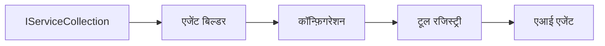

# 🎨 Azure OpenAI (Responses API) के साथ Agentic डिज़ाइन पैटर्न (.NET)

## 📋 सीखने के उद्देश्य

यह उदाहरण .NET में Microsoft Agent Framework के साथ Azure OpenAI (Responses API) एकीकरण का उपयोग करके बुद्धिमान एजेंट बनाने के लिए उद्यम-ग्रेड डिज़ाइन पैटर्न दर्शाता है। आप उन पेशेवर पैटर्न और वास्तुशिल्प दृष्टिकोणों को सीखेंगे जो एजेंटों को उत्पादन-तैयार, रखरखाव योग्य और स्केलेबल बनाते हैं।

### उद्यम डिज़ाइन पैटर्न

- 🏭 **फैक्ट्री पैटर्न**: निर्भरता इंजेक्शन के साथ मानकीकृत एजेंट निर्माण
- 🔧 **बिल्डर पैटर्न**: फ्लुएंट एजेंट कॉन्फ़िगरेशन और सेटअप
- 🧵 **थ्रेड-सुरक्षित पैटर्न**: समवर्ती संवाद प्रबंधन
- 📋 **रिपॉजिटरी पैटर्न**: सुव्यवस्थित टूल और क्षमता प्रबंधन

## 🎯 .NET-विशिष्ट वास्तुशिल्प लाभ

### उद्यम विशेषताएँ

- **मजबूत टाइपिंग**: संकलन-समय सत्यापन और IntelliSense समर्थन
- **निर्भरता इंजेक्शन**: अंतर्निहित DI कंटेनर एकीकरण
- **कॉन्फ़िगरेशन प्रबंधन**: IConfiguration और Options पैटर्न
- **Async/Await**: प्रथम श्रेणी असिंक्रोनस प्रोग्रामिंग समर्थन

### उत्पादन-तैयार पैटर्न

- **लॉगिंग एकीकरण**: ILogger और संरचित लॉगिंग समर्थन
- **हेल्थ चेक्स**: अंतर्निहित मॉनिटरिंग और डायग्नोस्टिक्स
- **कॉन्फ़िगरेशन सत्यापन**: डेटा एनोटेशन के साथ मजबूत टाइपिंग
- **त्रुटि प्रबंधन**: संरचित अपवाद प्रबंधन

## 🔧 तकनीकी वास्तुकला

### कोर .NET घटक

- **Microsoft.Extensions.AI**: एकीकृत AI सेवा अमूर्तताएं
- **Microsoft.Agents.AI**: उद्यम एजेंट समन्वय ढांचा
- **Azure OpenAI (Responses API)**: उच्च-प्रदर्शन API क्लाइंट पैटर्न
- **कॉन्फ़िगरेशन सिस्टम**: appsettings.json और पर्यावरण एकीकरण

### डिज़ाइन पैटर्न कार्यान्वयन



## 🏗️ प्रदर्शन किए गए उद्यम पैटर्न

### 1. **सृजनात्मक पैटर्न**

- **एजेंट फैक्ट्री**: सुसंगत कॉन्फ़िगरेशन के साथ केंद्रीकृत एजेंट निर्माण
- **बिल्डर पैटर्न**: जटिल एजेंट कॉन्फ़िगरेशन के लिए फ्लुएंट API
- **सिंगलटन पैटर्न**: साझा संसाधन और कॉन्फ़िगरेशन प्रबंधन
- **निर्भरता इंजेक्शन**: कमजोर जोड़ और परीक्षण योग्यता

### 2. **व्यवहारगत पैटर्न**

- **रणनीति पैटर्न**: विनिमेय टूल निष्पादन रणनीतियाँ
- **कमान्ड पैटर्न**: पूर्ववत/पुनः करने वाले संलग्न एजेंट संचालन
- **ऑब्ज़र्वर पैटर्न**: इवेंट आधारित एजेंट जीवनचक्र प्रबंधन
- **टेम्पलेट मेथड**: मानकीकृत एजेंट निष्पादन वर्कफ़्लोज़

### 3. **संरचनात्मक पैटर्न**

- **एडाप्टर पैटर्न**: Azure OpenAI (Responses API) एकीकरण परत
- **डेकोरेटर पैटर्न**: एजेंट क्षमता विस्तार
- **फसाड पैटर्न**: सरल एजेंट इंटरैक्शन इंटरफेस
- **प्रॉक्सी पैटर्न**: प्रदर्शन के लिए लेज़ी लोडिंग और कैशिंग

## 📚 .NET डिज़ाइन सिद्धांत

### SOLID सिद्धांत

- **सिंगल रिस्पॉन्सिबिलिटी**: प्रत्येक घटक का एक स्पष्ट उद्देश्य होता है
- **ओपन/क्लोज्ड**: बिना संशोधन के विस्तार योग्य
- **लिस्कोव स्थानापन्नता**: इंटरफेस-आधारित टूल कार्यान्वयन
- **इंटरफेस पृथक्करण**: केंद्रित, संयुक्त इंटरफेस
- **डिपेंडेंसी इन्वर्ज़न**: अमूर्तताओं पर निर्भर, ठोसताओं पर नहीं

### क्लीन आर्किटेक्चर

- **डोमेन लेयर**: कोर एजेंट और टूल अमूर्तताएं
- **एप्लिकेशन लेयर**: एजेंट समन्वय और वर्कफ़्लोज़
- **इन्फ्रास्ट्रक्चर लेयर**: Azure OpenAI (Responses API) एकीकरण और बाहरी सेवाएँ
- **प्रेजेंटेशन लेयर**: उपयोगकर्ता इंटरैक्शन और प्रतिक्रिया स्वरूपण

## 🔒 उद्यम विचार

### सुरक्षा

- **क्रेडेंशियल प्रबंधन**: IConfiguration के साथ सुरक्षित API कुंजी प्रबंधन
- **इनपुट सत्यापन**: मजबूत टाइपिंग और डेटा एनोटेशन सत्यापन
- **आउटपुट सैनिटाइज़ेशन**: सुरक्षित प्रतिक्रिया प्रसंस्करण और फ़िल्टरिंग
- **ऑडिट लॉगिंग**: व्यापक संचालन ट्रैकिंग

### प्रदर्शन

- **Async पैटर्न**: गैर-अवरोधक I/O संचालन
- **कनेक्शन पूलिंग**: कुशल HTTP क्लाइंट प्रबंधन
- **कैशिंग**: बेहतर प्रदर्शन के लिए प्रतिक्रिया कैशिंग
- **संसाधन प्रबंधन**: उचित डिस्पोज़ल और सफाई पैटर्न

### स्केलेबिलिटी

- **थ्रेड सुरक्षा**: समवर्ती एजेंट निष्पादन समर्थन
- **संसाधन पूलिंग**: कुशल संसाधन उपयोग
- **लोड प्रबंधन**: दर सीमितकरण और बैकप्रेशर हैंडलिंग
- **मॉनिटरिंग**: प्रदर्शन मीट्रिक्स और हेल्थ चेक्स

## 🚀 उत्पादन परिनियोजन

- **कॉन्फ़िगरेशन प्रबंधन**: पर्यावरण-विशिष्ट सेटिंग्स
- **लॉगिंग रणनीति**: सहसंबंध आईडी के साथ संरचित लॉगिंग
- **त्रुटि प्रबंधन**: उचित रिकवरी के साथ वैश्विक अपवाद प्रबंधन
- **मॉनिटरिंग**: एप्लिकेशन इनसाइट्स और प्रदर्शन काउंटर
- **परीक्षण**: यूनिट टेस्ट, एकीकरण टेस्ट, और लोड परीक्षण पैटर्न

.NET के साथ उद्यम-ग्रेड बुद्धिमान एजेंट बनाने के लिए तैयार हैं? चलिए कुछ मज़बूत आर्किटेक्ट करते हैं! 🏢✨

## 🚀 आरंभ करना

### आवश्यकताएँ

- [.NET 10 SDK](https://dotnet.microsoft.com/download/dotnet/10.0) या उससे ऊपर
- एक [Azure सदस्यता](https://azure.microsoft.com/free/) जिसमें Azure OpenAI संसाधन और मॉडल परिनियोजन हो
- [Azure CLI](https://learn.microsoft.com/cli/azure/install-azure-cli) — `az login` से साइन इन करें

### आवश्यक पर्यावरण चर

```bash
# zsh/bash
export AZURE_OPENAI_ENDPOINT=https://<your-resource>.openai.azure.com
export AZURE_OPENAI_DEPLOYMENT=gpt-5-mini
# फिर साइन इन करें ताकि AzureCliCredential एक टोकन प्राप्त कर सके
az login
```

```powershell
# पावरशेल
$env:AZURE_OPENAI_ENDPOINT = "https://<your-resource>.openai.azure.com"
$env:AZURE_OPENAI_DEPLOYMENT = "gpt-5-mini"
# फिर साइन इन करें ताकि AzureCliCredential एक टोकन प्राप्त कर सके
az login
```

### नमूना कोड

कोड उदाहरण चलाने के लिए,

```bash
# जेडएसएच/बैश
chmod +x ./03-dotnet-agent-framework.cs
./03-dotnet-agent-framework.cs
```

या dotnet CLI का उपयोग करते हुए:

```bash
dotnet run ./03-dotnet-agent-framework.cs
```

पूर्ण कोड के लिए [`03-dotnet-agent-framework.cs`](../../../../03-agentic-design-patterns/code_samples/03-dotnet-agent-framework.cs) देखें।

```csharp
#!/usr/bin/dotnet run

#:package Microsoft.Extensions.AI@10.*
#:package Microsoft.Agents.AI.OpenAI@1.*-*
#:package Azure.AI.OpenAI@2.1.0
#:package Azure.Identity@1.13.1

using System.ComponentModel;

using Microsoft.Agents.AI;
using Microsoft.Extensions.AI;

using Azure.AI.OpenAI;
using Azure.Identity;

// Tool Function: Random Destination Generator
// This static method will be available to the agent as a callable tool
// The [Description] attribute helps the AI understand when to use this function
// This demonstrates how to create custom tools for AI agents
[Description("Provides a random vacation destination.")]
static string GetRandomDestination()
{
    // List of popular vacation destinations around the world
    // The agent will randomly select from these options
    var destinations = new List<string>
    {
        "Paris, France",
        "Tokyo, Japan",
        "New York City, USA",
        "Sydney, Australia",
        "Rome, Italy",
        "Barcelona, Spain",
        "Cape Town, South Africa",
        "Rio de Janeiro, Brazil",
        "Bangkok, Thailand",
        "Vancouver, Canada"
    };

    // Generate random index and return selected destination
    // Uses System.Random for simple random selection
    var random = new Random();
    int index = random.Next(destinations.Count);
    return destinations[index];
}

// Azure OpenAI with the Responses API (stable v1 endpoint). Sign in with `az login`.
var azureEndpoint = Environment.GetEnvironmentVariable("AZURE_OPENAI_ENDPOINT")
    ?? throw new InvalidOperationException("AZURE_OPENAI_ENDPOINT is not set.");
var deployment = Environment.GetEnvironmentVariable("AZURE_OPENAI_DEPLOYMENT") ?? "gpt-5-mini";

var azureClient = new AzureOpenAIClient(new Uri(azureEndpoint), new AzureCliCredential());

// Define Agent Identity and Comprehensive Instructions
// Agent name for identification and logging purposes
var AGENT_NAME = "TravelAgent";

// Detailed instructions that define the agent's personality, capabilities, and behavior
// This system prompt shapes how the agent responds and interacts with users
var AGENT_INSTRUCTIONS = """
You are a helpful AI Agent that can help plan vacations for customers.

Important: When users specify a destination, always plan for that location. Only suggest random destinations when the user hasn't specified a preference.

When the conversation begins, introduce yourself with this message:
"Hello! I'm your TravelAgent assistant. I can help plan vacations and suggest interesting destinations for you. Here are some things you can ask me:
1. Plan a day trip to a specific location
2. Suggest a random vacation destination
3. Find destinations with specific features (beaches, mountains, historical sites, etc.)
4. Plan an alternative trip if you don't like my first suggestion

What kind of trip would you like me to help you plan today?"

Always prioritize user preferences. If they mention a specific destination like "Bali" or "Paris," focus your planning on that location rather than suggesting alternatives.
""";

// Create AI Agent with Advanced Travel Planning Capabilities
// Get the Responses client for the deployment and create the AI agent
// Configure agent with name, detailed instructions, and available tools
// This demonstrates the .NET agent creation pattern with full configuration
AIAgent agent = azureClient
    .GetChatClient(deployment)
    .AsAIAgent(
        name: AGENT_NAME,
        instructions: AGENT_INSTRUCTIONS,
        tools: [AIFunctionFactory.Create(GetRandomDestination)]
    );

// Create New Conversation Session for Context Management
// Initialize a new conversation session to maintain context across multiple interactions
// Sessions enable the agent to remember previous exchanges and maintain conversational state
// This is essential for multi-turn conversations and contextual understanding
var session = await agent.CreateSessionAsync();

// Execute Agent: First Travel Planning Request
// Run the agent with an initial request that will likely trigger the random destination tool
// The agent will analyze the request, use the GetRandomDestination tool, and create an itinerary
// Using the session parameter maintains conversation context for subsequent interactions
await foreach (var update in agent.RunStreamingAsync("Plan me a day trip", session))
{
    await Task.Delay(10);
    Console.Write(update);
}

Console.WriteLine();

// Execute Agent: Follow-up Request with Context Awareness
// Demonstrate contextual conversation by referencing the previous response
// The agent remembers the previous destination suggestion and will provide an alternative
// This showcases the power of conversation sessions and contextual understanding in .NET agents
await foreach (var update in agent.RunStreamingAsync("I don't like that destination. Plan me another vacation.", session))
{
    await Task.Delay(10);
    Console.Write(update);
}
```

---

<!-- CO-OP TRANSLATOR DISCLAIMER START -->
**अस्वीकरण**:
इस दस्तावेज़ का अनुवाद AI अनुवाद सेवा [Co-op Translator](https://github.com/Azure/co-op-translator) का उपयोग करके किया गया है। जबकि हम सटीकता के लिए प्रयास करते हैं, कृपया ध्यान दें कि स्वचालित अनुवादों में त्रुटियाँ या अशुद्धियाँ हो सकती हैं। मूल दस्तावेज़ अपनी मूल भाषा में ही प्रामाणिक स्रोत माना जाना चाहिए। महत्वपूर्ण जानकारी के लिए, पेशेवर मानव अनुवाद की सिफारिश की जाती है। इस अनुवाद के उपयोग से उत्पन्न किसी भी गलतफहमी या गलत व्याख्या के लिए हम उत्तरदायी नहीं हैं।
<!-- CO-OP TRANSLATOR DISCLAIMER END -->