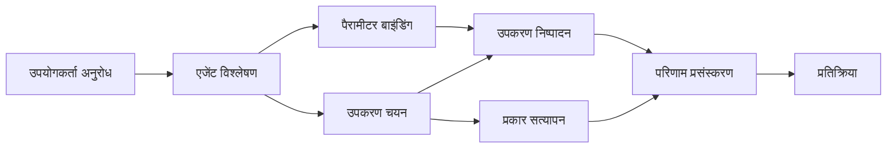

# 🛠️ Azure OpenAI (Responses API) (.NET) के साथ उन्नत उपकरण उपयोग

## 📋 सीखने के उद्देश्य

यह नोटबुक Microsoft Agent Framework का उपयोग करके .NET में Azure OpenAI (Responses API) के साथ उद्यम-ग्रेड टूल इंटीग्रेशन पैटर्न प्रदर्शित करता है। आप C# की मजबूत टाइपिंग और .NET की उद्यम सुविधाओं का लाभ उठाते हुए कई विशिष्ट उपकरणों के साथ परिष्कृत एजेंट बनाना सीखेंगे।

### उन्नत उपकरण क्षमताएं जिन्हें आप मास्टर करेंगे

- 🔧 **बहु-उपकरण आर्किटेक्चर**: कई विशिष्ट क्षमताओं वाले एजेंट बनाना
- 🎯 **टाइप-सेफ उपकरण निष्पादन**: C# के कंपाइल-टाइम सत्यापन का उपयोग
- 📊 **उद्यम उपकरण पैटर्न**: प्रोडक्शन-तैयार उपकरण डिज़ाइन और त्रुटि प्रबंधन
- 🔗 **उपकरण संयोजन**: जटिल व्यावसायिक वर्कफ़्लो के लिए उपकरणों का संयोजन

## 🎯 .NET उपकरण आर्किटेक्चर के लाभ

### उद्यम उपकरण सुविधाएं

- **कंपाइल-टाइम सत्यापन**: मजबूत टाइपिंग उपकरण पैरामीटर की सटीकता सुनिश्चित करती है
- **डिपेंडेंसी इंजेक्शन**: उपकरण प्रबंधन के लिए IoC कंटेनर एकीकरण
- **Async/Await पैटर्न**: उचित संसाधन प्रबंधन के साथ नॉन-ब्लॉकिंग उपकरण निष्पादन
- **स्ट्रक्चर्ड लॉगिंग**: उपकरण निष्पादन मॉनिटरिंग के लिए अंतर्निर्मित लॉगिंग एकीकरण

### प्रोडक्शन-तैयार पैटर्न

- **अपवाद प्रबंधन**: टाइप किए गए अपवादों के साथ व्यापक त्रुटि प्रबंधन
- **संसाधन प्रबंधन**: उचित डिस्पोजल पैटर्न और मेमोरी प्रबंधन
- **प्रदर्शन मॉनिटरिंग**: अंतर्निर्मित मीट्रिक्स और प्रदर्शन काउंटर
- **कॉन्फ़िगरेशन प्रबंधन**: सत्यापन के साथ टाइप-सेफ कॉन्फ़िगरेशन

## 🔧 तकनीकी आर्किटेक्चर

### कोर .NET उपकरण घटक

- **Microsoft.Extensions.AI**: एकीकृत उपकरण अमूर्तन परत
- **Microsoft.Agents.AI**: उद्यम-ग्रेड उपकरण संगठन
- **Azure OpenAI (Responses API)**: कनेक्शन पूलिंग के साथ उच्च-प्रदर्शन API क्लाइंट

### उपकरण निष्पादन पाइपलाइन



## 🛠️ उपकरण श्रेणियाँ और पैटर्न

### 1. **डेटा प्रोसेसिंग उपकरण**

- **इनपुट सत्यापन**: डाटा एनोटेशन के साथ मजबूत टाइपिंग
- **ट्रांसफॉर्म संचालन**: टाइप-सेफ डेटा रूपांतरण और स्वरूपण
- **व्यावसायिक तर्क**: डोमेन-विशिष्ट गणना और विश्लेषण उपकरण
- **आउटपुट स्वरूपण**: संरचित प्रतिक्रिया निर्माण

### 2. **इंटीग्रेशन उपकरण**

- **API कनेक्टर्स**: HttpClient के साथ RESTful सेवा इंटीग्रेशन
- **डेटाबेस उपकरण**: डेटा एक्सेस के लिए Entity Framework इंटीग्रेशन
- **फ़ाइल संचालन**: सत्यापन के साथ सुरक्षित फ़ाइल सिस्टम संचालन
- **बाहरी सेवाएं**: तृतीय-पक्ष सेवा इंटीग्रेशन पैटर्न

### 3. **यूटिलिटी उपकरण**

- **टेक्स्ट प्रोसेसिंग**: स्ट्रिंग मैनिपुलेशन और स्वरूपण यूटिलिटीज़
- **दिनांक/समय संचालन**: संस्कृति-संवेदनशील दिनांक/समय गणनाएं
- **गणितीय उपकरण**: सटीक गणनाएं और सांख्यिकीय ऑपरेशन
- **सत्यापन उपकरण**: व्यावसायिक नियम सत्यापन और डाटा सत्यापन

क्या आप .NET में शक्तिशाली, टाइप-सेफ उपकरण क्षमताओं के साथ उद्यम-ग्रेड एजेंट बनाने के लिए तैयार हैं? आइए कुछ पेशेवर-ग्रेड समाधान आर्किटेक्ट करें! 🏢⚡

## 🚀 आरंभ करना

### आवश्यकताएँ

- [.NET 10 SDK](https://dotnet.microsoft.com/download/dotnet/10.0) या उससे ऊपर
- एक [Azure सब्सक्रिप्शन](https://azure.microsoft.com/free/) जिसमें Azure OpenAI संसाधन और मॉडल तैनाती हो
- [Azure CLI](https://learn.microsoft.com/cli/azure/install-azure-cli) — `az login` से साइन इन करें

### आवश्यक पर्यावरण चर

```bash
# zsh/bash
export AZURE_OPENAI_ENDPOINT=https://<your-resource>.openai.azure.com
export AZURE_OPENAI_DEPLOYMENT=gpt-4.1-mini
# फिर साइन इन करें ताकि AzureCliCredential टोकन प्राप्त कर सके
az login
```

```powershell
# पावरशेल
$env:AZURE_OPENAI_ENDPOINT = "https://<your-resource>.openai.azure.com"
$env:AZURE_OPENAI_DEPLOYMENT = "gpt-4.1-mini"
# फिर साइन इन करें ताकि AzureCliCredential एक टोकन प्राप्त कर सके
az login
```

### नमूना कोड

उदाहरण कोड चलाने के लिए,

```bash
# zsh/bash
chmod +x ./04-dotnet-agent-framework.cs
./04-dotnet-agent-framework.cs
```

या dotnet CLI का उपयोग करते हुए:

```bash
dotnet run ./04-dotnet-agent-framework.cs
```

पूरा कोड देखने के लिए [`04-dotnet-agent-framework.cs`](../../../../04-tool-use/code_samples/04-dotnet-agent-framework.cs) देखें।

```csharp
#!/usr/bin/dotnet run

#:package Microsoft.Extensions.AI@10.*
#:package Microsoft.Agents.AI.OpenAI@1.*-*
#:package Azure.AI.OpenAI@2.1.0
#:package Azure.Identity@1.13.1

using System.ComponentModel;

using Microsoft.Agents.AI;
using Microsoft.Extensions.AI;

using Azure.AI.OpenAI;
using Azure.Identity;

// Tool Function: Random Destination Generator
// This static method will be available to the agent as a callable tool
// The [Description] attribute helps the AI understand when to use this function
// This demonstrates how to create custom tools for AI agents
[Description("Provides a random vacation destination.")]
static string GetRandomDestination()
{
    // List of popular vacation destinations around the world
    // The agent will randomly select from these options
    var destinations = new List<string>
    {
        "Paris, France",
        "Tokyo, Japan",
        "New York City, USA",
        "Sydney, Australia",
        "Rome, Italy",
        "Barcelona, Spain",
        "Cape Town, South Africa",
        "Rio de Janeiro, Brazil",
        "Bangkok, Thailand",
        "Vancouver, Canada"
    };

    // Generate random index and return selected destination
    // Uses System.Random for simple random selection
    var random = new Random();
    int index = random.Next(destinations.Count);
    return destinations[index];
}

// Azure OpenAI with the Responses API (stable v1 endpoint). Sign in with `az login`.
var azureEndpoint = Environment.GetEnvironmentVariable("AZURE_OPENAI_ENDPOINT")
    ?? throw new InvalidOperationException("AZURE_OPENAI_ENDPOINT is not set.");
var deployment = Environment.GetEnvironmentVariable("AZURE_OPENAI_DEPLOYMENT") ?? "gpt-4.1-mini";

var azureClient = new AzureOpenAIClient(new Uri(azureEndpoint), new AzureCliCredential());

// Define Agent Identity and Comprehensive Instructions
// Agent name for identification and logging purposes
var AGENT_NAME = "TravelAgent";

// Detailed instructions that define the agent's personality, capabilities, and behavior
// This system prompt shapes how the agent responds and interacts with users
var AGENT_INSTRUCTIONS = """
You are a helpful AI Agent that can help plan vacations for customers.

Important: When users specify a destination, always plan for that location. Only suggest random destinations when the user hasn't specified a preference.

When the conversation begins, introduce yourself with this message:
"Hello! I'm your TravelAgent assistant. I can help plan vacations and suggest interesting destinations for you. Here are some things you can ask me:
1. Plan a day trip to a specific location
2. Suggest a random vacation destination
3. Find destinations with specific features (beaches, mountains, historical sites, etc.)
4. Plan an alternative trip if you don't like my first suggestion

What kind of trip would you like me to help you plan today?"

Always prioritize user preferences. If they mention a specific destination like "Bali" or "Paris," focus your planning on that location rather than suggesting alternatives.
""";

// Create AI Agent with Advanced Travel Planning Capabilities
// Get the Responses client for the deployment and create the AI agent
// Configure agent with name, detailed instructions, and available tools
// This demonstrates the .NET agent creation pattern with full configuration
AIAgent agent = azureClient
    .GetChatClient(deployment)
    .AsAIAgent(
        name: AGENT_NAME,
        instructions: AGENT_INSTRUCTIONS,
        tools: [AIFunctionFactory.Create(GetRandomDestination)]
    );

// Create New Conversation Session for Context Management
// Initialize a new conversation session to maintain context across multiple interactions
// Sessions enable the agent to remember previous exchanges and maintain conversational state
// This is essential for multi-turn conversations and contextual understanding
await using var session = await agent.CreateSessionAsync();

// Execute Agent: First Travel Planning Request
// Run the agent with an initial request that will likely trigger the random destination tool
// The agent will analyze the request, use the GetRandomDestination tool, and create an itinerary
// Using the session parameter maintains conversation context for subsequent interactions
await foreach (var update in agent.RunStreamingAsync("Plan me a day trip", session))
{
    await Task.Delay(10);
    Console.Write(update);
}

Console.WriteLine();

// Execute Agent: Follow-up Request with Context Awareness
// Demonstrate contextual conversation by referencing the previous response
// The agent remembers the previous destination suggestion and will provide an alternative
// This showcases the power of conversation sessions and contextual understanding in .NET agents
await foreach (var update in agent.RunStreamingAsync("I don't like that destination. Plan me another vacation.", session))
{
    await Task.Delay(10);
    Console.Write(update);
}
```

---

<!-- CO-OP TRANSLATOR DISCLAIMER START -->
**अस्वीकरण**:
इस दस्तावेज़ का अनुवाद AI अनुवाद सेवा [Co-op Translator](https://github.com/Azure/co-op-translator) का उपयोग करके किया गया है। जबकि हम सटीकता के लिए प्रयास करते हैं, कृपया ध्यान दें कि स्वचालित अनुवादों में त्रुटियाँ या अशुद्धियाँ हो सकती हैं। मूल दस्तावेज़ अपनी मूल भाषा में ही प्रामाणिक स्रोत माना जाना चाहिए। महत्वपूर्ण जानकारी के लिए, पेशेवर मानव अनुवाद की सिफारिश की जाती है। इस अनुवाद के उपयोग से उत्पन्न किसी भी गलतफहमी या गलत व्याख्या के लिए हम उत्तरदायी नहीं हैं।
<!-- CO-OP TRANSLATOR DISCLAIMER END -->