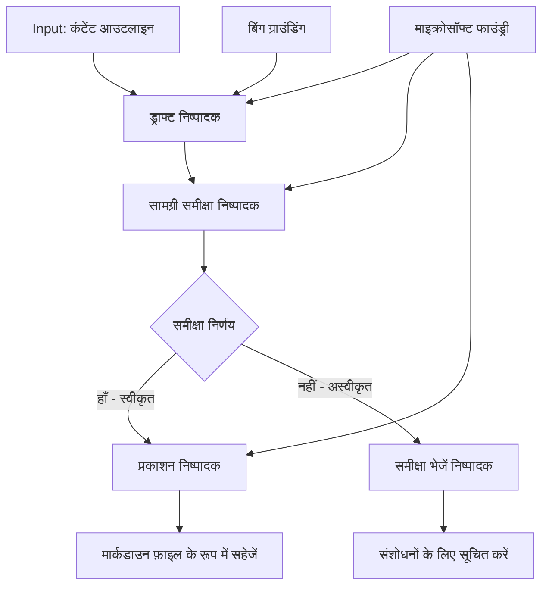

# 🔀 Microsoft Foundry (.NET) के साथ सशर्त एजेंट वर्कफ़्लो

## 📋 बुद्धिमान निर्णय-आधारित वर्कफ़्लो ट्यूटोरियल

यह नोटबुक Microsoft Foundry और .NET के लिए Microsoft Agent Framework का उपयोग करके **सशर्त वर्कफ़्लो पैटर्न** दिखाती है। आप सीखेंगे कि कैसे परिष्कृत, निर्णय-संचालित वर्कफ़्लो बनाएं जो AI विश्लेषण, व्यावसायिक नियमों, और गतिशील परिस्थितियों के आधार पर बुद्धिमानी से प्रसंस्करण को मार्गदर्शन करते हैं, जो एंटरप्राइज़-ग्रेड ऑटोमेशन के लिए उपयुक्त हैं।

## 🎯 सीखने के उद्देश्य

### 🧠 **बुद्धिमान निर्णय वास्तुकला**
- **सशर्त तर्क कार्यान्वयन**: अनेक शाखाओं वाले जटिल निर्णय वृक्ष बनाएं
- **AI-संचालित मार्गदर्शन**: बुद्धिमान मार्गदर्शन निर्णय लेने के लिए Microsoft Foundry मॉडलों का उपयोग करें
- **गतिशील वर्कफ़्लो अनुकूलन**: रनटाइम विश्लेषण और परिस्थितियों के आधार पर वर्कफ़्लो व्यवहार में बदलाव करें
- **एंटरप्राइज़ नियम एकीकरण**: वर्कफ़्लो में व्यावसायिक लॉजिक और अनुपालन आवश्यकताओं को शामिल करें

### 🔀 **उन्नत सशर्त पैटर्न**
- **बहो-क्राइटेरिया निर्णय लेना**: मार्गदर्शन निर्णयों के लिए कई कारकों का मूल्यांकन करें
- **संदर्भ-सूचित प्रसंस्करण**: संचित वर्कफ़्लो संदर्भ और इतिहास के आधार पर निर्णय लें
- **अनुकूली वर्कफ़्लो संशोधन**: वास्तविक समय की परिस्थितियों के आधार पर प्रसंस्करण मार्गों को गतिशील रूप से समायोजित करें
- **रूल इंजन इंटीग्रेशन**: वर्कफ़्लो में परिष्कृत व्यावसायिक रूल इंजन लागू करें

### 🏢 **एंटरप्राइज़ सशर्त अनुप्रयोग**
- **दस्तावेज़ वर्गीकरण और मार्गदर्शन**: दस्तावेज़ों को स्वचालित रूप से वर्गीकृत करें और उपयुक्त वर्कफ़्लो में मार्गदर्शन करें
- **ग्राहक सेवा ट्राइएज**: ग्राहक पूछताछों का बुद्धिमान मार्गदर्शन विशेषीकृत संभालने वाली टीमों को करें
- **अनुपालन और जोखिम प्रसंस्करण**: जोखिम मूल्यांकन के आधार पर विभिन्न सत्यापन और समीक्षा प्रक्रियाएं लागू करें
- **गुणवत्ता आश्वासन वर्कफ़्लो**: गुणवत्ता मापदंडों के आधार पर सामग्री को उपयुक्त समीक्षा प्रक्रियाओं के माध्यम से मार्गदर्शन करें

## ⚙️ पूर्वापेक्षाएँ और सेटअप

### 📦 **आवश्यक NuGet पैकेज**

सशर्त वर्कफ़्लो प्रसंस्करण के लिए उन्नत पैकेज:

```xml
<!-- Core AI Framework -->
<PackageReference Include="Microsoft.Extensions.AI" Version="9.9.0" />

<!-- Azure AI Agents with Persistent State -->
<PackageReference Include="Azure.AI.Agents.Persistent" Version="1.2.0-beta.5" />

<!-- Azure Identity and Utilities -->
<PackageReference Include="Azure.Identity" Version="1.15.0" />
<PackageReference Include="System.Linq.Async" Version="6.0.3" />
<PackageReference Include="DotNetEnv" Version="3.1.1" />

<!-- Local Workflow Framework References -->
<!-- Microsoft.Agents.Workflows.dll - Advanced workflow orchestration -->
<!-- Microsoft.Agents.AI.AzureAI.dll - Microsoft Foundry integration -->
<!-- Microsoft.Agents.AI.dll - Core agent abstractions -->
```

### 🔑 **Microsoft Foundry विन्यास**

**आवश्यक Azure संसाधन:**
- Microsoft Foundry कार्यक्षेत्र जिसमें सशर्त प्रसंस्करण मॉडल हों
- उचित कंप्यूट स्क्वोटो और अनुमतियों के साथ Azure सदस्यता
- निर्णय लेने और सामग्री विश्लेषण के लिए तैनात AI मॉडल
- (वैकल्पिक) ग्राउंडिंग क्षमताओं के लिए Bing Search API कनेक्शन

**पर्यावरण विन्यास (.env फ़ाइल):**
```env
# Microsoft Foundry Configuration
AZURE_AI_PROJECT_ENDPOINT=https://your-project.cognitiveservices.azure.com/
BING_CONNECTION_ID=your-bing-connection-id
```

**प्रमाणीकरण सेटअप:**
```csharp
// Azure CLI or Managed Identity authentication
using Azure.Identity;
var credential = new AzureCliCredential();

// Load environment configuration
DotNetEnv.Env.Load("../../../.env");
```

### 🏗️ **सशर्त वर्कफ़्लो वास्तुकला**



**प्रमुख घटक:**
- **ड्राफ्ट एक्सेक्यूटर**: AI एजेंट जो आउटलाइन से प्रारंभिक कंटेंट ड्राफ्ट बनाता है
- **सामग्री समीक्षा एक्सेक्यूटर**: AI एजेंट जो ड्राफ्ट की गुणवत्ता और अनुपालन का मूल्यांकन करता है
- **सशर्त मार्गदर्शन**: निर्णय तर्क जो समीक्षा परिणामों के आधार पर मार्गदर्शन करता है
- **प्रकाशन/समीक्षा पथ**: स्वीकृत और अस्वीकृत सामग्री के लिए अलग प्रसंस्करण पथ
- **स्थिति प्रबंधन**: वर्कफ़्लो के दौरान सामग्री और समीक्षा संदर्भ बनाए रखता है

## 🎨 **सशर्त वर्कफ़्लो डिजाइन पैटर्न**

### 📋 **गुणवत्ता द्वारों के साथ सामग्री उत्पादन**
```
Outline → Draft Creation → Quality Review → {Approve: Publish | Reject: Revise}
```

### 🎯 **जोखिम-आधारित दस्तावेज़ प्रसंस्करण**
```
Document → Risk Assessment → {Low: Standard | High: Enhanced Review}
```

### 🔍 **बुद्धिमान ग्राहक सेवा मार्गदर्शन**
```
Customer Query → Analysis → {Simple: FAQ Bot | Complex: Human Agent}
```

### 💼 **अनुपालन-चालित वर्कफ़्लो**
```
Content → Compliance Check → {Pass: Publish | Fail: Legal Review}
```

## 🏢 **एंटरप्राइज़ सशर्त लाभ**

### 🎯 **बुद्धिमान ऑटोमेशन**
- **स्मार्ट निर्णय लेना**: सामग्री विश्लेषण और संदर्भ पर आधारित AI-संचालित मार्गदर्शन निर्णय
- **अनुकूली प्रसंस्करण**: चल रही परिस्थितियों के आधार पर स्वचालित रूप से समायोजित वर्कफ़्लो
- **व्यावसायिक नियम लागू करना**: जटिल व्यावसायिक लॉजिक और नीतियों का स्वचालित अनुप्रयोग
- **संदर्भ-सूचित मार्गदर्शन**: पूरे वर्कफ़्लो इतिहास और संचित संदर्भ के आधार पर निर्णय

### 📈 **संचालनात्मक उत्कृष्टता**
- **संसाधन आवंटन का अनुकूलन**: सबसे उपयुक्त विशेषज्ञों और प्रक्रियाओं को कार्य मार्गदर्शन
- **घटित मैनुअल हस्तक्षेप**: स्वचालित निर्णय लेने से मानव मार्गदर्शन की आवश्यकता कम होती है
- **तेज़ समाधान समय**: उपयुक्त विशेषज्ञता और प्रसंस्करण काबिलियत को सीधे मार्गदर्शन
- **संगत आवेदन**: व्यावसायिक नियमों और निर्णय मानदंडों का समान रूप से पालन

### 🛡️ **जोखिम प्रबंधन और अनुपालन**
- **स्वचालित जोखिम मूल्यांकन**: सामग्री और स्थिति जोखिम स्तरों का AI-संचालित मूल्यांकन
- **अनुपालन प्रवर्तन**: आवश्यक नियामक प्रक्रियाओं के माध्यम से स्वचालित मार्गदर्शन
- **सुरक्षा प्रोटोकॉल का अनुप्रयोग**: जोखिम मूल्यांकन के आधार पर उन्नत सुरक्षा उपाय लागू करना
- **ऑडिट ट्रेल रखरखाव**: मार्गदर्शन निर्णयों और तर्क का पूर्ण दस्तावेजीकरण

### 📊 **विश्लेषण और निरंतर सुधार**
- **निर्णय विश्लेषण**: मार्गदर्शन निर्णयों की प्रभावशीलता और सटीकता का ट्रैकिंग
- **पैटर्न पहचान**: समय के साथ मार्गदर्शन निर्णयों में रुझानों और पैटर्न की पहचान
- **प्रदर्शन अनुकूलन**: निर्णय मानदंड और मार्गदर्शन दक्षता में निरंतर सुधार
- **व्यावसायिक बुद्धिमत्ता**: सामग्री विशेषताओं और प्रसंस्करण आवश्यकताओं पर अंतर्दृष्टि

### 🔧 **तकनीकी उत्कृष्टता**
- **स्थायी स्थिति प्रबंधन**: वर्कफ़्लो निष्पादन के दौरान जटिल स्थिति बनाए रखना
- **स्केलेबल वास्तुकला**: उच्च मात्रा वाले सशर्त प्रसंस्करण आवश्यकताओं को संभालना
- **एकीकरण क्षमताएं**: मौजूदा व्यावसायिक प्रणालियों और प्रक्रियाओं के साथ सहज एकीकरण
- **निगरानी और दृश्यता**: वर्कफ़्लो प्रदर्शन और निर्णयों का व्यापक ट्रैकिंग

चलिए .NET के साथ बुद्धिमान, निर्णय-संचालित एंटरप्राइज़ वर्कफ़्लो बनाते हैं! 🚀

## 💻 कोड चलाना

संपूर्ण कार्यान्वयन `04.dotnet-agent-framework-workflow-aifoundry-condition.cs` में उपलब्ध है। यह **गुणवत्ता द्वारों के साथ सामग्री उत्पादन वर्कफ़्लो** प्रदर्शित करता है:

### 🏗️ **वर्कफ़्लो वास्तुकला**

```
Content Outline → Draft Creation → Quality Review → Conditional Routing:
                                                      ├─ Approved (>200 words) → Publish
                                                      └─ Rejected (<200 words) → Review Notification
```

**वर्कफ़्लो में एजेंट:**
1. **एवेंजेलिस्ट एजेंट**: आउटलाइन से ट्यूटोरियल ड्राफ्ट बनाता है जिसमें Bing ग्राउंडिंग शामिल है
2. **सामग्री समीक्षक एजेंट**: ड्राफ्ट की गुणवत्ता (शब्द गणना, पूर्णता) का मूल्यांकन करता है
3. **प्रकाशक एजेंट**: स्वीकृत सामग्री को समय-चिह्नित Markdown फ़ाइलों के रूप में सहेजता है

**कस्टम एक्सेक्यूटर:**
1. **DraftExecutor**: ड्राफ्ट निर्माण का समन्वयन करता है
2. **ContentReviewExecutor**: गुणवत्ता मूल्यांकन करता है
3. **PublishExecutor**: अनुमोदित सामग्री प्रकाशन करता है
4. **SendReviewExecutor**: अस्वीकृत सामग्री सूचनाएं प्रबंधित करता है

### 🚀 उदाहरण चलाना

**पूर्वापेक्षाएँ:**
- Microsoft Foundry कार्यक्षेत्र कॉन्फ़िगर किया हुआ
- Azure CLI प्रमाणीकरण (`az login`)
- (वैकल्पिक) ग्राउंडिंग के लिए Bing Search कनेक्शन

```bash
# स्क्रिप्ट को निष्पादन योग्य बनाएं (Unix/Linux/macOS)
chmod +x 04.dotnet-agent-framework-workflow-aifoundry-condition.cs

# सशर्त वर्कफ़्लो चलाएं
./04.dotnet-agent-framework-workflow-aifoundry-condition.cs
```

या Windows पर:
```powershell
dotnet run 04.dotnet-agent-framework-workflow-aifoundry-condition.cs
```

### 📝 अपेक्षित आउटपुट

वर्कफ़्लो करेगा:
1. **एजेंट बनाएं**: तीन विशेषीकृत Microsoft Foundry एजेंट्स को इनिशियलाइज़ करें
2. **ड्राफ्ट जनरेट करें**: एवेंजेलिस्ट एजेंट आउटलाइन से ट्यूटोरियल ड्राफ्ट बनाता है
3. **सामग्री की समीक्षा करें**: सामग्री समीक्षक ड्राफ्ट की गुणवत्ता का मूल्यांकन करता है
4. **सशर्त मार्गदर्शन**:
   - **यदि स्वीकृत (>200 शब्द)**: प्रकाशन एक्सेक्यूटर Markdown फ़ाइल के रूप में सहेजता है
   - **यदि अस्वीकृत (<200 शब्द)**: समीक्षा सूचना भेजें
5. **परिणाम दिखाएं**: अंतिम वर्कफ़्लो आउटपुट दिखाएं

### 🔧 अनुकूलन विकल्प

**समीक्षा मानदंड परिवर्तित करें:**
```csharp
const string ContentReviewerInstructions = @"
You are a content reviewer...
1. Check if content is more than 500 words (instead of 200)
2. Verify technical accuracy
3. Ensure proper formatting
...";
```

**अधिक सशर्त पथ जोड़ें:**
```csharp
var workflow = new WorkflowBuilder(draftExecutor)
    .AddEdge(draftExecutor, contentReviewerExecutor)
    .AddEdge(contentReviewerExecutor, publishExecutor, condition: GetCondition("Excellent"))
    .AddEdge(contentReviewerExecutor, editExecutor, condition: GetCondition("Good"))
    .AddEdge(contentReviewerExecutor, sendReviewerExecutor, condition: GetCondition("Poor"))
    .Build();
```

**सामग्री आवश्यकताएं बदलें:**
```csharp
string OUTLINE_Content = @"
# Your Custom Topic
## Section 1
https://your-reference-url
## Section 2
...
";
```

### 🎯 वास्तविक दुनिया अनुप्रयोग

यह सशर्त वर्कफ़्लो पैटर्न आदर्श है:
- **सामग्री प्रबंधन प्रणाली**: गुणवत्ता द्वारों के साथ स्वचालित संपादकीय वर्कफ़्लो
- **दस्तावेज़ प्रसंस्करण**: वर्गीकरण और अनुपालन के आधार पर दस्तावेज़ मार्गदर्शन
- **ग्राहक समर्थन**: जटिलता और तात्कालिकता के आधार पर बुद्धिमान टिकट मार्गदर्शन
- **कानूनी समीक्षा**: जोखिम मूल्यांकन और मूल्य के आधार पर अनुबंध मार्गदर्शन
- **HR प्रक्रियाएं**: उपयुक्त स्क्रीनिंग वर्कफ़्लो के माध्यम से आवेदन मार्गदर्शन

### 🔍 सशर्त तर्क समझना

**शर्त फ़ंक्शन:**
```csharp
public Func<object?, bool> GetCondition(string expectedResult) =>
    reviewResult => reviewResult is ReviewResult review && review.Result == expectedResult;
```

यह फ़ंक्शन एक प्रेडिकेट बनाता है जो:
1. जांचता है कि परिणाम `ReviewResult` प्रकार का है या नहीं
2. `Result` संपत्ति की तुलना अपेक्षित मान से करता है
3. मार्गदर्शन निर्धारित करने के लिए true/false लौटाता है

**शर्तों के साथ वर्कफ़्लो किनारे:**
```csharp
.AddEdge(contentReviewerExecutor, publishExecutor, condition: GetCondition("Yes"))
.AddEdge(contentReviewerExecutor, sendReviewerExecutor, condition: GetCondition("No"))
```

### 📊 उन्नत विशेषताएँ

**JSON स्कीमा सत्यापन:**
वर्कफ़्लो संरचित प्रतिक्रियाओं को सुनिश्चित करने के लिए JSON स्कीमाओं का उपयोग करता है:

```csharp
// Define response structure
public class ReviewResult
{
    [JsonPropertyName("review_result")]
    public string Result { get; set; } = string.Empty;
    
    [JsonPropertyName("reason")]
    public string Reason { get; set; } = string.Empty;
    
    [JsonPropertyName("draft_content")]
    public string DraftContent { get; set; } = string.Empty;
}

// Apply to agent
ResponseFormat = ChatResponseFormat.ForJsonSchema(
    AIJsonUtilities.CreateJsonSchema(typeof(ReviewResult)), 
    "ReviewResult", 
    "Review Result From DraftContent"
)
```

**Bing ग्राउंडिंग एकीकरण:**
एवेंजेलिस्ट एजेंट रियल-टाइम जानकारी प्राप्त करने के लिए Bing ग्राउंडिंग का उपयोग करता है:

```csharp
var bingGroundingConfig = new BingGroundingSearchConfiguration(bing_conn_id);
BingGroundingToolDefinition bingGroundingTool = new(
    new BingGroundingSearchToolParameters([bingGroundingConfig])
);
```

यह एजेंट को निर्देशिका में URL का पालन करने और वर्तमान जानकारी निकालने में सक्षम बनाता है।

### 🛡️ त्रुटि प्रबंधन

वर्कफ़्लो में अस्वीकृत सामग्री के लिए मजबूत त्रुटि प्रबंधन शामिल है:
- समीक्षा असफलताएं वैकल्पिक मार्ग को ट्रिगर करती हैं
- सूचनाएं स्पष्ट अस्वीकृति कारण प्रदान करती हैं
- संशोधन के लिए सामग्री संरक्षित रहती है

### 🔄 वर्कफ़्लो का विस्तार

**समीक्षा चक्र जोड़ें:**
सामग्री को स्वचालित रूप से पुन: प्रस्तुत करने के लिए फीडबैक लूप बनाएं:

```csharp
.AddEdge(contentReviewerExecutor, publishExecutor, condition: GetCondition("Yes"))
.AddEdge(contentReviewerExecutor, draftExecutor, condition: GetCondition("No")) // Loop back
```

**बहु-स्तरीय समीक्षा लागू करें:**
विभिन्न मानदंडों के साथ कई समीक्षा चरण जोड़ें:

```csharp
.AddEdge(draftExecutor, technicalReviewer)
.AddEdge(technicalReviewer, editorialReviewer, condition: GetCondition("TechPass"))
.AddEdge(editorialReviewer, publishExecutor, condition: GetCondition("EditPass"))
```

यह सशर्त वर्कफ़्लो पैटर्न परिष्कृत, बुद्धिमान एंटरप्राइज़ ऑटोमेशन सिस्टम बनाने की नींव प्रदान करता है! 🚀

---

<!-- CO-OP TRANSLATOR DISCLAIMER START -->
**अस्वीकरण**:
इस दस्तावेज़ का अनुवाद AI अनुवाद सेवा [Co-op Translator](https://github.com/Azure/co-op-translator) का उपयोग करके किया गया है। जबकि हम सटीकता के लिए प्रयास करते हैं, कृपया ध्यान दें कि स्वचालित अनुवादों में त्रुटियाँ या अशुद्धियाँ हो सकती हैं। मूल दस्तावेज़ अपनी मूल भाषा में ही प्रामाणिक स्रोत माना जाना चाहिए। महत्वपूर्ण जानकारी के लिए, पेशेवर मानव अनुवाद की सिफारिश की जाती है। इस अनुवाद के उपयोग से उत्पन्न किसी भी गलतफहमी या गलत व्याख्या के लिए हम उत्तरदायी नहीं हैं।
<!-- CO-OP TRANSLATOR DISCLAIMER END -->