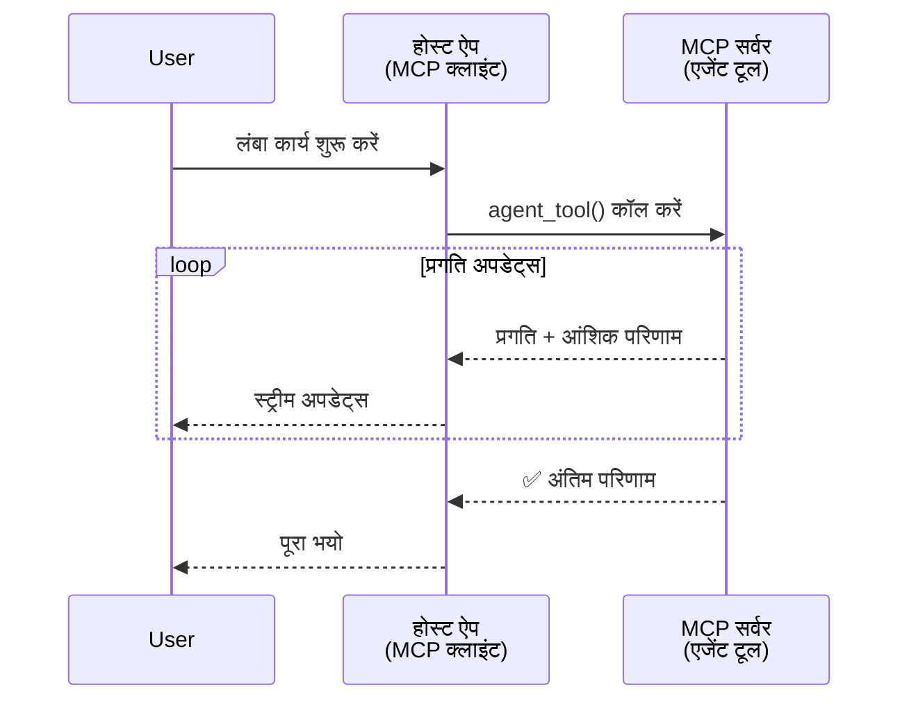
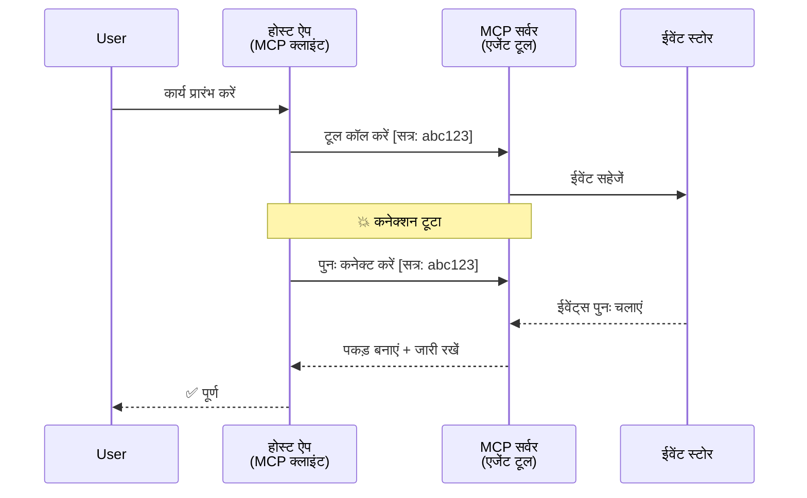
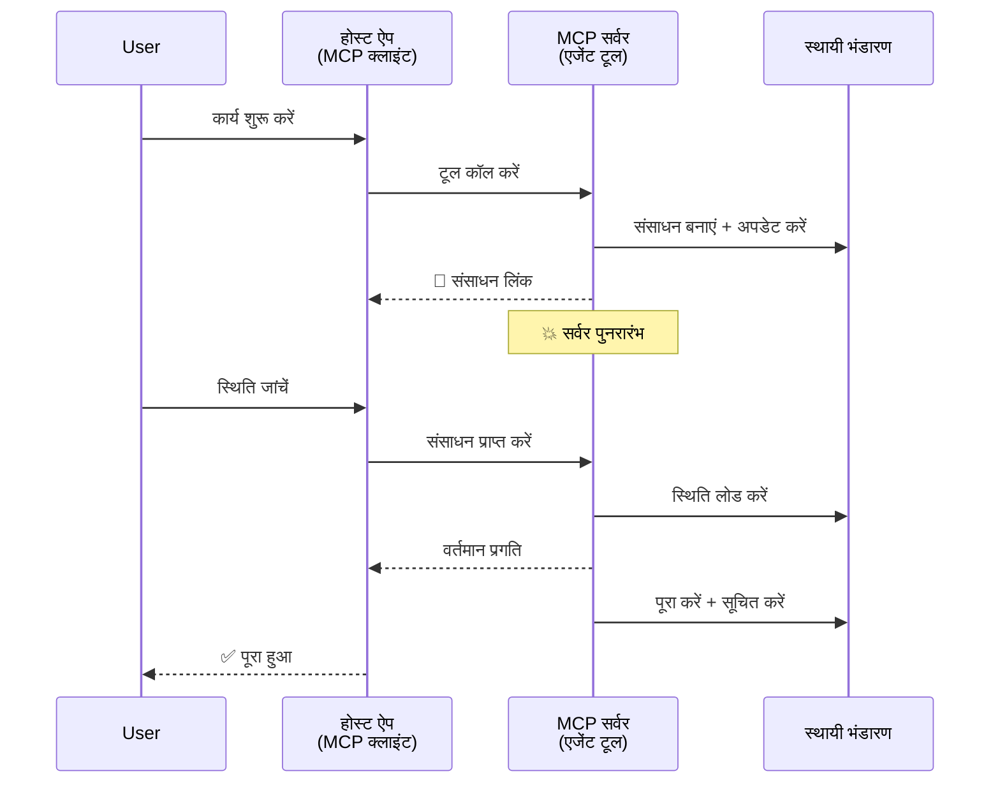
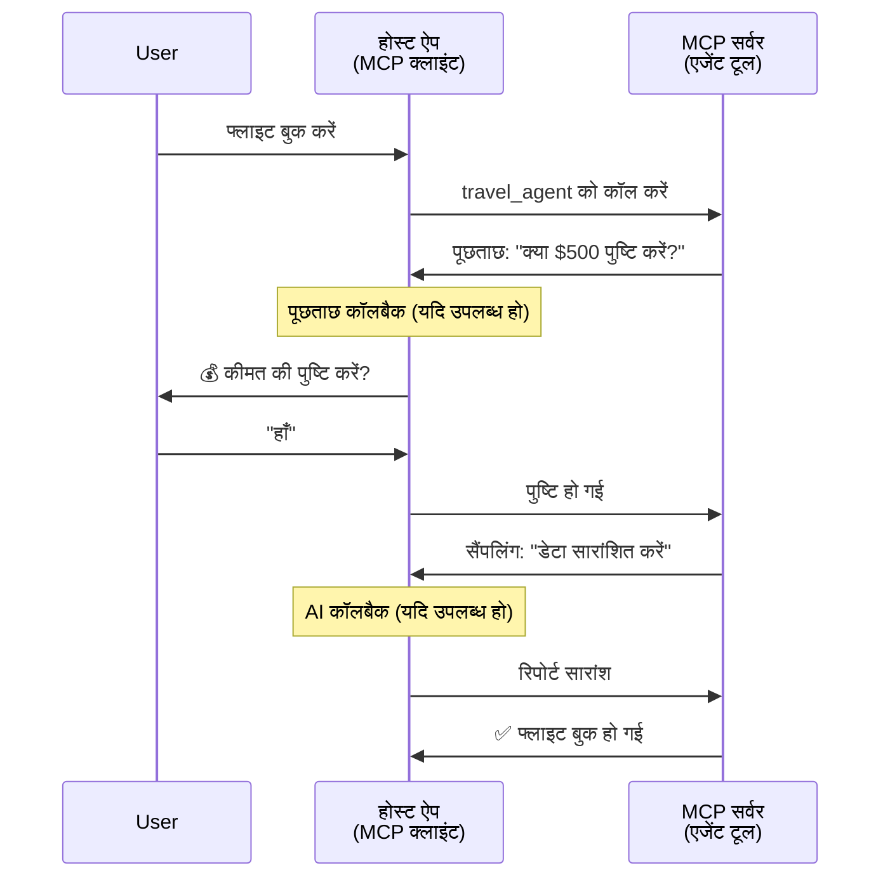
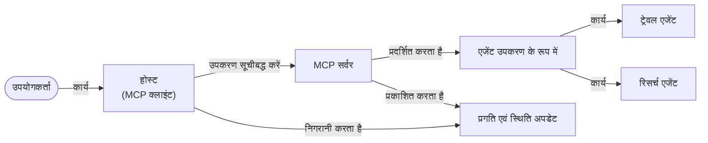

# MCP के साथ एजेंट-टू-एजेंट संचार प्रणाली बनाना

> संक्षेप में - क्या आप MCP पर एजेंट2एजेंट संचार बना सकते हैं? हाँ!

MCP "LLMs को संदर्भ प्रदान करने" के अपने मूल उद्देश्य से काफी आगे बढ़ चुका है। हालिया सुधारों में [रिसुमेबल स्ट्रीम्स](https://modelcontextprotocol.io/docs/concepts/transports#resumability-and-redelivery), [प्रेरणा](https://modelcontextprotocol.io/specification/2025-06-18/client/elicitation), [सैंपलिंग](https://modelcontextprotocol.io/specification/2025-06-18/client/sampling), और सूचनाएं ([प्रगति](https://modelcontextprotocol.io/specification/2025-06-18/basic/utilities/progress) और [संसाधन](https://modelcontextprotocol.io/specification/2025-06-18/schema#resourceupdatednotification)) शामिल हैं, जिससे MCP अब जटिल एजेंट-टू-एजेंट संचार प्रणालियाँ बनाने के लिए एक मजबूत आधार प्रदान करता है।

## एजेंट/उपकरण की गलत धारणा

जैसे-जैसे अधिक डेवलपर्स एजेंटिक व्यवहार वाले टूल्स का अन्वेषण करते हैं (लंबे समय तक चलने वाले, मध्य-कार्यान्वयन में अतिरिक्त इनपुट की आवश्यकता हो सकती है, आदि), एक सामान्य भ्रांति यह है कि MCP अनुपयुक्त है क्योंकि इसके शुरुआती उदाहरणों के टूल्स केवल सरल अनुरोध-प्रतिक्रिया पैटर्न पर केंद्रित थे।

यह धारणा पुरानी हो चुकी है। पिछले कुछ महीनों में MCP विनिर्देश में काफी सुधार हुआ है जिनमें लंबी अवधि के एजेंटिक व्यवहार बनाने के लिए निम्नलिखित क्षमताएँ शामिल हैं:

- **स्ट्रीमिंग और आंशिक परिणाम**: क्रियान्वयन के दौरान वास्तविक समय प्रगति अपडेट्स
- **रिसुमेबिलिटी**: क्लाइंट डिसकनेक्शन के बाद पुनः कनेक्ट कर सकते हैं और जारी रख सकते हैं
- **टिकाऊपन**: परिणाम सर्वर पुनः प्रारंभ के बाद भी जीवित रहते हैं (जैसे, संसाधन लिंक के माध्यम से)
- **मल्टी-टर्न**: प्रेरणा और सैंपलिंग के माध्यम से क्रियान्वयन के मध्य इंटरैक्टिव इनपुट

ये फीचर्स सम्मिलित करके जटिल एजेंटिक और मल्टी-एजेंट एप्लिकेशन बनाए जा सकते हैं, सभी MCP प्रोटोकॉल पर आधारित।

संदर्भ के लिए, हम एक एजेंट का उल्लेख "टूल" के रूप में करेंगे जो MCP सर्वर पर उपलब्ध होता है। इसका मतलब है कि एक होस्ट एप्लिकेशन मौजूद है जो MCP क्लाइंट को लागू करता है जो MCP सर्वर के साथ सेशन स्थापित करता है और एजेंट को कॉल कर सकता है।

## क्या एक MCP टूल "एजेंटिक" बनाता है?

कार्यान्वयन में गोता लगाने से पहले, आइए निर्धारित करें कि लंबी अवधि वाले एजेंटों का समर्थन करने के लिए कौन-कौन सी अवसंरचना क्षमताएँ आवश्यक हैं।

> हम एजेंट को उस इकाई के रूप में परिभाषित करेंगे जो स्वतंत्र रूप से लंबे समय तक कार्य कर सके, जटिल कार्य संभाल सके जिनमें कई इंटरैक्शन या वास्तविक समय प्रतिक्रिया के आधार पर समायोजन हो सकते हैं।

### 1. स्ट्रीमिंग और आंशिक परिणाम

पारंपरिक अनुरोध-प्रतिक्रिया पैटर्न लंबे चलने वाले कार्यों के लिए काम नहीं करते। एजेंटों को प्रदान करना चाहिए:

- वास्तविक समय प्रगति अपडेट्स
- मध्यवर्ती परिणाम

**MCP समर्थन**: रिसोर्स अपडेट नोटिफिकेशन स्ट्रीमिंग आंशिक परिणाम सक्षम करते हैं, हालांकि यह JSON-RPC के 1:1 अनुरोध/प्रतिक्रिया मॉडल के साथ संघर्ष से बचने के लिए सावधानीपूर्वक डिजाइन की आवश्यकता है।

| फीचर                     | उपयोग मामला                                                                                                                                                             | MCP समर्थन                                                                                  |
| ------------------------- | ---------------------------------------------------------------------------------------------------------------------------------------------------------------------- | -------------------------------------------------------------------------------------------- |
| वास्तविक समय प्रगति अपडेट | उपयोगकर्ता कोडबेस माइग्रेशन कार्य का अनुरोध करता है। एजेंट प्रगति स्ट्रीम करता है: "10% - निर्भरताओं का विश्लेषण... 25% - टाइपस्क्रिप्ट फाइलें परिवर्तित... 50% - इम्पोर्ट अपडेट..." | ✅ प्रगति सूचनाएं                                                                              |
| आंशिक परिणाम              | "एक पुस्तक उत्पन्न करें" कार्य आंशिक परिणाम स्ट्रीम करता है, जैसे 1) कहानी के मोड़ की रूपरेखा, 2) अध्याय सूची, 3) प्रत्येक अध्याय पूर्ण होने पर। होस्ट किसी भी चरण पर निरीक्षण, रद्द या पुनर्निर्देशन कर सकता है। | ✅ सूचनाओं को आंशिक परिणामों सहित "विस्तारित" किया जा सकता है, PR 383, 776 पर प्रस्ताव देखें          |

<div align="center" style="font-style: italic; font-size: 0.95em; margin-bottom: 0.5em;">
<strong>चित्र 1:</strong> यह आरेख दिखाता है कि कैसे MCP एजेंट लंबी अवधि के कार्य के दौरान वास्तविक समय प्रगति अपडेट और आंशिक परिणाम होस्ट एप्लिकेशन को स्ट्रीम करता है, जिससे उपयोगकर्ता को वास्तविक समय में क्रियान्वयन की निगरानी करने की अनुमति मिलती है।
</div>



### 2. रिसुमेबिलिटी

एजेंटों को नेटवर्क बाधाओं को सहजता से संभालना चाहिए:

- (क्लाइंट) डिसकनेक्शन के बाद पुनः कनेक्ट करें
- जहां छूटा वहां से जारी रखें (संदेश पुनः वितरण)

**MCP समर्थन**: MCP StreamableHTTP ट्रांसपोर्ट आज सत्र पुनः आरंभ और संदेश पुनः वितरण का समर्थन करता है सत्र आईडी और अंतिम ईवेंट आईडी के साथ। महत्वपूर्ण बात यह है कि सर्वर को ऐसा EventStore लागू करना चाहिए जो ग्राहक के पुनः कनेक्शन पर ईवेंट रीप्ले सक्षम करे।
ध्यान दें कि एक समुदाय प्रस्ताव (PR #975) है जो ट्रांसपोर्ट-एग्नोस्टिक रिसुमेबल स्ट्रीम्स का अन्वेषण करता है।

| फीचर      | उपयोग मामला                                                                                                                                             | MCP समर्थन                                                              |
| ---------- | -------------------------------------------------------------------------------------------------------------------------------------------------------- | ------------------------------------------------------------------------ |
| रिसुमेबिलिटी | क्लाइंट लंबे चलने वाले कार्य के दौरान डिस्कनेक्ट हो जाता है। पुनः कनेक्शन पर, सत्र पुनः शुरू होता है और छूटे हुए ईवेंट पुनः चलाए जाते हैं, बिना प्रगति खोए कार्य जारी रहता है। | ✅ StreamableHTTP ट्रांसपोर्ट सत्र आईडी, ईवेंट रीप्ले, और EventStore के साथ |

<div align="center" style="font-style: italic; font-size: 0.95em; margin-bottom: 0.5em;">
<strong>चित्र 2:</strong> यह आरेख दिखाता है कि कैसे MCP का StreamableHTTP ट्रांसपोर्ट और ईवेंट स्टोर सत्र पुनः आरंभ को सक्षम करते हैं: यदि क्लाइंट डिसकनेक्ट होता है, तो यह पुनः कनेक्ट कर सकता है और छूटे हुए ईवेंट पुनः चला सकता है, बिना प्रगति के नुकसान के कार्य जारी रखते हुए।
</div>



### 3. टिकाऊपन

लंबे चलने वाले एजेंटों को स्थायी स्थिति की आवश्यकता होती है:

- परिणाम सर्वर पुनः प्रारंभ के बाद भी जीवित रहते हैं
- स्थिति को बैंड के बाहर प्राप्त किया जा सकता है
- सेशनों के बीच प्रगति ट्रैकिंग

**MCP समर्थन**: MCP अब टूल कॉल्स के लिए एक रिसोर्स लिंक रिटर्न प्रकार का समर्थन करता है। आज, एक संभव पैटर्न वह है जिसमें टूल एक संसाधन बनाता है और तुरंत संसाधन लिंक लौटाता है। टूल पृष्ठभूमि में कार्य को संबोधित कर सकता है और संसाधन को अपडेट कर सकता है। बदले में, क्लाइंट संसाधन की स्थिति के लिए पोलिंग कर सकता है ताकि आंशिक या पूर्ण परिणाम प्राप्त किए जा सकें (यह निर्भर करता है कि सर्वर कौन से संसाधन अपडेट प्रदान करता है) या अपडेट सूचनाओं के लिए संसाधन की सदस्यता ले सकता है।

यहां एक सीमा यह है कि संसाधनों की पोलिंग या अपडेट्स के लिए सदस्यता लेना संसाधनों का उपभोग कर सकता है, जिसका पैमाने पर प्रभाव हो सकता है। एक खुला समुदाय प्रस्ताव (जिसमें #992 शामिल है) वेबहुक या ट्रिगर शामिल करने की संभावना का पता लगा रहा है जिसे सर्वर अपडेट की सूचना देने के लिए क्लाइंट/होस्ट एप्लिकेशन को कॉल कर सकता है।

| फीचर    | उपयोग मामला                                                                                                                                  | MCP समर्थन                                                    |
| -------- | --------------------------------------------------------------------------------------------------------------------------------------------- | ------------------------------------------------------------- |
| टिकाऊपन | डेटा माइग्रेशन कार्य के दौरान सर्वर क्रैश हो जाता है। परिणाम और प्रगति पुनः शुरू करने पर जीवित रहती है, क्लाइंट स्थिति जाँच सकता है और स्थायी संसाधन से जारी रख सकता है। | ✅ संसाधन लिंक स्थायी भंडारण और स्थिति सूचनाओं के साथ           |

आज, एक सामान्य पैटर्न ऐसा टूल डिजाइन करना है जो संसाधन बनाए और तुरंत संसाधन लिंक लौटाए। टूल पृष्ठभूमि में कार्य को संबोधित कर सकता है, संसाधन सूचनाएं जारी कर सकता है जो प्रगति अपडेट के रूप में सेवा करती हैं या आंशिक परिणाम शामिल करती हैं, और आवश्यकतानुसार संसाधन की सामग्री को अपडेट करता है।

<div align="center" style="font-style: italic; font-size: 0.95em; margin-bottom: 0.5em;">
<strong>चित्र 3:</strong> यह आरेख दिखाता है कि कैसे MCP एजेंट स्थायी संसाधनों और स्थिति सूचनाओं का उपयोग करके लंबी अवधि के कार्यों को सर्वर पुनः आरंभ के बाद भी जीवित रखते हैं, जिससे क्लाइंट प्रगति जांच और परिणाम प्राप्त कर सकते हैं, भले ही विफलताएं हुई हों।
</div>



### 4. मल्टी-टर्न इंटरैक्शन

एजेंटों को अक्सर क्रियान्वयन के मध्य अतिरिक्त इनपुट की आवश्यकता होती है:

- मानवीय स्पष्टीकरण या अनुमोदन
- जटिल निर्णयों के लिए एआई सहायता
- गतिशील पैरामीटर समायोजन

**MCP समर्थन**: पूरी तरह से सैंपलिंग (एआई इनपुट के लिए) और प्रेरणा (मानव इनपुट के लिए) के माध्यम से समर्थित।

| फीचर                 | उपयोग मामला                                                                                                                            | MCP समर्थन                                             |
| --------------------- | ------------------------------------------------------------------------------------------------------------------------------------- | ------------------------------------------------------- |
| मल्टी-टर्न इंटरैक्शन | ट्रैवल बुकिंग एजेंट उपयोगकर्ता से मूल्य पुष्टि का अनुरोध करता है, फिर बुकिंग पूरी करने से पहले यात्रा डेटा को संक्षेप में प्रस्तुत करने के लिए AI से कहता है। | ✅ मानव इनपुट के लिए प्रेरणा, एआई इनपुट के लिए सैंपलिंग |

<div align="center" style="font-style: italic; font-size: 0.95em; margin-bottom: 0.5em;">
<strong>चित्र 4:</strong> यह आरेख दिखाता है कि कैसे MCP एजेंट इंटरैक्टिवली मानव इनपुट या क्रियान्वयन के मध्य AI सहायता का अनुरोध कर सकते हैं, पुष्टिकरण और गतिशील निर्णय लेने जैसे जटिल, मल्टी-टर्न वर्कफ़्लोज़ का समर्थन करते हुए।
</div>



## MCP पर लंबी अवधि वाले एजेंटों का कार्यान्वयन - कोड अवलोकन

इस लेख के हिस्से के रूप में, हम एक [कोड रिपॉजिटरी](https://github.com/victordibia/ai-tutorials/tree/main/MCP%20Agents) प्रदान करते हैं जिसमें MCP पायथन SDK के साथ लंबी अवधि वाले एजेंटों का पूर्ण कार्यान्वयन है, जिसमें सेशन पुनः आरंभ और संदेश पुनः वितरण के लिए StreamableHTTP ट्रांसपोर्ट शामिल है। यह कार्यान्वयन दिखाता है कि कैसे MCP क्षमताओं का संयोजन जटिल एजेंट-जैसे व्यवहारों को सक्षम कर सकता है।

विशेष रूप से, हमने एक सर्वर को दो प्रमुख एजेंट टूल्स के साथ कार्यान्वित किया है:

- **ट्रैवल एजेंट** - प्रेरणा के माध्यम से मूल्य पुष्टि के साथ यात्रा बुकिंग सेवा का अनुकरण करता है
- **रिसर्च एजेंट** - सैंपलिंग के माध्यम से AI-सहायता प्राप्त सारांशों के साथ अनुसंधान कार्य करता है

दोनों एजेंट वास्तविक समय प्रगति अपडेट, इंटरैक्टिव पुष्टिकरण, और पूर्ण सत्र पुनः आरंभ क्षमताओं को प्रदर्शित करते हैं।

### प्रमुख कार्यान्वयन अवधारणाएँ

निम्नलिखित सेक्शन प्रत्येक क्षमता के लिए सर्वर-साइड एजेंट कार्यान्वयन और क्लाइंट-साइड होस्ट हैंडलिंग दिखाते हैं:

#### स्ट्रीमिंग और प्रगति अपडेट्स - वास्तविक समय कार्य स्थिति

स्ट्रीमिंग एजेंटों को लंबी अवधि के कार्यों के दौरान वास्तविक समय प्रगति अपडेट प्रदान करने में सक्षम बनाता है, जिससे उपयोगकर्ता कार्य की स्थिति और मध्यवर्ती परिणामों से अवगत रहते हैं।

**सर्वर कार्यान्वयन (एजेंट प्रगति सूचनाएं भेजता है):**

```python
# सर्वर/server.py से - यात्रा एजेंट प्रगति अपडेट भेज रहा है
for i, step in enumerate(steps):
    await ctx.session.send_progress_notification(
        progress_token=ctx.request_id,
        progress=i * 25,
        total=100,
        message=step,
        related_request_id=str(ctx.request_id)
    )
    await anyio.sleep(2)  # काम का अनुकरण करें

# विकल्प: विस्तृत चरण-दर-चरण अपडेट के लिए संदेश लॉग करें
await ctx.session.send_log_message(
    level="info",
    data=f"Processing step {current_step}/{steps} ({progress_percent}%)",
    logger="long_running_agent",
    related_request_id=ctx.request_id,
)
```

**क्लाइंट कार्यान्वयन (होस्ट प्रगति अपडेट प्राप्त करता है):**

```python
# client/client.py से - क्लाइंट जो रियल-टाइम सूचनाओं को संभालता है
async def message_handler(message) -> None:
    if isinstance(message, types.ServerNotification):
        if isinstance(message.root, types.LoggingMessageNotification):
            console.print(f"📡 [dim]{message.root.params.data}[/dim]")
        elif isinstance(message.root, types.ProgressNotification):
            progress = message.root.params
            console.print(f"🔄 [yellow]{progress.message} ({progress.progress}/{progress.total})[/yellow]")

# सेशन बनाते समय संदेश हैंडलर रजिस्टर करें
async with ClientSession(
    read_stream, write_stream,
    message_handler=message_handler
) as session:
```

#### प्रेरणा - उपयोगकर्ता इनपुट का अनुरोध करना

प्रेरणा एजेंटों को क्रियान्वयन के मध्य उपयोगकर्ता इनपुट का अनुरोध करने की अनुमति देती है। यह लंबी अवधि के कार्यों के दौरान पुष्टिकरण, स्पष्टीकरण, या अनुमोदन के लिए आवश्यक है।

**सर्वर कार्यान्वयन (एजेंट पुष्टिकरण का अनुरोध करता है):**

```python
# सर्वर/server.py से - यात्रा एजेंट कीमत पुष्टि का अनुरोध कर रहा है
elicit_result = await ctx.session.elicit(
    message=f"Please confirm the estimated price of $1200 for your trip to {destination}",
    requestedSchema=PriceConfirmationSchema.model_json_schema(),
    related_request_id=ctx.request_id,
)

if elicit_result and elicit_result.action == "accept":
    # बुकिंग के साथ जारी रखें
    logger.info(f"User confirmed price: {elicit_result.content}")
elif elicit_result and elicit_result.action == "decline":
    # बुकिंग रद्द करें
    booking_cancelled = True
```

**क्लाइंट कार्यान्वयन (होस्ट प्रेरणा कॉलबैक प्रदान करता है):**

```python
# client/client.py से - क्लाइंट अनुरोधों को संभालना
async def elicitation_callback(context, params):
    console.print(f"💬 Server is asking for confirmation:")
    console.print(f"   {params.message}")

    response = console.input("Do you accept? (y/n): ").strip().lower()

    if response in ['y', 'yes']:
        return types.ElicitResult(
            action="accept",
            content={"confirm": True, "notes": "Confirmed by user"}
        )
    else:
        return types.ElicitResult(
            action="decline",
            content={"confirm": False, "notes": "Declined by user"}
        )

# सत्र बनाते समय कॉलबैक पंजीकृत करें
async with ClientSession(
    read_stream, write_stream,
    elicitation_callback=elicitation_callback
) as session:
```

#### सैंपलिंग - AI सहायता का अनुरोध करना

सैंपलिंग एजेंटों को जटिल निर्णयों या सामग्री निर्माण के लिए LLM सहायता का अनुरोध करने की अनुमति देती है। इससे हाइब्रिड मानव-AI वर्कफ़्लो सक्षम होते हैं।

**सर्वर कार्यान्वयन (एजेंट AI सहायता का अनुरोध करता है):**

```python
# सर्वर/server.py से - शोध एजेंट AI सारांश का अनुरोध कर रहा है
sampling_result = await ctx.session.create_message(
    messages=[
        SamplingMessage(
            role="user",
            content=TextContent(type="text", text=f"Please summarize the key findings for research on: {topic}")
        )
    ],
    max_tokens=100,
    related_request_id=ctx.request_id,
)

if sampling_result and sampling_result.content:
    if sampling_result.content.type == "text":
        sampling_summary = sampling_result.content.text
        logger.info(f"Received sampling summary: {sampling_summary}")
```

**क्लाइंट कार्यान्वयन (होस्ट सैंपलिंग कॉलबैक प्रदान करता है):**

```python
# client/client.py से - क्लाइंट हैंडलिंग सैंपलिंग अनुरोध
async def sampling_callback(context, params):
    message_text = params.messages[0].content.text if params.messages else 'No message'
    console.print(f"🧠 Server requested sampling: {message_text}")

    # एक वास्तविक आवेदन में, यह एक LLM API को कॉल कर सकता है
    # डेमो उद्देश्यों के लिए, हम एक नकली प्रतिक्रिया प्रदान करते हैं
    mock_response = "Based on current research, MCP has evolved significantly..."

    return types.CreateMessageResult(
        role="assistant",
        content=types.TextContent(type="text", text=mock_response),
        model="interactive-client",
        stopReason="endTurn"
    )

# सत्र बनाते समय कॉलबैक पंजीकृत करें
async with ClientSession(
    read_stream, write_stream,
    sampling_callback=sampling_callback,
    elicitation_callback=elicitation_callback
) as session:
```

#### रिसुमेबिलिटी - डिसकनेक्शन के बाद सेशन निरंतरता

रिसुमेबिलिटी सुनिश्चित करती है कि लंबे चलने वाले एजेंट कार्य क्लाइंट डिसकनेक्शन को सह सकें और पुनः कनेक्शन पर सहजता से जारी रहें। यह ईवेंट स्टोर और रिसम्पशन टोकन के माध्यम से लागू किया जाता है।

**ईवेंट स्टोर कार्यान्वयन (सर्वर सेशन स्थिति रखता है):**

```python
# सर्वर/event_store.py से - सरल इन-मेमोरी इवेंट स्टोर
class SimpleEventStore(EventStore):
    def __init__(self):
        self._events: list[tuple[StreamId, EventId, JSONRPCMessage]] = []
        self._event_id_counter = 0

    async def store_event(self, stream_id: StreamId, message: JSONRPCMessage) -> EventId:
        """Store an event and return its ID."""
        self._event_id_counter += 1
        event_id = str(self._event_id_counter)
        self._events.append((stream_id, event_id, message))
        return event_id

    async def replay_events_after(self, last_event_id: EventId, send_callback: EventCallback) -> StreamId | None:
        """Replay events after the specified ID for resumption."""
        # अंतिम ज्ञात इवेंट के बाद के इवेंट खोजें और उन्हें पुन: चलाएं
        for _, event_id, message in self._events[start_index:]:
            await send_callback(EventMessage(message, event_id))

# सर्वर/server.py से - इवेंट स्टोर को सेशन मैनेजर को पास करना
def create_server_app(event_store: Optional[EventStore] = None) -> Starlette:
    server = ResumableServer()

    # पुनः प्रारंभ के लिए इवेंट स्टोर के साथ सेशन मैनेजर बनाएं
    session_manager = StreamableHTTPSessionManager(
        app=server,
        event_store=event_store,  # इवेंट स्टोर सेशन पुनः प्रारंभ सक्षम करता है
        json_response=False,
        security_settings=security_settings,
    )

    return Starlette(routes=[Mount("/mcp", app=session_manager.handle_request)])

# उपयोग: इवेंट स्टोर के साथ प्रारंभ करें
event_store = SimpleEventStore()
app = create_server_app(event_store)
```

**रिसम्पशन टोकन के साथ क्लाइंट मेटाडेटा (क्लाइंट संग्रहित स्थिति का उपयोग कर पुनः कनेक्ट करता है):**

```python
# client/client.py से - मेटाडेटा के साथ क्लाइंट रेजंप्शन
if existing_tokens and existing_tokens.get("resumption_token"):
    # जहां से छोड़ा था वहां से जारी रखने के लिए मौजूदा रेजंप्शन टोकन का उपयोग करें
    metadata = ClientMessageMetadata(
        resumption_token=existing_tokens["resumption_token"],
    )
else:
    # प्राप्त होने पर रेजंप्शन टोकन सहेजने के लिए कॉलबैक बनाएँ
    def enhanced_callback(token: str):
        protocol_version = getattr(session, 'protocol_version', None)
        token_manager.save_tokens(session_id, token, protocol_version, command, args)

    metadata = ClientMessageMetadata(
        on_resumption_token_update=enhanced_callback,
    )

# रेजंप्शन मेटाडेटा के साथ अनुरोध भेजें
result = await session.send_request(
    types.ClientRequest(
        types.CallToolRequest(
            method="tools/call",
            params=types.CallToolRequestParams(name=command, arguments=args)
        )
    ),
    types.CallToolResult,
    metadata=metadata,
)
```

होस्ट एप्लिकेशन सत्र आईडी और रिसम्पशन टोकन को स्थानीय रूप से बनाए रखता है, जिससे यह बिना प्रगति या स्थिति खोए मौजूदा सत्रों से पुनः कनेक्ट कर सकता है।

### कोड संगठन

<div align="center" style="font-style: italic; font-size: 0.95em; margin-bottom: 0.5em;">
<strong>चित्र 5:</strong> MCP आधारित एजेंट सिस्टम वास्तुकला
</div>



**प्रमुख फाइलें:**

- **`server/server.py`** - रिसुमेबल MCP सर्वर जिसमें यात्रा और अनुसंधान एजेंट हैं जो प्रेरणा, सैंपलिंग, और प्रगति अपडेट दिखाते हैं
- **`client/client.py`** - इंटरैक्टिव होस्ट एप्लिकेशन जिसमें रिसम्पशन समर्थन, कॉलबैक हैंडलर, और टोकन प्रबंधन है
- **`server/event_store.py`** - ईवेंट स्टोर कार्यान्वयन जो सत्र प्रतिपादन और संदेश पुनः वितरण सक्षम करता है

## MCP पर मल्टी-एजेंट संचार तक विस्तार

उपरोक्त कार्यान्वयन को होस्ट एप्लिकेशन की बुद्धिमत्ता और सीमा बढ़ाकर मल्टी-एजेंट सिस्टम तक विस्तारित किया जा सकता है:

- **बुद्धिमान कार्य विघटन**: होस्ट जटिल उपयोगकर्ता अनुरोधों का विश्लेषण करता है और उन्हें विभिन्न विशेषज्ञ एजेंटों के लिए उपकार्य में विभाजित करता है
- **मल्टी-सर्वर समन्वय**: होस्ट कई MCP सर्वरों से कनेक्शन बनाए रखता है, जो विभिन्न एजेंट क्षमताओं को प्रदर्शित करते हैं
- **कार्य स्थिति प्रबंधन**: होस्ट एकाधिक समवर्ती एजेंट कार्यों में प्रगति ट्रैक करता है, निर्भरताओं और अनुक्रमण को संभालता है
- **प्रतिरोध और पुनः प्रयास**: होस्ट विफलताओं का प्रबंधन करता है, पुनः प्रयास तर्क लागू करता है, और एजेंट अनुपलब्ध होने पर कार्यों को पुनः मार्गदर्शित करता है
- **परिणाम संश्लेषण**: होस्ट कई एजेंटों से आउटपुट को सम्मिलित कर संगठित अंतिम परिणाम बनाता है

होस्ट एक सरल क्लाइंट से विकसित होकर एक बुद्धिमान समन्वयक बन जाता है, जो वितरित एजेंट क्षमताओं का समन्वय करता है जबकि MCP प्रोटोकॉल नींव को बनाए रखता है।

## निष्कर्ष

MCP की उन्नत क्षमताएं - संसाधन सूचनाएं, प्रेरणा/सैंपलिंग, रिसुमेबल स्ट्रीम्स, और स्थायी संसाधन - जटिल एजेंट-टू-एजेंट इंटरैक्शन सक्षम करती हैं जबकि प्रोटोकॉल की सरलता बनाए रखती हैं।

## आरंभ करना

अपना एजेंट2एजेंट सिस्टम बनाने के लिए तैयार हैं? इन चरणों का पालन करें:

### 1. डेमो चलाएँ

```bash
# पुनः प्रारंभ के लिए ईवेंट स्टोर के साथ सर्वर शुरू करें
python -m server.server --port 8006

# दूसरे टर्मिनल में इंटरैक्टिव क्लाइंट चलाएं
python -m client.client --url http://127.0.0.1:8006/mcp
```

**इंटरैक्टिव मोड में उपलब्ध कमांड:**

- `travel_agent` - प्रेरणा के माध्यम से मूल्य पुष्टि के साथ यात्रा बुक करें
- `research_agent` - सैंपलिंग के माध्यम से AI-सहायता प्राप्त सारांशों के साथ अनुसंधान करें
- `list` - सभी उपलब्ध टूल दिखाएं
- `clean-tokens` - रिसम्पशन टोकन साफ़ करें
- `help` - विस्तृत कमांड सहायता दिखाएं
- `quit` - क्लाइंट से बाहर निकलें

### 2. रिसंपशन क्षमताओं का परीक्षण करें

- लंबी अवधि वाला एजेंट शुरू करें (उदा., `travel_agent`)
- क्रियान्वयन के दौरान क्लाइंट को बाधित करें (Ctrl+C)
- क्लाइंट पुनः आरंभ करें - यह स्वचालित रूप से वहीं से जारी रहेगा जहां से छोड़ा था

### 3. अन्वेषण और विस्तार करें

- **उदाहरण देखें**: इस [mcp-agents](https://github.com/victordibia/ai-tutorials/tree/main/MCP%20Agents) को देखें
- **समुदाय में शामिल हों**: GitHub पर MCP चर्चाओं में भाग लें
- **प्रयोग करें**: एक साधारण लंबी अवधि के कार्य से शुरू करें और धीरे-धीरे स्ट्रीमिंग, रिसुमेबिलिटी, और मल्टी-एजेंट समन्वय जोड़ें

यह दिखाता है कि कैसे MCP टूल-आधारित सरलता बनाए रखते हुए बुद्धिमान एजेंट व्यवहार सक्षम करता है।

समग्र रूप से, MCP प्रोटोकॉल स्पेक तेजी से विकसित हो रहा है; पाठक को नवीनतम अपडेट के लिए आधिकारिक दस्तावेज़ीकरण वेबसाइट https://modelcontextprotocol.io/introduction देखना सुझाया जाता है

---

<!-- CO-OP TRANSLATOR DISCLAIMER START -->
**अस्वीकरण**:
इस दस्तावेज़ का अनुवाद AI अनुवाद सेवा [Co-op Translator](https://github.com/Azure/co-op-translator) का उपयोग करके किया गया है। जबकि हम सटीकता के लिए प्रयास करते हैं, कृपया ध्यान दें कि स्वचालित अनुवादों में त्रुटियाँ या अशुद्धियाँ हो सकती हैं। मूल दस्तावेज़ अपनी मूल भाषा में ही प्रामाणिक स्रोत माना जाना चाहिए। महत्वपूर्ण जानकारी के लिए, पेशेवर मानव अनुवाद की सिफारिश की जाती है। इस अनुवाद के उपयोग से उत्पन्न किसी भी गलतफहमी या गलत व्याख्या के लिए हम उत्तरदायी नहीं हैं।
<!-- CO-OP TRANSLATOR DISCLAIMER END -->